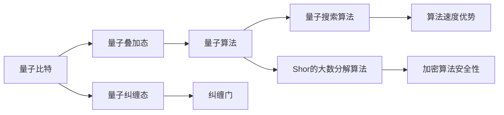
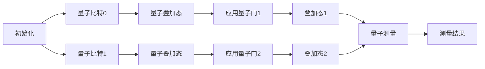

                 

# 计算：第四部分 计算的极限 第 10 章 量子计算 计算的最小能量

> 关键词：量子计算，计算最小能量，计算极限，量子算法，量子比特，量子纠缠

## 1. 背景介绍

量子计算是现代计算技术的前沿领域，它基于量子力学原理，采用量子比特和量子纠缠等特性，提供了一种全新的计算范式。量子计算在解决某些特定问题时具有传统计算无法企及的效率优势，比如在大数分解、搜索算法、最优化问题等领域展现出巨大潜力。然而，量子计算的实现面临诸多技术挑战，需要解决量子比特的稳定性和噪声问题，以及如何设计高效的量子算法。

## 2. 核心概念与联系

### 2.1 核心概念概述

为了更好地理解量子计算的基本原理和应用，我们需要对几个核心概念进行深入解析：

- **量子比特(Qubit)**：量子计算中的基本单位，与传统计算中的比特不同，它可以同时处于0和1的叠加态。量子比特的量子态由波函数描述，通过操作波函数可以实现量子计算。

- **量子叠加态和纠缠态**：量子比特可以处于多个状态的叠加态，这种叠加态提供了并行计算的可能性。量子纠缠态则是一种特殊的叠加态，其中多个量子比特的波函数紧密相关，一种量子比特的状态变化会立即影响到另一量子比特的状态，从而实现信息的高效传输和处理。

- **量子算法**：专门针对量子计算机设计的一类算法，例如量子搜索算法、Shor的大数分解算法等，这些算法在解决特定问题时，能够以指数级速度超越传统计算机。

- **量子纠缠和纠缠门**：通过特定的量子门操作，可以建立量子比特之间的纠缠态，从而提高量子计算机的计算能力。

- **量子误差纠正**：由于量子计算机的易错性，需要采用量子错误纠正代码来保护量子信息不被噪声破坏，确保计算的正确性。

这些核心概念通过量子计算的数学模型和算法构成了其完整的理论体系，并相互之间紧密关联。以下通过一张Mermaid流程图展示它们之间的联系：



### 2.2 核心概念原理和架构的 Mermaid 流程图


这个图展示了量子比特如何通过叠加和纠缠态构造出量子算法，并具体实例化如量子搜索和Shor的大数分解算法，最终展现量子计算在算法速度和安全性上的优势。

## 3. 核心算法原理 & 具体操作步骤

### 3.1 算法原理概述

量子计算的核心在于利用量子力学的特性，如叠加态和纠缠态，来构建高效的计算模型。与经典计算不同，量子计算的目标是减少计算过程中的能量消耗，而非单纯追求计算速度的提升。量子计算理论表明，在某些特定问题上，量子计算机可以在多项式时间内解决，而传统计算机需要指数时间。

### 3.2 算法步骤详解

量子计算的实现步骤大致分为：

1. **初始化量子比特**：将量子比特初始化为标准基态。
2. **执行量子门操作**：通过量子门操作对量子比特进行逻辑运算，引入叠加态和纠缠态。
3. **量子测量**：测量量子比特，获取结果并记录。
4. **误差纠正**：对测量结果进行纠错处理，确保计算准确性。

下面以Shor的大数分解算法为例，详细讲解其实现步骤：

1. **算法准备**：选取一个大整数$N$，进行分解。
2. **初始化量子比特**：创建$a$个量子比特，每个比特为0和1的叠加态，$a$的大小需要满足某些条件。
3. **应用量子傅立叶变换**：在量子比特上应用量子傅立叶变换，将叠加态转化为另一个叠加态。
4. **寻找次模方程解**：通过经典计算验证上述变换结果中是否存在次模方程的整数解。
5. **分解$N$**：利用已知的次模方程解，对$N$进行分解。

### 3.3 算法优缺点

量子计算的优势在于其处理特定问题的能力，比如在大数分解和搜索问题上展示了显著优势。但同时也面临以下几个挑战：

- **技术实现难度大**：量子计算需要解决量子比特的稳定性和噪声问题，目前还存在诸多技术挑战。
- **资源需求高**：量子计算的实现需要大量的物理资源，包括超导量子比特、离子阱等，成本较高。
- **算法设计复杂**：设计高效的量子算法需要深厚的理论基础和大量的实验验证。
- **易错性**：量子比特容易受环境干扰，导致计算结果错误。

尽管如此，量子计算仍在不断进步，量子比特的稳定性、量子纠错技术、量子算法设计等都在逐步取得进展。

### 3.4 算法应用领域

量子计算技术在以下几个领域展现出巨大潜力：

- **密码学**：Shor的大数分解算法可以破解现有的公钥加密体系，如RSA加密算法。
- **优化问题**：量子算法可以在某些优化问题上提供更高效的解决方案。
- **搜索和模拟**：量子搜索算法和量子蒙特卡洛方法在搜索和模拟领域展现出良好效果。
- **量子化学**：量子计算可以模拟复杂分子和化学反应过程，帮助发现新材料和新药物。
- **人工智能**：量子计算可应用于机器学习和模式识别，提高计算效率。

## 4. 数学模型和公式 & 详细讲解 & 举例说明

### 4.1 数学模型构建

量子计算的理论基础是量子力学，包括量子叠加态、量子纠缠、量子门操作等概念。我们可以使用数学模型来描述这些概念，以下是一个简单的量子电路模型：



在这个模型中，量子比特0和1通过量子门操作后形成叠加态，再通过量子测量获得最终结果。

### 4.2 公式推导过程

以Shor的大数分解算法为例，其核心公式是量子傅立叶变换，将输入的叠加态转化为另一个叠加态。假设输入为$|+\rangle$，量子傅立叶变换的公式为：

$$
F(|+\rangle) = \frac{1}{\sqrt{N}} \sum_{k=0}^{N-1} e^{-2\pi i k^2 / N}|k\rangle
$$

其中，$e^{-2\pi i k^2 / N}$表示复数$e$的幂次方。

### 4.3 案例分析与讲解

Shor的大数分解算法是量子计算的里程碑算法之一。其基本原理是将大数分解问题转化为次模方程的求解问题，利用量子傅立叶变换和经典计算相结合的方式，在多项式时间内完成分解。以下是一个简化的示例：

设$N = p^r q$，其中$p$和$q$为质数。算法步骤如下：

1. 初始化量子比特，令$a=2^k$，其中$k$为满足$2^{a-1} > \sqrt{\ln N}$的最小整数。
2. 应用量子傅立叶变换，得到新的叠加态$|\Psi\rangle$。
3. 进行经典计算，验证$|\Psi\rangle$中是否存在整数$x$满足$x^2 \equiv N \pmod p$。
4. 若存在，返回$p$和$q$；否则，返回$N$。

这一算法的时间复杂度为$O(\log^{3/2} N)$，远远低于经典计算中的$O(\sqrt{N})$。

## 5. 项目实践：代码实例和详细解释说明

### 5.1 开发环境搭建

量子计算的实现需要特定的环境，可以使用Qiskit库进行量子程序的编写和运行。

1. 安装Qiskit库：
   ```bash
   pip install qiskit
   ```

2. 安装IBM Q系统：
   ```bash
   python -m pip install ibmq-provider --upgrade
   ```

3. 搭建环境，配置IBM Q账号，验证访问权限：
   ```python
   from ibm_q import least_favorite_provider
   provider = least_favorite_provider
   provider.load_account()
   ```

### 5.2 源代码详细实现

以下是一个简单的量子搜索算法示例，使用Qiskit库实现：

```python
from qiskit import QuantumCircuit, execute, Aer
from qiskit.visualization import plot_bloch_multivector
from qiskit import QuantumRegister, ClassicalRegister

# 创建量子比特和经典比特
qr = QuantumRegister(2)
cr = ClassicalRegister(1)
circuit = QuantumCircuit(qr, cr)

# 初始化量子比特到0态
circuit.h(qr[0]) # 对第一个量子比特进行Hadamard变换

# 应用量子门
circuit.cx(qr[0], qr[1]) # 实现量子比特间的控制非门操作

# 量子测量
circuit.measure(qr, cr)

# 运行量子程序
backend = Aer.get_backend('qasm_simulator')
result = execute(circuit, backend).result()

# 输出结果
counts = result.get_counts()
print(counts)
```

### 5.3 代码解读与分析

- **Hadamard变换**：通过应用Hadamard门，将量子比特从0态变换到$\frac{1}{\sqrt{2}}(|0\rangle+|1\rangle)$的叠加态。
- **控制非门(CX门)**：实现量子比特之间的量子逻辑门操作，其中一个比特作为控制比特，另一个作为目标比特，实现两比特间的逻辑运算。
- **量子测量**：将量子比特的状态测量出来，转化为经典比特的0或1。

### 5.4 运行结果展示

运行上述代码，可以得到量子比特的最终测量结果。在量子计算中，不同的初始状态和量子门操作可能导致不同的测量结果，展示出量子计算的并行性和随机性。

## 6. 实际应用场景

### 6.1 密码学

量子计算对传统密码学构成重大威胁，特别是公钥加密算法，如RSA和ECC，可以采用Shor的大数分解算法进行破解。量子计算机可以高效地分解大数，因此需要开发基于量子安全的加密算法，如量子密钥分发和量子随机数生成等。

### 6.2 优化问题

量子算法如Grover的搜索算法，可以在某些优化问题上提供更高效的解决方案，例如在经典计算中需要指数时间求解的问题，量子计算可以多项式时间内解决。

### 6.3 搜索和模拟

量子搜索算法和量子蒙特卡洛方法在搜索和模拟领域展现出良好效果，例如在分子和化学反应模拟、金融市场模拟等方面有潜在应用。

### 6.4 未来应用展望

未来，量子计算将在更多领域得到应用，包括生物信息学、材料科学、人工智能等，这些领域中存在大量需要高效率求解的问题，量子计算能够提供有效的解决方案。

## 7. 工具和资源推荐

### 7.1 学习资源推荐

1. 《量子计算导论》：由Mike A. Nielsen和Michael J. Mohsen编，系统介绍了量子计算的理论基础和基本原理。
2. 《量子信息与计算》：由Peter W. Shor、Daniel Gottesman、Greg Kaiser等编写，是量子信息学的经典教材。
3. Qiskit官方文档和教程：Qiskit是IBM推出的量子计算框架，提供了丰富的文档和示例代码，适合量子计算的学习和实践。
4. IBM Q Experience：IBM提供的量子计算云服务平台，用户可以在云端进行量子计算的实验和探索。

### 7.2 开发工具推荐

1. Qiskit：IBM开发的量子计算框架，提供了丰富的量子算法和量子电路操作。
2. IBM Q Experience：量子计算云服务平台，用户可以在云端进行量子计算实验。
3. Qiskit Aqua：IBM提供的量子计算应用平台，支持开发和部署量子算法。

### 7.3 相关论文推荐

1. Peter W. Shor, "Algorithms for Quantum Computation: Discrete Logarithms and Factoring"（《量子计算中的算法：离散对数和因式分解》）
2. Lov Grover, "A Fast Quantum Mechanical Algorithm for Database Search"（《量子计算中的数据库搜索算法》）
3. Richard Jozsa and Charles H. Bennett, "Quantum Computers and Quantum Factorization"（《量子计算机和量子分解》）

## 8. 总结：未来发展趋势与挑战

### 8.1 研究成果总结

量子计算作为一种新型计算范式，在多个领域展示了其强大的计算能力。Shor的大数分解算法、Grover的搜索算法等经典量子算法，展示了量子计算在特定问题上的高效性。

### 8.2 未来发展趋势

1. **量子计算硬件发展**：量子比特的稳定性和噪声问题得到进一步解决，量子计算机的实际应用将更加广泛。
2. **量子算法优化**：新的量子算法不断涌现，解决更多传统计算中难以解决的问题。
3. **量子计算网络**：构建量子计算网络，实现量子计算机之间的互联互通。
4. **量子安全通信**：发展量子密钥分发等量子安全通信技术，保障通信安全性。

### 8.3 面临的挑战

1. **量子比特稳定性和噪声**：量子比特的物理实现需要解决稳定性问题和噪声干扰。
2. **算法设计复杂**：设计高效的量子算法需要深厚的理论基础和大量实验验证。
3. **资源消耗高**：量子计算的实现需要大量的物理资源，包括超导量子比特、离子阱等，成本较高。
4. **量子错误纠正**：量子比特容易受环境干扰，导致计算结果错误，需要有效的量子错误纠正技术。

### 8.4 研究展望

量子计算的未来发展需要解决上述挑战，进一步提升量子比特的稳定性和纠错能力，开发更多高效的量子算法，推动量子计算的实际应用。

## 9. 附录：常见问题与解答

**Q1: 量子计算与传统计算有何不同？**

A: 量子计算利用量子比特和量子纠缠等特性，实现并行计算和高效信息传输，能够在某些特定问题上显著超越传统计算。

**Q2: 量子比特的稳定性如何保证？**

A: 量子比特的稳定性需要通过低温冷却、量子纠错等技术手段进行保障，减少环境干扰和噪声影响。

**Q3: 量子计算的应用场景有哪些？**

A: 量子计算在密码学、优化问题、搜索和模拟等领域展现出巨大潜力，如Shor的大数分解算法、Grover的搜索算法等。

**Q4: 量子计算的实现需要哪些资源？**

A: 量子计算的实现需要超导量子比特、离子阱等物理资源，以及强大的量子算法和量子错误纠正技术。

**Q5: 量子计算的发展前景如何？**

A: 量子计算作为一种前沿技术，具有解决传统计算难以解决的问题的潜力，未来将在更多领域得到应用，推动科技发展。

---

作者：禅与计算机程序设计艺术 / Zen and the Art of Computer Programming

