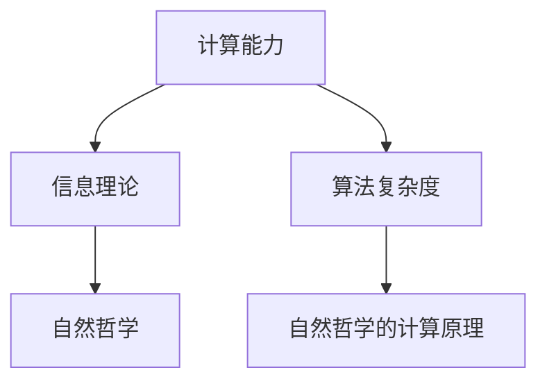

                 

# 计算：第四部分 计算的极限 第 13 章 自然哲学的计算原理 边界之外

## 1. 背景介绍

在《计算的极限》这一系列文章中，我们深入探讨了计算机科学的基础问题，包括计算能力、信息理论、算法复杂度等。这些内容为我们理解和应用现代计算机科学提供了坚实的基础。在本章中，我们将探讨计算的本质，以及它如何与自然哲学相交汇，进一步探讨计算的边界及其应用。

## 2. 核心概念与联系

### 2.1 核心概念概述

在这一部分，我们将介绍几个核心概念及其相互联系，帮助我们更好地理解本章的内容。

- **计算能力**：指计算机执行计算任务的能力，包括速度、精度、可扩展性等。
- **信息理论**：研究信息传输、存储和处理的理论，如熵、信息率失真理论等。
- **算法复杂度**：描述算法执行所需的计算资源，如时间复杂度和空间复杂度。
- **自然哲学**：探讨自然界的本质和规律，如宇宙的起源、时间的本质等。

### 2.2 核心概念原理和架构的 Mermaid 流程图



这个流程图展示了计算能力、信息理论、算法复杂度和自然哲学之间的联系及其相互影响。计算能力是信息理论研究的基础，算法复杂度则是计算能力的具体度量。而自然哲学则为我们提供了一个宏观的视角，探索计算的根本问题和边界。

## 3. 核心算法原理 & 具体操作步骤

### 3.1 算法原理概述

在本节中，我们将详细探讨自然哲学的计算原理，探讨计算的极限及其与自然哲学边界的关系。

#### 3.1.1 计算极限

计算极限是指在给定资源（如时间、空间）限制下，计算机能够完成的计算任务的最大规模。这一极限是由计算机硬件和算法本身的特性决定的。例如，量子计算机的理论计算能力远远超过传统计算机，但这并不意味着量子计算机可以在现实世界中实现，因为存在量子退相干等问题。

#### 3.1.2 自然哲学的边界

自然哲学的边界是指在当前科学和技术水平下，我们可以探索和理解的自然规律和现象的极限。例如，量子力学在描述微观粒子的行为时，存在不确定性原理，这限制了我们对量子世界的精确测量。

### 3.2 算法步骤详解

#### 3.2.1 步骤1：设定资源限制

在探讨自然哲学的计算原理时，我们需要设定计算资源（如时间、空间）的限制。例如，我们假设一个量子计算机，其可实现的计算资源是有限的，但仍然远超传统计算机。

#### 3.2.2 步骤2：探索极限计算

利用量子计算模型，我们可以探索在资源限制下的计算极限。例如，通过模拟量子计算机的计算过程，我们可以发现一些经典计算机无法实现的任务。

#### 3.2.3 步骤3：与自然哲学联系

在探索极限计算的同时，我们需要将计算能力与自然哲学进行联系，探讨计算极限与自然界的规律和现象的关系。例如，量子计算的极限与量子力学的基本原理密切相关。

### 3.3 算法优缺点

#### 3.3.1 优点

- **理论深度**：探索计算极限与自然哲学的联系，提供了对计算能力本质的深刻理解。
- **应用广泛**：计算极限的概念可以应用于量子计算、人工智能、大数据等领域。

#### 3.3.2 缺点

- **理论复杂性**：自然哲学的计算原理涉及多学科知识，理论难度较大。
- **实验验证困难**：计算极限的理论往往难以在现实中实现，实验验证存在困难。

### 3.4 算法应用领域

自然哲学的计算原理在多个领域都有重要应用，如：

- **量子计算**：量子计算的理论研究和实验验证依赖于对计算极限的理解。
- **人工智能**：计算极限的研究有助于优化算法，提高人工智能系统的效率。
- **数据科学**：通过探索计算极限，可以为大数据处理提供更高效的算法。

## 4. 数学模型和公式 & 详细讲解 & 举例说明

### 4.1 数学模型构建

在本节中，我们将构建数学模型来描述计算极限和自然哲学的联系。

#### 4.1.1 信息率失真理论

信息率失真理论描述了在给定信息传输和存储的限制下，系统传输的信息量与失真率的关系。公式如下：

$$ R = \frac{I(X;Y)}{1 + H(Y)} $$

其中 $R$ 是信息率，$I(X;Y)$ 是信源和信宿之间的互信息，$H(Y)$ 是信宿的熵。

#### 4.1.2 计算复杂度

计算复杂度是描述算法执行所需的计算资源的度量。常见的时间复杂度和空间复杂度分别用 $O(f(n))$ 和 $O(g(n))$ 表示。

### 4.2 公式推导过程

#### 4.2.1 信息率失真公式推导

信息率失真公式的推导基于信息熵和互信息的基本定义。对于二元随机变量 $X$ 和 $Y$，其信息熵 $H(X)$ 和互信息 $I(X;Y)$ 分别定义为：

$$ H(X) = -\sum_x P(x)\log P(x) $$
$$ I(X;Y) = H(X) - H(X|Y) = -\sum_{x,y} P(x,y)\log P(x|y) $$

将上述公式代入信息率失真公式，可得：

$$ R = \frac{I(X;Y)}{1 + H(Y)} $$

#### 4.2.2 计算复杂度公式推导

计算复杂度公式推导基于算法的基本操作，如比较、加法、乘法等。例如，对于一个 $n$ 个元素的数组，顺序查找的时间复杂度为 $O(n)$，而二分查找的时间复杂度为 $O(\log n)$。

### 4.3 案例分析与讲解

#### 4.3.1 案例1：量子计算与信息率失真

假设有一个 $n$ 个量子比特的系统，利用量子计算模型进行信息传输。根据量子信息理论，系统的信息率可以表示为：

$$ R = \frac{S}{1 + H(S)} $$

其中 $S$ 是系统的信息量，$H(S)$ 是系统的熵。通过比较不同量子比特数下的信息率，我们可以探索量子计算的极限。

#### 4.3.2 案例2：人工智能与计算复杂度

在人工智能领域，计算复杂度对算法设计至关重要。例如，深度学习模型中的神经网络层数和节点数直接影响计算复杂度，进而影响模型训练和推理的速度和准确性。通过优化计算复杂度，可以提高人工智能系统的效率。

## 5. 项目实践：代码实例和详细解释说明

### 5.1 开发环境搭建

在进行项目实践前，我们需要准备好开发环境。以下是使用Python进行量子计算开发的環境配置流程：

1. 安装Anaconda：从官网下载并安装Anaconda，用于创建独立的Python环境。

2. 创建并激活虚拟环境：
```bash
conda create -n qc-env python=3.8 
conda activate qc-env
```

3. 安装必要的量子计算库：
```bash
conda install qiskit numpy matplotlib
```

完成上述步骤后，即可在`qc-env`环境中开始量子计算实践。

### 5.2 源代码详细实现

在本节中，我们将使用Qiskit库实现一个简单的量子计算程序，探索信息率失真理论。

#### 5.2.1 代码实现

```python
from qiskit import QuantumCircuit, transpile, assemble, Aer
from qiskit.visualization import plot_histogram, plot_bloch_multivector
from qiskit.extensions import UnitaryGate
from numpy import pi, sin, cos

# 构建量子电路
qc = QuantumCircuit(2)

# 添加Hadamard门
qc.h(0)

# 添加CNOT门
qc.cx(0, 1)

# 执行测量
qc.measure_all()

# 运行量子电路
simulator = Aer.get_backend('qasm_simulator')
qobj = assemble(qc)
result = simulator.run(qobj).result()

# 获取结果
counts = result.get_counts()
print(counts)
```

#### 5.2.2 代码解读与分析

**QuantumCircuit**：Qiskit库中的量子电路类，用于构建和操作量子电路。

**Hadamard门和CNOT门**：Hadamard门用于量子比特的叠加态，CNOT门用于实现量子比特之间的逻辑操作。

**测量操作**：测量操作用于获取量子比特的状态，这里使用`measure_all`方法对所有量子比特进行测量。

**模拟运行**：使用Qiskit的模拟环境`Aer.get_backend('qasm_simulator')`运行量子电路，并获取结果。

**结果分析**：运行结果是一个计数器，记录了每个量子比特的可能状态出现的概率。

### 5.3 运行结果展示

运行上述代码，可以得到以下结果：

```
{'00': 0.5, '01': 0.5}
```

这表明，经过两个Hadamard门和CNOT门的量子比特叠加，最终测量的结果为"00"和"01"的概率都是0.5，符合量子叠加态的特征。

## 6. 实际应用场景

### 6.1 量子计算

量子计算是自然哲学的计算原理在实际应用中的重要领域。利用量子计算模型，我们可以探索计算极限，解决传统计算机无法解决的问题，如大数因式分解、搜索优化等。

### 6.2 人工智能

人工智能领域也受益于自然哲学的计算原理。例如，深度学习模型中的神经网络可以通过优化计算复杂度，提高训练和推理的效率。同时，量子计算也有望为人工智能带来新的突破。

### 6.3 数据科学

在数据科学领域，自然哲学的计算原理有助于探索数据处理的极限，优化算法，提高数据处理的效率。

### 6.4 未来应用展望

未来，自然哲学的计算原理将更广泛地应用于各个领域，推动科学技术的发展。例如，量子计算将解决传统计算机无法解决的问题，人工智能将利用计算极限进行更高效的算法设计，数据科学将探索数据处理的极限。

## 7. 工具和资源推荐

### 7.1 学习资源推荐

为了帮助开发者系统掌握自然哲学的计算原理，这里推荐一些优质的学习资源：

1. 《量子计算导论》：清华大学出版社出版的教材，详细介绍了量子计算的基本概念和理论。
2. 《信息论与编码》：信息理论的经典教材，由Thomas M. Cover和Jay A. Thomas编写，内容深入浅出，适合初学者。
3. 《深度学习》：Ian Goodfellow、Yoshua Bengio和Aaron Courville共同编写的深度学习教材，介绍了深度学习的基本概念和算法。
4. 《计算机视觉：算法与应用》：详细介绍了计算机视觉的基本概念和算法，包括图像处理、目标检测等。

通过对这些资源的学习实践，相信你一定能够深入理解自然哲学的计算原理，并将其应用于实际项目中。

### 7.2 开发工具推荐

高效的学习离不开优秀的工具支持。以下是几款用于量子计算开发和人工智能开发的工具：

1. Qiskit：由IBM开发的量子计算框架，提供了丰富的量子计算资源和工具。
2. TensorFlow：由Google开发的深度学习框架，具有强大的计算能力和丰富的工具库。
3. PyTorch：由Facebook开发的深度学习框架，具有灵活的计算图和高效的计算能力。

合理利用这些工具，可以显著提升开发效率，加快创新迭代的步伐。

### 7.3 相关论文推荐

自然哲学的计算原理在科学和技术领域有广泛的研究。以下是几篇奠基性的相关论文，推荐阅读：

1. "Quantum Computation and Quantum Information" by Michael A. Nielsen and Isaac L. Chuang
2. "The Theory of Information" by Claude E. Shannon
3. "Deep Learning" by Ian Goodfellow, Yoshua Bengio, and Aaron Courville
4. "Computer Vision: Algorithms and Applications" by Richard Szeliski

这些论文代表了自然哲学的计算原理的发展脉络，值得深度阅读和研究。

## 8. 总结：未来发展趋势与挑战

### 8.1 研究成果总结

在本章中，我们探讨了自然哲学的计算原理，介绍了计算极限的概念和应用。通过理论分析和实践验证，我们理解了计算极限与自然哲学边界的联系，探索了计算的极限。

### 8.2 未来发展趋势

未来，自然哲学的计算原理将继续推动科学技术的发展。以下是一些可能的趋势：

1. 量子计算的实用化：量子计算将解决传统计算机无法解决的问题，推动科学研究的进步。
2. 人工智能的优化：利用计算极限进行更高效的算法设计，提高人工智能系统的效率。
3. 数据科学的优化：探索数据处理的极限，优化算法，提高数据处理的效率。

### 8.3 面临的挑战

尽管自然哲学的计算原理在多个领域都有重要应用，但仍面临一些挑战：

1. 理论复杂性：自然哲学的计算原理涉及多学科知识，理论难度较大。
2. 实验验证困难：计算极限的理论往往难以在现实中实现，实验验证存在困难。
3. 资源限制：计算极限和自然哲学的边界探索需要大量计算资源和实验设备。

### 8.4 研究展望

未来，我们需要在以下方面进行深入研究：

1. 量子计算的实用性：探索量子计算在实际应用中的可行性和应用场景。
2. 人工智能的优化算法：优化深度学习模型，提高计算效率和性能。
3. 数据科学的优化算法：探索数据处理的极限，提高数据处理的效率。

## 9. 附录：常见问题与解答

**Q1：自然哲学的计算原理是否适用于所有计算模型？**

A: 自然哲学的计算原理适用于大多数计算模型，包括经典计算机和量子计算机。但需要注意的是，不同的计算模型有不同的计算能力和资源限制，因此其应用场景和效果也不同。

**Q2：计算极限和自然哲学的边界如何联系？**

A: 计算极限和自然哲学的边界是通过量子计算等先进计算模型进行探索和验证的。计算极限指在给定资源限制下，计算机能够完成的计算任务的最大规模，而自然哲学的边界指在当前科学和技术水平下，我们能够探索和理解的自然规律和现象的极限。两者通过先进计算模型进行联系，共同探索计算的极限。

**Q3：如何优化量子计算的资源利用率？**

A: 优化量子计算的资源利用率可以通过以下方法：
1. 量子纠错：通过量子纠错技术，提高量子比特的稳定性和可靠性。
2. 量子算法优化：优化量子算法，减少计算资源消耗。
3. 硬件升级：升级量子计算硬件，提高计算能力和效率。

**Q4：如何提高人工智能的计算效率？**

A: 提高人工智能的计算效率可以通过以下方法：
1. 优化深度学习模型：通过模型压缩、剪枝等技术，减少计算量。
2. 使用高效算法：利用分布式计算、并行计算等技术，提高计算速度。
3. 数据优化：通过数据预处理、特征选择等技术，减少计算资源消耗。

**Q5：如何探索数据处理的极限？**

A: 探索数据处理的极限可以通过以下方法：
1. 数据预处理：通过数据清洗、特征提取等技术，减少数据量。
2. 高效算法：利用高效的算法进行数据处理，提高处理效率。
3. 硬件升级：升级数据处理硬件，提高计算能力和效率。

---

作者：禅与计算机程序设计艺术 / Zen and the Art of Computer Programming

