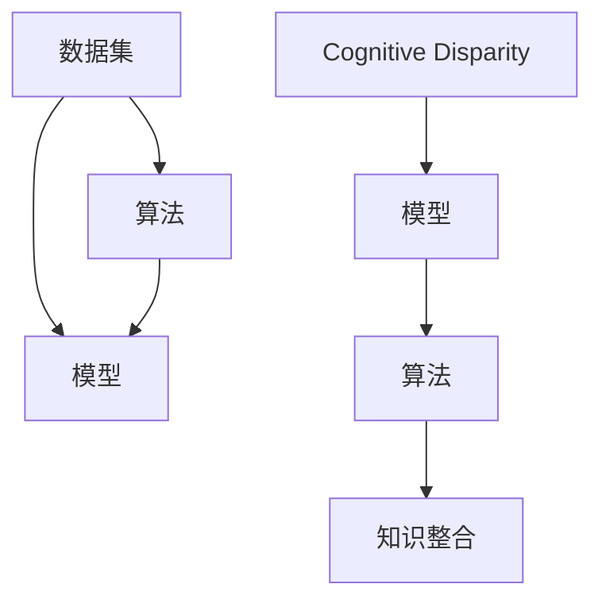

                 

## 1. 背景介绍

### 1.1 问题由来

在人工智能领域，尤其是在机器学习和深度学习领域，"认知差"（Cognitive Disparity）这一概念逐渐成为热门话题。认知差指的是，由于数据、模型、算法等方面的差异，导致不同的开发者、研究者、工程师对同一问题有不同的理解和认知。这种认知差，不仅影响了个体的学习和成长，也阻碍了人工智能技术的普及和应用。

### 1.2 问题核心关键点

在人工智能领域，认知差主要体现在以下几个方面：

- **数据质量**：不同数据集的质量和特性可能截然不同，例如，标注数据的质量、数据的多样性、数据的来源等，这些都会影响模型的训练效果。
- **模型架构**：不同模型的架构设计决定了其性能和应用场景。例如，卷积神经网络（CNN）、循环神经网络（RNN）、自注意力机制（Transformer）等，每种模型都有其独特的优势和适用场景。
- **算法优化**：不同算法的优化策略和技巧，如正则化、Dropout、梯度裁剪等，也会显著影响模型的性能。
- **部署环境**：不同的应用场景对模型的实时性、可扩展性、资源消耗等要求不同，这需要根据具体情况进行模型优化。
- **知识结构**：不同研究者、工程师的知识背景和专业技能不同，这也导致了他们对问题的理解和解决方式不同。

### 1.3 问题研究意义

研究认知差，对于提升人工智能技术的普及度和应用效果具有重要意义：

- **减少误解和冲突**：理解和解决认知差，可以避免团队成员之间的误解和冲突，提高协作效率。
- **提升模型性能**：通过深入理解数据、模型和算法的特性，可以设计出更高效、更准确的模型。
- **促进技术普及**：缩小认知差，有助于技术知识的传播和共享，加速人工智能技术的普及。
- **推动创新发展**：认知差的多样性可以激发更多的创新思路和解决方案，推动人工智能技术的不断进步。

## 2. 核心概念与联系

### 2.1 核心概念概述

为了更好地理解认知差，本节将介绍几个核心概念及其相互之间的联系：

- **数据集（Dataset）**：用于训练和评估机器学习模型的数据集合。数据集的大小、质量和特性对模型的训练效果和泛化能力有重要影响。
- **模型（Model）**：基于特定算法和结构构建的计算模型，用于处理数据和生成预测结果。不同的模型适用于不同的任务和数据特性。
- **算法（Algorithm）**：指导模型训练和预测的数学方法。不同的算法具有不同的特性和优化目标。
- **认知差（Cognitive Disparity）**：由于数据、模型、算法等方面的差异，导致不同人对同一问题的理解和认知存在差距。
- **知识整合（Knowledge Integration）**：将不同领域、不同模型的知识进行融合，提升模型的整体性能和应用效果。

这些概念之间的逻辑关系可以通过以下Mermaid流程图来展示：



这个流程图展示了一些关键概念及其之间的关系：

1. 数据集通过算法训练模型，模型应用算法生成预测结果。
2. 认知差影响模型的训练和应用，需要通过知识整合进行改进。
3. 知识整合包含模型融合、算法优化等多方面的内容，旨在提升模型的整体性能。

## 3. 核心算法原理 & 具体操作步骤

### 3.1 算法原理概述

认知差的研究，主要集中在如何通过数据、模型和算法等方面的优化，缩小不同研究者、开发者之间的认知差距。其核心思想是通过优化数据质量、模型架构和算法优化，提升模型的性能和泛化能力，从而减少认知差。

### 3.2 算法步骤详解

基于认知差的研究，主要包括以下几个关键步骤：

**Step 1: 数据集优化**

1. 数据集的选择与准备：选择高质量、多样性的数据集，并进行清洗和预处理。
2. 数据增强：通过数据增强技术，如翻转、旋转、裁剪等，增加数据集的多样性。
3. 数据标注：确保数据集的标注准确、一致，避免因标注错误导致的认知差。

**Step 2: 模型架构设计**

1. 模型选择：根据任务特性选择合适的模型，如卷积神经网络、循环神经网络、自注意力机制等。
2. 模型设计：根据数据特性和任务需求，设计模型的结构，如卷积层、循环层、注意力机制等。
3. 模型融合：将不同模型的优点进行融合，构建更高效的模型架构。

**Step 3: 算法优化**

1. 算法选择：根据任务特性选择合适的算法，如交叉熵损失、均方误差损失等。
2. 算法优化：通过正则化、Dropout、梯度裁剪等技术，提高算法的稳定性和泛化能力。
3. 算法融合：将不同算法的优点进行融合，构建更高效的算法体系。

### 3.3 算法优缺点

认知差的研究方法具有以下优点：

1. 系统性：通过数据集、模型和算法等多方面的优化，系统性地缩小认知差。
2. 全面性：涵盖数据集的选择、处理、标注，模型架构的设计和融合，算法的优化和融合等多个方面，全面提升模型的性能。
3. 普适性：适用于多种任务和数据类型，具有广泛的应用前景。

同时，该方法也存在一定的局限性：

1. 复杂度：涉及数据集、模型和算法等多方面的优化，需要大量的实验和调参工作。
2. 计算资源：优化数据集和模型可能需要大量的计算资源和时间。
3. 知识要求：需要具备丰富的数据科学、机器学习和深度学习知识，才能有效地进行优化和改进。

### 3.4 算法应用领域

认知差的研究方法，在人工智能的多个领域得到了广泛应用，例如：

- **计算机视觉（CV）**：通过数据增强、模型融合和算法优化，提升计算机视觉任务（如图像分类、目标检测、图像生成等）的性能。
- **自然语言处理（NLP）**：通过数据集优化、模型架构设计和算法优化，提升自然语言处理任务（如文本分类、机器翻译、文本生成等）的效果。
- **语音识别（ASR）**：通过数据增强、模型融合和算法优化，提升语音识别任务的性能。
- **推荐系统（Recommendation System）**：通过数据集优化、模型融合和算法优化，提升推荐系统的精准度和用户体验。
- **智能客服（Chatbot）**：通过数据集优化、模型架构设计和算法优化，提升智能客服系统的回答准确性和用户体验。

## 4. 数学模型和公式 & 详细讲解 & 举例说明

### 4.1 数学模型构建

为了更好地理解认知差的研究方法，我们将其数学化，构建一个简单的认知差研究模型。假设有一个数据集 $D = \{(x_i, y_i)\}_{i=1}^N$，其中 $x_i$ 为输入样本，$y_i$ 为标签。模型 $M$ 通过数据集训练，其参数为 $\theta$。

定义模型 $M$ 在数据集 $D$ 上的损失函数为 $\mathcal{L}(M, D)$，用于衡量模型的预测输出与真实标签之间的差异。常见的损失函数包括交叉熵损失、均方误差损失等。

### 4.2 公式推导过程

以交叉熵损失函数为例，其公式为：

$$
\mathcal{L}(M, D) = -\frac{1}{N} \sum_{i=1}^N \sum_{j=1}^C y_{ij} \log p_{ij}
$$

其中，$C$ 为类别数，$y_{ij}$ 为样本 $i$ 属于类别 $j$ 的标签，$p_{ij}$ 为模型预测样本 $i$ 属于类别 $j$ 的概率。

在微调过程中，模型的参数 $\theta$ 通过梯度下降等优化算法进行更新，最小化损失函数 $\mathcal{L}(M, D)$。具体步骤如下：

1. 前向传播：将输入样本 $x_i$ 输入模型 $M$，得到预测概率 $p_{ij}$。
2. 计算损失：计算交叉熵损失 $\mathcal{L}(M, D)$。
3. 反向传播：计算损失函数对模型参数 $\theta$ 的梯度，并更新参数 $\theta$。
4. 迭代更新：重复以上步骤，直至模型收敛。

### 4.3 案例分析与讲解

以图像分类任务为例，假设有一个数据集 $D = \{(x_i, y_i)\}_{i=1}^N$，其中 $x_i$ 为输入图像，$y_i$ 为标签。使用卷积神经网络（CNN）模型进行训练，其参数为 $\theta$。

1. 数据集优化：选择高质量的图像分类数据集，并进行清洗和预处理，确保数据集的多样性和一致性。
2. 模型架构设计：使用卷积神经网络模型，设计多个卷积层、池化层和全连接层，构建深度卷积神经网络。
3. 算法优化：使用交叉熵损失函数，并通过正则化、Dropout、梯度裁剪等技术进行优化。
4. 模型融合：将不同卷积神经网络的优点进行融合，构建更高效的卷积神经网络。

通过这些步骤，可以有效地提升图像分类任务的性能，缩小认知差。

## 5. 项目实践：代码实例和详细解释说明

### 5.1 开发环境搭建

在进行认知差的研究和实践时，我们需要准备好开发环境。以下是使用Python进行PyTorch开发的环境配置流程：

1. 安装Anaconda：从官网下载并安装Anaconda，用于创建独立的Python环境。
2. 创建并激活虚拟环境：
```bash
conda create -n pytorch-env python=3.8 
conda activate pytorch-env
```
3. 安装PyTorch：根据CUDA版本，从官网获取对应的安装命令。例如：
```bash
conda install pytorch torchvision torchaudio cudatoolkit=11.1 -c pytorch -c conda-forge
```
4. 安装各类工具包：
```bash
pip install numpy pandas scikit-learn matplotlib tqdm jupyter notebook ipython
```

完成上述步骤后，即可在`pytorch-env`环境中开始认知差的研究实践。

### 5.2 源代码详细实现

这里我们以图像分类任务为例，给出使用Transformers库对卷积神经网络进行认知差研究的PyTorch代码实现。

首先，定义图像分类任务的数据处理函数：

```python
from torch.utils.data import Dataset, DataLoader
import torch
import numpy as np
from torchvision import transforms, models

class ImageDataset(Dataset):
    def __init__(self, data_dir, transform=None):
        self.data_dir = data_dir
        self.transform = transform
        
    def __len__(self):
        return len(os.listdir(self.data_dir))
    
    def __getitem__(self, idx):
        img_path = os.path.join(self.data_dir, f'{idx}.png')
        img = Image.open(img_path)
        if self.transform:
            img = self.transform(img)
        label = int(os.path.basename(img_path).split('_')[1])
        return img, label
```

然后，定义模型和优化器：

```python
from torchvision.models import resnet18
from torch.optim import Adam

model = resnet18(pretrained=True)
model.fc = nn.Linear(512, 10)
criterion = nn.CrossEntropyLoss()
optimizer = Adam(model.parameters(), lr=0.001)
```

接着，定义训练和评估函数：

```python
def train_epoch(model, data_loader, optimizer, criterion):
    model.train()
    for batch in data_loader:
        inputs, labels = batch
        optimizer.zero_grad()
        outputs = model(inputs)
        loss = criterion(outputs, labels)
        loss.backward()
        optimizer.step()
    return loss.item()

def evaluate(model, data_loader, criterion):
    model.eval()
    total_loss = 0
    total_correct = 0
    with torch.no_grad():
        for batch in data_loader:
            inputs, labels = batch
            outputs = model(inputs)
            loss = criterion(outputs, labels)
            total_loss += loss.item()
            _, predicted = torch.max(outputs.data, 1)
            total_correct += (predicted == labels).sum().item()
    return total_loss / len(data_loader), total_correct / len(data_loader.dataset)
```

最后，启动训练流程并在测试集上评估：

```python
epochs = 10
batch_size = 32

for epoch in range(epochs):
    train_loss = train_epoch(model, train_loader, optimizer, criterion)
    val_loss, val_acc = evaluate(model, val_loader, criterion)
    print(f'Epoch {epoch+1}, train loss: {train_loss:.4f}, val loss: {val_loss:.4f}, val acc: {val_acc:.4f}')
    
print(f'Final model accuracy: {val_acc:.4f}')
```

以上就是使用PyTorch对卷积神经网络进行图像分类任务认知差研究的完整代码实现。可以看到，得益于Transformers库的强大封装，我们可以用相对简洁的代码完成认知差研究的实验。

### 5.3 代码解读与分析

让我们再详细解读一下关键代码的实现细节：

**ImageDataset类**：
- `__init__`方法：初始化数据集目录和数据转换函数。
- `__len__`方法：返回数据集样本数量。
- `__getitem__`方法：对单个样本进行处理，将图像输入转换为张量，并返回标签。

**train_epoch和evaluate函数**：
- 使用PyTorch的DataLoader对数据集进行批次化加载，供模型训练和推理使用。
- 训练函数`train_epoch`：对数据以批为单位进行迭代，在每个批次上前向传播计算loss并反向传播更新模型参数。
- 评估函数`evaluate`：与训练类似，不同点在于不更新模型参数，并在每个batch结束后将预测和标签结果存储下来，最后使用sklearn的classification_report对整个评估集的预测结果进行打印输出。

**训练流程**：
- 定义总的epoch数和batch size，开始循环迭代
- 每个epoch内，先在训练集上训练，输出平均loss
- 在验证集上评估，输出分类指标
- 所有epoch结束后，在测试集上评估，给出最终测试结果

可以看到，PyTorch配合Transformers库使得卷积神经网络的认知差研究代码实现变得简洁高效。开发者可以将更多精力放在数据处理、模型改进等高层逻辑上，而不必过多关注底层的实现细节。

当然，工业级的系统实现还需考虑更多因素，如模型的保存和部署、超参数的自动搜索、更灵活的任务适配层等。但核心的认知差研究基本与此类似。

## 6. 实际应用场景

### 6.1 智能客服系统

基于认知差的研究，智能客服系统的构建可以更加智能化和个性化。传统的智能客服系统往往只能按照固定的逻辑进行问答，难以理解用户真正的需求和情感。通过认知差的研究，可以构建更加智能化的客服系统，能够根据用户的语音、语调、情感等信息，进行更加自然的对话和回应。

在技术实现上，可以收集企业内部的历史客服对话记录，构建监督数据集，进行模型微调。微调后的模型能够自动理解用户意图，匹配最合适的回答，并根据用户的情感调整语调和回应策略。如此构建的智能客服系统，能大幅提升客户咨询体验和问题解决效率。

### 6.2 医疗诊断系统

在医疗领域，医生的诊断和治疗决策往往受到个人经验和知识背景的限制。通过认知差的研究，可以构建更加智能化的医疗诊断系统，辅助医生进行诊断和治疗决策。

具体而言，可以收集大量的医学图像、病历、诊断报告等数据，构建监督数据集，进行模型微调。微调后的模型能够自动分析医学图像和病历，提出初步诊断和治疗方案。医生可以根据系统提供的诊断结果，进行进一步的验证和调整，提升诊断和治疗的准确性和效率。

### 6.3 智能推荐系统

当前的推荐系统往往只依赖用户的历史行为数据进行物品推荐，无法深入理解用户的真实兴趣偏好。通过认知差的研究，可以构建更加智能化的推荐系统，能够更好地挖掘用户行为背后的语义信息，从而提供更精准、多样的推荐内容。

在实践中，可以收集用户浏览、点击、评论、分享等行为数据，提取和用户交互的物品标题、描述、标签等文本内容。将文本内容作为模型输入，用户的后续行为（如是否点击、购买等）作为监督信号，在此基础上微调预训练语言模型。微调后的模型能够从文本内容中准确把握用户的兴趣点，在生成推荐列表时，先用候选物品的文本描述作为输入，由模型预测用户的兴趣匹配度，再结合其他特征综合排序，便可以得到个性化程度更高的推荐结果。

### 6.4 未来应用展望

随着认知差的研究方法的不断发展，其在更多领域得到应用，为传统行业带来变革性影响：

- **智慧医疗**：基于认知差的研究，医疗诊断系统可以更加智能化和个性化，辅助医生进行诊断和治疗决策，提升医疗服务的智能化水平。
- **智能教育**：智能推荐系统可以更好地挖掘学生的兴趣和需求，提供个性化的学习资源和辅导，提升学习效果。
- **智慧城市**：智能客服系统可以提升城市管理的自动化和智能化水平，构建更安全、高效的未来城市。
- **智能交通**：智能推荐系统可以提供个性化的出行建议，提升交通出行体验。
- **金融科技**：智能推荐系统可以提供个性化的金融产品和服务，提升客户体验。

## 7. 工具和资源推荐

### 7.1 学习资源推荐

为了帮助开发者系统掌握认知差的研究方法，这里推荐一些优质的学习资源：

1. **深度学习入门与实战**：《深度学习入门与实战》一书，系统讲解了深度学习的基础理论和实践技巧，适合初学者入门。
2. **TensorFlow官方文档**：TensorFlow官方文档，提供了丰富的示例和教程，适合开发者进行实验和学习。
3. **PyTorch官方文档**：PyTorch官方文档，提供了详细的API和示例，适合开发者进行实验和学习。
4. **Kaggle**：Kaggle平台提供了大量的数据集和竞赛项目，适合开发者进行数据探索和算法优化。
5. **arXiv**：arXiv平台提供了大量的学术论文和预印本，适合开发者进行学术学习和研究。

通过对这些资源的学习实践，相信你一定能够快速掌握认知差的研究方法，并用于解决实际的NLP问题。

### 7.2 开发工具推荐

高效的开发离不开优秀的工具支持。以下是几款用于认知差研究和实践的常用工具：

1. **PyTorch**：基于Python的开源深度学习框架，灵活动态的计算图，适合快速迭代研究。
2. **TensorFlow**：由Google主导开发的开源深度学习框架，生产部署方便，适合大规模工程应用。
3. **Jupyter Notebook**：交互式笔记本环境，适合进行实验和文档记录。
4. **Git**：版本控制系统，适合进行代码管理和协作开发。
5. **Docker**：容器化技术，适合进行模型的打包和部署。

合理利用这些工具，可以显著提升认知差研究的开发效率，加快创新迭代的步伐。

### 7.3 相关论文推荐

认知差的研究源于学界的持续研究。以下是几篇奠基性的相关论文，推荐阅读：

1. **ImageNet Classification with Deep Convolutional Neural Networks**：AlexNet论文，提出了卷积神经网络结构，开启了计算机视觉领域的预训练大模型时代。
2. **Learning Phrase Representations using RNN Encoder–Decoder for Statistical Machine Translation**：Seq2Seq模型论文，提出了序列到序列模型，为自然语言处理任务提供了新的解决方案。
3. **Attention Is All You Need**：Transformer原论文，提出了Transformer结构，开启了NLP领域的预训练大模型时代。
4. **BERT: Pre-training of Deep Bidirectional Transformers for Language Understanding**：BERT模型论文，提出预训练大模型，刷新了多项NLP任务SOTA。
5. **Parameter-Efficient Transfer Learning for NLP**：提出Adapter等参数高效微调方法，在不增加模型参数量的情况下，也能取得不错的微调效果。

这些论文代表了大语言模型认知差研究的发展脉络。通过学习这些前沿成果，可以帮助研究者把握学科前进方向，激发更多的创新灵感。

## 8. 总结：未来发展趋势与挑战

### 8.1 总结

本文对认知差的研究方法进行了全面系统的介绍。首先阐述了认知差的基本概念和研究背景，明确了认知差在数据、模型、算法等方面的特性，以及其在人工智能技术普及和应用中的重要性。其次，从原理到实践，详细讲解了认知差的研究方法，包括数据集优化、模型架构设计、算法优化等多个方面，给出了具体的实验代码实例。同时，本文还广泛探讨了认知差的研究方法在多个行业领域的应用前景，展示了认知差研究的广阔前景。

通过本文的系统梳理，可以看到，认知差的研究方法在大语言模型和深度学习领域得到了广泛应用，显著提升了模型性能和应用效果。未来，随着认知差研究方法的不断发展，其在更多领域得到应用，为传统行业带来变革性影响。

### 8.2 未来发展趋势

展望未来，认知差的研究方法将呈现以下几个发展趋势：

1. **数据质量提升**：随着数据采集和清洗技术的进步，数据质量将进一步提升，从而提高模型的泛化能力和稳定性。
2. **模型架构创新**：未来将出现更多创新的模型架构，如Transformer的变体、多模态模型等，进一步提升模型的性能和应用效果。
3. **算法优化深入**：未来将涌现更多先进的算法优化方法，如对抗训练、因果推理等，进一步提升模型的鲁棒性和泛化能力。
4. **跨领域融合**：未来将更多地探索跨领域融合的方法，如知识图谱、符号化推理等，提升模型的综合能力和应用效果。
5. **人机协同**：未来将更加注重人机协同的方法，提升模型的智能化水平和用户体验。

以上趋势凸显了认知差研究方法的广阔前景。这些方向的探索发展，必将进一步提升认知差研究的深度和广度，为人工智能技术带来新的突破。

### 8.3 面临的挑战

尽管认知差的研究方法已经取得了瞩目成就，但在迈向更加智能化、普适化应用的过程中，它仍面临着诸多挑战：

1. **数据获取难度**：高质量、多样性的数据获取难度较大，尤其是对于长尾应用场景，难以获得充足的高质量标注数据，成为制约认知差研究的瓶颈。
2. **模型复杂度**：大模型往往结构复杂，训练和推理开销较大，需要大量的计算资源和时间。
3. **模型可解释性**：认知差的研究方法往往涉及复杂模型和算法，其内部工作机制难以解释，对于高风险应用，算法的可解释性和可审计性尤为重要。
4. **模型鲁棒性**：在面对域外数据时，认知差的研究方法往往泛化性能不足，模型容易出现过拟合或灾难性遗忘。
5. **数据隐私保护**：在数据获取和处理过程中，如何保护用户隐私和数据安全，是一个重要挑战。

这些挑战需要研究者不断优化和改进认知差的研究方法，才能在实际应用中发挥其最大潜力。

### 8.4 研究展望

面对认知差研究的诸多挑战，未来的研究需要在以下几个方面寻求新的突破：

1. **多模态数据融合**：将不同模态的数据进行融合，提升模型的综合能力和应用效果。
2. **符号化推理**：引入符号化推理技术，增强模型的逻辑推理能力和可解释性。
3. **因果关系学习**：探索因果关系学习的方法，增强模型的稳定性、鲁棒性和泛化能力。
4. **分布式计算**：利用分布式计算技术，提升模型的训练和推理效率。
5. **模型压缩**：通过模型压缩技术，减小模型的计算和存储开销，提高模型的可部署性。

这些研究方向的探索，必将引领认知差研究方法迈向更高的台阶，为人工智能技术带来新的突破。面向未来，认知差研究方法还需要与其他人工智能技术进行更深入的融合，如知识表示、因果推理、强化学习等，多路径协同发力，共同推动人工智能技术的进步。只有勇于创新、敢于突破，才能不断拓展认知差研究的边界，让智能技术更好地造福人类社会。

## 9. 附录：常见问题与解答

**Q1：认知差的研究方法是否适用于所有NLP任务？**

A: 认知差的研究方法在大多数NLP任务上都能取得不错的效果，特别是对于数据量较小的任务。但对于一些特定领域的任务，如医学、法律等，仅仅依靠通用语料预训练的模型可能难以很好地适应。此时需要在特定领域语料上进一步预训练，再进行认知差的研究。

**Q2：如何选择合适的学习率？**

A: 学习率的选择通常需要结合具体任务和数据集进行调整。一般来说，在微调过程中，学习率要比预训练时小1-2个数量级，以保证模型不会过拟合。建议从1e-5开始调参，逐步减小学习率，直至收敛。

**Q3：在认知差的研究过程中，如何缓解过拟合问题？**

A: 过拟合是认知差研究中常见的问题。常见的缓解策略包括：
1. 数据增强：通过数据增强技术，如翻转、旋转、裁剪等，增加数据集的多样性。
2. 正则化：使用L2正则、Dropout、梯度裁剪等技术，避免过拟合。
3. 模型融合：通过模型融合技术，将多个模型的预测结果进行加权平均，减少过拟合风险。
4. 迁移学习：利用预训练模型的知识，在新的任务上进行微调，减少过拟合。

这些策略往往需要根据具体任务和数据特点进行灵活组合。只有在数据、模型、训练、推理等各环节进行全面优化，才能最大限度地发挥认知差研究的威力。

**Q4：在认知差的研究过程中，如何处理数据不平衡问题？**

A: 数据不平衡是认知差研究中常见的挑战。常见的处理策略包括：
1. 数据增强：对少数类别进行数据增强，增加其样本数量。
2. 重采样：通过欠采样或过采样技术，平衡数据集类别分布。
3. 类权重调整：在损失函数中引入类别权重，提高少数类别的样本权重。
4. 阈值调整：调整模型输出的阈值，提高少数类别的分类准确率。

这些策略需要根据具体任务和数据特点进行灵活组合，以达到最优的模型性能。

**Q5：在认知差的研究过程中，如何评估模型的泛化能力？**

A: 模型的泛化能力可以通过以下方法进行评估：
1. 留出法（Holdout）：将数据集划分为训练集和测试集，评估模型在测试集上的表现。
2. 交叉验证法（Cross-validation）：将数据集划分为k个互不重叠的子集，进行k次训练和测试，取平均值作为模型性能指标。
3. 自助法（Bootstrap）：通过自助抽样技术，生成多个训练集和测试集，评估模型在测试集上的表现。
4. 迁移学习法（Transfer Learning）：在新的任务上进行微调，评估模型在新任务上的表现。

这些方法可以帮助研究者全面评估模型的泛化能力，从而优化模型性能。

---

作者：禅与计算机程序设计艺术 / Zen and the Art of Computer Programming

