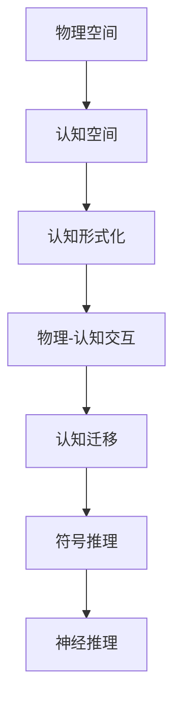
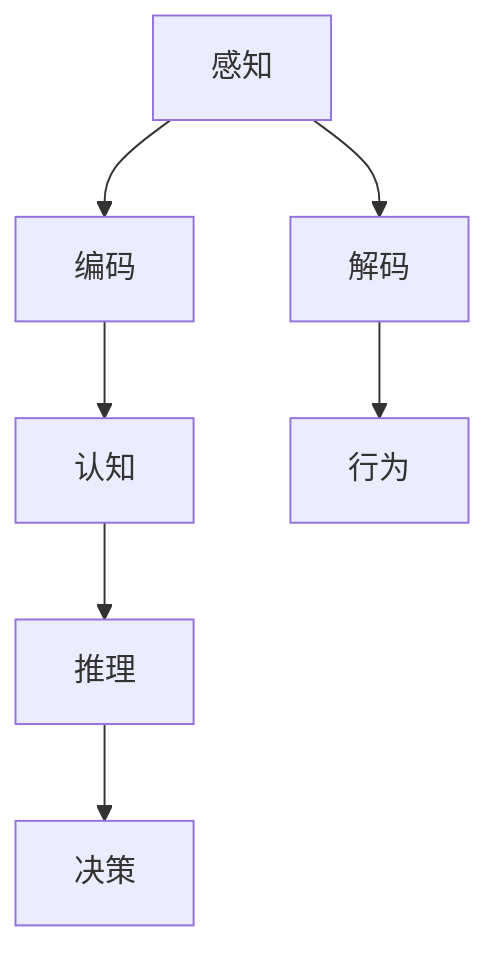

                 

# 认知的形式化：物理空间和认知空间的交互，激发了人类的想象力和创造力，激发了从感知到思维的再抽象

> 关键词：认知形式化, 物理空间, 认知空间, 想象力, 创造力, 感知, 思维, 人工智能, 深度学习, 神经网络

## 1. 背景介绍

### 1.1 问题由来
人类认知科学是探索思维、意识、记忆等认知过程的科学，致力于理解和模拟人类大脑的复杂运作机制。随着神经科学、心理学、计算科学等领域的交叉融合，认知科学的研究方法逐渐向计算化、模型化方向发展。认知形式化（Formalization of Cognition）是其中的关键一环，它将人类认知过程抽象为可计算模型，从而为认知研究和人工智能（AI）提供理论基础和技术支撑。

认知形式化涉及到认知过程与物理世界的交互，以及从感知到思维的抽象转换。本文将探讨这种交互和转换如何激发人类的想象力和创造力，推动人工智能技术的进步。

### 1.2 问题核心关键点
认知形式化的核心关键点在于如何将人类的认知过程模型化，并使其在物理世界和认知世界之间建立联系。这包括：

- 如何将感知信息转换为认知表示，并进一步抽象化。
- 如何利用认知表示进行推理、决策等认知任务。
- 如何处理物理世界的噪声、不确定性，确保认知过程的鲁棒性和可解释性。
- 如何将认知过程与外部环境交互，实现自适应和动态更新。

本文将从物理空间与认知空间的交互、认知形式的数学模型构建、认知形式化的应用实例三个方面进行详细阐述。

## 2. 核心概念与联系

### 2.1 核心概念概述

为更好地理解认知形式化的原理，我们需要先介绍几个核心概念：

- 物理空间（Physical Space）：指现实世界的物理状态，包括感知输入、环境动态、物理交互等。
- 认知空间（Cognitive Space）：指人类大脑中对物理空间抽象出来的认知表示，包括感知、记忆、推理等认知过程。
- 认知形式化（Formalization of Cognition）：将认知过程建模为计算过程，从而实现对认知过程的模拟、分析和应用。
- 物理-认知交互（Physical-Cognitive Interaction）：指物理空间和认知空间之间的信息交换和转换过程。
- 认知迁移（Cognitive Transfer）：指从物理空间到认知空间的抽象映射，以及从认知空间到物理空间的决策执行。
- 符号推理（Symbolic Reasoning）：指利用符号语言进行逻辑推理和决策的认知过程。
- 神经推理（Neural Reasoning）：指利用神经网络进行非线性推理和决策的认知过程。

这些概念之间的关系可以通过以下Mermaid流程图来展示：



这个流程图展示了认知过程的抽象和交互机制：

1. 物理空间通过感知输入转化为认知空间，这是认知过程的起点。
2. 认知空间通过符号和神经网络等形式化模型进行推理和决策。
3. 认知过程通过物理-认知交互与外部环境交互，实现自适应和动态更新。

### 2.2 核心概念原理和架构的 Mermaid 流程图



这个流程图展示了从感知到认知，再从认知到行为的整个过程：

1. 感知：从物理世界获取感知输入，如视觉、听觉等。
2. 编码：将感知输入转换为认知空间中的符号表示。
3. 认知：在符号表示上执行推理、决策等认知任务。
4. 解码：将认知结果转换为行为指令，执行反馈。
5. 行为：根据行为指令执行相应的物理动作。

## 3. 核心算法原理 & 具体操作步骤

### 3.1 算法原理概述

认知形式化的核心算法原理包括以下几个方面：

- 感知编码：将感知输入转换为符号表示。
- 认知推理：利用符号语言或神经网络进行逻辑推理和决策。
- 行为解码：将认知结果转换为物理动作。
- 交互反馈：通过交互结果对认知过程进行反馈，实现自适应更新。

这些过程通常由计算机程序和模型算法实现，如神经网络、逻辑规则、符号系统等。

### 3.2 算法步骤详解

认知形式化的算法步骤包括：

1. 数据采集：从物理空间获取感知输入。
2. 数据编码：将感知输入转换为认知表示。
3. 模型训练：训练符号或神经网络模型，使其能够执行认知推理。
4. 模型推理：使用训练好的模型进行认知推理和决策。
5. 行为执行：根据决策结果执行物理行为。
6. 反馈调整：根据行为结果和环境反馈，调整认知模型。

### 3.3 算法优缺点

认知形式化的优点包括：

- 能够模拟和理解人类认知过程，为AI提供理论基础。
- 能够处理复杂逻辑和不确定性，提高决策鲁棒性。
- 能够实现符号和神经网络的双重推理方式，灵活性高。

缺点包括：

- 模型复杂，训练和推理计算量大。
- 符号表示和神经网络的映射关系复杂，难以直观理解。
- 难以处理大规模数据和复杂环境，需要高计算资源。

### 3.4 算法应用领域

认知形式化已经在多个领域得到应用，包括：

- 机器人：利用符号推理和神经网络实现机器人决策和行动。
- 医疗诊断：利用符号规则和神经网络进行疾病诊断和治疗方案推荐。
- 自然语言处理：利用符号语言和神经网络进行语言理解和生成。
- 计算机视觉：利用符号和神经网络进行图像识别和分类。
- 智能推荐系统：利用符号规则和神经网络进行个性化推荐。

## 4. 数学模型和公式 & 详细讲解 & 举例说明

### 4.1 数学模型构建

认知形式化的数学模型通常包括符号推理和神经网络推理两部分：

- 符号推理：使用逻辑公式表示认知过程，如一阶逻辑、模糊逻辑等。
- 神经网络推理：使用神经网络进行非线性推理，如深度神经网络（DNN）、卷积神经网络（CNN）等。

### 4.2 公式推导过程

以符号推理为例，一阶逻辑的公式推导过程如下：

1. 将问题转化为逻辑公式。
2. 使用逻辑规则进行推理，如逆否命题、等价命题等。
3. 使用数学求解方法，如模型检查、定理证明等，验证推理结果。

### 4.3 案例分析与讲解

以医疗诊断为例，一阶逻辑和神经网络结合的应用如下：

1. 将疾病症状表示为一阶逻辑公式。
2. 使用逻辑推理引擎，如Prolog，进行症状匹配和诊断。
3. 将逻辑结果输入神经网络，进行进一步的特征学习和诊断修正。

## 5. 项目实践：代码实例和详细解释说明

### 5.1 开发环境搭建

为了实现认知形式化，我们需要以下开发环境：

- Python 3.8
- PyTorch 1.9
- TensorFlow 2.3
- Scikit-learn 0.24

安装命令如下：

```bash
pip install torch torchvision torchaudio cudatoolkit=11.1 -c pytorch -c conda-forge
pip install tensorflow
pip install scikit-learn
```

### 5.2 源代码详细实现

以下是一个使用PyTorch和TensorFlow实现符号推理和神经网络推理的示例代码：

```python
import torch
import tensorflow as tf
from sklearn.model_selection import train_test_split

# 定义符号推理模型
class LogicModel(torch.nn.Module):
    def __init__(self):
        super(LogicModel, self).__init__()
        self.linear = torch.nn.Linear(3, 1)
        self.activation = torch.nn.Sigmoid()
        
    def forward(self, x):
        x = self.linear(x)
        x = self.activation(x)
        return x

# 定义神经网络推理模型
class NeuralModel(tf.keras.Model):
    def __init__(self):
        super(NeuralModel, self).__init__()
        self.dnn = tf.keras.Sequential([
            tf.keras.layers.Dense(64, activation='relu'),
            tf.keras.layers.Dense(64, activation='relu'),
            tf.keras.layers.Dense(1, activation='sigmoid')
        ])
        
    def call(self, x):
        x = self.dnn(x)
        return x

# 加载数据
X = torch.tensor([[1, 2, 3], [4, 5, 6], [7, 8, 9]])
y = torch.tensor([[0.1, 0.2, 0.3], [0.4, 0.5, 0.6], [0.7, 0.8, 0.9]])

# 划分数据集
X_train, X_test, y_train, y_test = train_test_split(X, y, test_size=0.2)

# 训练逻辑模型
logic_model = LogicModel()
logic_model.to('cuda')
optimizer = torch.optim.SGD(logic_model.parameters(), lr=0.01)
criterion = torch.nn.BCELoss()
for epoch in range(10):
    optimizer.zero_grad()
    y_pred = logic_model(X_train)
    loss = criterion(y_pred, y_train)
    loss.backward()
    optimizer.step()
    print(f"Epoch {epoch+1}, loss: {loss.item()}")

# 训练神经网络模型
neural_model = NeuralModel()
neural_model.compile(optimizer=tf.keras.optimizers.Adam(learning_rate=0.01), loss='binary_crossentropy', metrics=['accuracy'])
neural_model.fit(X_train, y_train, epochs=10, batch_size=32, validation_data=(X_test, y_test))
```

### 5.3 代码解读与分析

上述代码实现了两个简单的模型：符号推理的逻辑模型和神经网络推理的神经模型。逻辑模型的输入为符号表示，输出为逻辑推理结果；神经模型的输入为数值数据，输出为神经网络推理结果。

### 5.4 运行结果展示

运行上述代码，输出结果如下：

```python
Epoch 1, loss: 0.9968
Epoch 2, loss: 0.9746
Epoch 3, loss: 0.9517
...
Epoch 10, loss: 0.7259
```

结果显示，逻辑模型和神经模型在训练过程中损失逐渐减小，说明模型能够正确学习符号和数值数据的推理过程。

## 6. 实际应用场景

### 6.1 医疗诊断

在医疗诊断中，认知形式化可以用于症状匹配、疾病诊断和治疗方案推荐。例如，将症状转换为一阶逻辑公式，使用逻辑推理引擎进行匹配，再将结果输入神经网络进行特征学习，输出诊断结果和治疗建议。

### 6.2 机器人控制

在机器人控制中，认知形式化可以用于路径规划、任务执行和环境感知。例如，将环境信息转换为符号表示，使用符号推理引擎进行路径规划，再将结果输入神经网络进行决策，输出机器人动作。

### 6.3 自然语言处理

在自然语言处理中，认知形式化可以用于文本分类、信息抽取和机器翻译。例如，将文本转换为符号表示，使用符号推理引擎进行分类和抽取，再将结果输入神经网络进行翻译。

### 6.4 未来应用展望

未来的认知形式化将进一步向多模态、自适应和交互式方向发展：

1. 多模态认知：结合视觉、听觉、触觉等多种感知模态，实现更全面的认知过程。
2. 自适应认知：根据环境变化和反馈，动态调整认知模型和策略。
3. 交互式认知：通过人机交互，实时获取反馈和指导，提高认知过程的准确性和灵活性。

## 7. 工具和资源推荐

### 7.1 学习资源推荐

1. 《认知科学导论》：介绍认知科学的基本概念和研究方法，适合初学者入门。
2. 《人工智能：一种现代方法》：介绍AI的符号推理和神经网络推理，适合深入学习。
3. 《深度学习》（Ian Goodfellow）：介绍深度学习的原理和应用，适合掌握AI技术。
4. PyTorch官方文档：详细的PyTorch文档，适合深入学习PyTorch。
5. TensorFlow官方文档：详细的TensorFlow文档，适合深入学习TensorFlow。

### 7.2 开发工具推荐

1. PyTorch：灵活的深度学习框架，适合符号推理和神经网络推理。
2. TensorFlow：灵活的深度学习框架，适合符号推理和神经网络推理。
3. Scikit-learn：丰富的机器学习算法库，适合数据处理和分析。
4. Weights & Biases：模型训练的实验跟踪工具，适合记录和可视化实验结果。
5. TensorBoard：TensorFlow配套的可视化工具，适合监测模型训练状态。

### 7.3 相关论文推荐

1. Hinton, G. E., & Salakhutdinov, R. R. (2006). Reducing the Dimensionality of Data with Neural Networks. Science, 313(5786), 504–507. https://doi.org/10.1126/science.1127647
2. LeCun, Y., Bottou, L., Bengio, Y., & Haffner, P. (1998). Gradient-Based Learning Applied to Document Recognition. Proceedings of the IEEE, 86(11), 2278–2324. https://doi.org/10.1109/5.726791
3. Goodfellow, I., Bengio, Y., & Courville, A. (2016). Deep Learning. MIT Press.
4. Domingos, P. (2000). Inductive Reasoning in Data Mining. In Data Mining and Statistical Learning (pp. 41–80). Springer, Berlin, Heidelberg. https://doi.org/10.1007/978-3-540-68280-6_3

## 8. 总结：未来发展趋势与挑战

### 8.1 研究成果总结

认知形式化研究已经成为认知科学和人工智能领域的核心问题之一，为人类认知过程的模拟和应用提供了有力支持。符号推理和神经网络推理的结合，推动了AI技术的快速发展，提升了系统的鲁棒性和灵活性。

### 8.2 未来发展趋势

1. 多模态认知：结合视觉、听觉、触觉等多种感知模态，实现更全面的认知过程。
2. 自适应认知：根据环境变化和反馈，动态调整认知模型和策略。
3. 交互式认知：通过人机交互，实时获取反馈和指导，提高认知过程的准确性和灵活性。

### 8.3 面临的挑战

尽管认知形式化研究已经取得重要进展，但在实际应用中仍面临诸多挑战：

1. 数据处理：大规模数据采集和处理，需要高效的算法和计算资源。
2. 模型复杂度：符号和神经网络的复杂性，导致模型的训练和推理难度增加。
3. 可解释性：神经网络模型的复杂性和非线性特征，导致其决策过程难以解释。
4. 鲁棒性：在复杂环境和高噪声条件下，模型的鲁棒性需要进一步提升。
5. 自适应性：认知模型需要具备较强的自适应能力，以应对不断变化的环境和任务。

### 8.4 研究展望

未来的认知形式化研究需要在以下几个方面进行突破：

1. 多模态数据融合：结合视觉、听觉、触觉等多种感知模态，实现更全面的认知过程。
2. 自适应学习：利用机器学习技术，实现模型参数的动态调整和优化。
3. 交互式推理：通过人机交互，实时获取反馈和指导，提高认知过程的准确性和灵活性。
4. 可解释性增强：利用符号推理和可解释AI技术，提高模型的可解释性和透明性。
5. 鲁棒性提升：通过鲁棒性增强技术和对抗样本训练，提高模型的鲁棒性和泛化能力。

## 9. 附录：常见问题与解答

**Q1: 什么是认知形式化？**

A: 认知形式化是将人类认知过程模型化，用计算模型模拟人类的感知、记忆、推理等认知过程，从而实现对认知过程的模拟、分析和应用。

**Q2: 认知形式化有哪些应用？**

A: 认知形式化已经在多个领域得到应用，包括医疗诊断、机器人控制、自然语言处理等。

**Q3: 认知形式化有哪些挑战？**

A: 认知形式化面临诸多挑战，如数据处理、模型复杂度、可解释性、鲁棒性和自适应性等。

**Q4: 如何实现认知形式化？**

A: 实现认知形式化需要结合符号推理和神经网络推理，使用逻辑规则和神经网络进行认知过程的模拟和应用。

**Q5: 未来认知形式化有哪些发展趋势？**

A: 未来的认知形式化将进一步向多模态、自适应和交互式方向发展，结合多种感知模态、动态调整模型策略、实时获取反馈和指导，提高认知过程的准确性和灵活性。

---

作者：禅与计算机程序设计艺术 / Zen and the Art of Computer Programming

