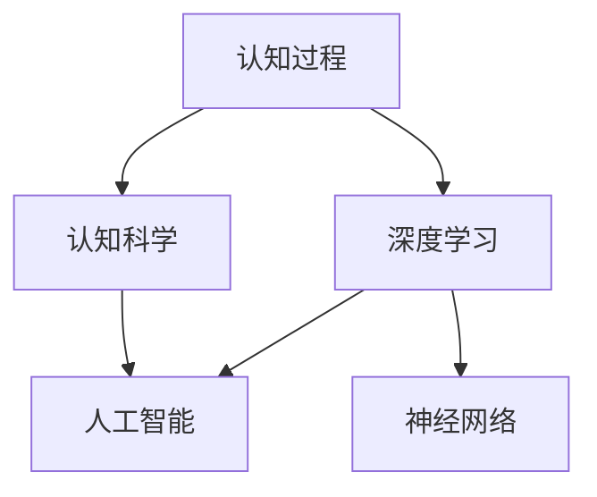

                 

# 认知过程中的深刻化趋势

## 1. 背景介绍

人类认知过程中的深刻化趋势是人工智能（AI）和计算机科学领域的一个重要研究主题。这一趋势不仅体现在认知科学的理论探索中，也在实际应用，如自然语言处理、图像识别、机器学习等领域展现出显著的效果。本文章将从认知过程和深度学习、认知科学和人工智能、以及未来趋势三个角度，详细探讨认知过程中的深刻化趋势。

## 2. 核心概念与联系

### 2.1 核心概念概述

为了更好地理解认知过程中的深刻化趋势，我们需要了解以下几个核心概念：

- **认知过程**：指人类通过感知、记忆、思考、推理等心理活动获取知识和解决问题的过程。
- **深度学习**：一种基于多层神经网络的机器学习方法，通过反向传播算法学习数据的复杂表示。
- **认知科学**：研究人类认知过程的科学，关注智能、意识、感知、记忆、语言、思维等。
- **人工智能**：通过计算机模拟人类智能，实现任务自动化和智能决策的领域。
- **认知神经科学**：研究大脑如何处理信息的科学，致力于理解认知过程的神经基础。

### 2.2 核心概念原理和架构的 Mermaid 流程图

以下是一个简单的 Mermaid 流程图，展示了认知过程、深度学习、认知科学和人工智能之间的联系：



## 3. 核心算法原理 & 具体操作步骤

### 3.1 算法原理概述

认知过程中的深刻化趋势主要通过深度学习实现，深度学习模型通过多层非线性变换，能够自动学习数据的复杂特征表示。在深度学习中，多层感知器（Multilayer Perceptron, MLP）和卷积神经网络（Convolutional Neural Network, CNN）是最常用的模型。

在认知科学中，深度学习被用来模拟人类大脑的神经元网络结构，通过对大量数据的学习，能够实现对复杂认知任务的建模和解决。例如，在自然语言处理中，深度学习模型可以通过文本分类、情感分析、机器翻译等任务，模拟人类的语言理解能力。

### 3.2 算法步骤详解

深度学习模型的训练步骤如下：

1. **数据准备**：收集和处理训练数据，包括文本、图像等，确保数据的多样性和高质量。
2. **模型设计**：选择合适的神经网络架构，如卷积神经网络（CNN）、循环神经网络（RNN）、变分自编码器（VAE）等，并设置超参数，如学习率、批大小、迭代次数等。
3. **模型训练**：使用反向传播算法（Backpropagation）和随机梯度下降（SGD）等优化算法，最小化损失函数，更新模型参数。
4. **模型评估**：在验证集上评估模型性能，调整超参数以提高模型效果。
5. **模型部署**：将训练好的模型应用于实际问题，进行推理和预测。

### 3.3 算法优缺点

深度学习的优点包括：

- **自动特征学习**：能够自动从数据中学习特征表示，减少了手动特征工程的需求。
- **并行计算**：大规模数据和复杂模型的并行计算能力，可以显著提高训练效率。
- **泛化能力强**：在大规模数据上训练的模型具有较好的泛化能力。

但深度学习也存在以下缺点：

- **计算资源消耗大**：需要大量的计算资源和存储空间。
- **黑箱性质**：深度学习模型通常被视为黑箱，难以解释其内部工作机制。
- **过拟合风险**：在训练过程中容易过拟合，需要采用正则化技术进行优化。

### 3.4 算法应用领域

深度学习在以下领域具有广泛应用：

- **计算机视觉**：图像分类、目标检测、图像分割等。
- **自然语言处理**：文本分类、情感分析、机器翻译等。
- **语音识别**：语音转文本、语音生成等。
- **推荐系统**：个性化推荐、广告推荐等。

## 4. 数学模型和公式 & 详细讲解 & 举例说明

### 4.1 数学模型构建

深度学习模型的数学模型可以表示为：

$$ y = W \cdot h + b $$

其中 $y$ 为输出结果，$h$ 为输入数据的表示，$W$ 为权重矩阵，$b$ 为偏置项。在训练过程中，通过最小化损失函数来更新权重矩阵 $W$ 和偏置项 $b$。

### 4.2 公式推导过程

以卷积神经网络（CNN）为例，其数学模型可以表示为：

$$ y = \max_{k} f(x)_k $$

其中 $f(x)$ 为卷积核函数，$k$ 为卷积核编号。卷积核通过滑动窗口的方式对输入数据进行特征提取，最大池化层对提取的特征进行降维，最终输出结果。

### 4.3 案例分析与讲解

以图像分类为例，使用卷积神经网络（CNN）进行图像分类的流程如下：

1. **数据预处理**：将图像数据标准化，并进行归一化处理。
2. **卷积层**：使用多个卷积核提取图像的局部特征。
3. **池化层**：使用最大池化层对特征进行降维。
4. **全连接层**：将池化后的特征输入全连接层，进行分类。
5. **softmax层**：对分类结果进行softmax操作，输出概率分布。

## 5. 项目实践：代码实例和详细解释说明

### 5.1 开发环境搭建

以下是使用 Python 和 TensorFlow 搭建深度学习项目环境的流程：

1. 安装 Anaconda：从官网下载并安装 Anaconda，用于创建独立的 Python 环境。
2. 创建并激活虚拟环境：
```bash
conda create -n deep_learning_env python=3.8 
conda activate deep_learning_env
```

3. 安装 TensorFlow：
```bash
pip install tensorflow
```

4. 安装其他必要的工具包：
```bash
pip install numpy scipy matplotlib sklearn
```

### 5.2 源代码详细实现

以下是一个简单的图像分类示例，使用卷积神经网络（CNN）对 CIFAR-10 数据集进行分类：

```python
import tensorflow as tf
from tensorflow.keras import layers

# 定义卷积神经网络
model = tf.keras.Sequential([
    layers.Conv2D(32, (3, 3), activation='relu', input_shape=(32, 32, 3)),
    layers.MaxPooling2D((2, 2)),
    layers.Conv2D(64, (3, 3), activation='relu'),
    layers.MaxPooling2D((2, 2)),
    layers.Conv2D(64, (3, 3), activation='relu'),
    layers.Flatten(),
    layers.Dense(64, activation='relu'),
    layers.Dense(10)
])

# 编译模型
model.compile(optimizer='adam',
              loss=tf.keras.losses.SparseCategoricalCrossentropy(from_logits=True),
              metrics=['accuracy'])

# 训练模型
model.fit(train_dataset, epochs=10, validation_data=val_dataset)

# 评估模型
model.evaluate(test_dataset)
```

### 5.3 代码解读与分析

在上述代码中，我们使用 TensorFlow 定义了一个简单的卷积神经网络（CNN），用于图像分类任务。主要步骤包括：

1. **数据准备**：使用 CIFAR-10 数据集，并对其进行预处理。
2. **模型定义**：定义卷积层、池化层和全连接层，构建卷积神经网络。
3. **模型编译**：设置优化器、损失函数和评估指标。
4. **模型训练**：使用训练集进行模型训练，并在验证集上评估模型性能。
5. **模型评估**：使用测试集对模型进行评估，输出分类准确率。

## 6. 实际应用场景

### 6.1 智能医疗

在智能医疗领域，深度学习可以用于疾病诊断、图像识别、药物发现等。例如，通过深度学习模型对医疗图像进行分析，可以辅助医生进行疾病诊断，提升诊断准确率和效率。

### 6.2 自动驾驶

自动驾驶技术依赖于深度学习进行图像识别和行为预测。通过深度学习模型，可以对车辆周围的交通场景进行分析，实现自动驾驶。

### 6.3 金融风控

在金融领域，深度学习可以用于欺诈检测、信用评估等。通过深度学习模型对客户行为进行分析，可以识别出潜在的欺诈风险，提升金融风控水平。

### 6.4 未来应用展望

未来，深度学习将在更多领域得到应用，如教育、能源、交通等。深度学习模型的应用将越来越广泛，其潜力和价值也将不断扩大。

## 7. 工具和资源推荐

### 7.1 学习资源推荐

为了帮助开发者系统掌握深度学习的理论基础和实践技巧，这里推荐一些优质的学习资源：

1. 《深度学习》（Deep Learning）书籍：由 Ian Goodfellow、Yoshua Bengio 和 Aaron Courville 合著，全面介绍了深度学习的理论和实践。
2. Coursera《深度学习专项课程》：由深度学习领域的权威专家讲授，涵盖深度学习的基础理论和实践技能。
3. arXiv 和 Google Scholar：最新的深度学习论文发布平台，可以及时掌握深度学习的最新研究成果。

### 7.2 开发工具推荐

以下是几款用于深度学习开发的常用工具：

1. TensorFlow：由 Google 主导开发的深度学习框架，支持大规模分布式训练，适合工业应用。
2. PyTorch：由 Facebook 开发的深度学习框架，灵活性好，适合研究和实验。
3. Keras：基于 TensorFlow 和 Theano 的高级深度学习框架，易于使用，适合快速迭代开发。

### 7.3 相关论文推荐

深度学习领域的研究论文层出不穷，以下是几篇奠基性的相关论文，推荐阅读：

1. AlexNet: ImageNet Classification with Deep Convolutional Neural Networks：提出 AlexNet 模型，是深度学习领域的里程碑之一。
2. ResNet: Deep Residual Learning for Image Recognition：提出 ResNet 模型，解决了深度神经网络退化的问题。
3. Inception: GoogLeNet with Inception Layers：提出 Inception 模型，提升了深度网络的效率和性能。
4. Generative Adversarial Networks：提出 GAN 模型，用于生成逼真的图像和视频。

## 8. 总结：未来发展趋势与挑战

### 8.1 研究成果总结

深度学习在过去十年中取得了巨大的进展，广泛应用于图像识别、自然语言处理、语音识别等领域。未来，深度学习将继续推动人工智能的发展，带来更多的应用场景和创新点。

### 8.2 未来发展趋势

未来深度学习的发展趋势包括：

1. **深度学习与认知科学的结合**：将深度学习与认知科学结合，更好地模拟人类认知过程，提升模型的性能和可解释性。
2. **多模态深度学习**：融合视觉、听觉、语言等多种模态数据，提升深度学习模型的泛化能力和应用范围。
3. **深度学习模型的可解释性**：提升深度学习模型的可解释性，使其能够更好地应用于医疗、金融等领域。
4. **计算资源的高效利用**：探索更高效的深度学习模型和算法，减少计算资源消耗。
5. **深度学习与其他AI技术的融合**：将深度学习与其他AI技术结合，如强化学习、知识图谱等，提升深度学习的性能和应用范围。

### 8.3 面临的挑战

尽管深度学习取得了显著的进展，但在迈向更加智能化、普适化应用的过程中，仍面临以下挑战：

1. **数据质量和多样性**：深度学习模型的训练需要大量高质量数据，但在实际应用中，数据质量和多样性往往不足。
2. **计算资源限制**：深度学习模型需要大量的计算资源和存储空间，如何高效利用资源是未来的一大挑战。
3. **模型可解释性**：深度学习模型通常被视为黑箱，难以解释其内部工作机制，缺乏可解释性。
4. **公平性和偏见**：深度学习模型可能会学习到数据中的偏见，导致不公平的决策，需要在模型设计和训练中加以考虑。
5. **安全性和隐私保护**：深度学习模型的应用涉及大量敏感数据，如何在保护隐私的前提下，实现安全和可靠的应用，是一个重要问题。

### 8.4 研究展望

未来的深度学习研究需要在以下几个方面寻求新的突破：

1. **数据增强和生成**：通过数据增强和生成技术，提升数据的质量和多样性，减少对实际数据的依赖。
2. **模型压缩和优化**：开发更高效的深度学习模型和算法，减少计算资源消耗，提升模型性能。
3. **深度学习与认知科学的融合**：将深度学习与认知科学结合，提升模型的可解释性和泛化能力。
4. **多模态深度学习**：融合视觉、听觉、语言等多种模态数据，提升深度学习模型的泛化能力和应用范围。
5. **深度学习与其他AI技术的结合**：将深度学习与其他AI技术结合，如强化学习、知识图谱等，提升深度学习的性能和应用范围。

## 9. 附录：常见问题与解答

**Q1：深度学习是否适用于所有应用场景？**

A: 深度学习在大多数应用场景中都具有显著效果，但也有一些场景不适合使用深度学习，如小数据量、低维度数据等。在实际应用中，需要根据具体问题选择合适的算法。

**Q2：深度学习模型的训练时间通常很长，如何加快训练速度？**

A: 可以通过以下方法加快深度学习模型的训练速度：

- **数据增强**：通过旋转、翻转、缩放等方法扩充训练数据集。
- **模型压缩**：使用剪枝、量化等技术减少模型参数量，降低计算资源消耗。
- **分布式训练**：使用分布式计算框架，如 TensorFlow、PyTorch 等，加速训练过程。

**Q3：深度学习模型是否容易被过拟合？**

A: 深度学习模型在训练过程中容易过拟合，尤其是在数据量不足的情况下。为避免过拟合，可以采用以下方法：

- **正则化**：使用 L2 正则、Dropout 等技术，防止模型过拟合。
- **数据增强**：扩充训练数据集，增加模型泛化能力。
- **早停法**：在模型性能不再提升时停止训练，防止过拟合。

**Q4：如何提升深度学习模型的可解释性？**

A: 提升深度学习模型的可解释性，可以采用以下方法：

- **可视化技术**：通过可视化技术，展示模型的中间特征和决策过程，帮助理解模型的行为。
- **特征提取**：使用特征提取技术，抽取模型的关键特征，帮助理解模型的推理过程。
- **知识图谱**：将知识图谱与深度学习模型结合，提升模型的可解释性。

---

作者：禅与计算机程序设计艺术 / Zen and the Art of Computer Programming

