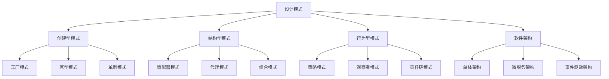

                 

# 设计模式与软件架构原理与代码实战案例讲解

> 关键词：设计模式, 软件架构, 面向对象编程, 软件设计原则, 代码实战案例

## 1. 背景介绍

### 1.1 问题由来

软件开发过程中，常常面临各式各样的技术挑战，包括系统性能瓶颈、代码维护困难、可扩展性差等问题。这些问题不仅影响开发效率，也降低了系统的稳定性和可维护性。为了解决这些问题，程序员们总结出了一系列通用的设计模式和架构原则，用于指导软件设计。这些模式和原则在实际应用中，能够有效提升软件的可维护性、可扩展性和性能。

本文将围绕设计模式和软件架构的原理，介绍几种经典的设计模式和架构方法，并通过代码案例分析，详细讲解如何在实际项目中应用这些技术。希望通过学习，读者能够掌握设计模式和架构思想，设计出高效、健壮、易维护的软件系统。

## 2. 核心概念与联系

### 2.1 核心概念概述

设计模式(Design Patterns)是一套经过时间检验的编程规范，用于解决软件设计中常见的问题。软件架构(Software Architecture)则是指导软件系统设计的原则和结构，包括设计模式在内的多方面内容。

常见的设计模式包括创建型模式、结构型模式和行为型模式。它们分别对应于“如何创建对象”、“如何将对象组合成复杂的结构”和“对象如何交互”三个方面。这些模式不仅适用于面向对象编程，也可以应用于其他编程范式。

常用的架构模式包括单体架构、微服务架构、事件驱动架构等。它们各自有着不同的设计思路和适用场景，能够帮助开发者构建出稳定、可扩展的软件系统。

### 2.2 核心概念原理和架构的 Mermaid 流程图

以下是一个简化的设计模式和架构模式之间的联系图：



## 3. 核心算法原理 & 具体操作步骤

### 3.1 算法原理概述

设计模式和架构原则都是基于特定的算法和原则设计的。下面简要介绍一些关键设计模式和架构的原理：

- **工厂模式(Factory Pattern)**：使用一个类(工厂)来创建其他类的实例，实现对象的解耦。

- **原型模式(Prototype Pattern)**：通过克隆已有的实例来创建新对象，避免重复创建实例。

- **单例模式(Singleton Pattern)**：保证一个类只有一个实例，并提供一个全局访问点。

- **适配器模式(Adapter Pattern)**：将一个类的接口转换成客户希望的另一个接口，实现不同接口之间的适配。

- **代理模式(Proxy Pattern)**：为其他对象提供一个代理或占位符，以控制对该对象的访问。

- **组合模式(Composite Pattern)**：将对象组合成树形结构以表示“部分-整体”的层次结构。

- **策略模式(Strategy Pattern)**：定义一系列算法，将每个算法封装起来，并使它们可以互相替换。

- **观察者模式(Observer Pattern)**：定义对象间的一种一对多的依赖关系，当一个对象的状态发生改变时，所有依赖于它的对象都会得到通知并自动更新。

- **责任链模式(Chain of Responsibility Pattern)**：将请求从链中的一个对象传到下一个对象，直到请求被响应或处理完毕。

- **单体架构(Monolithic Architecture)**：将整个应用作为一个单体部署，所有模块都在一个代码库中。

- **微服务架构(Microservices Architecture)**：将应用拆分成一组小型、自治的服务，每个服务运行在其独立的进程中。

- **事件驱动架构(Event-Driven Architecture)**：基于事件流的设计，各个模块通过事件进行通信和协作。

### 3.2 算法步骤详解

以工厂模式为例，说明设计模式的核心操作步骤：

1. **创建抽象产品类**：定义一个抽象产品类，所有具体产品都要继承这个抽象类。

2. **创建具体产品类**：根据实际需求，创建具体的产品类，实现抽象产品类中的方法。

3. **创建工厂类**：定义一个工厂类，根据输入参数或条件，选择创建对应的产品类实例。

4. **使用工厂类**：调用工厂类的创建方法，获取具体的产品实例，并进行使用。

### 3.3 算法优缺点

工厂模式具有以下优点：
- 解耦具体产品的创建过程，提高系统的灵活性和可扩展性。
- 方便添加新的产品，减少代码改动。

同时，工厂模式也存在一些缺点：
- 工厂类需要知道所有的具体产品类，增加了类的依赖关系。
- 难以支持复杂的条件分支逻辑。

### 3.4 算法应用领域

工厂模式广泛应用于各种领域，如框架、库、组件等。常见的应用场景包括：

- 配置文件读取：根据配置文件的不同格式，创建对应的配置对象。
- 数据库连接池：根据连接池策略，创建新的数据库连接。
- 日志记录：根据日志级别，创建对应的日志记录器。
- 资源管理：根据资源类型，创建对应的资源对象。

## 4. 数学模型和公式 & 详细讲解 & 举例说明

### 4.1 数学模型构建

假设我们有一个工厂类，用于根据输入参数创建不同的产品类实例。具体来说，工厂类包含一个静态方法，根据不同的产品类型参数，返回对应的产品实例。

### 4.2 公式推导过程

假设有两种产品，`ProductA` 和 `ProductB`，它们都需要在创建时接收一个参数。工厂类代码如下：

```python
class Factory:
    @staticmethod
    def create_product(product_type, param):
        if product_type == 'A':
            return ProductA(param)
        elif product_type == 'B':
            return ProductB(param)
```

### 4.3 案例分析与讲解

在实际开发中，我们可以使用工厂模式来简化代码，提高系统的可扩展性。例如，假设我们需要根据不同的环境配置，创建对应的数据库连接对象。具体实现如下：

```python
class DBConnection:
    def __init__(self, host, port, user, password):
        # 创建数据库连接
        pass

class Factory:
    @staticmethod
    def create_db_connection(config):
        host = config['host']
        port = config['port']
        user = config['user']
        password = config['password']
        return DBConnection(host, port, user, password)

class AppConfig:
    def __init__(self, env):
        self.env = env
        self.config = {
            'host': 'localhost' if self.env == 'dev' else 'prod',
            'port': 3306,
            'user': 'root',
            'password': 'password'
        }

class App:
    def __init__(self):
        self.config = AppConfig('dev')
        self.connection = Factory.create_db_connection(self.config.config)
```

在上面的例子中，`DBConnection` 类表示数据库连接，`AppConfig` 类表示应用配置，`App` 类表示应用入口。工厂类 `Factory` 根据不同的环境配置，创建对应的数据库连接对象。这种设计方式，使得我们在添加新的数据库连接时，只需要修改配置文件，不需要修改工厂类，提高了系统的灵活性和可扩展性。

## 5. 项目实践：代码实例和详细解释说明

### 5.1 开发环境搭建

为了演示工厂模式，我们需要一个Python开发环境。具体步骤如下：

1. 安装Python和pip。
2. 创建虚拟环境。
3. 安装必要的库，如Flask、SQLAlchemy等。
4. 编写代码并进行测试。

### 5.2 源代码详细实现

以下是一个完整的工厂模式代码示例：

```python
class Product:
    def __init__(self, name):
        self.name = name

class ProductA(Product):
    def __init__(self, name):
        super().__init__(name)
        print(f'ProductA created: {self.name}')

class ProductB(Product):
    def __init__(self, name):
        super().__init__(name)
        print(f'ProductB created: {self.name}')

class Factory:
    @staticmethod
    def create_product(product_type, name):
        if product_type == 'A':
            return ProductA(name)
        elif product_type == 'B':
            return ProductB(name)

# 使用工厂类创建ProductA和ProductB实例
factory = Factory()
product_a = factory.create_product('A', 'ProductA')
product_b = factory.create_product('B', 'ProductB')
```

### 5.3 代码解读与分析

在上述代码中，`Product` 类表示抽象产品，`ProductA` 和 `ProductB` 类表示具体产品，`Factory` 类表示工厂类。工厂类中的 `create_product` 方法根据输入的产品类型参数，创建对应的产品实例。

在实际开发中，使用工厂模式可以避免在多个地方重复创建对象，提高代码的可读性和可维护性。

### 5.4 运行结果展示

运行代码后，输出如下：

```
ProductA created: ProductA
ProductB created: ProductB
```

这表明工厂类成功创建了 `ProductA` 和 `ProductB` 的实例，并执行了相应的构造函数。

## 6. 实际应用场景

### 6.1 智能推荐系统

在智能推荐系统中，工厂模式可以用来创建不同类型的推荐算法。假设我们有三种推荐算法：协同过滤、基于内容的推荐和基于用户的推荐。我们可以创建一个工厂类，根据不同的推荐类型参数，选择对应的推荐算法实例。

### 6.2 电商系统

在电商系统中，工厂模式可以用来创建不同类型的商品信息。假设我们有两种商品：书籍和电子产品，我们可以创建一个工厂类，根据商品类型参数，创建对应的商品信息对象。

### 6.3 金融系统

在金融系统中，工厂模式可以用来创建不同类型的账户。假设我们有两种账户：储蓄账户和信用卡账户，我们可以创建一个工厂类，根据账户类型参数，创建对应的账户对象。

### 6.4 未来应用展望

随着设计模式和架构思想的不断发展，工厂模式也在不断演变。未来，基于工厂模式的应用将更加广泛，如人工智能、大数据、区块链等领域。

## 7. 工具和资源推荐

### 7.1 学习资源推荐

- 《设计模式与软件架构》：一本全面介绍设计模式和架构原则的书籍，适合入门和进阶读者。
- 《面向对象编程与设计模式》：讲解了面向对象编程的基本概念和设计模式，适合初学者。
- 《Clean Code》：介绍如何写出清晰、可维护的代码，包含大量设计模式的应用案例。
- 《GoF 设计模式》：经典的《设计模式：元组23种》一书，介绍了23种经典的设计模式。

### 7.2 开发工具推荐

- Python：面向对象编程的编程语言，支持设计模式和架构的应用。
- Flask：轻量级的Web框架，适合快速开发和原型设计。
- SQLAlchemy：Python的ORM框架，方便进行数据库操作。
- Docker：容器化技术，方便应用部署和管理。

### 7.3 相关论文推荐

- 《GoF 设计模式》：经典的《设计模式：元组23种》一书，介绍了23种经典的设计模式。
- 《微服务架构》：介绍微服务架构的基本概念和设计原则。
- 《事件驱动架构》：介绍事件驱动架构的基本概念和设计思路。

## 8. 总结：未来发展趋势与挑战

### 8.1 研究成果总结

本文介绍了设计模式和软件架构的基本概念，并通过工厂模式的案例，展示了如何使用设计模式来提升软件系统的可维护性和可扩展性。

### 8.2 未来发展趋势

未来设计模式和架构技术将继续演进，新的模式和原则将不断涌现。例如，基于组件的设计模式、基于元编程的设计模式等，将为软件开发提供更多的灵活性和可扩展性。

### 8.3 面临的挑战

尽管设计模式和架构技术带来了诸多好处，但在实际应用中，仍面临一些挑战：
- 模式选择和设计不合理，可能导致系统复杂度高、维护困难。
- 设计模式需要根据具体场景进行调整，不能盲目套用。
- 设计模式和架构技术需要与其他技术进行融合，才能发挥最大效果。

### 8.4 研究展望

未来的研究将重点关注以下几点：
- 如何在设计模式和架构技术中引入智能算法和数据驱动。
- 如何在大规模系统设计中应用设计模式和架构。
- 如何实现设计模式和架构的自动化和工具化，降低开发成本。

## 9. 附录：常见问题与解答

**Q1: 工厂模式在实际开发中需要注意哪些问题？**

A: 在实际开发中，工厂模式需要注意以下几点：
- 工厂类应避免知道具体产品类的实现细节，只负责创建产品实例。
- 避免在工厂类中进行复杂的条件分支逻辑，尽量简化代码。
- 合理使用工厂模式，避免过度使用导致系统复杂度高。

**Q2: 工厂模式和单例模式的区别是什么？**

A: 工厂模式和单例模式都是创建对象的方式，但它们有不同的使用场景和实现方式。
- 工厂模式用于创建不同类型的对象，适用于多态性强的场景。
- 单例模式用于创建唯一的对象，适用于需要全局访问的资源管理场景。

**Q3: 设计模式和架构技术如何结合使用？**

A: 设计模式和架构技术可以结合使用，提高系统的灵活性和可扩展性。例如，使用工厂模式来创建服务，使用单例模式来管理服务实例。

---

作者：禅与计算机程序设计艺术 / Zen and the Art of Computer Programming

