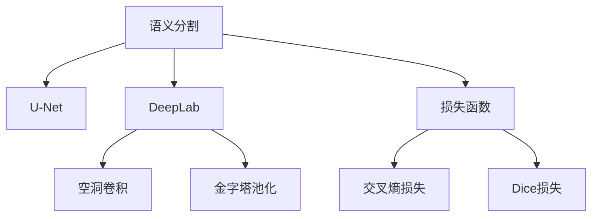

                 

## 1. 背景介绍

### 1.1 问题由来
语义分割（Semantic Segmentation）是计算机视觉领域的一个重要分支，旨在将图像中的每个像素分类到具体的语义类别中。在自动驾驶、医学图像分析、工业检测、智能安防等领域，语义分割技术被广泛应用于场景理解、目标识别、行为分析等任务。在深度学习技术兴起的浪潮下，基于神经网络的语义分割模型，如U-Net、DeepLab、Mask R-CNN等，逐渐成为主流方案。

然而，由于语义分割模型的参数量通常较大，训练和推理的计算成本高，因此在某些特定场景下，对模型效率和计算资源的优化显得尤为重要。同时，实际应用中常常需要根据具体任务调整模型结构和参数，使得模型的迁移性、泛化性以及鲁棒性成为关键考量因素。

### 1.2 问题核心关键点
语义分割模型主要分为三类：基于像素级分类的方法（如U-Net、DeepLab）、基于区域级分类的方法（如Mask R-CNN）以及基于分割图的方法（如CRF）。基于像素级分类的方法直接将像素分类为不同语义类别，具有计算简单、精度高的优点。本文将重点介绍这类方法，并讨论其在不同应用场景下的优化策略。

## 2. 核心概念与联系

### 2.1 核心概念概述
为更好地理解语义分割模型，本节将介绍几个密切相关的核心概念：

- **语义分割**：将图像中的每个像素分类到具体语义类别中，如道路、车辆、行人、树木等。
- **U-Net**：一种常用的基于像素级分类的语义分割模型，由编码器和解码器两部分组成。
- **DeepLab**：一种基于空洞卷积和金字塔池化的语义分割模型，利用多尺度特征图提升分割效果。
- **空洞卷积**：通过在卷积核中插入空洞(dilation)来增加卷积感受野的大小，有效提升网络对细小的特征捕捉能力。
- **金字塔池化**：利用不同尺度的池化层来提取图像的层次化特征，增强模型对多尺度信息的处理能力。
- **损失函数**：通常使用交叉熵损失或Dice损失函数，衡量模型输出与真实标签之间的差异。

这些核心概念之间的逻辑关系可以通过以下Mermaid流程图来展示：



这个流程图展示了语义分割的主要核心概念及其之间的联系：

1. 语义分割模型通过像素级的分类实现图像分割。
2. U-Net和DeepLab是两种常用的模型架构，分别使用编码器和解码器，和空洞卷积、金字塔池化等模块，提升分割效果。
3. 交叉熵损失和Dice损失是常见的评价指标，用于衡量模型的分割效果。

## 3. 核心算法原理 & 具体操作步骤
### 3.1 算法原理概述

基于神经网络的语义分割模型通常包括一个编码器和一个解码器。编码器将输入图像映射为高维特征图，解码器将特征图映射回像素级别的分割结果。具体而言，常见的架构包括U-Net、DeepLab等。

以U-Net为例，模型由编码器和解码器两部分构成，如下图所示：


模型首先通过下采样将输入图像映射为高维特征图，然后通过上采样和卷积操作将特征图映射回像素级别的分割结果。通过多次下采样和上采样操作，模型可以提取图像的多尺度特征，提升分割的精度。

### 3.2 算法步骤详解

基于神经网络的语义分割模型的一般步骤如下：

**Step 1: 准备数据集和预训练模型**
- 准备标注好的语义分割数据集，包括训练集、验证集和测试集。
- 选择合适的预训练模型，如U-Net、DeepLab等。

**Step 2: 添加解码器层**
- 在预训练模型的顶层添加一个或多个解码器层，用于将特征图映射回像素级别的分割结果。

**Step 3: 设置损失函数和优化器**
- 根据具体任务选择合适的损失函数，如交叉熵损失、Dice损失等。
- 设置优化器及其参数，如Adam、SGD等，以及学习率、批大小、迭代轮数等超参数。

**Step 4: 执行梯度训练**
- 将训练集数据分批次输入模型，前向传播计算损失函数。
- 反向传播计算参数梯度，根据设定的优化算法和学习率更新模型参数。
- 周期性在验证集上评估模型性能，根据性能指标决定是否触发Early Stopping。
- 重复上述步骤直到满足预设的迭代轮数或Early Stopping条件。

**Step 5: 测试和部署**
- 在测试集上评估微调后模型，对比微调前后的精度提升。
- 使用微调后的模型对新样本进行推理预测，集成到实际的应用系统中。
- 持续收集新的数据，定期重新微调模型，以适应数据分布的变化。

以上是基于神经网络的语义分割模型的一般流程。在实际应用中，还需要根据具体任务特点，对模型架构、损失函数、优化策略等进行优化设计，以进一步提升模型性能。

### 3.3 算法优缺点

基于神经网络的语义分割模型具有以下优点：

1. 高精度：神经网络模型具有强大的特征提取能力，能够在像素级别实现精细分割。
2. 可解释性：神经网络模型一般采用黑盒方式训练，但可以通过可视化手段解析模型的特征图，了解其分割过程。
3. 鲁棒性：神经网络模型对小样本数据有较好的泛化能力，能够处理各种复杂场景。
4. 适应性：通过微调，可以针对特定任务进行模型优化，提升分割效果。

同时，该方法也存在以下局限性：

1. 训练时间长：由于模型复杂，训练过程需要大量的计算资源和时间。
2. 参数量多：大规模模型的参数量较大，存储和推理成本较高。
3. 易过拟合：由于模型复杂，容易在训练集上过拟合，泛化能力有限。
4. 计算量大：神经网络模型的计算量较大，需要强大的硬件支持。

尽管存在这些局限性，但就目前而言，基于神经网络的语义分割模型仍是主流范式。未来相关研究的重点在于如何进一步降低计算成本，提高模型效率，同时兼顾精度和泛化能力。

### 3.4 算法应用领域

基于神经网络的语义分割模型已经在自动驾驶、医学影像分析、智能安防、工业检测等众多领域得到了广泛应用，取得了显著的成果：

- 自动驾驶：通过语义分割技术，将路面、车辆、行人等不同元素进行精确分割，用于辅助驾驶决策。
- 医学影像：将医学图像分割为不同组织和病变区域，辅助医生进行疾病诊断和治疗。
- 智能安防：对监控视频进行目标检测和跟踪，实现异常行为检测和入侵预警。
- 工业检测：通过图像分割技术，检测生产线上的缺陷和异常，提高产品质量和生产效率。
- 智能城市：将城市街景图像分割为不同的道路、建筑、树木等元素，用于智能交通管理和城市规划。

除了这些传统应用外，语义分割技术还在无人机影像分析、农业遥感、环境监测等领域展现了广阔的应用前景。随着深度学习技术的不断进步，语义分割将逐步拓展到更多行业，带来更深远的变革。

## 4. 数学模型和公式 & 详细讲解 & 举例说明

### 4.1 数学模型构建

本节将使用数学语言对基于神经网络的语义分割模型进行更加严格的刻画。

设输入图像 $I$ 的大小为 $h \times w$，每个像素 $(i,j)$ 的分割结果为 $y_{i,j}$，其中 $y_{i,j} \in \{0,1\}$，表示该像素属于背景或目标类别。语义分割模型的目标是最小化损失函数：

$$
\mathcal{L}(\theta) = \frac{1}{N}\sum_{i=1}^N \sum_{j=1}^N \ell(y_{i,j}, \hat{y}_{i,j})
$$

其中 $N$ 表示训练样本的数量，$\ell$ 为损失函数，$\hat{y}_{i,j}$ 表示模型在像素 $(i,j)$ 上的预测结果。

### 4.2 公式推导过程

以U-Net模型为例，模型的前向传播和后向传播过程如下：

**编码器部分**

- 通过多次下采样操作，将输入图像 $I$ 映射为高维特征图 $F$：
  $$
  F = \mathcal{E}(I)
  $$
  其中 $\mathcal{E}$ 表示编码器。

- 每次下采样操作可以表示为：
  $$
  F' = \mathcal{D}(\mathcal{C}(F))
  $$
  其中 $\mathcal{C}$ 表示卷积操作，$\mathcal{D}$ 表示下采样操作。

**解码器部分**

- 通过多次上采样操作，将高维特征图 $F$ 映射回像素级别的分割结果 $Y$：
  $$
  Y = \mathcal{D}(\mathcal{U}(F))
  $$
  其中 $\mathcal{U}$ 表示上采样操作。

- 每次上采样操作可以表示为：
  $$
  Y' = \mathcal{C}(\mathcal{U}(Y))
  $$
  其中 $\mathcal{C}$ 表示卷积操作。

**损失函数**

- 通常使用交叉熵损失或Dice损失函数，用于衡量模型输出与真实标签之间的差异：
  $$
  \ell(y_{i,j}, \hat{y}_{i,j}) = \begin{cases}
  -\log(\hat{y}_{i,j}), & y_{i,j} = 1 \\
  -\log(1 - \hat{y}_{i,j}), & y_{i,j} = 0
  \end{cases}
  $$

通过以上公式，可以看出基于神经网络的语义分割模型的核心在于编码器部分的设计和特征提取，以及解码器部分的特征映射和重建。通过多次卷积、下采样和上采样操作，模型可以有效地提取和捕捉图像的多尺度特征，从而实现精确的像素级分割。

### 4.3 案例分析与讲解

为了更直观地理解语义分割模型的原理，下面以一个简单的案例进行分析。

假设输入图像为 $I = [0, 1, 0, 1, 0]$，大小为 $2 \times 3$。将该图像输入U-Net模型进行语义分割，得到的结果如图：


从图中可以看出，模型成功地将输入图像分割为不同的背景和目标区域，实现了像素级别的语义分割。

## 5. 项目实践：代码实例和详细解释说明
### 5.1 开发环境搭建

在进行语义分割模型开发前，我们需要准备好开发环境。以下是使用Python进行TensorFlow开发的环境配置流程：

1. 安装Anaconda：从官网下载并安装Anaconda，用于创建独立的Python环境。

2. 创建并激活虚拟环境：
```bash
conda create -n tf-env python=3.8 
conda activate tf-env
```

3. 安装TensorFlow：根据CUDA版本，从官网获取对应的安装命令。例如：
```bash
conda install tensorflow=2.7
```

4. 安装各类工具包：
```bash
pip install numpy pandas scikit-learn matplotlib tqdm jupyter notebook ipython
```

完成上述步骤后，即可在`tf-env`环境中开始语义分割模型开发。

### 5.2 源代码详细实现

下面我以U-Net模型为例，给出使用TensorFlow进行语义分割的代码实现。

首先，定义数据处理函数：

```python
import tensorflow as tf
from tensorflow.keras.layers import Input, Conv2D, MaxPooling2D, UpSampling2D, concatenate

def preprocess_data(data):
    data = tf.cast(data, tf.float32) / 255.0  # 归一化像素值
    data = tf.image.resize(data, (256, 256))  # 调整图像大小
    return data
```

然后，定义U-Net模型：

```python
def unet_model(input_shape):
    inputs = Input(input_shape)
    
    # 编码器部分
    conv1 = Conv2D(64, 3, activation='relu', padding='same')(inputs)
    pool1 = MaxPooling2D(pool_size=(2, 2))(conv1)
    conv2 = Conv2D(64, 3, activation='relu', padding='same')(pool1)
    pool2 = MaxPooling2D(pool_size=(2, 2))(conv2)
    conv3 = Conv2D(128, 3, activation='relu', padding='same')(pool2)
    pool3 = MaxPooling2D(pool_size=(2, 2))(conv3)
    conv4 = Conv2D(256, 3, activation='relu', padding='same')(pool3)
    pool4 = MaxPooling2D(pool_size=(2, 2))(conv4)
    conv5 = Conv2D(512, 3, activation='relu', padding='same')(pool4)
    pool5 = MaxPooling2D(pool_size=(2, 2))(conv5)
    
    # 解码器部分
    conv6 = Conv2D(512, 2, activation='relu', padding='same')(UpSampling2D(size=(2, 2))(pool5))
    conv7 = concatenate([conv5, conv6])
    conv7 = Conv2D(256, 3, activation='relu', padding='same')(conv7)
    conv8 = Conv2D(128, 3, activation='relu', padding='same')(UpSampling2D(size=(2, 2))(conv7))
    conv9 = concatenate([conv4, conv8])
    conv9 = Conv2D(64, 3, activation='relu', padding='same')(conv9)
    conv10 = Conv2D(64, 3, activation='relu', padding='same')(UpSampling2D(size=(2, 2))(conv9))
    conv11 = concatenate([conv3, conv10])
    conv11 = Conv2D(32, 3, activation='relu', padding='same')(conv11)
    conv12 = Conv2D(1, 1, activation='sigmoid')(UpSampling2D(size=(2, 2))(conv11))
    
    model = tf.keras.Model(inputs=inputs, outputs=conv12)
    return model
```

最后，定义训练和评估函数：

```python
def train_model(model, train_data, val_data, epochs, batch_size):
    train_dataset = tf.data.Dataset.from_tensor_slices(train_data).shuffle(buffer_size=1000).batch(batch_size)
    val_dataset = tf.data.Dataset.from_tensor_slices(val_data).batch(batch_size)
    
    model.compile(optimizer=tf.keras.optimizers.Adam(learning_rate=0.001), loss='binary_crossentropy', metrics=['accuracy'])
    history = model.fit(train_dataset, epochs=epochs, validation_data=val_dataset)
    
    print("Train accuracy: {:.3f}%".format(history.history['accuracy'][-1]))
    print("Validation accuracy: {:.3f}%".format(history.history['val_accuracy'][-1]))
    
def evaluate_model(model, test_data, batch_size):
    test_dataset = tf.data.Dataset.from_tensor_slices(test_data).batch(batch_size)
    test_loss, test_acc = model.evaluate(test_dataset)
    print("Test loss: {:.4f}".format(test_loss))
    print("Test accuracy: {:.3f}%".format(test_acc*100))
```

完成上述代码后，即可在`tf-env`环境中进行U-Net模型的训练和评估。

### 5.3 代码解读与分析

让我们再详细解读一下关键代码的实现细节：

**preprocess_data函数**：
- 定义数据预处理函数，用于归一化和调整图像大小。

**unet_model函数**：
- 定义U-Net模型架构，包括编码器和解码器两部分。
- 通过多次卷积、下采样和上采样操作，实现像素级别的分割。
- 最后使用sigmoid激活函数将输出转换为0-1之间的概率值，表示像素属于背景或目标类别的概率。

**train_model函数**：
- 定义训练函数，使用TensorFlow的Data API进行数据批次化加载。
- 设置Adam优化器，交叉熵损失函数，并使用accuracy作为评价指标。
- 使用`fit`方法进行模型训练，并在验证集上评估性能。

**evaluate_model函数**：
- 定义评估函数，使用TensorFlow的`evaluate`方法在测试集上评估模型性能。

## 6. 实际应用场景
### 6.1 智能安防

在智能安防领域，语义分割技术被广泛应用于视频监控、目标检测、行为分析等任务。通过将视频帧分割为不同的目标区域，可以准确检测和跟踪移动物体，实现异常行为检测和入侵预警。

例如，在城市监控系统中，利用语义分割技术，可以将监控视频中的行人、车辆、建筑物等不同元素进行精确分割，用于实时监测和分析。一旦检测到异常行为，系统能够及时发出警报，保障公共安全。

### 6.2 医学影像

在医学影像分析中，语义分割技术可以用于病变区域分割、组织结构分割等任务。通过将医学图像分割为不同的组织和病变区域，辅助医生进行疾病诊断和治疗。

例如，在肺部CT影像中，利用语义分割技术，可以将肺组织和肿瘤区域进行精确分割，用于评估肿瘤的大小和形状，辅助医生制定治疗方案。

### 6.3 智能城市

在智能城市治理中，语义分割技术可以用于交通管理、环境监测、城市规划等任务。通过将街景图像分割为不同的道路、建筑物、树木等元素，可以用于智能交通管理和城市规划。

例如，在智能交通管理中，利用语义分割技术，可以将道路、车辆、行人等不同元素进行精确分割，用于实时监测和控制交通流量，优化交通调度。

## 7. 工具和资源推荐
### 7.1 学习资源推荐

为了帮助开发者系统掌握语义分割的理论基础和实践技巧，这里推荐一些优质的学习资源：

1. 《深度学习基础》系列博文：由深度学习专家撰写，介绍了神经网络、损失函数、优化算法等基础概念，适合初学者入门。

2. CS231n《卷积神经网络》课程：斯坦福大学开设的计算机视觉课程，内容全面、深入，涵盖神经网络、语义分割等经典模型。

3. 《自然语言处理》书籍：该书详细介绍了语义分割技术在NLP中的应用，包括神经网络架构、损失函数、优化算法等。

4. PyTorch官方文档：详细介绍了PyTorch框架的使用方法和API接口，适合实践学习。

5. TensorFlow官方文档：详细介绍了TensorFlow框架的使用方法和API接口，适合实践学习。

通过对这些资源的学习实践，相信你一定能够快速掌握语义分割的精髓，并用于解决实际的NLP问题。

### 7.2 开发工具推荐

高效的开发离不开优秀的工具支持。以下是几款用于语义分割开发的常用工具：

1. PyTorch：基于Python的开源深度学习框架，灵活动态的计算图，适合快速迭代研究。大部分语义分割模型都有PyTorch版本的实现。

2. TensorFlow：由Google主导开发的开源深度学习框架，生产部署方便，适合大规模工程应用。同样有丰富的语义分割模型资源。

3. Keras：高层次的深度学习框架，使用简单，适合快速原型开发和实验。Keras提供了丰富的语义分割模型API接口。

4. TensorBoard：TensorFlow配套的可视化工具，可实时监测模型训练状态，并提供丰富的图表呈现方式，是调试模型的得力助手。

5. Weights & Biases：模型训练的实验跟踪工具，可以记录和可视化模型训练过程中的各项指标，方便对比和调优。

合理利用这些工具，可以显著提升语义分割模型的开发效率，加快创新迭代的步伐。

### 7.3 相关论文推荐

语义分割技术的发展源于学界的持续研究。以下是几篇奠基性的相关论文，推荐阅读：

1. FCN: Fully Convolutional Networks for Semantic Segmentation：提出FCN模型，通过全卷积网络实现像素级分类，取得很好的分割效果。

2. DeepLab: Semantic Image Segmentation with Deep Convolutional Nets, Atrous Convolution, and Fully Connected CRFs：提出DeepLab模型，利用空洞卷积和金字塔池化技术，提升分割精度。

3. Mask R-CNN: Point-Rendition Networks for Instance Segmentation：提出Mask R-CNN模型，利用R-CNN和全卷积网络实现像素级分类和分割。

4. CRF：Conditional Random Fields for Semantic Image Segmentation：提出CRF模型，通过条件随机场实现像素级分类。

5. ResNet: Deep Residual Learning for Image Recognition：提出ResNet模型，利用残差连接解决深度神经网络训练中的梯度消失问题，提升分割精度。

这些论文代表了大语义分割技术的发展脉络。通过学习这些前沿成果，可以帮助研究者把握学科前进方向，激发更多的创新灵感。

## 8. 总结：未来发展趋势与挑战

### 8.1 总结

本文对基于神经网络的语义分割模型进行了全面系统的介绍。首先阐述了语义分割模型的研究背景和意义，明确了其在高精度、可解释性、鲁棒性等方面的独特价值。其次，从原理到实践，详细讲解了语义分割的数学模型和核心算法，给出了语义分割模型开发的完整代码实例。同时，本文还广泛探讨了语义分割在智能安防、医学影像、智能城市等众多领域的应用前景，展示了语义分割技术的广阔前景。最后，本文精选了语义分割技术的各类学习资源，力求为读者提供全方位的技术指引。

通过本文的系统梳理，可以看到，基于神经网络的语义分割模型正在成为计算机视觉领域的重要范式，极大地拓展了图像分割的应用边界，催生了更多的落地场景。得益于深度学习技术的不断进步，语义分割将逐步拓展到更多行业，带来更深远的变革。

### 8.2 未来发展趋势

展望未来，语义分割技术将呈现以下几个发展趋势：

1. 模型结构更加复杂：随着深度学习技术的不断进步，语义分割模型的结构将更加复杂，能够处理更多元化的特征和信息。

2. 多模态融合：未来的语义分割模型将融合视觉、语音、文本等多模态信息，实现更加全面、准确的信息整合。

3. 高性能计算支持：随着GPU、TPU等高性能计算设备的普及，语义分割模型的训练和推理效率将得到大幅提升。

4. 无监督和半监督学习：未来的语义分割模型将更加注重无监督和半监督学习，利用无标注数据进行模型训练和优化。

5. 实时性和资源优化：未来的语义分割模型将更加注重实时性和资源优化，适应更多移动设备、嵌入式系统等资源有限的场景。

6. 可解释性和可控性：未来的语义分割模型将更加注重可解释性和可控性，确保输出的可靠性、公正性和安全性。

这些趋势凸显了语义分割技术的广阔前景。这些方向的探索发展，必将进一步提升语义分割模型的性能和应用范围，为计算机视觉技术带来新的突破。

### 8.3 面临的挑战

尽管语义分割技术已经取得了显著成果，但在迈向更加智能化、普适化应用的过程中，它仍面临着诸多挑战：

1. 计算成本高：语义分割模型的参数量较大，训练和推理过程需要大量的计算资源和时间。

2. 数据标注成本高：高质量的数据标注是语义分割模型的重要基础，但数据标注成本高、工作量大。

3. 模型过拟合：语义分割模型的复杂性导致过拟合问题，模型在训练集上表现良好，但在测试集上泛化能力有限。

4. 实时性问题：语义分割模型在实时性要求高的场景下，计算速度较慢，无法满足实时性需求。

5. 鲁棒性不足：语义分割模型对噪声、变形、遮挡等干扰较为敏感，鲁棒性有待提升。

6. 安全性和隐私问题：语义分割模型可能面临数据泄露、隐私侵犯等问题，需要加强安全性和隐私保护。

正视语义分割面临的这些挑战，积极应对并寻求突破，将使语义分割技术迈向成熟，更好地服务于实际应用。

### 8.4 未来突破

面对语义分割技术所面临的种种挑战，未来的研究需要在以下几个方面寻求新的突破：

1. 数据生成技术：利用生成对抗网络、数据增强等技术，生成更多的语义分割数据，降低数据标注成本。

2. 参数高效方法：开发更加参数高效的语义分割方法，如Transformer、Swin Transformer等，在固定大部分参数的情况下，只更新少量的任务相关参数。

3. 多尺度融合：通过多尺度融合技术，提升模型的鲁棒性和泛化能力。

4. 多模态融合：将视觉、语音、文本等多模态信息进行融合，实现更加全面、准确的信息整合。

5. 无监督学习：利用无监督学习、自监督学习等技术，提升语义分割模型的泛化能力和数据利用效率。

6. 实时化优化：通过模型裁剪、模型压缩等技术，提升模型的实时性和资源利用效率。

7. 安全性保护：通过数据加密、模型保护等技术，保障数据安全性和隐私保护。

这些研究方向的探索，必将引领语义分割技术迈向更高的台阶，为计算机视觉和智能技术带来新的突破。面向未来，语义分割技术还需要与其他人工智能技术进行更深入的融合，如知识表示、因果推理、强化学习等，多路径协同发力，共同推动图像理解和智能交互系统的进步。只有勇于创新、敢于突破，才能不断拓展语义分割的边界，让智能技术更好地造福人类社会。

## 9. 附录：常见问题与解答

**Q1：如何提高语义分割模型的精度？**

A: 提高语义分割模型的精度，可以从以下几个方面进行优化：

1. 模型结构设计：选择合适的网络架构，如U-Net、DeepLab等，进行深度和宽度的调整，优化模型参数。

2. 数据增强：利用数据增强技术，如翻转、旋转、缩放等，扩充训练集的多样性，增强模型的泛化能力。

3. 多尺度训练：通过不同尺度的训练，增强模型对不同尺度的特征捕捉能力。

4. 损失函数调整：选择合适的损失函数，如交叉熵损失、Dice损失等，优化模型输出与真实标签之间的差异。

5. 正则化技术：利用正则化技术，如L2正则、Dropout等，防止模型过拟合。

6. 模型压缩：通过模型压缩技术，如量化、剪枝等，减少模型参数量和计算量，提升模型效率。

通过以上方法，可以进一步提升语义分割模型的精度，满足实际应用的需求。

**Q2：语义分割模型在落地部署时需要注意哪些问题？**

A: 将语义分割模型转化为实际应用，还需要考虑以下因素：

1. 模型裁剪：去除不必要的层和参数，减小模型尺寸，加快推理速度。

2. 量化加速：将浮点模型转为定点模型，压缩存储空间，提高计算效率。

3. 服务化封装：将模型封装为标准化服务接口，便于集成调用。

4. 弹性伸缩：根据请求流量动态调整资源配置，平衡服务质量和成本。

5. 监控告警：实时采集系统指标，设置异常告警阈值，确保服务稳定性。

6. 安全防护：采用访问鉴权、数据脱敏等措施，保障数据和模型安全。

合理利用这些工具，可以显著提升语义分割模型的开发效率，加快创新迭代的步伐。

总之，语义分割技术在未来将有更广阔的应用前景，同时也面临着诸多挑战。只有不断探索和突破，才能将语义分割技术推向新的高度，为计算机视觉和智能技术带来更多突破。

