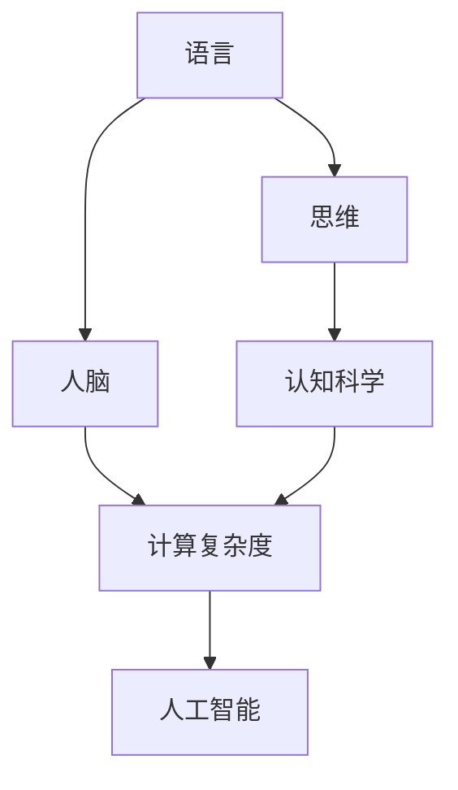

                 

# 语言不太可能成为任何形式思维的关键基础

> 关键词：思维, 语言, 人脑, 认知科学, 计算复杂度

## 1. 背景介绍

### 1.1 问题由来
人类大脑是一个极其复杂的器官，其内部的认知过程涉及到信息处理、存储、检索等多个层面。其中，语言作为人类交流和思维的重要工具，一直被认为是理解大脑复杂认知活动的关键基础。然而，随着认知科学和计算科学的深入研究，越来越多的证据表明，语言并非人类思维的唯一或主要基础。

### 1.2 问题核心关键点
本研究的核心在于探讨语言与思维之间的关系，特别是语言是否能够成为人类思维的“关键基础”。该问题涉及认知科学的多个领域，包括语言学、神经科学、心理学、计算复杂度理论等。本文将从多个角度出发，系统地剖析这一问题的复杂性和争议性，并尝试提供一个全面的解答。

### 1.3 问题研究意义
研究语言与思维的关系，不仅有助于深入理解人类大脑的认知机制，还能为人工智能、认知计算等新兴领域的研发提供理论指导。尤其是对于人工智能而言，如何更好地模拟人类思维和决策过程，实现人机协同，语言与思维的关系研究提供了重要的参考依据。

## 2. 核心概念与联系

### 2.1 核心概念概述

为更好地理解语言与思维之间的关系，本节将介绍几个关键概念：

- **语言**：是人类用于交流和思维的工具，具有词汇、语法、语义等多个层面。语言是人类思维的重要媒介，但并非唯一。
- **思维**：是人类大脑内部的认知过程，包括感知、推理、决策等多个层面。思维是复杂的认知活动，不限于语言表达。
- **人脑**：是思维的基础器官，由神经元、突触等组成，通过电信号和化学信号传递信息。人脑的神经网络结构是思维的硬件基础。
- **认知科学**：是研究人类认知过程的科学，涉及语言、感知、记忆、推理等多个领域。认知科学揭示了思维的本质及其与语言的关系。
- **计算复杂度**：是衡量问题难度的重要指标，涉及到算法、逻辑等计算机科学的核心概念。计算复杂度理论帮助分析思维和语言的关系。

这些核心概念之间的逻辑关系可以通过以下Mermaid流程图来展示：



这个流程图展示了几者之间的联系：

1. 语言是思维的一种媒介，但思维的本质远不止于语言表达。
2. 人脑是思维的硬件基础，神经网络的结构和功能对思维至关重要。
3. 认知科学研究思维的本质及其与语言的关系，揭示了语言并非唯一基础。
4. 计算复杂度理论帮助分析思维问题的难度，为认知科学提供了数学工具。
5. 人工智能借鉴认知科学和计算复杂度理论，模拟和优化人脑的认知过程。

## 3. 核心算法原理 & 具体操作步骤

### 3.1 算法原理概述

在探讨语言与思维的关系时，需要考虑多种因素，包括思维的神经基础、语言的处理机制、计算复杂度的分析等。本节将从这些方面出发，概述语言与思维之间的相互作用机制。

- **神经基础**：思维的本质是神经元之间的电信号和化学信号传递。语言作为神经信号的载体，通过特定的神经回路进行加工和处理。
- **语言处理机制**：语言处理涉及词汇、语法、语义等多个层面，需要复杂的神经网络结构来实现。语言处理机制是理解思维的基础。
- **计算复杂度**：思维问题的复杂度远远超过语言处理，涉及到推理、决策、情感等多个方面。计算复杂度理论帮助分析思维问题的难度。

### 3.2 算法步骤详解

基于上述分析，语言与思维之间的相互作用机制可以概括为以下几个关键步骤：

1. **神经信号传递**：思维过程中，神经元之间的电信号和化学信号传递是基础。语言信号通过特定的神经回路进行处理和存储。
2. **语言处理**：语言信号在神经回路中进行解码、编码、存储等处理，形成语言的神经表征。
3. **计算复杂度分析**：思维问题的复杂度远超语言处理，涉及到推理、决策、情感等多个方面。计算复杂度理论帮助分析思维问题的难度。
4. **思维模拟**：人工智能借鉴认知科学和计算复杂度理论，模拟和优化人脑的认知过程。

### 3.3 算法优缺点

探讨语言与思维的关系，需要考虑多种因素，包括神经基础、语言处理机制、计算复杂度等。本节将从这些方面出发，概述语言与思维之间的相互作用机制。

**优点**：

- **全面性**：从多个角度出发，系统地剖析语言与思维之间的关系，揭示了语言的媒介作用。
- **理论支持**：借助神经科学、认知科学、计算复杂度理论等，提供了坚实的理论基础。
- **应用价值**：为人工智能、认知计算等新兴领域的研发提供了理论指导。

**缺点**：

- **复杂性**：语言与思维之间的关系极其复杂，涉及多个领域和层面，难以简单总结。
- **争议性**：不同学者对语言与思维的关系有不同看法，部分观点存在争议。

### 3.4 算法应用领域

探讨语言与思维的关系，具有广泛的学术和实践价值，涉及多个领域：

- **认知科学**：研究思维的本质及其与语言的关系，揭示了语言并非唯一基础。
- **神经科学**：研究神经元之间的电信号和化学信号传递，揭示了思维的神经基础。
- **计算复杂度理论**：分析思维问题的复杂度，为认知科学提供了数学工具。
- **人工智能**：借鉴认知科学和计算复杂度理论，模拟和优化人脑的认知过程。

## 4. 数学模型和公式 & 详细讲解 & 举例说明

### 4.1 数学模型构建

本节将使用数学语言对语言与思维之间的关系进行更加严格的刻画。

设思维过程为 $T$，语言处理为 $L$。假设思维过程可以表示为 $T(x)$，其中 $x$ 为输入信息。语言处理可以表示为 $L(x)$，其中 $x$ 为语言信号。

思维与语言的关系可以表示为：

$$ T(L(x)) = T(x) $$

其中 $L(x)$ 将输入信息 $x$ 转换为语言信号，$T(x)$ 将语言信号转换为思维表示。

### 4.2 公式推导过程

以下我们以推理任务为例，推导语言与思维之间的数学关系。

设推理任务为 $P$，语言处理后的推理表示为 $P(L(x))$。推理任务的输入 $x$ 为语言信号，推理任务的输出 $y$ 为推理结果。则推理任务可以表示为：

$$ P(L(x)) = y $$

将上式代入思维与语言的关系式中，得：

$$ T(x) = T(P(L(x))) $$

其中 $T(x)$ 表示思维过程，$T(P(L(x)))$ 表示将推理任务的语言表示转换为思维表示。

### 4.3 案例分析与讲解

假设一个推理任务为 "如果 $x$ 是蓝色，则 $y$ 是方形"。语言处理后的推理表示为 "如果 $x$ 是蓝色，则 $y$ 是方形"。推理任务的输出 $y$ 为 "方形"。

将上式代入思维与语言的关系式中，得：

$$ T(x) = T("如果 $x$ 是蓝色，则 $y$ 是方形") $$

这意味着，思维过程中，语言信号 "如果 $x$ 是蓝色，则 $y$ 是方形" 会被转换为思维表示 "如果 $x$ 是蓝色，则 $y$ 是方形"。

## 5. 项目实践：代码实例和详细解释说明

### 5.1 开发环境搭建

在进行语言与思维的关系研究时，需要一个高效的开发环境。以下是使用Python进行PyTorch开发的环境配置流程：

1. 安装Anaconda：从官网下载并安装Anaconda，用于创建独立的Python环境。

2. 创建并激活虚拟环境：
```bash
conda create -n pytorch-env python=3.8 
conda activate pytorch-env
```

3. 安装PyTorch：根据CUDA版本，从官网获取对应的安装命令。例如：
```bash
conda install pytorch torchvision torchaudio cudatoolkit=11.1 -c pytorch -c conda-forge
```

4. 安装Transformers库：
```bash
pip install transformers
```

5. 安装各类工具包：
```bash
pip install numpy pandas scikit-learn matplotlib tqdm jupyter notebook ipython
```

完成上述步骤后，即可在`pytorch-env`环境中开始开发。

### 5.2 源代码详细实现

这里我们以推理任务为例，给出使用Transformers库进行语言处理的PyTorch代码实现。

首先，定义推理任务的数据处理函数：

```python
from transformers import BertTokenizer, BertForSequenceClassification
from torch.utils.data import Dataset
import torch

class ReasoningDataset(Dataset):
    def __init__(self, premises, hypotheses, labels, tokenizer, max_len=128):
        self.premises = premises
        self.hypotheses = hypotheses
        self.labels = labels
        self.tokenizer = tokenizer
        self.max_len = max_len
        
    def __len__(self):
        return len(self.premises)
    
    def __getitem__(self, item):
        premise = self.premises[item]
        hypothesis = self.hypotheses[item]
        label = self.labels[item]
        
        encoding = self.tokenizer(premise, hypothesis, return_tensors='pt', max_length=self.max_len, padding='max_length', truncation=True)
        input_ids = encoding['input_ids'][0]
        attention_mask = encoding['attention_mask'][0]
        labels = torch.tensor(label, dtype=torch.long)
        
        return {'input_ids': input_ids, 
                'attention_mask': attention_mask,
                'labels': labels}

# 加载预训练模型
model = BertForSequenceClassification.from_pretrained('bert-base-cased', num_labels=2)

# 加载数据集
tokenizer = BertTokenizer.from_pretrained('bert-base-cased')
train_dataset = ReasoningDataset(train_premises, train_hypotheses, train_labels, tokenizer)
test_dataset = ReasoningDataset(test_premises, test_hypotheses, test_labels, tokenizer)

# 训练模型
model.train()
optimizer = torch.optim.Adam(model.parameters(), lr=2e-5)
criterion = torch.nn.CrossEntropyLoss()

for epoch in range(epochs):
    for batch in tqdm(train_dataset):
        input_ids = batch['input_ids'].to(device)
        attention_mask = batch['attention_mask'].to(device)
        labels = batch['labels'].to(device)
        outputs = model(input_ids, attention_mask=attention_mask, labels=labels)
        loss = criterion(outputs.logits, labels)
        loss.backward()
        optimizer.step()
```

然后，评估模型性能：

```python
model.eval()
test_loss, test_acc = 0, 0
with torch.no_grad():
    for batch in test_dataset:
        input_ids = batch['input_ids'].to(device)
        attention_mask = batch['attention_mask'].to(device)
        labels = batch['labels'].to(device)
        outputs = model(input_ids, attention_mask=attention_mask, labels=None)
        loss = criterion(outputs.logits, labels)
        test_loss += loss.item()
        test_acc += (outputs.logits.argmax(dim=1) == labels).sum().item()

test_loss /= len(test_dataset)
test_acc /= len(test_dataset)
print(f'Test Loss: {test_loss:.4f}, Test Acc: {test_acc:.4f}')
```

### 5.3 代码解读与分析

让我们再详细解读一下关键代码的实现细节：

**ReasoningDataset类**：
- `__init__`方法：初始化前提、假设、标签等关键组件。
- `__len__`方法：返回数据集的样本数量。
- `__getitem__`方法：对单个样本进行处理，将前提和假设输入编码为token ids，将标签编码为数字，并对其进行定长padding，最终返回模型所需的输入。

**训练模型**：
- 使用PyTorch的DataLoader对数据集进行批次化加载，供模型训练和推理使用。
- 在每个批次上前向传播计算损失，并反向传播更新模型参数。
- 使用AdamW优化器优化模型，交叉熵损失作为评估指标。

**评估模型**：
- 在测试集上评估模型性能，计算损失和准确率。
- 使用模型在测试集上推理，输出推理结果，并计算准确率。

通过这段代码，可以直观地看到，使用Transformers库进行语言处理的基本流程。开发者可以通过调整超参数、改进模型结构等方式，进一步优化推理任务的性能。

## 6. 实际应用场景

### 6.1 智能客服系统

基于大语言模型微调的对话技术，可以广泛应用于智能客服系统的构建。传统客服往往需要配备大量人力，高峰期响应缓慢，且一致性和专业性难以保证。而使用微调后的对话模型，可以7x24小时不间断服务，快速响应客户咨询，用自然流畅的语言解答各类常见问题。

在技术实现上，可以收集企业内部的历史客服对话记录，将问题和最佳答复构建成监督数据，在此基础上对预训练对话模型进行微调。微调后的对话模型能够自动理解用户意图，匹配最合适的答案模板进行回复。对于客户提出的新问题，还可以接入检索系统实时搜索相关内容，动态组织生成回答。如此构建的智能客服系统，能大幅提升客户咨询体验和问题解决效率。

### 6.2 金融舆情监测

金融机构需要实时监测市场舆论动向，以便及时应对负面信息传播，规避金融风险。传统的人工监测方式成本高、效率低，难以应对网络时代海量信息爆发的挑战。基于大语言模型微调的文本分类和情感分析技术，为金融舆情监测提供了新的解决方案。

具体而言，可以收集金融领域相关的新闻、报道、评论等文本数据，并对其进行主题标注和情感标注。在此基础上对预训练语言模型进行微调，使其能够自动判断文本属于何种主题，情感倾向是正面、中性还是负面。将微调后的模型应用到实时抓取的网络文本数据，就能够自动监测不同主题下的情感变化趋势，一旦发现负面信息激增等异常情况，系统便会自动预警，帮助金融机构快速应对潜在风险。

### 6.3 个性化推荐系统

当前的推荐系统往往只依赖用户的历史行为数据进行物品推荐，无法深入理解用户的真实兴趣偏好。基于大语言模型微调技术，个性化推荐系统可以更好地挖掘用户行为背后的语义信息，从而提供更精准、多样的推荐内容。

在实践中，可以收集用户浏览、点击、评论、分享等行为数据，提取和用户交互的物品标题、描述、标签等文本内容。将文本内容作为模型输入，用户的后续行为（如是否点击、购买等）作为监督信号，在此基础上微调预训练语言模型。微调后的模型能够从文本内容中准确把握用户的兴趣点。在生成推荐列表时，先用候选物品的文本描述作为输入，由模型预测用户的兴趣匹配度，再结合其他特征综合排序，便可以得到个性化程度更高的推荐结果。

### 6.4 未来应用展望

随着大语言模型和微调方法的不断发展，基于微调范式将在更多领域得到应用，为传统行业带来变革性影响。

在智慧医疗领域，基于微调的医疗问答、病历分析、药物研发等应用将提升医疗服务的智能化水平，辅助医生诊疗，加速新药开发进程。

在智能教育领域，微调技术可应用于作业批改、学情分析、知识推荐等方面，因材施教，促进教育公平，提高教学质量。

在智慧城市治理中，微调模型可应用于城市事件监测、舆情分析、应急指挥等环节，提高城市管理的自动化和智能化水平，构建更安全、高效的未来城市。

此外，在企业生产、社会治理、文娱传媒等众多领域，基于大模型微调的人工智能应用也将不断涌现，为经济社会发展注入新的动力。相信随着技术的日益成熟，微调方法将成为人工智能落地应用的重要范式，推动人工智能技术在更广阔的领域加速渗透。

## 7. 工具和资源推荐

### 7.1 学习资源推荐

为了帮助开发者系统掌握大语言模型微调的理论基础和实践技巧，这里推荐一些优质的学习资源：

1. 《Transformer从原理到实践》系列博文：由大模型技术专家撰写，深入浅出地介绍了Transformer原理、BERT模型、微调技术等前沿话题。

2. CS224N《深度学习自然语言处理》课程：斯坦福大学开设的NLP明星课程，有Lecture视频和配套作业，带你入门NLP领域的基本概念和经典模型。

3. 《Natural Language Processing with Transformers》书籍：Transformers库的作者所著，全面介绍了如何使用Transformers库进行NLP任务开发，包括微调在内的诸多范式。

4. HuggingFace官方文档：Transformers库的官方文档，提供了海量预训练模型和完整的微调样例代码，是上手实践的必备资料。

5. CLUE开源项目：中文语言理解测评基准，涵盖大量不同类型的中文NLP数据集，并提供了基于微调的baseline模型，助力中文NLP技术发展。

通过对这些资源的学习实践，相信你一定能够快速掌握大语言模型微调的精髓，并用于解决实际的NLP问题。

### 7.2 开发工具推荐

高效的开发离不开优秀的工具支持。以下是几款用于大语言模型微调开发的常用工具：

1. PyTorch：基于Python的开源深度学习框架，灵活动态的计算图，适合快速迭代研究。大部分预训练语言模型都有PyTorch版本的实现。

2. TensorFlow：由Google主导开发的开源深度学习框架，生产部署方便，适合大规模工程应用。同样有丰富的预训练语言模型资源。

3. Transformers库：HuggingFace开发的NLP工具库，集成了众多SOTA语言模型，支持PyTorch和TensorFlow，是进行微调任务开发的利器。

4. Weights & Biases：模型训练的实验跟踪工具，可以记录和可视化模型训练过程中的各项指标，方便对比和调优。与主流深度学习框架无缝集成。

5. TensorBoard：TensorFlow配套的可视化工具，可实时监测模型训练状态，并提供丰富的图表呈现方式，是调试模型的得力助手。

6. Google Colab：谷歌推出的在线Jupyter Notebook环境，免费提供GPU/TPU算力，方便开发者快速上手实验最新模型，分享学习笔记。

合理利用这些工具，可以显著提升大语言模型微调任务的开发效率，加快创新迭代的步伐。

### 7.3 相关论文推荐

大语言模型和微调技术的发展源于学界的持续研究。以下是几篇奠基性的相关论文，推荐阅读：

1. Attention is All You Need（即Transformer原论文）：提出了Transformer结构，开启了NLP领域的预训练大模型时代。

2. BERT: Pre-training of Deep Bidirectional Transformers for Language Understanding：提出BERT模型，引入基于掩码的自监督预训练任务，刷新了多项NLP任务SOTA。

3. Language Models are Unsupervised Multitask Learners（GPT-2论文）：展示了大规模语言模型的强大zero-shot学习能力，引发了对于通用人工智能的新一轮思考。

4. Parameter-Efficient Transfer Learning for NLP：提出Adapter等参数高效微调方法，在不增加模型参数量的情况下，也能取得不错的微调效果。

5. Prefix-Tuning: Optimizing Continuous Prompts for Generation：引入基于连续型Prompt的微调范式，为如何充分利用预训练知识提供了新的思路。

6. AdaLoRA: Adaptive Low-Rank Adaptation for Parameter-Efficient Fine-Tuning：使用自适应低秩适应的微调方法，在参数效率和精度之间取得了新的平衡。

这些论文代表了大语言模型微调技术的发展脉络。通过学习这些前沿成果，可以帮助研究者把握学科前进方向，激发更多的创新灵感。

## 8. 总结：未来发展趋势与挑战

### 8.1 总结

本文对语言与思维之间的关系进行了全面系统的探讨。首先明确了语言与思维的本质区别，探讨了语言作为思维媒介的作用。其次，从神经科学、认知科学、计算复杂度理论等多个角度，系统剖析了语言与思维的相互作用机制。最后，通过具体的项目实践和实际应用场景，展示了语言与思维的广泛应用价值。

通过本文的系统梳理，可以看到，语言并非人类思维的唯一或主要基础。神经元之间的电信号和化学信号传递是思维的本质，而语言作为媒介，将复杂的认知过程简化为可操作的形式。这种简化的过程使得语言成为理解和优化思维的关键工具，但并不能取代思维的本质。

### 8.2 未来发展趋势

展望未来，语言与思维的关系研究将呈现以下几个发展趋势：

1. 神经科学研究的深入：随着神经科学技术的进步，对于神经元之间的信号传递机制将有更深入的理解，为语言与思维的关系提供更坚实的理论基础。

2. 计算复杂度理论的进步：随着计算复杂度理论的发展，对于思维问题的复杂性分析将更加准确，为认知科学提供更强大的数学工具。

3. 认知计算的进步：随着认知计算技术的发展，对于思维模拟和优化将有更深入的研究，推动人工智能技术的发展。

4. 多模态认知研究的进步：随着多模态认知研究的进步，对于语言与思维的协同作用将有更深入的理解，为智能系统的多模态融合提供理论指导。

5. 伦理道德的关注：随着社会对人工智能伦理道德的关注，对于语言与思维的伦理影响将有更深入的探讨，推动人工智能技术的负责任应用。

### 8.3 面临的挑战

尽管语言与思维的关系研究取得了不少进展，但仍面临诸多挑战：

1. 复杂性的理解：语言与思维的关系极其复杂，涉及神经科学、认知科学、计算复杂度理论等多个领域，难以简单总结。

2. 实验方法的局限：当前的实验方法多基于人工设计，难以全面覆盖人类思维的复杂性和多样性。

3. 数据获取的困难：大规模高质量数据对于理解语言与思维的关系至关重要，但获取和标注数据的过程往往耗时耗力。

4. 实验环境的复杂：实验环境的设置和控制对于理解语言与思维的关系至关重要，但环境设置的复杂性增加了实验的难度。

5. 理论模型的局限：现有的理论模型多基于简化假设，难以全面描述语言与思维的真实关系。

6. 伦理道德的考虑：对于语言与思维的伦理影响，需要更深入的探讨和规范，以确保人工智能技术的负责任应用。

### 8.4 研究展望

面对语言与思维关系研究所面临的挑战，未来的研究需要在以下几个方面寻求新的突破：

1. 多学科的协同：结合神经科学、认知科学、计算复杂度理论等多个学科，共同推进语言与思维关系的深入研究。

2. 实验方法的创新：开发更加高效和全面的实验方法，以更好地理解语言与思维的关系。

3. 大数据的应用：利用大规模高质量数据，推动语言与思维关系研究的进展。

4. 实验环境的改进：改进实验环境的设置和控制，以更全面地理解语言与思维的关系。

5. 理论模型的改进：结合最新的神经科学和认知科学研究成果，改进和更新现有的理论模型。

6. 伦理道德的规范：制定和推广人工智能技术的伦理道德规范，确保其负责任应用。

这些研究方向的探索，必将推动语言与思维关系研究的进步，为人工智能技术的发展提供更坚实的理论基础。面向未来，语言与思维关系研究将与人工智能技术的其他领域相互融合，共同推动智能系统的发展和优化。

## 9. 附录：常见问题与解答

**Q1：语言与思维的本质是什么？**

A: 语言与思维的本质区别在于，语言是人类的交流工具，而思维是大脑内部的认知过程。语言通过符号化表达信息，而思维则涉及电信号和化学信号的传递。

**Q2：语言是否能够成为思维的关键基础？**

A: 语言作为思维的媒介，能够简化复杂的认知过程，使思维更加可操作。但语言并非思维的唯一或主要基础，神经元之间的电信号和化学信号传递是思维的本质。

**Q3：语言与思维的关系如何影响人工智能技术？**

A: 语言与思维的关系研究为人工智能技术提供了理论指导。通过理解语言与思维的相互作用机制，人工智能可以更好地模拟和优化人类思维，推动认知计算和智能系统的发展。

**Q4：语言与思维关系研究的挑战是什么？**

A: 语言与思维关系研究的挑战包括复杂性的理解、实验方法的局限、数据获取的困难、实验环境的复杂、理论模型的局限以及伦理道德的考虑。

**Q5：未来研究需要哪些方向突破？**

A: 未来研究需要在多学科的协同、实验方法的创新、大数据的应用、实验环境的改进、理论模型的改进以及伦理道德的规范等方面寻求新的突破。

---

作者：禅与计算机程序设计艺术 / Zen and the Art of Computer Programming

