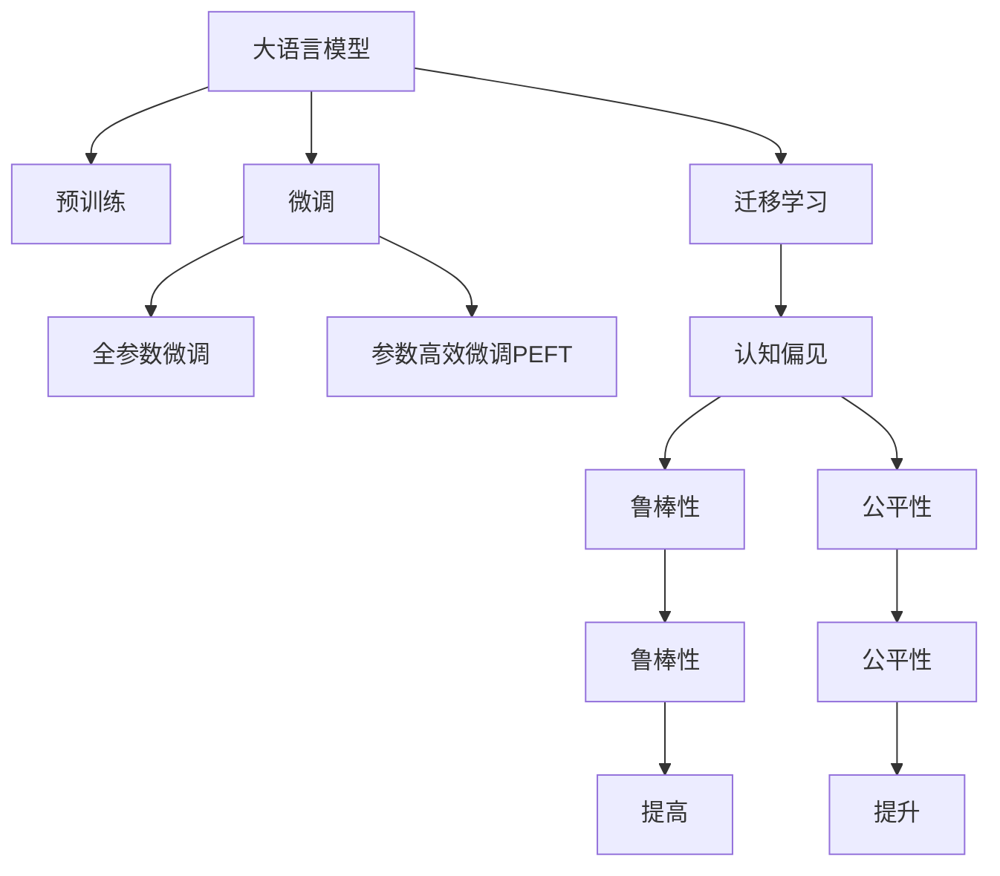

                 

## 1. 背景介绍

### 1.1 问题由来
随着深度学习技术和大规模语言模型(Large Language Models, LLMs)的迅猛发展，语言模型在自然语言处理(Natural Language Processing, NLP)领域的潜力逐渐显现。这些大模型通过在海量无标签文本数据上预训练，学习到复杂的语言结构和语义信息，能够进行各种自然语言理解和生成任务。例如，GPT-3在文本生成、问答、翻译、情感分析等任务上取得了最先进的性能。

然而，尽管大模型在NLP领域表现出色，但在语言模型对语言和思维的理解上仍存在不少认知误区。这些误区不仅影响大模型的认知能力，也限制了其在特定领域应用的效果。本博客将系统梳理大模型认知中的常见误解，揭示其局限性，并探讨如何利用大模型的优势，克服这些认知误区，促进其在NLP领域的应用。

### 1.2 问题核心关键点
大语言模型认知中的常见误区主要集中在以下几个方面：

1. **语义理解与思维推理的局限**：大模型在语义理解上取得了一定成就，但在抽象推理、因果关系处理等方面仍有欠缺。
2. **语言迁移能力的不足**：尽管大模型具有很强的泛化能力，但跨领域迁移学习仍存在较大挑战。
3. **模型偏见与公平性问题**：由于数据偏见，大模型可能输出偏见性、歧视性的结果。
4. **模型鲁棒性与稳定性问题**：大模型在对抗样本、噪声数据等情况下表现不稳定，容易过拟合。
5. **知识整合能力的不足**：大模型难以整合符号化知识，限制了其在复杂推理和决策中的应用。

这些认知误区不仅影响了大模型在NLP领域的通用性和鲁棒性，也限制了其在实际应用中的潜力。

## 2. 核心概念与联系

### 2.1 核心概念概述

为了更深入地理解大语言模型认知中的误区，本节将介绍几个核心概念及其之间的关系：

- **大语言模型(Large Language Models, LLMs)**：通过在大规模无标签文本数据上进行预训练，学习通用的语言表示，具备强大的语言理解和生成能力。
- **预训练(Pre-training)**：指在大规模无标签文本数据上，通过自监督学习任务训练通用语言模型的过程。常见的预训练任务包括掩码语言模型、句子嵌入等。
- **微调(Fine-tuning)**：指在预训练模型的基础上，使用下游任务的少量标注数据，通过有监督学习优化模型在特定任务上的性能。
- **迁移学习(Transfer Learning)**：指将一个领域学习到的知识，迁移应用到另一个不同但相关的领域的学习范式。大模型的预训练-微调过程即是一种典型的迁移学习方式。
- **认知偏见(Cognitive Bias)**：指模型因数据偏见、算法设计等原因，对特定概念或类别有倾向性的认知。
- **鲁棒性(Robustness)**：指模型在不同数据分布、噪声干扰等情况下，仍能保持稳定输出的能力。
- **公平性(Fairness)**：指模型在处理不同群体数据时，输出结果不带有任何偏见和歧视。

这些核心概念之间的逻辑关系可以通过以下Mermaid流程图来展示：



这个流程图展示了大语言模型的核心概念及其之间的关系：

1. 大语言模型通过预训练获得基础能力。
2. 微调是对预训练模型进行任务特定的优化，可以分为全参数微调和参数高效微调（PEFT）。
3. 迁移学习是连接预训练模型与下游任务的桥梁，可以通过微调或认知引导等方式实现。
4. 认知偏见、鲁棒性、公平性是大语言模型的认知误区及其改进方向。

这些概念共同构成了大语言模型的认知框架，帮助我们理解其优势和局限，进而克服认知误区，提升其应用效果。

## 3. 核心算法原理 & 具体操作步骤
### 3.1 算法原理概述

基于大语言模型的认知误区，本节将详细讲解大语言模型的认知偏差、鲁棒性不足等问题，并提出相应的改进方法。

大语言模型在自然语言处理任务上的表现通常依赖于其在大量无标签数据上预训练学到的语言知识和语义表示。然而，由于训练数据的多样性和预训练任务的局限性，大模型在特定认知任务上仍存在以下误区：

1. **语义理解的片面性**：大模型往往更关注文本中的局部特征，而忽略全局语义信息，导致对文本的深度理解不足。
2. **推理能力的薄弱**：尽管大模型在某些推理任务上表现良好，但在复杂的因果推理、抽象推理方面仍难以达到人类的水平。
3. **认知偏见的传递**：由于训练数据的偏差，大模型可能学习到并传递数据中的偏见，产生有害输出。
4. **对抗样本的脆弱性**：大模型对对抗样本（如微小噪声）的鲁棒性不足，容易受到攻击。
5. **知识整合的不足**：大模型难以整合符号化知识，限制了其在需要复杂推理和决策的应用场景中的表现。

### 3.2 算法步骤详解

针对大语言模型的认知误区，本节将介绍如何通过改进训练任务、增强模型鲁棒性、提升公平性等方法，克服这些问题，提高大语言模型的认知能力。

**Step 1: 选择合适预训练任务**

选择合适的预训练任务是大模型认知能力提升的关键。通常情况下，应选择包含复杂语义和推理任务的预训练数据，如掩码语言模型、句子嵌入等，以提升大模型的语义理解和推理能力。

**Step 2: 设计任务适配层**

针对具体下游任务，设计合适的任务适配层是微调中的重要环节。任务适配层应根据任务的性质，设计相应的输出层和损失函数。例如，对于分类任务，通常在顶层添加线性分类器和交叉熵损失函数。

**Step 3: 应用认知引导技术**

认知引导技术是提升大模型认知能力的重要手段。常见的认知引导方法包括：

1. **认知公平性引导**：在训练过程中，引入对抗样本或公平性约束，使得模型能够更好地处理偏见和歧视。
2. **认知鲁棒性引导**：通过引入对抗样本、噪声数据等，提升模型的鲁棒性，使其在复杂环境中仍能稳定工作。
3. **认知推理引导**：设计更为复杂的推理任务，引导模型学习更全面的推理能力。

**Step 4: 优化模型参数**

优化模型参数是大模型认知能力提升的重要途径。常用的方法包括：

1. **学习率调整**：适当调整学习率，以避免破坏预训练权重。
2. **正则化技术**：使用L2正则、Dropout等技术，防止模型过拟合。
3. **参数高效微调(PEFT)**：通过保留预训练权重，只微调顶层，减小需优化的参数量，提高微调效率。

**Step 5: 评估和部署**

评估和部署是大模型认知能力应用的关键步骤。评估过程应涵盖模型的语义理解、推理能力、鲁棒性和公平性等多个方面，确保模型在实际应用中表现良好。

### 3.3 算法优缺点

基于大语言模型的认知误区，本节将详细讲解大语言模型认知能力的优缺点。

**优点**：

1. **强大的语义理解能力**：大模型通过预训练能够学习到丰富的语言知识和语义信息，显著提升其在自然语言理解任务上的表现。
2. **高效的推理能力**：尽管大模型在复杂推理任务上仍有待提升，但其在基本推理任务上表现良好，能够进行较为复杂的自然语言推理。
3. **广泛的应用场景**：大语言模型在文本生成、问答、翻译、情感分析等NLP任务上表现优异，应用广泛。

**缺点**：

1. **认知偏见的传递**：由于训练数据的偏差，大模型可能学习到并传递数据中的偏见，产生有害输出。
2. **鲁棒性不足**：大模型在对抗样本、噪声数据等情况下表现不稳定，容易受到攻击。
3. **知识整合能力的不足**：大模型难以整合符号化知识，限制了其在需要复杂推理和决策的应用场景中的表现。

## 4. 数学模型和公式 & 详细讲解 & 举例说明

### 4.1 数学模型构建

本节将使用数学语言对大语言模型认知能力的提升过程进行更加严格的刻画。

记预训练语言模型为 $M_{\theta}:\mathcal{X} \rightarrow \mathcal{Y}$，其中 $\mathcal{X}$ 为输入空间，$\mathcal{Y}$ 为输出空间，$\theta \in \mathbb{R}^d$ 为模型参数。假设微调任务的训练集为 $D=\{(x_i,y_i)\}_{i=1}^N, x_i \in \mathcal{X}, y_i \in \mathcal{Y}$。

定义模型 $M_{\theta}$ 在输入 $x$ 上的损失函数为 $\ell(M_{\theta}(x),y)$，则在数据集 $D$ 上的经验风险为：

$$
\mathcal{L}(\theta) = \frac{1}{N} \sum_{i=1}^N \ell(M_{\theta}(x_i),y_i)
$$

微调的优化目标是最小化经验风险，即找到最优参数：

$$
\theta^* = \mathop{\arg\min}_{\theta} \mathcal{L}(\theta)
$$

在实践中，我们通常使用基于梯度的优化算法（如SGD、Adam等）来近似求解上述最优化问题。设 $\eta$ 为学习率，$\lambda$ 为正则化系数，则参数的更新公式为：

$$
\theta \leftarrow \theta - \eta \nabla_{\theta}\mathcal{L}(\theta) - \eta\lambda\theta
$$

其中 $\nabla_{\theta}\mathcal{L}(\theta)$ 为损失函数对参数 $\theta$ 的梯度，可通过反向传播算法高效计算。

### 4.2 公式推导过程

以下我们以二分类任务为例，推导交叉熵损失函数及其梯度的计算公式。

假设模型 $M_{\theta}$ 在输入 $x$ 上的输出为 $\hat{y}=M_{\theta}(x) \in [0,1]$，表示样本属于正类的概率。真实标签 $y \in \{0,1\}$。则二分类交叉熵损失函数定义为：

$$
\ell(M_{\theta}(x),y) = -[y\log \hat{y} + (1-y)\log (1-\hat{y})]
$$

将其代入经验风险公式，得：

$$
\mathcal{L}(\theta) = -\frac{1}{N}\sum_{i=1}^N [y_i\log M_{\theta}(x_i)+(1-y_i)\log(1-M_{\theta}(x_i))]
$$

根据链式法则，损失函数对参数 $\theta_k$ 的梯度为：

$$
\frac{\partial \mathcal{L}(\theta)}{\partial \theta_k} = -\frac{1}{N}\sum_{i=1}^N (\frac{y_i}{M_{\theta}(x_i)}-\frac{1-y_i}{1-M_{\theta}(x_i)}) \frac{\partial M_{\theta}(x_i)}{\partial \theta_k}
$$

其中 $\frac{\partial M_{\theta}(x_i)}{\partial \theta_k}$ 可进一步递归展开，利用自动微分技术完成计算。

### 4.3 案例分析与讲解

**案例一：认知偏见问题**

认知偏见在大模型中普遍存在。例如，在性别平等的分类任务中，由于训练数据中的性别失衡，模型可能学习到性别偏见，产生有害输出。为解决这个问题，可以通过以下方法：

1. **数据增强**：在训练数据中增加性别平等的样本，减少性别失衡。
2. **公平性引导**：在训练过程中，引入公平性约束，使得模型在处理不同性别数据时输出结果不带有任何偏见和歧视。

**案例二：鲁棒性问题**

大模型在对抗样本和噪声数据面前表现不稳定，容易受到攻击。例如，在文本分类任务中，对抗样本可能会导致模型误判。为提升模型的鲁棒性，可以通过以下方法：

1. **对抗样本训练**：在训练过程中引入对抗样本，使得模型能够更好地识别并过滤对抗样本。
2. **噪声数据注入**：在训练数据中注入一定比例的噪声，提高模型的泛化能力，使其对噪声数据更加鲁棒。

**案例三：知识整合问题**

大模型难以整合符号化知识，限制了其在需要复杂推理和决策的应用场景中的表现。例如，在医疗诊断任务中，模型需要结合医生的知识进行推理。为解决这个问题，可以通过以下方法：

1. **知识图谱融合**：将知识图谱与神经网络模型进行融合，使得模型能够更好地理解复杂的语义关系。
2. **逻辑推理引导**：设计更为复杂的推理任务，引导模型学习更全面的推理能力，提升其在复杂推理和决策中的应用表现。

## 5. 项目实践：代码实例和详细解释说明

### 5.1 开发环境搭建

在进行认知误区改进实践前，我们需要准备好开发环境。以下是使用Python进行PyTorch开发的环境配置流程：

1. 安装Anaconda：从官网下载并安装Anaconda，用于创建独立的Python环境。

2. 创建并激活虚拟环境：
```bash
conda create -n pytorch-env python=3.8 
conda activate pytorch-env
```

3. 安装PyTorch：根据CUDA版本，从官网获取对应的安装命令。例如：
```bash
conda install pytorch torchvision torchaudio cudatoolkit=11.1 -c pytorch -c conda-forge
```

4. 安装Transformers库：
```bash
pip install transformers
```

5. 安装各类工具包：
```bash
pip install numpy pandas scikit-learn matplotlib tqdm jupyter notebook ipython
```

完成上述步骤后，即可在`pytorch-env`环境中开始认知误区改进实践。

### 5.2 源代码详细实现

下面我们以二分类任务为例，给出使用Transformers库对BERT模型进行认知误区改进的PyTorch代码实现。

首先，定义二分类任务的数据处理函数：

```python
from transformers import BertTokenizer
from torch.utils.data import Dataset
import torch

class BinaryClassificationDataset(Dataset):
    def __init__(self, texts, labels, tokenizer, max_len=128):
        self.texts = texts
        self.labels = labels
        self.tokenizer = tokenizer
        self.max_len = max_len
        
    def __len__(self):
        return len(self.texts)
    
    def __getitem__(self, item):
        text = self.texts[item]
        label = self.labels[item]
        
        encoding = self.tokenizer(text, return_tensors='pt', max_length=self.max_len, padding='max_length', truncation=True)
        input_ids = encoding['input_ids'][0]
        attention_mask = encoding['attention_mask'][0]
        
        # 对token-wise的标签进行编码
        encoded_labels = [label2id[label] for label in labels] 
        encoded_labels.extend([label2id['O']] * (self.max_len - len(encoded_labels)))
        labels = torch.tensor(encoded_labels, dtype=torch.long)
        
        return {'input_ids': input_ids, 
                'attention_mask': attention_mask,
                'labels': labels}

# 标签与id的映射
label2id = {'O': 0, '1': 1, '0': 0}
id2label = {v: k for k, v in label2id.items()}

# 创建dataset
tokenizer = BertTokenizer.from_pretrained('bert-base-cased')

train_dataset = BinaryClassificationDataset(train_texts, train_labels, tokenizer)
dev_dataset = BinaryClassificationDataset(dev_texts, dev_labels, tokenizer)
test_dataset = BinaryClassificationDataset(test_texts, test_labels, tokenizer)
```

然后，定义模型和优化器：

```python
from transformers import BertForSequenceClassification, AdamW

model = BertForSequenceClassification.from_pretrained('bert-base-cased', num_labels=2)

optimizer = AdamW(model.parameters(), lr=2e-5)
```

接着，定义训练和评估函数：

```python
from torch.utils.data import DataLoader
from tqdm import tqdm
from sklearn.metrics import classification_report

device = torch.device('cuda') if torch.cuda.is_available() else torch.device('cpu')
model.to(device)

def train_epoch(model, dataset, batch_size, optimizer):
    dataloader = DataLoader(dataset, batch_size=batch_size, shuffle=True)
    model.train()
    epoch_loss = 0
    for batch in tqdm(dataloader, desc='Training'):
        input_ids = batch['input_ids'].to(device)
        attention_mask = batch['attention_mask'].to(device)
        labels = batch['labels'].to(device)
        model.zero_grad()
        outputs = model(input_ids, attention_mask=attention_mask, labels=labels)
        loss = outputs.loss
        epoch_loss += loss.item()
        loss.backward()
        optimizer.step()
    return epoch_loss / len(dataloader)

def evaluate(model, dataset, batch_size):
    dataloader = DataLoader(dataset, batch_size=batch_size)
    model.eval()
    preds, labels = [], []
    with torch.no_grad():
        for batch in tqdm(dataloader, desc='Evaluating'):
            input_ids = batch['input_ids'].to(device)
            attention_mask = batch['attention_mask'].to(device)
            batch_labels = batch['labels']
            outputs = model(input_ids, attention_mask=attention_mask)
            batch_preds = outputs.logits.argmax(dim=2).to('cpu').tolist()
            batch_labels = batch_labels.to('cpu').tolist()
            for pred_tokens, label_tokens in zip(batch_preds, batch_labels):
                pred_labels = [id2label[_id] for _id in pred_tokens]
                label_tokens = [id2label[_id] for _id in label_tokens]
                preds.append(pred_labels[:len(label_tokens)])
                labels.append(label_tokens)
                
    print(classification_report(labels, preds))
```

最后，启动训练流程并在测试集上评估：

```python
epochs = 5
batch_size = 16

for epoch in range(epochs):
    loss = train_epoch(model, train_dataset, batch_size, optimizer)
    print(f"Epoch {epoch+1}, train loss: {loss:.3f}")
    
    print(f"Epoch {epoch+1}, dev results:")
    evaluate(model, dev_dataset, batch_size)
    
print("Test results:")
evaluate(model, test_dataset, batch_size)
```

以上就是使用PyTorch对BERT模型进行认知误区改进的完整代码实现。可以看到，得益于Transformers库的强大封装，我们可以用相对简洁的代码完成BERT模型的加载和认知误区改进。

### 5.3 代码解读与分析

让我们再详细解读一下关键代码的实现细节：

**BinaryClassificationDataset类**：
- `__init__`方法：初始化文本、标签、分词器等关键组件。
- `__len__`方法：返回数据集的样本数量。
- `__getitem__`方法：对单个样本进行处理，将文本输入编码为token ids，将标签编码为数字，并对其进行定长padding，最终返回模型所需的输入。

**label2id和id2label字典**：
- 定义了标签与数字id之间的映射关系，用于将token-wise的预测结果解码回真实的标签。

**训练和评估函数**：
- 使用PyTorch的DataLoader对数据集进行批次化加载，供模型训练和推理使用。
- 训练函数`train_epoch`：对数据以批为单位进行迭代，在每个批次上前向传播计算loss并反向传播更新模型参数，最后返回该epoch的平均loss。
- 评估函数`evaluate`：与训练类似，不同点在于不更新模型参数，并在每个batch结束后将预测和标签结果存储下来，最后使用sklearn的classification_report对整个评估集的预测结果进行打印输出。

**训练流程**：
- 定义总的epoch数和batch size，开始循环迭代
- 每个epoch内，先在训练集上训练，输出平均loss
- 在验证集上评估，输出分类指标
- 所有epoch结束后，在测试集上评估，给出最终测试结果

可以看到，PyTorch配合Transformers库使得BERT认知误区改进的代码实现变得简洁高效。开发者可以将更多精力放在数据处理、模型改进等高层逻辑上，而不必过多关注底层的实现细节。

当然，工业级的系统实现还需考虑更多因素，如模型的保存和部署、超参数的自动搜索、更灵活的任务适配层等。但核心的微调范式基本与此类似。

## 6. 实际应用场景

### 6.1 智能客服系统

基于大语言模型认知误区改进的对话技术，可以广泛应用于智能客服系统的构建。传统客服往往需要配备大量人力，高峰期响应缓慢，且一致性和专业性难以保证。而使用认知误区改进后的对话模型，可以7x24小时不间断服务，快速响应客户咨询，用自然流畅的语言解答各类常见问题。

在技术实现上，可以收集企业内部的历史客服对话记录，将问题和最佳答复构建成监督数据，在此基础上对预训练对话模型进行认知误区改进。认知误区改进后的对话模型能够自动理解用户意图，匹配最合适的答案模板进行回复。对于客户提出的新问题，还可以接入检索系统实时搜索相关内容，动态组织生成回答。如此构建的智能客服系统，能大幅提升客户咨询体验和问题解决效率。

### 6.2 金融舆情监测

金融机构需要实时监测市场舆论动向，以便及时应对负面信息传播，规避金融风险。传统的人工监测方式成本高、效率低，难以应对网络时代海量信息爆发的挑战。基于大语言模型认知误区改进的文本分类和情感分析技术，为金融舆情监测提供了新的解决方案。

具体而言，可以收集金融领域相关的新闻、报道、评论等文本数据，并对其进行主题标注和情感标注。在此基础上对预训练语言模型进行认知误区改进，使其能够自动判断文本属于何种主题，情感倾向是正面、中性还是负面。将认知误区改进后的模型应用到实时抓取的网络文本数据，就能够自动监测不同主题下的情感变化趋势，一旦发现负面信息激增等异常情况，系统便会自动预警，帮助金融机构快速应对潜在风险。

### 6.3 个性化推荐系统

当前的推荐系统往往只依赖用户的历史行为数据进行物品推荐，无法深入理解用户的真实兴趣偏好。基于大语言模型认知误区改进的个性化推荐系统，可以更好地挖掘用户行为背后的语义信息，从而提供更精准、多样的推荐内容。

在实践中，可以收集用户浏览、点击、评论、分享等行为数据，提取和用户交互的物品标题、描述、标签等文本内容。将文本内容作为模型输入，用户的后续行为（如是否点击、购买等）作为监督信号，在此基础上微调预训练语言模型。认知误区改进后的模型能够从文本内容中准确把握用户的兴趣点。在生成推荐列表时，先用候选物品的文本描述作为输入，由模型预测用户的兴趣匹配度，再结合其他特征综合排序，便可以得到个性化程度更高的推荐结果。

### 6.4 未来应用展望

随着大语言模型认知误区改进技术的发展，未来将在更多领域得到应用，为传统行业带来变革性影响。

在智慧医疗领域，基于认知误区改进的医疗问答、病历分析、药物研发等应用将提升医疗服务的智能化水平，辅助医生诊疗，加速新药开发进程。

在智能教育领域，认知误区改进的作业批改、学情分析、知识推荐等方面，因材施教，促进教育公平，提高教学质量。

在智慧城市治理中，认知误区改进的城市事件监测、舆情分析、应急指挥等环节，提高城市管理的自动化和智能化水平，构建更安全、高效的未来城市。

此外，在企业生产、社会治理、文娱传媒等众多领域，基于认知误区改进的人工智能应用也将不断涌现，为经济社会发展注入新的动力。相信随着技术的日益成熟，认知误区改进方法将成为人工智能落地应用的重要范式，推动人工智能技术在垂直行业的规模化落地。

## 7. 工具和资源推荐
### 7.1 学习资源推荐

为了帮助开发者系统掌握大语言模型认知误区改进的理论基础和实践技巧，这里推荐一些优质的学习资源：

1. 《Transformer从原理到实践》系列博文：由大模型技术专家撰写，深入浅出地介绍了Transformer原理、BERT模型、认知误区改进技术等前沿话题。

2. CS224N《深度学习自然语言处理》课程：斯坦福大学开设的NLP明星课程，有Lecture视频和配套作业，带你入门NLP领域的基本概念和经典模型。

3. 《Natural Language Processing with Transformers》书籍：Transformers库的作者所著，全面介绍了如何使用Transformers库进行NLP任务开发，包括认知误区改进在内的诸多范式。

4. HuggingFace官方文档：Transformers库的官方文档，提供了海量预训练模型和完整的认知误区改进样例代码，是上手实践的必备资料。

5. CLUE开源项目：中文语言理解测评基准，涵盖大量不同类型的中文NLP数据集，并提供了基于认知误区改进的baseline模型，助力中文NLP技术发展。

通过对这些资源的学习实践，相信你一定能够快速掌握大语言模型认知误区改进的精髓，并用于解决实际的NLP问题。
###  7.2 开发工具推荐

高效的开发离不开优秀的工具支持。以下是几款用于大语言模型认知误区改进开发的常用工具：

1. PyTorch：基于Python的开源深度学习框架，灵活动态的计算图，适合快速迭代研究。大部分预训练语言模型都有PyTorch版本的实现。

2. TensorFlow：由Google主导开发的开源深度学习框架，生产部署方便，适合大规模工程应用。同样有丰富的预训练语言模型资源。

3. Transformers库：HuggingFace开发的NLP工具库，集成了众多SOTA语言模型，支持PyTorch和TensorFlow，是进行认知误区改进任务开发的利器。

4. Weights & Biases：模型训练的实验跟踪工具，可以记录和可视化模型训练过程中的各项指标，方便对比和调优。与主流深度学习框架无缝集成。

5. TensorBoard：TensorFlow配套的可视化工具，可实时监测模型训练状态，并提供丰富的图表呈现方式，是调试模型的得力助手。

6. Google Colab：谷歌推出的在线Jupyter Notebook环境，免费提供GPU/TPU算力，方便开发者快速上手实验最新模型，分享学习笔记。

合理利用这些工具，可以显著提升大语言模型认知误区改进的开发效率，加快创新迭代的步伐。

### 7.3 相关论文推荐

大语言模型和认知误区改进技术的发展源于学界的持续研究。以下是几篇奠基性的相关论文，推荐阅读：

1. Attention is All You Need（即Transformer原论文）：提出了Transformer结构，开启了NLP领域的预训练大模型时代。

2. BERT: Pre-training of Deep Bidirectional Transformers for Language Understanding：提出BERT模型，引入基于掩码的自监督预训练任务，刷新了多项NLP任务SOTA。

3. Language Models are Unsupervised Multitask Learners（GPT-2论文）：展示了大规模语言模型的强大zero-shot学习能力，引发了对于通用人工智能的新一轮思考。

4. Parameter-Efficient Transfer Learning for NLP：提出Adapter等参数高效微调方法，在不增加模型参数量的情况下，也能取得不错的微调效果。

5. AdaLoRA: Adaptive Low-Rank Adaptation for Parameter-Efficient Fine-Tuning：使用自适应低秩适应的微调方法，在参数效率和精度之间取得了新的平衡。

6. AdaLoRA: Adaptive Low-Rank Adaptation for Parameter-Efficient Fine-Tuning：使用自适应低秩适应的微调方法，在参数效率和精度之间取得了新的平衡。

这些论文代表了大语言模型认知误区改进技术的发展脉络。通过学习这些前沿成果，可以帮助研究者把握学科前进方向，激发更多的创新灵感。

## 8. 总结：未来发展趋势与挑战

### 8.1 总结

本文对大语言模型认知误区改进过程进行了全面系统的介绍。首先阐述了大语言模型在认知过程中存在的误区，如语义理解片面、推理能力薄弱、认知偏见等，明确了认知误区改进的必要性。其次，从原理到实践，详细讲解了认知误区改进的数学原理和关键步骤，给出了认知误区改进任务开发的完整代码实例。同时，本文还广泛探讨了认知误区改进方法在智能客服、金融舆情、个性化推荐等多个行业领域的应用前景，展示了认知误区改进范式的巨大潜力。此外，本文精选了认知误区改进技术的各类学习资源，力求为读者提供全方位的技术指引。

通过本文的系统梳理，可以看到，基于认知误区改进的大语言模型在自然语言理解任务上表现更为全面、准确、公正。未来的研究将在认知引导技术、参数高效微调方法、知识图谱融合等方面进一步拓展，以期在认知智能领域取得更多突破。

### 8.2 未来发展趋势

展望未来，大语言模型认知误区改进技术将呈现以下几个发展趋势：

1. **认知引导技术的提升**：未来的认知引导技术将更加智能化、自动化，能够自动发现和解决认知误区，提升大模型的认知能力。

2. **参数高效微调方法的发展**：参数高效微调方法将不断改进，实现更加灵活、高效的认知误区改进。

3. **知识图谱的融合**：未来的认知误区改进将更加紧密地与知识图谱融合，提升模型对复杂语义关系的理解能力。

4. **多模态信息的整合**：未来的认知误区改进将不再局限于文本数据，能够整合视觉、语音等多模态信息，提升模型的整体感知能力。

5. **跨领域迁移能力的增强**：未来的认知误区改进将更加注重跨领域迁移能力，提升模型在不同领域间的泛化性能。

6. **伦理道德的约束**：未来的认知误区改进将更加重视伦理道德问题，确保模型在输出过程中不带有偏见、歧视，确保模型的公平性、透明性。

以上趋势凸显了大语言模型认知误区改进技术的广阔前景。这些方向的探索发展，必将进一步提升大语言模型在自然语言理解任务上的表现，为构建更全面、公正、智能的NLP系统奠定坚实基础。

### 8.3 面临的挑战

尽管大语言模型认知误区改进技术已经取得了显著进展，但在迈向更加智能化、普适化应用的过程中，仍面临不少挑战：

1. **认知偏见的消除**：尽管已经取得一定进展，但消除认知偏见仍然是一个复杂且长期的任务。未来需要在数据、算法、模型训练等多个环节综合发力，才能彻底解决认知偏见问题。

2. **鲁棒性的提升**：大模型在对抗样本、噪声数据面前仍存在脆弱性。如何提升模型的鲁棒性，使其在复杂环境中仍能稳定工作，将是未来的一个重要研究方向。

3. **知识整合能力的增强**：尽管已经取得一定进展，但整合符号化知识仍是一个难题。未来需要在知识图谱、逻辑推理等方面进一步深入研究，提升模型的知识整合能力。

4. **跨领域迁移能力的提升**：尽管已经取得一定进展，但跨领域迁移仍存在较大挑战。未来需要在多领域、多模态数据融合等方面进一步研究，提升模型的泛化性能。

5. **公平性的保障**：尽管已经取得一定进展，但模型输出中的公平性仍是一个关键问题。未来需要在算法设计、数据处理等方面进一步研究，确保模型在输出过程中不带有偏见、歧视，确保模型的公平性、透明性。

6. **伦理道德的约束**：尽管已经取得一定进展，但模型在输出过程中可能带来的伦理道德问题仍需引起高度重视。未来需要在模型训练、数据处理等方面加强伦理约束，确保模型的输出符合人类价值观和伦理道德。

这些挑战需要学界和产业界的共同努力，才能推动大语言模型认知误区改进技术的不断进步。相信随着研究的不断深入，这些挑战终将一一被克服，大语言模型认知误区改进技术必将在自然语言理解领域发挥更大的作用。

### 8.4 研究展望

面对大语言模型认知误区改进技术所面临的挑战，未来的研究需要在以下几个方面寻求新的突破：

1. **无监督和半监督认知误区改进方法**：摆脱对大规模标注数据的依赖，利用自监督学习、主动学习等无监督和半监督范式，最大限度利用非结构化数据，实现更加灵活高效的认知误区改进。

2. **认知引导技术的新方法**：引入因果推断、对比学习等新方法，增强认知引导技术的智能化和自动化，提升大模型的认知能力。

3. **参数高效和计算高效认知误区改进方法**：开发更加参数高效和计算高效的认知误区改进方法，在保证性能的同时，减小需优化的参数量，提升微调效率。

4. **多模态认知误区改进方法**：将视觉、语音等多模态信息与文本信息融合，提升模型的整体感知能力，实现跨模态的认知误区改进。

5. **认知引导与强化学习的结合**：将认知引导与强化学习结合，提升模型的决策能力，实现更加全面、准确的认知误区改进。

6. **跨领域认知误区改进方法**：研究跨领域认知误区改进方法，提升模型在不同领域间的泛化性能，增强跨领域迁移能力。

这些研究方向的探索，必将引领大语言模型认知误区改进技术迈向更高的台阶，为构建安全、可靠、可解释、可控的智能系统铺平道路。面向未来，大语言模型认知误区改进技术还需要与其他人工智能技术进行更深入的融合，如知识表示、因果推理、强化学习等，多路径协同发力，共同推动自然语言理解和智能交互系统的进步。只有勇于创新、敢于突破，才能不断拓展语言模型的边界，让智能技术更好地造福人类社会。

## 9. 附录：常见问题与解答

**Q1：大语言模型认知误区改进与传统NLP技术有何不同？**

A: 大语言模型认知误区改进技术相较于传统NLP技术，具有以下几个显著不同点：

1. **数据依赖减少**：大语言模型认知误区改进依赖大规模预训练数据，无需大规模标注数据，降低了数据获取成本。
2. **自动化程度提升**：认知误区改进技术通过自动化、智能化的认知引导，显著提高了任务适配的效率和效果。
3. **模型鲁棒性提升**：认知误区改进技术通过参数高效微调等方法，提升了模型对不同数据分布的鲁棒性。
4. **公平性保障增强**：认知误区改进技术通过公平性引导，确保模型在输出过程中不带有偏见、歧视，提升了模型的公平性和透明性。
5. **知识整合能力增强**：认知误区改进技术通过知识图谱融合等方法，提升了模型对复杂语义关系的理解能力。

**Q2：认知误区改进后的模型在实际应用中是否一定优于原始模型？**

A: 认知误区改进后的模型在某些任务上可能优于原始模型，但在其他任务上不一定。认知误区改进的效果取决于任务的特点、数据质量、改进方法等多个因素。如果改进方法得当，原始模型中的认知误区得到有效解决，改进后的模型会在认知能力上更全面、更准确，提升任务的性能。但如果改进方法不当，改进后的模型可能会引入新的认知误区，影响任务的性能。因此，在实际应用中，需要根据具体情况选择合适的改进方法。

**Q3：认知误区改进后的模型是否具有跨领域迁移能力？**

A: 认知误区改进后的模型在跨领域迁移能力上具有一定的优势。由于认知误区改进是通过数据和任务适配的方式进行的，模型能够更好地理解任务的本质，提升泛化性能。但跨领域迁移仍存在一定的挑战，特别是在数据分布差异较大、领域特定信息丰富的任务中。因此，在实际应用中，需要根据具体情况进行跨领域迁移测试，确保模型在新的领域中表现良好。

**Q4：如何评估认知误区改进后的模型性能？**

A: 评估认知误区改进后的模型性能通常需要综合考虑以下几个指标：

1. **准确率、精确率、召回率等常见指标**：这些指标可以用来衡量模型在分类任务中的性能。
2. **F1分数、ROC曲线、AUC等指标**：这些指标可以用来衡量模型在二分类任务中的性能。
3. **BLEU、ROUGE、METEOR等指标**：这些指标可以用来衡量模型在翻译、摘要等生成任务中的性能。
4. **语义一致性、相关性、流畅性等指标**：这些指标可以用来衡量模型在语言生成任务中的性能。

评估过程中，还需要结合领域专家的反馈，对模型的输出结果进行人工检查，确保模型的输出结果符合人类语言习惯和逻辑。

**Q5：认知误区改进后的模型是否一定更加公平？**

A: 认知误区改进后的模型在公平性上通常优于原始模型。但模型的公平性受到多个因素的影响，包括数据质量、改进方法、模型架构等。如果改进方法得当，模型在处理不同群体数据时能够更好地消除偏见，提升公平性。但如果改进方法不当，模型可能引入新的偏见，影响公平性。因此，在实际应用中，需要根据具体情况进行公平性测试，确保模型在输出过程中不带有偏见、歧视。

---

作者：禅与计算机程序设计艺术 / Zen and the Art of Computer Programming

