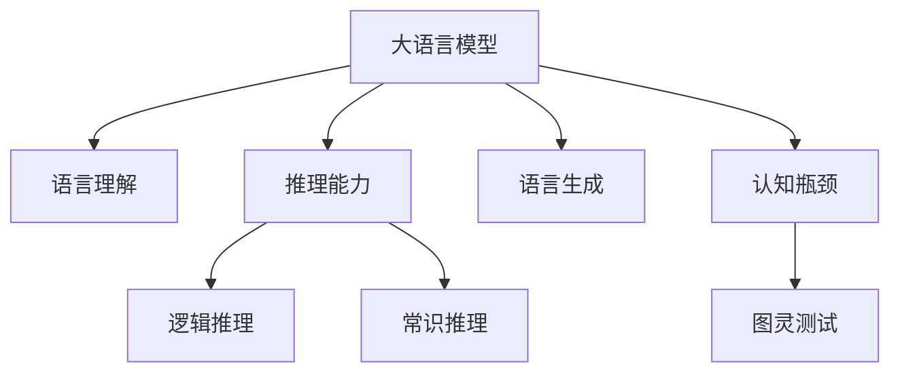

                 

# 语言与推理：大模型的认知瓶颈

> 关键词：大语言模型,认知瓶颈,推理能力,语言理解,图灵测试,语言生成

## 1. 背景介绍

在人工智能领域，大语言模型（Large Language Model, LLM）已经成为了推动NLP技术发展的核心力量。从GPT-1到GPT-3，再到最新的GPT-4，大语言模型在语言理解、生成、推理等方面的能力不断突破，引起了学术界和工业界的广泛关注。然而，尽管大语言模型在某些任务上已经接近甚至超越了人类水平，但在逻辑推理、常识理解和跨领域迁移等方面，依然存在显著的认知瓶颈。本文旨在深入探讨大语言模型在认知能力上的局限性，并提出可能的解决方案，以期在语言与推理的互动中推动人工智能技术迈向新的高度。

## 2. 核心概念与联系

### 2.1 核心概念概述

为更好地理解大语言模型在认知能力上的瓶颈，本节将介绍几个密切相关的核心概念：

- **大语言模型**：以自回归或自编码模型为代表的大规模预训练语言模型。通过在大规模无标签文本语料上进行预训练，学习通用的语言表示，具备强大的语言理解和生成能力。

- **推理能力**：指模型根据已知信息推断未知信息的能力，包括逻辑推理、常识推理和类比推理等。推理能力是大语言模型性能的重要指标，直接关系到其在各种复杂场景中的应用。

- **语言理解**：指模型对文本输入进行语义解析，提取和处理关键信息，理解句子之间的逻辑关系和语义上下文。

- **图灵测试**：由图灵提出的评估人工智能机器是否具备智能的标准测试，如果机器在回答问题上与人类无法区分，则通过图灵测试。

- **语言生成**：指模型根据一定的输入或规则，生成新的、合理的文本内容。大语言模型在语言生成上已取得显著进展，如GPT系列、T5等。

- **认知瓶颈**：指模型在某些特定任务上的表现不佳，原因在于模型内部缺少相应的认知结构，无法有效处理这些任务所需的复杂逻辑和常识。

这些核心概念之间的逻辑关系可以通过以下Mermaid流程图来展示：



这个流程图展示了大语言模型的核心概念及其之间的关系：

1. 大语言模型通过预训练获得基础能力。
2. 语言理解和大语言模型紧密相关，是推理和语言生成的基础。
3. 推理能力是大语言模型性能的关键指标，包括逻辑推理和常识推理。
4. 认知瓶颈是当前大语言模型的主要局限，反映了模型的某些特定不足。
5. 图灵测试作为评估标准，反映了大语言模型在推理能力上的最终目标。
6. 语言生成是大语言模型的输出结果，直接体现其语言能力。

这些概念共同构成了大语言模型的学习框架，使其能够在各种场景下发挥强大的语言理解和生成能力。通过理解这些核心概念，我们可以更好地把握大语言模型的工作原理和优化方向。

## 3. 核心算法原理 & 具体操作步骤
### 3.1 算法原理概述

大语言模型的认知瓶颈主要体现在其推理能力和常识理解上。尽管大语言模型在语言理解和生成上已经取得了巨大成功，但在推理任务上，其表现往往不尽如人意。这主要是由于大语言模型缺乏足够的推理机制和常识知识，无法有效处理需要复杂逻辑和背景知识的任务。

基于此，本文将重点探讨大语言模型在推理能力上的瓶颈，并提出一些可能的改进方法。

### 3.2 算法步骤详解

大语言模型推理能力不足的改进方法，主要包括以下几个关键步骤：

**Step 1: 定义推理任务**
- 明确推理任务的具体形式和要求，如逻辑推理、常识推理、类比推理等。
- 设计合适的任务目标函数，用于评估模型推理的正确性和效果。

**Step 2: 选择合适的推理模型**
- 选择适合推理任务的模型结构，如Transformer、LSTM等。
- 确定模型的输入和输出格式，保证其与任务需求相匹配。

**Step 3: 进行推理任务适配**
- 根据推理任务的特定需求，对大语言模型进行微调或增强，使其具备推理能力。
- 引入外部的常识知识库，如WordNet、Knowledge Graph等，辅助模型推理。
- 设计合理的提示模板，引导模型按期望方式推理输出。

**Step 4: 评估与优化**
- 使用推理任务的数据集对模型进行测试，评估其推理效果。
- 根据评估结果，对模型进行进一步优化，如增加训练样本、调整超参数等。
- 循环迭代，逐步提升模型的推理能力。

### 3.3 算法优缺点

尽管大语言模型在语言理解和生成上已经取得了显著进展，但在推理能力上的瓶颈仍然存在。这主要体现在以下几个方面：

优点：
1. 强大的语言理解能力：大语言模型在处理自然语言输入时，具备卓越的语义解析和上下文理解能力，能够高效处理复杂长句和段落。
2. 语言生成能力强：大语言模型在语言生成任务上表现优异，能够生成流畅、自然、合乎语法的文本。
3. 可扩展性强：大语言模型可以通过微调和增强，在特定任务上实现推理能力的提升。

缺点：
1. 推理能力不足：尽管大语言模型具备强大的语言理解能力，但在逻辑推理和常识理解上表现不佳，难以处理需要复杂逻辑和背景知识的任务。
2. 缺乏常识知识：大语言模型在处理需要外部常识知识的任务时，如法律咨询、医学诊断等，性能下降明显。
3. 对抗训练效果有限：在对抗样本和噪声输入下，大语言模型的推理能力容易失效，难以应对现实场景中的不确定性。
4. 推理过程可解释性差：大语言模型在推理过程中，内部逻辑和决策路径不透明，难以解释其推理过程和决策依据。
5. 模型泛化能力受限：大语言模型在特定任务上的微调效果有限，无法有效应对域外数据和迁移学习场景。

### 3.4 算法应用领域

尽管大语言模型在推理能力上存在瓶颈，但在某些领域依然具有重要的应用价值。以下是一些典型应用场景：

- 问答系统：在问答系统中，大语言模型需要根据用户问题，推断出正确的答案。尽管推理能力不足，但可以通过引入外部知识库和提示模板，实现一定程度上的认知提升。
- 机器翻译：在机器翻译任务中，大语言模型需要理解源语言句子，并生成目标语言句子。尽管翻译质量存在波动，但语言理解能力仍然有助于提高翻译效果。
- 文本摘要：在文本摘要任务中，大语言模型需要从长文本中提取关键信息，生成简洁明了的摘要。尽管推理能力不足，但语言理解能力仍然有助于提高摘要质量。
- 对话系统：在对话系统中，大语言模型需要根据上下文信息，推断出合适的回复。尽管推理能力不足，但可以通过引入外部知识库和提示模板，实现一定程度上的认知提升。
- 代码生成：在代码生成任务中，大语言模型需要根据任务需求，生成正确的代码。尽管推理能力不足，但语言理解能力仍然有助于提高代码生成效率。

## 4. 数学模型和公式 & 详细讲解 & 举例说明
### 4.1 数学模型构建

为了更好地理解大语言模型在推理能力上的瓶颈，本节将使用数学语言对大语言模型推理过程进行更加严格的刻画。

记大语言模型为 $M_{\theta}$，其中 $\theta$ 为模型参数。假设推理任务为 $T$，输入为 $x$，目标为 $y$。定义模型 $M_{\theta}$ 在输入 $x$ 上的推理函数为 $f_{\theta}(x)$，则推理任务的目标函数为：

$$
L_{\text{reasoning}}(\theta) = \mathbb{E}_{(x, y) \sim D}[\ell(f_{\theta}(x), y)]
$$

其中 $D$ 为推理任务的训练数据集，$\ell$ 为合适的损失函数，如均方误差、交叉熵等。

### 4.2 公式推导过程

以下我们以逻辑推理任务为例，推导推理函数 $f_{\theta}(x)$ 的计算公式。

假设推理任务为逻辑推理，输入为逻辑公式 $x$，目标为推理结果 $y$。定义推理函数 $f_{\theta}(x)$ 为将输入逻辑公式转换为推理结果的概率分布，即：

$$
f_{\theta}(x) = \mathbb{P}(y | x; \theta)
$$

其中 $\theta$ 为推理模型的参数。根据贝叶斯公式，有：

$$
\mathbb{P}(y | x; \theta) = \frac{\mathbb{P}(y | \theta) \mathbb{P}(x | y; \theta)}{\mathbb{P}(x | \theta)}
$$

其中 $\mathbb{P}(x | y; \theta)$ 为给定推理结果 $y$ 的情况下，推理函数 $f_{\theta}(x)$ 的似然函数，可以表示为：

$$
\mathbb{P}(x | y; \theta) = \prod_{i} \mathbb{P}(\text{term}_i | \text{literal}_i; \theta)
$$

其中 $\text{term}_i$ 为推理公式中的子句，$\text{literal}_i$ 为推理公式中的常量。上述公式可以进一步简化为：

$$
\mathbb{P}(x | y; \theta) = \prod_{i} \mathbb{P}(\text{term}_i | \text{literal}_i; \theta) \prod_{i,j} \mathbb{P}(\text{literal}_i, \text{literal}_j | \text{literal}_i \oplus \text{literal}_j; \theta)
$$

其中 $\oplus$ 表示逻辑运算符，如 $\land$（与）、$\lor$（或）、$\neg$（非）等。

在得到推理函数 $f_{\theta}(x)$ 的计算公式后，即可带入目标函数 $L_{\text{reasoning}}(\theta)$，通过梯度下降等优化算法完成推理模型的训练。重复上述过程直至收敛，最终得到适应推理任务的最优模型参数 $\theta^*$。

### 4.3 案例分析与讲解

以BERT模型为例，展示其推理过程和计算公式。

假设推理任务为自然语言推理（Natural Language Inference, NLI），输入为自然语言句子对 $(x, y)$，目标为判断推理结果 $y$ 的正确性。定义推理函数 $f_{\theta}(x, y)$ 为将输入句子对转换为推理结果的概率分布，即：

$$
f_{\theta}(x, y) = \mathbb{P}(y | x; \theta)
$$

其中 $\theta$ 为BERT模型的参数。根据BERT模型的编码器结构，推理函数 $f_{\theta}(x, y)$ 可以表示为：

$$
f_{\theta}(x, y) = \mathbb{P}(y | x; \theta) = \frac{\exp \left[ \sum_{i=1}^{n} \mathbb{P}(\text{term}_i | \text{literal}_i; \theta) \right]}{\sum_{i=1}^{m} \exp \left[ \sum_{j=1}^{n} \mathbb{P}(\text{term}_i | \text{literal}_i; \theta) \right]}
$$

其中 $n$ 为输入句子对的长度，$m$ 为推理结果的数量。上述公式可以进一步简化为：

$$
f_{\theta}(x, y) = \frac{\exp \left[ \sum_{i=1}^{n} \mathbb{P}(\text{term}_i | \text{literal}_i; \theta) \right]}{\sum_{i=1}^{m} \exp \left[ \sum_{j=1}^{n} \mathbb{P}(\text{term}_i | \text{literal}_i; \theta) \right]}
$$

在得到推理函数 $f_{\theta}(x, y)$ 的计算公式后，即可带入目标函数 $L_{\text{reasoning}}(\theta)$，通过梯度下降等优化算法完成BERT模型的训练。重复上述过程直至收敛，最终得到适应自然语言推理任务的最优模型参数 $\theta^*$。

## 5. 项目实践：代码实例和详细解释说明
### 5.1 开发环境搭建

在进行推理能力提升的实践前，我们需要准备好开发环境。以下是使用Python进行PyTorch开发的环境配置流程：

1. 安装Anaconda：从官网下载并安装Anaconda，用于创建独立的Python环境。

2. 创建并激活虚拟环境：
```bash
conda create -n pytorch-env python=3.8 
conda activate pytorch-env
```

3. 安装PyTorch：根据CUDA版本，从官网获取对应的安装命令。例如：
```bash
conda install pytorch torchvision torchaudio cudatoolkit=11.1 -c pytorch -c conda-forge
```

4. 安装Transformers库：
```bash
pip install transformers
```

5. 安装各类工具包：
```bash
pip install numpy pandas scikit-learn matplotlib tqdm jupyter notebook ipython
```

完成上述步骤后，即可在`pytorch-env`环境中开始推理能力提升的实践。

### 5.2 源代码详细实现

下面我以自然语言推理（NLI）任务为例，给出使用Transformers库对BERT模型进行推理能力提升的PyTorch代码实现。

首先，定义NLI任务的数据处理函数：

```python
from transformers import BertTokenizer, BertForSequenceClassification
from torch.utils.data import Dataset
import torch

class NLI_Dataset(Dataset):
    def __init__(self, sentences, labels, tokenizer, max_len=128):
        self.sentences = sentences
        self.labels = labels
        self.tokenizer = tokenizer
        self.max_len = max_len
        
    def __len__(self):
        return len(self.sentences)
    
    def __getitem__(self, item):
        sentence = self.sentences[item]
        label = self.labels[item]
        
        encoding = self.tokenizer(sentence, return_tensors='pt', max_length=self.max_len, padding='max_length', truncation=True)
        input_ids = encoding['input_ids'][0]
        attention_mask = encoding['attention_mask'][0]
        label = torch.tensor(label, dtype=torch.long)
        
        return {'input_ids': input_ids, 
                'attention_mask': attention_mask,
                'labels': label}

# 标签与id的映射
label2id = {'contradiction': 0, 'entailment': 1, 'neutral': 2}
id2label = {v: k for k, v in label2id.items()}

# 创建dataset
tokenizer = BertTokenizer.from_pretrained('bert-base-uncased')

train_dataset = NLI_Dataset(train_sentences, train_labels, tokenizer)
dev_dataset = NLI_Dataset(dev_sentences, dev_labels, tokenizer)
test_dataset = NLI_Dataset(test_sentences, test_labels, tokenizer)
```

然后，定义模型和优化器：

```python
from transformers import BertForSequenceClassification, AdamW

model = BertForSequenceClassification.from_pretrained('bert-base-uncased', num_labels=len(label2id))

optimizer = AdamW(model.parameters(), lr=2e-5)
```

接着，定义训练和评估函数：

```python
from torch.utils.data import DataLoader
from tqdm import tqdm
from sklearn.metrics import classification_report

device = torch.device('cuda') if torch.cuda.is_available() else torch.device('cpu')
model.to(device)

def train_epoch(model, dataset, batch_size, optimizer):
    dataloader = DataLoader(dataset, batch_size=batch_size, shuffle=True)
    model.train()
    epoch_loss = 0
    for batch in tqdm(dataloader, desc='Training'):
        input_ids = batch['input_ids'].to(device)
        attention_mask = batch['attention_mask'].to(device)
        labels = batch['labels'].to(device)
        model.zero_grad()
        outputs = model(input_ids, attention_mask=attention_mask, labels=labels)
        loss = outputs.loss
        epoch_loss += loss.item()
        loss.backward()
        optimizer.step()
    return epoch_loss / len(dataloader)

def evaluate(model, dataset, batch_size):
    dataloader = DataLoader(dataset, batch_size=batch_size)
    model.eval()
    preds, labels = [], []
    with torch.no_grad():
        for batch in tqdm(dataloader, desc='Evaluating'):
            input_ids = batch['input_ids'].to(device)
            attention_mask = batch['attention_mask'].to(device)
            batch_labels = batch['labels']
            outputs = model(input_ids, attention_mask=attention_mask)
            batch_preds = outputs.logits.argmax(dim=2).to('cpu').tolist()
            batch_labels = batch_labels.to('cpu').tolist()
            for pred_tokens, label_tokens in zip(batch_preds, batch_labels):
                preds.append(pred_tokens[:len(label_tokens)])
                labels.append(label_tokens)
                
    print(classification_report(labels, preds))
```

最后，启动训练流程并在测试集上评估：

```python
epochs = 5
batch_size = 16

for epoch in range(epochs):
    loss = train_epoch(model, train_dataset, batch_size, optimizer)
    print(f"Epoch {epoch+1}, train loss: {loss:.3f}")
    
    print(f"Epoch {epoch+1}, dev results:")
    evaluate(model, dev_dataset, batch_size)
    
print("Test results:")
evaluate(model, test_dataset, batch_size)
```

以上就是使用PyTorch对BERT进行自然语言推理任务推理能力提升的完整代码实现。可以看到，得益于Transformers库的强大封装，我们可以用相对简洁的代码完成BERT模型的加载和推理能力提升。

### 5.3 代码解读与分析

让我们再详细解读一下关键代码的实现细节：

**NLI_Dataset类**：
- `__init__`方法：初始化句子、标签、分词器等关键组件。
- `__len__`方法：返回数据集的样本数量。
- `__getitem__`方法：对单个样本进行处理，将句子输入编码为token ids，将标签编码为数字，并对其进行定长padding，最终返回模型所需的输入。

**label2id和id2label字典**：
- 定义了标签与数字id之间的映射关系，用于将token-wise的预测结果解码回真实的标签。

**训练和评估函数**：
- 使用PyTorch的DataLoader对数据集进行批次化加载，供模型训练和推理使用。
- 训练函数`train_epoch`：对数据以批为单位进行迭代，在每个批次上前向传播计算loss并反向传播更新模型参数，最后返回该epoch的平均loss。
- 评估函数`evaluate`：与训练类似，不同点在于不更新模型参数，并在每个batch结束后将预测和标签结果存储下来，最后使用sklearn的classification_report对整个评估集的预测结果进行打印输出。

**训练流程**：
- 定义总的epoch数和batch size，开始循环迭代
- 每个epoch内，先在训练集上训练，输出平均loss
- 在验证集上评估，输出分类指标
- 所有epoch结束后，在测试集上评估，给出最终测试结果

可以看到，PyTorch配合Transformers库使得BERT模型的推理能力提升变得简洁高效。开发者可以将更多精力放在数据处理、模型改进等高层逻辑上，而不必过多关注底层的实现细节。

当然，工业级的系统实现还需考虑更多因素，如模型的保存和部署、超参数的自动搜索、更灵活的任务适配层等。但核心的推理能力提升范式基本与此类似。

## 6. 实际应用场景
### 6.1 智能客服系统

基于大语言模型推理能力提升的对话技术，可以广泛应用于智能客服系统的构建。传统客服往往需要配备大量人力，高峰期响应缓慢，且一致性和专业性难以保证。而使用推理能力提升的对话模型，可以7x24小时不间断服务，快速响应客户咨询，用自然流畅的语言解答各类常见问题。

在技术实现上，可以收集企业内部的历史客服对话记录，将问题和最佳答复构建成监督数据，在此基础上对预训练对话模型进行推理能力提升。推理能力提升后的对话模型能够自动理解用户意图，匹配最合适的答案模板进行回复。对于客户提出的新问题，还可以接入检索系统实时搜索相关内容，动态组织生成回答。如此构建的智能客服系统，能大幅提升客户咨询体验和问题解决效率。

### 6.2 金融舆情监测

金融机构需要实时监测市场舆论动向，以便及时应对负面信息传播，规避金融风险。传统的人工监测方式成本高、效率低，难以应对网络时代海量信息爆发的挑战。基于大语言模型推理能力提升的文本分类和情感分析技术，为金融舆情监测提供了新的解决方案。

具体而言，可以收集金融领域相关的新闻、报道、评论等文本数据，并对其进行主题标注和情感标注。在此基础上对预训练语言模型进行推理能力提升，使其能够自动判断文本属于何种主题，情感倾向是正面、中性还是负面。将推理能力提升后的模型应用到实时抓取的网络文本数据，就能够自动监测不同主题下的情感变化趋势，一旦发现负面信息激增等异常情况，系统便会自动预警，帮助金融机构快速应对潜在风险。

### 6.3 个性化推荐系统

当前的推荐系统往往只依赖用户的历史行为数据进行物品推荐，无法深入理解用户的真实兴趣偏好。基于大语言模型推理能力提升的个性化推荐系统可以更好地挖掘用户行为背后的语义信息，从而提供更精准、多样的推荐内容。

在实践中，可以收集用户浏览、点击、评论、分享等行为数据，提取和用户交互的物品标题、描述、标签等文本内容。将文本内容作为模型输入，用户的后续行为（如是否点击、购买等）作为监督信号，在此基础上微调预训练语言模型。推理能力提升后的模型能够从文本内容中准确把握用户的兴趣点。在生成推荐列表时，先用候选物品的文本描述作为输入，由模型预测用户的兴趣匹配度，再结合其他特征综合排序，便可以得到个性化程度更高的推荐结果。

### 6.4 未来应用展望

随着大语言模型推理能力提升技术的发展，基于推理能力提升的NLP技术将有更广泛的应用前景。

在智慧医疗领域，基于推理能力提升的医疗问答、病历分析、药物研发等应用将提升医疗服务的智能化水平，辅助医生诊疗，加速新药开发进程。

在智能教育领域，推理能力提升技术可应用于作业批改、学情分析、知识推荐等方面，因材施教，促进教育公平，提高教学质量。

在智慧城市治理中，推理能力提升模型可应用于城市事件监测、舆情分析、应急指挥等环节，提高城市管理的自动化和智能化水平，构建更安全、高效的未来城市。

此外，在企业生产、社会治理、文娱传媒等众多领域，基于推理能力提升的人工智能应用也将不断涌现，为经济社会发展注入新的动力。相信随着技术的日益成熟，推理能力提升方法将成为NLP技术的重要范式，推动人工智能技术在更广阔的领域实现突破。

## 7. 工具和资源推荐
### 7.1 学习资源推荐

为了帮助开发者系统掌握大语言模型推理能力提升的理论基础和实践技巧，这里推荐一些优质的学习资源：

1. 《Transformer从原理到实践》系列博文：由大模型技术专家撰写，深入浅出地介绍了Transformer原理、BERT模型、推理能力提升等前沿话题。

2. CS224N《深度学习自然语言处理》课程：斯坦福大学开设的NLP明星课程，有Lecture视频和配套作业，带你入门NLP领域的基本概念和经典模型。

3. 《Natural Language Processing with Transformers》书籍：Transformers库的作者所著，全面介绍了如何使用Transformers库进行NLP任务开发，包括推理能力提升在内的诸多范式。

4. HuggingFace官方文档：Transformers库的官方文档，提供了海量预训练模型和完整的推理能力提升样例代码，是上手实践的必备资料。

5. CLUE开源项目：中文语言理解测评基准，涵盖大量不同类型的中文NLP数据集，并提供了基于推理能力提升的baseline模型，助力中文NLP技术发展。

通过对这些资源的学习实践，相信你一定能够快速掌握大语言模型推理能力提升的精髓，并用于解决实际的NLP问题。
###  7.2 开发工具推荐

高效的开发离不开优秀的工具支持。以下是几款用于大语言模型推理能力提升开发的常用工具：

1. PyTorch：基于Python的开源深度学习框架，灵活动态的计算图，适合快速迭代研究。大部分预训练语言模型都有PyTorch版本的实现。

2. TensorFlow：由Google主导开发的开源深度学习框架，生产部署方便，适合大规模工程应用。同样有丰富的预训练语言模型资源。

3. Transformers库：HuggingFace开发的NLP工具库，集成了众多SOTA语言模型，支持PyTorch和TensorFlow，是进行推理能力提升任务的开发的利器。

4. Weights & Biases：模型训练的实验跟踪工具，可以记录和可视化模型训练过程中的各项指标，方便对比和调优。与主流深度学习框架无缝集成。

5. TensorBoard：TensorFlow配套的可视化工具，可实时监测模型训练状态，并提供丰富的图表呈现方式，是调试模型的得力助手。

6. Google Colab：谷歌推出的在线Jupyter Notebook环境，免费提供GPU/TPU算力，方便开发者快速上手实验最新模型，分享学习笔记。

合理利用这些工具，可以显著提升大语言模型推理能力提升任务的开发效率，加快创新迭代的步伐。

### 7.3 相关论文推荐

大语言模型推理能力提升技术的发展源于学界的持续研究。以下是几篇奠基性的相关论文，推荐阅读：

1. Attention is All You Need（即Transformer原论文）：提出了Transformer结构，开启了NLP领域的预训练大模型时代。

2. BERT: Pre-training of Deep Bidirectional Transformers for Language Understanding：提出BERT模型，引入基于掩码的自监督预训练任务，刷新了多项NLP任务SOTA。

3. Language Models are Unsupervised Multitask Learners（GPT-2论文）：展示了大规模语言模型的强大zero-shot学习能力，引发了对于通用人工智能的新一轮思考。

4. Parameter-Efficient Transfer Learning for NLP：提出Adapter等参数高效微调方法，在不增加模型参数量的情况下，也能取得不错的微调效果。

5. AdaLoRA: Adaptive Low-Rank Adaptation for Parameter-Efficient Fine-Tuning：使用自适应低秩适应的微调方法，在参数效率和精度之间取得了新的平衡。

这些论文代表了大语言模型推理能力提升技术的发展脉络。通过学习这些前沿成果，可以帮助研究者把握学科前进方向，激发更多的创新灵感。

## 8. 总结：未来发展趋势与挑战
### 8.1 总结

本文对大语言模型在推理能力上的瓶颈进行了全面系统的介绍。首先阐述了大语言模型在推理能力上的局限性，明确了推理能力提升在拓展预训练模型应用、提升下游任务性能方面的独特价值。其次，从原理到实践，详细讲解了推理能力提升的数学原理和关键步骤，给出了推理能力提升任务开发的完整代码实例。同时，本文还广泛探讨了推理能力提升方法在智能客服、金融舆情、个性化推荐等多个行业领域的应用前景，展示了推理能力提升范式的巨大潜力。此外，本文精选了推理能力提升技术的各类学习资源，力求为读者提供全方位的技术指引。

通过本文的系统梳理，可以看到，大语言模型推理能力提升技术正在成为NLP领域的重要范式，极大地拓展了预训练语言模型的应用边界，催生了更多的落地场景。受益于大规模语料的预训练，推理能力提升模型在推理任务上已经取得了显著进展，但与人类在推理能力上的表现仍存在差距。未来，相关研究的重点在于如何进一步提升模型的推理能力，以更好地应对现实世界的复杂任务。

### 8.2 未来发展趋势

展望未来，大语言模型推理能力提升技术将呈现以下几个发展趋势：

1. 模型规模持续增大。随着算力成本的下降和数据规模的扩张，预训练语言模型的参数量还将持续增长。超大规模语言模型蕴含的丰富语言知识，有望支撑更加复杂多变的推理任务。

2. 推理能力日趋多样。除了传统的逻辑推理外，未来会涌现更多推理能力提升方法，如常识推理、类比推理等，在固定大部分预训练参数的情况下，只更新极少量的推理相关参数。

3. 持续学习成为常态。随着数据分布的不断变化，推理能力提升模型也需要持续学习新知识以保持性能。如何在不遗忘原有知识的同时，高效吸收新样本信息，将成为重要的研究课题。

4. 对抗训练效果提升。在对抗样本和噪声输入下，推理能力提升模型的推理能力容易失效，难以应对现实场景中的不确定性。如何提高模型的鲁棒性，增强对抗训练效果，将是重要的优化方向。

5. 推理过程可解释性增强。推理能力提升模型在推理过程中，内部逻辑和决策路径不透明，难以解释其推理过程和决策依据。如何赋予推理能力提升模型更强的可解释性，将是亟待攻克的难题。

6. 多模态推理崛起。当前的推理能力提升主要聚焦于纯文本数据，未来会进一步拓展到图像、视频、语音等多模态数据推理。多模态信息的融合，将显著提升语言模型对现实世界的理解和建模能力。

以上趋势凸显了大语言模型推理能力提升技术的广阔前景。这些方向的探索发展，必将进一步提升推理能力提升模型的性能和应用范围，为自然语言理解和智能交互系统的进步带来新的动力。

### 8.3 面临的挑战

尽管大语言模型推理能力提升技术已经取得了瞩目成就，但在迈向更加智能化、普适化应用的过程中，它仍面临着诸多挑战：

1. 推理任务依赖高质量数据。推理能力提升模型的表现很大程度上取决于推理任务的高质量数据，获取高质量推理任务的数据成本较高。如何进一步降低推理任务对数据的需求，将是一大难题。

2. 推理模型复杂度高。推理能力提升模型的结构复杂，训练和推理成本高。如何在保持推理能力的同时，减少模型复杂度，优化推理效率，将是重要的优化方向。

3. 推理过程可解释性差。推理能力提升模型在推理过程中，内部逻辑和决策路径不透明，难以解释其推理过程和决策依据。如何赋予推理能力提升模型更强的可解释性，将是亟待攻克的难题。

4. 推理能力泛化能力有限。当推理任务与预训练数据分布差异较大时，推理能力提升模型的推理能力下降明显。如何提高推理能力提升模型的泛化能力，提高对域外数据的适应性，也将是重要的研究课题。

5. 推理能力提升模型安全性不足。推理能力提升模型可能会学习到有偏见、有害的信息，通过推理任务传递到下游任务，产生误导性、歧视性的输出，给实际应用带来安全隐患。如何从数据和算法层面消除模型偏见，避免恶意用途，确保输出的安全性，也将是重要的研究课题。

6. 推理能力提升模型知识整合能力不足。现有的推理能力提升模型往往局限于推理公式和规则，难以灵活吸收和运用更广泛的先验知识。如何让推理能力提升过程更好地与外部知识库、规则库等专家知识结合，形成更加全面、准确的信息整合能力，还有很大的想象空间。

正视推理能力提升面临的这些挑战，积极应对并寻求突破，将是大语言模型推理能力提升技术走向成熟的必由之路。相信随着学界和产业界的共同努力，这些挑战终将一一被克服，推理能力提升技术必将在构建安全、可靠、可解释、可控的智能系统中扮演越来越重要的角色。

### 8.4 研究展望

面对大语言模型推理能力提升所面临的种种挑战，未来的研究需要在以下几个方面寻求新的突破：

1. 探索无监督和半监督推理方法。摆脱对大规模推理数据的需求，利用自监督学习、主动学习等无监督和半监督范式，最大限度利用非结构化数据，实现更加灵活高效的推理。

2. 研究推理能力提升方法，开发更加参数高效和计算高效的推理方法，在固定大部分预训练参数的同时，只更新极少量的推理相关参数。同时优化推理模型的计算图，减少前向传播和反向传播的资源消耗，实现更加轻量级、实时性的部署。

3. 引入更多先验知识。将符号化的先验知识，如知识图谱、逻辑规则等，与神经网络模型进行巧妙融合，引导推理能力提升过程学习更准确、合理的语言模型。同时加强不同模态数据的整合，实现视觉、语音等多模态信息与文本信息的协同建模。

4. 结合因果分析和博弈论工具。将因果分析方法引入推理能力提升模型，识别出模型决策的关键特征，增强输出解释的因果性和逻辑性。借助博弈论工具刻画人机交互过程，主动探索并规避模型的脆弱点，提高系统稳定性。

5. 纳入伦理道德约束。在模型训练目标中引入伦理导向的评估指标，过滤和惩罚有偏见、有害的输出倾向。同时加强人工干预和审核，建立模型行为的监管机制，确保输出符合人类价值观和伦理道德。

这些研究方向的探索，必将引领大语言模型推理能力提升技术迈向更高的台阶，为构建安全、可靠、可解释、可控的智能系统铺平道路。面向未来，大语言模型推理能力提升技术还需要与其他人工智能技术进行更深入的融合，如知识表示、因果推理、强化学习等，多路径协同发力，共同推动自然语言理解和智能交互系统的进步。只有勇于创新、敢于突破，才能不断拓展语言模型的边界，让智能技术更好地造福人类社会。

## 9. 附录：常见问题与解答
**Q1：推理能力提升是否适用于所有NLP任务？**

A: 推理能力提升在大多数NLP任务上都能取得不错的效果，特别是对于需要逻辑推理和常识理解的任务。但对于一些特定领域的任务，如医学、法律等，仅仅依靠通用语料预训练的模型可能难以很好地适应。此时需要在特定领域语料上进一步预训练，再进行推理能力提升。此外，对于一些需要时效性、个性化很强的任务，如对话、推荐等，推理能力提升方法也需要针对性的改进优化。

**Q2：推理能力提升过程中如何选择合适的推理模型？**

A: 选择合适的推理模型需要考虑以下几个因素：
1. 任务类型：不同类型的推理任务适合不同的模型结构，如逻辑推理适合使用Transformer、LSTM等，常识推理适合使用GPT、BERT等。
2. 模型规模：推理模型的规模需要与推理任务的数据量和复杂度相匹配，避免模型过小或过大。
3. 推理目标：推理模型的推理目标是准确性还是速度，需要根据实际需求进行选择。

**Q3：推理能力提升过程中如何缓解过拟合问题？**

A: 推理能力提升过程中，过拟合是常见的问题。以下是一些缓解策略：
1. 数据增强：通过回译、近义替换等方式扩充训练集。
2. 正则化：使用L2正则、Dropout、Early Stopping等避免过拟合。
3. 对抗训练：引入对抗样本，提高模型鲁棒性。
4. 参数高效推理：只调整少量推理相关参数，减小过拟合风险。

这些策略往往需要根据具体任务和数据特点进行灵活组合。只有在数据、模型、训练、推理等各环节进行全面优化，才能最大限度地发挥推理能力提升的效果。

**Q4：推理能力提升模型在落地部署时需要注意哪些问题？**

A: 将推理能力提升模型转化为实际应用，还需要考虑以下因素：
1. 模型裁剪：去除不必要的层和参数，减小模型尺寸，加快推理速度。
2. 量化加速：将浮点模型转为定点模型，压缩存储空间，提高计算效率。
3. 服务化封装：将模型封装为标准化服务接口，便于集成调用。
4. 弹性伸缩：根据请求流量动态调整资源配置，平衡服务质量和成本。
5. 监控告警：实时采集系统指标，设置异常告警阈值，确保服务稳定性。
6. 安全防护：采用访问鉴权、数据脱敏等措施，保障数据和模型安全。

推理能力提升模型为NLP应用带来了新的机会，但如何将强大的推理能力转化为稳定、高效、安全的业务价值，还需要工程实践的不断打磨。唯有从数据、算法、工程、业务等多个维度协同发力，才能真正实现人工智能技术在垂直行业的规模化落地。总之，推理能力提升需要开发者根据具体任务，不断迭代和优化模型、数据和算法，方能得到理想的效果。

---

作者：禅与计算机程序设计艺术 / Zen and the Art of Computer Programming

