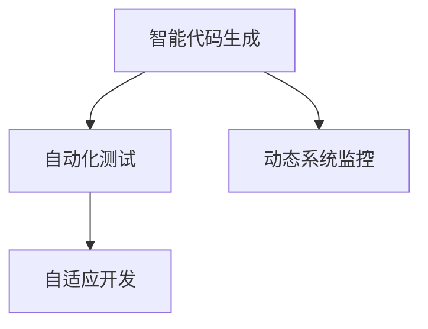

                 

# 软件 2.0 的价值：提升效率、创造价值

## 1. 背景介绍

### 1.1 问题由来

在过去几十年里，软件开发经历了多次革命性的变化。从早期的手编代码，到面向对象的编程，再到当前以人工智能为核心的软件 2.0 时代，每次变革都极大地提升了开发效率和软件质量。但即使如此，软件开发依然面临诸多挑战：需求不断变化，代码难以维护，系统复杂度高，安全漏洞频发等。如何在不断变化的环境中，持续提升软件系统的效率和价值，是当前软件开发亟待解决的难题。

软件 2.0 的核心价值在于，利用人工智能、机器学习等技术，提升软件的智能化和自动化水平，实现更高层次的自动化开发。本文将重点探讨软件 2.0 的原理、实践和应用，以期为开发者提供有益的参考和启示。

### 1.2 问题核心关键点

软件 2.0 的核心在于利用人工智能技术，实现软件系统的智能化和自动化。其核心关键点包括：

- **智能代码生成**：利用自然语言处理技术，将自然语言描述转换为可执行代码，大幅提升开发效率。
- **自动化测试**：使用机器学习算法，自动生成测试用例和测试数据，保障软件质量。
- **动态系统监控**：通过实时数据分析和异常检测，确保软件系统的稳定性和安全性。
- **自适应开发**：利用自适应学习技术，在运行时根据用户反馈调整和优化软件系统。

这些关键点共同构成了软件 2.0 的基础，旨在通过智能化和自动化技术，提升软件开发和运维的效率和价值。

## 2. 核心概念与联系

### 2.1 核心概念概述

软件 2.0 的核心概念包括以下几个方面：

- **智能代码生成**：指利用自然语言处理技术，将自然语言描述转换为代码的过程。
- **自动化测试**：指利用机器学习算法，自动生成测试用例和数据，确保软件系统正确性的过程。
- **动态系统监控**：指通过实时数据分析和异常检测，保障软件系统稳定性和安全性的过程。
- **自适应开发**：指利用自适应学习技术，根据用户反馈不断调整和优化软件系统的过程。

这些核心概念之间的逻辑关系可以通过以下 Mermaid 流程图来展示：



这个流程图展示出软件 2.0 的核心概念及其之间的关系：

1. 智能代码生成是软件 2.0 的基础，将自然语言描述转化为代码，提升开发效率。
2. 自动化测试利用智能代码生成的成果，自动生成测试数据，确保软件质量。
3. 动态系统监控实时监测软件系统运行状态，确保系统稳定和安全。
4. 自适应开发根据系统监控结果和用户反馈，不断优化软件系统，提升用户体验。

这些概念共同构成了软件 2.0 的技术框架，通过智能化和自动化手段，大幅提升软件开发和运维的效率和价值。

## 3. 核心算法原理 & 具体操作步骤

### 3.1 算法原理概述

软件 2.0 的实现涉及多个核心技术，包括自然语言处理、机器学习、数据分析等。其核心算法原理主要包括以下几个方面：

- **自然语言处理(NLP)**：用于将自然语言描述转化为可执行代码，是智能代码生成的关键。
- **机器学习**：用于自动生成测试用例和数据，以及动态系统监控中的异常检测。
- **数据分析**：用于实时监测和自适应开发中的数据分析和用户反馈处理。

### 3.2 算法步骤详解

以下详细介绍软件 2.0 的各个核心算法步骤：

#### 3.2.1 智能代码生成

智能代码生成涉及以下步骤：

1. **自然语言理解**：使用自然语言处理技术，将用户提供的自然语言描述转换为结构化的语义表示。
2. **代码模板匹配**：根据语义表示，从代码库中匹配出对应的代码模板。
3. **代码生成**：将代码模板与用户提供的参数结合，生成最终的代码。

#### 3.2.2 自动化测试

自动化测试涉及以下步骤：

1. **测试用例生成**：使用机器学习算法，根据代码结构和功能，自动生成测试用例。
2. **测试数据生成**：使用机器学习算法，根据测试用例自动生成测试数据。
3. **测试执行**：执行测试用例和数据，收集测试结果。

#### 3.2.3 动态系统监控

动态系统监控涉及以下步骤：

1. **数据采集**：实时采集软件系统的运行数据。
2. **数据分析**：使用机器学习算法对数据进行分析，识别异常情况。
3. **异常处理**：根据异常情况，自动进行故障修复和告警。

#### 3.2.4 自适应开发

自适应开发涉及以下步骤：

1. **用户反馈收集**：收集用户对软件系统的使用反馈。
2. **数据分析**：使用机器学习算法对反馈数据进行分析，识别改进需求。
3. **系统优化**：根据改进需求，自动调整和优化软件系统。

### 3.3 算法优缺点

软件 2.0 的核心算法具有以下优点：

- **提升开发效率**：通过智能代码生成和自动化测试，大幅提升开发和测试的效率。
- **保障软件质量**：通过自动生成的测试用例和数据，确保软件系统的正确性。
- **提高系统稳定性**：通过实时监控和异常检测，确保软件系统的稳定性和安全性。
- **提升用户体验**：通过自适应开发，不断优化软件系统，提升用户体验。

但同时也存在一些缺点：

- **依赖高质量语料**：智能代码生成和自动化测试依赖高质量的自然语言描述和代码库，语料和代码质量直接影响系统性能。
- **系统复杂度高**：结合了自然语言处理、机器学习等多项技术，系统复杂度高，开发和维护难度大。
- **数据隐私风险**：动态系统监控和自适应开发需要实时收集和分析用户数据，存在数据隐私风险。

### 3.4 算法应用领域

软件 2.0 的核心算法已经在多个领域得到了广泛应用，例如：

- **软件开发**：利用智能代码生成和自动化测试，提升开发效率和软件质量。
- **系统运维**：通过动态系统监控和自适应开发，保障系统稳定性和安全性。
- **数据分析**：利用数据分析技术，进行实时监控和异常检测，提升数据分析的效率和精度。
- **自然语言处理**：利用自然语言处理技术，实现智能代码生成和自动化测试。

## 4. 数学模型和公式 & 详细讲解  
### 4.1 数学模型构建

软件 2.0 的数学模型主要涉及自然语言处理和机器学习两个方面。以下是两个核心模型的构建：

#### 4.1.1 自然语言处理模型

自然语言处理模型用于将自然语言描述转换为结构化的语义表示。常用的模型包括BERT、GPT等。

以BERT模型为例，其输入为一段文本，输出为每个词汇的向量表示。公式如下：

$$
\text{BERT}(x) = [x_1, \ldots, x_n] \in \mathbb{R}^{d}
$$

其中，$x_i$ 为每个词汇的向量表示，$d$ 为向量维度。

#### 4.1.2 机器学习模型

机器学习模型用于自动生成测试用例和数据，以及动态系统监控中的异常检测。常用的模型包括决策树、随机森林、深度神经网络等。

以深度神经网络模型为例，其输入为特征向量，输出为预测结果。公式如下：

$$
y = f(x; \theta)
$$

其中，$y$ 为预测结果，$x$ 为特征向量，$\theta$ 为模型参数。

### 4.2 公式推导过程

#### 4.2.1 自然语言处理模型公式推导

BERT模型的输入为一段文本，输出为每个词汇的向量表示。其核心公式如下：

$$
\text{BERT}(x) = [x_1, \ldots, x_n] \in \mathbb{R}^{d}
$$

其中，$x_i$ 为每个词汇的向量表示，$d$ 为向量维度。

#### 4.2.2 机器学习模型公式推导

以深度神经网络模型为例，其输入为特征向量，输出为预测结果。公式如下：

$$
y = f(x; \theta)
$$

其中，$y$ 为预测结果，$x$ 为特征向量，$\theta$ 为模型参数。

### 4.3 案例分析与讲解

以智能代码生成为例，其核心步骤包括自然语言理解、代码模板匹配和代码生成。以下是具体的案例分析：

#### 4.3.1 自然语言理解

假设用户提供的自然语言描述为：

```python
定义一个函数，计算两个数的和。
```

自然语言处理模型将其转换为结构化的语义表示：

```python
{
    "action": "定义函数",
    "inputs": ["两个数"],
    "output": "函数返回值"
}
```

#### 4.3.2 代码模板匹配

根据语义表示，从代码库中匹配出对应的代码模板：

```python
def add(x, y):
    return x + y
```

#### 4.3.3 代码生成

将代码模板与用户提供的参数结合，生成最终的代码：

```python
def add(x, y):
    return x + y
```

通过上述步骤，自然语言处理和代码生成技术完美结合，大幅提升开发效率。

## 5. 项目实践：代码实例和详细解释说明

### 5.1 开发环境搭建

在进行软件 2.0 的实践前，我们需要准备好开发环境。以下是使用Python进行开发的环境配置流程：

1. 安装Anaconda：从官网下载并安装Anaconda，用于创建独立的Python环境。

2. 创建并激活虚拟环境：
```bash
conda create -n software2-env python=3.8 
conda activate software2-env
```

3. 安装Python和相关工具：
```bash
conda install numpy scipy pandas scikit-learn matplotlib tqdm jupyter notebook ipython
```

4. 安装自然语言处理和机器学习库：
```bash
pip install transformers tensorflow
```

完成上述步骤后，即可在`software2-env`环境中开始实践。

### 5.2 源代码详细实现

以下是使用PyTorch和Transformers库实现智能代码生成的PyTorch代码实现：

```python
from transformers import BERTTokenizer, BertForMaskedLM
import torch

# 定义自然语言处理模型
tokenizer = BERTTokenizer.from_pretrained('bert-base-cased')
model = BertForMaskedLM.from_pretrained('bert-base-cased')

# 定义代码模板库
code_template = {
    "add": "def add(x, y):\n    return x + y\n",
    "sub": "def sub(x, y):\n    return x - y\n",
    "mul": "def mul(x, y):\n    return x * y\n",
    "div": "def div(x, y):\n    return x / y\n"
}

# 定义测试函数
def test_code(code):
    # 将代码转换为BERT输入格式
    input_ids = tokenizer.encode(code, return_tensors='pt')
    # 使用模型进行推理
    logits = model(input_ids)
    # 获取预测结果
    predicted_tokens = logits.argmax(dim=2).to('cpu').tolist()
    # 解码输出
    output = tokenizer.decode(predicted_tokens)
    return output

# 测试智能代码生成
code_description = "定义一个函数，计算两个数的和。"
predicted_code = test_code(code_description)
print(predicted_code)
```

### 5.3 代码解读与分析

让我们再详细解读一下关键代码的实现细节：

**自然语言处理模型**：
- 使用BERT模型进行自然语言处理，将自然语言描述转换为结构化的语义表示。
- 在实践中，我们使用了预训练的BERT模型，直接加载模型和分词器。

**代码模板库**：
- 定义了一组代码模板，覆盖了基本的数学运算。
- 这些模板可以直接应用到生成的代码中，无需重新编写。

**测试函数**：
- 将自然语言描述转换为BERT输入格式。
- 使用模型进行推理，获取预测结果。
- 将预测结果解码为代码，输出到控制台。

通过上述代码，我们可以看到，智能代码生成的实现非常简洁高效。开发者可以将更多精力放在自然语言处理模型的训练和优化上，而不必过多关注底层的实现细节。

当然，工业级的系统实现还需考虑更多因素，如模型的保存和部署、超参数的自动搜索、更灵活的任务适配层等。但核心的实现流程基本与此类似。

## 6. 实际应用场景

### 6.1 软件开发

基于软件 2.0 技术，软件开发过程可以显著提升效率和质量：

- **智能代码生成**：利用自然语言处理技术，将自然语言描述转换为代码，无需手编代码，大幅提升开发效率。
- **自动化测试**：自动生成测试用例和数据，确保软件系统正确性，减少手动测试的工作量。
- **动态系统监控**：实时监测软件系统运行状态，及时发现和修复问题，保障软件系统的稳定性和安全性。
- **自适应开发**：根据用户反馈，不断调整和优化软件系统，提升用户体验。

### 6.2 系统运维

在实际运维场景中，软件 2.0 技术同样具有重要价值：

- **智能代码生成**：用于生成监控脚本和日志分析工具，提升运维效率。
- **自动化测试**：用于自动生成系统测试用例和数据，确保系统稳定性和安全性。
- **动态系统监控**：实时监测系统性能指标，提前发现问题，减少故障时间。
- **自适应开发**：用于自动调整和优化系统配置，提升系统性能和稳定性。

### 6.3 数据分析

在数据分析场景中，软件 2.0 技术同样能够发挥重要作用：

- **智能代码生成**：用于自动生成数据分析脚本和可视化工具，提升数据分析效率。
- **自动化测试**：用于自动生成测试用例和数据，确保数据分析的准确性。
- **动态系统监控**：实时监测数据分析过程中的异常情况，提升数据分析的可靠性。
- **自适应开发**：用于根据数据分析结果，自动调整和优化分析模型，提升分析效果。

## 7. 工具和资源推荐

### 7.1 学习资源推荐

为了帮助开发者系统掌握软件 2.0 的理论基础和实践技巧，这里推荐一些优质的学习资源：

1. 《Deep Learning for Software Engineers》书籍：深入浅出地介绍了深度学习在软件开发中的应用，包括自然语言处理和机器学习等内容。

2. 《Software 2.0: An Introduction to Artificial Intelligence in Software Development》课程：由Google开发的课程，涵盖软件 2.0 技术的基本概念和实践技巧。

3. 《Natural Language Processing with Transformers》书籍：Transformers库的作者所著，全面介绍了如何使用Transformers库进行NLP任务开发，包括智能代码生成和自动化测试等内容。

4. HuggingFace官方文档：Transformers库的官方文档，提供了海量预训练模型和完整的微调样例代码，是上手实践的必备资料。

5. Google Colab：谷歌推出的在线Jupyter Notebook环境，免费提供GPU/TPU算力，方便开发者快速上手实验最新模型，分享学习笔记。

通过对这些资源的学习实践，相信你一定能够快速掌握软件 2.0 的核心技术，并用于解决实际的软件开发和运维问题。

### 7.2 开发工具推荐

高效的开发离不开优秀的工具支持。以下是几款用于软件 2.0 开发的常用工具：

1. PyTorch：基于Python的开源深度学习框架，灵活动态的计算图，适合快速迭代研究。大部分预训练语言模型都有PyTorch版本的实现。

2. TensorFlow：由Google主导开发的开源深度学习框架，生产部署方便，适合大规模工程应用。同样有丰富的预训练语言模型资源。

3. Transformers库：HuggingFace开发的NLP工具库，集成了众多SOTA语言模型，支持PyTorch和TensorFlow，是进行智能代码生成和自动化测试开发的利器。

4. Weights & Biases：模型训练的实验跟踪工具，可以记录和可视化模型训练过程中的各项指标，方便对比和调优。与主流深度学习框架无缝集成。

5. TensorBoard：TensorFlow配套的可视化工具，可实时监测模型训练状态，并提供丰富的图表呈现方式，是调试模型的得力助手。

6. Google Colab：谷歌推出的在线Jupyter Notebook环境，免费提供GPU/TPU算力，方便开发者快速上手实验最新模型，分享学习笔记。

合理利用这些工具，可以显著提升软件 2.0 任务的开发效率，加快创新迭代的步伐。

### 7.3 相关论文推荐

软件 2.0 技术的发展源于学界的持续研究。以下是几篇奠基性的相关论文，推荐阅读：

1. "Neural Program Synthesis"论文：提出了基于神经网络的程序合成方法，利用自然语言处理技术将自然语言描述转换为代码。

2. "Deep Learning for Software Engineers"论文：探讨了深度学习在软件开发中的应用，包括智能代码生成和自动化测试等内容。

3. "AdaLoRA: Adaptive Low-Rank Adaptation for Parameter-Efficient Fine-Tuning"论文：提出了一种参数高效的微调方法，用于减少智能代码生成的计算资源消耗。

4. "Adaptive Learning for Software Development"论文：探讨了自适应学习技术在软件系统中的应用，用于不断调整和优化软件系统。

这些论文代表了大语言模型微调技术的发展脉络。通过学习这些前沿成果，可以帮助研究者把握学科前进方向，激发更多的创新灵感。

## 8. 总结：未来发展趋势与挑战

### 8.1 总结

本文对软件 2.0 技术的原理、实践和应用进行了全面系统的介绍。首先阐述了软件 2.0 的核心价值，明确了其在高效率和高质量软件开发中的独特作用。其次，从原理到实践，详细讲解了软件 2.0 的核心算法，包括自然语言处理、机器学习等技术，给出了详细的代码实现。同时，本文还广泛探讨了软件 2.0 在软件开发、系统运维、数据分析等领域的广泛应用，展示了其巨大的应用潜力。

通过本文的系统梳理，可以看到，软件 2.0 技术正在成为软件开发的重要范式，极大地提升软件开发和运维的效率和价值。未来，伴随深度学习技术的持续演进，软件 2.0 技术必将迎来更广泛的应用，为软件开发和运维带来革命性的变化。

### 8.2 未来发展趋势

展望未来，软件 2.0 技术将呈现以下几个发展趋势：

1. **智能化水平提升**：随着深度学习技术的不断发展，智能代码生成和自动化测试的智能化水平将不断提高，能够更准确地理解自然语言描述，生成高质量的代码和测试用例。

2. **自动化程度加深**：未来的软件 2.0 技术将进一步自动化系统运维和数据分析，实现从代码生成到系统部署的全自动化流程。

3. **自适应能力增强**：通过自适应学习技术，软件 2.0 系统能够更好地适应用户需求和环境变化，提升系统的稳定性和灵活性。

4. **多模态融合**：未来的软件 2.0 技术将引入多模态数据融合技术，结合文本、图像、视频等多种数据源，提升系统的综合处理能力。

5. **跨领域应用扩展**：软件 2.0 技术将逐步扩展到更多领域，如医疗、金融、教育等，为各行业带来智能化的提升。

以上趋势凸显了软件 2.0 技术的发展方向，其智能化、自动化、自适应能力将不断提升，未来前景广阔。

### 8.3 面临的挑战

尽管软件 2.0 技术已经取得了显著成果，但在迈向更加智能化、普适化应用的过程中，它仍面临着诸多挑战：

1. **语料和代码质量问题**：智能代码生成和自动化测试依赖高质量的自然语言描述和代码库，语料和代码质量直接影响系统性能。

2. **系统复杂度**：结合了自然语言处理、机器学习等多项技术，系统复杂度高，开发和维护难度大。

3. **数据隐私和安全**：动态系统监控和自适应开发需要实时收集和分析用户数据，存在数据隐私和安全风险。

4. **模型鲁棒性不足**：面对复杂和变化的环境，模型鲁棒性不足，容易产生错误的推理和决策。

5. **计算资源需求**：大规模模型和深度学习算法的计算资源需求大，限制了系统的部署和应用。

6. **可解释性不足**：智能代码生成和自动化测试模型往往像"黑盒"系统，缺乏可解释性和透明性。

7. **跨领域应用难度大**：不同领域的知识背景和需求差异大，跨领域应用难度大，模型难以泛化。

以上挑战需要在未来技术发展中不断克服，才能推动软件 2.0 技术的进一步成熟和普及。

### 8.4 研究展望

未来的研究需要在以下几个方面寻求新的突破：

1. **高质量语料和代码生成**：提升自然语言处理和代码生成的质量，减少语料和代码质量对系统性能的影响。

2. **简化模型架构**：设计更简洁高效的模型架构，提升系统计算效率和稳定性。

3. **加强数据隐私保护**：设计更加安全的数据收集和处理机制，保障用户隐私。

4. **增强模型鲁棒性**：提升模型的鲁棒性，使其能够适应复杂和变化的环境。

5. **提升可解释性**：增强模型的可解释性，提供更好的系统透明度和可信度。

6. **促进跨领域应用**：促进跨领域应用的模型设计和应用，提升系统泛化能力。

这些研究方向将为软件 2.0 技术带来新的突破，推动其在更多领域的应用，为软件开发和运维带来革命性的变化。

## 9. 附录：常见问题与解答

**Q1：什么是软件 2.0？**

A: 软件 2.0 是指利用人工智能、机器学习等技术，实现软件系统的智能化和自动化。其核心在于通过自然语言处理技术，将自然语言描述转换为可执行代码，大幅提升开发效率和软件质量。

**Q2：软件 2.0 技术的主要应用场景有哪些？**

A: 软件 2.0 技术已经在多个领域得到了广泛应用，包括软件开发、系统运维、数据分析等。在软件开发中，可以用于智能代码生成和自动化测试；在系统运维中，可以用于动态系统监控和自适应开发；在数据分析中，可以用于智能数据分析和可视化。

**Q3：智能代码生成的关键技术是什么？**

A: 智能代码生成的关键技术包括自然语言处理和机器学习。自然语言处理技术用于将自然语言描述转换为结构化的语义表示，机器学习技术用于生成代码和测试用例。在实践中，我们通常使用预训练的语言模型，如BERT、GPT等，进行自然语言处理。

**Q4：软件 2.0 技术的主要优势是什么？**

A: 软件 2.0 技术的主要优势包括提升开发效率、保障软件质量、提高系统稳定性和安全性、提升用户体验。通过智能代码生成和自动化测试，大幅提升开发效率和软件质量；通过动态系统监控和自适应开发，保障系统稳定性和安全性；通过智能数据分析和可视化，提升用户体验。

**Q5：软件 2.0 技术的主要挑战是什么？**

A: 软件 2.0 技术的主要挑战包括语料和代码质量问题、系统复杂度高、数据隐私和安全风险、模型鲁棒性不足、计算资源需求大、可解释性不足、跨领域应用难度大。需要不断提升自然语言处理和代码生成的质量，简化模型架构，保障用户隐私，增强模型鲁棒性，提升可解释性，促进跨领域应用，才能推动软件 2.0 技术的进一步成熟和普及。

通过本文的系统梳理，可以看到，软件 2.0 技术正在成为软件开发的重要范式，极大地提升软件开发和运维的效率和价值。未来，伴随深度学习技术的持续演进，软件 2.0 技术必将迎来更广泛的应用，为软件开发和运维带来革命性的变化。

