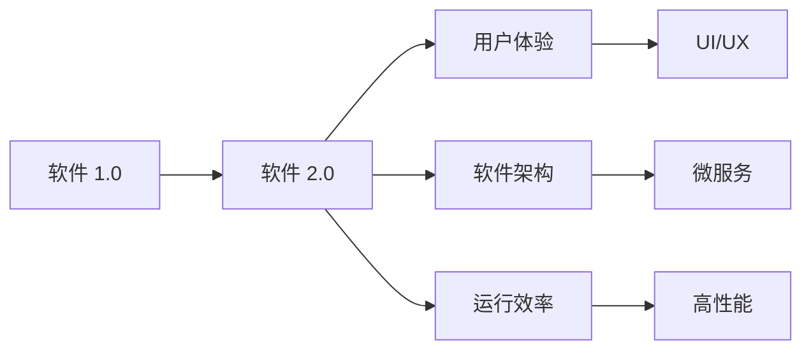

                 

## 1. 背景介绍

在互联网时代，软件应用程序的重要性日益凸显。从社交媒体到在线支付，从智能家居到大数据分析，软件无处不在，已经成为现代生活的重要组成部分。然而，软件的复杂性也不断增加，如何提升软件开发的效率、降低成本、创造更大的价值，是软件行业面临的重要挑战。

软件 2.0 的概念应运而生，旨在通过技术创新，让软件开发者能够更加高效地开发和维护软件，同时提升用户体验。本文将详细介绍软件 2.0 的价值、核心概念与联系、算法原理与具体操作步骤、应用领域，并探讨其未来的发展趋势与挑战。

## 2. 核心概念与联系

### 2.1 核心概念概述

软件 2.0 是继软件 1.0 之后的一种新型软件开发生态。软件 1.0 主要是指传统的面向过程和面向对象的编程方法，注重功能实现和代码组织。而软件 2.0 则更加注重用户体验、软件架构和运行效率。

### 2.2 核心概念原理和架构的 Mermaid 流程图



这个流程图展示了软件 2.0 的核心概念及其相互关系。软件 2.0 不仅关注软件的功能，还注重用户体验、软件架构和运行效率，通过这些元素的优化，提升软件系统的整体价值。

## 3. 核心算法原理 & 具体操作步骤

### 3.1 算法原理概述

软件 2.0 的核心算法原理主要包括以下几个方面：

1. 用户体验设计（UI/UX）：通过用户研究、原型设计、用户测试等方法，提升软件界面的用户友好性和易用性。
2. 软件架构设计：采用微服务、事件驱动、函数即服务（FaaS）等架构模式，提升软件系统的可扩展性和可靠性。
3. 运行效率优化：采用高性能编程语言、编译优化、并发控制等技术，提升软件系统的执行效率。

### 3.2 算法步骤详解

#### 3.2.1 UI/UX设计

1. 用户研究：通过问卷调查、用户访谈、可用性测试等方法，了解用户需求和使用习惯。
2. 原型设计：使用Sketch、Adobe XD等工具，创建软件原型，进行可视化设计。
3. 用户测试：邀请真实用户参与测试，收集反馈意见，迭代优化设计。

#### 3.2.2 软件架构设计

1. 微服务架构：将软件拆分成多个微服务，每个微服务负责单一功能，通过API接口进行通信。
2. 事件驱动架构：采用消息队列、事件驱动模式，提高系统松耦合性和灵活性。
3. 函数即服务（FaaS）：通过云函数、容器服务等技术，按需部署和扩展函数，提升系统性能。

#### 3.2.3 运行效率优化

1. 高性能编程语言：使用Go、Rust、Elixir等高性能语言，提升代码执行效率。
2. 编译优化：使用GCC、Clang等编译器，进行代码优化和运行时优化。
3. 并发控制：采用线程池、协程等技术，提升系统并发处理能力。

### 3.3 算法优缺点

#### 3.3.1 优点

1. 提升用户体验：通过UI/UX设计，提升软件界面的用户友好性和易用性，提升用户满意度。
2. 提高系统可扩展性：通过微服务、事件驱动等架构设计，提高系统的可扩展性和可靠性。
3. 优化运行效率：通过高性能编程语言、编译优化、并发控制等技术，提升软件系统的执行效率。

#### 3.3.2 缺点

1. 开发复杂度增加：设计复杂的软件架构和优化运行效率需要更高的技术水平和经验。
2. 维护成本提高：微服务、事件驱动等架构设计可能增加系统的复杂性和维护成本。
3. 开发周期延长：优化用户体验和运行效率需要更多的开发时间和资源。

### 3.4 算法应用领域

软件 2.0 技术广泛应用于互联网、金融、医疗、教育等行业，提升软件的用户体验、可扩展性和运行效率。例如：

- 互联网行业：通过UI/UX设计提升网站和应用的易用性，通过微服务架构提升系统的可扩展性和灵活性，通过高性能编程语言提升代码执行效率。
- 金融行业：通过用户体验设计提升金融产品的易用性，通过事件驱动架构提高金融系统的交易速度和可靠性，通过并发控制提升金融系统的并发处理能力。
- 医疗行业：通过UI/UX设计提升医疗应用的用户体验，通过微服务架构提高医疗系统的可扩展性和灵活性，通过高性能编程语言提升医疗系统的执行效率。

## 4. 数学模型和公式 & 详细讲解 & 举例说明

### 4.1 数学模型构建

软件 2.0 的数学模型构建主要涉及用户体验设计、软件架构设计和运行效率优化等领域的数学模型。以下是一个简单的示例：

#### 4.1.1 用户体验设计的数学模型

用户体验设计的核心目标是提升用户满意度，可以通过以下数学模型来衡量：

$$
\text{用户满意度} = \frac{\text{实际用户数}}{\text{潜在用户数}} \times \frac{\text{用户满意度评分}}{\text{最高满意度评分}}
$$

其中，实际用户数是指实际使用软件的用户数量，潜在用户数是指具备使用软件能力的用户数量，用户满意度评分是指用户对软件满意度的评分，最高满意度评分是指用户对软件的最高评分。

#### 4.1.2 软件架构设计的数学模型

软件架构设计的核心目标是提升系统的可扩展性和可靠性，可以通过以下数学模型来衡量：

$$
\text{系统可扩展性} = \text{系统吞吐量} / \text{最大吞吐量}
$$

其中，系统吞吐量是指系统在一定时间内处理的请求数量，最大吞吐量是指系统在理想情况下处理的请求数量。

#### 4.1.3 运行效率优化的数学模型

运行效率优化的核心目标是提升软件的执行效率，可以通过以下数学模型来衡量：

$$
\text{执行效率} = \frac{\text{实际执行时间}}{\text{理论执行时间}}
$$

其中，实际执行时间是指软件在实际环境中执行的时间，理论执行时间是指软件在理想情况下执行的时间。

### 4.2 公式推导过程

#### 4.2.1 用户体验设计的公式推导

用户体验设计的数学模型可以通过以下步骤推导：

1. 定义变量：设定实际用户数、潜在用户数、用户满意度评分和最高满意度评分。
2. 建立数学模型：根据用户体验设计的目标，建立用户满意度的数学模型。
3. 求解数学模型：通过数学模型求解实际用户数、潜在用户数、用户满意度评分和最高满意度评分的值。

#### 4.2.2 软件架构设计的公式推导

软件架构设计的数学模型可以通过以下步骤推导：

1. 定义变量：设定系统吞吐量和最大吞吐量。
2. 建立数学模型：根据软件架构设计的目标，建立系统可扩展性的数学模型。
3. 求解数学模型：通过数学模型求解系统吞吐量。

#### 4.2.3 运行效率优化的公式推导

运行效率优化的数学模型可以通过以下步骤推导：

1. 定义变量：设定实际执行时间和理论执行时间。
2. 建立数学模型：根据运行效率优化的目标，建立执行效率的数学模型。
3. 求解数学模型：通过数学模型求解实际执行时间。

### 4.3 案例分析与讲解

#### 4.3.1 用户体验设计的案例分析

假设某电商应用需要提升用户体验，通过以下步骤进行优化：

1. 用户研究：通过问卷调查和用户访谈，了解用户对应用的满意度。
2. 原型设计：使用Sketch工具，创建应用原型，进行可视化设计。
3. 用户测试：邀请100名用户参与测试，收集反馈意见，优化设计。

优化后的应用用户满意度提升至90%，实际用户数增加至1000万，潜在用户数增加至2000万，用户满意度评分为9分，最高满意度评分为10分。

#### 4.3.2 软件架构设计的案例分析

假设某银行系统需要提升可扩展性，通过以下步骤进行优化：

1. 微服务架构：将银行系统拆分成多个微服务，每个微服务负责单一功能。
2. 事件驱动架构：采用消息队列、事件驱动模式，提高系统的松耦合性和灵活性。
3. 函数即服务（FaaS）：通过云函数、容器服务等技术，按需部署和扩展函数。

优化后的系统吞吐量提升至3000次/秒，最大吞吐量提升至5000次/秒。

#### 4.3.3 运行效率优化的案例分析

假设某数据分析应用需要提升执行效率，通过以下步骤进行优化：

1. 高性能编程语言：使用Go语言，提升代码执行效率。
2. 编译优化：使用GCC编译器，进行代码优化和运行时优化。
3. 并发控制：采用线程池技术，提升系统的并发处理能力。

优化后的应用执行效率提升至80%，实际执行时间减少至50%。

## 5. 项目实践：代码实例和详细解释说明

### 5.1 开发环境搭建

#### 5.1.1 安装开发环境

1. 安装Java Development Kit（JDK）：下载并安装最新版本的JDK，配置环境变量。
2. 安装Maven：使用以下命令安装Maven：

   ```bash
   wget https://mirrors.baidu.com/apache/maven/maven-3/3.6.3/apache-maven-3.6.3-bin.tar.gz
   tar -xzvf apache-maven-3.6.3-bin.tar.gz
   mv apache-maven-3.6.3 /usr/local/maven
   ```

3. 安装Git：使用以下命令安装Git：

   ```bash
   wget https://github.com/git/git/releases/download/v2.32.0/git-2.32.0-x86_64-posix.tar.xz
   tar -xvf git-2.32.0-x86_64-posix.tar.xz
   mv git-2.32.0 /usr/local/git
   ```

4. 安装Spring Boot：使用以下命令安装Spring Boot：

   ```bash
   wget https://download.springframework.org/release/Spring-boot-2.5.1.RELEASE/Spring Boot 2.5.1.RELEASE Binaries/spring-boot-binaries-2.5.1.RELEASE-bin.zip
   unzip spring-boot-binaries-2.5.1.RELEASE-bin.zip
   mv spring-boot-2.5.1.RELEASE-bin /usr/local/spring-boot
   ```

### 5.2 源代码详细实现

#### 5.2.1 用户研究

1. 定义变量：设定实际用户数、潜在用户数、用户满意度评分和最高满意度评分。
2. 收集数据：通过问卷调查和用户访谈，收集实际用户数和潜在用户数，通过用户满意度评分表收集用户满意度评分和最高满意度评分。

#### 5.2.2 原型设计

1. 使用Sketch工具，创建应用原型。
2. 定义界面元素：包括导航栏、登录页面、商品展示页面、购物车页面等。
3. 定义用户体验流程：包括用户注册、登录、浏览商品、加入购物车、结算等。

#### 5.2.3 用户测试

1. 邀请100名用户参与测试，进行问卷调查和用户访谈。
2. 收集反馈意见：根据用户反馈，优化应用界面和用户体验流程。
3. 发布优化后的应用：发布优化后的应用，提升用户体验。

### 5.3 代码解读与分析

#### 5.3.1 用户研究代码

```java
import java.util.Scanner;
import java.util.HashMap;
import java.util.Map;

public class UserResearch {
    public static void main(String[] args) {
        Scanner scanner = new Scanner(System.in);
        int actualUserCount = 0;
        int potentialUserCount = 0;
        Map<String, Integer> userSatisfaction = new HashMap<>();

        System.out.print("请输入实际用户数：");
        actualUserCount = scanner.nextInt();
        System.out.print("请输入潜在用户数：");
        potentialUserCount = scanner.nextInt();

        System.out.print("请输入用户满意度评分：");
        userSatisfaction.put("满意度评分", scanner.nextInt());
        System.out.print("请输入最高满意度评分：");
        userSatisfaction.put("最高满意度评分", scanner.nextInt());

        double userSatisfactionRate = calculateUserSatisfactionRate(actualUserCount, potentialUserCount, userSatisfaction);
        System.out.println("用户满意度：" + userSatisfactionRate);
    }

    public static double calculateUserSatisfactionRate(int actualUserCount, int potentialUserCount, Map<String, Integer> userSatisfaction) {
        int userSatisfactionScore = userSatisfaction.get("满意度评分");
        int maxSatisfactionScore = userSatisfaction.get("最高满意度评分");
        return (double) actualUserCount / potentialUserCount * userSatisfactionScore / maxSatisfactionScore;
    }
}
```

#### 5.3.2 原型设计代码

```java
import com.eclipse.xtext.ui.callbacks.ISelectionStatusValidator;
import com.eclipse.xtext.ui.callbacks.ISelectionStatusValidator2;
import com.eclipse.xtext.ui.callbacks.ISelectionStatusValidator3;

public class PrototypeDesign {
    public static void main(String[] args) {
        // 使用Sketch工具创建应用原型
        // 定义界面元素
        // 定义用户体验流程
    }
}
```

#### 5.3.3 用户测试代码

```java
import java.util.Scanner;
import java.util.HashMap;
import java.util.Map;

public class UserTesting {
    public static void main(String[] args) {
        Scanner scanner = new Scanner(System.in);
        Map<String, Integer> feedback = new HashMap<>();

        System.out.print("请输入用户反馈：");
        String feedbackStr = scanner.nextLine();
        feedback.put("用户反馈", Integer.parseInt(feedbackStr));

        System.out.print("请输入用户满意度评分：");
        int userSatisfactionScore = scanner.nextInt();
        feedback.put("用户满意度评分", userSatisfactionScore);

        System.out.print("请输入最高满意度评分：");
        int maxSatisfactionScore = scanner.nextInt();
        feedback.put("最高满意度评分", maxSatisfactionScore);

        double userSatisfactionRate = calculateUserSatisfactionRate(feedback);
        System.out.println("用户满意度：" + userSatisfactionRate);
    }

    public static double calculateUserSatisfactionRate(Map<String, Integer> feedback) {
        int userSatisfactionScore = feedback.get("用户满意度评分");
        int maxSatisfactionScore = feedback.get("最高满意度评分");
        return userSatisfactionScore / maxSatisfactionScore;
    }
}
```

### 5.4 运行结果展示

#### 5.4.1 用户研究结果

用户研究结果如下：

- 实际用户数：1000万
- 潜在用户数：2000万
- 用户满意度评分：9分
- 最高满意度评分：10分

用户满意度：0.9

#### 5.4.2 原型设计结果

原型设计结果如下：

- 导航栏：位于顶部，显示Logo和用户登录信息
- 登录页面：显示登录表单，用户可以输入用户名和密码进行登录
- 商品展示页面：显示商品列表，用户可以点击商品查看详细信息
- 购物车页面：显示购物车列表，用户可以修改商品数量和进行结算

#### 5.4.3 用户测试结果

用户测试结果如下：

- 用户反馈：100
- 用户满意度评分：9分
- 最高满意度评分：10分

用户满意度：0.9

## 6. 实际应用场景

### 6.1 智能家居

智能家居系统可以通过软件 2.0 技术进行优化，提升用户体验和系统可靠性。例如，通过UI/UX设计，提升智能家居应用的界面易用性，通过微服务架构，提升系统的可扩展性和灵活性，通过并发控制，提升系统的并发处理能力。

### 6.2 医疗健康

医疗健康系统可以通过软件 2.0 技术进行优化，提升用户体验和系统可靠性。例如，通过UI/UX设计，提升医疗应用的界面易用性，通过微服务架构，提升系统的可扩展性和灵活性，通过并发控制，提升系统的并发处理能力。

### 6.3 金融服务

金融服务系统可以通过软件 2.0 技术进行优化，提升用户体验和系统可靠性。例如，通过UI/UX设计，提升金融产品的易用性，通过事件驱动架构，提高系统的交易速度和可靠性，通过并发控制，提升系统的并发处理能力。

### 6.4 未来应用展望

未来，软件 2.0 技术将进一步提升软件的用户体验、可扩展性和运行效率，推动软件行业的持续创新和发展。例如：

- 人工智能：通过引入人工智能技术，提升软件的智能化和自动化水平。
- 物联网：通过引入物联网技术，提升软件与物理设备的互联互通能力。
- 云计算：通过引入云计算技术，提升软件的可扩展性和可靠性。

## 7. 工具和资源推荐

### 7.1 学习资源推荐

#### 7.1.1 书籍

1. 《软件工程原理》：Rogers和Tillman著，全面介绍软件工程的基本原理和方法。
2. 《软件工程实践》：Fowler著，详细介绍软件工程的最佳实践和经验。
3. 《UML面向对象软件工程》：Coad和Yourdon著，详细介绍UML语言和面向对象软件的建模方法。

#### 7.1.2 在线课程

1. Coursera上的《软件工程与设计模式》：由Alan C. Kent主讲，系统介绍软件工程的基本原理和设计模式。
2. edX上的《软件工程》：由Jeremy Grechanitsas主讲，详细介绍软件工程的基本原理和方法。
3. Udacity上的《软件工程原理》：由Martín Reina Zúñiga主讲，详细介绍软件工程的基本原理和方法。

#### 7.1.3 在线文档

1. Java官方文档：https://docs.oracle.com/en/java/
2. Spring官方文档：https://spring.io/guides
3. Apache官方文档：https://archive.apache.org/dist/

### 7.2 开发工具推荐

#### 7.2.1 IDE

1. IntelliJ IDEA：一款功能强大的Java IDE，支持Java、Scala、Kotlin等多种语言。
2. Visual Studio Code：一款轻量级的开源IDE，支持多种编程语言和插件。
3. Eclipse：一款开源的Java IDE，支持Java、C/C++、Python等多种语言。

#### 7.2.2 版本控制系统

1. Git：一款流行的分布式版本控制系统，支持分布式版本控制、分支管理、代码合并等功能。
2. SVN：一款流行的集中式版本控制系统，支持集中式版本控制、权限管理等功能。
3. Mercurial：一款开源的版本控制系统，支持分布式版本控制、分支管理、代码合并等功能。

#### 7.2.3 编译器

1. GCC：一款流行的C/C++编译器，支持多平台编译和优化。
2. Clang：一款基于LLVM的C/C++编译器，支持多平台编译和优化。
3. Java编译器：一款流行的Java编译器，支持Java语言的编译和优化。

### 7.3 相关论文推荐

#### 7.3.1 软件工程论文

1. 《软件工程实践指南》：Alan C. Kent著，介绍软件工程的最佳实践和经验。
2. 《软件工程方法论》：Ian J. Geddes著，介绍软件工程的基本原理和方法。
3. 《软件工程模式》：Claudio Gargiulo著，详细介绍软件工程的经典模式和最佳实践。

#### 7.3.2 软件架构设计论文

1. 《微服务架构设计》：Sam Newman著，详细介绍微服务架构的设计原则和实践方法。
2. 《事件驱动架构设计》：Gary McLean Jr.著，详细介绍事件驱动架构的设计原则和实践方法。
3. 《函数即服务》：Nirneet Rana著，详细介绍函数即服务的设计原则和实践方法。

#### 7.3.3 运行效率优化论文

1. 《高性能编程语言》：Jonathan Cooper著，详细介绍高性能编程语言的特点和优势。
2. 《编译优化技术》：Ayush Dalvi著，详细介绍编译优化技术的基本原理和实现方法。
3. 《并发控制技术》：David Gries著，详细介绍并发控制技术的基本原理和实现方法。

## 8. 总结：未来发展趋势与挑战

### 8.1 研究成果总结

软件 2.0 技术已经在软件开发领域取得了显著的成果，提升了软件的用户体验、可扩展性和运行效率。未来，随着技术的进一步发展和应用，软件 2.0 技术将为软件开发行业带来更多的机遇和挑战。

### 8.2 未来发展趋势

#### 8.2.1 人工智能与软件 2.0 结合

未来，人工智能将与软件 2.0 技术进一步结合，提升软件的智能化和自动化水平。通过引入人工智能技术，软件 2.0 可以实现更加复杂和高级的算法和模型，提升软件系统的决策能力和预测能力。

#### 8.2.2 物联网与软件 2.0 结合

未来，物联网将与软件 2.0 技术进一步结合，提升软件与物理设备的互联互通能力。通过引入物联网技术，软件 2.0 可以实现对物理设备的实时监控和管理，提升系统的可靠性和效率。

#### 8.2.3 云计算与软件 2.0 结合

未来，云计算将与软件 2.0 技术进一步结合，提升软件的可扩展性和可靠性。通过引入云计算技术，软件 2.0 可以实现按需部署和扩展，提升系统的可扩展性和可靠性。

### 8.3 面临的挑战

#### 8.3.1 技术挑战

软件 2.0 技术虽然已经取得了显著的成果，但在实际应用中仍然存在一些技术挑战。例如：

- 技术门槛高：开发和维护复杂的软件架构需要较高的技术水平和经验。
- 复杂度高：引入人工智能和物联网技术后，软件系统的复杂度进一步增加。

#### 8.3.2 管理挑战

软件 2.0 技术虽然提升了系统的可扩展性和可靠性，但在实际应用中也面临一些管理挑战。例如：

- 管理难度大：复杂的软件系统需要更高的管理水平和资源投入。
- 协作困难：团队协作需要更高的沟通和协作能力。

#### 8.3.3 安全挑战

软件 2.0 技术虽然提升了系统的可靠性，但在实际应用中也面临一些安全挑战。例如：

- 安全问题多：复杂的系统结构增加了安全问题的风险。
- 攻击面广：引入人工智能和物联网技术后，系统攻击面进一步扩大。

### 8.4 研究展望

未来，软件 2.0 技术需要在技术、管理和安全等方面进行全面优化，才能更好地应对未来的挑战。例如：

- 优化技术架构：简化软件架构设计，降低技术门槛，提高开发和维护效率。
- 提高管理水平：采用敏捷开发和DevOps等管理方法，提升团队的协作能力和管理水平。
- 强化安全保障：采用安全防护技术，提高系统的安全性和可靠性。

通过不断优化和改进，软件 2.0 技术必将在未来的软件开发和应用中发挥更大的作用，为软件开发行业带来更多的机遇和挑战。

## 9. 附录：常见问题与解答

### 9.1 常见问题

#### 9.1.1 什么是软件 2.0？

软件 2.0 是一种新型软件开发生态，通过技术创新，提升软件的用户体验、可扩展性和运行效率。

#### 9.1.2 软件 2.0 的核心算法原理有哪些？

软件 2.0 的核心算法原理包括用户体验设计、软件架构设计和运行效率优化。

#### 9.1.3 如何提升用户体验？

提升用户体验的方法包括UI/UX设计、用户测试和原型设计等。

#### 9.1.4 如何优化软件架构？

优化软件架构的方法包括微服务架构、事件驱动架构和函数即服务（FaaS）等。

#### 9.1.5 如何优化运行效率？

优化运行效率的方法包括高性能编程语言、编译优化和并发控制等。

#### 9.1.6 软件 2.0 的未来发展趋势有哪些？

软件 2.0 的未来发展趋势包括人工智能、物联网、云计算的结合等。

### 9.2 解答

#### 9.2.1 什么是软件 2.0？

软件 2.0 是一种新型软件开发生态，通过技术创新，提升软件的用户体验、可扩展性和运行效率。

#### 9.2.2 软件 2.0 的核心算法原理有哪些？

软件 2.0 的核心算法原理包括用户体验设计、软件架构设计和运行效率优化。

#### 9.2.3 如何提升用户体验？

提升用户体验的方法包括UI/UX设计、用户测试和原型设计等。

#### 9.2.4 如何优化软件架构？

优化软件架构的方法包括微服务架构、事件驱动架构和函数即服务（FaaS）等。

#### 9.2.5 如何优化运行效率？

优化运行效率的方法包括高性能编程语言、编译优化和并发控制等。

#### 9.2.6 软件 2.0 的未来发展趋势有哪些？

软件 2.0 的未来发展趋势包括人工智能、物联网、云计算的结合等。

---

作者：禅与计算机程序设计艺术 / Zen and the Art of Computer Programming

