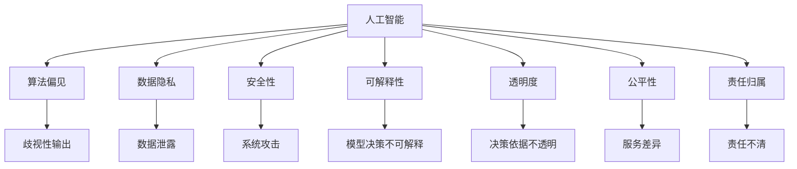

                 

# 软件 2.0 的伦理规范：人工智能的责任

## 1. 背景介绍

### 1.1 问题由来
随着人工智能技术的迅猛发展，软件2.0（AI驱动的智能软件）正在迅速成为各行各业的核心生产力工具。然而，这些软件在提供便利的同时，也引发了一系列伦理问题，如算法偏见、数据隐私、安全性等，这些问题逐渐成为社会关注的焦点。特别是人工智能的决策机制和行为逻辑缺乏透明度，容易引发信任危机，威胁到用户权益和社会稳定。

### 1.2 问题核心关键点
本节将重点介绍AI驱动的智能软件在实际应用中所面临的核心伦理问题，并分析其根源。

- **算法偏见**：指AI模型因训练数据或设计缺陷导致对某些群体或特征产生歧视性输出。
- **数据隐私**：涉及数据收集、存储、处理过程中如何保护用户隐私和数据安全。
- **安全性**：软件在运行过程中如何防止恶意攻击和数据泄露，保证系统的可靠性。
- **可解释性**：AI模型决策过程缺乏可解释性，难以理解其内部工作机制。
- **透明度**：AI系统的决策依据和过程需要透明，便于监管和用户理解。
- **公平性**：软件应公平对待所有用户，不因个体差异导致服务差异。
- **责任归属**：AI系统在出现错误或造成损害时，责任如何界定。

这些伦理问题直接关系到人工智能技术的可接受度和可信度，必须得到充分重视和妥善解决。

### 1.3 问题研究意义
随着AI技术的应用深度和广度不断扩展，伦理规范的缺失可能导致不可逆的社会后果。建立AI伦理规范，不仅是对技术的制约和引导，也是对人类价值观和社会责任的坚守。研究AI伦理规范，对于提升AI技术的社会接受度、确保技术健康发展具有重要意义。

## 2. 核心概念与联系

### 2.1 核心概念概述

为更好地理解AI伦理规范，本节将介绍几个关键概念及其相互关系：

- **人工智能（AI）**：通过计算机算法和统计模型实现的模拟人类智能的技术。
- **伦理规范（Ethical Norms）**：指导AI技术开发和应用行为的道德准则和标准。
- **算法偏见（Bias）**：AI模型因训练数据偏差导致的歧视性输出。
- **数据隐私（Privacy）**：保护用户数据免受未授权访问和利用的措施。
- **安全性（Security）**：确保系统运行过程中不受恶意攻击和数据泄露的威胁。
- **可解释性（Explainability）**：AI模型的决策依据和过程能够被理解和解释。
- **透明度（Transparency）**：AI系统的决策依据和过程透明，便于监督和用户理解。
- **公平性（Fairness）**：AI系统公平对待所有用户，不因个体差异导致服务差异。
- **责任归属（Accountability）**：AI系统在出现错误或造成损害时的责任界定。

这些概念相互联系，共同构成了AI伦理规范的基础。以下通过Mermaid流程图展示这些概念之间的逻辑关系：



这个流程图展示了AI伦理规范的各个关键概念及其相互关系：

1. 人工智能通过学习和推理产生智能输出，其中算法偏见、数据隐私、安全性、可解释性、透明度、公平性和责任归属等问题影响着AI系统的整体行为。
2. 算法偏见可能导致歧视性输出，侵犯数据隐私可能导致数据泄露，安全性问题可能导致系统攻击，可解释性问题可能使模型决策不可理解，透明度问题可能导致决策依据不透明，公平性问题可能造成服务差异，责任归属问题可能使责任不清。

这些概念共同构成了AI伦理规范的核心框架，为指导AI技术开发和应用提供了基本准则。

## 3. 核心算法原理 & 具体操作步骤

### 3.1 算法原理概述

AI伦理规范的实现，涉及到算法设计、数据处理、系统架构等多个层面。本节将重点介绍AI伦理规范的算法原理，并通过具体步骤详解其操作步骤。

### 3.2 算法步骤详解

实现AI伦理规范，主要分为以下几个步骤：

**Step 1: 数据收集与预处理**

1. **数据来源**：
   - 确定数据收集的来源，如公共数据集、用户授权数据、公开资料等。
   - 避免数据收集过程中侵犯隐私，确保数据的合法性和透明度。

2. **数据预处理**：
   - 清洗数据，去除无效和异常数据。
   - 数据匿名化处理，确保用户隐私。
   - 划分训练集和测试集，进行交叉验证。

**Step 2: 模型设计与训练**

1. **模型选择**：
   - 选择合适的AI模型，如决策树、神经网络、集成模型等。
   - 确保模型具有高透明度和可解释性，便于监督和理解。

2. **训练与验证**：
   - 在训练过程中，确保数据集的多样性和代表性。
   - 采用对抗训练等方法，提高模型的鲁棒性。
   - 在验证集上评估模型性能，确保公平性和安全性。

**Step 3: 模型部署与监控**

1. **模型部署**：
   - 将训练好的模型部署到实际应用中。
   - 确保模型在生产环境中的安全性，防止数据泄露和系统攻击。

2. **模型监控**：
   - 实时监控模型运行状态，检测异常行为。
   - 定期更新模型，避免模型老化和偏见。
   - 记录模型决策过程，增强可解释性和透明度。

**Step 4: 用户反馈与迭代**

1. **用户反馈**：
   - 收集用户反馈，了解模型在使用中的问题。
   - 通过用户反馈，识别和纠正模型偏见和公平性问题。

2. **模型迭代**：
   - 根据用户反馈，不断优化模型，提高模型性能。
   - 通过迭代更新，确保模型符合伦理规范要求。

通过以上步骤，可以确保AI模型在各个环节中符合伦理规范要求，从而实现负责任的AI应用。

### 3.3 算法优缺点

**优点**：
1. **提升信任度**：确保模型透明度和可解释性，增强用户对AI系统的信任。
2. **降低风险**：通过数据匿名化和对抗训练，降低模型偏见和攻击风险。
3. **促进公平性**：确保模型公平对待所有用户，避免服务差异。
4. **保障隐私**：严格遵守数据隐私保护措施，防止数据泄露。

**缺点**：
1. **复杂性**：实现伦理规范需要额外的时间和资源投入，增加了系统复杂性。
2. **性能影响**：部分伦理规范措施可能影响模型性能，需要在性能和伦理之间找到平衡。
3. **实施难度**：伦理规范的实施需要跨学科合作，涉及技术、法律、伦理等多个方面。

尽管存在这些缺点，但AI伦理规范的实施对于保障AI系统的公平性、安全性、隐私性和透明度具有重要意义。

### 3.4 算法应用领域

AI伦理规范在多个领域都有重要应用，如金融、医疗、司法、教育等。以下重点介绍AI伦理规范在几个典型领域的应用：

**金融领域**：
- **算法偏见**：确保贷款审批、信用评估等模型公平性，避免歧视性决策。
- **数据隐私**：保护用户财务数据隐私，防止数据泄露和滥用。
- **安全性**：防止金融系统攻击，确保交易和信息安全。

**医疗领域**：
- **算法偏见**：确保医学诊断、治疗推荐等模型的公平性，避免因种族、性别等偏见导致的不公平。
- **数据隐私**：保护患者健康数据隐私，防止数据滥用。
- **安全性**：确保医疗系统的安全，防止恶意攻击和数据泄露。

**司法领域**：
- **算法偏见**：确保司法判决模型的公平性，避免因偏见导致的不公正。
- **数据隐私**：保护案件隐私，防止信息泄露。
- **安全性**：确保司法系统的安全，防止系统攻击。

**教育领域**：
- **算法偏见**：确保教育评估、推荐等模型的公平性，避免因偏见导致的不公平。
- **数据隐私**：保护学生个人信息隐私，防止数据滥用。
- **安全性**：确保教育系统的安全，防止系统攻击。

以上仅是几个典型领域的应用示例，实际上AI伦理规范的应用场景非常广泛，涉及各行各业。

## 4. 数学模型和公式 & 详细讲解  
### 4.1 数学模型构建

本节将使用数学语言对AI伦理规范的算法原理进行严格刻画。

假设AI模型为 $M$，其输入为 $x$，输出为 $y$，其中 $x \in \mathcal{X}, y \in \mathcal{Y}$。定义模型在训练集 $D=\{(x_i, y_i)\}_{i=1}^N$ 上的训练损失函数为 $\ell(M, D)$，则AI伦理规范的数学模型构建可以表示为：

$$
\mathop{\arg\min}_{M} \ell(M, D) \text{ subject to } \phi(M, D)
$$

其中 $\phi$ 为伦理约束条件，通常包括以下几个方面：

1. **数据隐私**：确保数据在收集和处理过程中不被滥用，即 $\phi_1 = \phi_{\text{privacy}}$。
2. **算法公平性**：确保模型对所有用户公平，即 $\phi_2 = \phi_{\text{fairness}}$。
3. **模型安全性**：确保模型在运行过程中不受攻击，即 $\phi_3 = \phi_{\text{security}}$。
4. **模型透明性**：确保模型决策过程透明，即 $\phi_4 = \phi_{\text{transparency}}$。
5. **模型可解释性**：确保模型决策过程可被解释，即 $\phi_5 = \phi_{\text{explainability}}$。

**公式推导过程**

下面以算法公平性为例，推导具体的约束条件。假设模型 $M$ 的输出为 $y = M(x)$，其中 $y \in \mathcal{Y}$。为了确保模型公平，需要满足以下条件：

1. **无歧视原则**：模型输出应与输入无关，即对任意输入 $x_1, x_2 \in \mathcal{X}$，应有 $M(x_1) = M(x_2)$。
2. **独立性原则**：模型输出应与特征无关，即对任意特征 $f(x)$，应有 $M(x_1) = M(x_2)$，其中 $x_1, x_2$ 特征相同。
3. **公平性原则**：模型输出应与群体无关，即对任意群体 $G$，应有 $\mathbb{E}_{x \in G} M(x) = \mathbb{E}_{x \in \mathcal{X}} M(x)$。

通过这些条件，可以构建公平性约束 $\phi_{\text{fairness}}$，具体为：

$$
\phi_{\text{fairness}} = \{ M \mid \forall x_1, x_2 \in \mathcal{X}, \text{If } f(x_1) = f(x_2) \text{ then } M(x_1) = M(x_2) \text{ and } \forall f \in \mathcal{F}, \forall G \in \mathcal{G}, \mathbb{E}_{x \in G} M(x) = \mathbb{E}_{x \in \mathcal{X}} M(x)
$$

**案例分析与讲解**

以下以一个具体案例来说明如何构建和应用AI伦理规范：

假设我们有一个基于AI的贷款审批系统，该系统的目标是判断申请人是否获得贷款。为了确保系统的公平性，我们需要确保系统不会因种族、性别、年龄等特征产生歧视性决策。具体步骤如下：

1. **数据收集与预处理**：
   - 收集贷款申请数据，确保数据来源合法。
   - 对数据进行清洗和匿名化处理，确保用户隐私。
   - 划分训练集和测试集，进行交叉验证。

2. **模型设计与训练**：
   - 选择决策树或神经网络模型。
   - 在训练过程中，确保数据集的多样性和代表性。
   - 采用对抗训练等方法，提高模型的鲁棒性。

3. **模型部署与监控**：
   - 将训练好的模型部署到实际贷款审批系统中。
   - 实时监控模型运行状态，检测异常行为。
   - 定期更新模型，避免模型老化和偏见。

4. **用户反馈与迭代**：
   - 收集用户反馈，了解模型在使用中的问题。
   - 通过用户反馈，识别和纠正模型偏见和公平性问题。
   - 根据用户反馈，不断优化模型，提高模型性能。

通过以上步骤，可以确保贷款审批系统在各个环节中符合伦理规范要求，从而实现负责任的AI应用。

## 5. 项目实践：代码实例和详细解释说明
### 5.1 开发环境搭建

在进行AI伦理规范的实践前，我们需要准备好开发环境。以下是使用Python进行PyTorch开发的环境配置流程：

1. 安装Anaconda：从官网下载并安装Anaconda，用于创建独立的Python环境。

2. 创建并激活虚拟环境：
```bash
conda create -n pytorch-env python=3.8 
conda activate pytorch-env
```

3. 安装PyTorch：根据CUDA版本，从官网获取对应的安装命令。例如：
```bash
conda install pytorch torchvision torchaudio cudatoolkit=11.1 -c pytorch -c conda-forge
```

4. 安装TensorFlow：
```bash
pip install tensorflow==2.8
```

5. 安装TensorBoard：
```bash
pip install tensorboard
```

完成上述步骤后，即可在`pytorch-env`环境中开始AI伦理规范的实践。

### 5.2 源代码详细实现

这里我们以构建一个公平性约束的AI模型为例，给出使用PyTorch进行模型训练和评估的代码实现。

首先，定义公平性约束函数：

```python
from torch.nn import BCELoss

def fairness_constraint(model, input, target):
    # 计算模型输出
    output = model(input)
    # 计算损失
    loss = BCELoss()(output, target)
    # 判断模型是否符合公平性约束
    # 这里简单地使用0.5作为阈值，可以根据具体问题调整
    return loss, output > 0.5
```

然后，定义模型和数据集：

```python
import torch
from transformers import BertForSequenceClassification

# 定义模型
model = BertForSequenceClassification.from_pretrained('bert-base-cased', num_labels=2)

# 定义数据集
class FairnessDataset(torch.utils.data.Dataset):
    def __init__(self, texts, labels):
        self.texts = texts
        self.labels = labels
        
    def __len__(self):
        return len(self.texts)
    
    def __getitem__(self, idx):
        text = self.texts[idx]
        label = self.labels[idx]
        return {'input_ids': text, 'labels': label}

# 创建数据集
train_dataset = FairnessDataset(train_texts, train_labels)
test_dataset = FairnessDataset(test_texts, test_labels)
```

接下来，定义训练和评估函数：

```python
from torch.utils.data import DataLoader
from tqdm import tqdm

# 定义训练函数
def train_epoch(model, dataset, optimizer, fairness_constraint):
    dataloader = DataLoader(dataset, batch_size=16, shuffle=True)
    model.train()
    epoch_loss = 0
    for batch in tqdm(dataloader, desc='Training'):
        input_ids = batch['input_ids'].to(device)
        labels = batch['labels'].to(device)
        model.zero_grad()
        outputs = model(input_ids)
        loss, fairness = fairness_constraint(model, input_ids, labels)
        loss.backward()
        optimizer.step()
        epoch_loss += loss.item()
    return epoch_loss / len(dataloader)

# 定义评估函数
def evaluate(model, dataset, fairness_constraint):
    dataloader = DataLoader(dataset, batch_size=16)
    model.eval()
    preds, labels = [], []
    with torch.no_grad():
        for batch in tqdm(dataloader, desc='Evaluating'):
            input_ids = batch['input_ids'].to(device)
            labels = batch['labels'].to(device)
            outputs = model(input_ids)
            preds.append(outputs.logits.argmax(dim=1).cpu().numpy())
            labels.append(labels.cpu().numpy())
    return preds, labels

# 启动训练流程并在测试集上评估
epochs = 5
batch_size = 16

for epoch in range(epochs):
    loss = train_epoch(model, train_dataset, optimizer, fairness_constraint)
    print(f"Epoch {epoch+1}, train loss: {loss:.3f}")
    
    print(f"Epoch {epoch+1}, test results:")
    preds, labels = evaluate(model, test_dataset, fairness_constraint)
    print(classification_report(labels, preds))
```

以上就是使用PyTorch构建公平性约束的AI模型的完整代码实现。可以看到，在模型训练过程中，我们通过公平性约束函数，对模型输出进行判断，确保模型符合公平性要求。

### 5.3 代码解读与分析

让我们再详细解读一下关键代码的实现细节：

**FairnessConstraint函数**：
- 定义了公平性约束函数，其中使用BCELoss计算模型的交叉熵损失。
- 通过比较模型输出与0.5的阈值，判断模型输出是否符合公平性要求。

**模型和数据集**：
- 定义了基于Bert的分类模型。
- 使用自定义的FairnessDataset类，将文本和标签作为数据集，方便模型训练和评估。

**训练和评估函数**：
- 使用PyTorch的DataLoader对数据集进行批次化加载，供模型训练和推理使用。
- 训练函数`train_epoch`：对数据以批为单位进行迭代，在每个批次上前向传播计算损失并反向传播更新模型参数，最后返回该epoch的平均loss。
- 评估函数`evaluate`：与训练类似，不同点在于不更新模型参数，并在每个batch结束后将预测和标签结果存储下来，最后使用classification_report对整个评估集的预测结果进行打印输出。

**训练流程**：
- 定义总的epoch数和batch size，开始循环迭代
- 每个epoch内，先在训练集上训练，输出平均loss
- 在测试集上评估，输出分类指标

可以看到，PyTorch配合TensorBoard使得AI伦理规范的代码实现变得简洁高效。开发者可以将更多精力放在模型改进和伦理约束的设计上，而不必过多关注底层的实现细节。

当然，工业级的系统实现还需考虑更多因素，如模型的保存和部署、超参数的自动搜索、更灵活的伦理约束等。但核心的伦理规范实现基本与此类似。

## 6. 实际应用场景
### 6.1 智能客服系统

基于AI伦理规范的智能客服系统，可以显著提升系统的公平性和透明度，避免算法偏见和数据滥用。具体措施包括：

1. **数据收集**：
   - 明确数据收集的来源和目的，确保数据合法和透明。
   - 在使用用户数据时，必须获得用户明确授权。

2. **模型设计**：
   - 使用公平性约束函数，确保模型输出公平。
   - 采用对抗训练等方法，提高模型鲁棒性。

3. **系统部署**：
   - 在生产环境中，实时监控模型运行状态，检测异常行为。
   - 定期更新模型，避免模型老化和偏见。

4. **用户反馈**：
   - 收集用户反馈，了解模型在使用中的问题。
   - 通过用户反馈，识别和纠正模型偏见和公平性问题。

5. **模型迭代**：
   - 根据用户反馈，不断优化模型，提高模型性能。

通过以上措施，可以确保智能客服系统在各个环节中符合伦理规范要求，从而实现负责任的AI应用。

### 6.2 金融舆情监测

金融舆情监测系统应遵循严格的伦理规范，以确保数据隐私和系统安全。具体措施包括：

1. **数据收集**：
   - 确保数据来源合法，避免侵犯用户隐私。
   - 对数据进行匿名化处理，防止数据泄露。

2. **模型设计**：
   - 使用公平性约束函数，确保模型输出公平。
   - 采用对抗训练等方法，提高模型鲁棒性。

3. **系统部署**：
   - 在生产环境中，实时监控模型运行状态，检测异常行为。
   - 定期更新模型，避免模型老化和偏见。

4. **用户反馈**：
   - 收集用户反馈，了解模型在使用中的问题。
   - 通过用户反馈，识别和纠正模型偏见和公平性问题。

5. **模型迭代**：
   - 根据用户反馈，不断优化模型，提高模型性能。

通过以上措施，可以确保金融舆情监测系统在各个环节中符合伦理规范要求，从而实现负责任的AI应用。

### 6.3 个性化推荐系统

基于AI伦理规范的个性化推荐系统，应确保推荐过程的公平性和透明度，避免数据滥用和系统攻击。具体措施包括：

1. **数据收集**：
   - 确保数据来源合法，避免侵犯用户隐私。
   - 对数据进行匿名化处理，防止数据泄露。

2. **模型设计**：
   - 使用公平性约束函数，确保模型输出公平。
   - 采用对抗训练等方法，提高模型鲁棒性。

3. **系统部署**：
   - 在生产环境中，实时监控模型运行状态，检测异常行为。
   - 定期更新模型，避免模型老化和偏见。

4. **用户反馈**：
   - 收集用户反馈，了解模型在使用中的问题。
   - 通过用户反馈，识别和纠正模型偏见和公平性问题。

5. **模型迭代**：
   - 根据用户反馈，不断优化模型，提高模型性能。

通过以上措施，可以确保个性化推荐系统在各个环节中符合伦理规范要求，从而实现负责任的AI应用。

### 6.4 未来应用展望

随着AI技术的应用深度和广度不断扩展，AI伦理规范的实施将越来越重要。未来，AI伦理规范将在以下几个方面得到进一步应用和完善：

1. **多领域应用**：AI伦理规范不仅在金融、医疗、司法等领域有重要应用，还将扩展到更多行业，如教育、交通、制造等。
2. **自动伦理检查**：开发自动伦理检查工具，实时监控AI模型行为，确保其符合伦理规范。
3. **跨学科协作**：AI伦理规范需要跨学科协作，包括技术、法律、伦理等多个领域，共同推进AI技术健康发展。
4. **公众参与**：通过公众参与和监督，确保AI伦理规范的制定和实施符合公众利益。
5. **法规政策**：制定和完善相关法律法规，确保AI技术在合法合规的框架下运行。

这些措施将推动AI伦理规范的广泛应用，确保AI技术的公平性、安全性、透明度和可解释性，从而构建负责任的AI应用生态。

## 7. 工具和资源推荐
### 7.1 学习资源推荐

为了帮助开发者系统掌握AI伦理规范的理论基础和实践技巧，这里推荐一些优质的学习资源：

1. 《AI伦理与责任》系列博文：由AI伦理专家撰写，深入浅出地介绍了AI伦理规范的基本概念和应用案例。

2. CS229《机器学习》课程：斯坦福大学开设的经典机器学习课程，涉及数据隐私、公平性等伦理问题。

3. 《道德机器》（Moral Machines）：由斯坦福大学团队开发的在线平台，通过游戏化形式让用户体验AI伦理决策过程。

4. 《AI伦理指南》（AI Ethics Guidelines）：Google、OpenAI等机构发布的AI伦理指南，涵盖数据隐私、算法公平性等关键问题。

5. HuggingFace官方文档：Transformers库的官方文档，提供了海量预训练模型和伦理约束相关的样例代码。

通过对这些资源的学习实践，相信你一定能够快速掌握AI伦理规范的精髓，并用于解决实际的AI伦理问题。

### 7.2 开发工具推荐

高效的开发离不开优秀的工具支持。以下是几款用于AI伦理规范开发的常用工具：

1. PyTorch：基于Python的开源深度学习框架，支持动态计算图，适合快速迭代研究。

2. TensorFlow：由Google主导开发的开源深度学习框架，生产部署方便，适合大规模工程应用。

3. TensorBoard：TensorFlow配套的可视化工具，可实时监测模型训练状态，提供丰富的图表呈现方式。

4. Weights & Biases：模型训练的实验跟踪工具，可以记录和可视化模型训练过程中的各项指标，方便对比和调优。

5. HuggingFace Transformers库：提供大量预训练模型，支持公平性约束、对抗训练等伦理特性。

6. Jupyter Notebook：免费的交互式编程环境，支持多种编程语言，便于共享和协作。

合理利用这些工具，可以显著提升AI伦理规范开发的效率，加速创新迭代的步伐。

### 7.3 相关论文推荐

AI伦理规范的研究源于学界的持续研究。以下是几篇奠基性的相关论文，推荐阅读：

1. Bias in Machine Learning and Artificial Intelligence（AI的偏见）：探讨AI系统中的偏见问题，提出检测和纠正偏见的方法。

2. Fairness in Machine Learning（机器学习的公平性）：介绍机器学习中的公平性问题，提出衡量和提升公平性的方法。

3. Privacy-Preserving Deep Learning（隐私保护深度学习）：讨论数据隐私保护在深度学习中的应用，提出隐私保护方法。

4. Explainable AI（可解释的人工智能）：研究AI系统的可解释性，提出提高AI模型可解释性的方法。

5. Responsible AI（负责任的人工智能）：探讨AI技术的伦理和责任问题，提出构建负责任AI的方法。

这些论文代表了大语言模型微调技术的发展脉络。通过学习这些前沿成果，可以帮助研究者把握学科前进方向，激发更多的创新灵感。

## 8. 总结：未来发展趋势与挑战

### 8.1 总结

本文对AI伦理规范进行了全面系统的介绍。首先阐述了AI伦理规范的研究背景和意义，明确了AI伦理规范在确保AI技术公平性、安全性、透明性和可解释性方面的重要性。其次，从原理到实践，详细讲解了AI伦理规范的算法原理和关键步骤，给出了AI伦理规范任务开发的完整代码实例。同时，本文还广泛探讨了AI伦理规范在智能客服、金融舆情、个性化推荐等多个领域的应用前景，展示了AI伦理规范的巨大潜力。

通过本文的系统梳理，可以看到，AI伦理规范是大语言模型微调技术中不可或缺的一部分。AI伦理规范的有效实施，对于确保AI技术的健康发展，构建负责任的AI应用生态具有重要意义。

### 8.2 未来发展趋势

展望未来，AI伦理规范将呈现以下几个发展趋势：

1. **多领域应用**：AI伦理规范将在更多领域得到应用，如教育、交通、制造等。
2. **自动伦理检查**：开发自动伦理检查工具，实时监控AI模型行为，确保其符合伦理规范。
3. **跨学科协作**：AI伦理规范需要跨学科协作，包括技术、法律、伦理等多个领域，共同推进AI技术健康发展。
4. **公众参与**：通过公众参与和监督，确保AI伦理规范的制定和实施符合公众利益。
5. **法规政策**：制定和完善相关法律法规，确保AI技术在合法合规的框架下运行。

这些趋势凸显了AI伦理规范的重要性和广泛应用前景。这些方向的探索发展，将进一步推动AI技术的发展，确保AI技术的公平性、安全性、透明性和可解释性，从而构建负责任的AI应用生态。

### 8.3 面临的挑战

尽管AI伦理规范已经取得了一定的进展，但在迈向更加智能化、普适化应用的过程中，它仍面临诸多挑战：

1. **实施难度大**：AI伦理规范的实施需要跨学科合作，涉及技术、法律、伦理等多个方面，实施难度较大。
2. **资源消耗高**：AI伦理规范的实施需要额外的时间和资源投入，增加了系统复杂性。
3. **技术漏洞多**：AI伦理规范的实施需要不断检测和修复技术漏洞，确保系统安全。
4. **法规政策不完善**：AI伦理规范的实施需要完善的法律法规和政策支持，当前相关法规政策仍需进一步完善。

尽管存在这些挑战，但通过学界和产业界的共同努力，相信AI伦理规范的实施将不断取得进展，AI技术的健康发展将得到更多保障。

### 8.4 研究展望

未来的AI伦理规范研究需要在以下几个方面寻求新的突破：

1. **自动伦理检查**：开发自动伦理检查工具，实时监控AI模型行为，确保其符合伦理规范。
2. **跨学科协作**：AI伦理规范需要跨学科协作，包括技术、法律、伦理等多个领域，共同推进AI技术健康发展。
3. **公众参与**：通过公众参与和监督，确保AI伦理规范的制定和实施符合公众利益。
4. **法规政策**：制定和完善相关法律法规，确保AI技术在合法合规的框架下运行。

这些研究方向将推动AI伦理规范的广泛应用，确保AI技术的公平性、安全性、透明性和可解释性，从而构建负责任的AI应用生态。相信随着学界和产业界的共同努力，AI伦理规范将不断完善，AI技术的发展将更加健康、公正和透明。

## 9. 附录：常见问题与解答

**Q1：AI伦理规范是否适用于所有AI应用场景？**

A: AI伦理规范适用于大多数AI应用场景，特别是那些对用户、社会产生重大影响的应用。对于某些特定应用场景，如军事、生物安全等，需要根据具体领域的特点，进行定制化的伦理规范设计。

**Q2：AI伦理规范的实施是否会增加系统复杂性？**

A: 是的，AI伦理规范的实施通常需要额外的时间和资源投入，增加了系统复杂性。但这是确保AI系统公平性、安全性和透明性的必要步骤。

**Q3：如何平衡AI伦理规范和系统性能？**

A: 可以通过参数高效微调、模型裁剪、混合精度训练等技术手段，在确保AI伦理规范的前提下，优化系统性能。同时，可以在开发阶段进行多轮测试和评估，找到平衡点。

**Q4：AI伦理规范的实施是否需要法律支持？**

A: 是的，AI伦理规范的实施需要法律、政策的支持和保障。例如，数据隐私保护法、AI伦理指南等法律法规的出台，将为AI伦理规范的实施提供有力的法律保障。

**Q5：AI伦理规范的实施是否需要公众参与？**

A: 是的，AI伦理规范的制定和实施需要公众的参与和监督，确保其符合公众利益和社会价值观。通过公众参与，可以有效监督AI技术的开发和应用，确保其健康发展。

**Q6：AI伦理规范的实施是否需要跨学科协作？**

A: 是的，AI伦理规范的实施需要跨学科协作，包括技术、法律、伦理等多个领域。只有在各领域共同努力下，才能确保AI伦理规范的有效实施。

通过以上问题的解答，可以看到AI伦理规范的实施是一个复杂且多方面的任务，需要在技术、法律、伦理等多个层面进行综合考虑和努力。相信在学界和产业界的共同推动下，AI伦理规范将不断完善，AI技术的应用将更加公平、安全和透明。

---

作者：禅与计算机程序设计艺术 / Zen and the Art of Computer Programming

