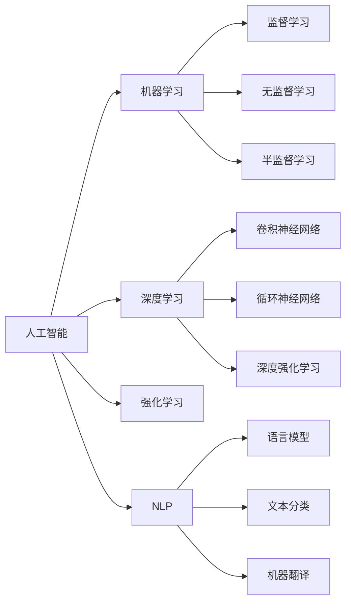

                 

# 软件 2.0 的哲学思考：人工智能的本质

## 1. 背景介绍

在信息化、数字化时代的浪潮下，软件技术经历了从 1.0 到 2.0 的变革。1.0 时代，软件的核心是数据，通过数据的存储、处理和分析，实现对现实世界的数字化模拟。而 2.0 时代，软件的核心则转向了智能，通过人工智能技术的赋能，软件具备了理解、推理、决策等高级认知能力，成为更加智能化的信息处理系统。

人工智能的本质是什么？在软件 2.0 时代，如何看待和理解 AI 技术？本文将从哲学的角度出发，探索人工智能的根本原理，探讨其在信息时代中的地位和作用，为软件 2.0 的发展提供深刻的哲学思考。

## 2. 核心概念与联系

### 2.1 核心概念概述

在软件 2.0 时代，人工智能技术是核心的驱动力。人工智能涵盖了从基础数学、算法到高级认知模型，乃至跨领域应用的一系列概念。

- **人工智能**：一种通过模拟人类智能行为，使机器能够执行复杂的认知任务的技术。包括感知、学习、推理、决策等多个方面。
- **机器学习**：一种使机器能够自动学习和改进的技术，通过数据驱动的算法，使机器能够从经验中学习，提升预测和决策能力。
- **深度学习**：一种特殊的机器学习算法，通过构建多层神经网络，实现对复杂数据的非线性建模和高效处理。
- **强化学习**：一种通过智能体与环境的交互，优化决策策略的技术，用于解决复杂的优化问题。
- **自然语言处理(NLP)**：一种使机器能够理解、生成和处理自然语言的技术，包括语言模型、文本分类、机器翻译等。

### 2.2 核心概念原理和架构的 Mermaid 流程图



## 3. 核心算法原理 & 具体操作步骤

### 3.1 算法原理概述

人工智能的算法原理可以分为两个主要部分：数据驱动和模型驱动。

- **数据驱动**：通过大规模数据训练模型，使其能够学习到数据的模式和规律，从而实现对未知数据的预测和决策。
- **模型驱动**：基于先验知识构建模型，通过优化算法调整模型参数，使其能够模拟复杂的认知过程。

在数据驱动的模型中，常用的算法包括监督学习、无监督学习和强化学习。其中，监督学习通过对大量带有标签的数据进行训练，使模型能够学习到输入和输出之间的映射关系。无监督学习则不依赖于标签数据，通过发现数据的内在结构和规律，实现数据的降维和聚类。强化学习则是通过智能体与环境的交互，优化决策策略，实现复杂任务的自动化。

在模型驱动的模型中，深度学习和神经网络是核心技术。深度学习通过构建多层神经网络，模拟人类大脑的神经元结构，实现对复杂数据的非线性建模和高效处理。神经网络则通过反向传播算法，不断调整权重，优化模型的预测能力。

### 3.2 算法步骤详解

以下是基于监督学习的大规模数据驱动模型的训练步骤：

1. **数据准备**：收集和预处理数据集，包括数据的清洗、标注和划分。
2. **模型选择**：选择适合的模型结构，如全连接网络、卷积神经网络、循环神经网络等。
3. **模型训练**：使用优化算法（如SGD、Adam等）对模型进行训练，调整模型参数。
4. **模型评估**：在测试集上评估模型的性能，如准确率、召回率、F1 值等。
5. **模型优化**：根据评估结果，对模型进行微调，提升模型性能。
6. **模型应用**：将训练好的模型应用到实际问题中，进行推理和预测。

### 3.3 算法优缺点

基于监督学习的大规模数据驱动模型有以下优点：

- **准确率高**：通过大量的标注数据训练，模型能够学习到输入和输出之间的复杂映射关系，预测准确率较高。
- **泛化能力强**：模型能够适应不同的数据分布，对未见过的数据进行有效的预测。

但其缺点也显而易见：

- **依赖标注数据**：模型的训练需要大量的标注数据，标注成本高，数据获取困难。
- **过拟合风险**：在大规模数据集上训练的模型容易发生过拟合，泛化能力不足。
- **计算资源消耗大**：大规模数据训练需要大量的计算资源，训练时间长，部署复杂。

### 3.4 算法应用领域

人工智能技术已经广泛应用于各个领域，包括：

- **计算机视觉**：用于图像识别、目标检测、人脸识别等。
- **自然语言处理**：用于语言模型、文本分类、机器翻译等。
- **智能推荐**：用于电商推荐、新闻推荐、广告推荐等。
- **金融科技**：用于信用评估、风险管理、投资策略等。
- **医疗健康**：用于疾病诊断、基因分析、医疗影像等。

## 4. 数学模型和公式 & 详细讲解 & 举例说明

### 4.1 数学模型构建

在深度学习中，常用的数学模型包括前馈神经网络（Feedforward Neural Network, FNN）、卷积神经网络（Convolutional Neural Network, CNN）、循环神经网络（Recurrent Neural Network, RNN）、长短期记忆网络（Long Short-Term Memory, LSTM）等。

以下以卷积神经网络为例，构建数学模型。卷积神经网络通过卷积层、池化层和全连接层，实现对图像数据的有效处理。

### 4.2 公式推导过程

卷积神经网络的核心公式包括卷积运算和池化运算。

- **卷积运算**：设输入图像为 $I$，卷积核为 $K$，输出特征图为 $O$，则卷积运算公式为：
$$
O = I * K
$$
其中，$*$ 表示卷积运算。

- **池化运算**：设输入特征图为 $I$，池化窗口大小为 $w$，池化步长为 $s$，则最大池化运算公式为：
$$
O(i,j) = \max_{t=0}^{w-1} \max_{k=0}^{h-1} I(i+s \cdot t, j+s \cdot k)
$$
其中，$h$ 表示特征图的高度，$w$ 表示特征图的宽度。

### 4.3 案例分析与讲解

以图像分类任务为例，使用卷积神经网络进行模型构建和训练。具体步骤如下：

1. **数据准备**：收集图像数据集，并进行预处理，如数据增强、归一化等。
2. **模型选择**：选择卷积神经网络作为模型结构，包括卷积层、池化层、全连接层等。
3. **模型训练**：使用交叉熵损失函数和 Adam 优化算法，对模型进行训练，调整模型参数。
4. **模型评估**：在测试集上评估模型的性能，如准确率、召回率、F1 值等。
5. **模型优化**：根据评估结果，对模型进行微调，提升模型性能。

## 5. 项目实践：代码实例和详细解释说明

### 5.1 开发环境搭建

在 Python 环境下，使用 TensorFlow 和 Keras 进行卷积神经网络模型的搭建和训练。具体步骤如下：

1. **安装 TensorFlow**：使用 pip 命令安装 TensorFlow。
2. **安装 Keras**：使用 pip 命令安装 Keras。
3. **数据准备**：使用 NumPy 和 pandas 库对图像数据集进行预处理，如数据增强、归一化等。
4. **模型构建**：使用 Keras 搭建卷积神经网络模型。
5. **模型训练**：使用 Keras 训练模型，调整模型参数。
6. **模型评估**：使用 Keras 评估模型性能，如准确率、召回率、F1 值等。

### 5.2 源代码详细实现

以下是卷积神经网络模型的 Python 代码实现：

```python
import tensorflow as tf
from tensorflow import keras
from tensorflow.keras import layers

# 定义卷积神经网络模型
model = keras.Sequential([
    layers.Conv2D(32, (3, 3), activation='relu', input_shape=(32, 32, 3)),
    layers.MaxPooling2D((2, 2)),
    layers.Conv2D(64, (3, 3), activation='relu'),
    layers.MaxPooling2D((2, 2)),
    layers.Conv2D(64, (3, 3), activation='relu'),
    layers.Flatten(),
    layers.Dense(64, activation='relu'),
    layers.Dense(10, activation='softmax')
])

# 编译模型
model.compile(optimizer='adam',
              loss=tf.keras.losses.SparseCategoricalCrossentropy(from_logits=True),
              metrics=['accuracy'])

# 训练模型
model.fit(train_images, train_labels, epochs=10, 
          validation_data=(test_images, test_labels))

# 评估模型
test_loss, test_acc = model.evaluate(test_images, test_labels)
print('Test accuracy:', test_acc)
```

### 5.3 代码解读与分析

- **层选择**：使用卷积层、池化层和全连接层构建卷积神经网络模型。
- **激活函数**：使用 ReLU 激活函数，增强模型的非线性表达能力。
- **损失函数**：使用交叉熵损失函数，衡量模型预测结果与真实标签的差异。
- **优化器**：使用 Adam 优化器，调整模型参数。

## 6. 实际应用场景

### 6.1 自动驾驶

自动驾驶技术需要高度的感知和决策能力，人工智能在自动驾驶中扮演着关键角色。通过深度学习技术，自动驾驶系统能够从传感器数据中提取特征，实现对道路环境的理解，并做出合理的驾驶决策。

### 6.2 金融科技

金融科技涉及风险管理、信用评估、投资策略等多个方面，人工智能技术在金融领域的应用广泛。通过机器学习算法，金融科技系统能够分析海量数据，发现潜在的风险和机会，辅助决策制定。

### 6.3 智能医疗

智能医疗通过人工智能技术，实现对疾病诊断、基因分析、医疗影像等的辅助决策。深度学习技术在医疗影像识别、病历分析等方面展现出强大的潜力，有助于提高医疗服务的效率和准确性。

### 6.4 未来应用展望

未来，人工智能技术将在更多的领域得到应用，展现出广阔的前景。以下是一些可能的发展方向：

- **通用人工智能**：构建具有人类智能的通用 AI 系统，能够执行复杂的认知任务，实现人机协作。
- **智能城市**：通过 AI 技术，实现城市交通管理、公共安全、资源分配等智能化，提升城市治理水平。
- **个性化推荐**：基于 AI 技术，实现个性化推荐系统，提升用户体验，推动电子商务、媒体娱乐等产业的发展。
- **智能制造**：通过 AI 技术，实现智能生产、质量控制、供应链优化等，推动制造业的智能化转型。

## 7. 工具和资源推荐

### 7.1 学习资源推荐

- **《深度学习》书籍**：Ian Goodfellow 等著，全面介绍了深度学习的基本原理和应用。
- **《TensorFlow 实战》书籍**：Manning Publications，提供了 TensorFlow 的实践指南。
- **Kaggle 平台**：全球最大的数据科学竞赛平台，提供丰富的数据集和模型竞赛，有助于学习和实践 AI 技术。
- **Coursera 课程**：斯坦福大学、MIT 等名校提供的 AI 相关课程，涵盖深度学习、计算机视觉、自然语言处理等多个方面。
- **arXiv.org**：全球最大的预印本平台，提供最新的 AI 研究成果和论文，有助于跟踪前沿技术。

### 7.2 开发工具推荐

- **TensorFlow**：由 Google 主导的深度学习框架，支持分布式训练和推理，适用于大规模 AI 项目。
- **Keras**：基于 TensorFlow 的高级神经网络 API，提供了简单易用的接口，适合快速原型开发。
- **PyTorch**：由 Facebook 主导的深度学习框架，支持动态图和静态图，适用于灵活的 AI 实验。
- **Scikit-learn**：基于 Python 的机器学习库，提供了丰富的机器学习算法和工具。
- **Jupyter Notebook**：交互式的 Python 开发环境，适合进行 AI 实验和数据可视化。

### 7.3 相关论文推荐

- **ImageNet 大规模视觉识别竞赛**：AlexNet、VGGNet、Inception 等经典模型，推动了计算机视觉的发展。
- **AlphaGo 击败李世石**：DeepMind 的 AlphaGo 系统，通过深度学习和强化学习，实现了在围棋领域的突破。
- **BERT: Pre-training of Deep Bidirectional Transformers for Language Understanding**：Google 的 BERT 模型，通过预训练和微调技术，实现了语言模型的新高度。
- **GAN: Generative Adversarial Networks**：Ian Goodfellow 等提出的 GAN 模型，通过对抗训练，实现了生成式深度学习。
- **Attention is All You Need**：Google 的 Transformer 模型，通过自注意力机制，实现了序列到序列任务的突破。

## 8. 总结：未来发展趋势与挑战

### 8.1 研究成果总结

人工智能技术在过去几十年的发展中取得了巨大的进步，已经成为推动信息时代发展的重要力量。通过深度学习、机器学习、强化学习等技术的不断进步，人工智能系统在感知、理解、推理、决策等方面展现出强大的能力，广泛应用于各个领域。

### 8.2 未来发展趋势

未来，人工智能技术将朝着以下几个方向发展：

- **智能化水平提升**：通过更多的数据和更先进的算法，AI 系统的智能化水平将不断提高，能够处理更加复杂和多样的任务。
- **跨领域应用拓展**：AI 技术将广泛应用于医疗、金融、教育、制造等多个领域，推动这些行业的智能化转型。
- **通用人工智能**：构建具有人类智能的通用 AI 系统，能够执行复杂的认知任务，实现人机协作。
- **智能化系统集成**：AI 系统将与其他技术进行更深入的融合，如物联网、大数据、区块链等，构建更加智能化的信息系统。

### 8.3 面临的挑战

尽管 AI 技术取得了显著的进展，但在实现通用人工智能的过程中，仍面临诸多挑战：

- **数据获取和标注**：大规模、高质量的数据获取和标注成本高，数据质量难以保证。
- **模型复杂度**：大规模神经网络的训练和推理需要大量的计算资源，模型复杂度难以控制。
- **模型可解释性**：AI 模型的决策过程难以解释，缺乏透明性和可解释性。
- **伦理和安全问题**：AI 系统的决策可能带有偏见，存在伦理和安全风险。
- **隐私保护**：AI 系统处理大量个人数据，隐私保护问题亟待解决。

### 8.4 研究展望

未来，人工智能技术需要在以下几个方面进行深入研究：

- **无监督学习和自监督学习**：开发无监督和自监督学习算法，减少对标注数据的依赖，提高 AI 系统的灵活性和鲁棒性。
- **可解释性和透明性**：研究可解释的 AI 模型，增强决策过程的可解释性和透明性。
- **跨领域知识整合**：将跨领域知识与 AI 系统进行融合，提升系统的综合能力和适应性。
- **伦理和安全保障**：构建 AI 系统的伦理和安全保障机制，避免偏见和歧视，确保系统的可靠性和安全性。
- **模型压缩和优化**：通过模型压缩和优化技术，提升 AI 系统的效率和可靠性。

## 9. 附录：常见问题与解答

**Q1: 人工智能的本质是什么？**

A: 人工智能的本质在于模拟人类智能行为，使机器能够执行复杂的认知任务，如感知、学习、推理、决策等。

**Q2: 如何看待 AI 技术在信息时代中的地位？**

A: AI 技术是信息时代的重要驱动力，通过深度学习、机器学习、强化学习等技术，AI 系统能够处理大规模数据，实现智能化的决策和推理。

**Q3: AI 技术在自动驾驶中的应用场景是什么？**

A: AI 技术在自动驾驶中的应用场景包括传感器数据处理、道路环境理解、驾驶决策制定等，通过深度学习技术实现智能驾驶。

**Q4: AI 技术在金融科技中的应用场景是什么？**

A: AI 技术在金融科技中的应用场景包括风险管理、信用评估、投资策略等，通过机器学习算法分析海量数据，辅助决策制定。

**Q5: AI 技术在智能医疗中的应用场景是什么？**

A: AI 技术在智能医疗中的应用场景包括疾病诊断、基因分析、医疗影像识别等，通过深度学习技术提升医疗服务的效率和准确性。

**Q6: 未来 AI 技术的发展方向是什么？**

A: 未来 AI 技术的发展方向包括智能化水平提升、跨领域应用拓展、通用人工智能、智能化系统集成等，推动 AI 技术的广泛应用。

**Q7: AI 技术面临的主要挑战是什么？**

A: AI 技术面临的主要挑战包括数据获取和标注、模型复杂度、模型可解释性、伦理和安全问题、隐私保护等，需要不断优化和改进。

---

作者：禅与计算机程序设计艺术 / Zen and the Art of Computer Programming

