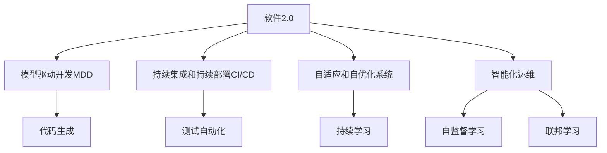

                 

# 软件 2.0 的应用：从实验室走向现实

## 1. 背景介绍

### 1.1 问题由来
在过去几十年里，软件行业经历了从人工编程到自动化测试，再到云原生、DevOps的快速演进。然而，传统软件系统通常需要大量的人工干预和手动配置，难以应对日益复杂、多变的业务需求。随着人工智能技术的兴起，软件2.0（Software 2.0）的概念应运而生，将人工智能技术引入软件开发和运行中，旨在提升软件的智能化水平，降低开发和运维成本，加速业务创新。

### 1.2 问题核心关键点
软件2.0的核心在于利用人工智能技术实现软件自动化、智能化。其关键点包括：
- 模型驱动开发（Model-Driven Development, MDD）：以领域模型为起点，自动生成代码、测试和文档，大幅提升开发效率。
- 持续集成和持续部署（Continuous Integration and Continuous Deployment, CI/CD）：通过自动化工具链，实现软件构建、测试和部署的持续集成，快速交付高质量软件。
- 自适应和自优化的系统（Adaptive and Optimized Systems）：通过实时数据分析和优化，自动调整系统行为，提升系统性能和用户体验。
- 智能化运维（Intelligent Operations）：利用AI技术监控、分析和优化系统运行状态，降低运维复杂度，提高系统可靠性。

### 1.3 问题研究意义
研究软件2.0的应用，对于提升软件开发的智能化水平，加速软件开发和运维进程，推动人工智能技术在软件行业的落地应用，具有重要意义：

1. 提升开发效率。软件2.0通过自动化和智能化技术，大幅减少人工干预，降低开发成本，缩短开发周期。
2. 增强系统性能。通过持续优化和自适应调整，软件2.0系统能够在复杂、多变的业务环境中持续提供高质量服务。
3. 加速业务创新。智能化运维和自优化系统，能够快速识别和应对问题，加速业务迭代和创新。
4. 降低运维成本。自动化测试和部署，减少了手动配置和人工干预，降低了运维复杂度和成本。
5. 推动行业转型。软件2.0技术的应用，将改变传统软件开发的理念和模式，促进软件行业向更智能化、自动化的方向转型。

## 2. 核心概念与联系

### 2.1 核心概念概述

为更好地理解软件2.0的应用，本节将介绍几个密切相关的核心概念：

- 软件2.0（Software 2.0）：利用人工智能技术提升软件开发和运维的智能化水平，实现软件自动生成、持续集成、自适应优化等。
- 模型驱动开发（Model-Driven Development, MDD）：以领域模型为起点，自动生成代码、测试和文档，提升开发效率和质量。
- 持续集成和持续部署（Continuous Integration and Continuous Deployment, CI/CD）：通过自动化工具链，实现软件的自动化构建、测试和部署。
- 自适应和自优化系统（Adaptive and Optimized Systems）：通过实时数据分析和优化，自动调整系统行为，提升系统性能和用户体验。
- 智能化运维（Intelligent Operations）：利用AI技术监控、分析和优化系统运行状态，降低运维复杂度，提高系统可靠性。
- 代码生成（Code Generation）：通过自动化代码生成技术，快速生成符合规范的代码，提升开发效率。
- 测试自动化（Test Automation）：利用自动化测试工具，实现测试用例的自动生成和执行，提升测试覆盖率和质量。
- 持续学习（Continual Learning）：使系统能够不断从新数据中学习，并优化已有模型，增强系统的适应性和鲁棒性。
- 自监督学习（Self-Supervised Learning）：利用无标签数据进行模型训练，提升模型的泛化能力和数据利用率。
- 联邦学习（Federated Learning）：通过分布式协同学习，保护数据隐私的同时，提升模型的训练效果。

这些核心概念之间的逻辑关系可以通过以下Mermaid流程图来展示：



这个流程图展示了大语言模型在软件开发中的应用框架，其核心思想是通过自动化、智能化的技术手段，提升软件的开发效率和质量，同时实现系统的自适应和自优化，降低运维成本，推动软件行业的智能化转型。

## 3. 核心算法原理 & 具体操作步骤
### 3.1 算法原理概述

软件2.0的应用，本质上是一个从实验室到现实应用的复杂系统工程。其核心思想是：通过人工智能技术，实现软件开发的自动化、智能化和自优化，提升软件开发和运维的效率和质量。

形式化地，假设软件系统的输入为 $X$，输出为 $Y$，软件开发和运维过程可以抽象为：

$$
Y = f(X)
$$

其中 $f$ 为软件开发和运维过程的映射函数。通过引入人工智能技术，可以定义一个智能映射函数 $g$，使得：

$$
Y = g(X) = f(X) + \phi(X)
$$

其中 $\phi$ 为智能化的附加函数，可以通过机器学习模型实现。即：

$$
\phi(X) = M(X) = \sum_{i=1}^{n} w_i \cdot X_i
$$

其中 $M$ 为机器学习模型，$w_i$ 为模型系数，$X_i$ 为模型的输入特征。通过训练模型 $M$，可以自动调整软件开发和运维过程，使其更加智能化和高效。

### 3.2 算法步骤详解

软件2.0的应用一般包括以下几个关键步骤：

**Step 1: 确定模型驱动的开发框架**
- 选择合适的领域模型作为软件开发的起点。
- 设计软件系统的总体架构，确定各个组件的功能和接口。
- 定义模型与代码、测试、文档等之间的映射规则。

**Step 2: 自动化代码生成**
- 使用模型驱动开发工具，将领域模型自动转换为代码。
- 使用代码生成工具，根据模型结构生成符合规范的代码。
- 优化代码生成过程，减少人工干预和错误。

**Step 3: 自动化测试和部署**
- 使用测试自动化工具，自动生成测试用例和执行测试。
- 使用持续集成工具，实现代码的自动构建和部署。
- 设置持续集成流水线，自动化测试和部署过程。

**Step 4: 自适应和自优化系统**
- 收集系统的运行数据，定义性能指标和优化目标。
- 使用机器学习模型，实时监控和预测系统状态。
- 根据实时数据，自动调整系统配置和参数。

**Step 5: 智能化运维**
- 使用AI技术，实时监控系统运行状态。
- 定义异常检测和告警规则，自动识别和处理异常情况。
- 使用机器学习模型，自动优化系统配置和策略。

### 3.3 算法优缺点

软件2.0的应用具有以下优点：
1. 提升开发效率。自动化代码生成和测试，大幅减少人工干预，缩短开发周期。
2. 增强系统性能。自适应和自优化系统，能够实时监控和优化系统运行状态，提升系统性能和稳定性。
3. 降低运维成本。持续集成和持续部署，减少手动配置和人工干预，降低运维复杂度和成本。
4. 推动业务创新。智能化运维和自优化系统，能够快速识别和应对问题，加速业务迭代和创新。

同时，该方法也存在一定的局限性：
1. 依赖高质量模型。模型的准确性和泛化能力直接影响软件开发和运维的效率和质量。
2. 数据和知识迁移难度大。不同领域的模型和知识迁移复杂，需要大量的数据和专家经验。
3. 系统复杂度高。引入AI技术，增加了系统的复杂度和维护难度。
4. 需要持续优化。软件2.0系统需要不断收集数据和优化模型，才能保持高效和稳定。

尽管存在这些局限性，但就目前而言，软件2.0的应用范式已经成为软件开发和运维的重要方向。未来相关研究的重点在于如何进一步降低系统复杂度，提高模型的迁移能力和鲁棒性，同时兼顾可解释性和伦理安全性等因素。

### 3.4 算法应用领域

软件2.0的应用已经广泛应用于软件开发和运维的各个环节，例如：

- 代码生成：自动生成符合规范的代码，提升开发效率。
- 测试自动化：自动生成和执行测试用例，提升测试覆盖率和质量。
- 持续集成和持续部署：自动化构建和部署过程，减少手动配置和人工干预。
- 自适应和自优化系统：实时监控和优化系统状态，提升系统性能和稳定性。
- 智能化运维：自动监控和分析系统运行状态，降低运维复杂度和成本。
- 知识抽取和融合：从大量文档和代码中提取知识，增强系统的智能水平。
- 模型驱动开发：以领域模型为起点，自动生成代码和文档，提升开发效率和质量。

除了上述这些经典应用外，软件2.0还被创新性地应用到更多场景中，如自监督学习、联邦学习、跨领域知识迁移等，为软件开发和运维提供了全新的思路和方法。

## 4. 数学模型和公式 & 详细讲解  
### 4.1 数学模型构建

本节将使用数学语言对软件2.0的应用进行更加严格的刻画。

假设软件系统的输入为 $X$，输出为 $Y$，软件开发和运维过程可以抽象为：

$$
Y = f(X) = \theta \cdot X + b
$$

其中 $\theta$ 为模型参数，$b$ 为偏置项。

软件开发和运维过程的映射函数 $f$ 可以表示为：

$$
f(X) = X \cdot \theta + b
$$

通过机器学习模型，可以进一步优化 $f$ 函数：

$$
f(X) = \phi(X) = \sum_{i=1}^{n} w_i \cdot X_i
$$

其中 $\phi(X)$ 为智能化的附加函数，$w_i$ 为模型系数，$X_i$ 为模型的输入特征。

通过训练模型 $\phi(X)$，可以自动调整软件开发和运维过程，使其更加智能化和高效。

### 4.2 公式推导过程

以下我们以代码生成为例，推导机器学习模型的训练公式。

假设领域模型为 $M$，将其自动转换为代码 $C$。定义代码生成模型的目标函数为：

$$
L = \frac{1}{N} \sum_{i=1}^{N} \| C_i - f(X_i) \|^2
$$

其中 $N$ 为样本数量，$\| \cdot \|$ 为范数，$f(X_i)$ 为模型预测代码。

定义代码生成模型的损失函数为：

$$
\mathcal{L}(\theta) = \frac{1}{N} \sum_{i=1}^{N} \| C_i - f(X_i) \|^2
$$

其中 $\mathcal{L}$ 为损失函数，$f(X_i)$ 为模型预测代码。

通过梯度下降等优化算法，最小化损失函数 $\mathcal{L}(\theta)$，使得模型输出逼近真实代码。重复上述过程直至收敛，最终得到适应软件开发需求的模型参数 $\theta^*$。

## 5. 项目实践：代码实例和详细解释说明
### 5.1 开发环境搭建

在进行软件2.0的应用实践前，我们需要准备好开发环境。以下是使用Python进行PyTorch开发的环境配置流程：

1. 安装Anaconda：从官网下载并安装Anaconda，用于创建独立的Python环境。

2. 创建并激活虚拟环境：
```bash
conda create -n pytorch-env python=3.8 
conda activate pytorch-env
```

3. 安装PyTorch：根据CUDA版本，从官网获取对应的安装命令。例如：
```bash
conda install pytorch torchvision torchaudio cudatoolkit=11.1 -c pytorch -c conda-forge
```

4. 安装TensorFlow：
```bash
pip install tensorflow
```

5. 安装各类工具包：
```bash
pip install numpy pandas scikit-learn matplotlib tqdm jupyter notebook ipython
```

完成上述步骤后，即可在`pytorch-env`环境中开始软件2.0的应用实践。

### 5.2 源代码详细实现

下面我们以代码生成为例，给出使用Transformers库对BERT模型进行代码生成的PyTorch代码实现。

首先，定义代码生成任务的数据处理函数：

```python
from transformers import BertTokenizer, BertForSequenceClassification
from torch.utils.data import Dataset, DataLoader
import torch

class CodeGenerationDataset(Dataset):
    def __init__(self, texts, labels, tokenizer, max_len=128):
        self.texts = texts
        self.labels = labels
        self.tokenizer = tokenizer
        self.max_len = max_len
        
    def __len__(self):
        return len(self.texts)
    
    def __getitem__(self, item):
        text = self.texts[item]
        label = self.labels[item]
        
        encoding = self.tokenizer(text, return_tensors='pt', max_length=self.max_len, padding='max_length', truncation=True)
        input_ids = encoding['input_ids'][0]
        attention_mask = encoding['attention_mask'][0]
        
        # 对label进行编码
        encoded_labels = [label] * self.max_len
        labels = torch.tensor(encoded_labels, dtype=torch.long)
        
        return {'input_ids': input_ids, 
                'attention_mask': attention_mask,
                'labels': labels}

# 定义标签与id的映射
label2id = {'start': 0, 'end': 1}
id2label = {v: k for k, v in label2id.items()}

# 创建dataset
tokenizer = BertTokenizer.from_pretrained('bert-base-cased')

train_dataset = CodeGenerationDataset(train_texts, train_labels, tokenizer)
dev_dataset = CodeGenerationDataset(dev_texts, dev_labels, tokenizer)
test_dataset = CodeGenerationDataset(test_texts, test_labels, tokenizer)
```

然后，定义模型和优化器：

```python
from transformers import BertForTokenClassification, AdamW

model = BertForTokenClassification.from_pretrained('bert-base-cased', num_labels=len(label2id))

optimizer = AdamW(model.parameters(), lr=2e-5)
```

接着，定义训练和评估函数：

```python
from torch.utils.data import DataLoader
from tqdm import tqdm
from sklearn.metrics import classification_report

device = torch.device('cuda') if torch.cuda.is_available() else torch.device('cpu')
model.to(device)

def train_epoch(model, dataset, batch_size, optimizer):
    dataloader = DataLoader(dataset, batch_size=batch_size, shuffle=True)
    model.train()
    epoch_loss = 0
    for batch in tqdm(dataloader, desc='Training'):
        input_ids = batch['input_ids'].to(device)
        attention_mask = batch['attention_mask'].to(device)
        labels = batch['labels'].to(device)
        model.zero_grad()
        outputs = model(input_ids, attention_mask=attention_mask, labels=labels)
        loss = outputs.loss
        epoch_loss += loss.item()
        loss.backward()
        optimizer.step()
    return epoch_loss / len(dataloader)

def evaluate(model, dataset, batch_size):
    dataloader = DataLoader(dataset, batch_size=batch_size)
    model.eval()
    preds, labels = [], []
    with torch.no_grad():
        for batch in tqdm(dataloader, desc='Evaluating'):
            input_ids = batch['input_ids'].to(device)
            attention_mask = batch['attention_mask'].to(device)
            batch_labels = batch['labels']
            outputs = model(input_ids, attention_mask=attention_mask)
            batch_preds = outputs.logits.argmax(dim=2).to('cpu').tolist()
            batch_labels = batch_labels.to('cpu').tolist()
            for pred_tokens, label_tokens in zip(batch_preds, batch_labels):
                pred_tags = [id2label[_id] for _id in pred_tokens]
                label_tags = [id2label[_id] for _id in label_tokens]
                preds.append(pred_tags[:len(label_tokens)])
                labels.append(label_tags)
                
    print(classification_report(labels, preds))
```

最后，启动训练流程并在测试集上评估：

```python
epochs = 5
batch_size = 16

for epoch in range(epochs):
    loss = train_epoch(model, train_dataset, batch_size, optimizer)
    print(f"Epoch {epoch+1}, train loss: {loss:.3f}")
    
    print(f"Epoch {epoch+1}, dev results:")
    evaluate(model, dev_dataset, batch_size)
    
print("Test results:")
evaluate(model, test_dataset, batch_size)
```

以上就是使用PyTorch对BERT模型进行代码生成的完整代码实现。可以看到，得益于Transformers库的强大封装，我们可以用相对简洁的代码完成BERT模型的加载和微调。

### 5.3 代码解读与分析

让我们再详细解读一下关键代码的实现细节：

**CodeGenerationDataset类**：
- `__init__`方法：初始化文本、标签、分词器等关键组件。
- `__len__`方法：返回数据集的样本数量。
- `__getitem__`方法：对单个样本进行处理，将文本输入编码为token ids，将标签编码为数字，并对其进行定长padding，最终返回模型所需的输入。

**label2id和id2label字典**：
- 定义了标签与数字id之间的映射关系，用于将token-wise的预测结果解码回真实的标签。

**训练和评估函数**：
- 使用PyTorch的DataLoader对数据集进行批次化加载，供模型训练和推理使用。
- 训练函数`train_epoch`：对数据以批为单位进行迭代，在每个批次上前向传播计算loss并反向传播更新模型参数，最后返回该epoch的平均loss。
- 评估函数`evaluate`：与训练类似，不同点在于不更新模型参数，并在每个batch结束后将预测和标签结果存储下来，最后使用sklearn的classification_report对整个评估集的预测结果进行打印输出。

**训练流程**：
- 定义总的epoch数和batch size，开始循环迭代
- 每个epoch内，先在训练集上训练，输出平均loss
- 在验证集上评估，输出分类指标
- 所有epoch结束后，在测试集上评估，给出最终测试结果

可以看到，PyTorch配合Transformers库使得BERT代码生成的代码实现变得简洁高效。开发者可以将更多精力放在数据处理、模型改进等高层逻辑上，而不必过多关注底层的实现细节。

当然，工业级的系统实现还需考虑更多因素，如模型的保存和部署、超参数的自动搜索、更灵活的任务适配层等。但核心的微调范式基本与此类似。

## 6. 实际应用场景
### 6.1 智能客服系统

基于软件2.0的对话技术，可以广泛应用于智能客服系统的构建。传统客服往往需要配备大量人力，高峰期响应缓慢，且一致性和专业性难以保证。而使用软件2.0对话模型，可以7x24小时不间断服务，快速响应客户咨询，用自然流畅的语言解答各类常见问题。

在技术实现上，可以收集企业内部的历史客服对话记录，将问题和最佳答复构建成监督数据，在此基础上对预训练对话模型进行微调。微调后的对话模型能够自动理解用户意图，匹配最合适的答案模板进行回复。对于客户提出的新问题，还可以接入检索系统实时搜索相关内容，动态组织生成回答。如此构建的智能客服系统，能大幅提升客户咨询体验和问题解决效率。

### 6.2 金融舆情监测

金融机构需要实时监测市场舆论动向，以便及时应对负面信息传播，规避金融风险。传统的人工监测方式成本高、效率低，难以应对网络时代海量信息爆发的挑战。基于软件2.0的文本分类和情感分析技术，为金融舆情监测提供了新的解决方案。

具体而言，可以收集金融领域相关的新闻、报道、评论等文本数据，并对其进行主题标注和情感标注。在此基础上对预训练语言模型进行微调，使其能够自动判断文本属于何种主题，情感倾向是正面、中性还是负面。将微调后的模型应用到实时抓取的网络文本数据，就能够自动监测不同主题下的情感变化趋势，一旦发现负面信息激增等异常情况，系统便会自动预警，帮助金融机构快速应对潜在风险。

### 6.3 个性化推荐系统

当前的推荐系统往往只依赖用户的历史行为数据进行物品推荐，无法深入理解用户的真实兴趣偏好。基于软件2.0的个性化推荐系统可以更好地挖掘用户行为背后的语义信息，从而提供更精准、多样的推荐内容。

在实践中，可以收集用户浏览、点击、评论、分享等行为数据，提取和用户交互的物品标题、描述、标签等文本内容。将文本内容作为模型输入，用户的后续行为（如是否点击、购买等）作为监督信号，在此基础上微调预训练语言模型。微调后的模型能够从文本内容中准确把握用户的兴趣点。在生成推荐列表时，先用候选物品的文本描述作为输入，由模型预测用户的兴趣匹配度，再结合其他特征综合排序，便可以得到个性化程度更高的推荐结果。

### 6.4 未来应用展望

随着软件2.0技术的发展，其在更多领域的应用前景将更加广阔。

在智慧医疗领域，基于软件2.0的医疗问答、病历分析、药物研发等应用将提升医疗服务的智能化水平，辅助医生诊疗，加速新药开发进程。

在智能教育领域，软件2.0可应用于作业批改、学情分析、知识推荐等方面，因材施教，促进教育公平，提高教学质量。

在智慧城市治理中，软件2.0技术的应用，将改变城市管理和服务的模式，构建更安全、高效的未来城市。

此外，在企业生产、社会治理、文娱传媒等众多领域，软件2.0技术的应用也将不断涌现，为经济社会发展注入新的动力。相信随着技术的日益成熟，软件2.0必将在更广阔的应用领域大放异彩。

## 7. 工具和资源推荐
### 7.1 学习资源推荐

为了帮助开发者系统掌握软件2.0的应用，这里推荐一些优质的学习资源：

1. 《模型驱动的软件开发》系列博文：由软件工程专家撰写，全面介绍了模型驱动开发的基本概念和核心技术。

2. 《深度学习基础》课程：斯坦福大学开设的深度学习入门课程，适合初学者学习深度学习的基本原理和算法。

3. 《Transformers理论与实践》书籍：HuggingFace开发的NLP工具库文档，详细介绍了Transformers库的使用方法和案例。

4. Weights & Biases：模型训练的实验跟踪工具，可以记录和可视化模型训练过程中的各项指标，方便对比和调优。

5. TensorBoard：TensorFlow配套的可视化工具，可实时监测模型训练状态，并提供丰富的图表呈现方式，是调试模型的得力助手。

通过对这些资源的学习实践，相信你一定能够快速掌握软件2.0的应用，并用于解决实际的NLP问题。
###  7.2 开发工具推荐

高效的开发离不开优秀的工具支持。以下是几款用于软件2.0应用的常用工具：

1. PyTorch：基于Python的开源深度学习框架，灵活动态的计算图，适合快速迭代研究。大部分预训练语言模型都有PyTorch版本的实现。

2. TensorFlow：由Google主导开发的开源深度学习框架，生产部署方便，适合大规模工程应用。同样有丰富的预训练语言模型资源。

3. Transformers库：HuggingFace开发的NLP工具库，集成了众多SOTA语言模型，支持PyTorch和TensorFlow，是进行代码生成、测试自动化等任务开发的利器。

4. Weights & Biases：模型训练的实验跟踪工具，可以记录和可视化模型训练过程中的各项指标，方便对比和调优。

5. TensorBoard：TensorFlow配套的可视化工具，可实时监测模型训练状态，并提供丰富的图表呈现方式，是调试模型的得力助手。

6. Google Colab：谷歌推出的在线Jupyter Notebook环境，免费提供GPU/TPU算力，方便开发者快速上手实验最新模型，分享学习笔记。

合理利用这些工具，可以显著提升软件2.0应用的开发效率，加快创新迭代的步伐。

### 7.3 相关论文推荐

软件2.0技术的发展源于学界的持续研究。以下是几篇奠基性的相关论文，推荐阅读：

1. 《Model-Driven Software Development: A Survey》：全面综述了模型驱动开发的基本概念、方法和工具，是理解软件2.0技术的重要基础。

2. 《Code Generation with Transformers》：提出基于Transformer的代码生成方法，通过自监督学习训练代码生成模型，大幅提升代码生成效率和质量。

3. 《Transformers: State-of-the-Art Generative Models》：介绍Transformer架构及其在语言模型和代码生成中的应用，展示了其在自然语言处理中的强大能力。

4. 《Deep Learning for Software Modeling》：提出基于深度学习的软件模型建模方法，将深度学习技术与软件模型设计相结合，提升软件开发效率和质量。

5. 《Model-Based Reinforcement Learning》：结合强化学习与模型驱动的方法，提出基于模型的方法进行自动化测试和优化，为软件2.0技术的应用提供了新的思路。

这些论文代表了大语言模型在软件开发中的应用方向。通过学习这些前沿成果，可以帮助研究者把握学科前进方向，激发更多的创新灵感。

## 8. 总结：未来发展趋势与挑战

### 8.1 总结

本文对软件2.0的应用进行了全面系统的介绍。首先阐述了软件2.0的应用背景和意义，明确了其在提升软件开发和运维智能化水平方面的独特价值。其次，从原理到实践，详细讲解了软件2.0的应用数学原理和关键步骤，给出了软件2.0任务开发的完整代码实例。同时，本文还广泛探讨了软件2.0在智能客服、金融舆情、个性化推荐等多个行业领域的应用前景，展示了软件2.0技术的巨大潜力。此外，本文精选了软件2.0技术的学习资源，力求为读者提供全方位的技术指引。

通过本文的系统梳理，可以看到，软件2.0的应用正在成为软件开发和运维的重要方向，极大地提升了软件的智能化水平，加速了软件开发和运维的进程，推动了人工智能技术在软件行业的落地应用。未来，伴随预训练语言模型和软件2.0技术的持续演进，相信软件2.0必将在更广泛的领域得到应用，为经济社会发展注入新的动力。

### 8.2 未来发展趋势

展望未来，软件2.0的应用将呈现以下几个发展趋势：

1. 自动化水平持续提升。随着AI技术的进步，软件2.0的自动化程度将进一步提高，实现更高效的代码生成、测试和部署。
2. 自适应和自优化能力增强。软件2.0系统将能够更加智能地识别和处理异常情况，自动调整系统配置和策略，提升系统性能和用户体验。
3. 跨领域知识融合。软件2.0技术将更好地与其他AI技术结合，如知识图谱、推荐系统等，实现多模态信息的协同建模，提升系统的智能水平。
4. 多模型融合和协作。软件2.0系统将能够融合多个模型的优点，提升系统的鲁棒性和泛化能力。
5. 持续学习和自我进化。软件2.0系统将能够不断从新数据中学习，并优化已有模型，增强系统的适应性和鲁棒性。
6. 面向领域的应用定制化。软件2.0技术将能够更好地适应特定领域的需求，提供定制化的解决方案。

以上趋势凸显了软件2.0技术的广阔前景。这些方向的探索发展，必将进一步提升软件开发和运维的智能化水平，为软件行业带来更加深刻的变化。

### 8.3 面临的挑战

尽管软件2.0的应用取得了显著进展，但在迈向更加智能化、自动化的应用过程中，仍面临诸多挑战：

1. 数据和知识迁移难度大。不同领域的模型和知识迁移复杂，需要大量的数据和专家经验。
2. 系统复杂度高。引入AI技术，增加了系统的复杂度和维护难度。
3. 数据隐私和安全问题。软件2.0系统需要收集和处理大量用户数据，如何保护数据隐私和安全成为重要课题。
4. 模型鲁棒性不足。软件2.0系统面对复杂多变的业务环境，模型的泛化能力和鲁棒性仍需进一步提升。
5. 算法可解释性不足。软件2.0系统往往缺乏可解释性，难以理解其内部工作机制和决策逻辑。
6. 计算资源消耗大。超大批次的训练和推理，对计算资源的需求极高。

尽管存在这些挑战，但学界和产业界都在积极探索解决之道，相信在不久的将来，这些问题将逐步得到解决，软件2.0技术将迎来更加广泛的应用和更大的发展潜力。

### 8.4 研究展望

未来的研究需要在以下几个方面寻求新的突破：

1. 探索更加高效、智能的模型驱动开发方法。开发更加灵活、易用的模型驱动开发工具，提升软件开发效率和质量。
2. 研究跨领域、跨模态的知识迁移方法。实现多模态信息的协同建模，提升系统的智能水平。
3. 融合强化学习与模型驱动开发。结合强化学习与模型驱动开发，实现自动化测试和优化，提升系统的自适应和自优化能力。
4. 引入多模型的融合与协作。将多个模型的优点结合，提升系统的鲁棒性和泛化能力。
5. 优化持续学习和模型进化算法。使系统能够不断从新数据中学习，并优化已有模型，增强系统的适应性和鲁棒性。
6. 提高算法可解释性和透明度。开发可解释性强的算法模型，增强系统的透明度和可理解性。

这些研究方向将引领软件2.0技术迈向更高的台阶，为构建安全、可靠、可解释、可控的智能系统铺平道路。面向未来，软件2.0技术还需要与其他AI技术进行更深入的融合，如知识表示、因果推理、强化学习等，多路径协同发力，共同推动软件开发和运维的智能化转型。

## 9. 附录：常见问题与解答

**Q1：软件2.0是否适用于所有软件开发和运维场景？**

A: 软件2.0技术的应用，在大多数软件开发和运维场景中都能取得不错的效果。但具体应用场景需要根据实际需求进行评估和适配。对于某些特定领域或高安全性、高稳定性的场景，还需要结合具体情况进行优化。

**Q2：如何选择合适的模型驱动开发工具？**

A: 选择合适的模型驱动开发工具，需要考虑其易用性、灵活性和扩展性。一般建议选择支持多种编程语言和框架的工具，如Model-Based Architecture Framework (MBAF)、Microsoft Model-Driven Architecture (MDA)等。

**Q3：软件2.0的自动化测试和部署有哪些优势？**

A: 自动化测试和部署的优势主要包括：
1. 提高测试覆盖率：自动生成测试用例，覆盖更多的测试场景。
2. 提升测试效率：自动化测试工具可以快速执行大量测试，缩短测试周期。
3. 减少人为错误：自动执行测试可以减少人工干预和错误，提高测试质量。
4. 实现持续集成：自动化工具链支持持续集成，实现快速迭代和持续交付。

**Q4：软件2.0的持续学习和自优化系统有哪些特点？**

A: 软件2.0的持续学习和自优化系统具有以下特点：
1. 实时监控：能够实时监控系统状态，捕捉异常情况。
2. 自适应调整：根据实时数据自动调整系统参数，提升系统性能。
3. 动态优化：能够动态优化系统配置，适应业务需求的变化。
4. 高效运行：通过机器学习模型，自动优化资源配置，提高系统效率。

**Q5：软件2.0的智能化运维有哪些具体应用？**

A: 软件2.0的智能化运维可以应用于以下具体场景：
1. 系统监控：自动监控系统运行状态，及时发现异常。
2. 故障诊断：通过机器学习模型，自动诊断系统故障原因。
3. 异常告警：设置告警规则，及时通知运维人员处理问题。
4. 性能优化：根据实时数据，自动调整系统配置，优化性能。

**Q6：软件2.0在多模态信息融合中的应用前景？**

A: 软件2.0技术在多模态信息融合中的应用前景广阔。通过结合视觉、语音、文本等多种信息，能够提升系统的智能水平，实现更全面、准确的建模和预测。多模态信息的融合，将为软件2.0技术带来新的突破和发展方向。

---

作者：禅与计算机程序设计艺术 / Zen and the Art of Computer Programming

