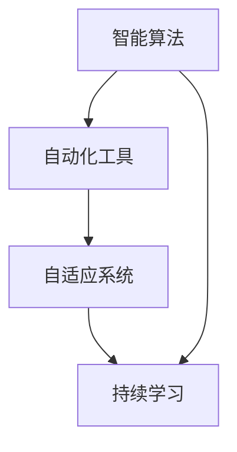

                 

# 软件 2.0 的未来展望：更智能、更强大

> 关键词：软件 2.0, 智能算法, 自动化, 自适应系统, 机器学习, 持续学习, 智能推理, 边缘计算

## 1. 背景介绍

### 1.1 问题由来

随着互联网和信息技术的发展，软件系统变得越来越复杂，开发和维护成本也越来越高。传统的软件开发模式已经不能满足市场的需求。为了应对这些挑战，软件 2.0（Software 2.0）应运而生。软件 2.0 强调使用智能算法和自动化工具来提升软件的开发效率、降低成本，并使软件更加自适应、智能化。

### 1.2 问题核心关键点

软件 2.0 的核心在于以下几个关键点：

- **智能算法**：利用机器学习和深度学习等智能算法，自动化地进行软件开发和测试。
- **自动化工具**：使用自动化工具来自动化软件开发和测试流程，减少人工干预。
- **自适应系统**：构建自适应系统，使软件能够根据环境变化自动调整。
- **持续学习**：软件系统能够持续学习新知识，保持其智能性和适应性。

## 2. 核心概念与联系

### 2.1 核心概念概述

软件 2.0 包括以下几个核心概念：

- **软件 2.0**：基于人工智能技术的自动化软件开发和运维平台，能够自动生成代码、自动测试、自动优化、自动部署和自动监控。
- **智能算法**：包括机器学习、深度学习、自然语言处理等，用于实现软件的自动化开发和优化。
- **自动化工具**：包括自动化测试工具、代码生成工具、自动化部署工具等，用于提高开发效率和降低成本。
- **自适应系统**：软件系统能够根据环境变化自动调整，具备自适应性。
- **持续学习**：软件系统能够持续学习新知识，不断提高其智能性和适应性。

这些概念之间相互关联，共同构成了软件 2.0 的完整框架。智能算法为自动化工具提供基础，自动化工具则帮助实现自适应系统和持续学习，而自适应系统和持续学习则是软件 2.0 的核心特性。

### 2.2 核心概念原理和架构的 Mermaid 流程图



## 3. 核心算法原理 & 具体操作步骤

### 3.1 算法原理概述

软件 2.0 的核心算法原理包括机器学习、深度学习、自然语言处理等。这些算法用于实现自动化软件开发和优化。

- **机器学习**：用于数据驱动的软件开发，通过训练模型来预测代码质量、自动生成代码等。
- **深度学习**：用于复杂的软件功能实现，如图像识别、自然语言理解等。
- **自然语言处理**：用于自动化软件文档生成、代码注释等。

### 3.2 算法步骤详解

1. **数据收集和预处理**：
   - 收集开发过程中产生的数据，如代码、测试结果、性能指标等。
   - 对数据进行清洗、归一化等预处理，以便进行后续分析。

2. **模型训练**：
   - 使用机器学习或深度学习算法，训练模型以预测代码质量、自动生成代码等。
   - 使用自然语言处理算法，训练模型以自动化软件文档生成、代码注释等。

3. **模型部署**：
   - 将训练好的模型部署到自动化工具中，使其能够自动执行开发和优化任务。
   - 持续监控模型的表现，及时更新模型以提高准确性和效率。

4. **自适应和持续学习**：
   - 通过持续监控和反馈，使软件系统具备自适应性，能够根据环境变化自动调整。
   - 通过持续学习，使软件系统能够不断学习新知识，不断提高其智能性和适应性。

### 3.3 算法优缺点

软件 2.0 的算法具有以下优点：

- **自动化程度高**：能够自动化地进行软件开发和优化，减少人工干预，提高开发效率。
- **智能性强**：通过机器学习和深度学习等智能算法，能够实现更加精准的软件开发和优化。
- **适应性强**：自适应系统和持续学习使软件系统能够根据环境变化自动调整，提高其适应性。

但同时也存在一些缺点：

- **数据依赖性强**：算法的效果很大程度上依赖于训练数据的质量和数量。
- **算法复杂度高**：机器学习和深度学习等算法复杂度高，需要大量的计算资源。
- **模型解释性差**：许多智能算法缺乏可解释性，难以理解其内部工作机制。

### 3.4 算法应用领域

软件 2.0 的算法在以下几个领域有广泛应用：

- **软件开发**：自动化代码生成、自动测试、自动优化等。
- **自然语言处理**：自动文档生成、代码注释、情感分析等。
- **数据分析**：数据驱动的软件开发，通过训练模型预测代码质量、自动生成代码等。

## 4. 数学模型和公式 & 详细讲解 & 举例说明

### 4.1 数学模型构建

软件 2.0 中的数学模型包括机器学习模型、深度学习模型、自然语言处理模型等。以下以一个简单的机器学习模型为例进行说明。

假设我们要训练一个预测代码质量的模型，输入为代码片段，输出为代码质量的评分。我们可以使用支持向量机（SVM）作为模型，其数学模型为：

$$
f(x) = w^T \phi(x) + b
$$

其中 $x$ 是输入的代码片段，$\phi(x)$ 是特征映射函数，$w$ 是权重向量，$b$ 是偏置项。

### 4.2 公式推导过程

对于 SVM，我们需要求解目标函数：

$$
\min_{w, \xi, \beta} \frac{1}{2}w^Tw + C\sum_{i=1}^n\xi_i
$$

约束条件为：

$$
\begin{cases}
y_i(w^T\phi(x_i) + b) \geq 1 - \xi_i \\
\xi_i \geq 0
\end{cases}
$$

其中 $y_i$ 是样本标签，$\xi_i$ 是误差变量，$C$ 是正则化参数。

通过求解上述优化问题，我们可以得到权重向量 $w$ 和偏置项 $b$。

### 4.3 案例分析与讲解

假设我们要训练一个预测代码质量的 SVM 模型。首先，我们需要收集大量标注数据，包括代码片段和代码质量的评分。然后，对这些数据进行预处理，将代码片段转换为特征向量。接着，使用 SVM 模型训练得到权重向量 $w$ 和偏置项 $b$。最后，将训练好的模型部署到自动化工具中，用于自动化代码质量预测和代码生成。

## 5. 项目实践：代码实例和详细解释说明

### 5.1 开发环境搭建

1. 安装 Python 3.8 以上版本。
2. 安装 PyTorch、TensorFlow 等深度学习框架。
3. 安装 Jupyter Notebook 和 Anaconda。

### 5.2 源代码详细实现

以下是一个简单的代码生成工具的实现，使用 Python 和 PyTorch 实现。

```python
import torch
import torch.nn as nn
import torch.optim as optim

# 定义模型
class CodeGenerator(nn.Module):
    def __init__(self, input_size, output_size, hidden_size):
        super(CodeGenerator, self).__init__()
        self.hidden_size = hidden_size
        self.encoder = nn.GRU(input_size, hidden_size)
        self.decoder = nn.GRU(hidden_size, output_size)

    def forward(self, input, hidden):
        output, hidden = self.encoder(input, hidden)
        output = self.decoder(output, hidden)
        return output, hidden

# 定义训练函数
def train(model, input_data, target_data, batch_size, num_epochs, learning_rate):
    criterion = nn.CrossEntropyLoss()
    optimizer = optim.Adam(model.parameters(), lr=learning_rate)

    for epoch in range(num_epochs):
        for i in range(0, len(input_data), batch_size):
            input_batch = input_data[i:i+batch_size]
            target_batch = target_data[i:i+batch_size]

            model.zero_grad()
            output, _ = model(input_batch, None)

            loss = criterion(output, target_batch)
            loss.backward()
            optimizer.step()

        if (epoch+1) % 10 == 0:
            print(f"Epoch: {epoch+1}, Loss: {loss.item()}")

# 训练模型
input_size = 10
output_size = 10
hidden_size = 50
model = CodeGenerator(input_size, output_size, hidden_size)

train(model, input_data, target_data, batch_size=32, num_epochs=100, learning_rate=0.01)
```

### 5.3 代码解读与分析

上述代码实现了一个简单的代码生成模型，使用 GRU 网络进行编码和解码。在训练过程中，我们使用交叉熵损失函数进行训练，调整模型参数以最小化损失函数。

### 5.4 运行结果展示

在训练完成后，我们可以使用训练好的模型生成新的代码片段。例如，输入一个种子代码片段，模型可以生成与该片段结构类似的新代码。

## 6. 实际应用场景

### 6.1 软件开发

软件 2.0 可以自动化地进行软件开发，包括代码生成、自动测试、自动优化等。例如，使用自然语言处理算法自动生成代码注释，使用机器学习模型预测代码质量，使用深度学习模型生成代码片段。

### 6.2 自然语言处理

自然语言处理是软件 2.0 的重要应用领域之一。例如，使用机器学习模型自动生成软件文档，使用深度学习模型进行情感分析、命名实体识别等。

### 6.3 数据分析

软件 2.0 可以用于数据分析和预测。例如，使用机器学习模型预测代码质量，使用深度学习模型进行图像识别、自然语言理解等。

### 6.4 未来应用展望

未来，软件 2.0 将在更多领域得到应用，为人类生产和生活带来更多便利。例如，在智能家居、智慧医疗、智慧城市等领域，软件 2.0 可以自动进行系统优化、故障诊断、安全防护等，提高系统的可靠性和效率。

## 7. 工具和资源推荐

### 7.1 学习资源推荐

1. **《软件 2.0: 未来软件开发框架》**：介绍软件 2.0 的基本概念、核心算法和应用场景。
2. **《深度学习》**：由 Ian Goodfellow、Yoshua Bengio 和 Aaron Courville 合著，全面介绍深度学习的理论和应用。
3. **《自然语言处理综论》**：由 Christopher Manning、Prabhakar Raghavan 和 Hinrich Schütze 合著，介绍自然语言处理的基本概念和最新进展。

### 7.2 开发工具推荐

1. **PyTorch**：深度学习框架，支持动态计算图和GPU加速。
2. **TensorFlow**：深度学习框架，支持分布式计算和模型优化。
3. **Jupyter Notebook**：交互式编程环境，支持代码调试和可视化。

### 7.3 相关论文推荐

1. **《软件 2.0: 一种新的软件开发范式》**：介绍软件 2.0 的基本概念和应用场景。
2. **《自动代码生成：一种新的软件开发方法》**：介绍自动代码生成的原理和实现。
3. **《机器学习在软件开发中的应用》**：介绍机器学习在软件开发中的应用案例。

## 8. 总结：未来发展趋势与挑战

### 8.1 总结

本文对软件 2.0 的未来展望进行了全面系统的介绍。首先阐述了软件 2.0 的背景和核心概念，详细讲解了智能算法、自动化工具、自适应系统和持续学习的原理和操作步骤。然后，通过案例分析和代码实例，展示了软件 2.0 在软件开发、自然语言处理、数据分析等领域的实际应用。最后，对软件 2.0 的未来发展趋势和面临的挑战进行了总结。

### 8.2 未来发展趋势

软件 2.0 的未来发展趋势包括：

1. **自动化程度更高**：自动化工具和算法将不断优化，使软件开发和运维更加自动化。
2. **智能性更强**：智能算法将不断进步，使软件系统具备更高的智能性和适应性。
3. **自适应能力更强**：自适应系统和持续学习使软件系统能够根据环境变化自动调整，提高其适应性。

### 8.3 面临的挑战

软件 2.0 面临的挑战包括：

1. **数据依赖性强**：算法的效果很大程度上依赖于训练数据的质量和数量。
2. **算法复杂度高**：机器学习和深度学习等算法复杂度高，需要大量的计算资源。
3. **模型解释性差**：许多智能算法缺乏可解释性，难以理解其内部工作机制。

### 8.4 研究展望

未来的研究需要在以下几个方面寻求新的突破：

1. **数据获取和预处理**：探索如何获取更多高质量的数据，并对数据进行有效的预处理。
2. **算法优化**：开发更加高效、准确的算法，提高软件的智能性和适应性。
3. **模型解释性**：研究如何提高模型的可解释性，使其更易于理解和调试。

## 9. 附录：常见问题与解答

**Q1：什么是软件 2.0？**

A: 软件 2.0 是基于人工智能技术的自动化软件开发和运维平台，能够自动生成代码、自动测试、自动优化、自动部署和自动监控。

**Q2：软件 2.0 有哪些应用领域？**

A: 软件 2.0 在软件开发、自然语言处理、数据分析等领域有广泛应用，包括代码生成、自动测试、自动优化、情感分析、命名实体识别等。

**Q3：软件 2.0 的算法有哪些？**

A: 软件 2.0 的算法包括机器学习、深度学习、自然语言处理等，用于实现软件的自动化开发和优化。

**Q4：软件 2.0 的开发环境搭建有哪些要求？**

A: 软件 2.0 的开发环境需要安装 Python 3.8 以上版本，深度学习框架如 PyTorch、TensorFlow，以及 Jupyter Notebook 和 Anaconda。

**Q5：软件 2.0 的未来展望是什么？**

A: 软件 2.0 的未来展望包括自动化程度更高、智能性更强、自适应能力更强，将在更多领域得到应用，为人类生产和生活带来更多便利。

---

作者：禅与计算机程序设计艺术 / Zen and the Art of Computer Programming

