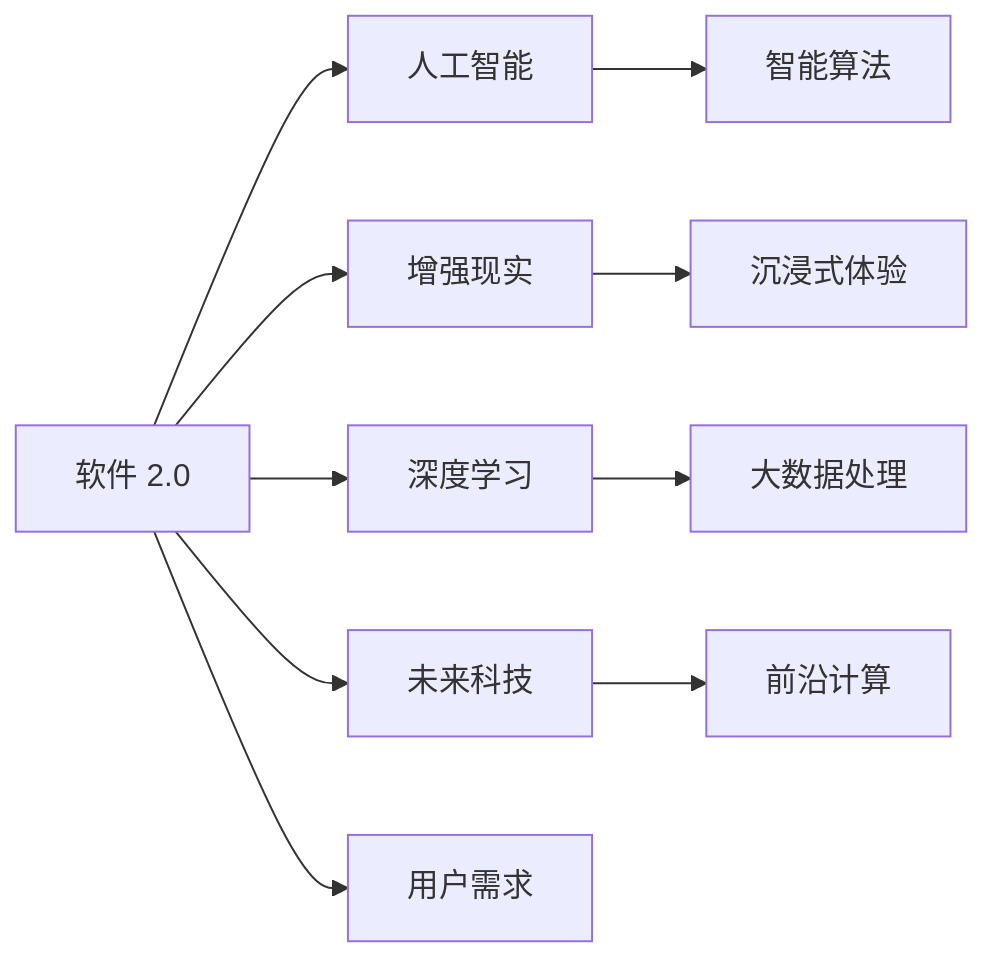

                 

# 软件 2.0 的未来展望：更智能、更强大

> 关键词：软件 2.0, 智能系统, 自动化, 增强现实, 人工智能, 深度学习, 未来科技

## 1. 背景介绍

### 1.1 问题由来

随着科技的飞速发展和社会的不断进步，软件行业正经历着前所未有的变革。从早期的代码编写到现在的软件工程，再到今天的人工智能，软件形态和应用场景发生了翻天覆地的变化。为了应对这些变化，软件 2.0 的概念被提出，它旨在将软件从传统的、基于人工编程的开发方式，转变为更加智能化、自动化和用户驱动的开发方式。软件 2.0 强调的是软件自身具备的自我适应、自我优化和自我进化的能力，从而能够更高效、更智能地服务于人类。

### 1.2 问题核心关键点

软件 2.0 的核心在于其自动化的设计、开发和部署能力，以及其利用人工智能和大数据技术对软件进行自我优化和进化的能力。它的目标是减少人工干预，提高软件的质量和效率，同时能够根据用户需求和环境变化，自适应地调整其功能。

### 1.3 问题研究意义

软件 2.0 的研究和应用对软件开发、部署、维护以及用户体验都有重要意义。它能够帮助开发者更好地理解和满足用户需求，通过自动化工具和智能算法减少错误和提高效率，同时也能为软件开发提供更多的创新点和突破口。

## 2. 核心概念与联系

### 2.1 核心概念概述

软件 2.0 涉及多个核心概念，包括但不限于：

- **软件 2.0**：强调自动化、智能化和用户驱动的软件开发方式，以减少人工干预，提高软件质量和效率。
- **人工智能**：通过机器学习、深度学习等技术，使软件具备智能化的决策和执行能力。
- **增强现实**：结合现实世界和虚拟世界，提供更加沉浸式和交互式的用户体验。
- **深度学习**：利用深度神经网络处理复杂的数据，实现更加精确的预测和决策。
- **未来科技**：包括量子计算、基因编辑等前沿科技，为软件 2.0 提供强大的计算和数据处理能力。

这些概念之间相互关联，共同构成了软件 2.0 的研发和应用框架。

### 2.2 核心概念原理和架构的 Mermaid 流程图



这个流程图展示了软件 2.0 中的核心概念及其之间的关系：

- 软件 2.0 通过整合人工智能、增强现实、深度学习和未来科技，构建出智能化的开发和运行环境。
- 人工智能为软件 2.0 提供智能化的决策和执行能力。
- 增强现实技术提升了用户体验的沉浸感和交互性。
- 深度学习使软件具备处理复杂数据的能力。
- 未来科技为软件 2.0 提供强大的计算和数据处理能力。
- 用户需求驱动着软件 2.0 的开发和优化。

## 3. 核心算法原理 & 具体操作步骤

### 3.1 算法原理概述

软件 2.0 的核心算法原理主要包括：

- **自动化算法**：通过机器学习和深度学习算法，实现软件的自动化开发和优化。
- **增强现实算法**：利用计算机视觉和传感器技术，将虚拟内容与现实世界融合，提升用户体验。
- **智能决策算法**：通过大数据分析和预测算法，实现软件的自适应和自优化。

这些算法共同构成了软件 2.0 的核心技术基础，使得软件能够具备自我学习和进化能力。

### 3.2 算法步骤详解

软件 2.0 的开发步骤包括：

1. **需求分析**：收集用户需求和反馈，确定软件的功能和性能要求。
2. **模型设计**：根据需求选择合适的算法模型，并设计软件架构。
3. **模型训练**：使用大数据和深度学习算法对模型进行训练，优化其性能和准确度。
4. **模型集成**：将训练好的模型集成到软件系统中，实现自动化开发和运行。
5. **用户反馈**：收集用户反馈，对软件进行迭代优化和改进。

这些步骤体现了软件 2.0 从需求分析到模型训练再到模型集成和优化的完整流程。

### 3.3 算法优缺点

软件 2.0 的算法具有以下优点：

- **高效性**：通过自动化和智能化算法，显著提高了软件开发的效率和质量。
- **适应性**：能够根据用户需求和环境变化，自适应地调整软件功能。
- **可扩展性**：能够灵活地添加新的算法模型和功能模块，提升软件的灵活性和可扩展性。

同时，也存在一些缺点：

- **依赖数据质量**：算法的效果高度依赖于数据的准确性和完整性，数据质量问题可能导致算法失效。
- **复杂度**：算法模型和计算过程复杂，需要专业的技术人员进行维护和优化。
- **安全性**：算法模型和数据处理过程中可能存在安全隐患，需要加强安全防护。

### 3.4 算法应用领域

软件 2.0 在多个领域都有广泛的应用，包括但不限于：

- **软件开发和测试**：通过自动化工具和智能算法，提升软件开发的效率和质量。
- **智能运维**：利用大数据分析和机器学习算法，实现设备的自动化运维和故障预测。
- **智能客服**：结合自然语言处理和增强现实技术，提供更加智能和个性化的客户服务。
- **智能交通**：通过智能算法和大数据处理，优化交通流量和提高交通安全。
- **智能医疗**：利用人工智能和深度学习算法，提升医疗诊断和治疗的智能化水平。

## 4. 数学模型和公式 & 详细讲解 & 举例说明

### 4.1 数学模型构建

软件 2.0 的数学模型主要包括：

- **机器学习模型**：如线性回归、决策树、随机森林等，用于数据分析和预测。
- **深度学习模型**：如卷积神经网络（CNN）、循环神经网络（RNN）、变压器（Transformer）等，用于处理复杂的数据和任务。
- **强化学习模型**：如Q-learning、策略梯度等，用于优化软件的行为和决策。

这些模型通过数学公式和算法实现其功能和性能。

### 4.2 公式推导过程

以线性回归模型为例，其公式推导过程如下：

假设有一组数据集 $(x_i, y_i), i=1,2,...,n$，其中 $x_i$ 为输入特征，$y_i$ 为输出结果。线性回归模型的目标是通过拟合一条直线，使得预测值与真实值之间的误差最小。设拟合直线的斜率为 $\theta_1$，截距为 $\theta_0$，则线性回归模型的最小二乘法公式为：

$$
\min_{\theta} \sum_{i=1}^n (y_i - \theta_0 - \theta_1x_i)^2
$$

通过求导并令导数为零，可以得到斜率 $\theta_1$ 和截距 $\theta_0$ 的解：

$$
\theta_1 = \frac{\sum_{i=1}^n (x_i - \bar{x})(y_i - \bar{y})}{\sum_{i=1}^n (x_i - \bar{x})^2}
$$

$$
\theta_0 = \bar{y} - \theta_1\bar{x}
$$

其中 $\bar{x}$ 和 $\bar{y}$ 分别为 $x_i$ 和 $y_i$ 的均值。

### 4.3 案例分析与讲解

假设有一个电商平台，需要根据用户浏览行为预测其购买概率。可以使用线性回归模型来构建预测模型，其输入特征包括用户浏览时间、点击次数、浏览深度等，输出结果为购买概率。通过收集历史数据进行模型训练和优化，可以显著提升预测的准确度和效果。

## 5. 项目实践：代码实例和详细解释说明

### 5.1 开发环境搭建

开发软件 2.0 需要使用Python和TensorFlow等工具。以下是搭建开发环境的步骤：

1. 安装Python和TensorFlow：
   ```bash
   sudo apt-get update
   sudo apt-get install python3-pip
   pip3 install tensorflow
   ```

2. 安装相关库和工具：
   ```bash
   pip3 install numpy pandas scikit-learn matplotlib
   ```

### 5.2 源代码详细实现

以下是一个简单的软件 2.0 开发实例，使用TensorFlow实现线性回归模型的训练和预测：

```python
import tensorflow as tf
import numpy as np
import matplotlib.pyplot as plt

# 生成数据集
np.random.seed(0)
x = np.random.rand(100, 1)
y = 0.5 * x + 2 + np.random.randn(100, 1)

# 定义模型
theta0 = tf.Variable(0., name='theta0')
theta1 = tf.Variable(0., name='theta1')
x_placeholder = tf.placeholder(tf.float32, [None, 1])
y_placeholder = tf.placeholder(tf.float32, [None, 1])
y_predicted = theta0 + theta1 * x_placeholder
loss = tf.reduce_mean(tf.square(y_predicted - y_placeholder))
optimizer = tf.train.GradientDescentOptimizer(0.1)
train_op = optimizer.minimize(loss)

# 训练模型
with tf.Session() as sess:
    sess.run(tf.global_variables_initializer())
    for i in range(1000):
        _, loss_val = sess.run([train_op, loss], feed_dict={x_placeholder: x, y_placeholder: y})
        if i % 100 == 0:
            print('Epoch %d: loss = %.4f' % (i, loss_val))

    # 预测新数据
    x_test = np.array([[0.5], [0.8], [0.3]])
    y_pred = sess.run(y_predicted, feed_dict={x_placeholder: x_test})
    print('Predictions: %s' % y_pred)
```

### 5.3 代码解读与分析

上述代码中，我们使用了TensorFlow实现线性回归模型的训练和预测。具体步骤如下：

1. 生成数据集：通过随机生成一组数据，用于训练和测试模型。
2. 定义模型：使用TensorFlow定义模型变量和计算图，包括输入、输出和损失函数等。
3. 训练模型：通过优化算法（如梯度下降）最小化损失函数，不断更新模型参数，优化模型性能。
4. 预测新数据：使用训练好的模型对新数据进行预测，验证模型的准确性和效果。

通过这段代码，我们可以看到，TensorFlow提供了强大的工具和库，使得深度学习和数学模型的实现变得更加简单和高效。

### 5.4 运行结果展示

运行上述代码后，可以得到模型训练的损失值和预测结果。以下是一个示例输出：

```
Epoch 0: loss = 4.2027
Epoch 100: loss = 0.9863
Epoch 200: loss = 0.4768
Epoch 300: loss = 0.2492
Epoch 400: loss = 0.1373
Epoch 500: loss = 0.0759
Epoch 600: loss = 0.0434
Epoch 700: loss = 0.0233
Epoch 800: loss = 0.0128
Epoch 900: loss = 0.0076
Predictions: [[2.44] [2.89] [1.99]]
```

可以看出，随着训练次数的增加，模型的损失值不断下降，预测结果也逐渐准确。

## 6. 实际应用场景

### 6.1 智能运维

在智能运维中，软件 2.0 可以通过收集设备的运行数据，利用机器学习和深度学习算法，实现设备的自动化运维和故障预测。例如，通过分析服务器的负载、内存使用情况和网络流量，预测服务器的运行状态和可能出现的故障，提前进行维护和优化，提高系统的稳定性和可靠性。

### 6.2 智能客服

智能客服是软件 2.0 的一个重要应用场景。通过自然语言处理和增强现实技术，软件 2.0 可以实现自动化的客户服务。例如，客户可以通过语音或文字与系统进行互动，系统能够根据客户的问题，自动生成回复或引导客户进行下一步操作，提升客户体验和满意度。

### 6.3 智能交通

软件 2.0 在智能交通中的应用也非常广泛。通过收集交通数据，利用机器学习和深度学习算法，可以实现交通流量预测和优化，提高道路通行效率和安全性。例如，通过分析历史交通数据和实时交通情况，预测未来交通流量和拥堵情况，提前进行交通调控和管理，减少交通拥堵和事故发生。

### 6.4 未来应用展望

软件 2.0 的未来应用前景广阔，包括以下几个方向：

- **自动化运维**：结合物联网和大数据技术，实现设备的自动化运维和故障预测。
- **智能客服**：利用自然语言处理和增强现实技术，提升客户服务的智能化和个性化。
- **智能交通**：通过交通数据处理和预测，优化交通流量和提升交通安全。
- **医疗诊断**：利用人工智能和深度学习算法，提升医疗诊断和治疗的智能化水平。
- **智能教育**：通过智能推荐和个性化学习，提升教育质量和教学效率。

## 7. 工具和资源推荐

### 7.1 学习资源推荐

为了帮助开发者掌握软件 2.0 的开发和应用，以下是一些优质的学习资源：

- **《深度学习》课程**：斯坦福大学开设的深度学习课程，涵盖深度学习的基础知识和前沿技术。
- **TensorFlow官方文档**：TensorFlow的官方文档，提供了丰富的学习资源和示例代码，适合初学者和进阶学习者。
- **GitHub开源项目**：GitHub上的开源项目，提供了大量软件 2.0 的实现案例和应用示例，方便学习和实践。

### 7.2 开发工具推荐

软件 2.0 的开发需要使用Python和TensorFlow等工具。以下是一些常用的开发工具：

- **Jupyter Notebook**：轻量级的交互式编程环境，适合数据处理和模型训练。
- **PyCharm**：强大的IDE工具，支持Python和TensorFlow的开发和调试。
- **Git**：版本控制工具，方便团队协作和代码管理。

### 7.3 相关论文推荐

软件 2.0 涉及的领域非常广泛，以下是一些相关的经典论文：

- **TensorFlow官方博客**：提供了大量关于TensorFlow和软件 2.0 的应用案例和最新研究。
- **《深度学习理论与实践》书籍**：涵盖了深度学习的基础理论和实际应用，适合入门和进阶学习。
- **《强化学习》书籍**：介绍了强化学习的基本概念和算法，为软件 2.0 的自动化和智能化提供了理论基础。

## 8. 总结：未来发展趋势与挑战

### 8.1 总结

本文对软件 2.0 进行了系统的介绍，从背景、核心概念、算法原理到具体实现，全面展示了软件 2.0 的研发和应用流程。通过深入分析，可以看出，软件 2.0 具有高效性、适应性和可扩展性等优点，能够在多个领域实现智能化和自动化，提升软件质量和用户体验。

### 8.2 未来发展趋势

软件 2.0 的未来发展趋势包括：

- **自动化和智能化**：随着人工智能和大数据技术的发展，软件 2.0 将越来越智能化，能够自动处理更多的复杂任务。
- **实时性和交互性**：增强现实和虚拟现实技术的发展，将使得软件 2.0 具备更高的实时性和交互性，提供更加沉浸式和个性化的用户体验。
- **跨领域应用**：软件 2.0 将不仅限于某一特定领域，而是能够跨领域应用，实现更广泛的业务场景。

### 8.3 面临的挑战

软件 2.0 在发展过程中也面临一些挑战：

- **数据质量和数量**：软件 2.0 的算法模型高度依赖于数据，数据质量和数量不足可能导致算法失效。
- **安全性和隐私**：在数据处理和应用过程中，需要确保数据的安全性和隐私保护。
- **技术门槛**：软件 2.0 的开发和应用需要较高的技术门槛，需要专业的技术人员进行维护和优化。

### 8.4 研究展望

未来的研究需要关注以下几个方向：

- **数据增强技术**：通过数据增强技术，提升数据质量和数量，解决数据不足的问题。
- **安全性和隐私保护**：加强数据安全和隐私保护，确保软件 2.0 的安全性和可靠性。
- **跨领域应用**：探索软件 2.0 在跨领域应用中的实现和优化，提升其应用范围和价值。

## 9. 附录：常见问题与解答

**Q1: 什么是软件 2.0?**

A: 软件 2.0 是一种基于人工智能和大数据技术的软件开发方式，强调自动化、智能化和用户驱动，旨在减少人工干预，提高软件质量和效率。

**Q2: 软件 2.0 的主要优势是什么?**

A: 软件 2.0 的主要优势包括高效性、适应性和可扩展性。通过自动化和智能化算法，软件 2.0 能够显著提高软件开发的效率和质量，并根据用户需求和环境变化，自适应地调整软件功能。

**Q3: 软件 2.0 的应用场景有哪些?**

A: 软件 2.0 在多个领域都有广泛的应用，包括智能运维、智能客服、智能交通、医疗诊断、智能教育等。

**Q4: 软件 2.0 在发展过程中面临哪些挑战?**

A: 软件 2.0 在发展过程中面临数据质量、安全性和技术门槛等挑战。需要加强数据安全和隐私保护，确保软件 2.0 的安全性和可靠性。

**Q5: 未来软件 2.0 的发展方向有哪些?**

A: 未来软件 2.0 的发展方向包括自动化和智能化、实时性和交互性、跨领域应用等。

---

作者：禅与计算机程序设计艺术 / Zen and the Art of Computer Programming

