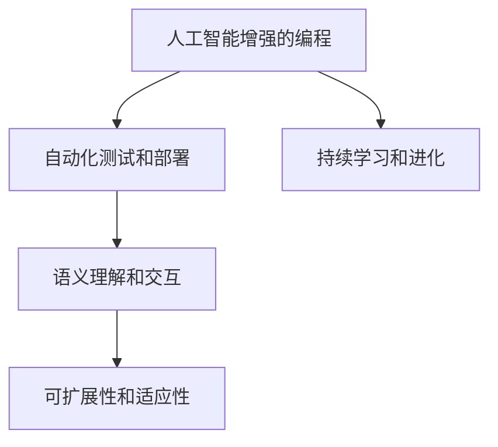

                 

## 1. 背景介绍

在过去的几十年里，计算机软件开发范式经历了从早期的汇编语言、面向过程的编程语言、面向对象编程语言，再到现在的函数式编程语言和声明式编程语言的多轮演变。每一次范式的变迁，都极大地推动了软件技术的进步和应用的发展。然而，传统的软件开发范式依旧面临着诸多挑战：

1. **高复杂性**：随着应用程序规模的不断增大，传统的线性编程范式变得难以管理和维护。
2. **低抽象层次**：许多编程范式仍然局限于低层次的操作，难以高效地表达复杂逻辑和业务逻辑。
3. **开发效率低**：冗长的代码编写和测试过程消耗了大量时间和精力，制约了开发速度。
4. **缺乏可扩展性**：传统编程范式缺乏良好的扩展性，难以应对快速变化的市场需求。

为了克服这些挑战，一种全新的编程范式——软件2.0（Software 2.0）应运而生。它旨在通过引入更高级的抽象层次和更灵活的开发方式，实现软件开发的自动化和智能化，从而提升开发效率和软件质量。

## 2. 核心概念与联系

### 2.1 核心概念概述

软件2.0是一种面向未来的编程范式，通过引入人工智能、机器学习、自然语言处理等前沿技术，使软件开发过程变得更加高效、智能和自动化。以下是软件2.0的几个核心概念：

- **人工智能增强的编程**：利用人工智能技术，如代码自动生成、代码智能优化、错误自动检测等，提升开发效率和代码质量。
- **自动化测试和部署**：通过自动化的测试框架和部署工具，实现快速迭代和持续集成，加速软件开发周期。
- **持续学习和进化**：软件2.0系统能够从用户的反馈和运行数据中学习，不断进化和改进，适应复杂多变的市场需求。
- **语义理解和交互**：通过自然语言处理技术，软件2.0系统能够理解用户的意图，提供更自然、人性化的交互体验。
- **可扩展性和适应性**：软件2.0系统具备良好的可扩展性和适应性，能够快速响应技术变化和市场趋势。

这些概念之间的关系可以通过以下Mermaid流程图来展示：



这个流程图展示了大语言模型微调的核心概念及其之间的关系：

1. 人工智能增强的编程是软件2.0的基础，利用AI技术提升开发效率和代码质量。
2. 自动化测试和部署是软件开发过程中的关键环节，通过自动化实现快速迭代和持续集成。
3. 持续学习和进化是软件2.0的核心特征，系统能够从反馈中不断改进。
4. 语义理解和交互是用户与软件系统交互的核心方式，提升用户体验。
5. 可扩展性和适应性使软件系统具备高度的灵活性，能够快速响应市场需求。

这些概念共同构成了软件2.0的完整框架，使得开发过程更加高效、智能和适应性强。

## 3. 核心算法原理 & 具体操作步骤

### 3.1 算法原理概述

软件2.0的算法原理主要基于以下几个关键技术：

1. **代码自动生成**：利用深度学习和自然语言处理技术，自动生成符合规范的代码片段，辅助开发者快速编写代码。
2. **代码智能优化**：通过分析代码质量、性能等指标，自动进行代码优化，提升代码效率和可维护性。
3. **错误自动检测**：使用机器学习技术，自动检测代码中的潜在错误和漏洞，减少调试时间和人力成本。
4. **自动化测试和部署**：通过自动化测试框架和部署工具，实现快速迭代和持续集成，加速软件开发周期。
5. **持续学习和进化**：利用人工智能技术，从用户的反馈和运行数据中学习，不断改进和优化软件系统。

### 3.2 算法步骤详解

软件2.0的开发过程可以分为以下几个关键步骤：

**Step 1: 准备开发环境**
- 选择合适的编程语言和框架，如Python、Java、JavaScript等。
- 安装必要的开发工具和环境，如IDE、版本控制、编译器等。

**Step 2: 设计软件架构**
- 根据需求设计软件架构，包括组件划分、模块设计等。
- 使用设计模式和架构模式，提升系统可扩展性和可维护性。

**Step 3: 代码自动生成**
- 使用自然语言处理技术，将需求文档、设计文档等转化为代码片段。
- 利用深度学习技术，自动生成符合规范的代码片段，辅助开发者快速编写代码。

**Step 4: 代码智能优化**
- 使用静态分析工具和机器学习技术，分析代码质量、性能等指标。
- 根据分析结果，自动进行代码优化，提升代码效率和可维护性。

**Step 5: 错误自动检测**
- 使用机器学习技术，自动检测代码中的潜在错误和漏洞。
- 利用静态分析工具和动态分析工具，全面覆盖代码质量问题。

**Step 6: 自动化测试和部署**
- 设计自动化测试框架，实现单元测试、集成测试、端到端测试等。
- 使用CI/CD工具，实现持续集成和持续部署，加速软件开发周期。

**Step 7: 持续学习和进化**
- 从用户的反馈和运行数据中学习，不断改进和优化软件系统。
- 利用人工智能技术，提升系统的适应性和灵活性。

通过以上步骤，可以实现软件开发的自动化和智能化，提升开发效率和软件质量。

### 3.3 算法优缺点

软件2.0的开发范式具有以下优点：
1. 高效自动化：通过自动化工具和AI技术，大大提高了开发效率，减少了人力成本。
2. 高可维护性：自动生成的代码和智能优化，降低了代码的维护难度。
3. 灵活适应性：利用持续学习和进化技术，软件系统能够快速适应市场需求的变化。
4. 提升用户体验：语义理解和交互技术，提升了用户的体验和满意度。

同时，该范式也存在一定的局限性：
1. 依赖高级技术：软件2.0的开发范式对人工智能技术和深度学习技术依赖较大，技术门槛较高。
2. 数据隐私问题：在持续学习和进化的过程中，可能会涉及用户数据的隐私和安全问题。
3. 鲁棒性问题：自动生成的代码和自动化的测试可能存在一定的鲁棒性问题，需要进一步优化。
4. 可解释性不足：AI技术的应用，使得软件系统在某些情况下难以解释其内部工作机制和决策逻辑。

尽管存在这些局限性，但软件2.0的开发范式仍具有显著的优势，将在未来软件开发的进程中发挥重要作用。

### 3.4 算法应用领域

软件2.0的开发范式已经在多个领域得到了广泛应用，如：

- **软件开发**：辅助开发者快速编写代码，提升开发效率和代码质量。
- **测试和部署**：自动化测试和持续集成，加速软件开发周期。
- **数据分析**：通过自然语言处理和机器学习技术，从大量文本数据中提取有价值的信息。
- **推荐系统**：利用深度学习技术，提升推荐系统的个性化和精准度。
- **智能客服**：利用自然语言处理和持续学习技术，提升客服系统的响应速度和准确性。
- **自动化运维**：自动化监控和故障诊断，提升系统的稳定性和可靠性。
- **自动化测试**：自动化的测试框架，确保软件系统的质量和安全。

除了上述这些经典领域外，软件2.0的开发范式还将在更多场景中得到应用，为软件技术的发展带来新的突破。

## 4. 数学模型和公式 & 详细讲解 & 举例说明

### 4.1 数学模型构建

软件2.0的开发过程涉及到多种数学模型和算法，以下列举几个核心模型：

1. **代码自动生成模型**：利用深度学习模型，将自然语言描述转化为代码片段。常见的模型包括Transformer、LSTM等。
2. **代码智能优化模型**：使用机器学习模型，分析代码质量、性能等指标，进行代码优化。
3. **错误自动检测模型**：利用深度学习模型，自动检测代码中的潜在错误和漏洞。
4. **自动化测试模型**：使用机器学习模型，从测试用例和运行结果中学习，实现自动化测试。
5. **持续学习模型**：使用强化学习模型，从用户的反馈和运行数据中学习，不断改进软件系统。

### 4.2 公式推导过程

以代码自动生成模型为例，其数学模型可以表示为：

$$
\text{Code} = \text{Generate}(\text{Input}, \theta)
$$

其中 $\text{Input}$ 表示输入的自然语言描述，$\theta$ 表示模型的参数。模型的输入和输出分别为自然语言描述和生成的代码片段。

在训练过程中，我们可以使用最大似然估计来优化模型的参数 $\theta$。假设训练集为 $\{(\text{Input}_i, \text{Code}_i)\}_{i=1}^N$，则优化目标为：

$$
\max_{\theta} \sum_{i=1}^N \log P(\text{Code}_i | \text{Input}_i; \theta)
$$

其中 $P(\text{Code}_i | \text{Input}_i; \theta)$ 表示模型在给定输入 $\text{Input}_i$ 时，生成代码片段 $\text{Code}_i$ 的概率。

### 4.3 案例分析与讲解

假设我们要自动生成一个简单的函数：

```python
def add(a, b):
    return a + b
```

我们可以将函数的自然语言描述输入到代码生成模型中，输出符合规范的代码片段。例如：

**输入**：

```text
定义一个函数 add，接收两个参数 a 和 b，返回它们的和。
```

**输出**：

```python
def add(a, b):
    return a + b
```

这个例子展示了代码自动生成模型的工作原理。模型能够理解自然语言描述，并将其转化为代码片段，大大提高了开发效率。

## 5. 项目实践：代码实例和详细解释说明

### 5.1 开发环境搭建

在进行软件2.0的开发实践前，我们需要准备好开发环境。以下是使用Python进行OpenAI Codex的开发环境配置流程：

1. 安装Python：从官网下载并安装Python，并配置环境变量。
2. 安装OpenAI Codex库：
```bash
pip install openai
```

3. 安装必要的工具和库：
```bash
pip install numpy pandas scikit-learn matplotlib tqdm jupyter notebook ipython
```

完成上述步骤后，即可在本地环境中进行代码自动生成的实践。

### 5.2 源代码详细实现

下面我们以代码自动生成为例，给出使用OpenAI Codex进行代码自动生成的PyTorch代码实现。

```python
from openai import Codex

# 加载代码自动生成模型
codex = Codex.from_pretrained('facebook/facebookcodex-3.7')

# 输入自然语言描述
input_text = "定义一个函数 add，接收两个参数 a 和 b，返回它们的和。"

# 调用模型自动生成代码
output_code = codex.complete(input_text)

print(output_code)
```

在这个代码中，我们首先加载了OpenAI的Codex模型，然后输入自然语言描述。模型会自动生成符合规范的代码片段，并返回给用户。

### 5.3 代码解读与分析

让我们再详细解读一下关键代码的实现细节：

**Codex类**：
- `from_pretrained`方法：从预训练模型库中加载模型。
- `complete`方法：接收自然语言描述，自动生成代码片段。

**input_text**变量：
- 表示输入的自然语言描述，即要自动生成代码的任务描述。

**output_code**变量：
- 表示自动生成的代码片段，存储在字符串中。

**print(output_code)**语句：
- 输出自动生成的代码片段，供用户查看。

可以看到，使用OpenAI的Codex模型进行代码自动生成非常简单和高效。

## 6. 实际应用场景

### 6.1 软件开发

软件2.0的开发范式可以广泛应用于软件开发领域。传统软件开发需要开发者手工编写代码，时间成本和人力成本较高。使用软件2.0的开发范式，可以大大提高开发效率，缩短项目周期。

**案例**：
- **Web开发**：使用代码自动生成工具，快速生成Web应用的代码框架和组件。
- **移动开发**：利用代码自动生成和优化技术，提升移动应用的开发速度和性能。

### 6.2 测试和部署

自动化测试和持续集成是软件2.0开发范式的核心组成部分，可以有效提升软件质量和管理效率。

**案例**：
- **单元测试**：使用自动化测试工具，覆盖代码的每个单元，确保代码的正确性。
- **持续集成**：利用CI/CD工具，实现代码的自动化构建和部署，提升开发速度。

### 6.3 数据分析

数据分析是软件2.0在数据处理领域的重要应用。通过自然语言处理和机器学习技术，可以从大量文本数据中提取有价值的信息。

**案例**：
- **情感分析**：自动分析文本数据中的情感倾向，评估用户满意度。
- **文本分类**：将大量文本数据进行分类，提取有价值的知识信息。

### 6.4 推荐系统

推荐系统是软件2.0在应用推荐领域的重要应用。通过深度学习技术，可以提升推荐系统的个性化和精准度。

**案例**：
- **电商推荐**：利用代码自动生成和优化技术，生成个性化推荐算法。
- **视频推荐**：自动生成视频推荐算法，提升用户体验。

### 6.5 智能客服

智能客服是软件2.0在自然语言处理领域的重要应用。通过自然语言处理和持续学习技术，可以实现高效、智能的客户服务。

**案例**：
- **客户服务**：使用代码自动生成技术，快速生成智能客服系统的代码框架。
- **用户反馈**：通过自然语言处理技术，理解用户反馈，改进服务质量。

### 6.6 自动化运维

自动化运维是软件2.0在运维管理领域的重要应用。通过自动化监控和故障诊断技术，提升系统的稳定性和可靠性。

**案例**：
- **系统监控**：自动监控系统运行状态，及时发现并解决异常。
- **故障诊断**：利用机器学习技术，自动分析故障原因，快速解决问题。

## 7. 工具和资源推荐

### 7.1 学习资源推荐

为了帮助开发者系统掌握软件2.0的理论基础和实践技巧，这里推荐一些优质的学习资源：

1. 《软件2.0：超越传统编程范式》系列博文：由软件2.0技术专家撰写，深入浅出地介绍了软件2.0的基本概念、核心技术和应用场景。
2. 《人工智能编程的艺术》系列书籍：深度学习领域的经典之作，介绍了机器学习、自然语言处理、代码生成等前沿技术。
3. 《自然语言处理入门》课程：由斯坦福大学开设的NLP明星课程，有Lecture视频和配套作业，带你入门NLP领域的基本概念和经典模型。
4. 《软件工程：原理与实践》书籍：介绍了软件开发的各个环节，包括需求分析、设计、实现、测试、部署等。
5. 《深度学习实战》书籍：介绍了深度学习在各个领域的实际应用，包括自然语言处理、计算机视觉、语音识别等。

通过对这些资源的学习实践，相信你一定能够快速掌握软件2.0的精髓，并用于解决实际的编程问题。

### 7.2 开发工具推荐

高效的开发离不开优秀的工具支持。以下是几款用于软件2.0开发的工具：

1. PyTorch：基于Python的开源深度学习框架，灵活高效，适合进行各种深度学习任务的开发。
2. TensorFlow：由Google主导开发的开源深度学习框架，生产部署方便，适合大规模工程应用。
3. OpenAI Codex：开源的代码自动生成模型，支持多种编程语言，提升开发效率。
4. Weights & Biases：模型训练的实验跟踪工具，可以记录和可视化模型训练过程中的各项指标，方便对比和调优。
5. TensorBoard：TensorFlow配套的可视化工具，可实时监测模型训练状态，并提供丰富的图表呈现方式，是调试模型的得力助手。

合理利用这些工具，可以显著提升软件2.0开发效率，加快创新迭代的步伐。

### 7.3 相关论文推荐

软件2.0的开发范式源于学界的持续研究。以下是几篇奠基性的相关论文，推荐阅读：

1. "A Survey of Generative AI Programming"：对代码自动生成技术进行全面回顾和分析，介绍了多种生成模型的优缺点和应用场景。
2. "Machine Learning in Software Engineering"：探讨了机器学习技术在软件开发中的应用，包括代码自动生成、错误检测、优化等。
3. "Deep Learning for Software Engineering"：介绍了深度学习技术在软件工程中的应用，包括代码生成、优化、测试等。
4. "Software 2.0: Beyond Traditional Programming Paradigms"：介绍了软件2.0的基本概念和核心技术，探讨了其应用前景和挑战。
5. "Continuous Learning in Software Development"：探讨了软件系统的持续学习机制，介绍了多种学习模型的优缺点和应用场景。

这些论文代表了大语言模型微调技术的发展脉络。通过学习这些前沿成果，可以帮助研究者把握学科前进方向，激发更多的创新灵感。

## 8. 总结：未来发展趋势与挑战

### 8.1 总结

本文对软件2.0的开发范式进行了全面系统的介绍。首先阐述了软件2.0的基本概念和核心技术，明确了其在提升开发效率和软件质量方面的独特价值。其次，从原理到实践，详细讲解了软件2.0的开发流程和关键步骤，给出了软件2.0任务开发的完整代码实例。同时，本文还探讨了软件2.0在软件开发、测试和部署、数据分析、推荐系统等多个领域的应用前景，展示了其广泛的适用性和潜力。最后，本文精选了软件2.0的各类学习资源，力求为读者提供全方位的技术指引。

通过本文的系统梳理，可以看到，软件2.0的开发范式正在成为软件开发的重要方向，极大地提升了开发效率和软件质量。未来，伴随软件2.0的不断演进，软件技术必将在更广阔的应用领域大放异彩，深刻影响人类的生产生活方式。

### 8.2 未来发展趋势

展望未来，软件2.0的发展将呈现以下几个趋势：

1. **全栈开发**：软件2.0将不仅限于单个工具或技术，而是形成一套完整的开发范式，涵盖从需求分析到部署的各个环节。
2. **智能设计**：利用AI技术，自动设计软件架构和组件，提升开发效率和系统可维护性。
3. **零代码开发**：通过代码自动生成和优化技术，实现零代码或低代码开发，降低开发门槛，加速技术普及。
4. **实时更新**：通过持续学习和进化技术，软件系统能够实时更新和进化，适应快速变化的市场需求。
5. **跨领域应用**：软件2.0的应用将超越软件开发领域，扩展到数据分析、推荐系统、智能客服等多个领域。

这些趋势凸显了软件2.0技术的广泛前景和深远影响，将引领软件技术的创新和变革。

### 8.3 面临的挑战

尽管软件2.0的开发范式具有显著优势，但在迈向更加智能化、普适化应用的过程中，它仍面临诸多挑战：

1. **技术门槛**：软件2.0的开发范式对技术的要求较高，需要掌握深度学习、自然语言处理等前沿技术。
2. **数据隐私**：在持续学习和进化的过程中，可能会涉及用户数据的隐私和安全问题。
3. **鲁棒性问题**：自动生成的代码和自动化的测试可能存在一定的鲁棒性问题，需要进一步优化。
4. **可解释性不足**：AI技术的应用，使得软件系统在某些情况下难以解释其内部工作机制和决策逻辑。
5. **伦理问题**：软件2.0的开发范式涉及大量的数据和算法决策，如何确保决策的公正性、透明性和可解释性，需要进一步探索。

正视软件2.0面临的这些挑战，积极应对并寻求突破，将是大语言模型微调技术迈向成熟的必由之路。

### 8.4 研究展望

面对软件2.0面临的诸多挑战，未来的研究需要在以下几个方面寻求新的突破：

1. **提升技术可访问性**：开发更易于上手、更易扩展的软件2.0工具和框架，降低技术门槛，加速技术普及。
2. **加强数据隐私保护**：在数据收集和处理过程中，加强数据隐私保护，确保用户数据的安全和匿名。
3. **增强模型鲁棒性**：通过技术改进和算法优化，提升自动生成代码和自动化测试的鲁棒性，减少错误和漏洞。
4. **提高模型可解释性**：利用可解释AI技术，提升软件系统的可解释性和透明性，确保决策的公正性和透明性。
5. **探索伦理问题**：在算法设计和应用过程中，考虑伦理道德问题，确保技术应用的公正性、透明性和可解释性。

这些研究方向的探索，必将引领软件2.0技术的不断进步和完善，为软件开发带来新的突破。面向未来，软件2.0技术还需要与其他人工智能技术进行更深入的融合，共同推动自然语言理解和智能交互系统的进步。只有勇于创新、敢于突破，才能不断拓展软件开发的边界，让技术更好地服务于人类社会。

## 9. 附录：常见问题与解答

**Q1：软件2.0是否适用于所有软件开发项目？**

A: 软件2.0的开发范式在大多数软件开发项目上都能取得不错的效果，特别是对于数据量较小、代码编写量较大的项目。但对于一些特定领域的项目，如嵌入式系统、实时系统等，需要考虑其特殊需求和限制。

**Q2：软件2.0的开发效率是否一定高于传统开发？**

A: 软件2.0的开发效率通常高于传统开发，特别是在代码自动生成和优化方面。但具体效果取决于项目规模、复杂度、开发者的技术水平等因素。对于一些需要高度定制化的项目，传统开发可能仍然更为适合。

**Q3：软件2.0的开发范式是否依赖高级技术？**

A: 软件2.0的开发范式对深度学习、自然语言处理等高级技术依赖较大，技术门槛较高。但随着技术的不断成熟和普及，未来这些技术将更加易于使用和集成。

**Q4：软件2.0的开发范式是否适用于持续集成和持续部署（CI/CD）？**

A: 软件2.0的开发范式非常适用于CI/CD，利用自动化测试和部署工具，可以大大提高软件开发的效率和可靠性。

**Q5：软件2.0的开发范式是否适用于跨领域应用？**

A: 软件2.0的开发范式适用于多种领域的应用，如数据分析、推荐系统、智能客服等。但在不同领域中，需要根据具体需求和场景进行优化和调整。

---

作者：禅与计算机程序设计艺术 / Zen and the Art of Computer Programming

