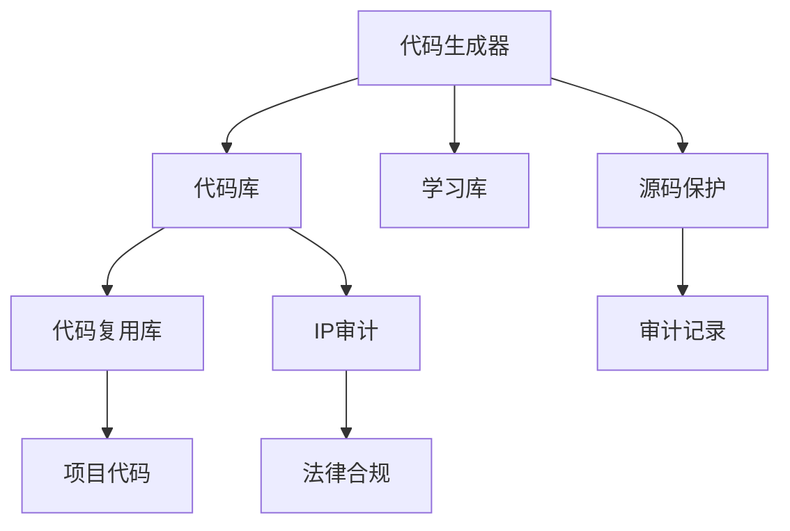

                 

# 软件2.0时代的代码复用与知识产权

## 1. 背景介绍

在软件2.0时代，编程范式从“手写代码”向“机器生成代码”转变。这一转变极大地提升了代码生成速度和规模，同时也带来了代码复用性和知识产权问题的挑战。本文旨在深入探讨软件2.0时代代码复用与知识产权问题，以期为开发者提供更全面、更实用的技术指引。

## 2. 核心概念与联系

### 2.1 核心概念概述

软件2.0时代，代码生成技术逐渐成为主流。这一技术的核心在于将复杂的逻辑抽象为可复用的代码模块，利用机器学习、符号执行等技术自动生成代码。其关键概念包括：

- **代码生成器(Code Generator)**：负责自动生成代码的机器工具，通过学习历史代码范式和开发规范，生成符合预定义格式的代码。
- **代码复用(Code Reuse)**：将已生成的代码模块在新的开发项目中复用，减少重复工作，提升开发效率。
- **知识产权(Intellectual Property, IP)**：涉及软件代码的版权、专利、商业秘密等法律问题，与代码生成、复用过程密切相关。
- **源码保护(Source Code Protection)**：通过技术手段保护源代码不被恶意篡改或泄露。
- **代码追踪与审计(Code Tracking & Auditing)**：记录代码的生成、修改、部署等活动，便于追踪和审计。

### 2.2 核心概念原理和架构的 Mermaid 流程图



此图展示了代码生成器、代码库、代码复用库、项目代码、学习库、源码保护、审计记录和IP审计之间的联系和流程。代码生成器从学习库中学习生成代码，并存储到代码库中。代码复用库从代码库中提取代码模块，供新项目使用。源码保护和审计记录保证了代码的安全性和可追踪性，IP审计和法律合规则确保了知识产权的合法性。

## 3. 核心算法原理 & 具体操作步骤

### 3.1 算法原理概述

基于代码生成器的代码复用和知识产权保护过程，主要包括以下几个步骤：

1. **代码学习与生成**：代码生成器通过学习历史代码和开发规范，自动生成符合特定要求的代码。
2. **代码复用与部署**：代码生成器生成的代码经过测试和优化后，存入代码库。开发者可以在新的项目中复用这些代码，加快开发进程。
3. **代码审计与保护**：审计工具记录代码的生成、修改和部署活动，源码保护工具防止代码被恶意篡改。
4. **IP审计与合规**：IP审计工具检查代码是否侵犯了他人知识产权，确保代码使用的合法性。

### 3.2 算法步骤详解

#### 3.2.1 代码学习与生成

代码生成器通过以下步骤学习并生成代码：

1. **数据采集**：从开源代码库、公司内部代码库中采集大量代码样本，用于学习。
2. **特征提取**：使用机器学习算法从代码样本中提取关键特征，如变量名、函数名、注释等。
3. **代码模板生成**：基于提取的特征，使用模板匹配或机器学习生成代码模板。
4. **代码生成**：根据代码模板和用户输入，生成特定格式的代码。

#### 3.2.2 代码复用与部署

代码复用与部署主要包括以下步骤：

1. **代码抽取**：从代码库中抽取可复用的代码模块。
2. **代码整合**：将抽取的代码模块整合到新的项目中。
3. **测试与优化**：对整合后的代码进行测试和优化，确保其符合预期功能。
4. **部署与监控**：将测试通过的代码部署到生产环境中，并持续监控其运行状态。

#### 3.2.3 代码审计与保护

代码审计与保护主要包括以下步骤：

1. **审计记录**：记录代码的生成、修改、部署等活动，形成审计日志。
2. **源码保护**：使用加密、数字签名等技术，保护源码不被未经授权的访问。
3. **漏洞检测**：使用静态分析工具检测代码中的安全漏洞。
4. **备份与恢复**：定期备份代码，以防数据丢失，确保代码可恢复性。

#### 3.2.4 IP审计与合规

IP审计与合规主要包括以下步骤：

1. **IP检测**：检测代码是否包含他人作品，避免侵权。
2. **合规审查**：检查代码是否符合公司的开发规范和代码复用政策。
3. **法律咨询**：针对疑似的侵权行为，咨询法律顾问。
4. **诉讼与和解**：必要时，采取法律手段解决知识产权纠纷。

### 3.3 算法优缺点

**优点**：

1. **提升开发效率**：自动生成和复用代码，大幅提升开发速度。
2. **减少错误率**：利用代码模板和历史代码，降低人为错误。
3. **降低成本**：减少重复劳动和手动编码，降低开发成本。
4. **促进代码共享**：代码复用库促进代码共享，提升公司内部知识共享。

**缺点**：

1. **依赖性强**：代码生成器依赖大量历史代码和开发规范，可能导致适应性差。
2. **复杂度高**：代码生成和审计过程复杂，需要专业的技术支持。
3. **版权问题**：自动生成的代码涉及版权归属问题，容易引起法律纠纷。
4. **安全风险**：自动化生成代码存在潜在安全风险，如代码注入、缓冲区溢出等。
5. **开发环境限制**：代码生成和复用过程中，需要稳定的开发环境和工具支持。

### 3.4 算法应用领域

代码生成和复用技术已广泛应用于多个领域，如：

- **软件开发**：使用代码生成器自动生成代码模块，加快开发速度。
- **测试自动化**：生成测试用例，减少手动测试工作量。
- **数据分析**：生成数据处理和分析代码，提升数据处理效率。
- **系统运维**：生成运维脚本，提升系统维护效率。
- **AI模型训练**：生成训练代码，加速模型开发和训练。
- **持续集成(CI/CD)**：生成自动化流水线，提升代码集成和部署效率。

## 4. 数学模型和公式 & 详细讲解 & 举例说明

### 4.1 数学模型构建

假设有一组历史代码样本 $D=\{x_1,x_2,...,x_n\}$，其中 $x_i=(x_{i1},x_{i2},...,x_{im})$，每一行表示一个代码样本，每一列表示一个特征。使用机器学习算法 $f$，从这些样本中学习到代码生成模型 $G$。

**目标函数**：

$$
\min_{G} \sum_{i=1}^n \text{loss}(G(x_i),y_i)
$$

其中 $y_i$ 是 $x_i$ 的真实代码，$\text{loss}$ 是损失函数，如均方误差、交叉熵等。

### 4.2 公式推导过程

以**线性回归**为例，代码生成模型的目标函数为：

$$
\min_{G} \frac{1}{2N} \sum_{i=1}^N ||G(x_i)-y_i||^2
$$

使用梯度下降法进行求解，得到模型参数 $\theta$：

$$
\theta = (X^TX)^{-1}X^Ty
$$

其中 $X$ 是特征矩阵，$y$ 是目标向量。

### 4.3 案例分析与讲解

以**Python代码生成器**为例，其数学模型可以描述为：

$$
\min_{G} \frac{1}{N} \sum_{i=1}^N \text{loss}(G(s_i),t_i)
$$

其中 $s_i$ 是自然语言描述，$t_i$ 是对应的Python代码。

假设使用Transformer模型进行学习，通过注意力机制提取自然语言描述的语义特征，生成Python代码。具体步骤如下：

1. **特征提取**：使用Transformer的编码器将自然语言描述转换为语义向量。
2. **解码**：使用Transformer的解码器将语义向量转换为Python代码。
3. **优化**：通过反向传播和梯度下降，优化模型参数 $\theta$。

## 5. 项目实践：代码实例和详细解释说明

### 5.1 开发环境搭建

1. **安装Python**：下载并安装Python 3.8及以上版本。
2. **安装PyTorch**：使用以下命令安装PyTorch：

   ```
   pip install torch torchvision torchaudio
   ```

3. **安装TensorFlow**：使用以下命令安装TensorFlow：

   ```
   pip install tensorflow
   ```

4. **安装代码生成工具**：如**Zydox Code Generator**、**Terraform**、**OpenAPI Generator**等。

### 5.2 源代码详细实现

以下是一个使用**Zydox Code Generator**生成Python代码的示例：

```python
from zydox.python_generator import PythonGenerator

# 配置生成器参数
generator = PythonGenerator()
generator.set_language("python")
generator.set_target_version("3.8")

# 设置输入数据
generator.set_data([
    {"name": "x", "type": "int", "value": 10},
    {"name": "y", "type": "float", "value": 3.14},
])

# 生成代码
code = generator.generate_code()

# 输出代码
print(code)
```

### 5.3 代码解读与分析

1. **Zydox Code Generator**：是市场上常见的代码生成工具，支持多种编程语言。
2. **生成器配置**：通过设置语言和目标版本，指定生成器支持的语言和版本。
3. **数据输入**：设置要生成代码的变量和数据类型，以及变量值。
4. **代码生成**：调用生成器生成代码。
5. **代码输出**：获取并输出生成的代码。

### 5.4 运行结果展示

运行上述代码，生成Python代码：

```python
x = 10
y = 3.14
```

## 6. 实际应用场景

### 6.1 软件开发

代码生成器在软件开发中具有重要应用。如Google的Go语言自动生成器，通过学习历史代码和开发规范，自动生成符合规范的代码，大大提升开发效率。

### 6.2 测试自动化

使用代码生成器生成测试用例，减少手动编写测试用例的工作量。如JUnit代码生成器，从测试规范中自动生成测试代码。

### 6.3 数据分析

数据处理和分析代码复杂繁琐，使用代码生成器可以大大提升数据处理效率。如Hadoop代码生成器，自动生成数据处理脚本。

### 6.4 系统运维

系统运维需要大量脚本，使用代码生成器生成运维脚本，提升运维效率。如Ansible代码生成器，自动生成运维脚本。

### 6.5 AI模型训练

自动生成训练代码，加速模型开发和训练。如TensorFlow自动生成器，生成TensorFlow代码。

### 6.6 持续集成(CI/CD)

生成自动化流水线，提升代码集成和部署效率。如Jenkins代码生成器，自动生成CI/CD脚本。

## 7. 工具和资源推荐

### 7.1 学习资源推荐

1. **《软件2.0：编程范式转变》**：详细介绍了软件2.0时代的编程范式转变，以及代码生成、复用的原理和实践。
2. **《机器学习与数据挖掘》**：深入探讨了机器学习在代码生成中的应用。
3. **《TensorFlow实战》**：介绍了TensorFlow的使用和代码生成。
4. **《OpenAPI规范》**：详细描述了OpenAPI规范，以及基于规范的代码生成技术。
5. **《软件工程最佳实践》**：提供了软件开发的规范和最佳实践，包括代码复用和审计。

### 7.2 开发工具推荐

1. **PyTorch**：Python深度学习框架，支持TensorFlow、Keras等库。
2. **TensorFlow**：Google开源的深度学习框架，支持TensorFlow、Keras等库。
3. **Zydox Code Generator**：支持多种编程语言和框架，适用于软件开发、测试自动化、数据分析等场景。
4. **Terraform**：基于配置文件进行代码生成，适用于系统运维。
5. **OpenAPI Generator**：根据OpenAPI规范自动生成代码，适用于API开发。

### 7.3 相关论文推荐

1. **《软件2.0编程范式的转变》**：深入探讨了软件2.0时代的编程范式转变。
2. **《基于机器学习的代码生成技术研究》**：详细介绍了机器学习在代码生成中的应用。
3. **《TensorFlow代码生成技术》**：介绍了TensorFlow代码生成的原理和实现。
4. **《OpenAPI代码生成技术》**：详细描述了基于OpenAPI规范的代码生成技术。
5. **《基于代码复用的软件开发生产力提升》**：探讨了代码复用对软件开发生产力的提升作用。

## 8. 总结：未来发展趋势与挑战

### 8.1 研究成果总结

软件2.0时代的代码生成和复用技术，极大地提升了开发效率和软件质量。但其依赖性强、复杂度高、安全风险高等问题也需引起重视。未来研究应关注如何提高代码生成器的适应性和安全性，减少对历史代码的依赖，提升代码生成和审计效率。

### 8.2 未来发展趋势

1. **自适应生成器**：自动适应新项目和编程语言，减少对历史代码的依赖。
2. **模型化生成**：使用符号执行和模型驱动生成技术，提升代码生成的准确性和鲁棒性。
3. **代码审计与保护**：开发更高效的代码审计工具，确保代码的安全性和合规性。
4. **代码复用与部署**：提升代码复用效率，减少开发和部署时间。
5. **跨平台与跨语言支持**：支持多种平台和语言，提升代码生成的灵活性。

### 8.3 面临的挑战

1. **依赖性问题**：代码生成器对历史代码的依赖性可能导致适应性差。
2. **复杂性问题**：代码生成过程复杂，需要专业的技术支持。
3. **版权问题**：自动生成的代码涉及版权归属问题，容易引起法律纠纷。
4. **安全问题**：自动化生成代码存在潜在安全风险。
5. **开发环境限制**：代码生成和复用过程中，需要稳定的开发环境和工具支持。

### 8.4 研究展望

1. **自适应生成**：研发自适应生成技术，提高代码生成器的适应性和灵活性。
2. **模型化生成**：使用符号执行和模型驱动生成技术，提升代码生成的准确性和鲁棒性。
3. **代码审计与保护**：开发高效代码审计工具，确保代码的安全性和合规性。
4. **代码复用与部署**：提升代码复用效率，减少开发和部署时间。
5. **跨平台与跨语言支持**：支持多种平台和语言，提升代码生成的灵活性。

## 9. 附录：常见问题与解答

**Q1：如何选择合适的代码生成器？**

A：根据项目需求选择适合的代码生成器。如需要快速生成代码，选择功能丰富的代码生成器；需要高度定制化的代码生成器，选择提供扩展API的生成器。

**Q2：代码生成器生成的代码质量如何保证？**

A：使用单元测试和代码审计工具，确保生成的代码符合预期要求。定期进行代码审查，避免代码注入、缓冲区溢出等安全问题。

**Q3：代码生成器生成的代码如何审计？**

A：使用静态分析工具，如SonarQube、JArchitect等，检测生成的代码中的漏洞和风险。定期进行代码审计，确保代码符合开发规范和代码复用政策。

**Q4：如何保护生成的代码？**

A：使用加密、数字签名等技术，保护生成的代码不被未经授权的访问。定期备份代码，以防数据丢失。

**Q5：自动生成的代码如何处理版权问题？**

A：明确代码生成器的使用许可，避免侵权。对于开源项目，遵循开源协议，避免侵犯他人版权。

**Q6：如何提高代码生成器的适应性？**

A：使用数据驱动和模型驱动技术，提高代码生成器的适应性。定期更新历史代码库，保持代码生成器的最新状态。

**Q7：如何确保代码生成的安全性？**

A：使用静态分析工具，检测代码中的安全漏洞。定期进行代码审计，确保代码的安全性和合规性。

**Q8：如何提升代码复用效率？**

A：优化代码复用库，提供高效的代码检索和整合工具。使用版本控制系统，记录代码的生成、修改、部署等活动。

**Q9：如何支持跨平台与跨语言生成？**

A：使用跨平台和跨语言的代码生成技术，如OpenAPI、gRPC等。确保代码生成器支持多种平台和语言，提升代码生成的灵活性。

**Q10：代码生成器如何应对未知的需求？**

A：使用自适应生成技术，根据用户需求自动生成代码。引入机器学习和符号执行技术，提升代码生成器的适应性和灵活性。

作者：禅与计算机程序设计艺术 / Zen and the Art of Computer Programming

