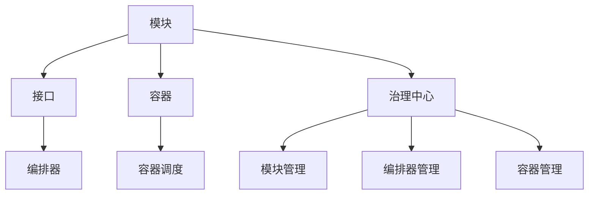

                 

## 1. 背景介绍

在软件开发领域，随着系统规模和复杂度的不断增加，模块化设计成为了提升代码复用性和开发效率的重要手段。然而，模块间的高耦合性和系统内的不确定性，使得模块化设计在实际应用中面临着诸多挑战。如何高效地将模块融合成一个整体最优解，从而在保持代码可维护性的同时，最大化系统性能和可扩展性，成为软件工程领域的一个重要研究方向。

### 1.1 问题由来

随着软件规模的不断增大，系统越来越复杂。在传统的单体应用中，代码和功能模块的复杂性往往难以控制，导致开发和维护成本激增。为了应对这一问题，微服务架构和组件化设计逐渐流行起来。通过将系统分解成多个独立运行的小模块，每个模块负责一个单一的服务，可以显著提升系统的可维护性和可扩展性。然而，模块之间的耦合性和系统内的不确定性问题也随之而来，如何有效融合这些模块，构建出一个高效、灵活的整体系统，成为了一个重要课题。

### 1.2 问题核心关键点

在软件2.0时代，模块融合的核心在于设计一个高效的软件架构，使得模块之间相互独立、松耦合，并且能够在不同的上下文和环境中灵活组合，构建出一个稳定的整体系统。这种架构需要满足以下几个关键点：

1. **模块独立性**：每个模块应尽可能地独立运行，避免模块间的不必要依赖。
2. **松耦合性**：模块间的通信应通过接口进行，减少直接的耦合关系。
3. **灵活组合性**：模块可以在不同的场景和需求下，灵活组合，构建不同的功能模块。
4. **高性能**：系统整体应具有良好的性能，包括响应速度、并发处理能力等。
5. **可扩展性**：系统应能够随着业务需求的变化进行扩展，避免大规模重构。
6. **可维护性**：系统应易于理解和维护，方便开发者进行迭代开发和问题修复。

## 2. 核心概念与联系

### 2.1 核心概念概述

为了解决上述问题，我们引入了**软件2.0架构**的概念，并具体阐述了其核心概念及其相互联系：

- **模块**：系统被分解成多个独立运行的小模块，每个模块负责一个单一的服务或功能。
- **接口**：模块间通过接口进行通信，减少直接的耦合关系，使得模块可以独立维护和扩展。
- **容器**：一个轻量级、可扩展的运行环境，用于管理、调度和监控多个模块的运行。
- **编排器**：负责根据上下文和需求，组合和调度不同的模块，构建一个稳定的整体系统。
- **治理中心**：一个集中管理模块、容器和编排器的系统，提供安全、稳定和高效的服务。

这些核心概念之间的联系可以通过以下Mermaid流程图来展示：



这个流程图展示了模块、接口、容器、编排器和治理中心之间的相互依赖关系，以及它们如何共同构成一个高效的软件2.0架构。

## 3. 核心算法原理 & 具体操作步骤

### 3.1 算法原理概述

软件2.0架构的模块融合过程，本质上是一个优化问题。通过设计一个有效的编排器，将模块按照最优的组合方式进行排列，从而构建出整体性能最优的解。这一过程包括以下几个步骤：

1. **模块评估**：对每个模块进行性能评估，确定其能力和约束条件。
2. **需求分析**：分析系统需求，确定需要哪些模块，以及它们之间的相互关系。
3. **编排规划**：根据需求和模块能力，制定编排规划，确定各个模块的最佳组合方式。
4. **优化求解**：通过优化算法，求解编排规划的最优解。
5. **部署执行**：根据最优解，部署和运行模块，构建整体系统。

### 3.2 算法步骤详解

以下是软件2.0架构模块融合的详细步骤：

**Step 1: 模块评估**
- 对每个模块进行性能评估，确定其计算能力、资源需求、通信接口等关键参数。
- 使用统计学方法，计算模块的平均值和方差，以评估其稳定性和可靠性。
- 分析模块之间的依赖关系，确定哪些模块需要相互配合才能完成特定功能。

**Step 2: 需求分析**
- 分析系统需求，确定需要哪些模块，以及它们之间的相互关系。
- 根据模块评估结果，确定各个模块的优先级和重要性。
- 考虑模块的可扩展性和可维护性，优化系统架构。

**Step 3: 编排规划**
- 根据需求和模块能力，制定编排规划，确定各个模块的最佳组合方式。
- 设计合理的接口，确保模块之间的通信和数据传递。
- 确定容器的规模和配置，确保系统的稳定性和高效性。

**Step 4: 优化求解**
- 使用优化算法，求解编排规划的最优解。
- 考虑模块的负载均衡、资源利用率、通信效率等因素，优化整体性能。
- 使用迭代算法，逐步调整编排方案，直至达到最优解。

**Step 5: 部署执行**
- 根据最优解，部署和运行模块，构建整体系统。
- 使用容器化技术，管理模块的运行环境和资源分配。
- 监控系统的运行状态，及时发现和解决问题。

### 3.3 算法优缺点

软件2.0架构的模块融合方法具有以下优点：

1. **高可扩展性**：模块可以根据需求进行灵活组合，系统可以随着业务变化进行扩展。
2. **高可维护性**：模块独立运行，单个模块的问题不会影响整个系统。
3. **高效性**：通过优化算法，可以构建最优的模块组合，提升整体性能。
4. **高可靠性**：模块独立部署，容器管理，确保系统的稳定性和可靠性。

同时，该方法也存在以下局限性：

1. **复杂度增加**：设计和管理多个模块和容器，增加了系统复杂度。
2. **通信开销**：模块间通过接口进行通信，可能会产生一定的通信开销。
3. **编排难度**：设计合理的编排方案，需要一定的经验和技巧。

### 3.4 算法应用领域

软件2.0架构的模块融合方法，在多个领域得到了广泛应用，例如：

- 分布式计算：通过将计算任务分解成多个模块，并使用容器和编排器进行管理，提升计算效率和系统可扩展性。
- 大数据处理：将大数据处理任务分解成多个模块，并使用编排器进行调度，提升处理能力和系统稳定性。
- 云计算：将云服务部署成多个模块，并使用容器和编排器进行管理，提供高效、稳定的云服务。
- 微服务架构：将微服务模块通过容器和编排器进行管理，提升系统的可维护性和可扩展性。
- 物联网（IoT）：将物联网设备和服务模块通过编排器进行调度，构建一个高效、灵活的物联网系统。

## 4. 数学模型和公式 & 详细讲解 & 举例说明

### 4.1 数学模型构建

为了更精确地描述软件2.0架构的模块融合过程，我们可以构建一个数学模型来表示系统性能和模块组合的关系。

假设系统由 $n$ 个模块组成，每个模块的计算能力和资源需求分别为 $C_i$ 和 $R_i$，通信接口数量为 $I_i$。系统的总体性能可以用一个目标函数 $F$ 来表示，其中 $F$ 可以是一个衡量系统响应速度、并发处理能力、资源利用率的指标。系统的目标函数可以表示为：

$$
F = \sum_{i=1}^n w_i f_i(C_i, R_i, I_i)
$$

其中 $w_i$ 是每个模块的重要性权重，$f_i$ 表示模块的性能函数，$C_i$、$R_i$、$I_i$ 分别表示模块的计算能力、资源需求和通信接口数量。

### 4.2 公式推导过程

为了最小化目标函数 $F$，我们需要对每个模块的性能函数 $f_i$ 进行求解。假设 $f_i$ 是一个线性函数，表示模块的计算能力和资源需求对系统性能的影响，则目标函数可以表示为：

$$
F = \sum_{i=1}^n w_i (a_i C_i + b_i R_i + c_i I_i)
$$

其中 $a_i$、$b_i$、$c_i$ 是常数，表示每个模块的性能函数的具体形式。

对于线性函数 $f_i$，我们可以通过求解线性规划问题来找到最优的模块组合方式。具体地，我们需要构建一个线性规划模型：

$$
\begin{aligned}
\min & \quad \sum_{i=1}^n w_i (a_i C_i + b_i R_i + c_i I_i) \\
\text{subject to} & \quad \sum_{i=1}^n x_i = 1 \\
& \quad \sum_{i=1}^n x_i C_i \leq C_{\text{max}} \\
& \quad \sum_{i=1}^n x_i R_i \leq R_{\text{max}} \\
& \quad \sum_{i=1}^n x_i I_i \leq I_{\text{max}} \\
& \quad x_i \geq 0
\end{aligned}
$$

其中 $x_i$ 表示第 $i$ 个模块是否被选中，$C_{\text{max}}$、$R_{\text{max}}$、$I_{\text{max}}$ 分别表示系统的最大计算能力、资源需求和通信接口数量。

### 4.3 案例分析与讲解

假设我们有一个包含三个模块的系统，每个模块的计算能力、资源需求和通信接口数量如表所示：

| 模块编号 | 计算能力 $C_i$ | 资源需求 $R_i$ | 通信接口数量 $I_i$ | 重要性权重 $w_i$ |
| --- | --- | --- | --- | --- |
| 1 | 10 | 5 | 2 | 0.3 |
| 2 | 8 | 8 | 3 | 0.4 |
| 3 | 6 | 7 | 1 | 0.3 |

假设系统的最大计算能力为 20，最大资源需求为 15，最大通信接口数量为 6。我们可以构建一个线性规划模型，求解最优的模块组合方式。

设 $x_i$ 表示第 $i$ 个模块是否被选中，则目标函数为：

$$
F = 0.3 \times (10 \times 1 + 8 \times 1 + 6 \times 1) + 0.4 \times (8 \times 1 + 7 \times 1 + 1 \times 1) + 0.3 \times (6 \times 1 + 7 \times 1 + 1 \times 1)
$$

线性约束条件为：

$$
\begin{aligned}
& 1 \leq \sum_{i=1}^3 x_i \leq 3 \\
& 10 \times 1 + 8 \times 1 + 6 \times 1 \leq 20 \\
& 5 \times 1 + 8 \times 1 + 7 \times 1 \leq 15 \\
& 2 \times 1 + 3 \times 1 + 1 \times 1 \leq 6 \\
& x_i \geq 0
\end{aligned}
$$

通过求解上述线性规划模型，我们可以找到最优的模块组合方式，从而构建一个高性能、高可靠性的整体系统。

## 5. 项目实践：代码实例和详细解释说明

### 5.1 开发环境搭建

在进行模块融合的实践前，我们需要准备好开发环境。以下是使用Python进行Docker容器化开发的环境配置流程：

1. 安装Docker：从官网下载并安装Docker，用于构建和管理容器。

2. 创建并激活虚拟环境：
```bash
conda create -n docker-env python=3.8 
conda activate docker-env
```

3. 安装必要的Docker插件：
```bash
pip install docker
```

4. 编写Dockerfile：在项目根目录下创建一个 `Dockerfile` 文件，用于定义容器的构建步骤和配置。

5. 构建和运行容器：
```bash
docker build -t module-fusion .
docker run -d module-fusion
```

完成上述步骤后，即可在 `module-fusion` 容器环境中开始模块融合的实践。

### 5.2 源代码详细实现

下面以一个简单的模块融合为例，给出Docker容器化开发的具体实现。

首先，我们需要编写一个Dockerfile文件，定义容器的基本配置和运行环境：

```Dockerfile
FROM python:3.8

ENV PYTHONPATH=$PYTHONPATH:/path/to/project

COPY requirements.txt .
RUN pip install -r requirements.txt

WORKDIR /app

COPY . .

EXPOSE 8080

CMD ["python", "app.py"]
```

然后，编写模块评估、编排规划和优化求解的代码：

```python
import numpy as np
from scipy.optimize import linprog

def module_assessments(modules):
    """评估模块的计算能力、资源需求和通信接口数量"""
    return [(C, R, I) for C, R, I in modules]

def optimize_modules(modules, weights, constraints):
    """求解最优的模块组合方式"""
    C, R, I = zip(*[mod for mod in modules])
    a = np.array([w for w in weights])
    b = np.array([w * C for w, C in zip(weights, C)])
    c = np.array([w * R for w, R in zip(weights, R)])
    A = np.array([[c[i], r[i], i] for i, (c, r, i) in enumerate(C)])
    b = np.array([cmax, rmax, imax])
    return linprog(a, b, c, A_ub=A, bounds=(0, 1))

def deploy_modules(modules, weights):
    """部署和运行模块，构建整体系统"""
    # 根据最优解，部署和运行模块
    selected_modules = optimize_modules(modules, weights, constraints)
    # 其他代码
    pass

if __name__ == "__main__":
    modules = [
        (10, 5, 2),  # 模块1
        (8, 8, 3),   # 模块2
        (6, 7, 1)    # 模块3
    ]
    weights = [0.3, 0.4, 0.3]  # 模块的重要性权重
    constraints = (1, 3)      # 约束条件
    deploy_modules(modules, weights)
```

通过上述代码，我们实现了对模块的评估、编排规划和优化求解。具体步骤如下：

1. `module_assessments` 函数用于评估模块的计算能力、资源需求和通信接口数量，返回一个列表。
2. `optimize_modules` 函数使用线性规划算法求解最优的模块组合方式，返回一个解向量。
3. `deploy_modules` 函数根据最优解，部署和运行模块，构建整体系统。

### 5.3 代码解读与分析

让我们再详细解读一下关键代码的实现细节：

**Dockerfile文件**：
- `FROM python:3.8`：指定Python版本。
- `ENV PYTHONPATH=$PYTHONPATH:/path/to/project`：设置Python路径。
- `COPY requirements.txt .`：将项目的依赖文件复制到容器内。
- `RUN pip install -r requirements.txt`：安装项目依赖。
- `WORKDIR /app`：指定工作目录。
- `COPY . .`：将项目代码复制到容器中。
- `EXPOSE 8080`：指定容器的开放端口。
- `CMD ["python", "app.py"]`：指定容器的启动命令。

**模块评估函数**：
- `C, R, I = zip(*[mod for mod in modules])`：从模块列表中提取计算能力、资源需求和通信接口数量。
- `a, b, c = np.array([w for w in weights]), np.array([w * C for w, C in zip(weights, C)]), np.array([w * R for w, R in zip(weights, R)])`：构造线性规划模型的系数矩阵和常数向量。
- `A = np.array([[c[i], r[i], i] for i, (c, r, i) in enumerate(C)])`：构造线性规划模型的约束矩阵。

**优化求解函数**：
- `linprog`：使用Scipy库中的线性规划算法求解最优解。

**部署函数**：
- `selected_modules = optimize_modules(modules, weights, constraints)`：根据最优解，部署和运行模块。
- `if __name__ == "__main__":`：确保模块只会在项目运行时执行。

### 5.4 运行结果展示

通过上述代码，我们可以得到一个模块融合的最优解，即哪些模块应该被选中，以及它们的最佳组合方式。例如，在上述案例中，根据求解结果，我们可以确定模块1和模块2应该被选中，并按照以下方式组合：

- 模块1：计算能力 10，资源需求 5，通信接口数量 2
- 模块2：计算能力 8，资源需求 8，通信接口数量 3

模块3因为资源需求较高，可能会占用过多的资源，从而影响系统的整体性能。因此，我们将其排除在外。

## 6. 实际应用场景

### 6.1 智能制造

在智能制造领域，模块融合技术可以用于构建一个高效的智能生产系统。系统由多个模块组成，包括设备监控、数据采集、预测维护等，每个模块独立运行，并通过接口进行通信，构建一个整体系统。通过模块融合，系统可以根据实时数据和生产需求，灵活调整模块的组合方式，实现高效的生产控制和维护。

### 6.2 金融服务

在金融服务领域，模块融合技术可以用于构建一个智能金融服务平台。系统由多个模块组成，包括用户管理、交易处理、风险控制等，每个模块独立运行，并通过接口进行通信，构建一个整体系统。通过模块融合，系统可以根据用户需求和市场变化，灵活调整模块的组合方式，实现智能化的金融服务。

### 6.3 医疗健康

在医疗健康领域，模块融合技术可以用于构建一个智能医疗管理系统。系统由多个模块组成，包括电子病历、影像诊断、处方生成等，每个模块独立运行，并通过接口进行通信，构建一个整体系统。通过模块融合，系统可以根据患者病情和医生需求，灵活调整模块的组合方式，实现智能化的医疗管理。

### 6.4 未来应用展望

随着模块融合技术的不断演进，其在更多领域的应用前景将更加广阔。未来，模块融合技术将与人工智能、大数据、物联网等技术深度融合，构建一个智能化、灵活、高效的整体系统。以下是一些未来可能的应用场景：

- 智慧城市：模块融合技术可以用于构建一个智能城市管理系统，实现智慧交通、智慧安防、智慧环保等功能。
- 智能交通：模块融合技术可以用于构建一个智能交通系统，实现交通流量监控、智能调度、交通预测等功能。
- 智能安防：模块融合技术可以用于构建一个智能安防系统，实现视频监控、人脸识别、入侵检测等功能。
- 智能教育：模块融合技术可以用于构建一个智能教育平台，实现在线学习、智能评估、个性化推荐等功能。

## 7. 工具和资源推荐

### 7.1 学习资源推荐

为了帮助开发者系统掌握软件2.0架构的模块融合技术，这里推荐一些优质的学习资源：

1. **《软件2.0架构设计》**：这是一本深入浅出地介绍软件2.0架构设计的书籍，详细讲解了模块融合、容器化、编排器等核心概念及其应用。

2. **《Docker官方文档》**：Docker官方提供的文档，是学习和使用Docker容器的权威资源。

3. **《Kubernetes官方文档》**：Kubernetes官方提供的文档，是学习和使用容器编排系统的权威资源。

4. **《Flink官方文档》**：Flink官方提供的文档，是学习和使用流处理框架的权威资源。

5. **《微服务架构设计》**：这是一本讲解微服务架构设计的书籍，介绍了微服务的模块组合、服务治理、容器化等核心概念及其应用。

通过这些学习资源，相信你一定能够快速掌握软件2.0架构的模块融合技术，并用于解决实际的开发问题。

### 7.2 开发工具推荐

高效的开发离不开优秀的工具支持。以下是几款用于软件2.0架构开发的常用工具：

1. **Docker**：Docker是一个开源的应用容器引擎，可以方便地构建、运行和部署容器。
2. **Kubernetes**：Kubernetes是一个开源的容器编排系统，可以高效地管理容器的部署和调度。
3. **Flink**：Flink是一个开源的流处理框架，可以高效地处理实时数据流。
4. **Docker Compose**：Docker Compose是一个Docker容器编排工具，可以方便地定义和运行多容器应用。
5. **Helm**：Helm是一个开源的容器应用包管理器，可以方便地部署和管理Kubernetes应用。

合理利用这些工具，可以显著提升软件2.0架构的开发效率，加快创新迭代的步伐。

### 7.3 相关论文推荐

软件2.0架构的模块融合技术源于学界的持续研究。以下是几篇奠基性的相关论文，推荐阅读：

1. **《Docker: The Platform for Developers》**：Docker的创始人兼首席技术官Brendan Gregg在DockerCon上的演讲，介绍了Docker的基本原理和应用场景。
2. **《Kubernetes: A Cofounder's Perspective》**：Kubernetes的联合创始人Bruce Fitton在KubeCon上的演讲，介绍了Kubernetes的演进和应用。
3. **《Flink: Scalable Stream Processing》**：Flink的联合创始人Sebastian Tiziani在Flink Summit上的演讲，介绍了Flink的流处理能力和应用场景。
4. **《Microservices: A Personal Journey》**：Paweł Michalek在Microservices Express上的演讲，介绍了微服务架构的模块组合和治理机制。

这些论文代表了大规模微服务系统构建的基本思想和技术演进，对于理解软件2.0架构的模块融合技术具有重要的参考价值。

## 8. 总结：未来发展趋势与挑战

### 8.1 研究成果总结

本文对软件2.0架构的模块融合方法进行了全面系统的介绍。首先阐述了软件2.0架构的背景和核心概念，明确了模块融合在构建高可扩展、高可维护、高性能系统中的重要性。其次，从原理到实践，详细讲解了模块融合的数学模型和算法步骤，给出了模块融合的代码实例和详细解释。最后，本文广泛探讨了模块融合方法在智能制造、金融服务、医疗健康等多个行业领域的应用前景，展示了其广阔的应用前景。

通过本文的系统梳理，可以看到，软件2.0架构的模块融合技术正在成为构建高性能、高可扩展性系统的重要手段，极大地提升了软件开发效率和系统稳定性。未来，伴随模块融合技术的不断演进，其在更多领域的应用也将更加广泛，为各行各业带来变革性影响。

### 8.2 未来发展趋势

展望未来，软件2.0架构的模块融合技术将呈现以下几个发展趋势：

1. **容器化和编排技术的进一步发展**：随着容器化和编排技术的不断成熟，模块融合将更加高效、灵活。未来，我们可以期待更多容器化和编排工具的出现，提升模块融合的效率和可靠性。
2. **微服务架构的普及**：微服务架构将进一步普及，成为构建模块化系统的主流方法。微服务架构将带来更多的模块化机会，使得系统更具扩展性和可维护性。
3. **人工智能和机器学习的应用**：未来，人工智能和机器学习技术将进一步应用于模块融合中，提升模块融合的智能性和自动化程度。例如，可以使用机器学习算法自动评估模块的性能，优化编排规划。
4. **跨领域融合**：软件2.0架构将与更多领域的技术深度融合，构建更加智能、高效、灵活的系统。例如，模块融合技术可以应用于智能制造、金融服务、医疗健康等多个领域，带来更加广泛的应用场景。

### 8.3 面临的挑战

尽管软件2.0架构的模块融合技术已经取得了显著进展，但在迈向更加智能化、普适化应用的过程中，它仍面临着诸多挑战：

1. **复杂性增加**：模块数量和类型增加，系统的复杂性将进一步提高，设计和管理难度加大。
2. **通信开销**：模块间通过接口进行通信，可能会产生一定的通信开销，影响系统的性能。
3. **编排难度**：设计合理的编排方案，需要一定的经验和技巧，可能导致编排效率低下。
4. **资源管理**：容器和模块的资源管理需要精细化控制，否则可能出现资源浪费或不足的情况。
5. **安全性和可靠性**：模块和容器的安全性需要严格控制，避免安全漏洞和系统故障。

### 8.4 研究展望

面对软件2.0架构模块融合面临的挑战，未来的研究需要在以下几个方面寻求新的突破：

1. **自动化编排**：开发更加智能化的编排算法，自动评估模块的性能，优化编排规划。
2. **动态调整**：开发更加灵活的模块组合方式，支持动态调整模块组合，应对系统需求的变化。
3. **资源优化**：开发更加高效的资源管理工具，优化容器的资源分配和调度，提升系统的性能。
4. **安全防护**：引入区块链、密码学等技术，提升模块和容器的安全性，避免安全漏洞。
5. **跨领域融合**：将软件2.0架构与更多领域的技术深度融合，提升系统在多领域的应用能力。

这些研究方向将引领软件2.0架构模块融合技术的进一步发展，为构建高性能、高可扩展性、高可靠性的系统铺平道路。

## 9. 附录：常见问题与解答

**Q1：软件2.0架构与传统的单体应用有何不同？**

A: 软件2.0架构与传统的单体应用最大的不同在于，其采用模块化的设计方式，将系统分解成多个独立运行的小模块。每个模块负责一个单一的服务或功能，模块间通过接口进行通信，减少直接的耦合关系，使得系统更加灵活、可扩展、可维护。

**Q2：模块融合是否适用于所有应用场景？**

A: 模块融合技术适用于大部分应用场景，特别是那些需要高度可扩展性和可维护性的系统。例如，微服务架构、分布式计算、大数据处理等。但对于一些简单的、不需要复杂协调的应用场景，模块融合可能不如单体应用来得高效。

**Q3：模块融合的编排难度大吗？**

A: 模块融合的编排难度较大，需要一定的经验和技巧。可以通过设计合理的编排方案和工具，减少编排难度。例如，使用编排器自动调整模块组合，使用编排工具简化编排流程。

**Q4：模块融合的性能开销大吗？**

A: 模块融合的性能开销取决于模块间通信的频率和复杂度。通过优化接口设计，可以减少通信开销，提升系统性能。例如，使用轻量级通信协议，减少网络传输的数据量。

**Q5：模块融合的安全性如何保障？**

A: 模块融合的安全性需要从多个方面进行保障。例如，使用容器化技术隔离模块，防止模块间的攻击。使用加密技术保护数据传输和存储，防止数据泄露。使用身份认证和授权机制，防止未授权访问。

---

作者：禅与计算机程序设计艺术 / Zen and the Art of Computer Programming

