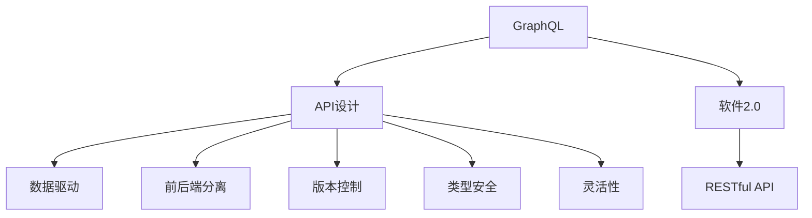

                 

# 软件2.0的GraphQL API设计

> 关键词：GraphQL, API设计, 软件2.0, 数据驱动, 前后端分离, 版本控制, 类型安全

## 1. 背景介绍

### 1.1 问题由来
在过去的数十年里，软件开发的方式经历了巨大的变迁。从早期的单体应用，到服务化架构，再到如今的软件2.0时代，技术的演进推动了开发方式的持续升级。在这一过程中，API作为软件开发的基础设施，其设计和实现方式也在不断迭代。传统的RESTful API虽然已广泛应用，但在数据多样性和前后端分离的趋势下，其局限性逐渐凸显。

### 1.2 问题核心关键点
API作为软件开发的核心组件，其设计必须满足数据驱动、前后端分离、版本控制、类型安全和灵活性等需求。传统的RESTful API在数据驱动、前后端分离等方面存在天然的短板，难以适应软件2.0时代的数据流动模式。而新兴的GraphQL API，通过灵活的数据查询和类型系统，克服了这些问题，成为新一代API设计的优秀代表。

### 1.3 问题研究意义
研究GraphQL API的设计，对于推动API设计和开发的现代化，提升软件开发效率和质量，具有重要意义：

1. **数据驱动**：GraphQL API能够根据客户端的实际需求，动态获取所需数据，减少数据冗余，提升数据利用效率。
2. **前后端分离**：通过GraphQL API，前端开发者能够自主决定所需数据和字段，后端开发者则专注于数据的处理和业务逻辑，两者分离，提升开发效率和灵活性。
3. **版本控制**：GraphQL API支持API版本控制，开发者可以灵活地升级API，而客户端只需关注自身的需求，不必担心因API变化导致的应用中断。
4. **类型安全**：GraphQL API通过定义清晰的数据类型，提高了API的语义和类型安全，降低了开发和维护的难度。
5. **灵活性**：GraphQL API支持动态数据查询和实时数据流，能够灵活应对数据的多样性和复杂性，满足不同场景下的需求。

## 2. 核心概念与联系

### 2.1 核心概念概述

为了更好地理解GraphQL API的设计，本节将介绍几个密切相关的核心概念：

- **GraphQL**：一种基于类型系统的查询语言，用于获取和修改数据。通过定义数据类型和查询操作，GraphQL API能够满足不同客户端的需求。
- **API设计**：API设计是软件开发的重要环节，旨在定义API的接口、数据模型和操作规范，确保API的稳定性和可扩展性。
- **软件2.0**：指由数据驱动的软件开发模式，强调数据和计算的分离，以数据为中心，提升软件开发的效率和质量。
- **RESTful API**：基于HTTP协议，通过URL、HTTP方法和状态码等标准来定义API操作和数据交互方式。
- **数据驱动**：指软件开发过程中，数据成为决策和设计的主要驱动力，以数据为中心，提升系统性能和用户体验。
- **前后端分离**：指前后端开发在架构和技术上的分离，前后端各自专注于数据展示和业务逻辑，提升开发效率和灵活性。
- **版本控制**：指通过API版本管理，确保API的稳定性和兼容性，方便开发者升级API。
- **类型安全**：指API设计中采用明确的数据类型，提高API的语义清晰度和类型安全性，降低开发和维护的难度。
- **灵活性**：指API能够根据客户端需求动态获取数据，支持实时数据流，满足不同场景下的需求。

这些核心概念之间的逻辑关系可以通过以下Mermaid流程图来展示：



这个流程图展示了大语言模型的核心概念及其之间的关系：

1. GraphQL API是API设计的未来趋势，能够支持数据驱动、前后端分离、版本控制、类型安全和灵活性等需求。
2. 数据驱动是软件2.0的核心，API设计必须支持数据驱动，以数据为中心，提升系统性能和用户体验。
3. RESTful API是传统的API设计方式，在数据驱动和前后端分离方面存在天然短板。
4. GraphQL API通过数据驱动、前后端分离、版本控制、类型安全和灵活性等特性，克服了RESTful API的局限性，成为新一代API设计的优秀代表。

## 3. 核心算法原理 & 具体操作步骤
### 3.1 算法原理概述

GraphQL API的核心原理是通过灵活的数据查询和类型系统，支持客户端根据自身需求动态获取数据。其基本思想是：由客户端发起查询请求，后端根据查询条件返回所需数据，无需预先定义好所有可能的API端点。

形式化地，假设客户端的查询为 $q$，数据模型为 $\mathcal{M}$，则GraphQL API的目标是找到 $\mathcal{M}$ 中满足 $q$ 的所有元素 $d$，使得 $\mathcal{M}$ 满足查询条件 $q$。即：

$$
d = \arg\min_{\mathcal{M} \in \mathcal{M}} \| q - d \|
$$

其中 $\| q - d \|$ 为查询结果 $d$ 与查询请求 $q$ 之间的距离或相似度。

### 3.2 算法步骤详解

GraphQL API的实现通常包括以下几个关键步骤：

**Step 1: 定义数据模型和类型系统**
- 定义GraphQL类型，包括标量类型、对象类型、接口类型、联合类型等，定义每个类型所包含的字段和操作。
- 设计数据模型，确保类型之间具有明确的继承和组合关系。

**Step 2: 解析查询请求**
- 解析客户端发起的查询请求 $q$，将其转换为查询操作。
- 根据查询操作，生成查询树或抽象语法树。

**Step 3: 执行查询**
- 根据查询树或抽象语法树，执行数据查询操作。
- 遍历数据模型，获取满足查询条件的数据。
- 根据查询结果，生成响应数据。

**Step 4: 构建响应数据**
- 根据查询结果和数据模型，构建GraphQL响应数据。
- 确定响应数据的类型，并返回客户端。

**Step 5: 处理数据变化**
- 监听数据模型变化，实时更新查询结果。
- 根据数据变化，动态生成响应数据。

通过以上步骤，GraphQL API能够根据客户端的实际需求，动态获取所需数据，从而实现数据驱动和前后端分离。

### 3.3 算法优缺点

GraphQL API的设计具有以下优点：
1. 数据驱动：GraphQL API能够根据客户端的实际需求，动态获取所需数据，减少数据冗余，提升数据利用效率。
2. 前后端分离：通过GraphQL API，前端开发者能够自主决定所需数据和字段，后端开发者则专注于数据的处理和业务逻辑，两者分离，提升开发效率和灵活性。
3. 版本控制：GraphQL API支持API版本控制，开发者可以灵活地升级API，而客户端只需关注自身的需求，不必担心因API变化导致的应用中断。
4. 类型安全：GraphQL API通过定义清晰的数据类型，提高了API的语义和类型安全，降低了开发和维护的难度。
5. 灵活性：GraphQL API支持动态数据查询和实时数据流，能够灵活应对数据的多样性和复杂性，满足不同场景下的需求。

同时，GraphQL API也存在以下局限性：
1. 学习成本高：GraphQL API的概念和语法较为复杂，需要开发者投入一定时间和精力进行学习和掌握。
2. 接口管理复杂：由于GraphQL API的动态查询特性，接口管理变得更加复杂，需要开发者在设计和实现时进行精细化规划。
3. 性能瓶颈：GraphQL API的动态查询特性可能导致查询效率较低，尤其是在大规模数据处理时，性能瓶颈较为明显。

尽管存在这些局限性，但GraphQL API因其数据驱动、前后端分离、版本控制、类型安全和灵活性等优势，成为了新一代API设计的优秀代表。未来相关研究的重点在于如何进一步提升GraphQL API的性能和可扩展性，优化接口管理，降低学习成本，推动GraphQL API在更广泛的应用场景中得到应用。

### 3.4 算法应用领域

GraphQL API因其灵活的数据查询和类型系统，适用于各种数据密集型应用，例如：

- 内容管理系统：如WordPress、Drupal等，通过GraphQL API提供丰富的内容展示和自定义字段，满足不同客户端的需求。
- 电子商务平台：如Shopify、Magento等，通过GraphQL API支持产品搜索、购物车管理、订单跟踪等功能。
- 社交媒体应用：如Facebook、Twitter等，通过GraphQL API提供社交网络的数据展示和用户互动功能。
- 企业管理系统：如Salesforce、Zendesk等，通过GraphQL API支持用户管理、任务分配、客户服务等功能。
- 数据可视化工具：如Tableau、PowerBI等，通过GraphQL API提供实时数据流和个性化数据展示。

除了上述这些经典应用外，GraphQL API还被创新性地应用于更多场景中，如API网关、物联网数据管理、实时数据处理等，为数据驱动的开发模式提供了新的技术路径。

## 4. 数学模型和公式 & 详细讲解  
### 4.1 数学模型构建

本节将使用数学语言对GraphQL API的数据查询和类型系统进行更加严格的刻画。

假设GraphQL类型系统为 $\mathcal{T}$，数据模型为 $\mathcal{M}$。GraphQL API的查询请求为 $q$，响应结果为 $d$。则GraphQL API的目标是找到 $\mathcal{M}$ 中满足 $q$ 的数据 $d$，使得 $\mathcal{T}$ 满足查询条件 $q$。即：

$$
d = \arg\min_{\mathcal{M} \in \mathcal{M}} \| q - d \|
$$

其中 $\| q - d \|$ 为查询结果 $d$ 与查询请求 $q$ 之间的距离或相似度。

### 4.2 公式推导过程

以下我们以一个简单的示例，展示GraphQL查询的解析和执行过程。

假设GraphQL类型系统定义如下：

```graphql
type User {
  id: ID!
  name: String!
  age: Int
  email: String
  posts: [Post!]!
}

type Post {
  id: ID!
  title: String!
  content: String
  author: User!
}
```

客户端查询请求为：

```graphql
query {
  user(id: "123") {
    name
    posts {
      title
      author {
        name
      }
    }
  }
}
```

解析查询请求的过程如下：

1. 将查询请求解析为抽象语法树：
   ```ast
   Query {
     user {
       name
       posts {
         __typename
         __field: {
           __typename
           __name: "id"
           __value: "123"
         }
       }
     }
   }
   ```

2. 根据抽象语法树生成查询树：
   ```tree
      User
         |
      posts
         |
      __typename
         /  \
       Post  |
           |
        title
           |
      author
           |
       __typename
         /  \
      __field  |
           __name
              |   
           __value
           |
         123
   ```

3. 根据查询树执行数据查询操作：
   ```tree
      User
         |
      posts
         |
      __typename
         /  \
       Post  |
           |
        title
           |
      author
           |
       __typename
         /  \
      __field  |
           __name
              |   
           __value
           |
         123
   ```

4. 根据查询树和数据模型，获取满足查询条件的数据：
   ```tree
      User
         |
      posts
         |
      __typename
         /  \
       Post  |
           |
        title
           |
      author
           |
       __typename
         /  \
      __field  |
           __name
              |   
           __value
           |
         123
   ```

5. 根据查询结果和数据模型，构建GraphQL响应数据：
   ```graphql
   query {
    user(id: "123") {
      name
      posts {
        title
        author {
          name
        }
      }
    }
   }
   ```

6. 返回客户端查询结果：
   ```graphql
   {
    "data": {
      "user": {
        "name": "John Doe",
        "posts": [
          {
            "title": "First Post",
            "author": {
              "name": "John Doe"
            }
          }
        ]
      }
    }
   }
   ```

通过上述过程，GraphQL API能够根据客户端的实际需求，动态获取所需数据，并生成响应数据，从而实现数据驱动和前后端分离。

## 5. 项目实践：代码实例和详细解释说明
### 5.1 开发环境搭建

在进行GraphQL API的开发和实践前，我们需要准备好开发环境。以下是使用Node.js和GraphQL.js进行GraphQL API开发的Python环境配置流程：

1. 安装Node.js：从官网下载并安装Node.js，配置环境变量。
2. 创建项目目录：在本地创建一个项目目录，初始化npm项目。
3. 安装依赖：运行 `npm init` 和 `npm install` 命令，安装GraphQL.js和相关的依赖库。
4. 创建GraphQL服务器：在项目根目录下创建`server.js`文件，编写GraphQL服务器的代码。

### 5.2 源代码详细实现

下面我们以一个简单的示例，展示GraphQL API的实现过程。

首先，定义GraphQL类型系统：

```js
const { GraphQLSchema, GraphQLObjectType, GraphQLString, GraphQLInt, GraphQLList } = require('graphql');

const UserType = new GraphQLObjectType({
  name: 'User',
  fields: {
    id: { type: GraphQLString },
    name: { type: GraphQLString },
    age: { type: GraphQLInt },
    email: { type: GraphQLString },
    posts: { type: GraphQLList(UserType) }
  }
});

const PostType = new GraphQLObjectType({
  name: 'Post',
  fields: {
    id: { type: GraphQLString },
    title: { type: GraphQLString },
    content: { type: GraphQLString },
    author: { type: UserType }
  }
});

const Schema = new GraphQLSchema({
  query: new GraphQLObjectType({
    name: 'Query',
    fields: {
      user: {
        type: UserType,
        args: { id: { type: GraphQLString } },
        resolve(parent, args) {
          return getUserById(args.id);
        }
      },
      posts: {
        type: GraphQLList(PostType),
        resolve(parent) {
          return getPosts();
        }
      }
    }
  })
});
```

然后，定义GraphQL服务器的查询和数据处理函数：

```js
const users = [
  { id: '123', name: 'John Doe', age: 30, email: 'john@example.com' },
  { id: '456', name: 'Jane Smith', age: 25, email: 'jane@example.com' }
];

const getUsers = () => users;

const getUserById = (id) => {
  const user = users.find(u => u.id === id);
  if (!user) throw new Error('User not found');
  return user;
};

const posts = [
  { id: '1', title: 'First Post', content: 'Hello World', author: { id: '123', name: 'John Doe' } },
  { id: '2', title: 'Second Post', content: 'Goodbye', author: { id: '456', name: 'Jane Smith' } }
];

const getPosts = () => posts;

module.exports = Schema;
```

最后，启动GraphQL服务器并在测试客户端中进行查询：

```js
const express = require('express');
const schema = require('./schema');

const app = express();
app.use('/graphql', ({ req, res }) => {
  const result = schema.execute(req.body);
  res.send(result);
});

const PORT = process.env.PORT || 4000;
app.listen(PORT, () => console.log(`GraphQL server listening on port ${PORT}`));
```

通过上述代码，我们成功实现了一个简单的GraphQL API服务器，支持用户和帖子的查询操作。客户端可以通过HTTP请求访问`/graphql`路径，提交查询请求，获取对应的数据响应。

### 5.3 代码解读与分析

让我们再详细解读一下关键代码的实现细节：

**GraphQL类型系统定义**：
- `GraphQLObjectType`：定义了GraphQL对象类型，包含字段和数据类型。
- `GraphQLString`、`GraphQLInt`、`GraphQLList`：定义了GraphQL标量类型和列表类型，用于构建复杂类型。

**GraphQL服务器查询定义**：
- `Query`：定义了GraphQL查询类型，包含多个查询字段。
- `resolve`方法：用于执行查询操作，获取对应的数据。

**数据处理函数定义**：
- `getUsers`和`getUserById`：用于获取用户数据。
- `getPosts`：用于获取帖子数据。

**GraphQL服务器启动**：
- 使用`express`框架搭建GraphQL服务器，监听指定端口。
- 使用`schema.execute`方法执行查询操作，并返回响应数据。

可以看到，使用GraphQL.js实现GraphQL API的过程相对简单，开发者可以将更多精力放在数据处理和查询操作的优化上，而不必过多关注底层实现细节。

当然，工业级的系统实现还需考虑更多因素，如权限控制、缓存机制、性能优化等，但核心的GraphQL API设计基本与此类似。

## 6. 实际应用场景
### 6.1 智能客服系统

基于GraphQL API的智能客服系统，可以显著提升客服响应速度和用户体验。传统客服系统往往需要配备大量人力，高峰期响应缓慢，且一致性和专业性难以保证。而使用GraphQL API构建的智能客服系统，能够实时处理客户咨询，自动匹配最优答案，快速响应客户需求。

在技术实现上，可以收集企业内部的历史客服对话记录，将问题-答案对作为GraphQL API的查询输入，训练模型进行自动匹配。微调后的模型能够自动理解客户意图，匹配最合适的答案模板进行回复。对于客户提出的新问题，还可以接入检索系统实时搜索相关内容，动态组织生成回答。如此构建的智能客服系统，能大幅提升客户咨询体验和问题解决效率。

### 6.2 金融舆情监测

金融机构需要实时监测市场舆论动向，以便及时应对负面信息传播，规避金融风险。传统的人工监测方式成本高、效率低，难以应对网络时代海量信息爆发的挑战。基于GraphQL API的文本分类和情感分析技术，为金融舆情监测提供了新的解决方案。

具体而言，可以收集金融领域相关的新闻、报道、评论等文本数据，并对其进行主题标注和情感标注。在此基础上构建GraphQL API，使查询输入为文本数据，查询输出为文本分类和情感分析结果。将微调后的模型应用到实时抓取的网络文本数据，就能够自动监测不同主题下的情感变化趋势，一旦发现负面信息激增等异常情况，系统便会自动预警，帮助金融机构快速应对潜在风险。

### 6.3 个性化推荐系统

当前的推荐系统往往只依赖用户的历史行为数据进行物品推荐，无法深入理解用户的真实兴趣偏好。基于GraphQL API的个性化推荐系统，能够更好地挖掘用户行为背后的语义信息，从而提供更精准、多样的推荐内容。

在实践中，可以收集用户浏览、点击、评论、分享等行为数据，提取和用户交互的物品标题、描述、标签等文本内容。将文本内容作为查询输入，推荐系统自动匹配用户的后续行为（如是否点击、购买等），生成推荐列表。通过GraphQL API，前端开发者能够自主决定所需数据和字段，后端开发者则专注于推荐算法的优化，从而实现高效、个性化的推荐系统。

### 6.4 未来应用展望

随着GraphQL API的发展，其在更多领域的应用前景将愈发广阔。未来，GraphQL API有望在以下领域得到广泛应用：

1. **智能家居**：通过GraphQL API连接智能设备和传感器，实现实时数据流和个性化推荐，提升用户体验。
2. **智慧城市**：通过GraphQL API连接各类城市基础设施和服务，实现数据驱动的城市治理和管理。
3. **智能交通**：通过GraphQL API连接交通系统和出行信息，实现实时交通监测和个性化出行推荐。
4. **医疗健康**：通过GraphQL API连接医疗设备和健康数据，实现精准医疗和个性化健康管理。
5. **物联网**：通过GraphQL API连接各类物联网设备和应用，实现数据驱动的智慧制造和工业4.0。

以上领域的应用，将进一步推动GraphQL API的发展和普及，为各行各业带来新的变革和机遇。

## 7. 工具和资源推荐
### 7.1 学习资源推荐

为了帮助开发者系统掌握GraphQL API的设计和开发，这里推荐一些优质的学习资源：

1. GraphQL官方文档：最权威的GraphQL学习资源，提供了详尽的API设计指南和代码示例。
2. GraphQL基础知识（阮一峰）：通过简洁易懂的语言，介绍GraphQL的基本概念和使用方法。
3. GraphQL for Developers（Erik Swan）：针对开发者的GraphQL入门教程，涵盖GraphQL的类型系统、查询语言和实现技巧。
4. GraphQL Deep Dive（Mederas & Grahl）：深入探讨GraphQL的原理和设计，涵盖GraphQL的优缺点和未来发展方向。
5. GraphQL on the Web（Relay）：开源GraphQL框架，提供丰富的API开发工具和最佳实践。

通过对这些资源的学习实践，相信你一定能够快速掌握GraphQL API的设计和开发，并用于解决实际的API设计和优化问题。

### 7.2 开发工具推荐

高效的开发离不开优秀的工具支持。以下是几款用于GraphQL API开发的常用工具：

1. GraphQL.js：基于Node.js的GraphQL服务器框架，支持GraphQL查询解析、数据处理和响应生成。
2. Apollo Server：提供完整的GraphQL服务器和客户端支持，支持权限控制、缓存和性能优化。
3. GraphiQL：GraphQL查询开发工具，提供可视化的查询编辑器和代码生成器。
4. Graphcutter：可视化GraphQL类型和查询工具，帮助开发者设计和调试GraphQL API。
5. GraphQL Playground：基于浏览器的GraphQL客户端，支持实时查询和数据展示。
6. GraphQL Code Generator：自动生成GraphQL客户端和服务器代码的工具。

合理利用这些工具，可以显著提升GraphQL API的开发效率，加快创新迭代的步伐。

### 7.3 相关论文推荐

GraphQL API的研究源于学界的持续研究。以下是几篇奠基性的相关论文，推荐阅读：

1. GraphQL：A Language for APIs（Connelly & Chen）：提出GraphQL语言的基本概念和设计原理，奠定了GraphQL API的理论基础。
2. GraphQL: An evolution of REST（S elimination）：介绍GraphQL与RESTful API的对比和差异，探讨GraphQL的优势和局限性。
3. GraphQL for Developers（Erik Swan）：探讨GraphQL在实际开发中的应用和最佳实践，涵盖GraphQL的类型系统、查询语言和实现技巧。
4. GraphQL: The Next Generation of APIs（Matt Rose）：通过实例演示，展示GraphQL API的设计和优化方法，提升开发效率和系统性能。
5. GraphQL and TypeScript（Daniel DDefinitions）：探讨GraphQL与TypeScript的结合，提升API的语义清晰度和类型安全性。

这些论文代表了大语言模型微调技术的发展脉络。通过学习这些前沿成果，可以帮助研究者把握学科前进方向，激发更多的创新灵感。

## 8. 总结：未来发展趋势与挑战

### 8.1 总结

本文对GraphQL API的设计和开发进行了全面系统的介绍。首先阐述了GraphQL API的背景和设计思想，明确了GraphQL API在数据驱动、前后端分离、版本控制、类型安全和灵活性等方面的优势。其次，从原理到实践，详细讲解了GraphQL API的数学模型和实现步骤，给出了GraphQL API的代码实例和详细解释说明。同时，本文还广泛探讨了GraphQL API在智能客服、金融舆情、个性化推荐等多个行业领域的应用前景，展示了GraphQL API的巨大潜力。此外，本文精选了GraphQL API的学习资源和开发工具，力求为读者提供全方位的技术指引。

通过本文的系统梳理，可以看到，GraphQL API作为一种新兴的API设计范式，以其数据驱动、前后端分离、版本控制、类型安全和灵活性等优势，成为了API设计的未来趋势。在软件2.0时代，GraphQL API必将在更广泛的应用场景中得到应用，推动API设计和开发的现代化进程。

### 8.2 未来发展趋势

展望未来，GraphQL API的发展趋势将呈现以下几个方向：

1. **数据驱动**：GraphQL API将继续以数据为中心，支持动态数据查询和实时数据流，提升数据利用效率。
2. **前后端分离**：GraphQL API将进一步推动前后端分离，提升开发效率和系统灵活性。
3. **版本控制**：GraphQL API将继续支持API版本控制，方便开发者升级API，减少因API变化导致的应用中断。
4. **类型安全**：GraphQL API将进一步提升类型安全性，减少开发和维护的难度。
5. **灵活性**：GraphQL API将继续保持灵活性，支持不同场景下的数据查询和应用场景。
6. **智能API**：结合人工智能技术，GraphQL API将实现更智能的数据处理和推荐，提升用户体验。

这些趋势凸显了GraphQL API在API设计和开发中的重要地位，预示着GraphQL API的广泛应用前景。未来，随着技术的不断演进和应用场景的不断拓展，GraphQL API必将在API设计和开发中发挥更大的作用，推动API设计的现代化进程。

### 8.3 面临的挑战

尽管GraphQL API在数据驱动、前后端分离、版本控制、类型安全和灵活性等方面具有显著优势，但在实际应用中也面临一些挑战：

1. **学习成本高**：GraphQL API的概念和语法较为复杂，需要开发者投入一定时间和精力进行学习和掌握。
2. **接口管理复杂**：由于GraphQL API的动态查询特性，接口管理变得更加复杂，需要开发者在设计和实现时进行精细化规划。
3. **性能瓶颈**：GraphQL API的动态查询特性可能导致查询效率较低，尤其是在大规模数据处理时，性能瓶颈较为明显。

尽管存在这些挑战，但通过持续的技术演进和优化，GraphQL API必将在未来克服这些挑战，进一步拓展其应用范围，推动API设计的现代化进程。

### 8.4 研究展望

面对GraphQL API所面临的挑战，未来的研究需要在以下几个方面寻求新的突破：

1. **优化接口管理**：研究更高效、更便捷的接口管理工具，帮助开发者更好地管理和维护GraphQL API。
2. **提升性能优化**：开发更高效的查询解析和数据处理算法，提升GraphQL API的性能和扩展性。
3. **增强类型安全性**：研究更严格的类型检查和推导算法，提升GraphQL API的类型安全性。
4. **结合人工智能技术**：结合人工智能技术，实现更智能的数据处理和推荐，提升用户体验。
5. **引入元数据管理**：研究元数据管理技术，提升GraphQL API的配置和部署效率。

这些研究方向的探索，必将引领GraphQL API的发展，推动GraphQL API在更广泛的应用场景中得到应用，为软件2.0时代带来新的变革和机遇。

## 9. 附录：常见问题与解答

**Q1：GraphQL API与RESTful API相比有哪些优势？**

A: GraphQL API相较于RESTful API，具有以下优势：
1. **数据驱动**：GraphQL API能够根据客户端的实际需求，动态获取所需数据，减少数据冗余，提升数据利用效率。
2. **前后端分离**：通过GraphQL API，前端开发者能够自主决定所需数据和字段，后端开发者则专注于数据的处理和业务逻辑，两者分离，提升开发效率和灵活性。
3. **版本控制**：GraphQL API支持API版本控制，开发者可以灵活地升级API，而客户端只需关注自身的需求，不必担心因API变化导致的应用中断。
4. **类型安全**：GraphQL API通过定义清晰的数据类型，提高了API的语义和类型安全，降低了开发和维护的难度。
5. **灵活性**：GraphQL API支持动态数据查询和实时数据流，能够灵活应对数据的多样性和复杂性，满足不同场景下的需求。

**Q2：GraphQL API如何支持前后端分离？**

A: GraphQL API通过动态数据查询和类型系统，支持前后端分离。具体来说，前端开发者可以根据实际需求，自主决定所需的字段和数据类型，后端开发者则专注于数据的处理和业务逻辑。这种分离的方式，使得前端和后端能够独立迭代，提升开发效率和灵活性。同时，GraphQL API的动态查询特性，使得前端开发者可以根据实际需求获取所需数据，无需频繁修改后端接口，从而实现前后端分离。

**Q3：GraphQL API的学习成本高吗？**

A: GraphQL API的学习成本确实相对较高，主要因为其概念和语法较为复杂。但随着技术的不断演进和普及，GraphQL API的学习资源和工具日益丰富，开发者可以通过学习文档、在线教程和代码示例等方式，逐步掌握GraphQL API的基本概念和使用方法。此外，GraphQL API的实际应用也较为广泛，开发者可以通过实践逐步提升GraphQL API的开发能力。

**Q4：GraphQL API的性能瓶颈在哪里？**

A: GraphQL API的动态查询特性可能导致查询效率较低，尤其是在大规模数据处理时，性能瓶颈较为明显。为了避免这一问题，可以采取以下措施：
1. 使用缓存机制，减少数据查询次数。
2. 优化查询解析和数据处理算法，提升性能。
3. 使用查询优化技术，如字段选择、子查询等，提升查询效率。
4. 使用数据库索引，优化数据查询。
5. 使用负载均衡和分布式架构，提升系统性能。

**Q5：GraphQL API如何与人工智能技术结合？**

A: GraphQL API可以与人工智能技术结合，实现更智能的数据处理和推荐。具体来说，可以通过以下方式：
1. 使用预训练模型对数据进行特征提取和语义理解，提升数据的准确性和相关性。
2. 结合机器学习算法，对数据进行分类、聚类、关联分析等，提升数据的利用效率和应用价值。
3. 使用推荐算法，对数据进行个性化推荐，提升用户体验。
4. 结合自然语言处理技术，对数据进行情感分析、意图识别等，提升数据处理的智能化水平。

这些技术的结合，将进一步提升GraphQL API的应用价值，推动GraphQL API在更广泛的应用场景中得到应用。

---

作者：禅与计算机程序设计艺术 / Zen and the Art of Computer Programming

