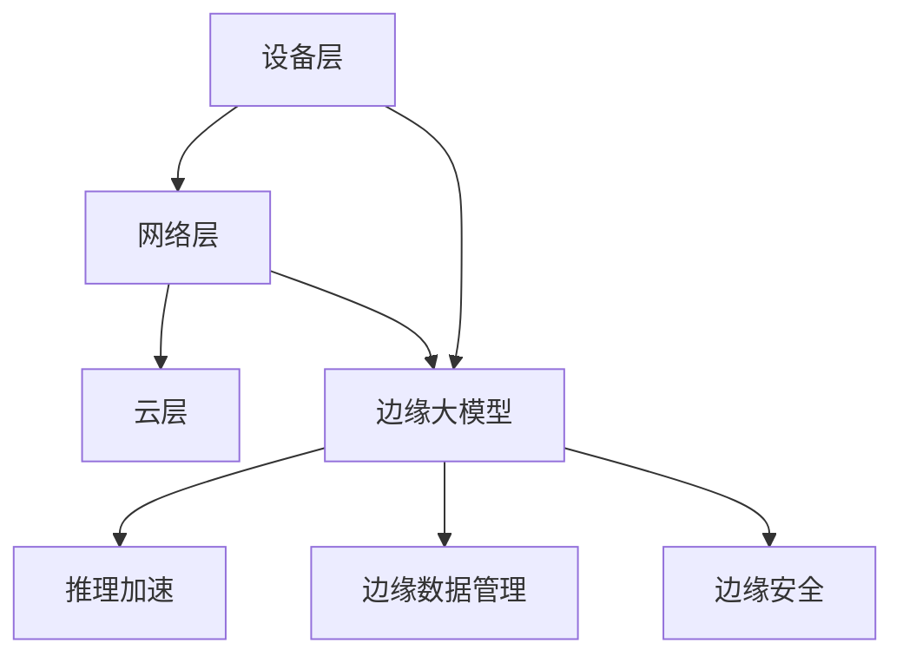

                 

## 1. 背景介绍

随着5G时代的到来，边缘计算成为推动智能应用发展的重要技术之一。传统集中式计算模式面临带宽限制、延迟和成本问题，无法满足对实时性和低延迟要求较高的应用场景。边缘计算通过将数据处理和决策推向数据源附近，实现了更快速的响应和更低的延迟，优化了资源的利用，提升了用户体验。

在这一背景下，边缘大模型（Edge Large Models）应运而生，将大规模预训练语言模型与边缘计算技术结合，实现了自然语言处理（NLP）等智能应用的落地。边缘大模型不仅具备通用大模型的语言理解能力，还能在边缘计算的框架下，进行实时推理和推理加速，解决了大模型在移动设备和边缘设备上的应用问题。

本文将系统介绍边缘大模型，包括其核心概念、技术原理、实践方法，以及未来发展趋势和挑战，力求为读者提供全面的理论知识和实践指导。

## 2. 核心概念与联系

### 2.1 核心概念概述

边缘计算（Edge Computing）是指在数据产生地或接近数据源处进行数据处理和决策，以减少数据传输的延迟和带宽消耗。边缘计算分为三层：
- 设备层：如手机、传感器等移动设备。
- 网络层：如边缘服务器、微基站、Fog节点等。
- 云层：如中心服务器、数据中心等。

边缘大模型（Edge Large Models）指的是在边缘计算环境下部署的、具备大规模预训练语言模型特征的模型。与传统的集中式大模型相比，边缘大模型在计算资源、存储资源和网络带宽等方面有更多限制，但通过优化模型结构和推理算法，可以在边缘设备上高效运行。

### 2.2 核心概念原理和架构的 Mermaid 流程图



- **设备层**：负责数据采集和初步处理，通过传感器等设备收集数据。
- **网络层**：在边缘服务器上进行模型推理和推理加速，将计算结果发送回设备层。
- **云层**：用于大规模数据存储和模型微调，支持边缘大模型的持续优化。

在边缘计算框架下，边缘大模型具备以下特点：
1. **实时推理**：在数据产生地附近快速进行推理，减少延迟。
2. **推理加速**：通过模型压缩和量化等技术，优化推理速度和计算效率。
3. **数据管理**：在边缘设备上进行数据处理和存储，避免数据传输到云端。
4. **安全防护**：在本地进行数据加密和隐私保护，防止数据泄露。

## 3. 核心算法原理 & 具体操作步骤

### 3.1 算法原理概述

边缘大模型的核心算法原理基于大规模预训练语言模型（如BERT、GPT等），通过在大规模无标签文本数据上进行预训练，学习语言的通用表示。在预训练基础上，通过在边缘计算环境中对模型进行微调和优化，使其能够在边缘设备上进行高效的推理和推理加速。

边缘大模型的推理加速方法主要包括：
- **模型压缩**：使用参数剪枝、量化、蒸馏等技术，减小模型大小，提升推理速度。
- **模型量化**：将浮点数模型转换为定点数模型，减少计算精度损失，提升计算效率。
- **推理优化**：通过算术优化、内存优化、并行化等技术，加速推理过程。

### 3.2 算法步骤详解

1. **预训练模型准备**：选择合适的预训练语言模型，如BERT、GPT等，在无标签数据上进行预训练。
2. **边缘环境部署**：将预训练模型部署到边缘计算环境中，如边缘服务器、微基站等。
3. **模型微调**：根据特定应用场景的需求，收集少量标注数据，使用微调技术优化模型。
4. **推理加速**：对微调后的模型进行推理优化，使用模型压缩、量化等技术提升推理速度。
5. **推理测试**：在边缘设备上测试模型的推理速度和准确性，调整参数以优化性能。

### 3.3 算法优缺点

**优点**：
1. **实时性高**：在边缘设备上推理，响应时间大大缩短，满足了对实时性要求较高的应用场景。
2. **可靠性高**：减少了对中心服务器的依赖，提高了系统的可靠性和鲁棒性。
3. **隐私保护**：数据在边缘设备上进行处理，减少了数据传输和存储的隐私风险。

**缺点**：
1. **计算资源受限**：边缘设备计算资源有限，无法承载大规模的模型和复杂的推理算法。
2. **模型更新难度大**：边缘设备的存储和计算资源有限，模型更新和维护困难。
3. **数据管理复杂**：需要在本地存储和管理数据，增加了数据管理的复杂性。

### 3.4 算法应用领域

边缘大模型在多个领域都有广泛的应用前景，以下是几个典型的应用场景：

1. **智能家居**：通过边缘大模型，实现语音识别、自然语言处理等智能家居功能。
2. **智能交通**：在边缘计算设备上部署边缘大模型，实现智能交通监控、自动驾驶等功能。
3. **医疗健康**：在边缘计算设备上部署边缘大模型，实现远程医疗咨询、智能诊断等功能。
4. **工业物联网**：在工业物联网设备上部署边缘大模型，实现设备健康监测、故障预测等功能。
5. **智慧城市**：在智慧城市边缘计算设备上部署边缘大模型，实现城市管理、环境监测等功能。

## 4. 数学模型和公式 & 详细讲解 & 举例说明

### 4.1 数学模型构建

边缘大模型的推理过程可以表示为一个线性变换和激活函数的组合。设输入为 $\mathbf{x}$，模型参数为 $\mathbf{W}$，输出为 $\mathbf{y}$，则推理过程可以表示为：

$$
\mathbf{y} = \sigma(\mathbf{W}\mathbf{x})
$$

其中，$\sigma$ 为激活函数，如ReLU、Sigmoid、Tanh等。

### 4.2 公式推导过程

以ReLU激活函数为例，进行推理过程的公式推导。设 $\mathbf{x}$ 和 $\mathbf{W}$ 分别为输入和模型参数，则ReLU激活函数定义为：

$$
\sigma(x) = \begin{cases}
x & \text{if } x > 0 \\
0 & \text{if } x \leq 0
\end{cases}
$$

推理过程可以表示为：

$$
\mathbf{y} = \sigma(\mathbf{W}\mathbf{x})
$$

### 4.3 案例分析与讲解

假设我们有一个简单的边缘大模型，用于对文本进行情感分析。模型的输入为文本向量 $\mathbf{x}$，模型参数为 $\mathbf{W}$，输出为情感标签 $\mathbf{y}$。我们希望模型能够学习到文本中的情感信息，并将其转化为情感标签。

首先，我们需要在大规模无标签数据上对模型进行预训练，使其学习到通用的语言表示。然后，收集少量标注数据，使用微调技术对模型进行优化，使其能够适应特定的情感分析任务。最后，在边缘设备上对微调后的模型进行推理加速，以实现实时情感分析。

## 5. 项目实践：代码实例和详细解释说明

### 5.1 开发环境搭建

为了进行边缘大模型的开发和部署，需要以下开发环境：
1. **边缘计算平台**：如AWS IoT Edge、Microsoft Azure IoT Edge、Google Cloud IoT Edge等。
2. **深度学习框架**：如TensorFlow、PyTorch等。
3. **模型部署工具**：如TensorFlow Lite、PyTorch Mobile等。
4. **数据管理工具**：如AWS S3、Google Cloud Storage等。

### 5.2 源代码详细实现

以下是一个简单的边缘大模型的代码实现，用于进行文本情感分析：

```python
import tensorflow as tf
from tensorflow.keras.layers import Dense, Activation
from tensorflow.keras.models import Model

# 定义模型结构
input_layer = tf.keras.layers.Input(shape=(128,))
hidden_layer = Dense(128)(input_layer)
output_layer = Dense(1, activation='sigmoid')(hidden_layer)
model = Model(inputs=input_layer, outputs=output_layer)

# 编译模型
model.compile(optimizer='adam', loss='binary_crossentropy', metrics=['accuracy'])

# 训练模型
model.fit(x_train, y_train, epochs=10, batch_size=32)

# 推理预测
x_test = ...
y_pred = model.predict(x_test)
```

### 5.3 代码解读与分析

1. **输入层**：定义模型的输入，假设输入为128维的文本向量。
2. **隐藏层**：定义一个128维的全连接层，用于提取文本特征。
3. **输出层**：定义一个1维的输出层，使用sigmoid激活函数，输出情感标签。
4. **模型编译**：使用adam优化器和二元交叉熵损失函数进行模型编译。
5. **模型训练**：使用训练集对模型进行训练，设定训练轮数为10。
6. **推理预测**：对测试集进行推理预测，输出情感标签。

## 6. 实际应用场景

### 6.1 智能家居

边缘大模型可以在智能家居设备上部署，实现语音识别、自然语言处理等智能家居功能。用户可以通过语音指令控制家电，系统自动进行处理和响应。

例如，用户可以通过语音指令打开空调：

```
“打开客厅的空调”
```

系统接收到语音指令后，边缘大模型进行语音识别和自然语言处理，识别出用户的意图并调用空调控制API：

```python
import speech_recognition as sr
from intent_recognition import IntentRecognition

def handle_query(query):
    recognizer = sr.Recognizer()
    with sr.Microphone() as source:
        audio = recognizer.listen(source)
    text = recognizer.recognize_google(audio)
    intent = IntentRecognition(text)
    if intent == 'open_air_conditioner':
        空调控制.open()
    else:
        print('Sorry, I did not understand the query.')
```

### 6.2 智能交通

边缘大模型可以在智能交通监控设备上部署，实现交通流量监测、自动驾驶等功能。系统通过摄像头采集交通图像，边缘大模型进行图像识别和目标检测，生成交通监控数据。

例如，系统在路口检测到行人：

```python
import cv2
import yolov3

def detect_person(frame):
    model = yolov3.load('yolov3.weights', 'yolov3.cfg')
    results = model.detect(frame)
    return results
```

### 6.3 医疗健康

边缘大模型可以在医疗设备上部署，实现远程医疗咨询、智能诊断等功能。系统通过传感器收集患者数据，边缘大模型进行数据分析和疾病预测，生成健康报告。

例如，系统通过心电图监测患者心律：

```python
import ecg
from heart_monitor import HeartMonitor

def monitor_heart_rate(signal):
    monitor = HeartMonitor(signal)
    heart_rate = monitor.calculate_heart_rate()
    return heart_rate
```

### 6.4 未来应用展望

随着5G时代的到来，边缘计算技术将进一步普及和应用，边缘大模型的应用前景也将更加广阔。未来，边缘大模型将在更多领域实现落地应用，带来更加智能、高效的解决方案。

## 7. 工具和资源推荐

### 7.1 学习资源推荐

1. **《边缘计算原理与实践》**：深入讲解边缘计算的原理和实现方法，适合入门学习和进阶研究。
2. **《TensorFlow边缘计算实战》**：讲解TensorFlow在边缘计算中的应用，提供丰富的项目实践案例。
3. **《边缘大模型实践指南》**：详细介绍边缘大模型的开发和部署流程，提供实用工具和资源。

### 7.2 开发工具推荐

1. **AWS IoT Edge**：AWS提供的边缘计算平台，支持多种编程语言和框架，易于使用。
2. **Microsoft Azure IoT Edge**：微软提供的边缘计算平台，支持跨平台部署和应用。
3. **Google Cloud IoT Edge**：谷歌提供的边缘计算平台，提供丰富的API和工具支持。

### 7.3 相关论文推荐

1. **《Edge Learning: Bridging Machine Learning and Edge Computing》**：综述了边缘计算与机器学习的结合，介绍了边缘计算环境下的大模型优化方法。
2. **《Edge-Cloud Hybrid: A New Paradigm for Edge Learning》**：提出了一种边缘-云混合模型，适用于大规模数据推理和优化。
3. **《Edge AI for IoT: A Survey》**：综述了边缘人工智能技术在物联网中的应用，介绍了边缘大模型的部署和优化方法。

## 8. 总结：未来发展趋势与挑战

### 8.1 研究成果总结

边缘大模型结合了边缘计算和大规模预训练语言模型的优势，在实时性、可靠性和隐私保护等方面具有显著优势。通过模型压缩、量化、推理加速等技术，解决了大模型在边缘设备上的应用问题，带来了广泛的应用前景。

### 8.2 未来发展趋势

未来，边缘大模型将在以下几个方面持续发展：

1. **计算资源优化**：进一步优化模型结构和推理算法，提升边缘设备上的计算效率。
2. **推理加速技术**：引入新的推理加速技术，如模型量化、动态计算图、硬件加速等。
3. **联邦学习**：在边缘设备上进行数据和模型联合训练，提升模型泛化能力和数据隐私保护。
4. **边缘协作**：通过边缘设备之间的协作，提升系统整体的计算能力和资源利用率。

### 8.3 面临的挑战

边缘大模型在实际应用中仍面临诸多挑战：

1. **计算资源限制**：边缘设备的计算资源有限，无法承载大规模的模型和复杂的推理算法。
2. **数据管理复杂**：需要在本地存储和管理数据，增加了数据管理的复杂性。
3. **模型更新困难**：边缘设备的存储和计算资源有限，模型更新和维护困难。
4. **安全防护不足**：边缘设备的计算和推理过程可能存在安全漏洞，需要加强安全防护。

### 8.4 研究展望

为应对上述挑战，未来的研究需要在以下几个方面寻求新的突破：

1. **模型压缩和量化技术**：进一步提升模型压缩和量化的效果，减少计算资源占用。
2. **边缘协作技术**：通过边缘设备之间的协作，提升系统整体的计算能力和资源利用率。
3. **联邦学习技术**：在边缘设备上进行数据和模型联合训练，提升模型泛化能力和数据隐私保护。
4. **安全防护技术**：加强边缘计算和推理过程的安全防护，防止数据泄露和攻击。

## 9. 附录：常见问题与解答

### 9.1 常见问题

1. **边缘大模型与中心大模型的区别是什么？**
   边缘大模型与中心大模型最大的区别在于计算资源的分布。中心大模型通常部署在数据中心，具有强大的计算资源和存储能力，适用于大规模数据处理和训练。而边缘大模型则部署在边缘设备上，计算资源和存储资源有限，但能够实现实时推理和推理加速。

2. **边缘大模型的优势有哪些？**
   边缘大模型能够在边缘设备上实现实时推理，减少了延迟，提升了响应速度。同时，通过模型压缩和量化等技术，优化了推理速度和计算效率，满足了对实时性要求较高的应用场景。

3. **边缘大模型在边缘设备上如何部署？**
   边缘大模型通常使用模型压缩和量化技术，减小模型大小，然后使用模型部署工具（如TensorFlow Lite、PyTorch Mobile等）进行部署。在边缘设备上，模型可以通过简单的API调用进行推理预测。

4. **边缘大模型在实际应用中存在哪些挑战？**
   边缘大模型在实际应用中存在计算资源限制、数据管理复杂、模型更新困难、安全防护不足等挑战。需要进一步优化模型结构和推理算法，提升系统整体的计算能力和资源利用率。

### 9.2 问题解答

1. **边缘大模型与中心大模型的区别是什么？**
   边缘大模型与中心大模型最大的区别在于计算资源的分布。中心大模型通常部署在数据中心，具有强大的计算资源和存储能力，适用于大规模数据处理和训练。而边缘大模型则部署在边缘设备上，计算资源和存储资源有限，但能够实现实时推理和推理加速。

2. **边缘大模型的优势有哪些？**
   边缘大模型能够在边缘设备上实现实时推理，减少了延迟，提升了响应速度。同时，通过模型压缩和量化等技术，优化了推理速度和计算效率，满足了对实时性要求较高的应用场景。

3. **边缘大模型在边缘设备上如何部署？**
   边缘大模型通常使用模型压缩和量化技术，减小模型大小，然后使用模型部署工具（如TensorFlow Lite、PyTorch Mobile等）进行部署。在边缘设备上，模型可以通过简单的API调用进行推理预测。

4. **边缘大模型在实际应用中存在哪些挑战？**
   边缘大模型在实际应用中存在计算资源限制、数据管理复杂、模型更新困难、安全防护不足等挑战。需要进一步优化模型结构和推理算法，提升系统整体的计算能力和资源利用率。

总之，边缘大模型在5G时代的智能应用中具有广阔的前景。通过结合边缘计算和大规模预训练语言模型，边缘大模型能够在边缘设备上实现实时推理和推理加速，提升系统的实时性和效率。同时，通过模型压缩和量化等技术，优化计算资源的使用，提升了系统的可用性和稳定性。未来，边缘大模型将在更多领域实现落地应用，带来更加智能、高效的解决方案。

