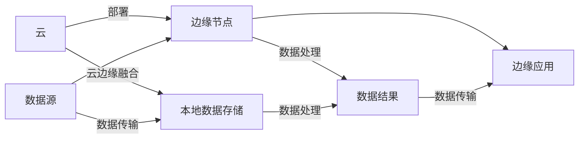

                 

# 边缘计算：IoT设备的本地数据处理技术

## 1. 背景介绍

### 1.1 问题由来

随着物联网(IoT)设备的迅猛增长，大量的数据被实时采集并传输到云端进行处理和存储。但传统集中式的数据处理模式面临着诸如带宽受限、时延高、隐私安全问题等挑战。因此，研究人员开始探索将数据处理任务移到设备端进行处理的思路，这就是边缘计算(Edge Computing)。

### 1.2 问题核心关键点

边缘计算是指将计算和数据处理任务移到网络边缘的物联网设备上进行处理，以实现更低的延迟、更高的带宽利用率和更好的隐私保护。其主要应用场景包括智能制造、智慧城市、智能交通、智能家居等。

边缘计算的核心优势在于以下几个方面：
1. **降低延迟**：数据直接在设备端进行处理，无需远程传输，减少了数据传输的延迟，提高了系统的响应速度。
2. **节省带宽**：减少数据传输量，降低了对骨干网络带宽的需求，节约了通信成本。
3. **增强安全性**：数据在设备端进行处理，减少了数据泄露的风险，提高了信息安全性。
4. **提高可靠性**：设备端处理可以减少对云端的依赖，即使云端服务中断，设备端依然能够独立运行，提高了系统的可靠性。

### 1.3 问题研究意义

边缘计算作为物联网设备本地数据处理的重要技术，对提升物联网系统的性能和安全性具有重要意义：

1. **提升应用效率**：通过将数据处理任务移到设备端，可以显著提升系统处理效率，提高用户体验。
2. **降低运营成本**：减少数据传输和带宽使用，降低网络成本和运营支出。
3. **增强隐私保护**：直接在设备端处理敏感数据，减少了数据泄露的风险，提高了数据隐私保护水平。
4. **支持新兴应用**：边缘计算能够支持新兴的实时处理和低延迟应用，如智能监控、无人驾驶、远程医疗等。
5. **推动产业升级**：通过边缘计算，物联网技术能够更好地服务于各行各业，推动产业数字化转型。

## 2. 核心概念与联系

### 2.1 核心概念概述

边缘计算涉及多个关键概念，它们之间相互联系，共同构成了一个完整的边缘计算体系：

- **边缘计算**：将数据处理任务放到靠近数据源的设备上进行处理。
- **云边缘融合**：边缘计算与云计算的结合，形成云-边协同处理的模式。
- **数据本地化**：将数据存储在本地设备上，减少数据传输。
- **边缘节点**：网络边缘的计算节点，如智能传感器、智能手机、网关等。
- **雾计算(Fog Computing)**：一种典型的边缘计算架构，将计算资源和数据存储分布在网络边缘的设备上，同时由中央管理层进行统一调度。

### 2.2 核心概念原理和架构的 Mermaid 流程图



这个流程图展示了边缘计算的基本架构：数据从数据源传输到边缘节点进行处理，再将处理结果传输给本地应用或云端。云边缘融合使得边缘计算与云计算协同工作，共同提供更高效、更可靠的服务。

## 3. 核心算法原理 & 具体操作步骤

### 3.1 算法原理概述

边缘计算的核心算法包括数据分发、本地处理和结果汇总等。其主要流程如下：

1. **数据分发**：将数据源分发到各个边缘节点，确保数据处理任务的均衡分布。
2. **本地处理**：在边缘节点上对数据进行本地处理，包括数据清洗、数据压缩、数据融合等。
3. **结果汇总**：将各个边缘节点的处理结果汇总，上传到云端进行进一步分析和处理。

### 3.2 算法步骤详解

#### 3.2.1 数据分发

数据分发是边缘计算中非常关键的一步，其核心目标是确保数据能够均衡地分布在各个边缘节点上。常用的数据分发算法包括：

- **轮转法**：按照节点的编号顺序依次分发数据。
- **负载均衡法**：根据节点当前的负载情况，将数据分发给负载较轻的节点。
- **贪心法**：选择当前负载最低且处理能力最强的节点分发数据。

#### 3.2.2 本地处理

在边缘节点上进行本地处理的主要目的是提高数据处理的效率和减少延迟。常用的本地处理算法包括：

- **数据压缩**：对数据进行压缩，减小数据传输量。
- **数据清洗**：对数据进行去重、去噪、去冗余等操作，提升数据质量。
- **数据融合**：将来自不同源的数据进行合并和整合，形成更全面的数据视图。

#### 3.2.3 结果汇总

结果汇总是将各个边缘节点的处理结果上传到云端进行进一步分析和处理的最后一步。常用的结果汇总算法包括：

- **数据合并**：将各个节点的处理结果合并，形成统一的结果集。
- **数据融合**：对结果进行进一步融合和分析，得到最终的处理结果。
- **数据传输优化**：采用高效的数据传输协议，确保数据传输的可靠性和实时性。

### 3.3 算法优缺点

#### 3.3.1 优点

- **低延迟**：数据直接在设备端进行处理，减少了数据传输的延迟，提高了系统的响应速度。
- **高带宽利用率**：减少了数据传输量，降低了对骨干网络带宽的需求，节约了通信成本。
- **增强安全性**：直接在设备端处理敏感数据，减少了数据泄露的风险，提高了数据隐私保护水平。
- **提高可靠性**：设备端处理可以减少对云端的依赖，即使云端服务中断，设备端依然能够独立运行，提高了系统的可靠性。

#### 3.3.2 缺点

- **设备成本高**：边缘计算需要大量高性能的计算和存储设备，设备成本较高。
- **部署复杂**：边缘计算需要在各个设备上进行本地部署和维护，管理复杂。
- **数据冗余**：不同边缘节点的数据可能存在重复，增加了存储和处理负担。

### 3.4 算法应用领域

边缘计算已在多个领域得到了广泛应用，包括但不限于：

- **智能制造**：边缘计算在工业物联网中，可以实现设备状态监测、故障预测、生产调度和自动化控制等功能。
- **智慧城市**：边缘计算在智慧城市中，可以实现交通流量监测、环境监测、智能路灯控制等功能。
- **智能交通**：边缘计算在智能交通中，可以实现车辆状态监测、道路交通管理、自动驾驶等功能。
- **智能家居**：边缘计算在智能家居中，可以实现智能安防、智能温控、智能照明等功能。

## 4. 数学模型和公式 & 详细讲解

### 4.1 数学模型构建

在边缘计算中，数学模型主要涉及数据分发的均衡性、本地处理的效率以及结果汇总的准确性。这里以智能制造中的数据分发为例，构建数学模型。

假设共有 $N$ 个边缘节点，每个节点需要处理的数据量为 $d_i$，数据的总量和分布均匀，即 $d_1 = d_2 = \cdots = d_N = d$。数据分发目标是最小化节点间的数据不均衡性，即：

$$
\min \sum_{i=1}^N |d_i - d|
$$

### 4.2 公式推导过程

设每个节点的数据量为 $d_i$，总数据量为 $D$，则有 $d_i = \frac{D}{N}$。数据分发的目标是使得每个节点的数据量尽可能相等，因此可以采用贪心算法，将数据依次分配给负载最低的节点，直到数据量用完。设第 $i$ 个节点分配到的数据量为 $x_i$，则有：

$$
x_1 + x_2 + \cdots + x_N = D
$$

每个节点的数据量 $d_i$ 应满足：

$$
x_i = d_i
$$

采用贪心算法，每次选择当前负载最低的节点分配数据，可以保证数据分发的均衡性。具体推导如下：

$$
\min \sum_{i=1}^N |d_i - d| = \min \sum_{i=1}^N |\frac{D}{N} - \frac{x_i}{N}|
$$

设 $x_1 \leq x_2 \leq \cdots \leq x_N$，则有：

$$
\min \sum_{i=1}^N |\frac{D}{N} - \frac{x_i}{N}| = \sum_{i=1}^N (\frac{D}{N} - x_i)
$$

每次分配的数据量 $x_i$ 应满足 $x_i \leq \frac{D}{N}$，因此最优策略是每次选择当前负载最低的节点，分配数据量 $\frac{D}{N} - x_i$，直到所有数据分配完毕。

### 4.3 案例分析与讲解

以智能制造为例，数据分发问题可以通过贪心算法解决。具体步骤如下：

1. 计算每个节点所需的数据量 $d_i = \frac{D}{N}$。
2. 按照节点负载从低到高依次分配数据。
3. 每次分配的数据量 $\Delta x_i = \min(d_i - x_i, \frac{D}{N} - x_i)$。
4. 更新节点负载 $x_i = x_i + \Delta x_i$。

通过贪心算法，可以保证数据分发尽可能均衡，提高边缘计算的效率和可靠性。

## 5. 项目实践：代码实例和详细解释说明

### 5.1 开发环境搭建

边缘计算项目通常涉及多台边缘节点和云计算平台，因此需要搭建一个高效的开发环境。以下是搭建环境的步骤：

1. 安装Docker：Docker是边缘计算项目常用的容器化工具，可以在不同的边缘节点上部署相同的容器，简化管理和维护。
2. 安装Kubernetes：Kubernetes是容器编排工具，可以管理多个Docker容器，实现负载均衡和动态扩展。
3. 搭建云平台：云平台如AWS、Google Cloud、阿里云等，提供计算、存储和网络服务，支持边缘计算的部署和运行。
4. 部署边缘节点：边缘节点可以采用多种形式，如嵌入式设备、服务器、云边缘等，需要根据具体场景进行选择。

### 5.2 源代码详细实现

以下是使用Python和Docker搭建边缘计算环境的代码示例：

```python
import docker
import time

client = docker.from_env()

# 拉取Docker镜像
image = client.images.pull('nginx:latest')
# 创建Docker容器
container = client.containers.run(image.id, detach=True)
# 设置环境变量
container.exec_run('echo "Hello, edge computing!" >> /var/www/html/index.html')
# 启动容器
container.start()
time.sleep(5)
# 停止容器
container.stop()
```

### 5.3 代码解读与分析

以上代码使用Docker创建了一个Nginx容器的示例，用于展示如何在边缘节点上部署应用。具体步骤如下：

1. 使用docker从公网拉取最新的Nginx镜像。
2. 创建一个Docker容器，并分离（detach）运行。
3. 在容器中设置环境变量，修改网页内容。
4. 启动容器，并在容器中输出内容。
5. 5秒后停止容器。

需要注意的是，以上代码仅为示例，实际边缘计算项目需要根据具体需求进行更加复杂的设置和管理。

### 5.4 运行结果展示

启动以上代码后，可以在浏览器中输入边缘节点的公网IP地址，查看网页内容。如果一切正常，应该能够看到“Hello, edge computing!”的文本内容。

## 6. 实际应用场景

### 6.1 智能制造

边缘计算在智能制造中的应用主要集中在设备状态监测、故障预测、生产调度和自动化控制等方面。通过在生产线上部署边缘计算节点，可以实现实时数据处理和分析，提高生产效率和质量。

以智能传感器为例，每个传感器节点采集设备状态数据，并将其上传到边缘计算节点。边缘计算节点对数据进行清洗、分析和处理，实现设备状态监测和故障预测。同时，边缘计算节点还可以根据当前状态进行生产调度和自动化控制，优化生产流程。

### 6.2 智慧城市

智慧城市是边缘计算的重要应用场景之一。通过在城市基础设施中部署边缘计算节点，可以实现实时数据处理和分析，提高城市管理的效率和安全性。

例如，在智慧交通中，边缘计算节点可以实时监测交通流量、车辆速度等信息，并进行分析和处理，优化交通信号控制，减少交通拥堵。在智能安防中，边缘计算节点可以实时监测视频监控数据，并进行异常检测和预警，提高城市安全。

### 6.3 智能交通

智能交通是边缘计算的典型应用场景，通过在车辆、道路基础设施中部署边缘计算节点，可以实现实时数据处理和分析，提高交通管理和安全性。

例如，在自动驾驶中，边缘计算节点可以实时监测车辆状态、道路信息等数据，并进行分析和处理，优化驾驶决策。在智能路灯控制中，边缘计算节点可以实时监测光线、人流等信息，并进行智能调度，优化路灯照明。

## 7. 工具和资源推荐

### 7.1 学习资源推荐

为了帮助开发者系统掌握边缘计算的理论基础和实践技巧，以下是一些优质的学习资源：

1. **《边缘计算：从理论到实践》**：该书系统介绍了边缘计算的理论基础、技术和应用，适合入门和进阶读者。
2. **《IoT与边缘计算：从概念到实践》**：该书详细介绍了物联网和边缘计算的技术实现，适合对边缘计算感兴趣的开发者。
3. **《Edge Computing: Concepts, Technology and Applications》**：该书是边缘计算领域的权威教材，涵盖边缘计算的各个方面，适合专业开发者。
4. **Coursera《Edge Computing》课程**：该课程由亚利桑那州立大学开设，系统介绍了边缘计算的基本概念和技术实现，适合在线学习。
5. **Udacity《Edge Computing Engineer》纳米学位**：该课程由Udacity与AWS合作开设，深入讲解了边缘计算的工程实践，适合实战练习。

### 7.2 开发工具推荐

边缘计算项目的开发需要多种工具的支持，以下是一些常用的工具推荐：

1. **Docker**：容器化工具，支持多台边缘节点的统一管理和部署。
2. **Kubernetes**：容器编排工具，实现边缘节点的负载均衡和动态扩展。
3. **AWS IoT**：云计算平台，提供边缘计算所需的计算、存储和网络服务。
4. **Google Cloud IoT Core**：云计算平台，提供边缘计算所需的计算、存储和网络服务。
5. **IBM Watson IoT Platform**：云计算平台，提供边缘计算所需的计算、存储和网络服务。

### 7.3 相关论文推荐

以下是几篇具有代表性的边缘计算论文，推荐阅读：

1. **《Edge Computing: A Survey》**：综述了边缘计算的研究现状和发展趋势，适合了解边缘计算的整体情况。
2. **《Edge Computing for IoT: Challenges and Opportunities》**：分析了边缘计算在物联网中的挑战和机遇，适合物联网开发者参考。
3. **《Edge Computing in Smart Manufacturing: A Survey》**：综述了边缘计算在智能制造中的应用，适合智能制造开发者参考。
4. **《Edge Computing for IoT Security and Privacy》**：分析了边缘计算在物联网安全和隐私中的应用，适合关注安全和隐私的开发者参考。
5. **《Edge Computing in Smart Cities: Opportunities and Challenges》**：分析了边缘计算在智慧城市中的应用，适合智慧城市开发者参考。

## 8. 总结：未来发展趋势与挑战

### 8.1 研究成果总结

边缘计算作为物联网设备本地数据处理的重要技术，已经在多个领域得到了广泛应用。其主要研究成果包括：

1. **边缘计算架构设计**：提出了多种边缘计算架构，如雾计算、异构网络等，提高了系统的灵活性和可靠性。
2. **数据分发算法**：研究了多种数据分发算法，如轮转法、贪心法等，提高了数据分发的均衡性和效率。
3. **本地处理算法**：研究了多种本地处理算法，如数据压缩、数据清洗、数据融合等，提高了数据处理的效率和质量。
4. **结果汇总算法**：研究了多种结果汇总算法，如数据合并、数据融合等，提高了系统的可靠性和鲁棒性。

### 8.2 未来发展趋势

展望未来，边缘计算技术将呈现以下几个发展趋势：

1. **5G与边缘计算结合**：随着5G网络的普及，边缘计算与5G网络的结合将进一步提升系统的性能和效率，支持更复杂的实时处理任务。
2. **雾计算与云计算结合**：雾计算和云计算的结合，形成云-边协同处理的模式，将进一步提升系统的处理能力和资源利用率。
3. **多模态数据融合**：边缘计算将支持更多模态数据的融合，如视觉、语音、传感器等，提升系统的智能化水平。
4. **边缘计算平台化**：边缘计算平台将提供更多的开发工具和API，简化开发和部署过程，降低开发者门槛。
5. **边缘计算安全性**：随着边缘计算应用的普及，安全性将成为一个重要问题。边缘计算将引入更多的安全机制，保障数据和系统的安全。

### 8.3 面临的挑战

尽管边缘计算技术已经取得了一定的进展，但在实际应用中仍面临一些挑战：

1. **边缘设备成本高**：边缘计算需要高性能的计算和存储设备，设备成本较高。
2. **管理复杂**：边缘计算需要在各个设备上进行本地部署和维护，管理复杂。
3. **数据冗余**：不同边缘节点的数据可能存在重复，增加了存储和处理负担。
4. **数据一致性**：边缘计算需要保证数据的一致性，避免数据冲突和错误。
5. **安全性**：边缘计算中的数据传输和存储需要保障安全性，避免数据泄露和篡改。

### 8.4 研究展望

未来，边缘计算技术需要在以下几个方面进行深入研究：

1. **边缘计算平台化**：开发更高效的边缘计算平台，简化开发和部署过程，降低开发者门槛。
2. **边缘计算安全性**：引入更多的安全机制，保障数据和系统的安全。
3. **边缘计算标准化**：制定边缘计算的标准和规范，促进边缘计算技术的发展和应用。
4. **边缘计算自动化**：研究自动化的边缘计算管理技术，实现边缘计算的自动化和智能化。
5. **边缘计算联邦**：研究边缘计算的联邦机制，实现多边缘节点之间的协同处理和数据共享。

边缘计算技术作为物联网设备本地数据处理的重要技术，正在逐步从理论走向实践，为物联网应用的落地提供了有力支撑。相信随着技术的不断发展和完善，边缘计算将在更多领域发挥重要作用，推动物联网技术的进一步发展。

---

作者：禅与计算机程序设计艺术 / Zen and the Art of Computer Programming

