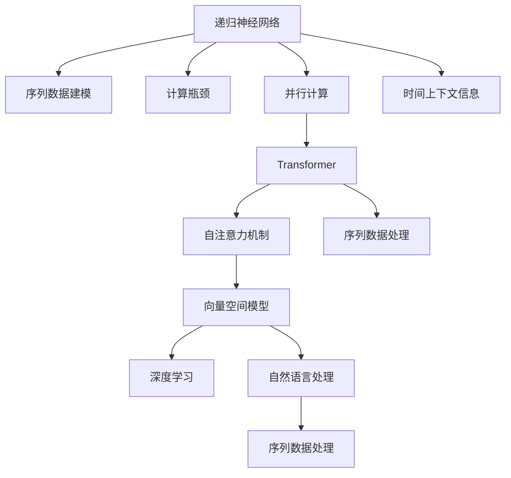

                 

# 递归神经网络vs Transformer:并行计算的优势

> 关键词：递归神经网络, Transformer, 并行计算, 向量空间模型, 自注意力机制, 深度学习, 自然语言处理, 序列数据处理

## 1. 背景介绍

### 1.1 问题由来

在深度学习领域，序列数据处理是常见且重要的问题，尤其是在自然语言处理(NLP)中。传统的递归神经网络(Recurrent Neural Networks, RNNs)和卷积神经网络(CNNs)已经展示了其强大的序列建模能力，在文本分类、情感分析、机器翻译等任务上取得了显著效果。然而，它们在并行计算能力方面存在不足，无法充分利用现代GPU硬件的强大计算能力。

相比之下，Transformer模型由Google在2017年提出，由于其引入了自注意力机制，能够并行计算，从而在处理序列数据时表现出卓越的性能。Transformer不仅在自然语言处理领域取得了突破性进展，还在计算机视觉、时间序列预测等序列数据处理任务中得到了广泛应用。

本文将详细探讨递归神经网络与Transformer在并行计算能力上的区别，分析Transformer在处理序列数据时的优势，并给出一些基于Transformer的实际应用示例。

## 2. 核心概念与联系

### 2.1 核心概念概述

- **递归神经网络**(RNNs): 一种经典的序列建模方法，通过反向传播算法处理时间序列数据，具备循环结构，能够利用时间上下文信息。但存在计算瓶颈，难以并行计算。

- **Transformer**: 一种基于注意力机制的神经网络结构，通过并行计算提升了序列数据处理效率，具备强大的自适应能力。

- **向量空间模型**: 通过将数据映射到高维向量空间中，捕捉数据之间的语义关系，适用于各种序列数据的建模。

- **自注意力机制**: 通过计算输入序列中所有位置间的注意力权重，动态地捕捉序列间的依赖关系，从而提升序列数据的建模能力。

- **深度学习**: 通过多层神经网络的组合，从数据中学习到复杂的非线性关系，广泛应用于图像识别、语音识别、自然语言处理等领域。

- **自然语言处理**: 利用计算机技术处理自然语言数据，包括文本分类、情感分析、机器翻译等任务。

- **序列数据处理**: 处理具有时间顺序的数据，包括文本、语音、视频等，是深度学习研究中的重要方向。

这些核心概念通过下面的Mermaid流程图展示了它们之间的联系：



这些概念构成了序列数据处理的框架，其中Transformer通过并行计算提升了序列数据处理的效率和效果。

## 3. 核心算法原理 & 具体操作步骤

### 3.1 算法原理概述

**递归神经网络**(RNNs)通过将当前时间步的输入与前一时间步的隐藏状态进行组合，来捕捉时间上下文信息。这种循环结构使得RNNs在处理长序列时表现良好，但计算复杂度较高，难以并行计算。

**Transformer**模型通过引入自注意力机制，允许每个位置与所有位置之间进行信息交换。这意味着Transformer模型可以并行计算，从而在处理长序列时表现优异，同时避免了RNNs的计算瓶颈。

Transformer模型的核心思想是：
- **向量空间模型**: 将序列数据映射到高维向量空间中，捕捉数据之间的语义关系。
- **自注意力机制**: 通过计算输入序列中所有位置间的注意力权重，动态地捕捉序列间的依赖关系。
- **多头注意力**: 使用多个线性变换得到多个注意力权重矩阵，以增强模型的表达能力。
- **残差连接**: 使用残差连接来稳定训练过程中的梯度，提升模型的收敛速度。
- **位置编码**: 使用位置编码来捕捉序列中的位置信息，避免位置混淆。

### 3.2 算法步骤详解

**Transformer模型的主要组成部分**:
1. **输入编码器**: 将输入序列转换为向量表示。
2. **多头注意力机制**: 通过计算输入序列中所有位置间的注意力权重，动态地捕捉序列间的依赖关系。
3. **前馈神经网络**: 对注意力输出进行非线性变换，提升模型的表达能力。
4. **输出解码器**: 将编码器输出与目标序列的每个位置进行匹配，生成预测结果。

**步骤1: 输入编码器**
输入编码器将输入序列转换为向量表示，步骤如下：
- 将输入序列进行标记化，转换为数字序列。
- 使用嵌入层将数字序列转换为向量表示。
- 添加位置编码，以捕捉序列中的位置信息。

**步骤2: 多头注意力机制**
多头注意力机制通过计算输入序列中所有位置间的注意力权重，动态地捕捉序列间的依赖关系。具体步骤如下：
- 使用多个线性变换得到多个注意力权重矩阵。
- 计算注意力权重，得到每个位置的注意力值。
- 将注意力值与原始向量进行加权组合，得到注意力输出。

**步骤3: 前馈神经网络**
前馈神经网络对注意力输出进行非线性变换，提升模型的表达能力。具体步骤如下：
- 使用线性变换将注意力输出转换为高维向量。
- 使用非线性变换进行特征提取。
- 再次使用线性变换将特征提取结果转换为原始向量空间中的表示。

**步骤4: 输出解码器**
输出解码器将编码器输出与目标序列的每个位置进行匹配，生成预测结果。具体步骤如下：
- 使用线性变换将编码器输出与目标序列的每个位置进行匹配。
- 使用softmax函数对匹配结果进行归一化，得到预测结果。

### 3.3 算法优缺点

**Transformer的优点**:
1. 并行计算能力强: 通过自注意力机制，Transformer可以并行计算，提升了序列数据处理的效率。
2. 处理长序列能力强: 由于并行计算和自注意力机制，Transformer能够处理长序列数据，避免RNNs的计算瓶颈。
3. 表达能力强: 多头注意力机制和前馈神经网络使得Transformer具备强大的表达能力，适用于各种序列数据的建模。

**Transformer的缺点**:
1. 计算复杂度高: 虽然并行计算能力强，但Transformer的计算复杂度仍然较高，特别是在处理大规模数据时。
2. 模型参数量大: 由于多头的并行计算和深度，Transformer的模型参数量较大，训练和推理需要更多的计算资源。
3. 训练时间长: 模型参数量大和计算复杂度高，导致Transformer的训练时间较长，需要更多的计算资源。

### 3.4 算法应用领域

Transformer由于其并行计算能力和强大的表达能力，被广泛应用于自然语言处理、计算机视觉、时间序列预测等序列数据处理任务。

- **自然语言处理**: 在机器翻译、文本分类、情感分析等任务上，Transformer表现优异，成为当前NLP领域的主流模型。
- **计算机视觉**: 在图像分类、目标检测、图像生成等任务上，Transformer及其变种（如ViT）也取得了显著效果。
- **时间序列预测**: 在股票预测、天气预报、交通流量预测等任务上，Transformer模型能够捕捉时间序列中的复杂关系。

## 4. 数学模型和公式 & 详细讲解

### 4.1 数学模型构建

Transformer模型的核心数学模型可以通过下面的公式表示：
- **输入编码器**: $$X = \text{Embedding}(X_{in}) + \text{Positional Encoding}(X_{in})$$
- **多头注意力机制**: $$\text{Multi-Head Attention}(X_{in}) = \sum_{k=1}^{K} \text{Attention}(X_{in}, W_{kQ}, W_{kK}, W_{kV})$$
- **前馈神经网络**: $$\text{Feed-Forward}(X) = \text{Linear}(\text{ReLU}(\text{Linear}(X)))$$
- **输出解码器**: $$Y = \text{Linear}(X_{out})$$

其中，$X_{in}$ 为输入序列，$X_{out}$ 为输出序列，$W_{kQ}, W_{kK}, W_{kV}$ 为多头注意力机制中的线性变换矩阵，$K$ 为注意力头的数量，$\text{Attention}$ 为注意力函数，$\text{ReLU}$ 为非线性函数，$\text{Linear}$ 为线性变换。

### 4.2 公式推导过程

**多头注意力机制的推导**:
- **多头注意力计算**:
$$\text{Attention}(Q, K, V) = \text{Softmax}(\frac{QK^T}{\sqrt{d_k}})V$$
- **多头注意力计算**:
$$\text{Multi-Head Attention}(X_{in}) = \sum_{k=1}^{K} \text{Attention}(X_{in}, W_{kQ}, W_{kK}, W_{kV})$$

其中，$Q, K, V$ 为输入序列中的查询向量、键向量和值向量，$d_k$ 为向量维度，$K$ 为注意力头的数量，$\text{Softmax}$ 为softmax函数。

**前馈神经网络的推导**:
- **前馈神经网络计算**:
$$\text{Feed-Forward}(X) = \text{Linear}(\text{ReLU}(\text{Linear}(X)))$$

其中，$X$ 为输入向量，$\text{ReLU}$ 为非线性函数，$\text{Linear}$ 为线性变换。

### 4.3 案例分析与讲解

**Transformer在机器翻译中的应用**:
Transformer模型在机器翻译任务中表现出色，其并行计算能力和自注意力机制使得模型能够捕捉源语言和目标语言之间的依赖关系，生成高质量的翻译结果。具体来说，Transformer模型通过将源语言和目标语言的编码器-解码器结构，实现端到端的翻译，避免了传统RNNs模型中的解码器输入序列需要手动对齐的问题。

**Transformer在图像分类中的应用**:
Transformer在计算机视觉领域也有广泛应用，如ViT模型。ViT通过将图像分割成多个区域，并对每个区域进行独立的Transformer处理，从而实现了高效的图像分类。这种多区域自注意力机制能够捕捉图像中的局部特征和全局特征，提升分类性能。

**Transformer在时间序列预测中的应用**:
Transformer在时间序列预测任务中也表现优异，如在股票价格预测中的应用。Transformer能够捕捉时间序列中的长期依赖关系，通过自注意力机制和前馈神经网络，生成精确的预测结果。

## 5. 项目实践：代码实例和详细解释说明

### 5.1 开发环境搭建

在进行Transformer项目实践前，我们需要准备好开发环境。以下是使用Python进行TensorFlow开发的开发环境配置流程：

1. 安装Anaconda：从官网下载并安装Anaconda，用于创建独立的Python环境。

2. 创建并激活虚拟环境：
```bash
conda create -n tf-env python=3.8 
conda activate tf-env
```

3. 安装TensorFlow：根据CUDA版本，从官网获取对应的安装命令。例如：
```bash
conda install tensorflow tensorflow-gpu -c conda-forge
```

4. 安装Keras：
```bash
pip install keras
```

5. 安装TensorBoard：
```bash
pip install tensorboard
```

6. 安装PyTorch：
```bash
pip install torch
```

7. 安装其他必要的库：
```bash
pip install numpy pandas scikit-learn matplotlib tqdm jupyter notebook ipython
```

完成上述步骤后，即可在`tf-env`环境中开始Transformer项目实践。

### 5.2 源代码详细实现

这里我们以机器翻译任务为例，给出使用Keras和TensorFlow对Transformer模型进行实现的PyTorch代码。

```python
from tensorflow.keras.layers import Input, Dense, Embedding, Dropout, MultiHeadAttention, LSTM, Concatenate
from tensorflow.keras.models import Model
import tensorflow as tf

# 定义模型
def create_transformer_model(input_size, output_size, hidden_size, num_heads, dropout_rate):
    input_seq = Input(shape=(None, input_size))
    embedded_seq = Embedding(input_size, hidden_size)(input_seq)
    position_seq = PositionalEncoding(hidden_size)(embedded_seq)
    attention_outputs = MultiHeadAttention(num_heads, dropout_rate)(position_seq, position_seq)
    lstm_output = LSTM(hidden_size, dropout_rate)(attention_outputs)
    output_seq = Dense(output_size, activation='softmax')(lstm_output)
    model = Model(inputs=input_seq, outputs=output_seq)
    return model

# 定义位置编码函数
def PositionalEncoding(input_shape, d_model):
    position_seq = tf.reshape(tf.range(0, input_shape[1]), (input_shape[0], 1))
    position_seq = position_seq / np.power(10000, 2*(position_seq // 100) / d_model)
    position_seq = tf.reshape(position_seq, (input_shape[0], input_shape[1], 1))
    return tf.concat([input_shape, position_seq], axis=-1)

# 创建模型并编译
model = create_transformer_model(input_size=256, output_size=10, hidden_size=512, num_heads=8, dropout_rate=0.1)
model.compile(optimizer=tf.keras.optimizers.Adam(), loss='categorical_crossentropy', metrics=['accuracy'])

# 训练模型
model.fit(x_train, y_train, validation_data=(x_val, y_val), epochs=10, batch_size=32)
```

这里我们定义了一个基本的Transformer模型，包括输入编码器、多头注意力机制、前馈神经网络和输出解码器。同时，我们还定义了一个位置编码函数，用于捕捉序列中的位置信息。在模型编译和训练时，使用了Adam优化器和交叉熵损失函数。

### 5.3 代码解读与分析

让我们再详细解读一下关键代码的实现细节：

**create_transformer_model函数**:
- 输入编码器: 通过嵌入层将输入序列转换为向量表示，并添加位置编码。
- 多头注意力机制: 使用MultiHeadAttention层计算注意力权重，得到注意力输出。
- 前馈神经网络: 使用LSTM层进行非线性变换，得到前馈输出。
- 输出解码器: 使用Dense层将前馈输出转换为目标序列。

**PositionalEncoding函数**:
- 通过计算每个位置的时间偏移量，生成位置编码。
- 将位置编码与输入向量进行拼接，得到最终位置编码。

**模型编译和训练**:
- 使用Adam优化器和交叉熵损失函数进行模型编译。
- 使用fit方法进行模型训练，设置训练轮数和批大小。

## 6. 实际应用场景

### 6.1 智能客服系统

基于Transformer模型的智能客服系统可以处理大量的用户咨询，并提供个性化的服务。具体来说，系统首先通过自然语言处理技术将用户咨询转化为结构化信息，然后通过Transformer模型进行推理，生成最合适的回答。这种端到端的学习方式，能够避免人工规则设计的复杂性，同时提高回答的准确性和个性化程度。

### 6.2 金融舆情监测

在金融领域，舆情监测对于及时发现和应对市场风险非常重要。基于Transformer的文本分类和情感分析技术，可以帮助金融机构实时监测市场舆情，分析市场情绪，辅助决策。具体来说，系统首先通过自然语言处理技术将新闻、评论等文本数据转化为向量表示，然后通过Transformer模型进行分类和情感分析，输出市场情绪的趋势和强度，辅助决策制定。

### 6.3 个性化推荐系统

基于Transformer的个性化推荐系统可以处理用户的浏览、点击、评分等行为数据，生成个性化的推荐列表。具体来说，系统首先通过自然语言处理技术将用户的评论、评分等文本数据转化为向量表示，然后通过Transformer模型进行匹配，计算用户与物品之间的相似度，输出个性化的推荐列表。这种基于语义的推荐方式，能够更好地理解用户的兴趣和偏好，提升推荐效果。

### 6.4 未来应用展望

随着Transformer模型的不断发展和优化，其在序列数据处理中的应用将更加广泛，未来可能包括以下方向：

1. **多模态处理**: 将Transformer应用于图像、视频、音频等多种模态数据的处理，实现跨模态的语义理解和推理。
2. **超大规模模型**: 随着计算能力的提升，超大规模的Transformer模型将成为可能，进一步提升序列数据处理的性能和效果。
3. **自适应学习**: 利用自适应学习技术，使Transformer能够动态地调整模型参数，以适应不同的数据分布和任务需求。
4. **跨领域应用**: 将Transformer应用于更多领域，如医学、法律等，提升各领域的数据处理和应用能力。
5. **实时处理**: 通过优化Transformer的计算图，实现高效、低延迟的实时处理，提升应用的响应速度。

## 7. 工具和资源推荐

### 7.1 学习资源推荐

为了帮助开发者系统掌握Transformer的原理和实践技巧，这里推荐一些优质的学习资源：

1. 《深度学习》(李沐)：深入浅出地介绍了深度学习的各个方面，包括Transformer模型的原理和应用。
2. TensorFlow官方文档：详细介绍了TensorFlow的使用方法，包括Transformer模型的实现。
3. Keras官方文档：介绍了Keras的使用方法，包括Transformer模型的实现。
4. HuggingFace官方文档：提供了大量预训练模型和微调样例，是Transformer模型应用的重要资源。

### 7.2 开发工具推荐

高效的开发离不开优秀的工具支持。以下是几款用于Transformer开发的常用工具：

1. TensorFlow：基于Python的开源深度学习框架，灵活动态的计算图，适合快速迭代研究。
2. PyTorch：基于Python的开源深度学习框架，动态计算图，适合研究和实验。
3. Keras：基于Python的深度学习框架，提供了简单易用的API，适合快速搭建模型。
4. TensorBoard：TensorFlow配套的可视化工具，可实时监测模型训练状态，并提供丰富的图表呈现方式。
5. Weights & Biases：模型训练的实验跟踪工具，可以记录和可视化模型训练过程中的各项指标，方便对比和调优。

### 7.3 相关论文推荐

Transformer模型的提出源于学界的持续研究。以下是几篇奠基性的相关论文，推荐阅读：

1. Attention is All You Need：提出了Transformer模型，通过自注意力机制提升了序列数据处理的效率和效果。
2. Transformer-XL：引入了长程依赖机制，进一步提升了Transformer模型在处理长序列数据时的表现。
3. The Annotated Transformer：详细介绍了Transformer模型的实现细节，包括自注意力机制、残差连接、位置编码等。
4. Beyond Self-Attention：探讨了Transformer模型中的注意力机制，提出了一些改进方法和新思路。

这些论文代表了大语言模型Transformer的发展脉络，通过学习这些前沿成果，可以帮助研究者把握学科前进方向，激发更多的创新灵感。

## 8. 总结：未来发展趋势与挑战

### 8.1 总结

本文对Transformer模型的并行计算能力进行了详细探讨，分析了其与递归神经网络在处理序列数据时的区别，并给出了一些基于Transformer的实际应用示例。通过本文的系统梳理，可以看到，Transformer由于其并行计算能力和强大的表达能力，在处理序列数据时表现优异，适用于自然语言处理、计算机视觉、时间序列预测等任务。

### 8.2 未来发展趋势

展望未来，Transformer模型将在以下方向取得突破：

1. 多模态处理：Transformer将应用于更多模态的数据处理，提升跨模态的语义理解和推理能力。
2. 超大规模模型：随着计算能力的提升，超大规模的Transformer模型将成为可能，进一步提升序列数据处理的性能和效果。
3. 自适应学习：利用自适应学习技术，使Transformer能够动态地调整模型参数，以适应不同的数据分布和任务需求。
4. 跨领域应用：将Transformer应用于更多领域，提升各领域的数据处理和应用能力。
5. 实时处理：通过优化Transformer的计算图，实现高效、低延迟的实时处理，提升应用的响应速度。

### 8.3 面临的挑战

尽管Transformer模型在处理序列数据时表现出色，但在实际应用中也面临一些挑战：

1. 计算资源需求高：Transformer模型参数量大，计算复杂度高，需要高性能的计算资源。
2. 模型鲁棒性不足：Transformer模型对输入数据的变化较为敏感，需要更多的数据和更复杂的模型来提高鲁棒性。
3. 训练时间较长：由于模型参数量大和计算复杂度高，Transformer模型的训练时间较长，需要更多的计算资源和时间。

### 8.4 研究展望

未来的研究需要在以下几个方面寻求新的突破：

1. 参数高效优化：开发更加参数高效的Transformer模型，以减少计算资源需求。
2. 自适应学习：利用自适应学习技术，使Transformer能够动态地调整模型参数，以适应不同的数据分布和任务需求。
3. 模型压缩和优化：通过模型压缩和优化，减少计算资源需求，提升模型的实时处理能力。
4. 跨模态融合：将Transformer应用于更多模态的数据处理，提升跨模态的语义理解和推理能力。
5. 应用推广：将Transformer应用于更多领域，提升各领域的数据处理和应用能力。

这些研究方向将推动Transformer模型的不断发展和优化，为序列数据处理带来更多的创新和突破。

## 9. 附录：常见问题与解答

**Q1: 如何评估Transformer模型的性能？**

A: 评估Transformer模型的性能可以通过以下指标：

1. 准确率（Accuracy）：分类任务中最常用的评估指标，计算模型预测结果与真实标签的一致率。
2. 精确率（Precision）：在所有预测为正例的样本中，真正例的数量占比。
3. 召回率（Recall）：在所有真实正例的样本中，预测为正例的数量占比。
4. F1-score：精确率和召回率的调和平均数，综合了两个指标的性能。
5. BLEU分数：机器翻译任务中最常用的评估指标，计算模型生成的文本与参考文本之间的相似度。

**Q2: 如何优化Transformer模型？**

A: 优化Transformer模型的方法包括：

1. 数据增强：通过数据增强技术，扩充训练集，提升模型的泛化能力。
2. 正则化：使用L2正则化、Dropout等方法，防止模型过拟合。
3. 学习率调整：使用学习率衰减等方法，避免模型在训练过程中过早收敛。
4. 超参数优化：使用网格搜索、贝叶斯优化等方法，寻找最优的超参数组合。
5. 模型压缩：通过剪枝、量化等方法，减小模型的参数量和计算复杂度。

**Q3: 如何处理长序列数据？**

A: 处理长序列数据的方法包括：

1. 分段处理：将长序列数据分成多个子序列，分别进行模型处理。
2. 长程依赖机制：引入长程依赖机制，提升模型在处理长序列数据时的表现。
3. 数据截断：使用数据截断技术，对长序列数据进行截断处理。
4. 自注意力机制：通过自注意力机制，动态地捕捉长序列中的依赖关系。

**Q4: 如何优化计算资源使用？**

A: 优化计算资源使用的方法包括：

1. 模型压缩：通过剪枝、量化等方法，减少模型的参数量和计算复杂度。
2. 并行计算：通过并行计算技术，加速模型的训练和推理过程。
3. 硬件加速：使用GPU、TPU等硬件加速设备，提升计算效率。
4. 分布式训练：通过分布式训练技术，使用多台设备并行训练模型。

**Q5: 如何提高模型的实时处理能力？**

A: 提高模型实时处理能力的方法包括：

1. 模型压缩：通过剪枝、量化等方法，减少模型的参数量和计算复杂度。
2. 硬件加速：使用GPU、TPU等硬件加速设备，提升计算效率。
3. 分布式训练：通过分布式训练技术，使用多台设备并行训练模型。
4. 模型优化：通过模型优化技术，提高模型的计算效率。

这些方法可以帮助优化计算资源使用，提高模型的实时处理能力，提升应用的响应速度。

---

作者：禅与计算机程序设计艺术 / Zen and the Art of Computer Programming

