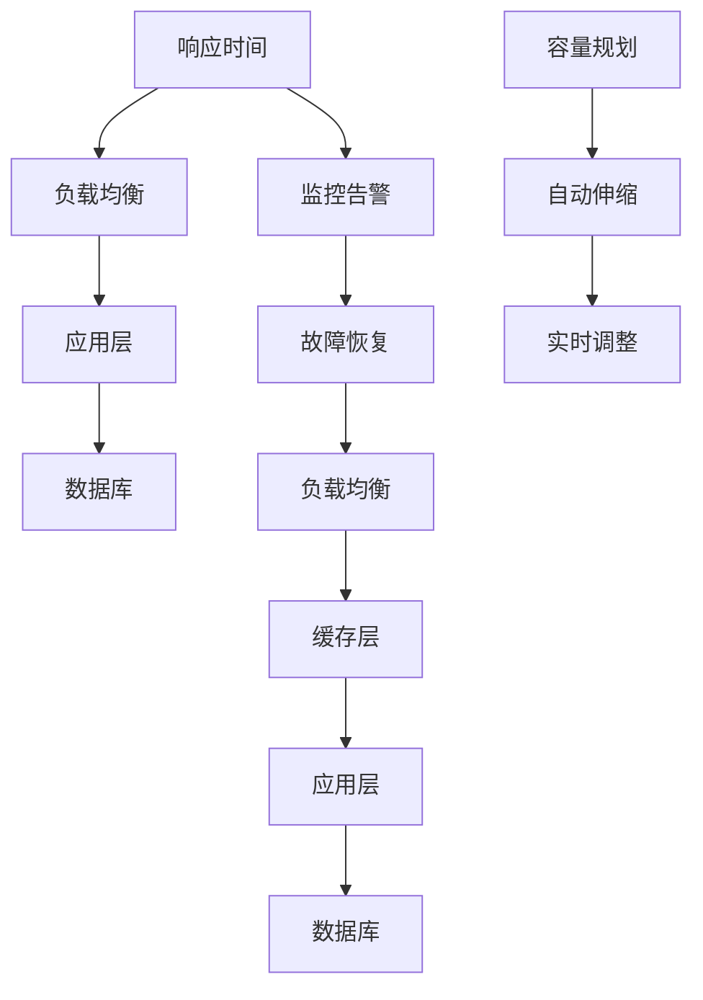

                 

# 通过响应时间监控实现高扩展性

> 关键词：高扩展性, 响应时间监控, 负载均衡, 容量规划, 自动伸缩, 服务端质量, 应用性能管理, 系统架构

## 1. 背景介绍

随着互联网和数字化转型的不断推进，企业对系统的要求越来越高。从早期的关注系统功能完整性，到如今的注重用户体验和系统稳定性，性能和扩展性逐渐成为企业关注的重点。对于高并发的应用系统，如何有效监控响应时间，确保系统能够快速响应用户请求，同时在高负载情况下仍能保持稳定的性能，成为了一个关键挑战。

本文将详细介绍响应时间监控在实现系统高扩展性中的重要作用，以及具体的监控策略和实践经验，旨在帮助企业优化其应用性能，提升用户体验，同时降低维护成本和运营风险。

## 2. 核心概念与联系

### 2.1 核心概念概述

要理解响应时间监控和实现高扩展性，首先需要明确几个核心概念：

- **响应时间（Response Time）**：指从客户端发送请求到服务器端返回响应所经历的时间，通常由多个阶段组成，包括网络延迟、应用处理时间和数据库查询时间等。
- **扩展性（Scalability）**：指系统能够处理不断增长的负载和用户请求的能力，即在高负载情况下仍能保持稳定和可控的性能。
- **负载均衡（Load Balancing）**：指将客户端请求均衡地分配到多个服务器节点上，以充分利用资源，提高系统整体性能和稳定性。
- **容量规划（Capacity Planning）**：指根据系统的业务需求和负载变化，合理规划系统资源，确保系统能够在不同负载水平下稳定运行。
- **自动伸缩（Autoscaling）**：指根据系统负载的实时变化，自动调整资源配置，确保系统能够保持最优的性能和扩展性。

这些概念之间存在紧密的联系，相互影响。响应时间监控通过实时监测系统性能，帮助企业及时发现性能瓶颈，优化系统架构，最终实现高扩展性。

### 2.2 核心概念原理和架构的 Mermaid 流程图



这个流程图展示了响应时间监控与系统高扩展性之间的联系。响应时间受负载均衡、应用层处理、数据库查询、容量规划、自动伸缩等多重因素影响，同时也与监控告警和故障恢复密切相关。通过优化这些环节，可以有效提升系统的扩展性和性能。

## 3. 核心算法原理 & 具体操作步骤

### 3.1 算法原理概述

响应时间监控的核心算法原理在于实时采集系统性能数据，通过统计分析和告警机制，及时发现系统瓶颈，并进行优化。其基本流程包括数据采集、统计分析、告警触发、故障恢复和资源调整等步骤。

- **数据采集**：通过各种监控工具采集系统的性能数据，包括响应时间、吞吐量、错误率等。
- **统计分析**：对采集到的数据进行统计分析，找出性能瓶颈和异常点。
- **告警触发**：当系统性能超出预设阈值时，触发告警机制，及时通知运维人员。
- **故障恢复**：根据告警信息，快速定位问题根源，进行故障恢复。
- **资源调整**：根据实时负载和监控数据，自动调整资源配置，实现动态扩展。

### 3.2 算法步骤详解

响应时间监控的算法步骤主要包括数据采集、性能分析、告警触发、故障恢复和资源调整等五个环节。以下将详细介绍每个步骤的实现方法。

#### 数据采集

数据采集是响应时间监控的基础，需要全面覆盖系统各个层面的性能指标。以下是常用的数据采集方法：

1. **应用层监控**：通过应用程序的日志、性能指标（如CPU利用率、内存使用率、请求处理时间等）进行监控。
2. **数据库监控**：通过数据库的慢查询日志、索引使用情况、事务处理时间等进行监控。
3. **网络监控**：通过网络延迟、带宽占用等进行监控。
4. **硬件监控**：通过CPU、内存、磁盘、网络等硬件设备的实时状态进行监控。

#### 性能分析

性能分析是对采集到的数据进行统计和分析，找出系统的瓶颈和异常点。常用的性能分析方法包括：

1. **平均值和标准差**：计算请求处理时间的平均值和标准差，找出响应时间异常的请求。
2. **百分位数**：计算响应时间的分位数，如P90、P99，找出响应时间最慢的请求。
3. **热图分析**：通过热图展示系统各个环节的性能瓶颈，帮助识别问题根源。

#### 告警触发

告警触发是根据预设的阈值和规则，对性能数据进行判断，当发现异常时触发告警。告警触发的方法包括：

1. **阈值告警**：根据预设的阈值（如响应时间超过10秒）进行告警。
2. **多维度告警**：根据多个性能指标的组合（如响应时间、错误率、吞吐量等）进行告警。
3. **时间窗口告警**：根据一段时间内的数据变化进行告警，如某时间段内请求处理时间显著增加。

#### 故障恢复

故障恢复是在告警触发后，快速定位问题根源，并进行故障恢复。故障恢复的方法包括：

1. **日志分析**：通过分析系统日志，找出导致性能问题的请求和错误日志。
2. **性能回放**：通过回放请求，重现问题场景，进行问题复现和调试。
3. **专家经验**：根据运维人员的经验，快速判断问题类型，并进行针对性的恢复操作。

#### 资源调整

资源调整是根据实时负载和监控数据，自动调整资源配置，实现动态扩展。资源调整的方法包括：

1. **负载均衡调整**：根据请求负载动态调整负载均衡器的策略，将请求分发到性能最优的服务器。
2. **应用层扩展**：根据请求负载动态增加或减少应用服务器的数量。
3. **数据库扩展**：根据查询负载动态调整数据库的连接池大小和缓存策略。

### 3.3 算法优缺点

响应时间监控在提升系统高扩展性方面具有以下优点：

1. **实时性**：通过实时监控系统性能，能够快速发现性能瓶颈，及时采取措施。
2. **自动化**：通过自动告警和资源调整，减少人工干预，提高系统的稳定性和可扩展性。
3. **准确性**：通过多维度分析和热图展示，准确识别系统瓶颈，避免误报和漏报。

同时，响应时间监控也存在以下缺点：

1. **数据量大**：需要实时采集和处理大量性能数据，对系统和硬件的要求较高。
2. **复杂度高**：涉及多个层面的性能监控和分析，需要综合考虑各个因素的影响。
3. **成本高**：需要投入大量人力和技术资源进行监控和维护。

### 3.4 算法应用领域

响应时间监控在多个领域都有广泛应用，例如：

- **电商系统**：实时监控购物车、结算、支付等环节的响应时间，确保交易流畅。
- **金融系统**：实时监控交易、清算、对账等环节的响应时间，确保金融稳定。
- **社交网络**：实时监控消息、评论、点赞等环节的响应时间，确保用户体验。
- **企业应用**：实时监控OA、CRM、ERP等系统的响应时间，提升业务效率。

## 4. 数学模型和公式 & 详细讲解 & 举例说明

### 4.1 数学模型构建

响应时间监控的数学模型主要包括数据采集、统计分析、告警触发、故障恢复和资源调整等五个部分。以下将详细介绍每个部分的数学模型。

#### 数据采集模型

数据采集模型用于实时获取系统性能数据，以下是常见的数据采集模型：

1. **时间戳模型**：记录每个请求的时间戳，计算响应时间。
2. **计数器模型**：统计每个请求的处理时间、错误率等。
3. **阈值模型**：设定性能指标的阈值，判断是否超过阈值。

#### 性能分析模型

性能分析模型用于统计和分析系统性能数据，以下是常见的性能分析模型：

1. **平均值和标准差模型**：计算请求处理时间的平均值和标准差，找出异常点。
2. **百分位数模型**：计算请求处理时间的分位数，找出慢请求。
3. **热图模型**：通过热图展示系统各个环节的性能瓶颈。

#### 告警触发模型

告警触发模型用于判断系统性能是否异常，以下是常见的告警触发模型：

1. **阈值触发模型**：根据预设的阈值进行告警。
2. **多维度触发模型**：根据多个性能指标的组合进行告警。
3. **时间窗口触发模型**：根据一段时间内的数据变化进行告警。

#### 故障恢复模型

故障恢复模型用于定位问题根源并进行故障恢复，以下是常见的故障恢复模型：

1. **日志分析模型**：通过分析系统日志找出问题请求和错误日志。
2. **性能回放模型**：通过重现请求找出问题根源。
3. **专家经验模型**：根据运维人员的经验快速判断问题类型并进行恢复。

#### 资源调整模型

资源调整模型用于自动调整资源配置，以下是常见的资源调整模型：

1. **负载均衡调整模型**：根据请求负载调整负载均衡器的策略。
2. **应用层扩展模型**：根据请求负载增加或减少应用服务器的数量。
3. **数据库扩展模型**：根据查询负载调整数据库连接池大小和缓存策略。

### 4.2 公式推导过程

以下以平均值和标准差模型为例，介绍响应时间监控的数学公式推导过程。

设系统在单位时间内收到N个请求，每个请求的处理时间分别为 $t_1, t_2, \ldots, t_N$，则系统的平均响应时间 $\bar{t}$ 和标准差 $\sigma$ 分别为：

$$
\bar{t} = \frac{1}{N} \sum_{i=1}^N t_i
$$

$$
\sigma^2 = \frac{1}{N} \sum_{i=1}^N (t_i - \bar{t})^2
$$

其中，$\sigma^2$ 为标准差的平方，即方差。

当系统的平均响应时间超过预设的阈值 $\tau$ 时，触发告警。

### 4.3 案例分析与讲解

以电商系统为例，分析响应时间监控的实际应用。

假设电商系统某时间段内收到1000个请求，每个请求的处理时间分别为 $t_1, t_2, \ldots, t_{1000}$，计算平均响应时间和标准差：

$$
\bar{t} = \frac{1}{1000} \sum_{i=1}^{1000} t_i
$$

$$
\sigma^2 = \frac{1}{1000} \sum_{i=1}^{1000} (t_i - \bar{t})^2
$$

如果系统的预设平均响应时间阈值为10秒，则当 $\bar{t} > 10$ 时触发告警，及时通知运维人员进行故障恢复。

## 5. 项目实践：代码实例和详细解释说明

### 5.1 开发环境搭建

在进行响应时间监控项目实践前，我们需要准备好开发环境。以下是使用Python进行Prometheus和Grafana集成的环境配置流程：

1. 安装Prometheus：从官网下载并安装Prometheus，用于实时监控系统性能数据。
2. 安装Grafana：从官网下载并安装Grafana，用于展示监控数据的可视化界面。
3. 配置监控仪表盘：在Grafana中配置响应时间监控仪表盘，连接Prometheus数据源，设置监控项和告警规则。

完成上述步骤后，即可在Grafana中实时查看系统的响应时间监控数据，并进行告警和故障恢复。

### 5.2 源代码详细实现

下面我们以电商系统的响应时间监控为例，给出使用Prometheus和Grafana进行监控的Python代码实现。

```python
from prometheus_client import start_pushgateway, Counter, Gauge, Summary, process_first
from prometheus_client.parser import parse_from_filename
from flask import Flask, render_template

app = Flask(__name__)

# 初始化Prometheus客户端
start_pushgateway('pushgateway:9090')
push_interval = 1
push_job_name = 'response_time_monitor'

# 定义计数器（Counter）用于记录请求数
request_count = Counter('http_requests', 'HTTP请求计数器', ['method', 'path', 'status'])

# 定义计时器（Summary）用于记录响应时间
response_time = Summary('http_response_time', 'HTTP响应时间', ['method', 'path'])

# 定义指标（Gauge）用于记录慢请求数
slow_requests = Gauge('http_slow_requests', 'HTTP慢请求计数器', ['method', 'path'])

# 定义监控仪表盘配置
prometheus_config = {
    'title': '响应时间监控',
    'steps': [0.5, 1, 2, 3, 4, 5],
    'thresholds': {0.5: 'info', 1: 'warning', 2: 'critical'},
}

@app.route('/')
def home():
    # 处理请求并记录计数器和计时器
    method = request.method
    path = request.path
    status = request.status_code
    request_count.labels(method, path, str(status)).inc()
    response_time.labels(method, path).observe(request.elapsed.total_seconds())

    # 返回监控仪表盘配置
    return render_template('prometheus.html', config=prometheus_config)

# 启动Flask应用
if __name__ == '__main__':
    app.run()
```

在代码中，我们通过Prometheus和Grafana实现了电商系统的响应时间监控。通过定义计数器和计时器，实时统计请求数和响应时间，并记录慢请求数。通过Flask应用，返回监控仪表盘配置，并在Grafana中显示。

### 5.3 代码解读与分析

让我们再详细解读一下关键代码的实现细节：

**Counter类**：用于记录HTTP请求次数，标签包括请求方法、请求路径和响应状态码。

**Summary类**：用于记录HTTP响应时间，标签包括请求方法、请求路径。

**Gauge类**：用于记录慢请求数，标签包括请求方法、请求路径。

**Flask应用**：通过Flask应用处理请求，并记录计数器和计时器。

**监控仪表盘配置**：在Grafana中配置监控仪表盘，显示实时数据和告警规则。

以上代码展示了如何通过Prometheus和Grafana实现电商系统的响应时间监控。通过Flask应用，实现监控数据的采集和处理，并在Grafana中展示监控数据和告警规则。

## 6. 实际应用场景

### 6.1 电商系统

电商系统的响应时间监控可以实时监控购物车、结算、支付等环节的响应时间，确保交易流畅。当某环节的响应时间显著增加时，及时通知运维人员进行故障恢复，避免用户流失。

### 6.2 金融系统

金融系统的响应时间监控可以实时监控交易、清算、对账等环节的响应时间，确保金融稳定。当系统负载突然增加时，及时调整资源配置，避免系统崩溃。

### 6.3 社交网络

社交网络的响应时间监控可以实时监控消息、评论、点赞等环节的响应时间，确保用户体验。当系统负载突然增加时，及时调整负载均衡策略，避免用户体验下降。

### 6.4 企业应用

企业应用的响应时间监控可以实时监控OA、CRM、ERP等系统的响应时间，提升业务效率。当系统负载突然增加时，及时调整资源配置，确保系统稳定运行。

## 7. 工具和资源推荐

### 7.1 学习资源推荐

为了帮助开发者掌握响应时间监控的理论基础和实践技巧，这里推荐一些优质的学习资源：

1. **《Prometheus官方文档》**：Prometheus官方文档，全面介绍了Prometheus的安装、配置、数据采集和告警设置。
2. **《Grafana官方文档》**：Grafana官方文档，全面介绍了Grafana的安装、配置、仪表盘创建和告警设置。
3. **《响应时间监控实战》**：一本详细介绍响应时间监控的书籍，涵盖从基础到进阶的各个方面。
4. **《应用性能管理（APM）》**：介绍应用性能管理的书籍，涵盖多种性能监控工具和技术。

通过对这些资源的学习实践，相信你一定能够快速掌握响应时间监控的理论基础和实践技巧，并将其应用到实际工作中。

### 7.2 开发工具推荐

高效的开发离不开优秀的工具支持。以下是几款用于响应时间监控开发的常用工具：

1. **Prometheus**：开源监控系统，实时采集系统性能数据，支持多种数据源和告警机制。
2. **Grafana**：开源数据可视化平台，支持丰富的仪表盘和告警规则，易于集成和扩展。
3. **Flask**：轻量级的Python Web框架，方便实现监控数据的采集和处理。
4. **Kubernetes**：开源容器编排平台，支持自动伸缩和故障恢复，提高系统的稳定性和可扩展性。

合理利用这些工具，可以显著提升响应时间监控的开发效率，加快创新迭代的步伐。

### 7.3 相关论文推荐

响应时间监控在多个领域都有广泛应用，以下是几篇奠基性的相关论文，推荐阅读：

1. **《监控系统设计模式》**：介绍了监控系统的设计模式，涵盖数据采集、告警触发、故障恢复等各个环节。
2. **《云原生监控技术》**：介绍了云原生监控技术的原理和实践，涵盖Kubernetes、Prometheus、Grafana等工具。
3. **《应用性能管理（APM）综述》**：综述了应用性能管理的多种技术，涵盖APM工具和最佳实践。

这些论文代表了大规模系统监控技术的发展脉络。通过学习这些前沿成果，可以帮助研究者把握学科前进方向，激发更多的创新灵感。

## 8. 总结：未来发展趋势与挑战

### 8.1 总结

本文对响应时间监控在实现系统高扩展性中的重要作用进行了全面系统的介绍。首先阐述了响应时间监控的基本原理和核心概念，明确了其在优化系统性能方面的独特价值。其次，从原理到实践，详细讲解了响应时间监控的具体实现方法和实际应用，给出了完整的代码实现。同时，本文还广泛探讨了响应时间监控在多个领域的应用前景，展示了其在提升系统扩展性方面的巨大潜力。最后，本文精选了相关学习资源，力求为读者提供全方位的技术指引。

通过本文的系统梳理，可以看到，响应时间监控在实现系统高扩展性方面具有重要意义。其通过实时监控系统性能，帮助企业及时发现性能瓶颈，优化系统架构，最终实现高扩展性。未来，伴随响应时间监控技术的不断演进，企业将能够更好地应对业务负载的变化，提升系统稳定性和用户体验。

### 8.2 未来发展趋势

展望未来，响应时间监控技术将呈现以下几个发展趋势：

1. **实时性提升**：通过引入流式数据处理和微服务架构，实现更快速的数据采集和处理。
2. **自动化程度提高**：通过引入智能告警和自动化故障恢复，减少人工干预，提高系统的稳定性和可扩展性。
3. **多维度监控**：通过引入多维度监控和热图分析，更全面地展示系统性能和瓶颈。
4. **大数据分析**：通过引入大数据分析和机器学习技术，提高性能监控的预测能力和智能化水平。
5. **云原生支持**：通过引入云原生架构和技术，支持弹性伸缩和自动化部署，提高系统的灵活性和可扩展性。

以上趋势凸显了响应时间监控技术的广阔前景。这些方向的探索发展，必将进一步提升系统的性能和扩展性，为企业的数字化转型提供有力支持。

### 8.3 面临的挑战

尽管响应时间监控技术已经取得了显著进展，但在迈向更加智能化、普适化应用的过程中，仍面临诸多挑战：

1. **数据量过大**：响应时间监控需要处理大量实时数据，对系统和硬件的要求较高。
2. **复杂度增加**：涉及多个层面的性能监控和分析，需要综合考虑各个因素的影响。
3. **精度问题**：数据采集和处理的精度直接影响监控结果的准确性，需要不断优化和改进。
4. **安全性保障**：系统的安全性和隐私保护成为重要问题，需要采取多种措施确保数据安全和隐私保护。

### 8.4 研究展望

面对响应时间监控所面临的挑战，未来的研究需要在以下几个方面寻求新的突破：

1. **流式数据处理**：引入流式数据处理技术，实现更快速的数据采集和处理。
2. **智能告警和故障恢复**：引入智能告警和自动化故障恢复技术，减少人工干预，提高系统的稳定性和可扩展性。
3. **多维度监控和热图分析**：引入多维度监控和热图分析技术，更全面地展示系统性能和瓶颈。
4. **大数据分析和机器学习**：引入大数据分析和机器学习技术，提高性能监控的预测能力和智能化水平。
5. **云原生架构**：引入云原生架构和技术，支持弹性伸缩和自动化部署，提高系统的灵活性和可扩展性。

这些研究方向的探索，必将引领响应时间监控技术迈向更高的台阶，为构建高稳定性和高可扩展性的智能系统提供有力支撑。

## 9. 附录：常见问题与解答

**Q1：如何保证响应时间监控的实时性？**

A: 保证响应时间监控的实时性，可以从以下几个方面入手：
1. **流式数据处理**：引入流式数据处理技术，实现实时数据采集和处理。
2. **缓存技术**：引入缓存技术，减少数据采集和处理的时延。
3. **异步处理**：引入异步处理技术，提高数据采集和处理的并发度。

**Q2：如何优化响应时间监控的精度？**

A: 优化响应时间监控的精度，可以从以下几个方面入手：
1. **数据采集精度**：提高数据采集的精度，减少误差和噪音。
2. **数据处理算法**：优化数据处理算法，提高数据的准确性和稳定性。
3. **告警阈值设置**：合理设置告警阈值，避免误报和漏报。

**Q3：如何保证响应时间监控的安全性？**

A: 保证响应时间监控的安全性，可以从以下几个方面入手：
1. **数据加密**：对监控数据进行加密，保护数据的隐私和安全性。
2. **访问控制**：设置严格的访问控制策略，防止未经授权的访问。
3. **审计和监控**：对监控数据的访问和使用进行审计和监控，及时发现和处理异常行为。

**Q4：如何实现响应时间监控的自动化？**

A: 实现响应时间监控的自动化，可以从以下几个方面入手：
1. **智能告警**：引入智能告警技术，根据实时数据和历史数据自动判断和触发告警。
2. **自动化故障恢复**：引入自动化故障恢复技术，根据告警信息自动定位问题根源并进行恢复。
3. **自动化资源调整**：引入自动化资源调整技术，根据实时负载和监控数据自动调整资源配置，实现动态扩展。

以上回答展示了响应时间监控在不同场景下的应用和挑战，通过不断优化和改进，可以更好地实现系统的高扩展性和稳定性。希望本文能够对广大开发者和运维人员提供有益的参考和指导。

