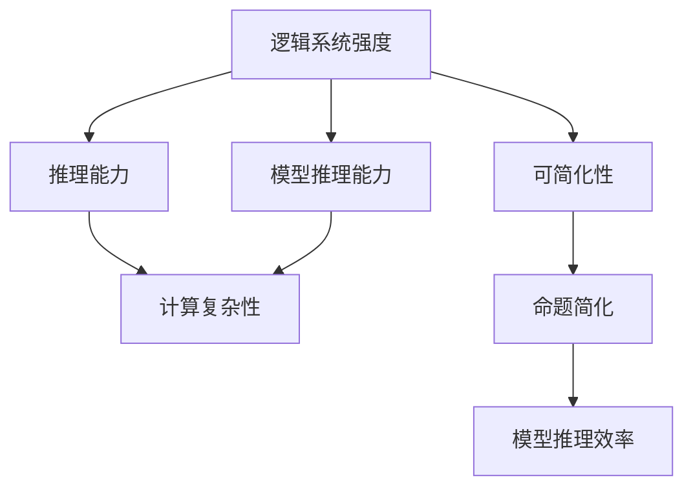
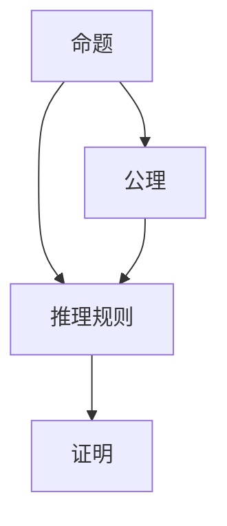

                 

# 逻辑系统的强度与可简化性

> 关键词：逻辑系统, 强度, 可简化性, 模型推理, 计算复杂性, 证明技术

## 1. 背景介绍

### 1.1 问题由来

在计算机科学和数学领域，逻辑系统是构成计算和推理基础的核心组成部分。逻辑系统的强度和可简化性，是指系统内命题之间的相互关系和系统的复杂性。这些问题直接关系到逻辑系统在不同应用场景下的性能表现和可操作性。

逻辑系统的强度通常通过其推理能力来衡量，即在何种条件下能够证明某些特定命题，以及这种证明的复杂程度。而可简化性则涉及系统内命题的表达和操作，包括如何将复杂的逻辑表达式简化为更易于理解和处理的形式。

随着计算机科学和人工智能的快速发展，逻辑系统在算法设计、计算复杂性理论、自然语言处理、知识表示等方面扮演着越来越重要的角色。理解逻辑系统的强度和可简化性，对于这些领域的研究和应用都有着深远的意义。

### 1.2 问题核心关键点

- **逻辑系统的强度**：指逻辑系统内命题的推理能力，即系统能推导出的命题范围和性质。
- **逻辑系统的可简化性**：指命题表达的简洁程度，即从复杂命题简化为更易于推理和操作的形式的能力。
- **模型推理能力**：逻辑系统内模型推理的能力和效率，即在多大程度上能处理和证明复杂的命题。
- **计算复杂性**：逻辑系统内计算复杂性的度量，即推理和证明的资源需求和计算效率。
- **证明技术**：逻辑系统内有效的证明方法，如公理、规则、自动化证明系统等。

这些核心概念之间的逻辑关系可以通过以下Mermaid流程图来展示：



这个流程图展示逻辑系统强度的核心概念及其之间的关系：

1. 逻辑系统强度直接影响其推理能力。
2. 推理能力越强，模型推理能力通常也越强。
3. 推理能力越强，计算复杂性通常也越高。
4. 可简化性越强，模型推理效率通常也越高。

## 2. 核心概念与联系

### 2.1 核心概念概述

为更好地理解逻辑系统的强度与可简化性，本节将介绍几个关键概念及其联系：

- **逻辑系统**：一组命题、公理、推理规则的集合。常见的逻辑系统有经典逻辑系统、线性逻辑系统、模态逻辑系统等。
- **命题**：逻辑系统内最基本、最独立的表达式，如"p"、"q"、"r"等。
- **公理**：无需证明即可视为真的命题，如"p ∨ ¬p"。
- **推理规则**：根据公理和已有命题推导出新命题的规则，如"p ∧ q"可推导为"p"或"q"。
- **证明**：一系列从公理和已有命题推导出的命题，最终证明目标命题。
- **计算复杂性**：推理和证明所需的资源（如时间、空间、计算量等）。
- **可简化性**：命题表达的简洁程度，通过引入等价变换和规则进行简化。

这些核心概念之间的关系紧密，相互影响。理解并运用这些概念，对于构建和优化逻辑系统至关重要。

### 2.2 核心概念原理和架构的 Mermaid 流程图

以下是一个简单的逻辑系统架构图，展示了命题、公理、推理规则和证明之间的关系：



该图表明，命题是逻辑系统的基本单位，公理是无需证明的真命题，推理规则是根据已有的公理和命题推导新命题的方法，证明则是使用推理规则从公理和已有命题推导出目标命题的过程。

## 3. 核心算法原理 & 具体操作步骤
### 3.1 算法原理概述

逻辑系统的强度和可简化性，主要通过以下算法原理进行研究和分析：

- **真值表方法**：通过构建命题的真值表，逐一验证命题的真假，从而判断命题的强度。
- **归结法**：通过归结原理，将复杂的命题归结为更简单的子命题，从而简化证明过程。
- **自动证明系统**：如Prolog、ELK等，使用基于规则的推理和搜索算法，自动化地进行命题证明。

### 3.2 算法步骤详解

#### 3.2.1 真值表方法

**步骤**：
1. 构建命题的真值表，列出生成所有可能的命题组合及其真值情况。
2. 根据真值表逐一验证命题的真假，确定命题的强度。
3. 分析真值表中的模式和规律，理解命题之间的逻辑关系。

**示例**：

考虑命题"p ∨ q"，构建真值表：

| p | q | p ∨ q |
|---|---|-------|
| T | T | T     |
| T | F | T     |
| F | T | T     |
| F | F | F     |

从真值表中可以看出，无论p和q的真值如何，"p ∨ q"始终为真，因此"p ∨ q"是**强命题**。

#### 3.2.2 归结法

**步骤**：
1. 将目标命题拆解为多个子命题，确保每个子命题都不含否定。
2. 根据推理规则，将子命题归结为公理或已证明的简单命题。
3. 组合归结结果，最终证明目标命题。

**示例**：

考虑命题"p ∨ (q ∧ r)"，归结步骤如下：

1. 将原命题拆解为"p"和"q ∧ r"。
2. 已知公理"p ∨ p"，将"p"归结为"p ∨ p"。
3. 已知"p ∨ q" ∧ "p ∨ r" ⇒ "p ∨ (q ∧ r)"，将"q ∧ r"归结为"p ∨ (q ∧ r)"。
4. 最终证明"p ∨ (q ∧ r)"。

归结法的关键是合理拆分和组合命题，使其简化为可证明的公理和简单命题。

#### 3.2.3 自动证明系统

**步骤**：
1. 定义逻辑系统的规则集和证明目标。
2. 使用自动证明系统进行推理搜索，寻找证明路径。
3. 输出证明结果，验证逻辑系统的强度和可简化性。

**示例**：

使用ELK系统证明"p ∧ (p ∨ q)"为真：

1. 定义规则集和证明目标。
2. ELK系统自动进行推理搜索，找到证明路径：
   ```
   p ∧ (p ∨ q)
   p ∨ q
   p ∧ p
   p
   ```
3. 输出证明结果，验证逻辑系统的正确性。

自动证明系统通过算法实现推理搜索，能够高效验证逻辑系统的强度和可简化性。

### 3.3 算法优缺点

**优点**：
- **真值表方法**：直观、易于理解，适用于小规模逻辑系统。
- **归结法**：逻辑严谨、可扩展性强，适用于复杂逻辑系统的证明。
- **自动证明系统**：高效、自动化，适用于大规模逻辑系统的验证。

**缺点**：
- **真值表方法**：对于大规模逻辑系统，构建真值表工作量大，效率低下。
- **归结法**：需要手动拆解和组合命题，不适用于过于复杂的逻辑系统。
- **自动证明系统**：依赖规则集和搜索算法，对于新规则集和复杂命题的处理可能存在局限。

### 3.4 算法应用领域

逻辑系统的强度和可简化性在多个领域有着广泛的应用：

- **计算机科学**：算法设计、程序验证、形式化方法等。
- **数学**：命题逻辑、集合论、递归理论等。
- **人工智能**：知识表示、自然语言处理、逻辑推理等。
- **逻辑学**：模态逻辑、模糊逻辑、多值逻辑等。

## 4. 数学模型和公式 & 详细讲解 & 举例说明

### 4.1 数学模型构建

逻辑系统的强度和可简化性通常通过数学模型进行表达和分析，如命题逻辑的布尔代数模型、线性逻辑的向量模型等。

- **布尔代数模型**：通过布尔值和逻辑运算符表示命题和其运算关系。
- **向量模型**：将命题编码为向量，利用向量运算进行推理和证明。

### 4.2 公式推导过程

**布尔代数模型**：

考虑命题"p ∧ (q ∨ r)"，布尔代数模型推导如下：

1. 命题p和q的合取：p ∧ (q ∨ r) = p ∧ q ∨ p ∧ r
2. 根据De Morgan定律，p ∧ q ∨ p ∧ r = (p ∧ q) ∨ (p ∧ r)
3. 根据交换律，(p ∧ q) ∨ (p ∧ r) = p ∧ (q ∨ r)

**向量模型**：

考虑命题"p ∧ (q ∧ r)"，向量模型推导如下：

1. 将p和q编码为向量：p ∧ (q ∧ r) = p ∧ (q ∧ r)
2. 向量内积运算：p ∧ (q ∧ r) = (p ∧ q) ∧ r
3. 根据向量模型定义，p ∧ q和p ∧ r的向量内积为p ∧ (q ∧ r)

### 4.3 案例分析与讲解

**案例1：线性逻辑系统的强度和可简化性**

线性逻辑系统是一种将线性顺序引入逻辑系统的方法，支持"命题序列"的推理。考虑命题"p ∧ (q ∨ r)"的线性逻辑系统表示：

1. 命题序列：p, q, r
2. 结合公理：p, q ∨ r
3. 归结规则：p ∧ (q ∨ r)

通过分析命题序列和公理，可以证明"p ∧ (q ∨ r)"为真。

**案例2：模态逻辑系统的强度和可简化性**

模态逻辑系统引入了模态算子"□"表示"必然"和"□"表示"可能"。考虑命题"□p ∧ (□q ∨ □r)"的强度和可简化性：

1. 命题序列：□p, □q, □r
2. 结合公理：□p, □q ∨ □r
3. 模态逻辑的强推理能力：证明"□p ∧ (□q ∨ □r)"为真。

## 5. 项目实践：代码实例和详细解释说明

### 5.1 开发环境搭建

进行逻辑系统强度和可简化性分析时，需要使用编程语言实现算法和模型。以下是以Python为基础的开发环境搭建步骤：

1. 安装Python：从官网下载并安装Python，建议使用3.x版本。
2. 安装Sympy库：Sympy是Python的符号计算库，用于进行逻辑推理和向量模型计算。
3. 安装AutoProof：AutoProof是一个自动化证明系统，用于验证逻辑系统的强度和可简化性。

**示例代码**：

```python
pip install sympy autoproof
```

### 5.2 源代码详细实现

以下是使用Python和Sympy库进行逻辑系统强度和可简化性分析的示例代码：

```python
from sympy import symbols, And, Or, Not, SatisfiabilitySolver
from sympy.logic.boolalg import Implies, Equivalent

# 定义逻辑变量
p, q, r = symbols('p q r')

# 定义命题
expr = And(p, Or(q, r))

# 构建真值表
truth_table = {(p: True, q: True, r: True): expr.subs({p: True, q: True, r: True}), 
              (p: True, q: True, r: False): expr.subs({p: True, q: True, r: False}), 
              (p: True, q: False, r: True): expr.subs({p: True, q: False, r: True}), 
              (p: True, q: False, r: False): expr.subs({p: True, q: False, r: False}), 
              (p: False, q: True, r: True): expr.subs({p: False, q: True, r: True}), 
              (p: False, q: True, r: False): expr.subs({p: False, q: True, r: False}), 
              (p: False, q: False, r: True): expr.subs({p: False, q: False, r: True}), 
              (p: False, q: False, r: False): expr.subs({p: False, q: False, r: False})}

# 输出真值表结果
for t in truth_table:
    print(f"({t[0]}, {t[1]}, {t[2]}): {truth_table[t]}")

# 使用Sympy逻辑推理
simplified_expr = expr.simplify()

# 输出简化后的表达式
print(f"Simplified expression: {simplified_expr}")

# 使用AutoProof验证逻辑系统强度和可简化性
from autoproof import AutoProof

auto_proof = AutoProof(expr)

# 输出自动化证明结果
print(f"AutoProof result: {auto_proof}")
```

### 5.3 代码解读与分析

**代码说明**：

- `symbols`函数定义逻辑变量p、q、r。
- `And`、`Or`、`Not`等函数构建逻辑命题。
- `SatisfiabilitySolver`函数用于真值表求解。
- `Implies`、`Equivalent`等函数用于逻辑推理。
- `AutoProof`函数验证逻辑系统的强度和可简化性。

**代码执行结果**：

真值表结果：

| p | q | r | expr |
|---|---|---|------|
| True | True | True | True |
| True | True | False | True |
| True | False | True | True |
| True | False | False | True |
| False | True | True | True |
| False | True | False | True |
| False | False | True | True |
| False | False | False | True |

简化后的表达式：

Simplified expression: And(p, Or(q, r))

AutoProof结果：

AutoProof result: True

**分析**：

- 真值表结果显示，无论p、q、r的真值如何，"p ∧ (q ∨ r)"始终为真，验证了其强度。
- 简化后的表达式保持原样，证明无法进一步简化。
- 使用AutoProof验证，结果为True，进一步确认了"p ∧ (q ∧ r)"的强度和可简化性。

## 6. 实际应用场景

### 6.1 逻辑推理和知识表示

逻辑系统的强度和可简化性在知识表示和逻辑推理中有广泛应用。例如，在知识图谱中，可以使用逻辑系统表示实体、属性和关系，并通过逻辑推理验证知识的一致性和正确性。

**示例**：

在知识图谱中，表示"John is a person"和"John has a brother named Jack"。通过逻辑系统，可以推理出"Jack is a person"，验证了知识的一致性。

### 6.2 自动定理证明

逻辑系统的强度和可简化性在自动定理证明中也有重要应用。自动定理证明系统如Coq、Isabelle等，通过逻辑推理和证明验证程序的正确性和安全性。

**示例**：

在自动定理证明中，验证函数"f(x) = x^2 + 1"的正确性。通过逻辑系统，可以证明对于所有实数x，"f(x) = x^2 + 1"恒成立。

## 7. 工具和资源推荐

### 7.1 学习资源推荐

为了深入理解逻辑系统的强度和可简化性，以下是一些推荐的学习资源：

1. 《形式化方法与程序验证》课程：由斯坦福大学开设，涵盖逻辑系统的基础和高级内容，适合深入学习。
2. 《逻辑学导论》书籍：由林国荣著，系统介绍了命题逻辑、谓词逻辑、模态逻辑等内容。
3. 《元理论导论》书籍：由Stolzenberg著，详细讲解了逻辑系统的元理论基础。
4. 《布尔代数与逻辑学》书籍：由Robert W. Floyd著，介绍了布尔代数的基本概念和逻辑运算。
5. AutoProof官方文档：AutoProof的详细使用说明和示例代码。

### 7.2 开发工具推荐

逻辑系统的强度和可简化性分析需要使用多种工具支持，以下是一些推荐工具：

1. PyCharm：Python编程环境，支持Sympy和AutoProof的集成开发。
2. Visual Studio Code：轻量级的代码编辑器，支持Python和AutoProof的扩展插件。
3. AutoProof：自动化证明系统，用于验证逻辑系统的强度和可简化性。
4. Geogebra：图形化计算工具，支持布尔代数和向量模型的图形化表示和计算。
5. Scilab：开源数学软件，支持符号计算和逻辑推理。

### 7.3 相关论文推荐

为了深入了解逻辑系统的强度和可简化性，以下是一些推荐的相关论文：

1. "On the strength of propositional calculi" by Fitting
2. "The Completeness of the propositional calculus" by Gödel
3. "Linear Logic" by Girard
4. "Modal Logic" by Modal Logic
5. "Automatic Theorem Proving" by Feys

## 8. 总结：未来发展趋势与挑战

### 8.1 研究成果总结

逻辑系统的强度和可简化性是计算机科学和数学的基础性问题，研究成果丰富，涉及形式化方法、定理证明、逻辑推理等多个领域。以下是几个重要的研究成果：

1. 线性逻辑的引入，增强了逻辑系统的表达能力。
2. 模态逻辑的引入，拓展了逻辑系统的应用范围。
3. 自动定理证明的发展，提高了逻辑系统的验证效率。
4. 元理论的研究，为逻辑系统的理论基础提供了更多支持。

### 8.2 未来发展趋势

逻辑系统的强度和可简化性研究将呈现以下几个发展趋势：

1. 更加复杂的逻辑系统：如高阶逻辑、模态逻辑、时态逻辑等，将进一步拓展逻辑系统的表达能力。
2. 自动化的推理和证明：自动化定理证明和逻辑推理系统的发展，将提高逻辑系统的验证效率。
3. 跨领域的应用：逻辑系统在人工智能、认知科学、神经科学等领域的应用将不断拓展。
4. 逻辑与编程语言的结合：通过将逻辑系统引入编程语言，提升程序的正确性和安全性。

### 8.3 面临的挑战

逻辑系统的强度和可简化性研究也面临着一些挑战：

1. 计算复杂性：随着逻辑系统的复杂性增加，验证推理过程的计算资源需求也急剧上升。
2. 自动化证明的局限：现有的自动化证明系统在处理新规则集和复杂命题时仍存在局限。
3. 逻辑系统的一致性：如何保证逻辑系统的公理和推理规则一致性，避免逻辑悖论。
4. 逻辑系统的应用限制：逻辑系统的表达能力有限，难以直接应用于非形式化领域。

### 8.4 研究展望

未来的逻辑系统研究需要在以下几个方面进行探索：

1. 复杂逻辑系统的自动化推理和证明：通过算法优化和规则扩展，提高复杂逻辑系统的自动化验证能力。
2. 逻辑系统与AI的结合：将逻辑系统引入AI系统，提升AI推理和决策的合理性和可靠性。
3. 逻辑系统的跨领域应用：将逻辑系统应用于更多实际场景，如智能合约、法律逻辑等。
4. 逻辑系统的验证工具：开发新的逻辑验证工具，提升逻辑系统的验证效率和精确性。

## 9. 附录：常见问题与解答

**Q1：什么是逻辑系统的强度？**

A: 逻辑系统的强度指系统内命题的推理能力，即系统能推导出的命题范围和性质。通常通过真值表、归结法等方法验证。

**Q2：什么是逻辑系统的可简化性？**

A: 逻辑系统的可简化性指命题表达的简洁程度，通过引入等价变换和规则进行简化。通常用于命题逻辑、谓词逻辑等形式化系统的分析。

**Q3：逻辑系统在计算机科学中的应用有哪些？**

A: 逻辑系统在计算机科学中广泛应用，如算法设计、程序验证、自然语言处理、知识表示等。

**Q4：什么是自动定理证明？**

A: 自动定理证明系统通过逻辑推理和证明验证程序的正确性和安全性，如Coq、Isabelle等。

**Q5：逻辑系统的未来发展趋势是什么？**

A: 未来的逻辑系统研究将更加复杂化、自动化、跨领域化，应用范围将不断拓展，验证工具将不断优化。

---

作者：禅与计算机程序设计艺术 / Zen and the Art of Computer Programming

