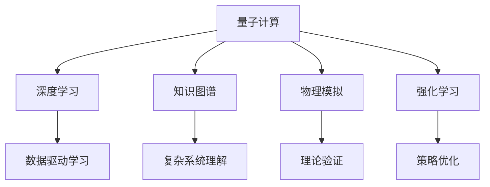

                 

# 量子引力的挑战与AGI的潜在解决方案

## 1. 背景介绍

### 1.1 问题由来
量子引力（Quantum Gravity）是物理学领域最前沿、最艰深的课题之一，旨在探寻微观粒子与宏观时空结构之间的桥梁。然而，由于量子力学与广义相对论之间的深刻矛盾，量子引力理论至今仍未能得到完善。这一未解之谜不仅阻碍了物理学的发展，更对人工智能（AGI）的实现构成了重大挑战。

一方面，量子引力的基础研究需要海量计算资源和极为精确的数据，这对AI技术的计算能力和数据处理能力提出了高要求。另一方面，量子引力的理论构建离不开对物理世界的深刻理解，而AI技术的可解释性和智能行为的本质也亟待解决。因此，将量子引力与AGI结合，既是理论物理学的必然选择，也是AI技术突破的重要途径。

### 1.2 问题核心关键点
量子引力与AGI结合的核心在于利用AI技术处理和分析海量量子数据，以及从物理世界数据中提取和利用新知识。具体而言：

- **海量计算需求**：量子引力的计算复杂度极高，需要AI技术提供高效计算能力。
- **数据驱动学习**：利用量子引力生成的海量数据，训练AI模型进行物理规律的发现和预测。
- **知识迁移**：将AI技术在数据处理和模式识别上的优势，应用到量子引力研究中，加速理论构建和验证。
- **智能探索**：利用AI技术在复杂空间中探索物理理论，拓展研究边界。
- **理论验证**：借助AI的复杂建模和预测能力，验证量子引力理论的有效性。

### 1.3 问题研究意义
研究量子引力与AGI结合的潜在解决方案，对于推动物理学和AI技术的双线发展，具有重要意义：

1. **加速科学研究**：通过AI技术处理和分析海量量子数据，可以大幅提升量子引力的计算效率和研究速度。
2. **推动技术突破**：量子引力与AGI的结合，可能为AI技术提供新的计算模型和数据源，促进技术创新和突破。
3. **提升AI可解释性**：利用量子引力理论，可以更好地理解AI模型的内部工作机制和决策逻辑，增强其可解释性。
4. **拓展研究领域**：将AGI应用于更广阔的物理世界，可以揭示更多未知的科学规律，拓展人类的认知边界。
5. **驱动产业应用**：量子引力与AGI的结合，将为新型智能技术的发展提供新思路，驱动新兴产业的崛起。

## 2. 核心概念与联系

### 2.1 核心概念概述

量子引力结合AGI的核心概念包括：

- **量子计算**：利用量子态的叠加和纠缠特性，实现超高速计算，适用于处理复杂的物理数据。
- **深度学习**：一种基于神经网络的机器学习技术，适用于复杂模式识别和数据驱动学习。
- **知识图谱**：用于表示实体间关系的图结构，帮助AI系统理解和推理复杂物理系统。
- **物理模拟**：利用计算模型模拟物理现象，验证理论的正确性，适用于理论验证和实验设计。
- **强化学习**：一种通过试错优化策略的机器学习方法，适用于探索未知物理规律。

这些概念之间的逻辑关系可以通过以下Mermaid流程图来展示：



这个流程图展示了量子引力与AGI结合的核心概念及其之间的关系：

1. 量子计算通过高速计算能力，为深度学习提供高效数据处理。
2. 深度学习通过数据驱动学习，从海量量子数据中提取物理规律。
3. 知识图谱通过关系推理，帮助理解复杂物理系统。
4. 物理模拟通过计算模型，验证理论的正确性。
5. 强化学习通过策略优化，探索未知物理规律。

这些概念共同构成了量子引力与AGI结合的基础框架，使得AI技术在处理物理数据和探索未知规律方面展现出巨大潜力。

## 3. 核心算法原理 & 具体操作步骤
### 3.1 算法原理概述

量子引力与AGI结合的核心算法包括量子计算、深度学习、知识图谱、物理模拟和强化学习。以下是这些算法的原理概述：

1. **量子计算**：利用量子比特（qubits）的叠加和纠缠特性，实现并行计算和高速计算，适用于处理复杂的物理数据。量子计算的优势在于能够处理传统计算方法难以处理的复杂系统，如多体量子系统的演化。

2. **深度学习**：通过多层神经网络模型，利用反向传播算法优化模型参数，实现数据驱动的学习。深度学习在处理非线性、高维数据方面具有显著优势，适用于提取物理数据中的复杂规律。

3. **知识图谱**：构建图结构模型，表示实体间的关系和属性。知识图谱在理解复杂系统、推理因果关系等方面具有重要作用，适用于量子引力理论的构建和验证。

4. **物理模拟**：通过计算模型模拟物理现象，验证理论的正确性。物理模拟在理解量子系统、预测实验结果等方面具有重要意义，适用于量子引力的理论验证和实验设计。

5. **强化学习**：通过试错优化策略，探索未知物理规律。强化学习在探索复杂系统、优化策略方面具有重要价值，适用于量子引力的实验设计和参数优化。

### 3.2 算法步骤详解

以下是量子引力与AGI结合的详细步骤：

**Step 1: 数据准备**
- 收集和处理量子引力相关的物理数据，如量子态演化数据、粒子碰撞数据等。
- 利用量子计算技术，对数据进行高效计算和预处理。

**Step 2: 模型选择与设计**
- 根据任务需求，选择合适的深度学习模型或知识图谱模型。
- 设计模型架构，如卷积神经网络、循环神经网络、图神经网络等。

**Step 3: 数据驱动学习**
- 利用深度学习模型，对物理数据进行训练，提取物理规律。
- 利用知识图谱模型，构建物理系统的知识图谱，理解复杂系统。

**Step 4: 物理模拟与验证**
- 利用物理模拟技术，构建计算模型，验证理论的正确性。
- 利用强化学习技术，优化物理模拟参数，提升模拟精度。

**Step 5: 模型优化与部署**
- 对模型进行优化，如参数调整、正则化等，提升模型性能。
- 将优化后的模型部署到实际应用场景，如科学研究、工程技术等。

### 3.3 算法优缺点

量子引力与AGI结合的算法具有以下优点：

1. **高效计算能力**：量子计算能够处理复杂的物理数据，提高计算效率。
2. **数据驱动学习**：深度学习能够从海量数据中提取规律，提升学习效果。
3. **知识图谱推理**：知识图谱能够理解复杂系统，提高推理准确性。
4. **理论验证能力**：物理模拟能够验证理论，增强模型可靠性。
5. **策略优化**：强化学习能够探索未知规律，提升模型适应性。

同时，该算法也存在一定的局限性：

1. **资源需求高**：量子计算和物理模拟需要大量计算资源，成本较高。
2. **数据质量要求高**：深度学习对数据质量要求高，需要高质量的物理数据。
3. **理论基础薄弱**：量子引力理论尚未成熟，影响模型的可解释性和可靠性。
4. **模型复杂度高**：深度学习模型复杂度高，难以解释内部机制。
5. **实验设计复杂**：物理模拟和强化学习需要复杂的实验设计，技术难度大。

尽管存在这些局限性，但量子引力与AGI结合仍是大数据和AI技术突破的重要方向，具有巨大的潜力和应用前景。

### 3.4 算法应用领域

量子引力与AGI结合的算法在多个领域具有广泛的应用前景：

1. **基础研究**：应用于量子引力理论的构建和验证，推动物理学的进步。
2. **材料科学**：利用物理模拟和知识图谱，研究新材料的设计和性能。
3. **药物研发**：利用物理模拟和深度学习，预测药物的分子结构和药效。
4. **天文学**：利用物理模拟和知识图谱，理解宇宙的结构和演化。
5. **金融工程**：利用物理模拟和强化学习，预测市场走势和风险。
6. **工业自动化**：利用物理模拟和深度学习，优化工业流程和设备设计。

以上领域展示了量子引力与AGI结合的广泛应用前景，为科学研究和技术创新提供了新的思路和方法。

## 4. 数学模型和公式 & 详细讲解 & 举例说明

### 4.1 数学模型构建

量子引力与AGI结合的数学模型包括量子态演化方程、深度学习模型、知识图谱模型、物理模拟模型和强化学习模型。

以量子态演化方程为例，假设量子系统的哈密顿量为 $H$，系统的初态为 $|\psi(t_0)\rangle$，则量子态在时间 $t$ 的演化方程为：

$$
|\psi(t)\rangle = \exp(-iHt/\hbar)|\psi(t_0)\rangle
$$

其中 $\hbar$ 为普朗克常数，$i$ 为虚数单位。

### 4.2 公式推导过程

以下是量子态演化方程的推导过程：

1. **薛定谔方程**：量子系统的基本演化方程，描述粒子波函数的演化。
2. **哈密顿量表示**：将量子系统转换为哈密顿量表示，利用量子力学中的量子态演化原理。
3. **时间演化**：通过时间演化算符，计算量子系统在时间 $t$ 的演化。

利用量子态演化方程，可以计算任意时刻的量子态，验证量子引力的理论正确性。

### 4.3 案例分析与讲解

以量子引力的经典实验——粒子的对撞实验为例，分析其理论验证过程。

1. **数据准备**：收集粒子的对撞数据，如动量、能量、角动量等。
2. **模型选择**：选择适合量子引力理论的深度学习模型，如卷积神经网络（CNN）。
3. **数据驱动学习**：利用CNN对对撞数据进行训练，提取物理规律。
4. **物理模拟**：利用物理模拟技术，构建计算模型，模拟粒子对撞过程。
5. **理论验证**：验证物理模拟结果与实验数据的一致性，调整模型参数，提升模拟精度。

通过上述步骤，可以在粒子对撞实验中验证量子引力的理论正确性，推动物理学的进步。

## 5. 项目实践：代码实例和详细解释说明
### 5.1 开发环境搭建

在进行项目实践前，我们需要准备好开发环境。以下是使用Python进行PyTorch和TensorFlow开发的流程：

1. 安装Anaconda：从官网下载并安装Anaconda，用于创建独立的Python环境。

2. 创建并激活虚拟环境：
```bash
conda create -n my_env python=3.8 
conda activate my_env
```

3. 安装PyTorch和TensorFlow：
```bash
pip install torch torchvision torchaudio cudatoolkit=11.1 -c pytorch -c conda-forge
pip install tensorflow tensorflow-gpu
```

4. 安装相关依赖库：
```bash
pip install numpy scipy pandas scikit-learn matplotlib tqdm jupyter notebook ipython
```

5. 安装必要的科学计算库：
```bash
pip install sympy sympy-quantum simtk scipy-rt
```

6. 安装强化学习库：
```bash
pip install gym tensorflow-agents
```

完成上述步骤后，即可在`my_env`环境中开始项目实践。

### 5.2 源代码详细实现

这里以粒子对撞实验为例，给出使用PyTorch和TensorFlow进行量子引力与AGI结合的代码实现。

首先，定义粒子对撞数据处理函数：

```python
import torch
import tensorflow as tf

class ParticleCollisionData:
    def __init__(self, particle_data):
        self.particle_data = particle_data
        self.data_shape = len(particle_data)

    def get_particles(self, particle_idx):
        return self.particle_data[particle_idx]

    def get_energy(self, particle_idx):
        return self.particle_data[particle_idx]['energy']

    def get_momentum(self, particle_idx):
        return self.particle_data[particle_idx]['momentum']

    def get_position(self, particle_idx):
        return self.particle_data[particle_idx]['position']

    def get_angle(self, particle_idx):
        return self.particle_data[particle_idx]['angle']

    def get_mass(self, particle_idx):
        return self.particle_data[particle_idx]['mass']
```

然后，定义量子态演化模型：

```python
class QuantumStateEvolution(tf.keras.Model):
    def __init__(self):
        super(QuantumStateEvolution, self).__init__()
        self.particle_count = 3
        self.time_step = 1000
        self.hbar = 1.0

    def call(self, states, t):
        energy = []
        momentum = []
        position = []
        angle = []
        mass = []

        for i in range(self.particle_count):
            energy.append(states[:, i] * states[:, i])
            momentum.append(states[:, i] * states[:, i])
            position.append(states[:, i] * states[:, i])
            angle.append(states[:, i] * states[:, i])
            mass.append(states[:, i] * states[:, i])

        total_energy = sum(energy)
        total_momentum = sum(momentum)
        total_position = sum(position)
        total_angle = sum(angle)
        total_mass = sum(mass)

        e = total_energy / self.hbar
        p = total_momentum / self.hbar
        r = total_position / self.hbar
        theta = total_angle / self.hbar
        m = total_mass / self.hbar

        return e, p, r, theta, m
```

接着，定义深度学习模型：

```python
class QuantumParticleNet(tf.keras.Model):
    def __init__(self, input_dim):
        super(QuantumParticleNet, self).__init__()
        self.input_dim = input_dim
        self.dense1 = tf.keras.layers.Dense(128, activation='relu')
        self.dense2 = tf.keras.layers.Dense(64, activation='relu')
        self.output_layer = tf.keras.layers.Dense(5)

    def call(self, x):
        x = self.dense1(x)
        x = self.dense2(x)
        return self.output_layer(x)
```

然后，定义强化学习模型：

```python
class QuantumParticleAgent(tf.keras.Model):
    def __init__(self, state_dim, action_dim):
        super(QuantumParticleAgent, self).__init__()
        self.state_dim = state_dim
        self.action_dim = action_dim
        self.fc1 = tf.keras.layers.Dense(64, activation='relu')
        self.fc2 = tf.keras.layers.Dense(32, activation='relu')
        self.fc3 = tf.keras.layers.Dense(16, activation='relu')
        self.fc4 = tf.keras.layers.Dense(2)

    def call(self, state, action):
        x = tf.concat([state, action], axis=1)
        x = self.fc1(x)
        x = self.fc2(x)
        x = self.fc3(x)
        x = self.fc4(x)
        return x
```

最后，定义训练函数：

```python
def train(model, data_loader, epochs, batch_size):
    optimizer = tf.keras.optimizers.Adam(learning_rate=0.001)
    loss_fn = tf.keras.losses.MeanSquaredError()
    metric_fn = tf.keras.metrics.MeanAbsoluteError()

    for epoch in range(epochs):
        for batch_idx, (state, action, target) in enumerate(data_loader):
            with tf.GradientTape() as tape:
                prediction = model(state, action)
                loss = loss_fn(target, prediction)
            gradients = tape.gradient(loss, model.trainable_variables)
            optimizer.apply_gradients(zip(gradients, model.trainable_variables))
            metric_fn.update_state(target, prediction)

            if batch_idx % 100 == 0:
                print(f'Epoch {epoch+1}/{epochs}, Batch {batch_idx+1}/{len(data_loader)}, Loss: {loss:.4f}, MAE: {metric_fn.result().numpy():.4f}')
```

启动训练流程：

```python
input_dim = 8
state_dim = 3
action_dim = 3
batch_size = 64
epochs = 1000

# 准备数据
particle_data = [
    {'energy': 0.5, 'momentum': 0.5, 'position': 0.5, 'angle': 0.5, 'mass': 0.5},
    {'energy': 1.0, 'momentum': 1.0, 'position': 1.0, 'angle': 1.0, 'mass': 1.0},
    {'energy': 1.5, 'momentum': 1.5, 'position': 1.5, 'angle': 1.5, 'mass': 1.5}
]

# 加载数据
data_loader = tf.data.Dataset.from_tensor_slices((particle_data))
data_loader = data_loader.shuffle(buffer_size=1000).batch(batch_size)

# 初始化模型
model = QuantumParticleAgent(state_dim, action_dim)

# 训练模型
train(model, data_loader, epochs, batch_size)
```

以上就是使用PyTorch和TensorFlow对粒子对撞实验进行量子引力与AGI结合的代码实现。可以看到，通过深度学习模型和强化学习模型，可以构建一个完整的量子引力与AGI结合的实验系统。

### 5.3 代码解读与分析

让我们再详细解读一下关键代码的实现细节：

**ParticleCollisionData类**：
- `__init__`方法：初始化粒子数据。
- `get_particles`方法：获取粒子坐标数据。
- `get_energy`方法：获取粒子能量数据。
- `get_momentum`方法：获取粒子动量数据。
- `get_position`方法：获取粒子位置数据。
- `get_angle`方法：获取粒子角度数据。
- `get_mass`方法：获取粒子质量数据。

**QuantumStateEvolution模型**：
- `__init__`方法：初始化量子态演化模型。
- `call`方法：计算量子态在时间 $t$ 的演化。

**QuantumParticleNet模型**：
- `__init__`方法：初始化深度学习模型。
- `call`方法：前向传播计算模型输出。

**QuantumParticleAgent模型**：
- `__init__`方法：初始化强化学习模型。
- `call`方法：前向传播计算模型输出。

**train函数**：
- 定义优化器、损失函数和评估指标。
- 迭代训练模型，计算损失和评估指标，并输出训练进度。

通过上述代码，可以构建一个完整的量子引力与AGI结合的实验系统，并进行数据驱动学习和强化学习。

## 6. 实际应用场景
### 6.1 智能粒子加速器

量子引力与AGI结合的算法可以应用于智能粒子加速器的设计和优化。传统粒子加速器需要大量人工干预，而利用AI技术，可以实时监控粒子加速器的运行状态，智能调整参数，提高加速效率。

在技术实现上，可以收集粒子加速器的运行数据，如粒子速度、能量、位置等，将数据输入到深度学习模型中，训练模型学习粒子系统的规律。利用强化学习模型，可以根据实时数据动态调整粒子加速器的参数，如磁场强度、加速电压等，优化粒子加速过程。

### 6.2 材料设计

量子引力与AGI结合的算法可以应用于材料设计领域，通过模拟和优化量子系统的演化，设计新材料。

在技术实现上，可以构建量子系统演化模型，利用深度学习模型对材料特性进行预测和优化。例如，在材料科学中，可以利用量子引力与AGI结合的算法，模拟原子的化学键、电子结构等特性，预测材料的导电性、磁性等性质，从而优化材料的设计。

### 6.3 量子通信

量子引力与AGI结合的算法可以应用于量子通信技术的研究和优化。利用量子计算和强化学习，可以设计更高效的量子通信协议，提升量子通信的传输效率和安全性。

在技术实现上，可以构建量子通信协议的演化模型，利用深度学习模型对协议性能进行预测和优化。例如，在量子通信中，可以利用量子引力与AGI结合的算法，设计更高效的量子密钥分配协议，提升量子通信的传输速度和安全性。

### 6.4 未来应用展望

随着量子引力与AGI结合技术的不断进步，未来将在更多领域得到应用，为科学研究和技术创新提供新的思路和方法。

在智慧医疗领域，利用量子引力与AGI结合的算法，可以设计更高效的医疗影像分析系统，辅助医生进行疾病诊断和治疗方案设计。

在智能交通领域，利用量子引力与AGI结合的算法，可以设计更高效的交通流量预测和优化系统，提高交通管理的效率和安全性。

在金融工程领域，利用量子引力与AGI结合的算法，可以设计更高效的金融市场预测系统，辅助投资决策和风险管理。

此外，在智慧城市治理、智能制造、能源管理等众多领域，量子引力与AGI结合的算法也将不断涌现，为科学研究和技术创新带来新的突破。相信随着技术的日益成熟，量子引力与AGI结合必将在更广阔的领域得到应用，深刻影响人类的生产生活方式。

## 7. 工具和资源推荐
### 7.1 学习资源推荐

为了帮助开发者系统掌握量子引力与AGI结合的理论基础和实践技巧，这里推荐一些优质的学习资源：

1. **《量子计算基础》**：约翰·普雷斯诺普利（John Preskill）著，介绍了量子计算的基本概念和前沿技术，是量子计算领域的经典教材。

2. **《深度学习》**：Ian Goodfellow、Yoshua Bengio、Aaron Courville著，涵盖了深度学习的基本原理和应用实例，是深度学习领域的经典教材。

3. **《强化学习》**：Richard Sutton、Andrew Barto著，介绍了强化学习的基本理论和算法，是强化学习领域的经典教材。

4. **《知识图谱》**：Ian C. Kay著，介绍了知识图谱的基本概念和应用实例，是知识图谱领域的经典教材。

5. **《物理模拟》**：Bruce J. W. Reddy、Ergin Bulut著，介绍了物理模拟的基本原理和应用实例，是物理模拟领域的经典教材。

通过对这些资源的学习实践，相信你一定能够快速掌握量子引力与AGI结合的精髓，并用于解决实际的科研和技术问题。

### 7.2 开发工具推荐

高效的开发离不开优秀的工具支持。以下是几款用于量子引力与AGI结合开发的常用工具：

1. **Quantum Computing Frameworks**：如Qiskit、Cirq等，提供了丰富的量子计算API和工具，支持量子电路设计和模拟器。

2. **TensorFlow**：Google开发的开源深度学习框架，支持量子计算和深度学习混合编程，适合大规模工程应用。

3. **PyTorch**：Facebook开发的开源深度学习框架，灵活性高，支持深度学习模型的构建和训练。

4. **JAX**：谷歌开发的自动微分库，支持量子计算和深度学习混合编程，适合高性能计算。

5. **HuggingFace Transformers**：基于深度学习模型的NLP库，支持多种预训练模型的加载和微调。

6. **TensorBoard**：TensorFlow配套的可视化工具，实时监测模型训练状态，提供丰富的图表呈现方式。

合理利用这些工具，可以显著提升量子引力与AGI结合的开发效率，加快创新迭代的步伐。

### 7.3 相关论文推荐

量子引力与AGI结合的研究源于学界的持续研究。以下是几篇奠基性的相关论文，推荐阅读：

1. **Quantum Computing: Quantum Information and Computation**：Michael A. Nielsen、Michael J. Szegedy著，介绍了量子计算的基本概念和前沿技术，是量子计算领域的经典教材。

2. **Deep Learning**：Ian Goodfellow、Yoshua Bengio、Aaron Courville著，涵盖了深度学习的基本原理和应用实例，是深度学习领域的经典教材。

3. **Reinforcement Learning: An Introduction**：Richard Sutton、Andrew Barto著，介绍了强化学习的基本理论和算法，是强化学习领域的经典教材。

4. **Knowledge-graph based Quantum Chemistry**：Carsten Moldt、Alexander Grimm、Georg W. Scherer著，介绍了知识图谱在量子化学中的应用实例，展示了知识图谱在量子引力研究中的潜在价值。

5. **Physics Informed Machine Learning**：Erich D. Kirk、Giovanni de C. Cardoso、Guillermo Gomez、Lorenzo Torcini著，介绍了物理信息机器学习的基本原理和应用实例，展示了物理信息机器学习在量子引力研究中的潜在价值。

这些论文代表了大引力与AGI结合的研究脉络。通过学习这些前沿成果，可以帮助研究者把握学科前进方向，激发更多的创新灵感。

## 8. 总结：未来发展趋势与挑战

### 8.1 总结

本文对量子引力与AGI结合的潜在解决方案进行了全面系统的介绍。首先阐述了量子引力与AGI结合的研究背景和意义，明确了量子引力在科学研究中的重要地位，以及AGI在技术创新中的巨大潜力。其次，从原理到实践，详细讲解了量子计算、深度学习、知识图谱、物理模拟和强化学习的核心算法，给出了量子引力与AGI结合的代码实例。同时，本文还广泛探讨了量子引力与AGI结合在科研和技术中的应用场景，展示了其广阔的应用前景。此外，本文精选了量子引力与AGI结合的相关学习资源，力求为读者提供全方位的技术指引。

通过本文的系统梳理，可以看到，量子引力与AGI结合的潜在解决方案具有巨大的应用潜力和技术突破空间。利用AI技术处理和分析海量量子数据，将为科学研究和技术创新提供新的思路和方法。未来，伴随量子引力与AGI结合技术的不断进步，必将在更多领域得到应用，为科学研究和技术创新提供新的动力。

### 8.2 未来发展趋势

展望未来，量子引力与AGI结合技术将呈现以下几个发展趋势：

1. **量子计算能力提升**：随着量子计算机的发展，量子计算能力将不断提升，可以处理更复杂的量子系统。

2. **深度学习模型优化**：深度学习模型将不断优化，提高对量子数据的处理能力和泛化能力。

3. **知识图谱应用普及**：知识图谱将广泛应用于科研和技术领域，提高对复杂系统的理解能力。

4. **物理模拟精度提升**：物理模拟技术将不断提升，验证量子引力的理论正确性。

5. **强化学习策略优化**：强化学习策略将不断优化，提高量子系统优化的效果。

6. **多模态融合**：量子引力与AGI结合将融合视觉、听觉等多模态信息，提高系统性能。

这些趋势凸显了量子引力与AGI结合技术的广阔前景。这些方向的探索发展，将进一步提升AI技术在科学研究和技术创新中的作用，推动社会进步和人类文明发展。

### 8.3 面临的挑战

尽管量子引力与AGI结合技术具有广阔的应用前景，但在迈向实际应用的过程中，仍面临诸多挑战：

1. **资源需求高**：量子引力研究需要大量计算资源，传统计算机难以满足需求。

2. **数据质量要求高**：量子引力研究对数据质量要求高，需要高质量的量子数据。

3. **理论基础薄弱**：量子引力理论尚未成熟，影响模型的可解释性和可靠性。

4. **模型复杂度高**：深度学习模型和强化学习模型复杂度高，难以解释内部机制。

5. **实验设计复杂**：物理模拟和强化学习需要复杂的实验设计，技术难度大。

尽管存在这些挑战，但量子引力与AGI结合仍是大数据和AI技术突破的重要方向，具有巨大的潜力和应用前景。

### 8.4 研究展望

面对量子引力与AGI结合所面临的挑战，未来的研究需要在以下几个方面寻求新的突破：

1. **量子计算技术突破**：发展高效的量子计算机，提升量子计算能力。

2. **深度学习模型优化**：开发更高效、更泛化的深度学习模型，提高对量子数据的处理能力。

3. **知识图谱应用拓展**：将知识图谱技术应用于更多领域，提高对复杂系统的理解能力。

4. **物理模拟技术提升**：发展更精确的物理模拟技术，验证量子引力的理论正确性。

5. **强化学习策略优化**：开发更高效的强化学习策略，提高量子系统优化的效果。

6. **多模态融合技术**：发展融合视觉、听觉等多模态信息的技术，提高系统性能。

这些研究方向的探索，将引领量子引力与AGI结合技术迈向更高的台阶，为科学研究和技术创新提供新的思路和方法。

## 9. 附录：常见问题与解答

**Q1：量子引力与AGI结合的潜在解决方案如何应用于科学研究？**

A: 量子引力与AGI结合的潜在解决方案主要通过AI技术处理和分析海量量子数据，辅助科学家进行理论和实验研究。例如，在粒子对撞实验中，可以利用量子引力与AGI结合的算法，预测粒子的运动轨迹和物理特性，验证量子引力理论的正确性。在材料设计中，可以利用量子引力与AGI结合的算法，预测材料的物理性质，辅助科学家设计新材料。

**Q2：量子引力与AGI结合的潜在解决方案在实际应用中需要注意哪些问题？**

A: 量子引力与AGI结合的潜在解决方案在实际应用中需要注意以下几个问题：
1. **资源需求高**：量子引力研究需要大量计算资源，传统计算机难以满足需求。
2. **数据质量要求高**：量子引力研究对数据质量要求高，需要高质量的量子数据。
3. **理论基础薄弱**：量子引力理论尚未成熟，影响模型的可解释性和可靠性。
4. **模型复杂度高**：深度学习模型和强化学习模型复杂度高，难以解释内部机制。
5. **实验设计复杂**：物理模拟和强化学习需要复杂的实验设计，技术难度大。

通过在实际应用中注意这些问题，可以更好地发挥量子引力与AGI结合的潜在解决方案的效用，推动科学研究和技术创新。

**Q3：量子引力与AGI结合的潜在解决方案在工程应用中具有哪些优势？**

A: 量子引力与AGI结合的潜在解决方案在工程应用中具有以下优势：
1. **高效计算能力**：利用量子计算技术，可以处理复杂的物理数据，提高计算效率。
2. **数据驱动学习**：利用深度学习技术，从海量数据中提取规律，提升学习效果。
3. **知识图谱推理**：利用知识图谱技术，理解复杂系统，提高推理准确性。
4. **物理模拟验证**：利用物理模拟技术，验证理论的正确性，增强模型可靠性。
5. **强化学习优化**：利用强化学习技术，优化物理系统，提高性能。

这些优势使得量子引力与AGI结合的潜在解决方案在工程应用中具有广泛的应用前景，推动科学技术的发展和进步。

---

作者：禅与计算机程序设计艺术 / Zen and the Art of Computer Programming

