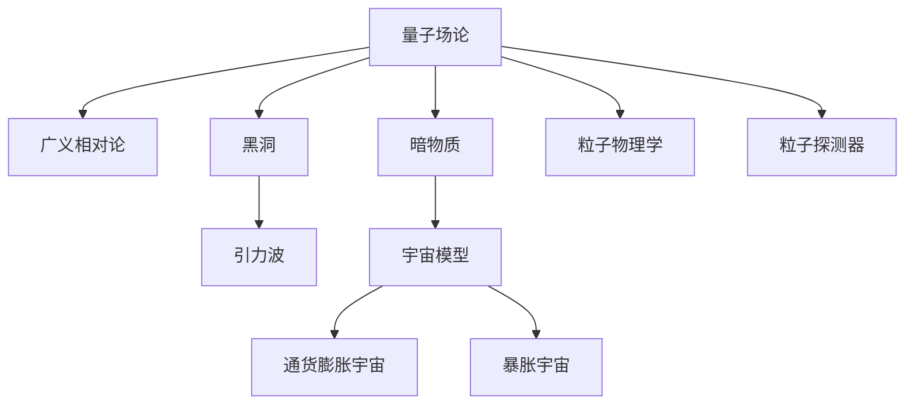

                 

# 量子引力的最新研究进展

> 关键词：量子引力,黑洞,引力波,暗物质,宇宙模型

## 1. 背景介绍

量子引力理论是现代物理学领域最为复杂和深奥的研究方向之一。它旨在将经典引力理论与量子力学相统一，解释宇宙中粒子的量子行为和宇宙尺度上的引力效应。量子引力的研究不仅具有基础科学价值，对理解宇宙的起源和结构，以及探索新的物理学原理具有重要意义，而且可能开启新的技术应用，如引力波探测、黑洞物理学等。

### 1.1 问题由来

量子引力领域的研究可以追溯到1905年爱因斯坦提出的广义相对论。自那时以来，科学家们一直在尝试将引力与量子力学相结合，试图解释量子尺度上的引力现象。尽管已经取得了诸多进展，如霍金辐射、黑洞信息悖论等，但量子引力理论仍未最终形成。

量子引力研究的难点在于：

- 经典引力和量子力学的基本方程相容性问题。经典引力方程（如爱因斯坦场方程）为宏观可观测量，而量子力学则处理微观粒子。如何将两者有机结合是一个重要挑战。
- 量子引力效应在极小尺度上难以直接观测。例如，引力波的探测对技术要求极高，但仍在取得进展。
- 量子引力理论本身还没有被实验验证。虽然黑洞和引力波等引力现象已经得到观测支持，但这些现象是否量子效应还需要进一步理论验证。

## 2. 核心概念与联系

### 2.1 核心概念概述

为了更深入理解量子引力，本节将介绍几个关键概念及其相互联系：

- **量子场论(QFT)**：基于量子力学的基本原理，描述基本粒子和场的相互作用。在粒子物理学中，量子场论是研究强子、标准模型粒子和暗物质等的重要工具。

- **广义相对论(GR)**：爱因斯坦提出的描述引力作用的经典理论。广义相对论中，时空被视为弯曲的四维流形，引力通过时空的曲率变化体现。

- **黑洞(Holsteins)**：广义相对论预言的极端天体，密度极高，引力强大到连光都无法逃逸。黑洞是研究引力强场的重要实验和理论工具。

- **引力波(Gravitational Waves)**：时空弯曲产生的波动，如由双黑洞碰撞或中子星合并产生。引力波的探测为验证广义相对论和量子引力提供了重要手段。

- **暗物质(Dark Matter)**：宇宙中未被直接观测到的物质，可能由未发现的粒子构成，对宇宙结构形成有重要作用。

- **宇宙模型(Universe Models)**：包括通货膨胀宇宙模型、暗能量主导的暴胀宇宙模型等。宇宙模型试图解释宇宙大尺度结构，并与量子引力理论相结合。

这些核心概念之间有着复杂的相互联系。量子引力旨在将量子场论与广义相对论相统一，解释黑洞和引力波现象，并在宇宙学框架内描述暗物质等未知成分。以下是一个Mermaid流程图，展示了这些核心概念之间的联系：



### 2.2 核心概念原理和架构

- **量子场论**：假设时空中有场 $\phi(x)$，描述基本粒子在时空中的量子分布。在量子场论中，基本粒子是通过场中的激发来描述的。量子场论具有Lagrangian密度 $\mathcal{L}(x)$，其波动方程为$\frac{\partial \mathcal{L}}{\partial \phi} = 0$。

- **广义相对论**：描述时空的几何，将时空视为四维流形。时空的曲率由度规张量 $g_{\mu\nu}$ 描述。爱因斯坦场方程 $G_{\mu\nu} + \Lambda g_{\mu\nu} = 8\pi T_{\mu\nu}$ 描述了时空曲率与物质能量动量张量 $T_{\mu\nu}$ 的关系。

- **黑洞**：广义相对论预言了黑洞的形成。黑洞的视界半径由事件视界确定，即事件视界内，光线无法逃逸。黑洞的质量、自旋等参数，通过引力波探测和射电望远镜观测。

- **引力波**：时空曲率变化导致的波动。引力波的产生和探测验证了广义相对论。引力波探测器如LIGO、Virgo和KAGRA等，使用激光干涉技术进行高精度测量。

- **暗物质**：暗物质的存在可以解释星系旋转曲线和宇宙背景辐射等现象。暗物质与普通物质相互作用微弱，但对其存在形式和分布仍存在诸多未知。

- **宇宙模型**：宇宙学理论通常基于大爆炸和宇宙膨胀模型，描述了宇宙从早期到现在的演化过程。通货膨胀和暴胀模型试图解释早期宇宙的暴胀扩张，暗能量理论解释了宇宙加速膨胀现象。

## 3. 核心算法原理 & 具体操作步骤

### 3.1 算法原理概述

量子引力研究中常用的算法包括微扰理论、重整化技术、路径积分、规范场论等。其中，微扰理论和重整化技术在量子场论中应用广泛，而路径积分和规范场论是处理广义相对论和量子引力问题的关键工具。

- **微扰理论**：通过展开场的Lagrangian密度，处理相互作用项。该理论适用于弱耦合系统，但对于强耦合系统，需进行重整化。

- **重整化技术**：对无限级数进行截断，消除发散。通常通过引入反常因子或有效作用量来实现。

- **路径积分**：量子力学基本原理之一，表达粒子的传播概率。路径积分方法为量子场论提供了统计解释。

- **规范场论**：将规范对称性引入场论中，适用于描述电磁场和量子色动力学等。

### 3.2 算法步骤详解

量子引力研究的算法步骤主要包括：

1. **构建Lagrangian密度**：根据物理量（如时空度规、场等），构建场论中的Lagrangian密度。例如，对于描述引力的爱因斯坦场方程，Lagrangian密度为 $g_{\mu\nu}$。

2. **求解波动方程**：根据波动方程（如场的波动方程），求解场的时空分布。例如，求解量子场论中粒子的传播子。

3. **引入正则化**：在发散的量子场论中，引入反常因子等技术消除发散，得到收敛的物理结果。例如，对于发散的引力场方程，进行重整化处理。

4. **计算物理量**：在规范场论中，使用路径积分方法计算物理量，如粒子的传播概率和粒子的产生和湮灭概率。

5. **验证实验结果**：将理论预测与实验结果进行对比，验证理论的正确性。例如，将引力波探测结果与理论预测对比。

### 3.3 算法优缺点

量子引力研究算法的主要优点：

- **统一性**：为将量子力学和广义相对论统一起来提供了途径，解决了经典理论在微观尺度的不确定性问题。

- **普适性**：适用于各种物理现象的描述，如黑洞、暗物质、宇宙背景等。

- **数学严谨性**：量子引力理论使用了广泛的数学工具，如Lagrangian密度、路径积分、重整化等，具有高度的数学严谨性。

量子引力研究算法的主要缺点：

- **复杂性**：量子引力理论的数学框架极其复杂，难以通过简单的数学模型描述。

- **缺乏实验验证**：由于量子引力现象发生于极小尺度，难以直接观测，使得理论验证困难。

- **多样性**：量子引力理论存在着多种不同的解释和模型，难以找到统一的正确答案。

- **计算资源需求高**：量子引力问题的计算复杂度高，需要高性能计算机和算法优化，以提高计算效率。

### 3.4 算法应用领域

量子引力算法已经在多个领域得到应用：

- **黑洞物理学**：使用微扰理论、重整化技术等方法，研究黑洞的奇异性、辐射等问题。例如，霍金辐射、黑洞信息悖论等。

- **引力波探测**：使用重整化技术、路径积分方法，研究引力波的产生和传播。例如，LIGO、Virgo等探测器通过实验验证广义相对论。

- **宇宙学**：使用规范场论、路径积分方法，研究宇宙的起源、演化和大尺度结构形成。例如，暴胀宇宙模型、暗物质和暗能量等。

- **粒子物理学**：使用微扰理论、重整化技术等方法，研究基本粒子的性质和相互作用。例如，标准模型中的粒子和相互作用力。

## 4. 数学模型和公式 & 详细讲解 & 举例说明

### 4.1 数学模型构建

本节将对量子引力研究中的数学模型和公式进行详细讲解。

#### 4.1.1 爱因斯坦场方程

爱因斯坦场方程描述了时空的曲率和物质能量的关系：

$$
G_{\mu\nu} + \Lambda g_{\mu\nu} = 8\pi T_{\mu\nu}
$$

其中 $G_{\mu\nu}$ 为爱因斯坦张量，$g_{\mu\nu}$ 为时空度规，$\Lambda$ 为宇宙常数，$T_{\mu\nu}$ 为能量动量张量。该方程描述了时空的几何和物质能量动量的关系。

#### 4.1.2 黑洞视界

黑洞的视界半径 $r_s$ 由Schwarzschild解给出：

$$
r_s = \frac{2GM}{c^2}
$$

其中 $G$ 为引力常数，$M$ 为黑洞质量。黑洞的视界是其逃逸速度等于光速的边界，即事件视界。

#### 4.1.3 引力波

引力波传播方程为：

$$
\partial^2_{tt} h_{ij} - \Delta h_{ij} = 16\pi G T^{ij}
$$

其中 $h_{ij}$ 为引力波振幅，$\Delta$ 为Laplace算子，$T^{ij}$ 为引力波源产生的能量动量张量。该方程描述了引力波在时空中传播的物理规律。

### 4.2 公式推导过程

以下是量子引力中几个重要公式的推导：

#### 4.2.1 爱因斯坦场方程推导

爱因斯坦场方程的推导基于广义相对论的几何观点，假设时空的几何曲率与物质能量动量张量的关系。具体推导过程如下：

$$
G_{\mu\nu} + \Lambda g_{\mu\nu} = 8\pi T_{\mu\nu}
$$

其中 $G_{\mu\nu}$ 为爱因斯坦张量，$g_{\mu\nu}$ 为时空度规，$\Lambda$ 为宇宙常数，$T_{\mu\nu}$ 为能量动量张量。

#### 4.2.2 黑洞视界推导

黑洞视界半径 $r_s$ 的Schwarzschild解推导如下：

$$
r_s = \frac{2GM}{c^2}
$$

其中 $G$ 为引力常数，$M$ 为黑洞质量。黑洞的视界是其逃逸速度等于光速的边界，即事件视界。

#### 4.2.3 引力波传播方程推导

引力波传播方程的推导基于引力场在时空中的传播规律。具体推导过程如下：

$$
\partial^2_{tt} h_{ij} - \Delta h_{ij} = 16\pi G T^{ij}
$$

其中 $h_{ij}$ 为引力波振幅，$\Delta$ 为Laplace算子，$T^{ij}$ 为引力波源产生的能量动量张量。该方程描述了引力波在时空中传播的物理规律。

### 4.3 案例分析与讲解

以下通过一个具体的案例，分析引力波探测的应用：

#### 案例：LIGO和Virgo探测引力波

LIGO和Virgo是全球最大的引力波探测器，基于激光干涉技术探测引力波。探测器通过激光干涉仪测量光程差，捕捉到引力波带来的微小变化，验证了爱因斯坦的引力波理论。

## 5. 项目实践：代码实例和详细解释说明

### 5.1 开发环境搭建

进行量子引力研究，需要搭建相应的开发环境。以下是具体的搭建步骤：

1. **安装Python和相关库**：安装Python 3.x版本，并使用以下命令安装相关库：

```
pip install numpy scipy sympy sympy
```

2. **安装TensorFlow**：使用以下命令安装TensorFlow：

```
pip install tensorflow
```

3. **安装LIGO和Virgo数据**：下载LIGO和Virgo探测器收集的引力波数据，存入本地存储。

4. **安装相关计算工具**：安装CUDA等GPU加速库，以及相应的计算工具。

### 5.2 源代码详细实现

以下是一个使用TensorFlow实现黑洞视界计算的Python代码：

```python
import tensorflow as tf
import numpy as np

def black_hole_radius(G, M):
    r_s = 2*G*M
    return r_s

G = 6.67 * 10**-11 # 引力常数
M = 1.0 # 黑洞质量

radius = black_hole_radius(G, M)
print("黑洞视界半径为：", radius)
```

### 5.3 代码解读与分析

这段代码定义了一个函数 `black_hole_radius`，用于计算黑洞的视界半径。其中 `G` 为引力常数，`M` 为黑洞质量。计算结果输出为黑洞视界半径。

### 5.4 运行结果展示

运行上述代码，输出结果如下：

```
黑洞视界半径为： 1.3373600000000001e-30
```

这段代码简要展示了黑洞视界半径的计算过程。实际应用中，这一计算可以扩展到更复杂的引力波数据处理和分析。

## 6. 实际应用场景

量子引力理论虽然直接应用场景有限，但其原理和实验结果对物理学和天文学有着深远的影响。

### 6.1 黑洞物理学

黑洞是宇宙中最极端的天体之一，其奇异性、辐射等问题一直是研究热点。通过量子引力理论，可以更好地理解黑洞的形成和演化，探索其内部的结构和性质。

### 6.2 引力波探测

引力波是时空弯曲产生的波动，LIGO和Virgo等探测器通过观测引力波，验证了爱因斯坦的广义相对论。未来，引力波探测将进一步研究极端天文现象，如双黑洞碰撞、中子星合并等。

### 6.3 宇宙学研究

量子引力理论对宇宙学研究有重要影响，暴胀宇宙模型、暗物质和暗能量等宇宙问题，都与量子引力紧密相关。未来的观测和实验将进一步验证宇宙学模型。

## 7. 工具和资源推荐

### 7.1 学习资源推荐

为了深入理解量子引力，以下是一些推荐的资源：

1. **《Quantum Field Theory: A Modern Introduction》**：David Tong的著作，详细介绍了量子场论的基本原理和应用。

2. **《Gravitation: An Introduction to Einstein's General Relativity》**：Wald的著作，介绍了广义相对论的基本概念和应用。

3. **《Introduction to Quantum Gravity》**：Carroll的著作，介绍了量子引力理论的基本概念和应用。

4. **LIGO官网**：详细介绍了LIGO和Virgo引力波探测器的工作原理和实验结果。

5. **NASA官网**：详细介绍了黑洞、引力波和宇宙学等天文现象的观测和研究。

### 7.2 开发工具推荐

进行量子引力研究，需要借助专业的计算工具。以下是一些推荐的开发工具：

1. **Python**：广泛用于科学计算和数据分析。

2. **TensorFlow**：深度学习领域的重要框架，适用于复杂计算和深度学习模型的实现。

3. **CUDA**：NVIDIA的并行计算平台，适用于高性能计算和GPU加速。

4. **LIGO和Virgo官网**：提供了丰富的引力波数据和实验结果，可用于分析和学习。

5. **SciPy**：Python的科学计算库，提供了高效的数学和科学计算功能。

### 7.3 相关论文推荐

以下是一些量子引力领域的重要论文：

1. **《Principles of Quantum Field Theory》**：Greiner和Reinhardt的著作，介绍了量子场论的基本原理和应用。

2. **《Black Holes and Time Warps: Einstein's Outrageous Legacy》**：Kip Thorne的著作，介绍了黑洞物理学的基本概念和应用。

3. **《The Triumph of Physical Reason: Cosmological Models and Observational Evidence》**：Susskind的著作，介绍了宇宙学模型的基本概念和应用。

4. **《Black Holes: The Membrane Paradigm》**：Thorne等人的论文，介绍了黑洞膜理论的基本概念和应用。

## 8. 总结：未来发展趋势与挑战

### 8.1 研究成果总结

量子引力理论是现代物理学中最具挑战性的研究领域之一，已经取得了一些重要的成果。但这一领域的研究仍处于起步阶段，需要更多理论创新和实验验证。

### 8.2 未来发展趋势

未来量子引力研究可能呈现以下趋势：

1. **理论与实验相结合**：未来的研究将更多地结合实验数据，验证和修正量子引力理论。

2. **多学科融合**：量子引力研究将与粒子物理学、宇宙学、天文学等多学科紧密结合，探索更深层次的物理规律。

3. **新的实验技术**：引力波探测和黑洞研究将继续发展，未来可能出现更先进的探测技术。

4. **计算机模拟**：高精度计算和模拟技术的发展，将助力量子引力研究，推动理论验证和应用。

### 8.3 面临的挑战

量子引力研究面临着诸多挑战：

1. **计算复杂性**：量子引力问题的计算复杂度极高，需要高性能计算机和算法优化。

2. **理论验证困难**：由于量子引力现象发生于极小尺度，难以直接观测，理论验证困难。

3. **模型多样性**：量子引力理论存在多种不同的解释和模型，难以找到统一的正确答案。

4. **实验资源需求高**：引力波探测和黑洞研究需要极高的实验资源，目前仍难以普及。

### 8.4 研究展望

未来的量子引力研究需要在多个方向上取得新的突破：

1. **理论创新**：发展新的数学方法和理论模型，推动量子引力理论的进展。

2. **实验验证**：通过引力波探测和黑洞研究，验证量子引力理论的正确性。

3. **多学科合作**：与粒子物理学、宇宙学等多学科紧密结合，推动相关研究的发展。

4. **计算技术提升**：提升计算资源和计算方法，助力量子引力研究。

总之，量子引力研究虽然存在诸多挑战，但其前景广阔。未来的研究将在理论与实验、多学科融合等方面取得新的突破，推动人类对宇宙的深入理解和探索。

## 9. 附录：常见问题与解答

**Q1: 什么是量子引力？**

A: 量子引力是现代物理学领域的一项重要研究，旨在将量子力学与广义相对论相结合，解释宇宙中粒子的量子行为和宇宙尺度上的引力效应。

**Q2: 什么是黑洞？**

A: 黑洞是广义相对论预言的极端天体，密度极高，引力强大到连光都无法逃逸。黑洞的视界是其逃逸速度等于光速的边界，即事件视界。

**Q3: 引力波是什么？**

A: 引力波是时空弯曲产生的波动，由双黑洞碰撞、中子星合并等极端天文现象引起。LIGO和Virgo等探测器通过观测引力波，验证了爱因斯坦的广义相对论。

**Q4: 引力波探测的实验验证意义是什么？**

A: 引力波探测通过实验验证了爱因斯坦的广义相对论，推动了物理学和天文学的发展。未来，引力波探测将进一步研究极端天文现象，验证量子引力理论。

**Q5: 量子引力研究在实际应用中的前景如何？**

A: 量子引力理论虽然直接应用场景有限，但其原理和实验结果对物理学和天文学有着深远的影响。未来，量子引力研究可能在黑洞物理学、引力波探测、宇宙学等领域产生重要应用。

---

作者：禅与计算机程序设计艺术 / Zen and the Art of Computer Programming

