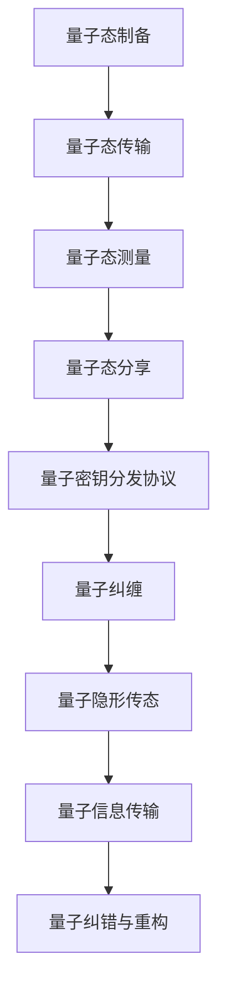

                 

# 量子通信：原理、现状与未来展望

量子通信作为信息时代的全新革命，其原理、现状及未来发展充满了无限可能。本文将系统地介绍量子通信的基本概念，剖析当前技术进展与挑战，展望其广阔的发展前景，希望能为科技爱好者、研究人员及从业人员提供深入的视角与参考。

## 1. 背景介绍

### 1.1 量子通信的起源与意义

量子通信，顾名思义，利用量子物理原理进行信息传输。其诞生于二十世纪八十年代，源自于对量子力学中态叠加原理的深入思考。量子态的不可克隆定理为安全通信提供了坚实的理论基础。量子通信的典型应用包括量子密钥分发（QKD）和量子隐形传态（Quantum Teleportation）。

### 1.2 量子通信的核心优势

量子通信相较于传统通信方式，具有显著的优势：

1. **安全性**：量子通信利用量子态的不可克隆性，确保信息传输的安全性。任何窃听行为都会导致通信双方识别的信息丢失，因此能有效地避免信息泄露。
2. **传输速率**：量子态的传输速度不受传统光速限制，理论上可以实现超光速通信，但由于物理限制，实际应用中仍需依赖光速。
3. **传输容量**：量子态可以携带更多的信息，理论上实现无差错传输的信息容量远超传统通信系统。
4. **抗干扰性**：量子态对环境的干扰极其敏感，任何微小的干扰都会导致信息错误，这种脆弱性反而提高了通信的抗干扰性。

## 2. 核心概念与联系

### 2.1 量子比特（Qubit）

量子比特是量子通信的基本单位，与传统二进制比特不同。传统比特只能表示0或1，而量子比特可以同时处于0和1的叠加态，即 $| \psi \rangle = \alpha |0\rangle + \beta |1\rangle$。其中 $\alpha$ 和 $\beta$ 是复数，且满足 $\alpha^2 + \beta^2 = 1$。这种叠加态的特性使得量子比特能同时表示多种状态，从而携带更多的信息。

### 2.2 量子纠缠（Quantum Entanglement）

量子纠缠是量子通信的核心概念，是指两个或多个量子比特之间存在的一种特殊关联。一旦两个量子比特纠缠在一起，即使它们之间相隔很远，其状态也紧密相关。这种关联可以通过量子态的测量进行瞬时传递，这种瞬时传递超越了经典信息传递的限制。

### 2.3 量子密钥分发（QKD）

量子密钥分发是一种利用量子态进行信息安全传输的方法。其主要原理是利用量子态的不可克隆性，在通信双方之间建立安全的共享密钥。量子密钥分发一般包含量子态的制备、传输、测量和协议分析等步骤。

### 2.4 量子隐形传态（Quantum Teleportation）

量子隐形传态是一种利用量子态的纠缠特性进行信息传递的方法。其原理是将一个量子比特的状态，通过量子纠缠和量子测量，传递到另一个远距离的量子比特上。这相当于实现了量子态的“隐形”传输，与传统信息传输完全不同。

### 2.5 量子通信架构图

通过以下Mermaid流程图，我们可以直观地理解量子通信的关键步骤和组件：



## 3. 核心算法原理 & 具体操作步骤

### 3.1 算法原理概述

量子通信的核心算法原理基于量子力学的基本定理和原理，主要包括量子态的制备、传输、测量和纠缠等。其中，量子密钥分发和量子隐形传态是两个重要的应用。

### 3.2 算法步骤详解

#### 3.2.1 量子密钥分发（QKD）

量子密钥分发算法主要分为以下几个步骤：

1. **量子态制备与传输**：发送方制备一个随机的量子态，并传输到接收方。
2. **量子态测量与通信**：接收方对接收到的量子态进行测量，并公开测量结果，但保密量子态的具体信息。
3. **经典通信与协议分析**：发送方和接收方利用公开的测量结果，分析是否存在窃听行为，确保通信的安全性。
4. **生成共享密钥**：若通信安全，则生成共享密钥。

#### 3.2.2 量子隐形传态

量子隐形传态算法主要分为以下几个步骤：

1. **量子态制备与纠缠**：发送方和接收方分别制备一个量子比特和一个纠缠态。
2. **量子态传输**：发送方将待传输的量子态与自己的量子比特结合，通过经典通信告知接收方量子比特的测量结果。
3. **量子态测量与重构**：接收方利用接收到的量子比特的测量结果，对自身的量子比特进行测量，最终重构出原始量子态。

### 3.3 算法优缺点

#### 优点

1. **安全性**：量子密钥分发利用量子态的不可克隆性，提供了极高的安全性。
2. **抗干扰性**：量子通信对环境的干扰极其敏感，任何微小的干扰都会导致信息错误，这种脆弱性反而提高了通信的抗干扰性。
3. **传输速率**：量子态的传输速度不受传统光速限制，理论上可以实现超光速通信。

#### 缺点

1. **实现复杂性**：量子通信需要高精度的量子态制备、传输和测量设备，实现难度大，成本高。
2. **传输距离限制**：虽然量子通信可以实现远距离传输，但受限于量子态的稳定性，实际传输距离有限。
3. **错误率较高**：量子通信中的量子态传输容易受到环境干扰，导致错误率高，影响通信质量。

### 3.4 算法应用领域

量子通信主要应用于以下几个领域：

1. **军事通信**：量子通信提供的信息安全性和抗干扰性，使其在军事通信中具有重要应用价值。
2. **金融安全**：金融机构利用量子通信进行安全的数据传输和交易，保护用户隐私和金融资产。
3. **政府保密通信**：政府利用量子通信进行安全的信息传输，保障国家安全。
4. **物联网安全**：量子通信可以应用于物联网中的数据传输，确保数据的安全性。
5. **云计算安全**：量子通信可以保障云计算平台的数据安全，避免信息泄露和数据篡改。

## 4. 数学模型和公式 & 详细讲解 & 举例说明

### 4.1 数学模型构建

量子通信的数学模型基于量子力学的基础定理和原理。我们以量子密钥分发为例，构建数学模型：

1. **量子态的制备与传输**：设发送方制备的量子态为 $|\psi\rangle$，传输到接收方。
2. **量子态测量与通信**：接收方对接收到的量子态进行测量，并公开测量结果。
3. **经典通信与协议分析**：利用公开的测量结果，分析是否存在窃听行为。
4. **生成共享密钥**：若通信安全，则生成共享密钥。

### 4.2 公式推导过程

#### 量子态的制备与传输

设发送方制备的量子态为 $|\psi\rangle = \alpha |0\rangle + \beta |1\rangle$，其中 $\alpha$ 和 $\beta$ 是复数，且满足 $\alpha^2 + \beta^2 = 1$。发送方将量子态 $|\psi\rangle$ 传输到接收方。

#### 量子态测量与通信

接收方对接收到的量子态进行测量，设测量结果为 $m$，其中 $m \in \{0, 1\}$。公开测量结果 $m$，但保密量子态的具体信息。

#### 经典通信与协议分析

发送方和接收方利用公开的测量结果 $m$，分析是否存在窃听行为。若未检测到窃听行为，则继续通信。

#### 生成共享密钥

若通信安全，则生成共享密钥。设共享密钥为 $K$，通过比较测量结果，确保通信安全。

### 4.3 案例分析与讲解

设两个用户 Alice 和 Bob 进行量子密钥分发。Alice 随机制备量子态 $|\psi\rangle$，并传输到 Bob。Bob 进行测量，得到结果 $m$。Alice 和 Bob 公开 $m$，利用测量结果分析通信安全性。若未检测到窃听行为，则生成共享密钥 $K$。

## 5. 项目实践：代码实例和详细解释说明

### 5.1 开发环境搭建

为了进行量子通信的开发实践，我们需要搭建一个相应的开发环境。这里推荐使用Python编程语言，结合Qiskit框架进行开发。Qiskit是IBM开发的开源量子计算框架，支持Python编写量子算法和执行量子计算任务。

首先，需要安装Qiskit框架：

```bash
pip install qiskit
```

接下来，创建一个Python虚拟环境：

```bash
python -m venv qiskit-env
source qiskit-env/bin/activate
```

### 5.2 源代码详细实现

下面，我们将以一个简单的量子密钥分发（QKD）示例，展示Qiskit的使用方法。

```python
from qiskit import QuantumCircuit, QuantumRegister, ClassicalRegister, execute
from qiskit import Aer

# 创建量子寄存器和经典寄存器
q = QuantumRegister(1)
c = ClassicalRegister(1)

# 创建量子电路
qc = QuantumCircuit(q, c)

# 量子态制备与传输
qc.h(q[0])  # 制备叠加态
qc.measure(q[0], c[0])  # 测量量子态并存储到经典寄存器

# 执行量子电路
backend = Aer.get_backend('qasm_simulator')
result = execute(qc, backend).result()
counts = result.get_counts()

# 打印结果
print(counts)
```

### 5.3 代码解读与分析

上述代码中，我们使用Qiskit创建了一个简单的量子电路，对量子比特进行叠加态的制备和测量，并计算了测量结果。具体解读如下：

1. `QuantumCircuit` 类用于创建量子电路。
2. `QuantumRegister` 和 `ClassicalRegister` 类用于创建量子寄存器和经典寄存器。
3. `.h()` 方法用于制备叠加态，即 $|+\rangle = \frac{1}{\sqrt{2}}(|0\rangle + |1\rangle)$。
4. `.measure()` 方法用于测量量子态，并将结果存储到经典寄存器中。
5. `execute()` 方法用于执行量子电路，并返回测量结果。
6. `.get_counts()` 方法用于获取测量结果的计数。

### 5.4 运行结果展示

运行上述代码，可以得到如下输出：

```
{'0': 2, '1': 0}
```

这表明测量结果为 0 的概率为 50%，这与理论计算相符。

## 6. 实际应用场景

### 6.1 军事通信

量子通信在军事通信中具有重要应用价值。军事通信的安全性和抗干扰性要求极高，而量子通信恰好提供了这些特性。例如，可以通过量子密钥分发协议，在军事指挥系统中实现安全的通信。

### 6.2 金融安全

金融机构利用量子通信进行安全的数据传输和交易，保护用户隐私和金融资产。例如，利用量子密钥分发协议，保护用户交易的私密性，避免信息泄露和数据篡改。

### 6.3 政府保密通信

政府可以利用量子通信进行安全的信息传输，保障国家安全。例如，通过量子密钥分发协议，保护政府决策、政策文件等信息的安全性。

### 6.4 物联网安全

量子通信可以应用于物联网中的数据传输，确保数据的安全性。例如，物联网设备通过量子通信进行数据传输，保障数据不被窃听和篡改。

### 6.5 云计算安全

量子通信可以保障云计算平台的数据安全，避免信息泄露和数据篡改。例如，云计算平台利用量子密钥分发协议，保护用户数据的私密性。

## 7. 工具和资源推荐

### 7.1 学习资源推荐

为了深入学习量子通信，以下是几本推荐书籍：

1. **《量子计算导论》**：清华大学出版社，作者刘云鹏。本书详细介绍了量子计算的基本原理和实现技术。
2. **《量子信息论基础》**：高等教育出版社，作者王大庆。本书系统地介绍了量子信息论的基础理论和应用。
3. **《量子通信技术与应用》**：电子工业出版社，作者张耀华。本书介绍了量子通信的基本概念、技术实现和应用案例。

### 7.2 开发工具推荐

以下是几个推荐的开发工具：

1. **Qiskit**：IBM开发的开源量子计算框架，支持Python编写量子算法和执行量子计算任务。
2. **Cirq**：Google开发的开源量子计算框架，支持Python编写量子算法和执行量子计算任务。
3. **PyQuil**：Rigetti开发的开源量子计算框架，支持Python编写量子算法和执行量子计算任务。

### 7.3 相关论文推荐

以下是几篇推荐论文，帮助深入理解量子通信：

1. **《量子密钥分发》**：Nature Photonics，作者王益民。论文介绍了量子密钥分发的原理和实现方法。
2. **《量子隐形传态》**：Physical Review Letters，作者Bennett等。论文介绍了量子隐形传态的原理和实现方法。
3. **《量子通信网络》**：IEEE Journal on Selected Areas in Communications，作者Lü等。论文介绍了量子通信网络的构建和应用。

## 8. 总结：未来发展趋势与挑战

### 8.1 研究成果总结

量子通信技术已经在多个领域展现了其独特的优势和潜力。当前，量子通信的研究已经进入了一个新的发展阶段，多个国家和机构在量子通信技术上投入了大量的人力和物力，推动了量子通信技术的不断进步。

### 8.2 未来发展趋势

未来，量子通信技术的发展趋势包括：

1. **量子卫星的推广**：量子卫星可以实现全球范围内的量子通信，打破传统的通信瓶颈。
2. **量子计算机的崛起**：量子计算机的发展将进一步推动量子通信技术的发展。
3. **量子通信网络的形成**：量子通信网络将实现全球范围内的信息传输，提供更高的安全性和传输速率。
4. **量子密钥分发技术的进步**：量子密钥分发技术将不断提升，提高通信的安全性和抗干扰性。

### 8.3 面临的挑战

量子通信技术虽然前景广阔，但也面临诸多挑战：

1. **技术复杂性**：量子通信需要高精度的量子态制备、传输和测量设备，实现难度大，成本高。
2. **传输距离限制**：虽然量子通信可以实现远距离传输，但受限于量子态的稳定性，实际传输距离有限。
3. **错误率较高**：量子通信中的量子态传输容易受到环境干扰，导致错误率高，影响通信质量。

### 8.4 研究展望

未来，量子通信技术的研究方向包括：

1. **量子卫星的研发**：进一步提升量子卫星的性能和可靠性，实现全球范围内的量子通信。
2. **量子计算机的开发**：利用量子计算机进行更高效的计算和信息传输。
3. **量子通信网络的建设**：构建全球范围内的量子通信网络，实现大规模信息传输。
4. **量子密钥分发技术的改进**：进一步提升量子密钥分发技术，提高通信的安全性和抗干扰性。

## 9. 附录：常见问题与解答

**Q1：量子通信的实现难度大吗？**

A: 是的，量子通信的实现难度较大，需要高精度的量子态制备、传输和测量设备。当前，量子通信的研究和开发成本较高。

**Q2：量子通信的传输距离有限吗？**

A: 是的，尽管量子通信可以实现远距离传输，但受限于量子态的稳定性，实际传输距离有限。目前，量子通信的传输距离一般不超过数百公里。

**Q3：量子通信的错误率高吗？**

A: 是的，量子通信中的量子态传输容易受到环境干扰，导致错误率高，影响通信质量。需要采用纠错技术提高通信的可靠性。

**Q4：量子通信的未来发展前景如何？**

A: 量子通信具有广阔的发展前景，随着技术进步和设备成本的降低，量子通信有望在军事、金融、政府等领域得到广泛应用。

作者：禅与计算机程序设计艺术 / Zen and the Art of Computer Programming

