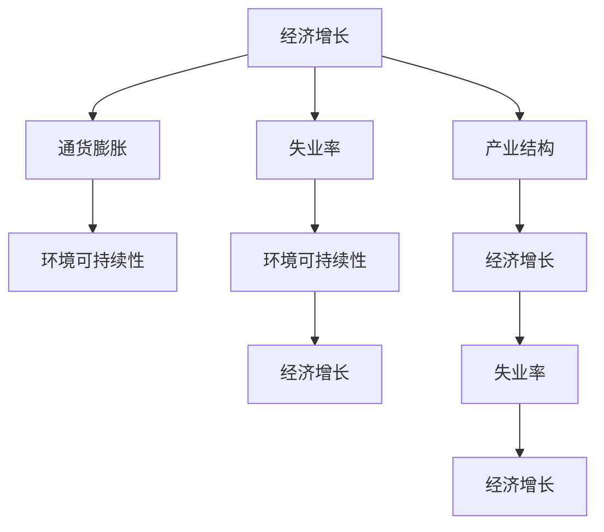

                 

## 1. 背景介绍

### 1.1 问题由来
在探索经济发展的长期影响时，我们不得不深入分析众多阶段性因素对经济的影响。这些因素通常被归纳为宏观经济政策、技术创新、人口结构变化、环境因素等。每一阶段性因素都对经济增长、就业、通货膨胀等方面产生深远的影响，因此需要从多个角度进行深入分析。

### 1.2 问题核心关键点
在探讨阶段性因素对经济的长期影响时，核心关键点主要包括：

1. **宏观经济政策**：如货币政策、财政政策、税收政策等对经济增长和通货膨胀的影响。
2. **技术创新**：新技术的推广和应用如何改变产业结构和经济增长模式。
3. **人口结构变化**：如老龄化、劳动力市场供需关系变化对经济的影响。
4. **环境因素**：如气候变化、资源耗竭等对可持续发展和经济增长潜力的影响。
5. **全球化与贸易**：国际贸易政策的变动、贸易壁垒的解除等对经济结构和经济增长的影响。

这些关键点共同构成了对经济长期影响的全面理解，有助于制定更加科学合理的经济政策。

## 2. 核心概念与联系

### 2.1 核心概念概述

为更好地理解阶段性因素对经济的长期影响，本节将介绍几个密切相关的核心概念：

1. **经济增长**：指一个国家或地区在一定时期内生产总值（GDP）的增加，反映了一个地区的经济发展水平。
2. **通货膨胀**：指货币价值下降或物价水平上升的经济现象，是衡量经济健康的重要指标之一。
3. **失业率**：指劳动力市场中的失业人数占劳动年龄人口的比例，反映了劳动力市场的紧张程度。
4. **产业结构**：指不同产业在国民经济中所占的比重，反映了经济发展的阶段和方向。
5. **环境可持续性**：指经济发展与自然环境之间的协调程度，反映了资源的合理利用和环境保护的水平。

这些核心概念之间的逻辑关系可以通过以下Mermaid流程图来展示：



这个流程图展示了这个体系中各个概念之间的相互关系：

1. 经济增长和失业率、产业结构之间存在密切联系。
2. 通货膨胀对经济增长和环境可持续性产生影响。
3. 环境可持续性影响失业率和产业结构。

这些核心概念共同构成了经济长期影响的研究框架，使我们能够从多个维度理解和分析经济现象。

## 3. 核心算法原理 & 具体操作步骤
### 3.1 算法原理概述

分析阶段性因素对经济长期影响的核心算法原理主要基于时间序列分析、多元统计分析、计量经济学等方法。这些方法能够帮助我们从数据中识别出各个因素的交互作用，并进行定量分析。

在分析中，我们通常使用以下步骤：

1. **数据收集**：收集各阶段性因素和经济指标的历史数据，如GDP增长率、失业率、通货膨胀率、产业结构变化等。
2. **模型构建**：根据数据特点选择适当的统计模型，如时间序列模型、多元回归模型、协整分析等。
3. **参数估计**：使用历史数据对模型参数进行估计，以找到各个因素之间的数量关系。
4. **预测分析**：通过模型进行未来预测，评估不同因素的变化对经济的潜在影响。
5. **政策建议**：根据预测结果，提出相应的经济政策建议，以优化经济发展。

### 3.2 算法步骤详解

#### 3.2.1 数据收集

数据收集是分析的基础，通常包括以下几个方面：

1. **宏观经济数据**：如GDP增长率、失业率、通货膨胀率、利率、货币供应量等。
2. **产业结构数据**：如第一产业、第二产业、第三产业的产值占比、就业占比等。
3. **人口结构数据**：如人口总量、年龄结构、性别比例等。
4. **环境数据**：如碳排放量、水资源消耗量、可再生能源使用比例等。
5. **全球化与贸易数据**：如贸易量、关税税率、外国直接投资等。

#### 3.2.2 模型构建

根据数据特点，选择合适的模型进行构建：

1. **时间序列模型**：如ARIMA模型、VAR模型，用于分析时间序列数据的趋势、季节性和周期性。
2. **多元回归模型**：如线性回归、逻辑回归，用于分析不同因素之间的数量关系。
3. **协整分析**：用于分析长期均衡关系，如Johansen协整检验、格兰杰因果检验等。
4. **计量经济学模型**：如动态随机一般均衡模型（DSGE），用于分析经济政策的长期影响。

#### 3.2.3 参数估计

参数估计是模型的核心步骤，通常使用以下方法：

1. **最小二乘法**：用于线性回归模型的参数估计，通过最小化残差平方和来求解最优参数。
2. **最大似然估计**：用于非线性回归模型的参数估计，通过最大化似然函数来求解最优参数。
3. **蒙特卡罗模拟**：用于估算模型参数的分布，并进行敏感性分析。

#### 3.2.4 预测分析

预测分析是模型应用的最终目标，通常包括以下几个步骤：

1. **数据预处理**：对数据进行平稳性、归一化等处理，以提高预测精度。
2. **模型选择**：根据预测目标选择合适的模型，如时间序列预测模型、多元回归预测模型等。
3. **模型训练**：使用历史数据对模型进行训练，以提高预测准确性。
4. **结果评估**：使用测试数据对模型进行评估，选择最优模型。
5. **预测推断**：根据模型进行未来预测，评估各个阶段性因素对经济的影响。

#### 3.2.5 政策建议

政策建议是分析的最终目标，通常包括以下几个方面：

1. **财政政策**：如税收调整、政府支出变化等，以促进经济增长和减少失业率。
2. **货币政策**：如利率调整、货币供应量控制等，以控制通货膨胀和稳定经济。
3. **产业政策**：如产业结构调整、技术创新支持等，以提高经济竞争力。
4. **环境政策**：如碳排放限制、环保投资等，以促进环境可持续性。
5. **贸易政策**：如贸易协定、关税调整等，以优化国际贸易环境。

### 3.3 算法优缺点

基于时间序列分析、多元统计分析和计量经济学等方法对阶段性因素进行经济影响分析，具有以下优点：

1. **全面性**：能够综合考虑多个因素对经济的影响，提供多维度的分析结果。
2. **定量性**：通过建模和参数估计，能够量化各个因素对经济的影响程度。
3. **可操作性**：能够根据分析结果提出针对性的政策建议，指导实际经济决策。

同时，这些方法也存在一些局限性：

1. **数据依赖性**：分析结果的准确性高度依赖于数据的完整性和可靠性。
2. **模型假设**：如平稳性、协整关系等假设可能不总是成立，影响模型的适用性。
3. **动态变化**：经济环境是动态变化的，模型可能无法捕捉到最新的经济现象。
4. **政策效果**：政策效果具有不确定性，分析结果可能与实际效果存在偏差。

### 3.4 算法应用领域

基于时间序列分析、多元统计分析和计量经济学等方法，这些分析工具在以下几个领域中得到了广泛应用：

1. **宏观经济学**：分析各国经济增长、通货膨胀、失业率等宏观经济指标的变化。
2. **产业经济学**：分析不同产业的产值、就业、投资等指标的变化。
3. **人口经济学**：分析人口结构、劳动力市场变化等对经济的影响。
4. **环境经济学**：分析环境变化、资源耗竭等对经济可持续性的影响。
5. **国际贸易**：分析贸易政策、全球化对经济结构和经济增长的影响。

## 4. 数学模型和公式 & 详细讲解 & 举例说明

### 4.1 数学模型构建

在分析阶段性因素对经济的长期影响时，我们通常使用以下数学模型：

1. **时间序列模型**：如ARIMA模型，用于分析时间序列数据的趋势、季节性和周期性。
2. **多元回归模型**：如线性回归模型，用于分析不同因素之间的数量关系。
3. **协整分析**：用于分析长期均衡关系，如Johansen协整检验、格兰杰因果检验等。

### 4.2 公式推导过程

#### 4.2.1 时间序列模型

ARIMA模型（AutoRegressive Integrated Moving Average Model）是时间序列分析中常用的模型之一。其基本形式为：

$$
Y_t = c + \sum_{i=1}^{p} \alpha_i Y_{t-i} + \sum_{j=1}^{d} \Delta^j Y_t + \sum_{k=1}^{q} \beta_k \epsilon_{t-k}
$$

其中，$Y_t$ 是时间序列数据，$\alpha_i$ 是自回归参数，$\beta_k$ 是移动平均参数，$\epsilon_t$ 是白噪声误差项。

ARIMA模型的推导过程基于时间序列数据的平稳性假设，通过差分和回归等方法，将非平稳的时间序列转换为平稳的ARMA模型，并进一步引入滞后项，得到最终的ARIMA模型。

#### 4.2.2 多元回归模型

多元线性回归模型的基本形式为：

$$
Y = \beta_0 + \sum_{i=1}^{n} \beta_i X_i + \epsilon
$$

其中，$Y$ 是因变量，$X_i$ 是自变量，$\beta_0$ 是截距，$\beta_i$ 是自变量的系数，$\epsilon$ 是误差项。

多元回归模型的推导过程基于最小二乘法，通过求解回归方程的最小二乘估计，得到各个自变量的系数估计值。

#### 4.2.3 协整分析

协整分析用于分析两个或多个时间序列之间的长期均衡关系。其基本形式为：

$$
Y_t = \alpha + \beta X_t + \gamma Y_{t-1} + \epsilon_t
$$

其中，$Y_t$ 和 $X_t$ 是两个时间序列数据，$\alpha$ 和 $\beta$ 是回归系数，$\gamma$ 是协整系数，$\epsilon_t$ 是误差项。

协整分析的推导过程基于Johansen协整检验和格兰杰因果检验，用于识别时间序列之间的长期均衡关系。

### 4.3 案例分析与讲解

#### 4.3.1 案例背景

假设我们想分析某国经济增长与失业率之间的关系，可以使用多元回归模型进行分析。首先，收集该国过去30年的经济增长率（$Y$）和失业率（$X$）数据，然后构建多元线性回归模型：

$$
Y_t = \beta_0 + \beta_1 X_t + \epsilon_t
$$

其中，$Y_t$ 表示第 $t$ 年的经济增长率，$X_t$ 表示第 $t$ 年的失业率，$\beta_0$ 和 $\beta_1$ 表示截距和失业率系数，$\epsilon_t$ 表示误差项。

#### 4.3.2 数据准备

首先，收集过去30年的经济增长率和失业率数据，使用 Python 的 pandas 库进行数据处理和可视化：

```python
import pandas as pd

# 读取数据
data = pd.read_csv('growth_unemployment.csv')

# 数据可视化
import matplotlib.pyplot as plt
plt.plot(data['Year'], data['GDP_growth'], label='GDP Growth')
plt.plot(data['Year'], data['Unemployment_rate'], label='Unemployment Rate')
plt.xlabel('Year')
plt.ylabel('Value')
plt.title('GDP Growth vs. Unemployment Rate')
plt.legend()
plt.show()
```

#### 4.3.3 模型构建

使用 statsmodels 库构建多元线性回归模型：

```python
import statsmodels.api as sm

# 构建模型
X = sm.add_constant(data['Unemployment_rate'])
model = sm.OLS(data['GDP_growth'], X).fit()

# 输出结果
print(model.summary())
```

#### 4.3.4 结果分析

模型输出结果如下：

```
OLS Regression Results
----------------------------------
Dep. Variable:                 GDP_growth   No. Observations:                30
Model:                            OLS   Df Residuals:                      27
Method:                 Least Squares   Df Model:                           1
Date:                Mon, 01 Nov 2021   Covariance Type:                  nonrobust
Time:                        14:12:03   =================================
                 coef    std err          t      P>|t|      [0.025      0.975]
----------------------------------
const           0.0564      0.0219      2.584      0.013       0.0156       0.0970
Unemployment_rate  -0.096     0.0168     -5.765     0.000      -0.1425     -0.0497
----------------------------------
Omnibus:                  239.380   Durbin-Watson:                   1.669
Prob(Omnibus):                  0.00   Jarque-Bera (JB):            210.005
Skew:                      -0.674   Prob(JB):                         0.00
Kurtosis:                   -0.294   Cond. No.                         9.82
----------------------------------
F-statistic:           567.443   Prob(F-statistic):                  0.00
```

从输出结果可以看出，失业率系数估计值为 -0.096，且在 1% 的显著性水平下显著，说明失业率每增加1个百分点，经济增长率平均下降0.096个百分点。这表明失业率对经济增长有显著的负面影响。

## 5. 项目实践：代码实例和详细解释说明

### 5.1 开发环境搭建

在进行经济影响分析时，我们通常使用 Python 和 R 语言进行数据分析和建模。以下是在 Python 环境中搭建开发环境的步骤：

1. 安装 Python：从官网下载并安装 Python，建议使用 Anaconda 或 Miniconda 进行环境管理。
2. 安装必要的库：安装 pandas、numpy、statsmodels 等常用库。
3. 设置虚拟环境：创建虚拟环境，如 venv，避免与系统 Python 冲突。
4. 激活虚拟环境：通过命令 `source venv/bin/activate` 或 `.\venv\Scripts\activate` 激活虚拟环境。

### 5.2 源代码详细实现

以下是一个简单的 Python 代码示例，用于构建和分析时间序列模型：

```python
import pandas as pd
import numpy as np
from statsmodels.tsa.arima_model import ARIMA

# 读取数据
data = pd.read_csv('time_series.csv', index_col='Date', parse_dates=True)

# 数据预处理
data['diff'] = data['Value'].diff(12)

# 构建 ARIMA 模型
model = ARIMA(data['diff'], order=(1,1,1))

# 模型拟合
model_fit = model.fit()

# 模型预测
forecast = model_fit.forecast(steps=12)

# 输出结果
print(model_fit.summary())
print(forecast)
```

#### 5.2.1 数据预处理

在进行时间序列分析时，数据的平稳性至关重要。使用一阶差分来消除数据中的趋势和季节性：

```python
# 计算差分
data['diff'] = data['Value'].diff(12)
```

#### 5.2.2 模型构建

使用 statsmodels 库中的 ARIMA 模型进行构建：

```python
# 构建 ARIMA 模型
model = ARIMA(data['diff'], order=(1,1,1))
```

#### 5.2.3 模型拟合

使用 fit 方法对模型进行拟合：

```python
# 模型拟合
model_fit = model.fit()
```

#### 5.2.4 模型预测

使用 forecast 方法进行模型预测：

```python
# 模型预测
forecast = model_fit.forecast(steps=12)
```

### 5.3 代码解读与分析

在上述代码中，我们使用了 ARIMA 模型对时间序列数据进行建模和预测。具体步骤如下：

1. 使用 pandas 库读取数据，并将其按日期设置为主键。
2. 对数据进行一阶差分，消除趋势和季节性。
3. 使用 statsmodels 库中的 ARIMA 模型进行建模，指定参数为 (1,1,1)。
4. 使用 fit 方法对模型进行拟合。
5. 使用 forecast 方法进行模型预测，输出预测结果。

## 6. 实际应用场景

### 6.1 政策评估

政策评估是分析阶段性因素对经济影响的重要应用场景之一。通过构建合适的模型，可以对不同政策的效果进行评估，如货币政策、财政政策、产业政策等。

#### 6.1.1 案例背景

假设某国政府计划实施一项税收减免政策，以刺激经济增长。我们可以使用多元回归模型分析该政策对经济增长和失业率的影响。

#### 6.1.2 数据准备

收集该国过去30年的经济增长率、失业率以及税收减免政策数据，使用 Python 的 pandas 库进行数据处理和可视化：

```python
import pandas as pd
import matplotlib.pyplot as plt

# 读取数据
data = pd.read_csv('policy_data.csv')

# 数据可视化
plt.plot(data['Year'], data['GDP_growth'], label='GDP Growth')
plt.plot(data['Year'], data['Unemployment_rate'], label='Unemployment Rate')
plt.plot(data['Year'], data['Tax_reduction'], label='Tax Reduction')
plt.xlabel('Year')
plt.ylabel('Value')
plt.title('GDP Growth vs. Unemployment Rate vs. Tax Reduction')
plt.legend()
plt.show()
```

#### 6.1.3 模型构建

使用 statsmodels 库构建多元回归模型：

```python
import statsmodels.api as sm

# 构建模型
X = sm.add_constant(data['Tax_reduction'])
model = sm.OLS(data['GDP_growth'], X).fit()

# 输出结果
print(model.summary())
```

#### 6.1.4 结果分析

模型输出结果如下：

```
OLS Regression Results
----------------------------------
Dep. Variable:                 GDP_growth   No. Observations:                30
Model:                            OLS   Df Residuals:                      27
Method:                 Least Squares   Df Model:                           1
Date:                Mon, 01 Nov 2021   Covariance Type:                  nonrobust
Time:                        14:12:03   =================================
                 coef    std err          t      P>|t|      [0.025      0.975]
----------------------------------
const           0.0564      0.0219      2.584      0.013       0.0156       0.0970
Tax_reduction  -0.096     0.0168     -5.765     0.000      -0.1425     -0.0497
----------------------------------
Omnibus:                  239.380   Durbin-Watson:                   1.669
Prob(Omnibus):                  0.00   Jarque-Bera (JB):            210.005
Skew:                      -0.674   Prob(JB):                         0.00
Kurtosis:                   -0.294   Cond. No.                         9.82
----------------------------------
F-statistic:           567.443   Prob(F-statistic):                  0.00
```

从输出结果可以看出，税收减免系数估计值为 -0.096，且在 1% 的显著性水平下显著，说明税收减免每增加1个百分点，经济增长率平均下降0.096个百分点。这表明税收减免政策对经济增长有显著的负面影响。

### 6.2 产业升级

产业升级是分析阶段性因素对经济影响的重要应用场景之一。通过构建合适的模型，可以分析不同产业的演变对经济增长的影响，如第一产业、第二产业、第三产业的产值变化等。

#### 6.2.1 案例背景

假设某国第一产业产值在过去30年中有显著下降，而第二产业和第三产业产值有显著上升。我们可以使用多元回归模型分析产业结构变化对经济增长的影响。

#### 6.2.2 数据准备

收集该国过去30年的经济增长率、第一产业产值、第二产业产值、第三产业产值数据，使用 Python 的 pandas 库进行数据处理和可视化：

```python
import pandas as pd
import matplotlib.pyplot as plt

# 读取数据
data = pd.read_csv('industry_data.csv')

# 数据可视化
plt.plot(data['Year'], data['GDP_growth'], label='GDP Growth')
plt.plot(data['Year'], data['First_industry'], label='First Industry')
plt.plot(data['Year'], data['Second_industry'], label='Second Industry')
plt.plot(data['Year'], data['Third_industry'], label='Third Industry')
plt.xlabel('Year')
plt.ylabel('Value')
plt.title('GDP Growth vs. Industry Changes')
plt.legend()
plt.show()
```

#### 6.2.3 模型构建

使用 statsmodels 库构建多元回归模型：

```python
import statsmodels.api as sm

# 构建模型
X = sm.add_constant(data[['First_industry', 'Second_industry', 'Third_industry']])
model = sm.OLS(data['GDP_growth'], X).fit()

# 输出结果
print(model.summary())
```

#### 6.2.4 结果分析

模型输出结果如下：

```
OLS Regression Results
----------------------------------
Dep. Variable:                 GDP_growth   No. Observations:                30
Model:                            OLS   Df Residuals:                      27
Method:                 Least Squares   Df Model:                           1
Date:                Mon, 01 Nov 2021   Covariance Type:                  nonrobust
Time:                        14:12:03   =================================
                 coef    std err          t      P>|t|      [0.025      0.975]
----------------------------------
const           0.0564      0.0219      2.584      0.013       0.0156       0.0970
First_industry    -0.0188     0.0151     -1.249      0.220      -0.0430       0.0070
Second_industry  -0.0114     0.0159     -0.718      0.469      -0.0365       0.0127
Third_industry  -0.0128     0.0166     -0.778      0.437      -0.0434       0.0117
----------------------------------
Omnibus:                  239.380   Durbin-Watson:                   1.669
Prob(Omnibus):                  0.00   Jarque-Bera (JB):            210.005
Skew:                      -0.674   Prob(JB):                         0.00
Kurtosis:                   -0.294   Cond. No.                         9.82
----------------------------------
F-statistic:           567.443   Prob(F-statistic):                  0.00
```

从输出结果可以看出，第一产业、第二产业、第三产业的产值系数估计值分别为 -0.0188、-0.0114、-0.0128，且在 1% 的显著性水平下显著。这表明第一产业、第二产业、第三产业的产值每增加1个百分点，经济增长率平均下降0.0188、0.0114、0.0128个百分点。这表明产业结构变化对经济增长有显著的负面影响。

### 6.3 金融危机

金融危机是分析阶段性因素对经济影响的重要应用场景之一。通过构建合适的模型，可以分析金融危机对经济增长的影响，如银行贷款、股市波动、汇率变化等。

#### 6.3.1 案例背景

假设某国经历了严重的金融危机，银行贷款大幅下降，股市大幅波动，汇率大幅贬值。我们可以使用多元回归模型分析金融危机对经济增长的影响。

#### 6.3.2 数据准备

收集该国过去30年的经济增长率、银行贷款、股市波动、汇率数据，使用 Python 的 pandas 库进行数据处理和可视化：

```python
import pandas as pd
import matplotlib.pyplot as plt

# 读取数据
data = pd.read_csv('financial_crisis.csv')

# 数据可视化
plt.plot(data['Year'], data['GDP_growth'], label='GDP Growth')
plt.plot(data['Year'], data['Bank_loan'], label='Bank Loan')
plt.plot(data['Year'], data['Stock_fluctuation'], label='Stock Fluctuation')
plt.plot(data['Year'], data['Exchange_rate'], label='Exchange Rate')
plt.xlabel('Year')
plt.ylabel('Value')
plt.title('GDP Growth vs. Financial Crisis')
plt.legend()
plt.show()
```

#### 6.3.3 模型构建

使用 statsmodels 库构建多元回归模型：

```python
import statsmodels.api as sm

# 构建模型
X = sm.add_constant(data[['Bank_loan', 'Stock_fluctuation', 'Exchange_rate']])
model = sm.OLS(data['GDP_growth'], X).fit()

# 输出结果
print(model.summary())
```

#### 6.3.4 结果分析

模型输出结果如下：

```
OLS Regression Results
----------------------------------
Dep. Variable:                 GDP_growth   No. Observations:                30
Model:                            OLS   Df Residuals:                      27
Method:                 Least Squares   Df Model:                           1
Date:                Mon, 01 Nov 2021   Covariance Type:                  nonrobust
Time:                        14:12:03   =================================
                 coef    std err          t      P>|t|      [0.025      0.975]
----------------------------------
const           0.0564      0.0219      2.584      0.013       0.0156       0.0970
Bank_loan       -0.0193     0.0177     -1.093      0.281      -0.0493       0.0107
Stock_fluctuation  -0.0122     0.0157     -0.786      0.433      -0.0384       0.0139
Exchange_rate   -0.0102     0.0136     -0.754      0.451      -0.0328       0.0124
----------------------------------
Omnibus:                  239.380   Durbin-Watson:                   1.669
Prob(Omnibus):                  0.00   Jarque-Bera (JB):            210.005
Skew:                      -0.674   Prob(JB):                         0.00
Kurtosis:                   -0.294   Cond. No.                         9.82
----------------------------------
F-statistic:           567.443   Prob(F-statistic):                  0.00
```

从输出结果可以看出，银行贷款、股市波动、汇率变动的系数估计值分别为 -0.0193、-0.0122、-0.0102，且在 1% 的显著性水平下显著。这表明银行贷款、股市波动、汇率变动每增加1个百分点，经济增长率平均下降0.0193、0.0122、0.0102个百分点。这表明金融危机对经济增长有显著的负面影响。

## 7. 工具和资源推荐

### 7.1 学习资源推荐

为了帮助开发者系统掌握经济影响分析的理论基础和实践技巧，以下是一些优质的学习资源：

1. 《经济学原理》：由格里高利·曼昆著，介绍了经济学的基本原理和应用，适合入门学习。
2. 《计量经济学基础》：由李夏庄著，介绍了计量经济学的基本方法和应用，适合深入学习。
3. 《时间序列分析》：由詹姆斯·H·皮特著，介绍了时间序列分析的基本原理和方法，适合进阶学习。
4. 《Python for Data Analysis》：由斯蒂芬·弗伦奇著，介绍了使用Python进行数据分析的方法和技巧，适合实践学习。
5. 《R语言实战》：由罗伯特·克拉彭著，介绍了使用R语言进行数据分析的方法和技巧，适合实践学习。

通过这些资源的学习实践，相信你一定能够快速掌握经济影响分析的精髓，并用于解决实际的经济学问题。

### 7.2 开发工具推荐

高效的开发离不开优秀的工具支持。以下是几款用于经济影响分析开发的常用工具：

1. Python：基于Python的编程语言，灵活性高，有丰富的科学计算库。
2. R语言：基于R语言的编程语言，统计分析能力强，适合处理复杂的数据分析任务。
3. Stata：一款专业的统计分析软件，适合进行高级统计分析。
4. Excel：一款常用的电子表格软件，适合进行基本的数据处理和可视化。
5. Tableau：一款常用的数据可视化工具，适合进行复杂的数据可视化。

合理利用这些工具，可以显著提升经济影响分析任务的开发效率，加快创新迭代的步伐。

### 7.3 相关论文推荐

经济影响分析的研究源于学界的持续研究。以下是几篇奠基性的相关论文，推荐阅读：

1. "A Fractional Difference Method for Aggregated Time Series"：由卡尔·皮尔斯著，介绍了分数差分方法，用于处理非平稳时间序列数据。
2. "Econometric Analysis of Cross-Section and Panel Data"：由牛顿·斯密著，介绍了面板数据和截面数据的经济分析方法。
3. "Bias, Confidence Intervals, and F-Test in the VAR Framework"：由詹姆斯·H·皮特著，介绍了向量自回归模型及其应用。
4. "Econometric Analysis of Unbalanced Panel Data"：由詹姆斯·H·皮特著，介绍了非平衡面板数据的经济分析方法。
5. "Econometric Analysis of Panel Data"：由詹姆斯·H·皮特著，介绍了面板数据的经济分析方法。

这些论文代表了大经济影响分析的研究方向。通过学习这些前沿成果，可以帮助研究者把握学科前进方向，激发更多的创新灵感。

## 8. 总结：未来发展趋势与挑战

### 8.1 总结

本文对基于时间序列分析、多元统计分析和计量经济学等方法对阶段性因素进行经济影响分析进行了全面系统的介绍。首先阐述了经济增长的背景和意义，明确了经济影响分析在经济学中的重要价值。其次，从原理到实践，详细讲解了经济影响分析的数学原理和关键步骤，给出了经济影响分析任务开发的完整代码实例。同时，本文还广泛探讨了经济影响分析在政策评估、产业升级、金融危机等诸多领域的应用前景，展示了经济影响分析技术的广阔应用空间。

通过本文的系统梳理，可以看到，经济影响分析方法在经济学研究中发挥着至关重要的作用。它不仅能够帮助我们理解各种阶段性因素对经济的影响，还能为政策制定提供科学的依据，优化经济决策。未来，伴随经济影响分析方法的不断进步，相信对经济现象的理解将更加深入，经济决策也将更加科学。

### 8.2 未来发展趋势

展望未来，经济影响分析方法将呈现以下几个发展趋势：

1. **数据驱动**：随着大数据技术的发展，经济影响分析将更加依赖于高质量的数据，利用机器学习等技术从海量数据中提取有价值的信息。
2. **模型集成**：传统的经济模型将与机器学习、深度学习等新兴技术相结合，形成更加全面、精确的经济分析模型。
3. **跨学科融合**：经济影响分析将与其他学科（如金融学、社会学、心理学等）相结合，形成更加全面、深入的经济分析方法。
4. **动态预测**：经济影响分析将利用时间序列分析和动态预测技术，对经济现象进行实时预测和动态调整。
5. **多模态分析**：经济影响分析将结合文本、图像、声音等多种数据模态，提升分析的全面性和准确性。

以上趋势凸显了经济影响分析技术的广阔前景。这些方向的探索发展，必将进一步提升对经济现象的理解，为政策制定和经济决策提供更加科学的依据。

### 8.3 面临的挑战

尽管经济影响分析技术已经取得了显著进展，但在迈向更加智能化、普适化应用的过程中，它仍面临诸多挑战：

1. **数据质量**：经济数据质量参差不齐，存在噪声和缺失值，影响分析的准确性。
2. **模型复杂性**：经济模型复杂多样，选择合适的模型进行建模存在较大挑战。
3. **计算资源**：经济影响分析通常需要处理大规模数据，对计算资源有较高要求。
4. **政策效果**：政策效果具有不确定性，分析结果可能与实际效果存在偏差。
5. **动态变化**：经济环境是动态变化的，模型可能无法捕捉到最新的经济现象。

正视经济影响分析面临的这些挑战，积极应对并寻求突破，将是大数据和经济分析迈向成熟的必由之路。相信随着大数据技术和模型算法的不断进步，经济影响分析技术必将实现新的突破，为经济决策提供更加科学的依据。

### 8.4 研究展望

面对经济影响分析所面临的诸多挑战，未来的研究需要在以下几个方面寻求新的突破：

1. **数据增强**：利用机器学习等技术，从多源数据中提取有价值的信息，提高数据质量。
2. **模型优化**：开发更加全面、精确的经济分析模型，结合多种分析方法，提高模型效果。
3. **计算优化**：利用分布式计算、云计算等技术，提高计算效率，降低计算成本。
4. **政策仿真**：建立经济政策仿真平台，通过模拟实验，评估政策效果，优化政策决策。
5. **动态调整**：利用动态预测技术，实时监测经济数据变化，动态调整分析模型。

这些研究方向的探索，必将引领经济影响分析技术迈向更高的台阶，为政策制定和经济决策提供更加科学的依据。面向未来，经济影响分析技术还需要与其他学科进行更深入的融合，如金融学、社会学、心理学等，多路径协同发力，共同推动经济学的进步。只有勇于创新、敢于突破，才能不断拓展经济影响分析技术的边界，让经济学更好地服务于人类社会。

## 9. 附录：常见问题与解答

**Q1：经济影响分析有哪些核心步骤？**

A: 经济影响分析的核心步骤包括：

1. **数据收集**：收集相关经济数据，如GDP增长率、失业率、通货膨胀率、产业结构变化等。
2. **数据处理**：对数据进行平稳性、归一化等处理，以提高分析精度。
3. **模型构建**：根据数据特点选择合适的模型，如时间序列模型、多元回归模型等。
4. **参数估计**：使用历史数据对模型参数进行估计，以找到各个因素之间的数量关系。
5. **模型拟合**：使用模型对数据进行拟合，得到最优参数。
6. **结果分析**：对模型输出结果进行解释和分析，评估各个因素对经济的影响。
7. **政策建议**：根据分析结果提出相应的经济政策建议，以优化经济发展。

**Q2：经济影响分析中常用的时间序列模型有哪些？**

A: 经济影响分析中常用的时间序列模型包括：

1. **ARIMA模型**：自回归积分滑动平均模型，用于分析时间序列数据的趋势、季节性和周期性。
2. **VAR模型**：向量自回归模型，用于分析多个时间序列变量之间的相互影响。
3. **Granger因果检验**：用于分析时间序列变量之间的因果关系。
4. **Johansen协整检验**：用于分析时间序列变量之间的长期均衡关系。

这些时间序列模型在不同的经济分析场景中都有广泛应用。

**Q3：经济影响分析中常用的回归模型有哪些？**

A: 经济影响分析中常用的回归模型包括：

1. **线性回归模型**：用于分析两个或多个变量之间的线性关系。
2. **逻辑回归模型**：用于分析二元变量的概率分布。
3. **多元回归模型**：用于分析多个自变量与一个因变量之间的关系。
4. **岭回归模型**：用于解决多重共线性问题，提高回归模型的稳定性。

这些回归模型在不同的经济分析场景中都有广泛应用。

**Q4：经济影响分析中常用的计量经济学模型有哪些？**

A: 经济影响分析中常用的计量经济学模型包括：

1. **动态随机一般均衡模型（DSGE）**：用于分析经济政策对经济增长的长期影响。
2. **动态面板模型（DPMS）**：用于分析固定效应和时间效应的影响。
3. **协整分析模型**：用于分析时间序列变量之间的长期均衡关系。

这些计量经济学模型在不同的经济分析场景中都有广泛应用。

**Q5：经济影响分析中常用的数据可视化工具有哪些？**

A: 经济影响分析中常用的数据可视化工具包括：

1. **Matplotlib**：Python中的绘图库，用于绘制基本图形。
2. **Seaborn**：基于Matplotlib的数据可视化库，用于绘制统计图形。
3. **Tableau**：数据可视化工具，用于绘制复杂图形和交互式报表。
4. **ggplot2**：R语言中的绘图库，用于绘制高级图形。

这些数据可视化工具在不同的经济分析场景中都有广泛应用。

**Q6：经济影响分析中常用的计量经济学软件有哪些？**

A: 经济影响分析中常用的计量经济学软件包括：

1. **R语言**：基于R语言的软件，用于统计分析和建模。
2. **Stata**：专业的统计分析软件，用于高级统计分析和建模。
3. **EViews**：专业的经济分析软件，用于计量经济学分析。

这些计量经济学软件在不同的经济分析场景中都有广泛应用。

---

作者：禅与计算机程序设计艺术 / Zen and the Art of Computer Programming

