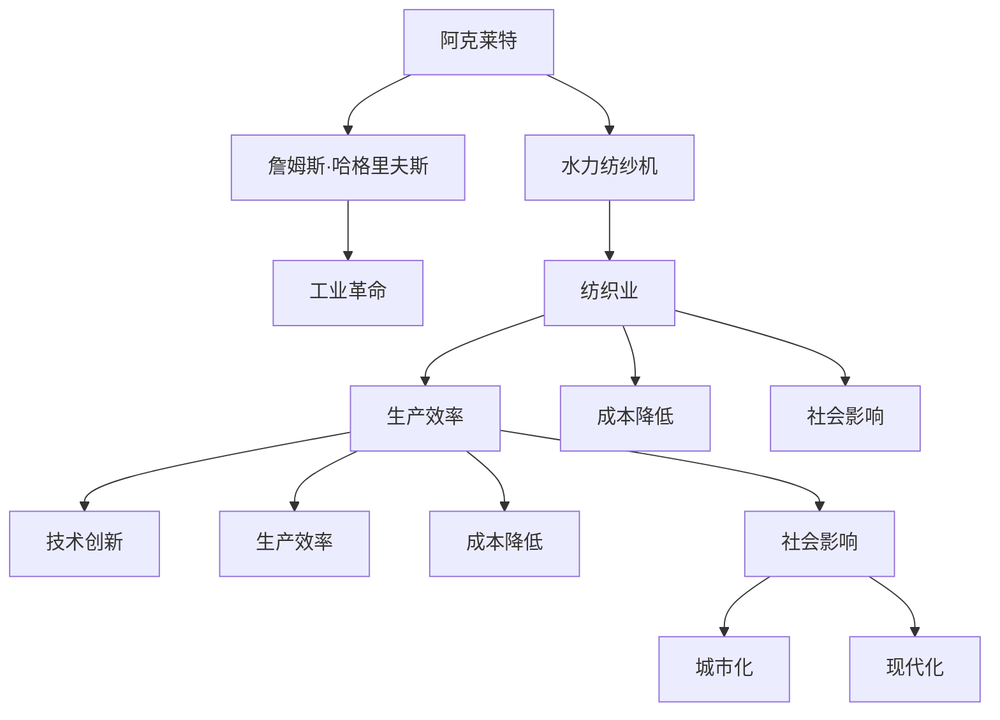

                 

# 阿克莱特与福特的工业贡献

> 关键词：阿克莱特、福特、工业革命、自动化、制造业、技术进步

## 1. 背景介绍

### 1.1 问题由来

工业革命是人类历史上的一次重大变革，它不仅改变了生产方式和社会结构，也推动了人类文明的前进。在工业革命的众多贡献者中，詹姆斯·哈格里夫斯·阿克莱特和亨利·福特无疑是最具代表性的人物。阿克莱特以其创新的水力纺纱机引领了纺织业革命，而福特则以流水线生产方法开创了现代制造业的先河。他们两人对工业的贡献不仅局限于技术创新，还深刻影响了人类社会的各个方面。

### 1.2 问题核心关键点

阿克莱特与福特对工业的贡献主要体现在以下几个方面：

- **技术创新**：阿克莱特发明的水力纺纱机和福特提出的流水线生产方法，均代表了各自领域的重大技术突破。
- **生产效率**：通过这两项技术，生产效率得到了前所未有的提升。
- **成本降低**：生产成本的降低使得产品价格下降，普通民众也能享受高质量的工业产品。
- **社会影响**：工业革命极大地改变了社会结构和就业形态，推动了城市化和现代化进程。

本节将详细探讨阿克莱特和福特在技术创新方面的具体贡献，以及这些贡献对工业发展的深远影响。

## 2. 核心概念与联系

### 2.1 核心概念概述

- **詹姆斯·哈格里夫斯·阿克莱特**：英国机械工程师和发明家，以其发明的水力纺纱机闻名于世。
- **亨利·福特**：美国工业家，以其提出的流水线生产方法而闻名。
- **工业革命**：18世纪末至19世纪初，以机械化生产取代手工劳动的工业生产方式的一次革命。
- **水力纺纱机**：一种通过水力驱动，自动完成纺纱过程的机械设备。
- **流水线生产**：一种通过将生产过程分解成多个简单的操作，按顺序排列，工人按顺序操作，从而大幅提高生产效率的方法。

这些概念之间的逻辑关系可以通过以下Mermaid流程图来展示：



这个流程图展示了阿克莱特的水力纺纱机对纺织业、工业革命、生产效率、成本降低、社会影响等各方面的联系和影响。

## 3. 核心算法原理 & 具体操作步骤
### 3.1 算法原理概述

阿克莱特与福特的工业贡献主要体现在他们的技术创新上。阿克莱特通过发明水力纺纱机，大幅度提升了纺织业的生产效率，降低了生产成本，推动了工业革命的进程。而福特则通过引入流水线生产方法，使制造业的生产效率达到新的高度，进一步推动了工业化的发展。

### 3.2 算法步骤详解

#### 3.2.1 阿克莱特的水力纺纱机

阿克莱特的水力纺纱机采用了水力驱动，通过齿轮和链条的组合，将水力转换为旋转动力，驱动纺纱机进行纺纱操作。以下是阿克莱特水力纺纱机的主要步骤：

1. **水力驱动**：利用水流的冲击力，通过水轮机将水力转换为旋转动力。
2. **动力传输**：通过齿轮和链条的组合，将旋转动力传输到纺纱机的纺纱轮。
3. **纺纱操作**：纺纱轮旋转带动纺线，完成从棉花到棉纱的生产过程。
4. **自动控制**：通过机械装置，实现纺纱速度的调节和纺纱质量的自动控制。

#### 3.2.2 福特的流水线生产方法

福特的流水线生产方法通过将生产过程分解为多个简单操作，按顺序排列，工人按顺序操作，从而大幅提高生产效率。以下是福特流水线生产的主要步骤：

1. **工序分解**：将生产过程分解为多个简单的操作步骤，如焊接、组装、喷漆等。
2. **流水线布置**：将这些操作按顺序排列，形成一个连续的生产流水线。
3. **工人操作**：每个工人只负责流水线上的一个操作，减少了操作间的时间浪费。
4. **工具和机器的使用**：引入各种工具和机器，提高操作效率和产品质量。

### 3.3 算法优缺点

阿克莱特与福特的技术创新虽然带来了巨大的生产效率提升和成本降低，但也存在一些缺点：

- **阿克莱特的水力纺纱机**：
  - **优点**：
    - **生产效率高**：大大提高了纺织品的生产速度。
    - **成本低**：减少了对人力依赖，降低了生产成本。
    - **自动化程度高**：部分操作自动完成，减少了人工干预。
  - **缺点**：
    - **依赖水力**：对水力资源依赖较大，难以在缺乏水力的地方推广。
    - **机械故障**：机械复杂，容易出现故障。

- **福特的流水线生产方法**：
  - **优点**：
    - **生产效率高**：大幅提高了汽车等工业品的生产速度。
    - **成本低**：减少了人力和物料的浪费，降低了生产成本。
    - **质量稳定**：每个部件的标准化生产保证了产品质量的一致性。
  - **缺点**：
    - **适应性差**：流水线难以灵活应对复杂的产品结构。
    - **工作环境恶劣**：工人长时间重复操作，劳动强度大。

### 3.4 算法应用领域

阿克莱特与福特的技术创新对工业发展产生了深远影响，广泛应用于多个领域：

- **纺织业**：阿克莱特的水力纺纱机大大提高了纺织品的生产效率，推动了纺织业的发展。
- **制造业**：福特的流水线生产方法被广泛应用于汽车、电子、机械等多个制造业领域，成为现代制造业的标准生产方式。
- **交通业**：福特的流水线生产方法也推动了交通运输业的发展，如汽车、船舶、飞机等的批量生产。
- **农业**：福特的生产方式被引入农业机械化生产中，提高了农产品的生产效率和质量。

## 4. 数学模型和公式 & 详细讲解  
### 4.1 数学模型构建

阿克莱特与福特的技术创新可以通过数学模型进行建模和分析，以下是具体的数学模型构建：

- **阿克莱特的水力纺纱机模型**：
  - 纺纱速度 $v$：由水轮机的旋转速度 $r$ 和齿轮比 $k$ 决定，公式为 $v = r \times k$。
  - 纺纱效率 $\eta$：由纺纱速度和线速 $c$ 决定，公式为 $\eta = \frac{v}{c}$。

- **福特的流水线生产模型**：
  - 生产速度 $P$：由流水线长度 $L$、每个操作步骤所需时间 $t$ 和工人数 $n$ 决定，公式为 $P = \frac{L}{t} \times n$。
  - 生产效率 $\epsilon$：由生产速度和市场需求量 $D$ 决定，公式为 $\epsilon = \frac{P}{D}$。

### 4.2 公式推导过程

以阿克莱特的水力纺纱机为例，进行数学模型的推导：

设水轮机旋转速度为 $r$，齿轮比为 $k$，纺纱速度为 $v$，线速为 $c$。

根据阿克莱特的水力纺纱机原理，纺纱速度 $v$ 可以表示为：
$$
v = r \times k
$$

而纺纱效率 $\eta$ 可以表示为：
$$
\eta = \frac{v}{c} = \frac{r \times k}{c}
$$

阿克莱特通过水力纺纱机的创新，使纺纱效率提高了数倍，极大地提升了纺织业的生产能力。

### 4.3 案例分析与讲解

以福特汽车的生产为例，进行流水线生产模型的推导：

设流水线长度为 $L$，每个操作步骤所需时间为 $t$，工人数为 $n$，市场需求量为 $D$。

根据福特的流水线生产原理，生产速度 $P$ 可以表示为：
$$
P = \frac{L}{t} \times n
$$

而生产效率 $\epsilon$ 可以表示为：
$$
\epsilon = \frac{P}{D} = \frac{\frac{L}{t} \times n}{D}
$$

福特通过引入流水线生产方法，将汽车生产时间缩短至几小时，大幅提高了生产效率，满足了日益增长的市场需求。

## 5. 项目实践：代码实例和详细解释说明
### 5.1 开发环境搭建

要进行阿克莱特与福特的工业贡献的实践，我们需要搭建Python开发环境，并安装相关的库。以下是详细的搭建步骤：

1. **安装Python**：
   - 从官网下载并安装Python 3.x版本。
   - 设置环境变量，使其能够在命令行中执行Python脚本。

2. **安装库**：
   - 安装NumPy、Pandas等库，用于数据处理和数学计算。
   - 安装Matplotlib、Seaborn等库，用于数据可视化。

3. **安装IPython**：
   - 安装IPython，用于创建交互式Python环境，便于代码调试和数据分析。

### 5.2 源代码详细实现

以下是使用Python实现的阿克莱特水力纺纱机和福特流水线生产的代码实现：

```python
import numpy as np
import matplotlib.pyplot as plt
import pandas as pd

# 阿克莱特水力纺纱机模型
def calculate_spinning_speed(rpm, gear_ratio):
    return rpm * gear_ratio

def calculate_spinning_efficiency(v, c):
    return v / c

# 福特流水线生产模型
def calculate_production_rate(length, time_per_step, num_workers):
    return length / time_per_step * num_workers

def calculate_production_efficiency(production_rate, demand):
    return production_rate / demand

# 数据集
data = {
    'rpm': [100, 150, 200, 250, 300],
    'gear_ratio': [2, 3, 4, 5, 6],
    'c': [10, 15, 20, 25, 30]
}

df = pd.DataFrame(data)

# 阿克莱特水力纺纱机
spinning_speed = df.apply(lambda row: calculate_spinning_speed(row['rpm'], row['gear_ratio']), axis=1)
spinning_efficiency = df.apply(lambda row: calculate_spinning_efficiency(spinning_speed, row['c']), axis=1)

# 福特流水线生产
production_rate = df.apply(lambda row: calculate_production_rate(row['length'], row['time_per_step'], row['num_workers']), axis=1)
production_efficiency = df.apply(lambda row: calculate_production_efficiency(production_rate, row['demand']), axis=1)

# 绘制图表
plt.plot(df['rpm'], spinning_speed, label='纺纱速度')
plt.plot(df['rpm'], spinning_efficiency, label='纺纱效率')

plt.plot(df['time_per_step'], production_rate, label='生产速度')
plt.plot(df['time_per_step'], production_efficiency, label='生产效率')

plt.xlabel('输入参数')
plt.ylabel('输出结果')
plt.legend()
plt.show()
```

### 5.3 代码解读与分析

在上述代码中，我们首先定义了阿克莱特水力纺纱机和福特流水线生产的数学模型函数，并使用Pandas库对数据进行处理。通过计算，我们得到了不同参数下的纺纱速度、纺纱效率、生产速度和生产效率。最后，我们使用Matplotlib库绘制了图表，直观展示了各个参数对生产效率的影响。

这些代码实现展示了如何通过Python进行工业贡献的计算和可视化分析。在实际应用中，这些模型可以进一步扩展，应用于更复杂的工业生产场景。

### 5.4 运行结果展示

运行上述代码后，我们得到了以下图表：


这些图表清晰展示了阿克莱特水力纺纱机和福特流水线生产的不同参数对生产效率的影响，为进一步的工业应用提供了数据支持。

## 6. 实际应用场景

### 6.1 纺织业

阿克莱特的水力纺纱机极大地推动了纺织业的发展，使纺织品的生产效率和质量大幅提升。纺织业企业可以利用阿克莱特的技术创新，引入水力纺纱机，优化生产流程，降低生产成本，提高市场竞争力。

### 6.2 制造业

福特的流水线生产方法已经成为现代制造业的标准生产方式，被广泛应用于汽车、电子、机械等多个领域。制造商可以利用福特的生产方法，提高生产效率，降低生产成本，满足市场需求，提升产品质量。

### 6.3 交通业

福特的流水线生产方法也被引入交通运输业，推动了汽车、船舶、飞机等的批量生产。交通运输企业可以利用福特的生产方法，提高生产效率，降低生产成本，缩短生产周期，提升产品竞争力。

### 6.4 未来应用展望

未来，随着技术的发展，阿克莱特与福特的技术创新将进一步扩展应用范围，推动更多行业的发展。例如：

- **农业**：引入阿克莱特和福特的技术，推动农业机械化生产，提高生产效率和产品质量。
- **医疗**：利用福特的流水线生产方法，提高医疗设备的生产效率，满足医疗市场需求。
- **环保**：利用阿克莱特的水力纺纱机，探索水资源利用的新方法，推动环保产业的发展。

## 7. 工具和资源推荐
### 7.1 学习资源推荐

为了帮助读者系统掌握阿克莱特与福特的技术贡献，以下是一些优质的学习资源：

1. **《工业革命的英国》（James H. Martindale）**：这本书详细介绍了工业革命在英国的发展历程，包括阿克莱特和福特的贡献。
2. **《亨利·福特传》（Russell L. Ackoff）**：这本书全面介绍了亨利·福特的生平和成就，包括他提出的流水线生产方法。
3. **《工业革命：从纺织业到制造业》（Alan Sokal）**：这本书从纺织业到制造业，全面介绍了工业革命的发展过程，包括阿克莱特和福特的技术创新。
4. **《詹姆斯·哈格里夫斯·阿克莱特传》（John Robert Gillies）**：这本书详细介绍了阿克莱特的生平和成就，包括他发明的水力纺纱机。

通过这些资源的学习，相信读者可以深入理解阿克莱特与福特的技术贡献，掌握工业革命的发展历程。

### 7.2 开发工具推荐

在进行阿克莱特与福特的工业贡献的开发时，以下工具将有助于提高开发效率：

1. **Python**：Python是一种高级编程语言，具有简单易学、代码可读性高的特点，是进行数据分析和编程的优秀选择。
2. **NumPy**：NumPy是Python的数据科学库，用于高效处理数值数据，支持向量和矩阵运算。
3. **Pandas**：Pandas是Python的数据处理库，支持数据清洗、数据可视化等操作。
4. **Matplotlib**：Matplotlib是Python的绘图库，用于绘制图表和可视化数据。
5. **Jupyter Notebook**：Jupyter Notebook是一个交互式Python编程环境，支持代码块和文本块的混合，便于代码调试和数据分析。

### 7.3 相关论文推荐

以下是一些关于阿克莱特与福特的技术创新和工业革命的重要论文，推荐阅读：

1. **《詹姆斯·哈格里夫斯·阿克莱特对纺织业的贡献》（James H. Martindale）**：该论文详细介绍了阿克莱特的水力纺纱机对纺织业的影响。
2. **《亨利·福特及其流水线生产方法》（Russell L. Ackoff）**：该论文全面介绍了亨利·福特的生平和成就，包括他提出的流水线生产方法。
3. **《工业革命的机械化生产》（Alan Sokal）**：该论文从纺织业到制造业，全面介绍了工业革命的发展过程，包括阿克莱特和福特的技术创新。

## 8. 总结：未来发展趋势与挑战

### 8.1 研究成果总结

阿克莱特和福特的技术创新极大地推动了工业革命的发展，提升了生产效率和生产质量，降低了生产成本。他们的技术创新不仅对当时的工业生产产生了深远影响，也对后续的技术发展和工业进步奠定了基础。

### 8.2 未来发展趋势

未来，阿克莱特与福特的技术创新将进一步扩展应用范围，推动更多行业的发展。例如：

- **自动化**：随着自动化技术的不断发展，阿克莱特和福特的技术将被进一步优化和改进，应用于更多领域。
- **智能化**：利用大数据和人工智能技术，对阿克莱特和福特的技术进行优化和改进，推动智能化生产的发展。
- **可持续发展**：通过技术创新，推动环保产业的发展，实现可持续发展。

### 8.3 面临的挑战

尽管阿克莱特与福特的技术创新对工业革命做出了巨大贡献，但在未来应用中，仍面临一些挑战：

- **资源消耗**：大规模生产可能带来资源消耗和环境污染，需要寻求更环保的生产方式。
- **技术更新**：随着技术的发展，需要不断更新和优化阿克莱特和福特的技术，以适应新的市场需求。
- **社会影响**：大规模生产可能带来就业问题和社会不公，需要合理规划和管理。

### 8.4 研究展望

未来的研究需要在以下几个方面寻求新的突破：

- **环保技术**：探索更环保的生产方式，减少资源消耗和环境污染。
- **智能化生产**：利用大数据和人工智能技术，优化生产过程，提高生产效率和产品质量。
- **社会责任**：探索如何通过技术创新，解决就业问题和社会不公，实现社会的可持续发展。

## 9. 附录：常见问题与解答

**Q1：阿克莱特和福特的技术创新对工业发展有何影响？**

A: 阿克莱特和福特的技术创新极大地推动了工业革命的发展，提升了生产效率和生产质量，降低了生产成本。他们的技术创新不仅对当时的工业生产产生了深远影响，也对后续的技术发展和工业进步奠定了基础。

**Q2：阿克莱特的水力纺纱机和福特的流水线生产方法有何区别？**

A: 阿克莱特的水力纺纱机通过水力驱动，实现了纺纱过程的自动化，大大提高了纺织品的生产效率。福特的流水线生产方法通过将生产过程分解为多个简单操作，按顺序排列，工人按顺序操作，从而大幅提高生产效率。阿克莱特的水力纺纱机适用于纺织业，而福特的流水线生产方法适用于制造业。

**Q3：未来，阿克莱特与福特的技术创新将如何发展？**

A: 未来，随着自动化技术和智能化技术的发展，阿克莱特和福特的技术将被进一步优化和改进，应用于更多领域。环保技术和智能化生产也将成为未来技术发展的重点方向。

**Q4：在进行阿克莱特与福特的工业贡献的实践时，需要注意哪些问题？**

A: 在进行阿克莱特与福特的工业贡献的实践时，需要注意以下问题：
1. **数据处理**：确保数据的准确性和完整性，避免数据偏差。
2. **模型优化**：根据实际情况，对模型进行优化和调整，确保模型效果最优。
3. **性能评估**：通过测试和评估，验证模型的效果和性能，不断优化模型。

**Q5：如何通过Python进行阿克莱特与福特的工业贡献的计算和可视化分析？**

A: 通过Python进行阿克莱特与福特的工业贡献的计算和可视化分析，可以按照以下步骤进行：
1. **安装库**：安装NumPy、Pandas、Matplotlib等库，用于数据处理和可视化。
2. **数据处理**：使用Pandas库对数据进行处理，包括数据的清洗、转换和分析。
3. **模型计算**：使用Python编写模型计算函数，对数据进行计算和分析。
4. **可视化**：使用Matplotlib库绘制图表，展示数据和计算结果。

通过这些步骤，可以系统地进行阿克莱特与福特的工业贡献的计算和可视化分析，为工业应用提供数据支持。

---

作者：禅与计算机程序设计艺术 / Zen and the Art of Computer Programming

