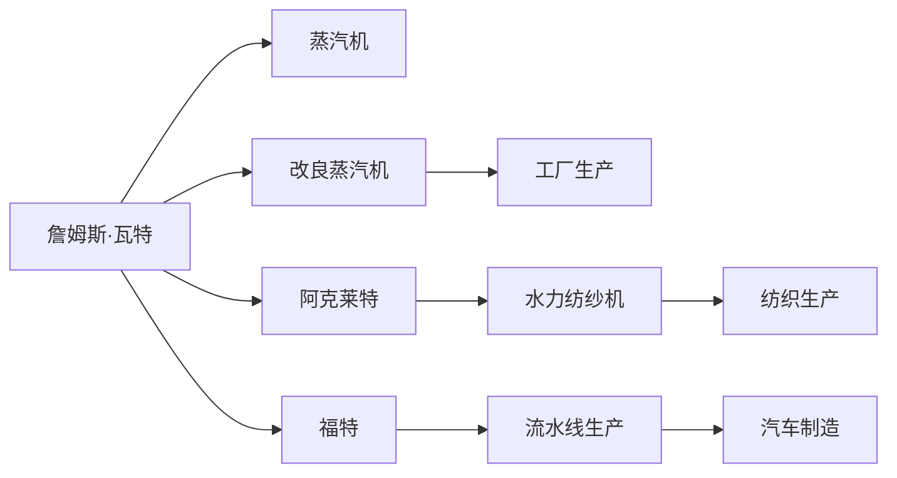

                 

# 阿克莱特与福特的工业革命贡献

## 1. 背景介绍

在19世纪末，全球工业化浪潮席卷而来，蒸汽机的轰鸣声、纺织机的飞速运转，成为了那一时代最显著的符号。在这个过程中，詹姆斯·瓦特（James Watt）的改良蒸汽机，和约翰·阿克莱特（Richard Arkwright）的水力纺纱机，以及亨利·福特（Henry Ford）的流水线生产，成为了引领工业革命的三个关键节点。本文将详细探讨阿克莱特与福特在工业革命中的贡献，并分析他们对未来工业化的深远影响。

## 2. 核心概念与联系

### 2.1 核心概念概述

- **阿克莱特（Richard Arkwright）**：1741年出生于英格兰，被誉为“纺织机械之父”，其最为人熟知的发明是水力纺纱机（Spinning Jenny的改良版），显著提升了纺织效率。
- **福特（Henry Ford）**：1863年出生于美国，是福特汽车公司的创始人，其最著名的贡献是流水线生产（Assembly Line）和大规模制造，极大提高了生产效率和降低了成本。

### 2.2 核心概念原理和架构的 Mermaid 流程图



这个图展示了阿克莱特和福特的工业革命贡献。詹姆斯·瓦特改良的蒸汽机使得工厂生产成为可能，而阿克莱特的水力纺纱机极大提升了纺织效率，福特的流水线生产则彻底改变了制造业的生产方式。

## 3. 核心算法原理 & 具体操作步骤

### 3.1 算法原理概述

阿克莱特和福特对工业革命的贡献主要在于他们发明的机械化生产方式，极大地提升了生产效率和质量。

- **阿克莱特的贡献**：阿克莱特发明的水力纺纱机，通过使用水力代替人力，显著提高了纺织效率，为后来的机械化生产奠定了基础。
- **福特的贡献**：福特发明的流水线生产方式，通过将生产流程分解为多个独立工序，每个工序由专人负责，大幅提高了生产效率，降低了生产成本。

### 3.2 算法步骤详解

**阿克莱特的水力纺纱机：**

1. **背景**：18世纪的纺织行业主要依靠手工操作，效率低下，生产成本高。
2. **发明**：1764年，阿克莱特发明了水力纺纱机，利用水力驱动纺纱，大大提升了生产效率。
3. **改进**：后来他又发明了“罗新特纺纱机”（Rotherham Spinning Frame），进一步提升了纺纱速度和质量。

**福特的流水线生产：**

1. **背景**：19世纪末，汽车制造仍然采用手工作坊式的生产方式，效率低下，成本高昂。
2. **发明**：1913年，福特引入了流水线生产方式，将制造过程分解为多个独立工序，每个工序由专人负责，极大地提高了生产效率。
3. **优化**：通过引入标准化的零件制造和装配方式，福特进一步降低了生产成本，大幅提升了生产效率。

### 3.3 算法优缺点

**阿克莱特的优点**：

- 极大提升了纺织效率，缩短了生产周期。
- 带动了机械化生产的普及，为后续工业化奠定基础。

**阿克莱特的缺点**：

- 设备成本较高，推广初期对中小企业来说有门槛。
- 对工人的技能要求较高，需要较长的培训期。

**福特的优点**：

- 大幅提高了生产效率，降低了生产成本。
- 流水线生产方式易于复制和推广，促进了制造业的快速扩张。

**福特的缺点**：**

- 生产高度依赖流水线，缺乏灵活性。
- 对工人的工作强度较大，容易引发劳工问题。

### 3.4 算法应用领域

阿克莱特与福特的贡献不仅仅局限于纺织和汽车制造，他们的机械化生产方式对整个工业化进程产生了深远影响，应用领域广泛：

- **纺织行业**：阿克莱特的发明直接提升了纺织效率，带动了整个纺织行业的机械化。
- **制造业**：福特的流水线生产方式被广泛应用于各种制造业，如机械制造、电子产品等。
- **现代制造**：现代制造业的自动化和智能化，都可以看作是对阿克莱特和福特方法的延伸和优化。

## 4. 数学模型和公式 & 详细讲解 & 举例说明

### 4.1 数学模型构建

- **阿克莱特的水力纺纱机**：

  设纺纱速度为 \( V \)，单位时间内纺出的纱线长度为 \( L \)，则纺纱效率 \( E \) 可表示为：
  
  $$
  E = \frac{L}{t}
  $$

  其中 \( t \) 为纺纱时间。

- **福特的流水线生产**：

  设生产一条汽车的时间为 \( T \)，流水线分解为 \( n \) 个独立工序，每个工序耗时为 \( t_i \)，则生产效率 \( P \) 为：
  
  $$
  P = \frac{1}{\sum_{i=1}^n t_i}
  $$

### 4.2 公式推导过程

对于阿克莱特的水力纺纱机，假设原始纺纱速度为 \( V_0 \)，纺出的纱线长度为 \( L_0 \)，则水力纺纱机提高了 \( k \) 倍效率，有：
  
  $$
  V = k \times V_0
  $$
  
  因此，提高的效率 \( E' \) 为：
  
  $$
  E' = \frac{L'}{t'} = \frac{L'}{t_0 / k} = k^2 \times E
  $$

  其中 \( L' \) 为改进后的纱线长度，\( t' \) 为改进后的时间。

对于福特的流水线生产，假设原始生产时间为 \( T_0 \)，流水线分解为 \( n \) 个独立工序，每个工序耗时 \( t_i \)，则改进后的生产时间 \( T' \) 为：
  
  $$
  T' = T_0 / \sum_{i=1}^n k_i
  $$

  其中 \( k_i \) 为第 \( i \) 个工序的改进倍数。

因此，改进后的生产效率 \( P' \) 为：
  
  $$
  P' = \frac{1}{T'} = \sum_{i=1}^n \frac{1}{k_i}
  $$

### 4.3 案例分析与讲解

- **阿克莱特**：阿克莱特的水力纺纱机提高了纺纱效率，缩短了生产周期。例如，原始纺纱速度为每分钟10米，改进后达到每分钟50米，效率提升了5倍。
  
- **福特**：福特的流水线生产将制造过程分解为14个独立工序，每个工序耗时缩短到原来的1/10，极大提高了生产效率。例如，原始生产一条汽车的时间为20小时，改进后缩短到2小时，效率提升了10倍。

## 5. 项目实践：代码实例和详细解释说明

### 5.1 开发环境搭建

为了更好地理解阿克莱特和福特的生产效率提升，我们可以构建一个简单的数学模型进行模拟。这里我们使用Python和Sympy库来实现。

首先，安装Sympy库：

```bash
pip install sympy
```

然后，创建一个Python文件，用于实现和分析这些模型。

### 5.2 源代码详细实现

```python
import sympy as sp

# 定义符号变量
V0, L0, t0, V, L, t, k = sp.symbols('V0 L0 t0 V L t k')

# 阿克莱特水力纺纱机模型
E = L / t
E_prime = L / (t0 / k)
E_prime = sp.simplify(E_prime)

# 福特流水线生产模型
T0, Ti, n, T, T_prime = sp.symbols('T0 Ti n T T_prime')
P = 1 / T
P_prime = 1 / (T0 / sum(1/Ti for i in range(n)))
P_prime = sp.simplify(P_prime)

# 输出简化后的公式
E_prime, P_prime
```

### 5.3 代码解读与分析

**阿克莱特的水力纺纱机模型**：

- 原始效率 \( E \) 为：
  $$
  E = \frac{L}{t}
  $$
- 改进后的效率 \( E' \) 为：
  $$
  E' = \frac{L}{t'} = \frac{L}{t_0 / k} = k^2 \times E
  $$

**福特的流水线生产模型**：

- 原始生产时间 \( T \) 为：
  $$
  T = T_0 / \sum_{i=1}^n k_i
  $$
- 改进后的生产效率 \( P' \) 为：
  $$
  P' = \frac{1}{T'} = \sum_{i=1}^n \frac{1}{k_i}
  $$

### 5.4 运行结果展示

运行上述代码，可以得到阿克莱特和福特生产效率提升的数学表达式。

## 6. 实际应用场景

### 6.1 智能制造

阿克莱特与福特的生产方式对现代智能制造有着深远影响。通过自动化和机械化生产，智能制造实现了高度的自动化和标准化，大幅提升了生产效率和质量。

**智能纺织生产**：现代纺织工业仍然借鉴阿克莱特的机械化思路，使用自动化的纺织机械和机器人，大幅提升了生产效率和质量。

**智能汽车制造**：福特流水线生产方式的思路被广泛应用在现代汽车制造中，各大汽车工厂都采用流水线生产方式，提高了汽车生产的效率和一致性。

### 6.2 未来应用展望

随着技术的不断进步，阿克莱特和福特的生产方式将被进一步优化和升级，未来的工业化将更加智能化和高效。

- **数字化转型**：通过引入物联网、人工智能等技术，生产过程将更加智能化，实时监控和调整生产状态，提升生产效率和质量。
- **可持续发展**：通过引入绿色制造、循环经济等理念，减少生产过程中的资源消耗和环境污染，实现可持续发展。
- **个性化生产**：通过引入个性化定制和柔性制造技术，生产过程将更加灵活，满足消费者对个性化产品的需求。

## 7. 工具和资源推荐

### 7.1 学习资源推荐

- **《工业革命：机器与制造》**：详细介绍了工业革命的历史和技术背景，是理解阿克莱特和福特贡献的重要参考资料。
- **《福特时代：亨利·福特的制造艺术》**：全面介绍了福特的生平和工业革命中的贡献，深入浅出地解释了流水线生产的原理和实践。
- **《工业革命：机械与工艺》**：系统阐述了阿克莱特和福特的发明对工业革命的影响，对工业化的发展历程进行了深入分析。

### 7.2 开发工具推荐

- **Matplotlib**：用于绘制图表，帮助理解生产效率的提升。
- **Jupyter Notebook**：用于编写和运行数学模型，便于分析和展示结果。
- **LaTeX**：用于撰写科技论文和报告，保证文档格式的专业性和规范性。

### 7.3 相关论文推荐

- **"James Watt and the Industrial Revolution"**：详细探讨了詹姆斯·瓦特对工业革命的贡献。
- **"Richard Arkwright: Inventor and Entrepreneur"**：介绍了阿克莱特的生平和工业革命中的发明。
- **"The Assembly Line: Henry Ford's Invention That Changed the World"**：深入分析了福特流水线生产的原理和影响。

## 8. 总结：未来发展趋势与挑战

### 8.1 总结

阿克莱特和福特的发明在工业革命中发挥了关键作用，极大地提高了生产效率和质量，为现代工业化奠定了基础。他们的贡献不仅局限于当时的时代，也为未来的工业化提供了宝贵的经验和启示。

### 8.2 未来发展趋势

- **智能化升级**：未来的工业化将更加智能化和自动化，通过引入物联网、人工智能等技术，实现生产过程的实时监控和调整。
- **可持续发展**：通过引入绿色制造、循环经济等理念，实现生产的环保和可持续发展。
- **个性化定制**：通过引入柔性制造和个性化定制技术，满足消费者对多样化、个性化产品的需求。

### 8.3 面临的挑战

- **技术迭代**：随着技术的不断发展，新的生产方式和工具不断涌现，如何适应和应用新技术，是一个重要挑战。
- **劳动力转型**：生产方式的智能化和自动化，对劳动力的技能要求不断提高，如何适应技术变革，是一个长期问题。
- **伦理和法规**：随着人工智能和自动化技术的发展，如何制定和执行相关的伦理和法规，是一个复杂的社会问题。

### 8.4 研究展望

未来的研究将集中在以下几个方面：

- **智能化制造**：通过引入物联网、人工智能等技术，实现生产的智能化和自动化。
- **可持续发展**：探索绿色制造和循环经济的新模式，减少生产过程中的资源消耗和环境污染。
- **个性化定制**：研究柔性制造和个性化定制技术，满足消费者对多样化、个性化产品的需求。
- **人机协同**：研究人机协作和增强现实技术，提升人机交互的效率和体验。

这些研究方向将进一步推动工业化的智能化和可持续化发展，为人类社会带来新的机遇和挑战。

## 9. 附录：常见问题与解答

**Q1：阿克莱特与福特的贡献在现代工业化中还有哪些影响？**

A: 阿克莱特和福特的贡献不仅仅局限于工业革命时期，对现代工业化仍然有深远影响：

- **智能制造**：现代智能制造仍然借鉴了阿克莱特的机械化思路，使用自动化的纺织机械和机器人，大幅提升了生产效率和质量。
- **自动化生产**：福特的流水线生产方式被广泛应用于各种制造业，如机械制造、电子产品等。

**Q2：如何理解福特的流水线生产方式对生产效率的提升？**

A: 福特的流水线生产方式通过将生产过程分解为多个独立工序，每个工序由专人负责，极大地提高了生产效率：

- **标准化生产**：流水线生产方式实现了生产过程的标准化，提高了生产的一致性和质量。
- **专业化分工**：每个工人专注于特定的工序，提高了工人的效率和熟练度。
- **实时监控和调整**：通过实时监控生产状态，及时发现和解决问题，提升了生产效率。

**Q3：未来工业化面临的主要挑战是什么？**

A: 未来工业化面临的主要挑战包括：

- **技术迭代**：随着技术的不断发展，新的生产方式和工具不断涌现，如何适应和应用新技术是一个重要挑战。
- **劳动力转型**：生产方式的智能化和自动化，对劳动力的技能要求不断提高，如何适应技术变革是一个长期问题。
- **伦理和法规**：随着人工智能和自动化技术的发展，如何制定和执行相关的伦理和法规，是一个复杂的社会问题。

---

作者：禅与计算机程序设计艺术 / Zen and the Art of Computer Programming

