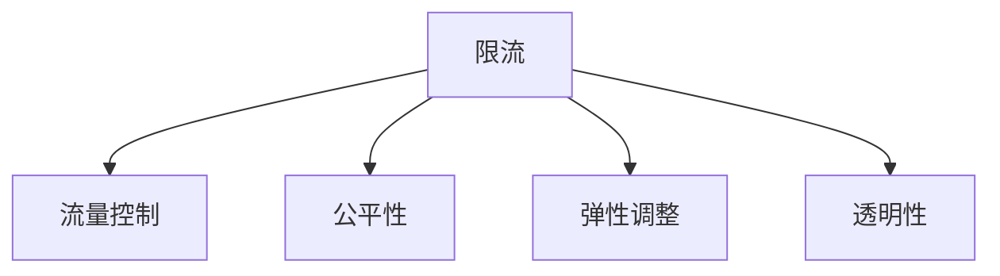

                 

# 限流：防止 DDos 攻击和系统过载

> 关键词：限流, DDos攻击, 系统过载, 负载均衡, 流量控制, 算法原理, 实际应用, 未来展望, 工具推荐, 研究总结

## 1. 背景介绍

### 1.1 问题由来

在当今互联网高度发达的时代，网络服务面临着来自各方面的威胁和挑战。其中，DDoS攻击（分布式拒绝服务攻击）和系统过载是最常见和最严重的网络安全问题。DDoS攻击通过控制大量恶意流量，使目标服务器的响应速度降低甚至无法提供服务，给企业和用户带来巨大的损失。系统过载则是指由于请求量过大，服务器无法处理所有请求，导致系统响应时间增加甚至崩溃，影响用户体验和业务连续性。因此，如何有效防止DDoS攻击和系统过载，保证服务稳定可靠，成为网络安全领域的重要课题。

### 1.2 问题核心关键点

限流是解决DDoS攻击和系统过载问题的重要手段之一，通过控制访问流量，防止恶意流量对服务器造成影响。限流算法的设计需要兼顾流量控制和用户体验，需要在保证服务安全性的同时，尽量减少对合法用户的干扰。

限流的主要目标包括：

1. **流量控制**：限制单位时间内请求的数量，避免服务器过载。
2. **公平性**：确保所有合法用户的请求都能得到处理，不会因限流而被拒绝。
3. **弹性调整**：根据服务器负载情况动态调整限流策略，保证服务稳定。
4. **透明性**：不引入过多的业务依赖，使限流逻辑清晰可解释。

## 2. 核心概念与联系

### 2.1 核心概念概述

为更好地理解限流算法，本节将介绍几个密切相关的核心概念：

- **限流**：指在一定时间内限制请求次数的行为，防止恶意流量对服务器造成影响。
- **流量控制**：通过某种机制，限制单位时间内的请求数量，避免服务器过载。
- **公平性**：限流算法应确保所有合法用户的请求都能得到处理，不会因限流而被拒绝。
- **弹性调整**：限流策略应根据服务器负载情况动态调整，保证服务稳定。
- **透明性**：限流逻辑应尽量清晰可解释，不引入过多的业务依赖。

这些概念之间的逻辑关系可以通过以下Mermaid流程图来展示：



这个流程图展示了的核心概念及其之间的关系：

1. 限流是流量控制的基础，通过限制请求次数，避免服务器过载。
2. 限流算法应确保所有合法用户请求都能得到处理，具备公平性。
3. 限流策略应根据服务器负载情况动态调整，具备弹性。
4. 限流逻辑应尽量清晰可解释，具备透明性。

## 3. 核心算法原理 & 具体操作步骤
### 3.1 算法原理概述

限流算法的基本思想是：根据单位时间内请求的数量，限制每个用户或IP的访问次数，防止恶意流量对服务器造成影响。常见的限流算法包括固定窗口限流、滑动窗口限流和漏桶限流等。这些算法通过不同的策略，实现流量控制和公平性保证。

### 3.2 算法步骤详解

以下是三种常见的限流算法的详细步骤：

#### 3.2.1 固定窗口限流

**算法描述**：在固定的时间窗口内限制请求次数，超出窗口限制的请求会被拒绝。

**操作步骤**：

1. 定义时间窗口大小，如5秒。
2. 维护一个计数器，记录每个用户或IP在最近5秒内的请求次数。
3. 每次请求到达时，判断该用户或IP的计数器是否超过限制，如10次。
4. 如果计数器超过限制，拒绝该请求；否则，增加计数器并允许请求通过。

#### 3.2.2 滑动窗口限流

**算法描述**：在滑动的时间窗口内限制请求次数，通过滑动窗口实现公平性。

**操作步骤**：

1. 定义时间窗口大小，如5秒。
2. 维护一个计数器，记录每个用户或IP在最近5秒内的请求次数。
3. 每次请求到达时，将计数器向前滑动1秒，记录当前窗口内请求次数。
4. 如果计数器超过限制，拒绝该请求；否则，增加计数器并允许请求通过。

#### 3.2.3 漏桶限流

**算法描述**：通过漏桶模型限制请求速率，实现流量控制和公平性。

**操作步骤**：

1. 定义漏桶的容量，如1000个请求。
2. 维护一个漏桶，记录每个用户或IP在当前时间内的请求数量。
3. 每次请求到达时，将漏桶的容量减1。
4. 如果漏桶的容量为0，拒绝该请求；否则，允许请求通过，并增加漏桶的容量。

### 3.3 算法优缺点

固定窗口限流算法简单高效，但无法实现公平性保证。滑动窗口限流算法通过滑动窗口实现公平性，但实现复杂度较高。漏桶限流算法通过漏桶模型实现流量控制和公平性，效果最好，但需要维护桶的大小和当前容量，实现难度较大。

### 3.4 算法应用领域

限流算法在网络服务、电商、金融等诸多领域都有广泛的应用，可以有效防止DDoS攻击和系统过载，保证服务稳定。

- **网络服务**：限制用户的访问频率，防止恶意流量攻击。
- **电商**：控制用户下单速度，防止服务器过载。
- **金融**：限制用户交易次数，保护金融安全。

## 4. 数学模型和公式 & 详细讲解 & 举例说明

### 4.1 数学模型构建

限流算法可以抽象为一个动态系统，设 $x_t$ 为时间 $t$ 时请求数量，$y_t$ 为请求次数限制。限流算法可以表示为：

$$
x_{t+1} = f(x_t, u_t)
$$

其中 $u_t$ 为单位时间内的请求次数，$y_t$ 为当前限制次数。限流算法的作用是控制 $x_t$ 在一定范围内，即 $x_t \leq y_t$。

### 4.2 公式推导过程

以漏桶限流为例，推导限流算法的公式。

设漏桶容量为 $C$，每次请求占用容量为 $c$，初始漏桶容量为 $C$，当前漏桶容量为 $B$，当前时间点为 $t$，请求次数为 $x_t$，限制次数为 $y_t$。则漏桶限流算法的公式可以推导为：

$$
x_{t+1} = \left\{
\begin{aligned}
&x_t - c & \quad &\text{如果 } B \geq c \\
&0 & \quad &\text{如果 } B < c
\end{aligned}
\right.
$$

$$
B_{t+1} = \left\{
\begin{aligned}
&B_t - c & \quad &\text{如果 } B_t \geq c \\
&B_t & \quad &\text{如果 } B_t < c
\end{aligned}
\right.
$$

其中 $B_t$ 表示当前漏桶容量。

### 4.3 案例分析与讲解

以一个具体案例来说明限流算法的应用。

假设某电商网站每秒钟允许100个用户访问，用户A、B、C分别在时间0、5、10秒到达，触发限流规则。

1. 固定窗口限流：
   - 时间0时，用户A访问，增加计数器为1。
   - 时间1时，用户B访问，计数器重置为0。
   - 时间2时，用户C访问，计数器重置为0，超过限制，拒绝请求。

2. 滑动窗口限流：
   - 时间0时，用户A访问，增加计数器为1。
   - 时间1时，用户B访问，计数器从0开始，增加计数器为1。
   - 时间2时，用户C访问，计数器从0开始，增加计数器为1。
   - 时间3时，用户A访问，计数器从0开始，增加计数器为1。
   - 时间4时，用户B访问，计数器从0开始，增加计数器为1。
   - 时间5时，用户C访问，计数器从0开始，增加计数器为1。
   - 时间6时，用户A访问，计数器从0开始，增加计数器为1。
   - 时间7时，用户B访问，计数器从0开始，增加计数器为1。
   - 时间8时，用户C访问，计数器从0开始，增加计数器为1。
   - 时间9时，用户A访问，计数器从0开始，增加计数器为1。
   - 时间10时，用户B访问，计数器从0开始，增加计数器为1。
   - 时间11时，用户C访问，计数器从0开始，增加计数器为1。
   - 时间12时，用户A访问，计数器从0开始，增加计数器为1。

通过这个案例，我们可以看到滑动窗口限流的公平性优势，每个用户在任意时刻都可以访问，不会因之前的历史请求而受到限制。

## 5. 项目实践：代码实例和详细解释说明

### 5.1 开发环境搭建

在进行限流项目实践前，我们需要准备好开发环境。以下是使用Python进行开发的环境配置流程：

1. 安装Anaconda：从官网下载并安装Anaconda，用于创建独立的Python环境。

2. 创建并激活虚拟环境：
```bash
conda create -n leaky-bucket-env python=3.8 
conda activate leaky-bucket-env
```

3. 安装相关工具包：
```bash
pip install requests flask
```

完成上述步骤后，即可在`leaky-bucket-env`环境中开始限流项目的开发。

### 5.2 源代码详细实现

下面以漏桶限流为例，给出Python实现的代码实现。

```python
import time
import threading

class LeakyBucket:
    def __init__(self, capacity, rate):
        self.capacity = capacity
        self.rate = rate
        self.bucket = 0
        self.lock = threading.Lock()

    def consume(self, amount):
        with self.lock:
            if self.bucket >= self.capacity:
                return False
            self.bucket += amount
            return True

    def refill(self):
        with self.lock:
            time.sleep(1)
            self.bucket = min(self.capacity, self.bucket - self.rate)

    def start(self):
        while True:
            self.refill()

# 限流测试函数
def test_leaky_bucket():
    bucket = LeakyBucket(capacity=10, rate=2)
    for i in range(20):
        if bucket.consume(1):
            print(f"Request {i+1} allowed")
        else:
            print(f"Request {i+1} rejected")
```

代码解释：

- 首先定义了一个`LeakyBucket`类，用于实现漏桶限流算法。
- 初始化时，设置漏桶容量和每次请求占用容量。
- `consume`方法用于模拟请求，如果漏桶容量允许，则消耗一定容量，返回True，否则返回False。
- `refill`方法用于模拟漏桶的充液过程，每隔1秒减少漏桶容量。
- `start`方法用于启动漏桶充液线程。

通过调用`test_leaky_bucket`函数，可以模拟请求过程，测试漏桶限流的效果。

### 5.3 代码解读与分析

以上代码实现了基本的漏桶限流算法，核心逻辑如下：

- 使用`Lock`锁保护漏桶操作的原子性，防止多个请求同时修改漏桶容量。
- `consume`方法模拟请求，每次请求占用容量并判断漏桶容量是否允许。
- `refill`方法模拟漏桶的充液过程，每隔1秒减少漏桶容量，模拟漏桶的漏液效果。

在实际应用中，可能需要根据具体情况对漏桶容量和漏液速率进行配置，以达到最佳限流效果。

## 6. 实际应用场景

### 6.1 网络服务

在网络服务中，限流算法可以限制用户访问频率，防止DDoS攻击。例如，某网站每秒钟允许100个用户访问，如果检测到某个IP地址在短时间内发送大量请求，则触发限流规则，拒绝后续请求。

### 6.2 电商

电商网站为了防止恶意用户大量下单，通常会设置限流规则。例如，某商品每秒钟允许10个用户下单，如果某个用户短时间内频繁下单，则触发限流规则，拒绝后续下单请求。

### 6.3 金融

金融交易系统为了防止恶意攻击和系统过载，通常会设置限流规则。例如，某交易系统每秒钟允许100个交易请求，如果某个用户短时间内频繁发起交易请求，则触发限流规则，拒绝后续请求。

### 6.4 未来应用展望

随着互联网应用的不断发展，限流算法将在更多领域得到应用，例如：

- **物联网**：限制设备访问频率，防止恶意设备攻击。
- **智能家居**：限制用户访问频率，保证设备安全。
- **云计算**：限制用户资源使用，防止资源滥用。

## 7. 工具和资源推荐

### 7.1 学习资源推荐

为了帮助开发者系统掌握限流算法的理论基础和实践技巧，这里推荐一些优质的学习资源：

1. 《计算机网络：自顶向下方法》书籍：详细讲解了流量控制和限流的基本概念和算法原理。
2. 《高性能网络编程》书籍：介绍了限流算法在高性能网络编程中的应用。
3. 《网络安全技术与应用》课程：讲解了限流算法在网络安全中的实际应用。
4. 《LeetCode》平台：提供了大量限流算法的编程题目，帮助开发者练习实践。
5. 《Python算法与数据结构》书籍：讲解了限流算法在Python编程中的应用。

通过对这些资源的学习实践，相信你一定能够快速掌握限流算法的精髓，并用于解决实际的限流问题。

### 7.2 开发工具推荐

高效的开发离不开优秀的工具支持。以下是几款用于限流算法开发的常用工具：

1. PyTorch：基于Python的开源深度学习框架，灵活动态的计算图，适合快速迭代研究。
2. TensorFlow：由Google主导开发的开源深度学习框架，生产部署方便，适合大规模工程应用。
3. Redis：高性能的内存数据存储系统，支持各种限流算法，适合实时限流场景。
4. Nginx：开源的Web服务器和反向代理服务器，支持限流和流量控制，适合大规模网络应用。
5. Kubernetes：开源的容器编排系统，支持限流和流量控制，适合大规模分布式系统。

合理利用这些工具，可以显著提升限流算法的开发效率，加快创新迭代的步伐。

### 7.3 相关论文推荐

限流算法的研究始于学界的持续探索。以下是几篇奠基性的相关论文，推荐阅读：

1. 《Network Algorithms》书籍：介绍了一系列经典的限流算法，如Token Bucket算法、Leaky Bucket算法等。
2. 《Performance Modeling, Analysis, and Design of Communication Systems》书籍：讲解了限流算法在通信系统中的应用。
3. 《Resource Management for Cloud Computing》论文：介绍了云环境中的限流算法和资源管理策略。
4. 《Network Traffic Control Algorithms》论文：介绍了网络流量控制和限流的理论基础和算法实现。
5. 《Distributed Traffic Control Algorithms》论文：介绍了分布式环境中的限流算法和资源管理策略。

这些论文代表了大规模限流算法的演进历程。通过学习这些前沿成果，可以帮助研究者把握学科前进方向，激发更多的创新灵感。

## 8. 总结：未来发展趋势与挑战

### 8.1 研究成果总结

本文对限流算法的原理和操作步骤进行了详细讲解，并通过Python代码实现演示了漏桶限流的具体应用。限流算法在DDoS攻击和系统过载防御中发挥了重要作用，通过限制请求次数，防止恶意流量对服务器造成影响。

### 8.2 未来发展趋势

展望未来，限流算法将在更多领域得到应用，不断发展。

1. **智能限流**：基于机器学习和人工智能技术，实时动态调整限流策略，适应不同场景下的需求。
2. **分布式限流**：在大规模分布式系统中，实现全局限流和本地限流相结合，提高系统的稳定性和可扩展性。
3. **跨平台限流**：在不同操作系统和硬件平台上，实现跨平台兼容的限流算法。
4. **新兴技术**：结合区块链、物联网等新兴技术，实现更加复杂和多样的限流场景。

### 8.3 面临的挑战

尽管限流算法已经取得了一定的成果，但在实际应用中也面临诸多挑战：

1. **公平性问题**：限流算法需要确保所有合法用户的请求都能得到处理，避免因限流导致用户被拒绝。
2. **实时性问题**：限流算法需要实时响应请求，确保系统效率。
3. **算法复杂性**：限流算法需要综合考虑多种因素，如网络延迟、负载情况等，实现难度较大。
4. **安全性问题**：限流算法需要防止恶意攻击，确保系统安全。
5. **业务依赖**：限流算法需要结合业务逻辑，实现无缝集成。

### 8.4 研究展望

面对限流算法面临的挑战，未来的研究需要在以下几个方面寻求新的突破：

1. **智能限流**：利用机器学习和大数据分析技术，实时动态调整限流策略，实现更高效的流量控制。
2. **分布式限流**：在大规模分布式系统中，实现全局限流和本地限流相结合，提高系统的稳定性和可扩展性。
3. **跨平台限流**：在不同操作系统和硬件平台上，实现跨平台兼容的限流算法。
4. **新兴技术**：结合区块链、物联网等新兴技术，实现更加复杂和多样的限流场景。

这些研究方向将引领限流算法迈向更高的台阶，为构建稳定、高效、安全的网络服务系统提供技术支持。

## 9. 附录：常见问题与解答

**Q1：限流算法如何实现公平性？**

A: 限流算法通过滑动窗口等机制，确保每个用户或IP的请求都被公平对待，不会因历史请求而受到限制。例如，滑动窗口限流算法在每次请求到达时，将计数器向前滑动一定时间间隔，记录当前窗口内的请求次数。

**Q2：限流算法如何避免过拟合？**

A: 限流算法需要根据实际流量情况动态调整策略，避免因过拟合导致系统崩溃。例如，漏桶限流算法通过漏桶容量和漏液速率的配置，实现流量控制和公平性。

**Q3：限流算法如何提高实时性？**

A: 限流算法需要实时响应请求，避免因延迟导致系统响应速度降低。例如，使用Redis等高性能内存数据存储系统，实现实时限流和流量控制。

**Q4：限流算法如何结合业务逻辑？**

A: 限流算法需要结合业务逻辑，实现无缝集成。例如，电商平台的限流算法需要考虑商品的库存、价格等因素，实现更合理的流量控制。

**Q5：限流算法如何防止DDoS攻击？**

A: 限流算法需要防止恶意流量对服务器造成影响。例如，对于DDoS攻击，可以通过识别攻击特征、限流策略等手段，防止恶意流量进入系统。

通过本文的系统梳理，可以看到，限流算法在DDoS攻击和系统过载防御中发挥了重要作用，通过限制请求次数，防止恶意流量对服务器造成影响。随着技术的发展和应用的深入，限流算法将在更多领域得到应用，为构建稳定、高效、安全的网络服务系统提供技术支持。

