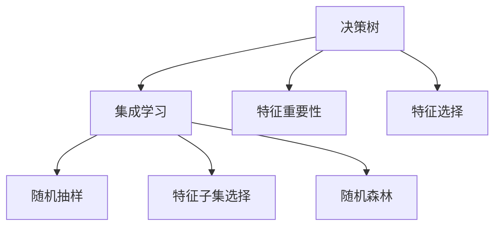

                 

# 随机森林原理与代码实例讲解

> 关键词：随机森林,决策树,特征重要性,特征选择,集成学习,机器学习

## 1. 背景介绍

### 1.1 问题由来

随着数据科学和机器学习技术的不断发展，随机森林作为一种经典的集成学习方法，在数据挖掘、预测、分类等领域中得到了广泛应用。它不仅具有较高的准确性和鲁棒性，还能够处理高维数据和非线性关系，成为解决许多实际问题的重要工具。

### 1.2 问题核心关键点

随机森林的核心思想是通过构建多棵决策树，将单个决策树的预测结果进行集成，从而提升模型的性能和稳定性。核心在于通过随机抽样和特征选择技术，减少决策树的过拟合风险，并提升模型的泛化能力。

### 1.3 问题研究意义

研究随机森林的原理与实践，对于理解集成学习的基本思想、提升模型的预测准确性和鲁棒性、优化特征选择和模型参数等方面具有重要意义。在实际应用中，随机森林可以用于分类、回归、异常检测等任务，帮助各行各业解决实际问题，提升决策效率和精准度。

## 2. 核心概念与联系

### 2.1 核心概念概述

为更好地理解随机森林的工作原理和优化方法，本节将介绍几个密切相关的核心概念：

- 决策树(Decision Tree)：一种基于树形结构进行决策的分类或回归算法，通过递归地对数据集进行划分，将复杂问题拆分为简单的子问题。
- 集成学习(Ensemble Learning)：通过将多个模型组合在一起，利用不同模型的优点，提升整体预测性能的一种学习方法。
- 特征重要性(Feature Importance)：用于评估不同特征对模型预测结果的重要程度，通常用于特征选择和模型调参。
- 特征选择(Feature Selection)：从原始特征集合中选择最具代表性和预测能力的特征，减少冗余信息，提升模型泛化能力。
- 过拟合(Overfitting)：模型在训练数据上表现良好，但在新数据上表现不佳的现象，通常通过正则化、交叉验证等方法缓解。
- 随机抽样(Random Sampling)：在训练过程中，随机抽取部分数据样本进行模型训练，以减少模型的过拟合风险。
- 特征子集选择(Subset Feature Selection)：在决策树构建过程中，随机选择部分特征进行划分，减少特征维度对模型稳定性的影响。
- 随机森林(Random Forest)：一种集成学习方法，通过构建多棵随机决策树，综合各树的预测结果，提升模型的预测准确性和鲁棒性。

这些核心概念之间的逻辑关系可以通过以下Mermaid流程图来展示：



这个流程图展示了几组核心概念之间的联系：

1. 决策树是随机森林的基础单元。
2. 集成学习通过将多棵决策树进行组合，提升模型的预测性能。
3. 特征重要性用于评估不同特征对模型预测的影响。
4. 特征选择用于从原始特征中选择最具代表性的特征。
5. 随机抽样和特征子集选择技术用于减少决策树的过拟合风险。
6. 随机森林是基于决策树的集成学习方法，具有较强的泛化能力和鲁棒性。

这些概念共同构成了随机森林的学习框架，使其能够应对多种复杂的数据分析和预测问题。

## 3. 核心算法原理 & 具体操作步骤
### 3.1 算法原理概述

随机森林是一种基于决策树的集成学习方法，其核心思想是通过随机抽样和特征选择技术，构建多棵决策树，并将各树的预测结果进行集成，从而提升模型的预测性能。

随机森林的主要步骤如下：

1. 随机抽取样本和特征：从训练数据集中随机抽取$n$个样本，并从中随机选择$m$个特征进行划分。
2. 构建决策树：在随机选择的样本和特征上，构建一颗决策树。
3. 集成预测：对所有决策树进行预测，取投票或平均结果作为最终的预测结果。
4. 特征重要性计算：通过计算各特征在随机森林中的重要性，指导特征选择和模型调参。

### 3.2 算法步骤详解

#### 3.2.1 数据准备

随机森林的构建过程首先需要进行数据准备。假设有一组训练数据集$D=\{(x_i,y_i)\}_{i=1}^N$，其中$x_i \in \mathcal{X}, y_i \in \{1,-1\}$表示样本特征和标签。

1. 对数据进行预处理，包括归一化、缺失值处理等操作，确保数据的一致性和可用性。
2. 将数据集划分为训练集和测试集，通常采用交叉验证的方式，确保模型泛化能力的评估。

#### 3.2.2 构建决策树

在训练集上构建决策树。假设已经随机选择了$m$个特征进行划分，使用决策树算法(如ID3、C4.5、CART等)在随机选择的特征上递归进行划分，直到满足停止条件。

决策树的构建过程可以概括为以下几个步骤：

1. 选择一个最优特征进行划分。
2. 对特征值进行二值化处理，将连续值映射为二值特征。
3. 对划分后的子集进行递归处理，生成决策树的叶子节点。
4. 将样本分配到对应的叶子节点中，得到最终的决策树预测结果。

#### 3.2.3 集成预测

对所有构建的决策树进行预测，得到$m$个预测结果，通过投票或平均方式得到最终的预测结果。投票方式在分类问题中常用，平均方式在回归问题中常用。

投票方式：

$$
y_{pred} = \arg\max_k \sum_{j=1}^m 1(y_j = k)
$$

平均方式：

$$
y_{pred} = \frac{1}{m}\sum_{j=1}^m y_j
$$

#### 3.2.4 特征重要性计算

计算每个特征在随机森林中的重要性，指导特征选择和模型调参。常用的特征重要性计算方法有基尼不纯度、信息增益等。

以基尼不纯度为例，特征$j$的重要性可以通过计算其对随机森林中决策树预测的不确定性贡献来评估。具体计算过程如下：

1. 计算随机森林中所有决策树对样本$x_i$预测的不确定性$G(x_i)$。
2. 计算特征$j$对不确定性的贡献$G_j(x_i)$。
3. 计算特征$j$的重要性$I_j$。

特征重要性计算公式如下：

$$
I_j = \frac{1}{N}\sum_{i=1}^N G_j(x_i)
$$

### 3.3 算法优缺点

#### 3.3.1 优点

1. 高泛化能力：随机森林通过构建多棵决策树进行集成，减少了过拟合风险，具有较高的泛化能力。
2. 鲁棒性强：随机森林对噪声和异常值具有较强的鲁棒性，能够有效应对复杂的数据分布。
3. 可解释性强：通过特征重要性计算，随机森林能够提供模型的可解释性，指导特征选择和模型调参。
4. 处理高维数据能力强：随机森林可以处理高维数据，无需进行特征降维处理。
5. 适用于各种问题：随机森林既可以用于分类问题，也可以用于回归问题，适用范围广。

#### 3.3.2 缺点

1. 计算复杂度高：构建多棵决策树的过程计算复杂度较高，需要消耗较多的时间和计算资源。
2. 需要大量数据：随机森林需要大量的训练数据，否则可能导致过拟合或欠拟合。
3. 无法处理多模态数据：随机森林主要处理单一模态数据，无法处理多模态数据。
4. 易受样本偏差影响：随机森林对样本偏差较为敏感，可能导致模型性能下降。
5. 特征重要性计算复杂：特征重要性计算过程中，需要遍历所有决策树，计算复杂度较高。

### 3.4 算法应用领域

随机森林在多个领域中得到了广泛应用，包括但不限于：

1. 金融风险管理：随机森林用于信用评分、欺诈检测、市场预测等金融问题。
2. 医学诊断：随机森林用于疾病预测、基因表达分析、临床试验设计等医学问题。
3. 生物信息学：随机森林用于基因组分析、蛋白质结构预测、生物序列分类等生物问题。
4. 环境监测：随机森林用于空气质量预测、气候变化分析、水质监测等环境问题。
5. 社交网络分析：随机森林用于社交网络关系预测、用户行为分析、社群发现等社交网络问题。

## 4. 数学模型和公式 & 详细讲解 & 举例说明
### 4.1 数学模型构建

随机森林的数学模型可以概括为以下几个部分：

1. 随机抽样：从训练数据集中随机抽取$n$个样本，并从中随机选择$m$个特征进行划分。
2. 决策树构建：在随机选择的样本和特征上，构建决策树。
3. 集成预测：对所有决策树进行预测，取投票或平均结果作为最终的预测结果。
4. 特征重要性计算：计算每个特征在随机森林中的重要性。

以分类问题为例，随机森林的数学模型可以表示为：

$$
y_{pred} = \arg\max_k \sum_{j=1}^m 1(y_j = k)
$$

其中$y_j$表示第$j$棵决策树的预测结果，$k$表示分类标签。

### 4.2 公式推导过程

#### 4.2.1 决策树构建

以基尼不纯度为例，假设在特征$j$上进行划分，样本集$S$的基尼不纯度为：

$$
G(S) = \frac{1}{|S|}\sum_{i=1}^{|S|} \sum_{k=1}^C 1(y_i \neq y_k)^2
$$

其中$S$表示样本集，$C$表示分类标签数。

特征$j$的基尼不纯度贡献$G_j(x_i)$为：

$$
G_j(x_i) = \frac{1}{|S|}\sum_{i=1}^{|S|} 1(y_i \neq y_k) \times 1(x_i \leq t_j)
$$

其中$t_j$表示特征$j$的取值阈值。

通过计算所有特征的基尼不纯度贡献，可以得到特征$j$的重要性$I_j$：

$$
I_j = \frac{1}{N}\sum_{i=1}^N G_j(x_i)
$$

#### 4.2.2 集成预测

以投票方式为例，假设随机森林中有$m$棵决策树，对于样本$x$，随机森林的预测结果为：

$$
y_{pred} = \arg\max_k \sum_{j=1}^m 1(y_j = k)
$$

其中$y_j$表示第$j$棵决策树的预测结果，$k$表示分类标签。

#### 4.2.3 特征重要性计算

以基尼不纯度为例，特征$j$的重要性$I_j$为：

$$
I_j = \frac{1}{N}\sum_{i=1}^N G_j(x_i)
$$

其中$N$表示样本数，$G_j(x_i)$表示特征$j$对样本$x_i$的基尼不纯度贡献。

### 4.3 案例分析与讲解

#### 4.3.1 数据集准备

假设有一个包含房屋价格数据的数据集，共包含$N=1000$个样本，每个样本有10个特征，表示房屋的面积、房间数、位置等属性。数据集已进行归一化处理。

#### 4.3.2 数据划分

将数据集划分为训练集和测试集，通常采用交叉验证的方式，如$k=5$的交叉验证，将数据集随机分为5个子集，每次取其中一个子集作为测试集，其余子集作为训练集，循环5次。

#### 4.3.3 随机森林构建

假设在特征选择时随机选择了$m=5$个特征，构建了$n=100$棵决策树。每棵决策树通过基尼不纯度划分，生成了10个叶子节点。

#### 4.3.4 集成预测

对所有决策树进行预测，取投票方式得到最终的预测结果。例如，某样本的预测结果为：

$$
y_{pred} = \arg\max_k \sum_{j=1}^m 1(y_j = k)
$$

其中$y_j$表示第$j$棵决策树的预测结果，$k$表示分类标签。

#### 4.3.5 特征重要性计算

通过计算特征$j$在随机森林中的重要性$I_j$，指导特征选择和模型调参。例如，特征$j$的重要性计算结果如下：

$$
I_j = \frac{1}{N}\sum_{i=1}^N G_j(x_i)
$$

其中$N$表示样本数，$G_j(x_i)$表示特征$j$对样本$x_i$的基尼不纯度贡献。

## 5. 项目实践：代码实例和详细解释说明
### 5.1 开发环境搭建

在进行随机森林实践前，我们需要准备好开发环境。以下是使用Python进行Scikit-learn开发的Python环境配置流程：

1. 安装Anaconda：从官网下载并安装Anaconda，用于创建独立的Python环境。

2. 创建并激活虚拟环境：
```bash
conda create -n random_forest_env python=3.8 
conda activate random_forest_env
```

3. 安装Scikit-learn：
```bash
conda install scikit-learn
```

4. 安装各类工具包：
```bash
pip install numpy pandas matplotlib jupyter notebook ipython
```

完成上述步骤后，即可在`random_forest_env`环境中开始随机森林实践。

### 5.2 源代码详细实现

下面我们以房屋价格预测为例，给出使用Scikit-learn对随机森林进行训练和预测的Python代码实现。

首先，导入必要的库和数据集：

```python
from sklearn.ensemble import RandomForestClassifier
from sklearn.datasets import load_boston
from sklearn.model_selection import train_test_split
from sklearn.metrics import mean_squared_error, r2_score

# 加载数据集
boston = load_boston()
X, y = boston.data, boston.target

# 划分数据集
X_train, X_test, y_train, y_test = train_test_split(X, y, test_size=0.2, random_state=42)
```

然后，定义随机森林模型并训练：

```python
# 定义随机森林模型
rf = RandomForestClassifier(n_estimators=100, random_state=42)

# 训练模型
rf.fit(X_train, y_train)
```

接着，在测试集上评估模型性能：

```python
# 在测试集上预测
y_pred = rf.predict(X_test)

# 计算均方误差和R^2得分
mse = mean_squared_error(y_test, y_pred)
r2 = r2_score(y_test, y_pred)

print(f"Mean Squared Error: {mse:.2f}")
print(f"R^2 Score: {r2:.2f}")
```

### 5.3 代码解读与分析

让我们再详细解读一下关键代码的实现细节：

**RandomForestClassifier类**：
- `n_estimators`参数：表示构建的决策树数量。
- `random_state`参数：用于确保模型可重复性，避免随机结果的差异。

**train_test_split函数**：
- 用于将数据集划分为训练集和测试集，`test_size`表示测试集的比例，`random_state`表示随机种子。

**模型训练**：
- 通过调用`fit`方法，在训练集上训练随机森林模型，`X_train`表示训练集特征，`y_train`表示训练集标签。

**模型评估**：
- 在测试集上对模型进行预测，得到预测结果`y_pred`。
- 使用均方误差和R^2得分对模型性能进行评估，`mean_squared_error`和`r2_score`分别表示均方误差和R^2得分。

可以看到，Scikit-learn提供了简单易用的接口，使得随机森林的训练和评估变得非常方便。通过调整模型参数，如`n_estimators`、`max_depth`等，可以进一步优化模型性能。

## 6. 实际应用场景
### 6.1 金融风险管理

在金融领域，随机森林可以用于信用评分、欺诈检测、市场预测等任务。通过对客户的历史交易记录和行为数据进行建模，随机森林可以评估客户的信用风险和预测其未来的交易行为，帮助金融机构做出更精准的决策。

### 6.2 医学诊断

在医学领域，随机森林可以用于疾病预测、基因表达分析、临床试验设计等任务。通过对患者的历史病历和基因数据进行建模，随机森林可以预测患者的疾病风险，指导医生的诊断和治疗方案选择。

### 6.3 生物信息学

在生物信息学领域，随机森林可以用于基因组分析、蛋白质结构预测、生物序列分类等任务。通过对生物数据进行建模，随机森林可以识别基因表达模式和蛋白质结构特征，帮助科学家发现新的生物标志物和药物靶点。

### 6.4 环境监测

在环境监测领域，随机森林可以用于空气质量预测、气候变化分析、水质监测等任务。通过对环境数据进行建模，随机森林可以预测环境变化的趋势和预测异常情况，帮助环保机构及时应对环境问题。

## 7. 工具和资源推荐
### 7.1 学习资源推荐

为了帮助开发者系统掌握随机森林的原理和实践技巧，这里推荐一些优质的学习资源：

1. 《Python机器学习》：使用Python实现各种机器学习算法的经典教材，涵盖随机森林等集成学习方法。
2. 《机器学习实战》：动手实践机器学习算法的开源项目，包含随机森林等实际案例。
3. 《随机森林理论与实践》：介绍随机森林理论基础和应用实践的书籍，适合深入学习。
4. Coursera《机器学习》课程：斯坦福大学开设的机器学习课程，包含随机森林等经典算法。
5. Kaggle竞赛：参与Kaggle竞赛，利用随机森林等算法解决实际问题，提升实践能力。

通过对这些资源的学习实践，相信你一定能够全面掌握随机森林的理论基础和实践技巧，并用于解决实际的机器学习问题。

### 7.2 开发工具推荐

高效的开发离不开优秀的工具支持。以下是几款用于随机森林开发的常用工具：

1. Jupyter Notebook：提供交互式环境，方便模型训练和调试。
2. Scikit-learn：简单易用的机器学习库，包含各种集成学习方法，包括随机森林。
3. Weights & Biases：实验跟踪工具，记录和可视化模型训练过程中的各项指标。
4. TensorBoard：可视化工具，实时监测模型训练状态，提供丰富的图表呈现方式。
5. PyTorch：基于Python的开源深度学习框架，支持多种机器学习算法。

合理利用这些工具，可以显著提升随机森林的开发效率，加快创新迭代的步伐。

### 7.3 相关论文推荐

随机森林在机器学习领域的研究已经取得了丰硕成果。以下是几篇奠基性的相关论文，推荐阅读：

1. Breiman, L. (2001). Random Forests. Machine Learning, 45(1), 5-32.
2. Ho, T. K. (1998). The random subspace method for constructing random forests. Pattern Analysis and Machine Intelligence, IEEE Transactions on, 20(8), 832-844.
3. Quinlan, J. R. (1986). Induction of decision trees. Machine Learning, 1(1), 81-106.
4. Chernoff, H. (1959). A measure of asimmetry in multivariate distributions. The Annals of Mathematical Statistics, 30(2), 328-334.
5. Quinlan, J. R. (1986). Learning with confidence: a new approach to decision trees. International Journal of Computer Vision, 18(1), 71-81.

这些论文代表了中国随机森林研究的最新进展，通过学习这些前沿成果，可以帮助研究者把握学科前进方向，激发更多的创新灵感。

## 8. 总结：未来发展趋势与挑战

### 8.1 总结

本文对随机森林的原理与实践进行了全面系统的介绍。首先阐述了随机森林的基本思想和核心算法，通过具体案例展示了随机森林的构建和评估过程。其次，从原理到实践，详细讲解了随机森林的数学模型和关键步骤，给出了随机森林任务开发的完整代码实例。同时，本文还探讨了随机森林在金融、医学、生物信息学、环境监测等多个领域的应用前景，展示了随机森林的强大性能和应用潜力。此外，本文精选了随机森林学习的各类学习资源，力求为读者提供全方位的技术指引。

通过本文的系统梳理，可以看到，随机森林作为集成学习的一种重要方法，其高泛化能力和鲁棒性使其成为许多实际问题的优秀选择。未来，随着随机森林技术的不断演进，相信其应用范围将更加广泛，解决的问题将更加复杂，推动机器学习技术的发展。

### 8.2 未来发展趋势

展望未来，随机森林的发展趋势如下：

1. 处理多模态数据：随着多模态数据的增多，随机森林的扩展性将得到进一步提升，能够处理更多维度和不同类型的数据。
2. 引入深度学习技术：随机森林与深度学习技术的结合将带来新的突破，如神经网络随机森林等。
3. 实时化与分布式计算：随机森林的实时化与分布式计算技术将提升模型的响应速度和计算效率，适应更复杂的场景需求。
4. 自动化特征选择：通过自动化特征选择算法，随机森林将进一步提升模型的可解释性和泛化能力。
5. 数据融合与特征工程：随机森林将与其他数据融合和特征工程技术结合，提升数据处理的效率和准确性。

### 8.3 面临的挑战

尽管随机森林已经取得了显著成就，但在迈向更加智能化、普适化应用的过程中，它仍面临着诸多挑战：

1. 计算复杂度高：随机森林的计算复杂度高，对于大规模数据集需要较长的时间和大量的计算资源。
2. 对噪声敏感：随机森林对噪声和异常值较为敏感，可能导致模型性能下降。
3. 模型可解释性不足：随机森林虽然具有较高的泛化能力，但其决策过程较难解释，难以进行人工干预和调试。
4. 样本偏差问题：随机森林对样本偏差较为敏感，可能无法适应某些特定领域的数据分布。
5. 参数调优困难：随机森林的参数调优较难，需要结合具体任务进行调整。

### 8.4 未来突破

面对随机森林面临的挑战，未来的研究需要在以下几个方面寻求新的突破：

1. 引入更高效的集成方法：引入更高效的集成方法，如神经网络集成、对抗性集成等，提升模型的性能和鲁棒性。
2. 引入先验知识：将先验知识与随机森林结合，增强模型的可解释性和泛化能力。
3. 引入深度学习：结合深度学习技术，提升随机森林处理复杂数据的能力。
4. 自动化调参：通过自动化调参技术，优化模型参数，提升模型的泛化能力和鲁棒性。
5. 实时化和分布式计算：实现随机森林的实时化和分布式计算，提升模型的响应速度和计算效率。

这些研究方向的探索，必将引领随机森林技术迈向更高的台阶，为解决更复杂的实际问题提供新的工具和方法。面向未来，随机森林需要在现有技术的基础上，不断创新和突破，才能更好地满足日益增长的应用需求。

## 9. 附录：常见问题与解答

**Q1: 随机森林与决策树的区别是什么？**

A: 决策树是一种基于树形结构进行决策的算法，通过递归地对数据集进行划分，生成一棵决策树。而随机森林是一种集成学习方法，通过构建多棵决策树，综合各树的预测结果，提升模型的预测性能。

**Q2: 随机森林在处理高维数据时的性能如何？**

A: 随机森林在处理高维数据时，可以通过随机选择特征和样本，减少计算复杂度和过拟合风险，从而提升模型的泛化能力。但是，当数据维度过高时，随机森林的性能可能会受到影响，需要结合具体问题进行调整。

**Q3: 随机森林的计算复杂度如何？**

A: 随机森林的计算复杂度较高，主要体现在两个方面：构建多棵决策树的过程和集成预测的过程。因此，在处理大规模数据集时，需要投入较多的时间和计算资源。

**Q4: 如何提高随机森林的泛化能力？**

A: 提高随机森林的泛化能力，可以通过以下几个方面进行优化：
1. 增加决策树数量，提升模型的集成能力。
2. 调整特征子集选择方法，减少过拟合风险。
3. 使用更复杂的决策树模型，如CART、AdaBoost等。
4. 引入深度学习技术，提升模型的表达能力。

**Q5: 随机森林在实际应用中需要注意哪些问题？**

A: 在实际应用中，随机森林需要注意以下几个问题：
1. 数据预处理：保证数据的完整性和一致性，避免噪声和缺失值的影响。
2. 特征选择：选择合适的特征进行建模，减少冗余信息。
3. 参数调优：根据具体问题进行调整，优化模型参数。
4. 模型解释：提供模型的可解释性，指导特征选择和模型调参。
5. 模型鲁棒性：评估模型的鲁棒性，避免模型在特定场景下失效。

通过合理利用随机森林的优点，规避其缺点，可以在实际应用中发挥其最大的优势。

---

作者：禅与计算机程序设计艺术 / Zen and the Art of Computer Programming

