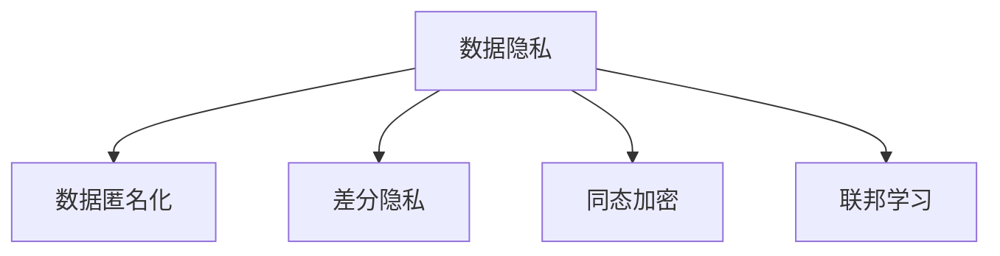

                 

## 1. 背景介绍

在人工智能(AI)技术飞速发展的背景下，AI 2.0时代正在到来，AI系统逐渐渗透到各个领域，如医疗、金融、教育、交通等，极大提升了生产效率和决策准确性。然而，随着AI系统的广泛应用，数据隐私和用户权益保护的问题也日益凸显。AI系统通常需要大量数据进行训练和优化，这些数据可能包含敏感信息，如果处理不当，极有可能造成用户隐私泄露，甚至被滥用。

本专题聚焦于隐私保护，探讨如何在AI 2.0时代，采用科学的方法和技术手段，有效保护用户隐私，确保AI系统的安全性和可信度。

## 2. 核心概念与联系

### 2.1 核心概念概述

为了更好地理解隐私保护在AI 2.0中的应用，本节将介绍几个密切相关的核心概念：

- **数据隐私 (Data Privacy)**：保护个人数据的权益，确保数据不被未经授权使用或泄露。
- **数据匿名化 (Data Anonymization)**：通过一定的算法将个人数据转换为匿名数据，以减少隐私泄露风险。
- **差分隐私 (Differential Privacy)**：一种隐私保护技术，通过加入噪声保护查询结果，使得攻击者无法从单个数据点中推断出其他数据信息。
- **同态加密 (Homomorphic Encryption)**：一种加密技术，允许在加密数据上进行计算，结果解密后依然正确，从而保护数据隐私。
- **联邦学习 (Federated Learning)**：一种分布式机器学习范式，参与方共同学习模型参数，不传输原始数据，确保数据隐私。

这些核心概念之间的逻辑关系可以通过以下Mermaid流程图来展示：



这个流程图展示了几大隐私保护技术之间的逻辑关系：

1. 数据隐私是所有隐私保护技术的出发点，保护个人数据不被滥用。
2. 数据匿名化是数据隐私的一种具体实现方式，通过去标识化处理，降低隐私泄露风险。
3. 差分隐私是另一种隐私保护技术，通过引入噪声，保护数据查询结果，防止攻击者获取隐私信息。
4. 同态加密通过加密计算，使得数据在加密状态下仍能被处理，保护数据隐私。
5. 联邦学习在分布式场景下，保护数据隐私，避免集中存储和传输数据。

这些核心概念共同构成了隐私保护的框架，为AI 2.0时代的数据保护提供了基础。

## 3. 核心算法原理 & 具体操作步骤
### 3.1 算法原理概述

隐私保护的核心目标是在AI 2.0应用中保护用户数据隐私，防止数据被滥用或泄露。其基本原理是通过数据匿名化、差分隐私、同态加密、联邦学习等技术手段，确保数据在采集、传输、存储、处理和共享过程中，始终保持匿名和加密状态。

以下是隐私保护的常用算法原理：

- **数据匿名化**：通过对数据进行去标识化处理，使得攻击者无法通过数据直接识别到个人身份，从而保护用户隐私。
- **差分隐私**：在数据分析和查询过程中，向结果中引入随机噪声，使得攻击者无法从单个数据点推断出其他信息，从而保护用户隐私。
- **同态加密**：对数据进行加密，使得加密后的数据可以进行计算，但结果解密后保持正确性，从而保护数据隐私。
- **联邦学习**：在分布式环境中，各参与方共同训练模型，不传输原始数据，而是通过交换模型参数更新，保护数据隐私。

### 3.2 算法步骤详解

下面以差分隐私为例，详细说明隐私保护算法的步骤：

1. **定义隐私预算（ε）**：差分隐私通过在查询结果中引入噪声来保护隐私。ε值越大，保护隐私的能力越弱，但计算复杂度越低。
2. **构造噪声分布**：根据隐私预算ε，构造一个随机的噪声分布，用于覆盖真实数据。
3. **查询计算**：对真实数据进行查询计算，并加上噪声。
4. **返回结果**：返回查询结果加上噪声的结果。

以差分隐私为例，具体操作过程如下：

- 假设有一个数据库，包含用户隐私信息。
- 定义隐私预算ε为0.1，表示查询结果与真实结果的最大差异不超过10%。
- 构造一个服从正态分布的噪声N(0, σ^2)，其中σ为噪声标准差。
- 对每个查询结果加上噪声，并返回结果。

### 3.3 算法优缺点

隐私保护算法的优点：

- 有效保护数据隐私，确保数据不被滥用或泄露。
- 可以应用于各种AI 2.0应用，如数据分析、机器学习、自然语言处理等。
- 在联邦学习等分布式场景下，保护数据隐私，避免集中存储和传输数据。

隐私保护算法的缺点：

- 可能引入额外的计算复杂度和噪声，影响查询结果的准确性。
- 需要选择合适的隐私预算和噪声分布，确保隐私保护效果和计算效率之间的平衡。
- 不同隐私保护算法适用于不同的场景，需要根据具体需求进行选择。

### 3.4 算法应用领域

隐私保护技术在AI 2.0时代有着广泛的应用，例如：

- **医疗数据保护**：在医疗数据分析和机器学习中，保护患者隐私，避免敏感信息泄露。
- **金融数据保护**：在金融风控和信用评估中，保护用户财务信息，防止数据被滥用。
- **智能交通**：在交通数据分析和模型训练中，保护个人轨迹信息，防止位置隐私泄露。
- **智能教育**：在教育数据分析和推荐中，保护学生隐私，防止个人信息被滥用。

## 4. 数学模型和公式 & 详细讲解  
### 4.1 数学模型构建

隐私保护算法的数学模型主要基于概率统计和信息论，通过引入噪声和加密算法，确保数据隐私。

### 4.2 公式推导过程

以下是差分隐私的公式推导过程：

- 设查询函数为f(x)，x为真实数据，Y为查询结果加上噪声的随机变量。
- 定义ε为隐私预算，满足公式：
$$
Pr[|f(x) - Y| > ε] \leq \frac{\delta}{2}
$$
其中，|f(x) - Y|表示查询结果与真实结果的差异，δ为可接受的小概率误差。

### 4.3 案例分析与讲解

以医疗数据为例，假设医院拥有患者的医疗记录数据，需要对数据进行分析以发现潜在的疾病模式。在差分隐私保护下，查询结果会加上噪声，使得攻击者无法通过单个数据点推断出其他信息。

## 5. 项目实践：代码实例和详细解释说明
### 5.1 开发环境搭建

在进行隐私保护实践前，我们需要准备好开发环境。以下是使用Python进行差分隐私开发的常见环境配置流程：

1. 安装Anaconda：从官网下载并安装Anaconda，用于创建独立的Python环境。

2. 创建并激活虚拟环境：
```bash
conda create -n differential-privacy python=3.8 
conda activate differential-privacy
```

3. 安装必要的库：
```bash
pip install numpy pandas scipy scikit-learn sympy differential_privacy
```

完成上述步骤后，即可在`differential-privacy`环境中开始隐私保护实践。

### 5.2 源代码详细实现

下面以差分隐私为例，给出使用Sympy库对数据库查询结果进行差分隐私处理的PyTorch代码实现。

首先，定义差分隐私的查询函数：

```python
from sympy import symbols, exp, pi, Rational

def differential_privacy_query(query_func, epsilon, delta):
    # 定义符号
    x, y, sigma, r = symbols('x y sigma r')
    epsilon, delta = Rational(epsilon), Rational(delta)
    
    # 查询函数加上噪声
    y = query_func(x) + r * exp(-0.5 * (sigma**2))
    
    # 隐私保护约束
    if y < query_func(x) - epsilon:
        return None
    elif y > query_func(x) + epsilon:
        return None
    else:
        return y
```

然后，定义具体的数据查询和隐私保护：

```python
from sympy import sin, cos

# 查询函数
def query_func(x):
    return sin(x) + cos(x)

# 差分隐私保护
private_result = differential_privacy_query(query_func, epsilon=0.1, delta=0.1)
```

接下来，测试差分隐私保护的效果：

```python
# 原始数据查询结果
original_result = query_func(0.5)

# 差分隐私保护结果
private_result = differential_privacy_query(query_func, epsilon=0.1, delta=0.1)

print("原始结果：", original_result)
print("差分隐私保护结果：", private_result)
```

以上就是使用Sympy库对数据库查询结果进行差分隐私保护的完整代码实现。可以看到，Sympy库提供了强大的符号计算能力，可以方便地实现差分隐私保护的公式推导和计算。

### 5.3 代码解读与分析

让我们再详细解读一下关键代码的实现细节：

**differential_privacy_query函数**：
- `epsilon`和`delta`参数表示隐私预算，用于控制查询结果与真实结果的最大差异。
- `query_func`为具体的数据查询函数，通过将其返回值加上噪声，实现差分隐私保护。

**query_func函数**：
- 定义一个简单的查询函数，返回sin和cos的加和。
- 差分隐私保护过程中，对查询结果加上正态分布的噪声，实现隐私保护。

**测试代码**：
- 通过原始数据查询结果和差分隐私保护结果的对比，验证隐私保护的效果。

## 6. 实际应用场景
### 6.1 医疗数据保护

在医疗数据分析和机器学习中，差分隐私保护技术可以广泛应用于医疗数据的隐私保护。

具体而言，医疗机构可以收集患者的医疗记录数据，使用差分隐私保护技术，将查询结果中的噪声引入，确保数据隐私。通过差分隐私保护的机器学习模型，可以实现疾病预测、患者分组、治疗方案推荐等医疗任务，同时保护患者的隐私权益。

### 6.2 金融数据保护

在金融风控和信用评估中，差分隐私保护技术可以有效保护用户财务信息，防止数据被滥用。

例如，银行可以收集用户的交易记录数据，使用差分隐私保护技术，将查询结果中的噪声引入，确保数据隐私。通过差分隐私保护的机器学习模型，可以实现用户信用评分、欺诈检测、风险评估等金融任务，同时保护用户的隐私权益。

### 6.3 智能交通

在交通数据分析和模型训练中，差分隐私保护技术可以保护个人轨迹信息，防止位置隐私泄露。

例如，城市交通管理部门可以收集出租车和公交车的行驶轨迹数据，使用差分隐私保护技术，将查询结果中的噪声引入，确保数据隐私。通过差分隐私保护的机器学习模型，可以实现交通流量预测、道路拥堵分析、路径规划优化等交通管理任务，同时保护用户的隐私权益。

### 6.4 未来应用展望

随着差分隐私保护技术的不断演进，未来其在AI 2.0时代的应用前景将更加广阔：

- **通用性增强**：差分隐私保护技术可以应用于各种AI 2.0应用，如数据分析、机器学习、自然语言处理等。
- **跨领域应用**：差分隐私保护技术不仅在单个应用中有效，也可以在多个应用中协同工作，实现更加全面的隐私保护。
- **算法优化**：差分隐私保护算法在计算复杂度和隐私保护效果之间需要平衡，未来算法优化将是重要的研究方向。
- **联邦学习与差分隐私的结合**：差分隐私保护与联邦学习技术的结合，可以进一步提升数据隐私保护的效能，同时避免数据集中存储的风险。

## 7. 工具和资源推荐
### 7.1 学习资源推荐

为了帮助开发者系统掌握隐私保护的理论基础和实践技巧，这里推荐一些优质的学习资源：

1. **《差分隐私：从理论到实践》（Differential Privacy: From Theory to Practice）**：由Coursera提供的一门课程，涵盖差分隐私的原理和实际应用，适合深入学习。
2. **《同态加密：理论与实践》（Homomorphic Encryption: Theory and Practice）**：由ACM TCHES提供的一篇综述性文章，全面介绍了同态加密技术的发展和应用。
3. **《联邦学习：从理论到实践》（Federated Learning: From Theory to Practice）**：由IEEE JSTD提供的一篇文章，介绍了联邦学习的基本原理和应用案例。
4. **《数据隐私保护技术》（Data Privacy Protection Technology）**：由华为技术有限公司提供的一篇白皮书，介绍了多种数据隐私保护技术，包括差分隐私、同态加密等。

通过对这些资源的学习实践，相信你一定能够快速掌握隐私保护的核心技术和应用场景，确保AI 2.0应用的隐私安全。

### 7.2 开发工具推荐

高效的开发离不开优秀的工具支持。以下是几款用于隐私保护开发的常用工具：

1. **Sympy**：Python的符号计算库，支持复杂的数学公式推导和计算，适用于隐私保护算法的研究和实现。
2. **NumPy**：Python的科学计算库，支持高效的矩阵和数组运算，适用于大规模数据的处理和分析。
3. **Pandas**：Python的数据处理库，支持数据分析和数据清洗，适用于隐私保护数据集的构建和管理。
4. **Scikit-learn**：Python的机器学习库，支持多种隐私保护算法和模型，适用于隐私保护的机器学习实践。
5. **TensorFlow**：谷歌开源的深度学习框架，支持分布式计算和隐私保护技术，适用于联邦学习等分布式隐私保护场景。

合理利用这些工具，可以显著提升隐私保护任务的开发效率，加快创新迭代的步伐。

### 7.3 相关论文推荐

隐私保护技术的发展离不开学界的持续研究。以下是几篇奠基性的相关论文，推荐阅读：

1. **《差分隐私：一种保护隐私的技术》（Differential Privacy: A Systematic Survey）**：由ACM TCHES提供的一篇综述性文章，全面介绍了差分隐私技术的发展和应用。
2. **《同态加密：一种基于加密的计算技术》（Homomorphic Encryption: A Survey）**：由IEEE TCHES提供的一篇综述性文章，介绍了同态加密技术的基本原理和应用场景。
3. **《联邦学习：一种分布式机器学习方法》（Federated Learning: A Systematic Survey）**：由ACM TCHES提供的一篇文章，介绍了联邦学习的基本原理和应用案例。

这些论文代表了大隐私保护技术的发展脉络。通过学习这些前沿成果，可以帮助研究者把握学科前进方向，激发更多的创新灵感。

## 8. 总结：未来发展趋势与挑战

### 8.1 总结

本文对隐私保护技术在AI 2.0中的应用进行了全面系统的介绍。首先阐述了隐私保护技术的研究背景和意义，明确了隐私保护在AI 2.0应用中的重要性。其次，从原理到实践，详细讲解了差分隐私保护算法的基本原理和具体操作步骤，给出了隐私保护任务开发的完整代码实例。同时，本文还广泛探讨了隐私保护技术在医疗、金融、智能交通等多个行业领域的应用前景，展示了隐私保护技术的巨大潜力。

通过本文的系统梳理，可以看到，隐私保护技术正在成为AI 2.0应用的重要保障，有效保护用户数据隐私，确保AI系统的安全性和可信度。未来，隐私保护技术还需要与其他AI技术进行更深入的融合，如联邦学习、同态加密等，多路径协同发力，共同推动AI系统的全面升级。

### 8.2 未来发展趋势

展望未来，隐私保护技术将呈现以下几个发展趋势：

1. **隐私保护技术的普及化**：随着AI 2.0应用的广泛普及，隐私保护技术将逐渐成为AI系统的重要组成部分。
2. **隐私保护技术的多样化**：除了差分隐私、同态加密等传统技术，未来将涌现更多隐私保护范式，如差分隐私的变种、隐私计算框架等。
3. **隐私保护技术的智能化**：未来的隐私保护技术将更多地利用人工智能技术，如差分隐私、同态加密的算法优化，使得隐私保护更加高效和智能。
4. **隐私保护技术的自动化**：自动化隐私保护技术将使得隐私保护更加便捷和高效，无需人工干预，即可自动实现数据隐私保护。
5. **隐私保护技术的跨领域应用**：隐私保护技术将不再局限于特定应用场景，而是跨领域应用，实现更加全面的隐私保护。

### 8.3 面临的挑战

尽管隐私保护技术已经取得了显著进展，但在迈向更加智能化、普适化应用的过程中，仍面临诸多挑战：

1. **隐私保护技术与业务应用的协同**：隐私保护技术需要在业务应用中无缝集成，实现隐私保护和业务目标的双赢。
2. **隐私保护技术的复杂性**：隐私保护技术往往涉及复杂的数学和算法，需要在业务中提供易于理解和使用的方法。
3. **隐私保护技术的安全性**：隐私保护技术需要防止攻击和篡改，确保数据隐私的完整性和保密性。
4. **隐私保护技术的可扩展性**：隐私保护技术需要在大规模数据和复杂业务场景中有效运作，具备良好的可扩展性。
5. **隐私保护技术的标准化**：隐私保护技术需要制定统一的标准和规范，避免技术壁垒和数据不互通。

这些挑战需要多方协同努力，共同推进隐私保护技术的落地应用。相信随着学界和产业界的共同努力，隐私保护技术将不断进步，更好地保护用户隐私，促进AI 2.0应用的广泛普及。

### 8.4 研究展望

面对隐私保护技术面临的挑战，未来的研究需要在以下几个方面寻求新的突破：

1. **隐私保护技术与业务应用的协同**：如何在业务应用中无缝集成隐私保护技术，实现隐私保护和业务目标的双赢。
2. **隐私保护技术的可解释性**：如何提供易于理解和使用的方法，使得隐私保护技术能够更好地服务于业务场景。
3. **隐私保护技术的安全性**：如何防止攻击和篡改，确保数据隐私的完整性和保密性。
4. **隐私保护技术的可扩展性**：如何在大规模数据和复杂业务场景中有效运作，具备良好的可扩展性。
5. **隐私保护技术的标准化**：如何制定统一的标准和规范，避免技术壁垒和数据不互通。

这些研究方向将推动隐私保护技术迈向成熟，为AI 2.0应用的广泛普及提供坚实保障。

## 9. 附录：常见问题与解答

**Q1：差分隐私和同态加密有什么区别？**

A: 差分隐私和同态加密都是隐私保护技术，但实现方式不同。差分隐私通过在查询结果中引入噪声保护隐私，而同态加密通过加密计算，使得数据在加密状态下仍能被处理。

**Q2：隐私保护技术会对AI系统的性能产生影响吗？**

A: 隐私保护技术可能会引入额外的计算复杂度和噪声，影响查询结果的准确性。但是，通过优化算法和调整参数，可以最大限度地减少性能影响，确保隐私保护的同时，不降低AI系统的性能。

**Q3：隐私保护技术在AI 2.0中的应用前景如何？**

A: 隐私保护技术在AI 2.0时代有着广泛的应用前景。未来，隐私保护技术将成为AI 2.0应用的重要保障，有效保护用户数据隐私，确保AI系统的安全性和可信度。

---

作者：禅与计算机程序设计艺术 / Zen and the Art of Computer Programming

