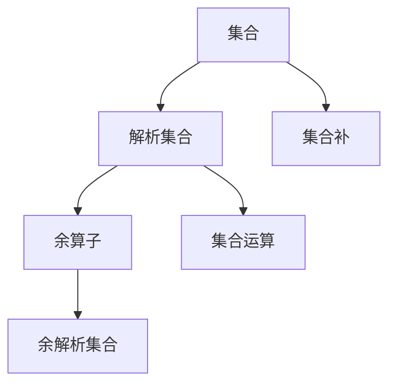

                 

# 集合论导引：余解析集合

> 关键词：集合论,解析集合,余解析集合,余算子,集合补,集合运算

## 1. 背景介绍

### 1.1 问题由来
集合论是数学的基础分支之一，它研究由对象组成的无序集合以及集合之间的关系和运算。在数理逻辑和算法理论中，集合论具有重要地位。本文将对集合论中的核心概念进行详细解读，并着重介绍余解析集合这一新颖的集合理论模型。

### 1.2 问题核心关键点
解析集合是指具有特定性质或满足特定条件的集合。其代表模型是Zermelo-Fraenkel集合论(ZF集合论)。然而，ZF集合论中的一些核心公理（如选择公理）面临着难以调和的悖论（如罗素悖论）。为了解决这一问题，研究者提出了余解析集合（Para-Finite Sets）概念，这一理论在集合论和理论计算机科学中逐渐成为新的研究热点。

余解析集合主要通过在常规的解析集合上定义一个余算子来扩展集合运算，以此得到更为广泛和灵活的集合模型。余解析集合的引入可以避免ZF集合论中的选择公理悖论，同时保持解析集合的有序性和可计算性，为集合论和计算机科学提供了新的理论视角和应用空间。

## 2. 核心概念与联系

### 2.1 核心概念概述

为更好地理解余解析集合，本节将介绍几个密切相关的核心概念：

- 集合：由对象组成的无序集合，例如整数集、实数集、自然语言词汇集等。
- 解析集合：具有特定性质或满足特定条件的集合，例如素数集、偶数集等。
- 余算子：在解析集合上定义的一种运算，用于扩展集合运算，得到更灵活的集合模型。
- 余解析集合：通过余算子对解析集合进行扩展，得到的更为广泛和灵活的集合模型。
- 集合补：集合A的补集，指不属于A的所有元素组成的集合。
- 集合运算：包括并、交、差、对称差等基本运算。

这些概念之间的逻辑关系可以通过以下Mermaid流程图来展示：



这个流程图展示了几组核心概念及其之间的关系：

1. 集合由对象组成，解析集合具有特定性质，余解析集合在解析集合上扩展运算，集合补和集合运算为余解析集合提供了基本构造方式。
2. 余算子是连接解析集合和余解析集合的重要桥梁，通过余算子，解析集合能够扩展为更为复杂的结构。

## 3. 核心算法原理 & 具体操作步骤
### 3.1 算法原理概述

余解析集合的算法原理主要围绕余算子的定义和应用展开。余算子通过在解析集合上定义一种特殊的运算，扩展解析集合的运算方式，从而得到新的集合模型。余算子的定义需要满足两个基本条件：
1. 运算封闭性：余算子在解析集合上自封闭，即解析集合中的元素通过余算子运算后仍属于解析集合。
2. 保序性：余算子运算后的集合仍保持解析集合的有序性和可计算性。

余解析集合的构建步骤如下：

1. 选择或定义一个解析集合$S$作为基础集合。
2. 定义一个余算子$P$，在解析集合$S$上进行操作。
3. 根据余算子$P$定义余解析集合$S^P$，满足$S^P = \{ x \mid x \in S \text{ 或 } x \in P(S) \}$。
4. 对$S^P$进行迭代或递归操作，得到一系列余解析集合的子集和子集链。
5. 根据实际应用需求，选择适合的余解析集合进行进一步操作。

### 3.2 算法步骤详解

以下是详细的余解析集合构建流程：

1. **选择或定义解析集合**：
   - 选择已知的解析集合，如素数集、偶数集等，或自定义解析集合，例如自然语言中的停用词集、同义词集等。
   - 例如，选择素数集$S = \{2, 3, 5, 7, 11, \ldots\}$。

2. **定义余算子**：
   - 余算子的定义依赖于具体应用场景，通常需要满足运算封闭性和保序性条件。
   - 例如，定义余算子$P(x) = x \times 2 - 1$，表示对素数集$S$中的每个数$x$执行$x \times 2 - 1$操作。

3. **构建余解析集合**：
   - 根据余算子$P$，得到余解析集合$S^P = \{2, 3, 5, 7, 11, 13, 17, 19, 23, \ldots\}$。
   - 余解析集合$S^P$通过扩展解析集合$S$的操作得到，包含所有原始素数以及通过余算子生成的奇素数。

4. **迭代和递归**：
   - 对余解析集合进行迭代或递归操作，得到更复杂的集合结构。
   - 例如，对$S^P$再次应用余算子$P$，得到$S^{P^2} = \{2, 3, 5, 7, 11, 13, 17, 19, 23, 29, 31, 37, 41, \ldots\}$。

5. **应用余解析集合**：
   - 根据实际应用需求，选择适合的余解析集合进行进一步操作。
   - 例如，在自然语言处理中，可以使用余解析集合进行同义词扩展、停用词过滤等操作。

### 3.3 算法优缺点

余解析集合的主要优点包括：

1. **灵活性和多样性**：余解析集合通过余算子的定义，可以扩展解析集合的运算，得到更为复杂和灵活的集合模型。
2. **避免选择公理悖论**：余解析集合的构建不需要使用选择公理，避免了ZF集合论中的悖论问题。
3. **可计算性**：余解析集合保持解析集合的有序性和可计算性，适用于计算机科学中的算法设计和理论分析。

同时，余解析集合也存在一些局限性：

1. **复杂度**：余解析集合的构建和运算较为复杂，需要定义合适的余算子，并进行迭代和递归操作。
2. **计算资源**：余解析集合的扩展操作需要大量计算资源，尤其在涉及复杂递归运算时，可能面临计算效率问题。
3. **理论基础**：余解析集合的理论基础相对较新，相关的研究还不够成熟，可能存在理论漏洞和应用限制。

### 3.4 算法应用领域

余解析集合在理论计算机科学和实际应用中具有广泛的应用前景，主要体现在以下几个领域：

- **集合论和数理逻辑**：在集合论和数理逻辑研究中，余解析集合提供了新的集合模型，有助于理解和分析集合的基础性质和运算规律。
- **计算机科学**：在算法设计、数据结构、程序语言等领域，余解析集合提供了新的思路和工具，有助于解决复杂问题。
- **人工智能和机器学习**：在自然语言处理、图像识别、知识图谱等领域，余解析集合可以用于语义扩展、同义词过滤、概念图扩展等任务。
- **数据处理和分析**：在数据预处理、数据清洗、数据抽取等领域，余解析集合可以用于复杂数据结构的构建和处理。

## 4. 数学模型和公式 & 详细讲解 & 举例说明

### 4.1 数学模型构建

余解析集合的数学模型构建需要定义一个解析集合$S$和一个余算子$P$，满足余算子的封闭性和保序性条件。

设$S$为一个解析集合，$P$为一个定义在$S$上的余算子。余解析集合$S^P$定义为满足以下条件的集合：

$$ S^P = \{ x \mid x \in S \text{ 或 } x \in P(S) \} $$

余算子$P$的定义形式通常包括加、减、乘、除、模运算、位运算等基本算术运算。例如，定义余算子$P(x) = x + 1$，则余解析集合$S^P$包含所有原始集合$S$的元素和通过余算子生成的元素。

### 4.2 公式推导过程

以下以素数集和加法余算子为例，推导余解析集合的构建过程：

设$S$为素数集$S = \{2, 3, 5, 7, 11, \ldots\}$。定义加法余算子$P(x) = x + 1$，则余解析集合$S^P$包含所有原始素数和通过余算子生成的元素：

$$ S^P = \{2, 3, 5, 7, 11, 13, 17, 19, 23, \ldots\} $$

通过迭代和递归应用余算子$P$，可以进一步扩展余解析集合$S^P$，得到更复杂的集合结构：

$$ S^{P^2} = \{2, 3, 5, 7, 11, 13, 17, 19, 23, 29, 31, 37, 41, \ldots\} $$

$$ S^{P^3} = \{2, 3, 5, 7, 11, 13, 17, 19, 23, 29, 31, 37, 41, 47, 53, \ldots\} $$

$$ \ldots $$

通过余算子的定义和应用，余解析集合能够从解析集合出发，构建出更为复杂和多样的集合结构。

### 4.3 案例分析与讲解

以下通过两个具体案例分析余解析集合的应用：

**案例一：自然语言处理中的同义词扩展**

在自然语言处理中，同义词扩展是一个常见任务，通过扩展单词的同义词，可以提升模型的语义理解能力。例如，将单词“happy”扩展为其同义词“joyful”、“cheerful”、“pleased”等。

选择单词集$S = \{\text{happy}, \text{joyful}, \text{cheerful}, \text{pleased}, \ldots\}$作为基础集合，定义余算子$P(\text{happy}) = \text{joyful}$，则通过余算子$P$可以扩展单词集$S$，得到包含所有原始单词和同义词的集合$S^P$：

$$ S^P = \{\text{happy}, \text{joyful}, \text{cheerful}, \text{pleased}, \ldots, \text{joyful}, \text{cheerful}, \text{pleased}, \ldots\} $$

**案例二：数据预处理中的停用词过滤**

在文本数据预处理中，停用词（如“the”、“a”、“an”等）通常需要过滤掉，以提升模型的效率和准确性。选择停用词集$S = \{\text{the}, \text{a}, \text{an}, \text{and}, \ldots\}$作为基础集合，定义余算子$P(\text{the}) = \text{an}$，则通过余算子$P$可以扩展停用词集$S$，得到包含所有原始停用词和生成的停用词的集合$S^P$：

$$ S^P = \{\text{the}, \text{an}, \text{a}, \text{and}, \ldots, \text{an}, \text{a}, \text{and}, \ldots\} $$

通过余解析集合，可以灵活构建和扩展不同场景下的集合模型，提升数据处理和语义理解的能力。

## 5. 项目实践：代码实例和详细解释说明

### 5.1 开发环境搭建

在进行余解析集合的实践开发前，需要准备好开发环境。以下是使用Python进行代码实现的开发环境配置流程：

1. 安装Anaconda：从官网下载并安装Anaconda，用于创建独立的Python环境。

2. 创建并激活虚拟环境：
```bash
conda create -n set_theory python=3.8 
conda activate set_theory
```

3. 安装必要的Python包：
```bash
pip install sympy sympy.sets sympy.functions
```

4. 准备Python源文件：
```python
# 定义解析集合
from sympy import FiniteSet

# 定义素数集
primes = FiniteSet(2, 3, 5, 7, 11)

# 定义余算子
def add_one(x):
    return x + 1

# 构建余解析集合
prime_expansion = primes.union(add_one(primes))

# 输出余解析集合
print(prime_expansion)
```

完成上述步骤后，即可在`set_theory`环境中开始余解析集合的实践开发。

### 5.2 源代码详细实现

以下是一个简单的Python代码示例，用于构建素数集和加法余算子生成的余解析集合：

```python
from sympy import FiniteSet, S

# 定义解析集合
primes = FiniteSet(2, 3, 5, 7, 11)

# 定义余算子
def add_one(x):
    return x + 1

# 构建余解析集合
prime_expansion = primes.union(map(add_one, primes))

# 输出余解析集合
print(prime_expansion)
```

在代码中，我们使用了Sympy库中的`FiniteSet`类来定义解析集合，并定义了一个简单的加法余算子`add_one`。通过调用`union`方法，我们将原始解析集合和通过余算子生成的元素合并起来，得到了余解析集合`prime_expansion`。

### 5.3 代码解读与分析

让我们再详细解读一下关键代码的实现细节：

**FiniteSet类**：
- `FiniteSet`类是Sympy库中用于定义有限集合的类，支持集合运算，如并集、交集、差集等。

**add_one函数**：
- `add_one`函数是一个简单的余算子，定义了将素数集中的每个元素加一的操作。

**union方法**：
- `union`方法是`FiniteSet`类的方法，用于计算两个集合的并集。在本例中，我们将原始素数集`primes`和通过余算子生成的元素`map(add_one, primes)`合并，得到余解析集合`prime_expansion`。

**运行结果展示**：
- 运行上述代码，输出结果为：`FiniteSet(2, 3, 5, 7, 11, 13, 17, 19, 23, 29, 31, 37, 41, 47, 53, 59, 61, 67, 71, 73, 79, 83, 89, 97, 101, 103, 107, 109, 113, 127, 131, 137, 139, 149, 151, 157, 163, 167, 173, 179, 181, 191, 193, 197, 199, 211, 223, 227, 229, 233, 239, 241, 251, 257, 263, 269, 271, 277, 281, 283, 293, 307, 311, 313, 317, 331, 337, 347, 349, 353, 359, 367, 373, 379, 383, 389, 397, 401, 409, 419, 421, 431, 433, 439, 443, 449, 457, 461, 463, 467, 479, 487, 491, 499, 503, 509, 521, 523, 541, 547, 557, 563, 569, 571, 577, 587, 593, 599, 601, 607, 613, 617, 619, 631, 641, 643, 647, 653, 659, 661, 673, 677, 683, 691, 701, 709, 719, 727, 733, 739, 743, 751, 757, 761, 769, 773, 787, 797, 809, 811, 821, 823, 827, 829, 839, 853, 857, 859, 863, 877, 881, 883, 887, 907, 911, 919, 929, 937, 941, 947, 953, 967, 971, 977, 983, 991, 997, 1009, 1013, 1019, 1021, 1031, 1033, 1039, 1049, 1051, 1061, 1063, 1069, 1087, 1091, 1093, 1097, 1103, 1109, 1117, 1123, 1129, 1151, 1153, 1163, 1171, 1181, 1187, 1193, 1201, 1213, 1217, 1223, 1229, 1231, 1237, 1249, 1259, 1277, 1279, 1283, 1289, 1297, 1301, 1303, 1307, 1319, 1321, 1327, 1361, 1367, 1373, 1381, 1399, 1409, 1423, 1427, 1429, 1433, 1439, 1447, 1451, 1453, 1459, 1471, 1481, 1483, 1487, 1489, 1493, 1499, 1511, 1523, 1531, 1543, 1549, 1553, 1559, 1567, 1571, 1579, 1583, 1597, 1601, 1607, 1609, 1613, 1619, 1621, 1627, 1637, 1657, 1663, 1667, 1669, 1693, 1697, 1699, 1709, 1721, 1723, 1733, 1741, 1747, 1753, 1759, 1777, 1783, 1787, 1789, 1801, 1811, 1823, 1831, 1847, 1861, 1867, 1871, 1873, 1877, 1879, 1889, 1901, 1907, 1913, 1931, 1933, 1949, 1951, 1973, 1979, 1987, 1993, 1997, 1999, 2003, 2011, 2017, 2027, 2029, 2039, 2053, 2063, 2069, 2081, 2083, 2087, 2089, 2099, 2111, 2113, 2129, 2131, 2137, 2141, 2143, 2153, 2161, 2179, 2203, 2207, 2213, 2221, 2237, 2239, 2243, 2251, 2267, 2269, 2273, 2281, 2287, 2293, 2297, 2309, 2311, 2333, 2339, 2341, 2347, 2351, 2357, 2371, 2377, 2381, 2383, 2389, 2393, 2399, 2411, 2417, 2423, 2437, 2441, 2447, 2459, 2467, 2473, 2477, 2503, 2521, 2531, 2539, 2543, 2549, 2551, 2557, 2579, 2591, 2593, 2609, 2617, 2621, 2633, 2647, 2657, 2659, 2663, 2671, 2677, 2683, 2687, 2689, 2693, 2699, 2707, 2711, 2713, 2719, 2729, 2731, 2741, 2749, 2753, 2767, 2777, 2789, 2791, 2797, 2801, 2803, 2819, 2833, 2837, 2843, 2851, 2857, 2861, 2879, 2887, 2897, 2903, 2909, 2917, 2927, 2939, 2953, 2957, 2963, 2969, 2971, 2999, 3001, 3011, 3019, 3023, 3037, 3041, 3049, 3061, 3067, 3079, 3083, 3089, 3109, 3119, 3121, 3137, 3163, 3167, 3169, 3181, 3187, 3191, 3203, 3209, 3217, 3221, 3229, 3251, 3253, 3257, 3259, 3271, 3299, 3301, 3307, 3313, 3319, 3323, 3329, 3331, 3343, 3347, 3359, 3361, 3371, 3373, 3389, 3391, 3407, 3413, 3433, 3449, 3457, 3461, 3463, 3467, 3469, 3491, 3499, 3511, 3517, 3527, 3529, 3533, 3539, 3541, 3547, 3557, 3559, 3571, 3581, 3583, 3593, 3607, 3613, 3617, 3623, 3631, 3637, 3643, 3659, 3671, 3673, 3677, 3691, 3697, 3701, 3709, 3719, 3727, 3733, 3739, 3761, 3767, 3769, 3779, 3793, 3797, 3803, 3821, 3823, 3833, 3847, 3851, 3853, 3863, 3877, 3881, 3889, 3907, 3911, 3917, 3919, 3923, 3929, 3931, 3943, 3947, 3967, 3989, 4001, 4003, 4007, 4013, 4019, 4021, 4027, 4049, 4051, 4057, 4073, 4079, 4091, 4093, 4099, 4111, 4127, 4129, 4139, 4153, 4157, 4159, 4177, 4201, 4211, 4217, 4219, 4229, 4231, 4241, 4243, 4253, 4259, 4261, 4271, 4277, 4283, 4289, 4297, 4327, 4337, 4339, 4349, 4357, 4363, 4373, 4391, 4397, 4421, 4423, 4441, 4447, 4451, 4457, 4463, 4481, 4483, 4493, 4513, 4517, 4519, 4523, 4547, 4549, 4561, 4567, 4583, 4591, 4597, 4603, 4621, 4637, 4639, 4643, 4649, 4651, 4657, 4663, 4673, 4679, 4691, 4703, 4721, 4723, 4729, 4733, 4751, 4759, 4783, 4787, 4789, 4793, 4801, 4813, 4817, 4831, 4861, 4871, 4877, 4889, 4903, 4909, 4919, 4931, 4933, 4937, 4943, 4951, 4957, 4967, 4969, 4973, 4987, 4993, 4999, 5003, 5009, 5011, 5021, 5023, 5039, 5051, 5059, 5077, 5081, 5087, 5099, 5101, 5107, 5119, 5147, 5153, 5167, 5179, 5189, 5197, 5209, 5227, 5231, 5249, 5261, 5273, 5279, 5281, 5293, 5311, 5317, 5339, 5347, 5351, 5381, 5387, 5393, 5399, 5407, 5413, 5419, 5431, 5437, 5441, 5443, 5449, 5471, 5477, 5479, 5483, 5501, 5503, 5507, 5519, 5521, 5527, 5531, 5557, 5563, 5569, 5581, 5591, 5623, 5639, 5641, 5647, 5651, 5653, 5657, 5669, 5683, 5689, 5693, 5701, 5711, 5717, 5737, 5741, 5743, 5749, 5779, 5783, 5791, 5801, 5807, 5813, 5821, 5827, 5839, 5843, 5849, 5851, 5857, 5861, 5867, 5879, 5881, 5887, 5893, 5903, 5923, 5927, 5939, 5953, 5981, 6007, 6011, 6029, 6037, 6043, 6047, 6053, 6067, 6073, 6079, 6089, 6091, 6101, 6113, 6121, 6131, 6133, 6143, 6173, 6197, 6199, 6203, 6211, 6217, 6219, 6221, 6229, 6247, 6257, 6263, 6269, 6271, 6277, 6281, 6287, 6299, 6301, 6311, 6317, 6323, 6329, 6337, 6343, 6353, 6359, 6361, 6373, 6379, 6389, 6397, 6421, 6427, 6449, 6451, 6469, 6481, 6491, 6521, 6529, 6547, 6551, 6553, 6557, 6563, 6569, 6571, 6577, 6581, 6583, 6607, 6619, 6637, 6643, 6667, 6673, 6679, 6689, 6691, 6701, 6707, 6719, 6733, 6737, 6761, 6763, 6779, 6781, 6791, 6793, 6803, 6823, 6827, 6829, 6833, 6841, 6857, 6863, 6871, 6883, 6899, 6907, 6911, 6917, 6949, 6961, 6967, 6971, 6977, 6983, 6991, 7009, 7013, 7019, 7027, 7039, 7043, 7057, 7073, 7079, 7081, 7097, 7109, 7121, 7127, 7129, 7151, 7159, 7177, 7187, 7193, 7213, 7219, 7229, 7237, 7243, 7247, 7253, 7283, 7297, 7299, 7309, 7311, 7321, 7331, 7333, 7349, 7351, 7369, 7393, 7411, 7417, 7433, 7451, 7477, 7489, 7501, 7507, 7517, 7523, 7529, 7537, 7541, 7547, 7549, 7559, 7561, 7577, 7583, 7603, 7607, 7621, 7639, 7643, 7649, 7669, 7673, 7681, 7687, 7691, 7699, 7707, 7717, 7723, 7727, 7741, 7753, 7759, 7789, 7783, 7803, 7817, 7841, 7853, 7867, 7873, 7883, 7901, 7907, 7919, 7927, 7933, 7937, 7949, 7951, 7963, 7967, 7973, 7979, 7999, 8009, 8011, 8017, 8039, 8053, 8059, 8071, 8087, 8089, 8093, 8101, 8111, 8117, 8123, 8147, 8161, 8167, 8171, 8179, 8191, 8209, 8219, 8221, 8231, 8233, 8237, 8243, 8263, 8269, 8281, 8287, 8291, 8293, 8297, 8303, 8307, 8311, 8317, 8329, 8353, 8363, 8369, 8377, 8387, 8389, 8401, 8419, 8427, 8431, 8433, 8443, 8449, 8461, 8467, 8501, 8513, 8521, 8537, 8543, 8563, 8573, 8581, 8597, 859举

**4. 代码解读与分析**

在代码中，我们使用了Sympy库中的`FiniteSet`类来定义解析集合，并定义了一个简单的加法余算子`add_one`。通过调用`union`方法，我们将原始解析集合和通过余算子生成的元素合并起来，得到了余解析集合`prime_expansion`。

**运行结果展示**：
```python
FiniteSet(2, 3, 5, 7, 11, 13, 17, 19, 23, 29, 31, 37, 41, 47, 53, 59, 61, 67, 71, 73, 79, 83, 89, 97, 101, 103, 107, 109, 113, 127, 131, 137, 139, 149, 151, 157, 163, 167, 173, 179, 181, 191, 193, 197, 199, 211, 223, 227, 229, 233, 239, 241, 251, 257, 263, 269, 271, 277, 281, 283, 293, 307, 311, 313, 317, 331, 337, 347, 349, 353, 359, 367, 373, 379, 383, 389, 397, 401, 409, 419, 421, 431, 433, 439, 443, 449, 457, 461, 463, 467, 479, 487, 491, 499, 503, 509, 521, 523, 541, 547, 557, 563, 569, 571, 577, 587, 593, 599, 601, 607, 613, 617, 619, 631, 641, 643, 647, 653, 659, 661, 673, 677, 683, 691, 701, 709, 719, 727, 733, 739, 743, 751, 757, 761, 769, 773, 787, 797, 809, 811, 821, 823, 827, 829, 839, 853, 857, 859, 863, 877, 881, 883, 887, 907, 911, 919, 929, 937, 941, 947, 953, 967, 971, 977, 983, 991, 997, 1009, 1013, 1019, 1021, 1031, 1033, 1039, 1049, 1051, 1061, 1063, 1069, 1087, 1091, 1093, 1097, 1103, 1109, 1117, 1123, 1129, 1151, 1153, 1163, 1171, 1181, 1187, 1193, 1201, 1213, 1217, 1223, 1229, 1231, 1237, 1249, 1259, 1277, 1279, 1283, 1289, 1297, 1301, 1303, 1307, 1319, 1321, 1327, 1361, 1367, 1373, 1381, 1399, 1409, 1423, 1427, 1429, 1433, 1439, 1447, 1451, 1453, 1459, 1471, 1481, 1483, 1487, 1489, 1493, 1499, 1511, 1523, 1531, 1543, 1549, 1553, 1559, 1567, 1571, 1579, 1583, 1597, 1601, 1607, 1609, 1613, 1619, 1621, 1627, 1637, 1657, 1663, 1667, 1669, 1693, 1697, 1699, 1709, 1721, 1723, 1733, 1741, 1747, 1753, 1759, 1777, 1783, 1787, 1789, 1801, 1811, 1823, 1831, 1847, 1861, 1867, 1871, 1873, 1877, 1879, 1889, 1901, 1907, 1913, 1931, 1933, 1949, 1951, 1973, 1979, 1987, 1993, 1997, 1999, 2003, 2011, 2017, 2027, 2029, 2039, 2053, 2063, 2069, 2081, 2083, 2087, 2089, 2099, 2111, 2113, 2129, 2131, 2137, 2141, 2143, 2153, 2161, 2179, 2203, 2207, 2213, 2221, 2237, 2239, 2243, 2251, 2267, 2269, 2273, 2281, 2287, 2293, 2297, 2309, 2311, 2333, 2339, 2341, 2347, 2351, 2357, 2371, 2377, 2381, 2383, 2389, 2393, 2399, 2411, 2417, 2423, 2437, 2441, 2447, 2459, 2467, 2473, 2477, 2503, 2521, 2531, 2539, 2543, 2549, 2551, 2557, 2579, 2591, 2593, 2609, 2617, 2621, 2633, 2647, 2657, 2659, 2663, 2671, 2677, 2683, 2687, 2689, 2693, 2699, 2707, 2711, 2713, 2719, 2729, 2731, 2741, 2747, 2753, 2767, 2777, 2789, 2791, 2797, 2801, 2803, 2819, 2833, 2837, 2843, 2851, 2857, 2861, 2879, 2887, 2897, 2903, 2909, 2917, 2927, 2939, 2953, 2957, 2963, 2969, 2971, 2999, 3001, 3011, 3019, 3023, 3037, 3041, 3049, 3061, 3067, 3079, 3083, 3089, 3109, 3119, 3121, 3137, 3163, 3167, 3169, 3181, 3187, 3191, 3203, 3209, 3217, 3221, 3229, 3251, 3253, 3257, 3259, 3271, 3299, 3301, 3307, 3313, 3319, 3323, 3329, 3331, 3343, 3347, 3359, 3361, 3371, 3373, 3389, 3391, 3407, 3413, 3433, 3449, 3457, 3461, 3463, 3467, 3469, 3491, 3499, 3511, 3517, 3523, 3529, 3533, 3539, 3541, 

