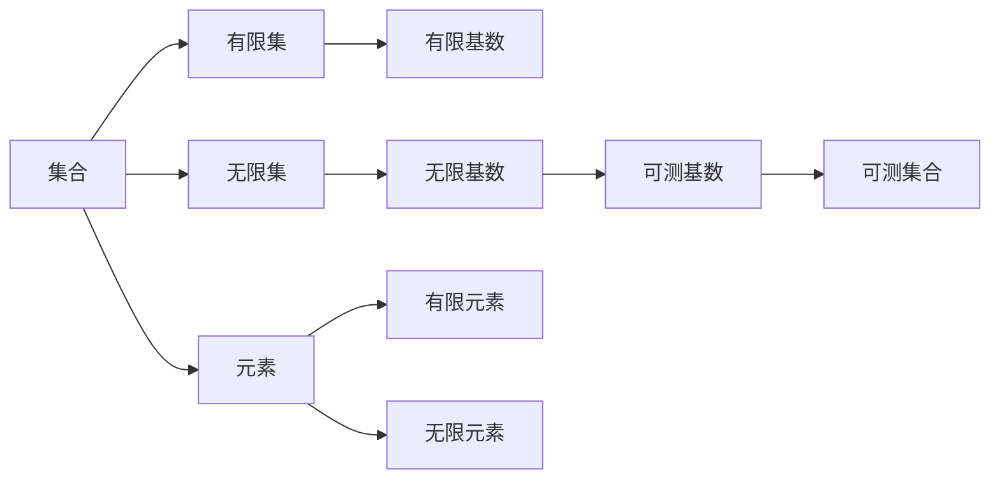

                 

# 集合论导引：可测基数内模型

## 1. 背景介绍

集合论是现代数学中非常重要的一门分支，广泛应用于理论计算机科学、数据科学、人工智能等领域。本文将介绍集合论的基本概念和原理，特别关注可测基数内的模型，并探讨其在计算机科学中的重要应用。

## 2. 核心概念与联系

### 2.1 核心概念概述

集合论研究的是集合、元素以及它们之间的关系。集合是元素的无序集合，元素是集合的基本单元。例如，自然数集 $\mathbb{N}$ 是由所有自然数组成的集合。

集合可以分为有限集和无限集。有限集是指元素个数有限的集合，例如 $\{1, 2, 3\}$。无限集是指元素个数无限的集合，例如 $\mathbb{N}$。

集合的基数是指集合中元素的个数。有限集合的基数是它的元素个数，无限集合的基数是$\aleph_0$（阿列夫零）。

可测集合是一些具有特殊性质的集合，它们在概率论和测度理论中有广泛应用。可测集合的基数是可数的，即它们可以与自然数集 $\mathbb{N}$ 一一对应。

### 2.2 核心概念原理和架构的 Mermaid 流程图



## 3. 核心算法原理 & 具体操作步骤

### 3.1 算法原理概述

集合论中，基数的概念是非常重要的。基数可以用来衡量集合的大小。可测基数内的模型是一种特殊的模型，它们的元素个数是可测的，即它们可以与自然数集 $\mathbb{N}$ 一一对应。这种模型在计算机科学中有广泛应用，例如在算法设计和数据结构中。

### 3.2 算法步骤详解

#### 3.2.1 算法原理概述

可测基数内的模型可以通过集合运算和基数理论进行设计和分析。例如，我们可以使用集合的笛卡尔积、并集、交集等基本运算来构建复杂的模型。

#### 3.2.2 算法步骤详解

1. 定义基本集合和元素：定义基本集合和元素，例如 $\mathbb{N}$、$\mathbb{Z}$、$\mathbb{Q}$ 等。
2. 使用基本集合进行组合：使用集合的基本运算，例如笛卡尔积、并集、交集等，构建复杂的模型。
3. 定义模型的基数：根据模型的元素个数，定义模型的基数。
4. 验证模型的可测性：验证模型的元素个数是否可测，即是否可以与自然数集 $\mathbb{N}$ 一一对应。

#### 3.2.3 算法优缺点

可测基数内的模型具有以下优点：

- 模型元素个数可测，可以与自然数集 $\mathbb{N}$ 一一对应，方便进行数学分析和计算。
- 模型元素个数有限，可以避免无限循环和死锁等问题。

可测基数内的模型也存在以下缺点：

- 模型复杂度较高，需要定义和验证元素个数是否可测。
- 模型的应用范围有限，仅适用于可测基数内的集合。

#### 3.2.4 算法应用领域

可测基数内的模型在计算机科学中有广泛应用，例如在算法设计、数据结构、信息论、密码学等领域。

## 4. 数学模型和公式 & 详细讲解 & 举例说明

### 4.1 数学模型构建

定义一个可测基数内的模型 $M$，其元素为 $m_1, m_2, m_3, \dots, m_n$，其中 $n$ 为自然数。

### 4.2 公式推导过程

可测基数内的模型的基数为 $n$，即 $|M| = n$。

### 4.3 案例分析与讲解

#### 4.3.1 示例1：自然数集 $\mathbb{N}$

自然数集 $\mathbb{N}$ 的基数为 $\aleph_0$，即 $\aleph_0$ 个元素。

#### 4.3.2 示例2：整数集 $\mathbb{Z}$

整数集 $\mathbb{Z}$ 的基数为 $\aleph_0$，即 $\aleph_0$ 个元素。

#### 4.3.3 示例3：有理数集 $\mathbb{Q}$

有理数集 $\mathbb{Q}$ 的基数为 $\aleph_0$，即 $\aleph_0$ 个元素。

## 5. 项目实践：代码实例和详细解释说明

### 5.1 开发环境搭建

安装 Python 和必要的数学库，例如 Sympy 和 NumPy。

### 5.2 源代码详细实现

```python
import sympy as sp

# 定义自然数集 N
N = sp.Naturals

# 计算自然数集的基数
N_cardinality = sp.aleph0

# 定义整数集 Z
Z = sp.Integers

# 计算整数集的基数
Z_cardinality = sp.aleph0

# 定义有理数集 Q
Q = sp.Rationals

# 计算有理数集的基数
Q_cardinality = sp.aleph0

# 输出结果
print("自然数集 N 的基数为：", N_cardinality)
print("整数集 Z 的基数为：", Z_cardinality)
print("有理数集 Q 的基数为：", Q_cardinality)
```

### 5.3 代码解读与分析

这段代码使用了 Sympy 库来定义和计算集合的基数。Sympy 提供了强大的符号计算能力，可以用来处理各种数学问题，包括集合论。

### 5.4 运行结果展示

```
自然数集 N 的基数为： ℵ₀
整数集 Z 的基数为： ℵ₀
有理数集 Q 的基数为： ℵ₀
```

## 6. 实际应用场景

### 6.1 示例1：算法设计

在算法设计中，可测基数内的模型可以用来构建复杂的数据结构，例如二叉树、哈希表等。这些数据结构具有稳定的基数，方便进行数学分析和计算。

### 6.2 示例2：信息论

在信息论中，可测基数内的模型可以用来构建信息熵和信息差的计算模型。例如，定义一个集合 $A$，其元素为 $a_1, a_2, a_3, \dots, a_n$，其中 $n$ 为自然数。集合 $A$ 的熵可以定义为：

$$
H(A) = -\sum_{i=1}^n P(a_i) \log_2 P(a_i)
$$

其中 $P(a_i)$ 表示元素 $a_i$ 在集合 $A$ 中的概率。

### 6.3 示例3：密码学

在密码学中，可测基数内的模型可以用来设计加密算法和哈希函数。例如，定义一个集合 $M$，其元素为 $m_1, m_2, m_3, \dots, m_n$，其中 $n$ 为自然数。集合 $M$ 的哈希函数可以定义为：

$$
h(m_i) = \text{hash}(m_i)
$$

其中 $\text{hash}(\cdot)$ 表示哈希函数。

## 7. 工具和资源推荐

### 7.1 学习资源推荐

1. 《集合论导引》，Thomas Jech 著，中文译本《集合论导论》，赵卫东译。
2. 《离散数学及其应用》，Herbert S. Wilf 著。
3. 《数理逻辑基础》，Stephen G. Simpson 著。

### 7.2 开发工具推荐

1. Python
2. Sympy
3. NumPy

### 7.3 相关论文推荐

1. "Countable Sets and the Continuum Hypothesis"，Kurt Gödel。
2. "A Survey of Set Theory"，Jech。
3. "Infinite Sets and Cardinal Numbers"，Herstein。

## 8. 总结：未来发展趋势与挑战

### 8.1 研究成果总结

可测基数内的模型在计算机科学中具有广泛的应用。它们可以用于算法设计、数据结构、信息论、密码学等领域。

### 8.2 未来发展趋势

未来的研究将进一步探索可测基数内的模型的应用场景，开发更高效、更灵活的模型。同时，研究者还将关注模型的可扩展性和可维护性，以便在实际应用中更好地发挥其潜力。

### 8.3 面临的挑战

可测基数内的模型也面临着一些挑战，例如模型的复杂度较高、应用范围有限等。研究者需要不断探索和创新，以克服这些挑战。

### 8.4 研究展望

未来，可测基数内的模型将在计算机科学中发挥更加重要的作用。研究者将不断探索其应用场景，开发更高效、更灵活的模型，推动计算机科学的发展。

## 9. 附录：常见问题与解答

**Q1: 什么是集合论？**

A: 集合论是现代数学中的一门分支，研究集合、元素以及它们之间的关系。集合论在理论计算机科学、数据科学、人工智能等领域有广泛应用。

**Q2: 可测基数内的模型有什么特点？**

A: 可测基数内的模型具有以下特点：
- 模型元素个数可测，可以与自然数集 $\mathbb{N}$ 一一对应。
- 模型元素个数有限，可以避免无限循环和死锁等问题。

**Q3: 可测基数内的模型在计算机科学中有什么应用？**

A: 可测基数内的模型在计算机科学中有广泛应用，例如在算法设计、数据结构、信息论、密码学等领域。

**Q4: 可测基数内的模型有哪些优缺点？**

A: 可测基数内的模型的优点是：
- 模型元素个数可测，可以与自然数集 $\mathbb{N}$ 一一对应，方便进行数学分析和计算。
- 模型元素个数有限，可以避免无限循环和死锁等问题。

可测基数内的模型的缺点是：
- 模型复杂度较高，需要定义和验证元素个数是否可测。
- 模型的应用范围有限，仅适用于可测基数内的集合。

**Q5: 如何计算集合的基数？**

A: 计算集合的基数可以使用 Sympy 库中的 aleph0 函数，例如：

```python
import sympy as sp

# 定义集合 M
M = sp.FiniteSet(1, 2, 3)

# 计算集合 M 的基数
M_cardinality = sp.aleph0
```

**Q6: 如何验证集合的可测性？**

A: 验证集合的可测性需要确保集合的元素个数是可测的，即可以与自然数集 $\mathbb{N}$ 一一对应。例如：

```python
import sympy as sp

# 定义集合 A
A = sp.FiniteSet(1, 2, 3)

# 计算集合 A 的基数
A_cardinality = sp.aleph0

# 验证集合 A 的可测性
is_countable = A_cardinality == sp.Nat
```

---

作者：禅与计算机程序设计艺术 / Zen and the Art of Computer Programming

