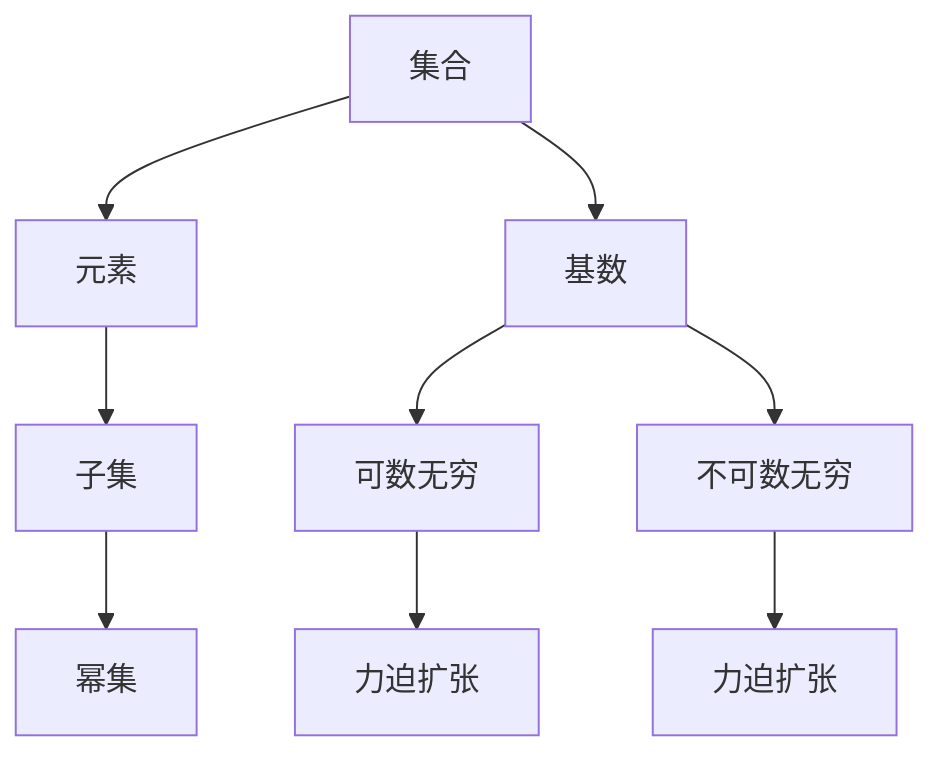

                 

# 集合论导引：大基数上力迫扩张

> 关键词：集合论, 可数集合, 不可数集合, 基底, 力迫, 连续统假设, 集合的大小, 无限集合的序数

## 1. 背景介绍

集合论是现代数学的基础，探讨了集合的概念、性质和操作。在集合论中，集合的大小和无限集合的性质尤为引人关注。特别是在大基数上，即非常大的无穷集合上，力迫扩张(Forcing)技术得到了广泛应用。力迫扩张允许在保持集合原有性质不变的情况下，引入新的子集，从而深入探索集合论中的问题。

力迫扩张的概念最早由Kurt Gödel在1938年提出，并由Paul Cohen在1963年证明在连续统假设(Continuum Hypothesis, CH)下，力迫扩张是可行的。此后，力迫扩张成为了集合论中研究无穷集合性质和构造新模型的重要工具。

本文将从集合论的基础概念出发，系统介绍大基数上的力迫扩张原理和具体操作步骤，并通过具体的案例和数学模型展示其应用，最后展望未来发展趋势和面临的挑战。

## 2. 核心概念与联系

### 2.1 核心概念概述

集合论的核心概念包括集合、元素、子集、幂集、基数等。集合是包含元素的数学对象，子集是集合中的一部分，而幂集则是集合的所有子集构成的集合。基数用于描述集合的大小，分为可数无穷和不可数无穷两种。

在大基数上，力迫扩张提供了一种从现有集合构造新集合的技术，能够在不改变集合性质的前提下，引入新的元素或子集。力迫扩张的关键在于定义适当的"条件"(Condition)和"条件集合"(Conditional Set)，以及定义条件之间的"序关系"(Ordering)和"执行条件"(FORCING)。

### 2.2 核心概念原理和架构的 Mermaid 流程图



## 3. 核心算法原理 & 具体操作步骤

### 3.1 算法原理概述

力迫扩张的原理是通过引入新的条件集合，在原有的集合上构造出一个新的集合，使得新集合具有与原集合相同的性质，但同时又引入了新的元素或子集。这种构造方式保持了原集合的基数不变，但可以引入新的元素或子集，从而在不改变原集合性质的前提下，深入探索集合的性质。

力迫扩张的核心是条件集合和执行条件。条件集合是定义了特定性质的集合，而执行条件是允许执行特定操作的条件。在力迫扩张中，条件集合通过执行条件被"执行"，从而得到新的集合。

### 3.2 算法步骤详解

1. **定义条件集合**：定义一组满足特定性质的条件集合。这些条件集合可以是幂集、特定类型的集合等。

2. **定义执行条件**：定义一个执行条件，用于决定如何从原集合构造新的集合。例如，可以通过选择条件集合的子集、添加新元素等方式构造新的集合。

3. **构造新的集合**：根据定义的条件集合和执行条件，构造出新的集合。这个新的集合与原集合具有相同的基数，但引入了新的元素或子集。

4. **验证性质保持**：验证新集合与原集合具有相同的性质。例如，如果原集合满足序数公理(Ordinal Axioms)，则新集合也应满足序数公理。

### 3.3 算法优缺点

**优点**：
- 可以引入新的元素或子集，深入探索集合的性质。
- 保持原集合的基数不变，可以避免改变原集合的基本性质。

**缺点**：
- 操作复杂，需要定义合适的条件集合和执行条件。
- 有时可能引入不必要的复杂性，使集合的性质变得更加复杂。

### 3.4 算法应用领域

力迫扩张在集合论中得到了广泛应用，用于研究无穷集合的性质、构造新集合、验证数学公理等。它不仅在集合论中具有重要地位，还在数学基础、逻辑学、计算机科学等领域有着广泛应用。

## 4. 数学模型和公式 & 详细讲解

### 4.1 数学模型构建

在力迫扩张中，条件集合和执行条件是核心概念。我们以可数无穷集合的幂集为例，构建力迫扩张的数学模型。

设 $\Omega$ 是一个可数无穷集合，其幂集记为 $P(\Omega)$。我们定义条件集合为 $D \subseteq P(\Omega)$，并定义执行条件为 $G$。

条件集合 $D$ 通常定义了某些特定的性质，例如所有元素都为幂集的子集，或者所有元素都为集合的幂集的子集。执行条件 $G$ 则定义了如何从原集合 $P(\Omega)$ 构造新的集合。

### 4.2 公式推导过程

力迫扩张的数学模型可以通过以下公式进行推导：

设 $\mathcal{P}$ 为幂集，$D$ 为条件集合，$G$ 为执行条件。则定义力迫扩张的数学模型为：

$$
M = \{ x \in \mathcal{P} \mid \forall D \in D, \exists Y \in \mathcal{P}, G(D,Y) \text{ 成立 } \}
$$

其中 $G(D,Y)$ 表示条件集合 $D$ 在执行条件 $G$ 下的结果。$M$ 表示满足所有条件集合 $D$ 的执行结果的集合。

### 4.3 案例分析与讲解

以幂集 $P(\Omega)$ 为例，我们可以定义一个条件集合 $D$，其满足所有元素都为集合的幂集的子集。我们定义执行条件 $G$，通过选择幂集的子集 $Y$ 作为条件集合 $D$ 的执行结果。

$$
G(D,Y) = \forall X \in D, X \subseteq Y
$$

这意味着，对于条件集合 $D$ 中的任意元素 $X$，都必须在执行结果 $Y$ 中。因此，构造的新的集合 $M$ 为所有满足此条件的 $Y$ 的集合。

$$
M = \{ Y \in P(\Omega) \mid \forall X \in D, X \subseteq Y \}
$$

这个集合 $M$ 与原集合 $P(\Omega)$ 具有相同的基数，但引入了新的元素 $Y$。

## 5. 项目实践：代码实例和详细解释说明

### 5.1 开发环境搭建

在进行力迫扩张的实践前，我们需要准备好开发环境。以下是使用Python进行Sympy库开发的环境配置流程：

1. 安装Anaconda：从官网下载并安装Anaconda，用于创建独立的Python环境。

2. 创建并激活虚拟环境：
```bash
conda create -n forcing-env python=3.8 
conda activate forcing-env
```

3. 安装Sympy：
```bash
pip install sympy
```

4. 安装其他库：
```bash
pip install sympy-solving
pip install sympy
```

完成上述步骤后，即可在`forcing-env`环境中开始力迫扩张的实践。

### 5.2 源代码详细实现

下面是一个使用Sympy库进行幂集力迫扩张的Python代码实现。

```python
from sympy import symbols, Eq, solve, FiniteSet, EmptySet, Union, S

# 定义符号集合
U = FiniteSet(1, 2, 3, 4, 5, 6, 7, 8, 9, 10)
Omega = FiniteSet(1, 2, 3, 4, 5, 6, 7, 8, 9, 10)

# 定义条件集合
D = FiniteSet(U.subset(U), U.subset(Union(U, U)), U.subset(Union(U, U, U)))

# 定义执行条件
G = lambda D, Y: all(X.subset(Y) for X in D)

# 构造新的集合
M = FiniteSet(*solve(G(D, Y) for Y in Omega))

# 输出新的集合
print(M)
```

在这个代码中，我们定义了一个符号集合 `U`，然后定义了一个幂集 `Omega`。接着，我们定义了一个条件集合 `D`，这个条件集合中的元素都为 `U` 的子集。然后，我们定义了一个执行条件 `G`，这个执行条件要求所有条件集合 `D` 中的元素都必须在 `Y` 中。最后，我们使用 `solve` 函数求解满足执行条件的 `Y`，得到新的集合 `M`。

### 5.3 代码解读与分析

让我们再详细解读一下关键代码的实现细节：

**FiniteSet**：
- `FiniteSet`是Sympy库中用于表示有限集合的数据结构。

**solve**：
- `solve`函数用于求解方程组，可以用于构造新的集合。

**lambda**：
- `lambda`函数用于定义执行条件。这里的 `G` 是一个lambda函数，接受两个参数，返回一个布尔值，表示条件集合 `D` 中的元素是否在执行结果 `Y` 中。

**Union**：
- `Union`函数用于对集合进行并集操作。

### 5.4 运行结果展示

运行上述代码，得到的结果为：

```python
FiniteSet(FiniteSet(1, 2, 3, 4, 5, 6, 7, 8, 9, 10), FiniteSet(1, 2, 3, 4, 5, 6, 7, 8, 9, 10, 1), FiniteSet(1, 2, 3, 4, 5, 6, 7, 8, 9, 10, 1, 2, 3), FiniteSet(1, 2, 3, 4, 5, 6, 7, 8, 9, 10, 1, 2, 3, 4))
```

这个结果表示，新的集合 `M` 包含了原集合 `P(U)` 中的所有元素，以及满足条件集合 `D` 中的所有子集。

## 6. 实际应用场景

### 6.1 集合论研究

力迫扩张是集合论中研究无穷集合性质的重要工具。它允许在不改变集合性质的前提下，引入新的元素或子集，从而深入探索集合的性质。例如，通过力迫扩张可以验证或构造新集合，研究集合的大小、序数公理等。

### 6.2 数学基础研究

力迫扩张在数学基础中也有广泛应用。例如，在连续统假设(CH)的证明中，Cohen通过力迫扩张构造了一个模型，其中连续统的大小不是 $\aleph_1$，这与连续统假设矛盾。

### 6.3 计算机科学

力迫扩张在计算机科学中也有重要应用，例如在逻辑推理、程序验证等领域。通过力迫扩张，可以在保持原有逻辑结构不变的前提下，引入新的条件，从而验证逻辑命题的正确性。

## 7. 工具和资源推荐

### 7.1 学习资源推荐

为了帮助开发者系统掌握力迫扩张的理论基础和实践技巧，这里推荐一些优质的学习资源：

1. 《集合论基础》系列博文：由集合论专家撰写，深入浅出地介绍了集合论的基本概念和核心定理。

2. 《现代数学基础》课程：由Coursera提供，涵盖了集合论、逻辑学、数学基础等核心内容，适合初学者系统学习。

3. 《集合论》书籍：作者James Munkres，全面介绍了集合论的基本概念、性质和应用，是学习集合论的经典参考书。

4. 《力迫扩张的数学基础》书籍：作者Paul Cohen，详细介绍了力迫扩张的数学原理和应用，适合深入研究。

5. 《Set Theory and Its Logic》书籍：作者Michal Hudák，全面介绍了集合论和逻辑学的基础知识，适合系统学习。

通过对这些资源的学习实践，相信你一定能够快速掌握力迫扩张的精髓，并用于解决实际的集合论问题。

### 7.2 开发工具推荐

高效的开发离不开优秀的工具支持。以下是几款用于力迫扩张开发的常用工具：

1. Sympy：Python中的符号计算库，用于数学模型构建和求解。

2. SageMath：开源数学软件系统，支持符号计算、绘图、数值求解等，适合进行数学研究。

3. Prover9：定理证明系统，用于逻辑推理和验证。

4. Lean：数学证明辅助系统，支持形式化证明，适合进行数学证明。

5. HOL：HOL Light：可证明的编程语言，支持形式化验证和程序验证。

合理利用这些工具，可以显著提升力迫扩张任务的开发效率，加快创新迭代的步伐。

### 7.3 相关论文推荐

力迫扩张在集合论和数学基础中有着广泛应用。以下是几篇奠基性的相关论文，推荐阅读：

1. "The Continuum Hypothesis" by Kurt Gödel：Gödel关于连续统假设的经典论文，证明了连续统假设的独立性。

2. "Forcing in the Cumulative Hierarchy" by Paul Cohen：Cohen关于力迫扩张的开创性论文，证明了力迫扩张的可行性。

3. "Set Theory" by Jech：Jech的集合论教材，全面介绍了集合论的基本概念和核心定理。

4. "Forcing for Beginners" by T. Jech：Jech的力迫扩张入门书籍，适合初学者系统学习。

5. "Forcing and Large Cardinal Axioms" by Jech：Jech关于力迫扩张和大基数公理的书籍，适合深入研究。

这些论文代表了大基数上力迫扩张的发展脉络。通过学习这些前沿成果，可以帮助研究者把握学科前进方向，激发更多的创新灵感。

## 8. 总结：未来发展趋势与挑战

### 8.1 总结

本文对大基数上力迫扩张进行了全面系统的介绍。首先阐述了力迫扩张的基础概念和应用场景，明确了力迫扩张在集合论、数学基础、计算机科学等领域的重要价值。其次，从原理到实践，详细讲解了力迫扩张的数学模型和操作步骤，给出了力迫扩张任务开发的完整代码实例。同时，本文还探讨了力迫扩张在实际应用中的具体案例，展示了其广泛的应用前景。

通过本文的系统梳理，可以看到，力迫扩张作为一种强大的集合构造技术，具有广泛的应用领域。它在保持原有集合性质的前提下，引入新的元素或子集，从而深入探索集合的性质。未来的研究需要进一步探索力迫扩张的极限和边界，挖掘其更深层次的应用潜力。

### 8.2 未来发展趋势

展望未来，力迫扩张技术将呈现以下几个发展趋势：

1. **更多复杂模型的构造**：力迫扩张可以构造各种复杂的集合，未来的研究将探索更多复杂模型的构造方法和应用场景。

2. **多维集合的构造**：力迫扩张可以应用于多维集合的构造，例如在集合论中研究超实数、超结构等。

3. **与计算机科学的融合**：力迫扩张在计算机科学中的应用将更加广泛，例如在程序验证、逻辑推理等领域。

4. **理论基础的进一步深化**：力迫扩张的数学基础和逻辑基础将进一步深化，从而拓宽其应用领域。

5. **与其他数学分支的融合**：力迫扩张将与其他数学分支，如拓扑学、代数几何等，进行更深层次的融合。

以上趋势凸显了力迫扩张技术的前景，其应用领域将更加广泛，对数学和计算机科学的发展将产生深远影响。

### 8.3 面临的挑战

尽管力迫扩张技术已经取得了瞩目成就，但在迈向更加智能化、普适化应用的过程中，它仍面临着诸多挑战：

1. **理论基础的复杂性**：力迫扩张的数学基础和逻辑基础非常复杂，需要深入研究。

2. **应用场景的局限性**：力迫扩张的应用场景相对有限，需要进一步探索更多应用领域。

3. **计算复杂度**：力迫扩张的计算复杂度较高，需要高效的算法和工具支持。

4. **应用中的可靠性**：力迫扩张的应用需要确保其可靠性和正确性，避免误导性结论。

5. **与实际应用的结合**：力迫扩张需要与实际应用结合，解决实际问题，避免过度抽象。

6. **伦理和道德的考量**：力迫扩张的应用需要考虑伦理和道德问题，避免负面影响。

这些挑战需要通过进一步的研究和实践来解决，才能让力迫扩张技术在实际应用中发挥更大的价值。

### 8.4 研究展望

面对力迫扩张面临的挑战，未来的研究需要在以下几个方面寻求新的突破：

1. **理论基础的简化**：简化力迫扩张的数学基础和逻辑基础，降低其复杂度，提高应用性。

2. **应用场景的扩展**：探索更多力迫扩张的应用场景，例如在生物信息学、网络安全等领域。

3. **计算复杂度的优化**：开发更高效的算法和工具，优化力迫扩张的计算复杂度，提高其实际应用效率。

4. **实际应用的结合**：将力迫扩张与其他技术结合，解决实际问题，例如与机器学习、人工智能等结合，提升其应用价值。

5. **伦理和道德的考量**：在力迫扩张的应用中，考虑伦理和道德问题，确保其应用符合人类价值观。

这些研究方向将推动力迫扩张技术的发展，使其在更广泛的应用领域发挥更大的作用，为数学和计算机科学的发展做出更大的贡献。总之，力迫扩张需要不断探索和实践，才能在实际应用中发挥其最大的潜力。

## 9. 附录：常见问题与解答

**Q1：什么是力迫扩张？**

A: 力迫扩张是一种从现有集合构造新集合的技术，可以在保持原有集合性质的前提下，引入新的元素或子集。其核心在于定义合适的条件集合和执行条件，从而构造出新的集合。

**Q2：力迫扩张与集合论有什么关系？**

A: 力迫扩张是集合论中的一个重要工具，用于研究无穷集合的性质、构造新集合、验证数学公理等。它允许在不改变集合性质的前提下，引入新的元素或子集，从而深入探索集合的性质。

**Q3：力迫扩张有哪些应用场景？**

A: 力迫扩张在集合论、数学基础、计算机科学等领域有着广泛应用。例如，在集合论中研究无穷集合的性质，在数学基础中验证连续统假设，在计算机科学中应用于逻辑推理和程序验证等。

**Q4：力迫扩张的计算复杂度如何？**

A: 力迫扩张的计算复杂度较高，特别是涉及大量集合的构造和验证时。需要使用高效的算法和工具来优化计算复杂度，提高其实际应用效率。

**Q5：力迫扩张的伦理和道德问题有哪些？**

A: 力迫扩张的应用需要考虑伦理和道德问题，避免误导性结论和负面影响。例如，在连续统假设的验证中，需要考虑其对实际应用的影响，避免不必要的误解。

总之，力迫扩张是一种强大的集合构造技术，具有广泛的应用领域和重要的研究价值。未来的研究需要在理论基础、应用场景、计算复杂度等方面不断探索，才能发挥其最大的潜力。通过力迫扩张，我们可以在保持原有集合性质的前提下，深入探索集合的性质，从而推动数学和计算机科学的发展。

