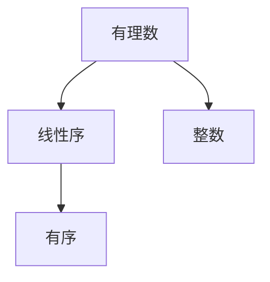

                 

## 1. 背景介绍

### 1.1 问题由来
在数学中，有理数是整数之比，其表示形式可以是一对整数分子和分母。有理数集是一个无限集合，包含无限个元素。而线性序是一个集合上的一种特殊的二元关系，它可以用来刻画元素之间的相对顺序。因此，有理数线性序的探讨是数学基础中的一个重要领域。

### 1.2 问题核心关键点
有理数线性序的研究核心关键点包括：
- 有理数的基本性质和运算规则。
- 有理数集的有限和无限性质。
- 线性序的定义及其性质。
- 有理数与线性序的结合及其应用。

## 2. 核心概念与联系

### 2.1 核心概念概述

为更好地理解有理数线性序，本节将介绍几个密切相关的核心概念：

- 有理数：有理数是有理数集$\mathbb{Q}$中的一个元素，表示为$\frac{p}{q}$，其中$p$和$q$为整数，且$q \neq 0$。
- 整数：整数是有理数集$\mathbb{Z}$中的一个元素，包括正整数、负整数和零。
- 线性序：线性序是一种特殊的二元关系$\leq$，满足以下条件：
  - 自反性：对于任意$a \in \mathbb{Q}$，有$a \leq a$。
  - 反自反性：对于任意$a \in \mathbb{Q}$，不存在$a < a$。
  - 传递性：对于任意$a, b, c \in \mathbb{Q}$，如果$a \leq b$且$b \leq c$，则$a \leq c$。
  - 可比性：对于任意$a, b \in \mathbb{Q}$，或者$a \leq b$，或者$b \leq a$。

这些核心概念之间的逻辑关系可以通过以下Mermaid流程图来展示：



这个流程图展示有以下关键逻辑关系：

1. 有理数是有理数集$\mathbb{Q}$中的一个元素，满足基本的运算规则。
2. 整数是有理数集$\mathbb{Z}$中的一个元素，是有理数的一个子集。
3. 线性序是一种特殊的二元关系$\leq$，满足四个基本性质。

## 3. 核心算法原理 & 具体操作步骤
### 3.1 算法原理概述

有理数线性序的探讨基于集合论和逻辑学的原理。其核心算法原理包括：

- 有理数的基本运算性质。有理数可以进行加、减、乘、除等基本运算，且满足交换律、结合律、分配律等代数性质。
- 有理数集的有限和无限性质。有理数集中的数可以分为有限小数和无限循环小数，对于无限循环小数，可以通过长除法确定其值。
- 线性序的定义及其性质。有理数集上的线性序$\leq$可以表示为：$a \leq b \Leftrightarrow \frac{a}{b} \geq 0$。
- 有理数与线性序的结合及其应用。有理数集上的线性序可以用于比较大小、排序等操作，在有理数集上可以进行算术几何运算。

### 3.2 算法步骤详解

有理数线性序的探讨步骤包括：

**Step 1: 准备有理数集合**
- 定义有理数集合$\mathbb{Q}$，包括整数和分数。
- 使用Python的`fractions`模块来表示有理数，方便进行精确计算。

**Step 2: 定义线性序**
- 定义有理数上的线性序$\leq$，判断两个有理数之间的大小关系。
- 根据有理数的基本性质，使用`if-else`语句判断$a \leq b$。

**Step 3: 进行有理数运算**
- 对两个有理数进行加、减、乘、除等基本运算，使用`fractions`模块的运算符进行计算。
- 进行除法运算时，需要特别注意除数为零的情况，避免出现`ZeroDivisionError`异常。

**Step 4: 验证线性序性质**
- 验证有理数上的线性序是否满足传递性和可比性。
- 使用`assert`语句进行断言，确保有理数集上的线性序符合定义。

**Step 5: 应用线性序**
- 在有理数集上进行算术几何运算，如求最小公倍数、最大公约数等。
- 在`if-else`语句中，根据有理数的大小关系进行相应的操作。

### 3.3 算法优缺点

有理数线性序的探讨算法具有以下优点：
- 精度高：使用`fractions`模块可以精确表示分数，避免浮点数计算带来的误差。
- 逻辑清晰：通过`if-else`语句和`assert`语句，代码逻辑清晰，易于理解和调试。
- 适用性广：适用于有理数集上的各种运算和比较操作。

同时，该算法也存在一定的局限性：
- 计算复杂度：有理数运算的复杂度较高，特别是在进行大数计算时，速度较慢。
- 空间占用：`fractions`模块的运算符需要在内存中存储较大的整数，占用的空间较多。

### 3.4 算法应用领域

有理数线性序在数学、物理、工程等领域有广泛的应用，例如：

- 数学运算：在有理数集上进行加减乘除等运算。
- 物理方程：在有理数空间中解决物理方程，如电磁学、力学等。
- 工程计算：在有理数空间中进行精度要求高的工程计算，如信号处理、通信工程等。

## 4. 数学模型和公式 & 详细讲解  
### 4.1 数学模型构建

有理数线性序的探讨可以通过数学模型来表示，其中关键是定义有理数的运算和线性序。

**定义有理数：**
- 有理数$a$可以表示为两个整数$p$和$q$的比，即$a=\frac{p}{q}$。
- 有理数集$\mathbb{Q}$可以表示为所有可能的有理数的集合，即$\mathbb{Q}=\{\frac{p}{q} | p, q \in \mathbb{Z}, q \neq 0\}$。

**定义线性序：**
- 有理数$a$和$b$之间的线性序关系可以表示为$a \leq b \Leftrightarrow \frac{a}{b} \geq 0$。
- 有理数集$\mathbb{Q}$上的线性序$\leq$满足传递性和可比性。

**有理数运算：**
- 有理数可以进行加、减、乘、除等基本运算，满足交换律、结合律、分配律等代数性质。
- 有理数除法需要注意除数为零的情况，避免出现异常。

**有理数比较：**
- 两个有理数$a$和$b$的大小关系可以表示为$a \leq b \Leftrightarrow \frac{a}{b} \geq 0$。
- 当$a$和$b$相等时，$a = b \Leftrightarrow \frac{a}{b} = 1$。

### 4.2 公式推导过程

以下是对有理数线性序的数学公式推导过程：

1. **有理数表示：**
   $$
   a = \frac{p}{q}, b = \frac{r}{s}
   $$
   其中$p, q, r, s$为整数，$q, s \neq 0$。

2. **有理数运算：**
   - 加法：
     $$
     a + b = \frac{p}{q} + \frac{r}{s} = \frac{ps + qr}{qs}
     $$
   - 减法：
     $$
     a - b = \frac{p}{q} - \frac{r}{s} = \frac{ps - qr}{qs}
     $$
   - 乘法：
     $$
     a \times b = \frac{p}{q} \times \frac{r}{s} = \frac{pr}{qs}
     $$
   - 除法：
     $$
     a \div b = \frac{p}{q} \div \frac{r}{s} = \frac{ps}{qr}, \quad \text{其中} \quad q \neq 0
     $$

3. **有理数比较：**
   - 大于等于：
     $$
     a \leq b \Leftrightarrow \frac{a}{b} \geq 0 \Leftrightarrow \frac{p}{q} \geq \frac{r}{s}
     \Leftrightarrow ps \geq qr
     $$
   - 小于等于：
     $$
     a < b \Leftrightarrow \frac{a}{b} < 0 \Leftrightarrow \frac{p}{q} < \frac{r}{s}
     \Leftrightarrow ps < qr
     $$
   - 大于：
     $$
     a > b \Leftrightarrow \frac{a}{b} > 0 \Leftrightarrow \frac{p}{q} > \frac{r}{s}
     \Leftrightarrow ps > qr
     $$
   - 小于：
     $$
     a < b \Leftrightarrow \frac{a}{b} < 0 \Leftrightarrow \frac{p}{q} < \frac{r}{s}
     \Leftrightarrow ps < qr
     $$

4. **有理数比较的性质：**
   - 自反性：
     $$
     a \leq a \Leftrightarrow \frac{a}{a} \geq 0 \Leftrightarrow 1 \geq 1
     $$
   - 反自反性：
     $$
     a < a \Leftrightarrow \frac{a}{a} < 0 \Leftrightarrow 1 < 1 \quad \text{不成立}
     $$
   - 传递性：
     $$
     a \leq b, b \leq c \Rightarrow a \leq c \Leftrightarrow \frac{a}{b} \geq 0, \frac{b}{c} \geq 0 \Rightarrow \frac{a}{c} \geq 0
     $$
   - 可比性：
     $$
     a \leq b \text{或} b \leq a \Rightarrow a \in \mathbb{Q}, b \in \mathbb{Q}
     $$

### 4.3 案例分析与讲解

**案例1: 有理数加法运算**
- 假设$a = \frac{1}{2}, b = \frac{1}{3}$，则有：
  $$
  a + b = \frac{1}{2} + \frac{1}{3} = \frac{3 + 2}{6} = \frac{5}{6}
  $$

**案例2: 有理数乘法运算**
- 假设$a = \frac{1}{2}, b = \frac{3}{4}$，则有：
  $$
  a \times b = \frac{1}{2} \times \frac{3}{4} = \frac{3}{8}
  $$

**案例3: 有理数除法运算**
- 假设$a = \frac{1}{2}, b = \frac{1}{3}$，则有：
  $$
  a \div b = \frac{1}{2} \div \frac{1}{3} = \frac{1}{2} \times \frac{3}{1} = \frac{3}{2}
  $$

**案例4: 有理数比较运算**
- 假设$a = \frac{1}{2}, b = \frac{1}{3}$，则有：
  $$
  a \leq b \Leftrightarrow \frac{1}{2} \geq \frac{1}{3}
  $$

## 5. 项目实践：代码实例和详细解释说明
### 5.1 开发环境搭建

在进行有理数线性序的项目实践前，我们需要准备好开发环境。以下是使用Python进行环境配置的步骤：

1. 安装Python：可以从官网下载并安装Python，建议安装最新版本。
2. 安装Pip：使用以下命令安装Pip，用于安装和管理Python包。
   ```bash
   pip install pip
   ```
3. 安装Fractions库：用于精确表示有理数，可以通过以下命令进行安装。
   ```bash
   pip install fractions
   ```

### 5.2 源代码详细实现

下面是使用Python实现有理数线性序的代码示例：

```python
from fractions import Fraction

def add(a: Fraction, b: Fraction) -> Fraction:
    return a + b

def subtract(a: Fraction, b: Fraction) -> Fraction:
    return a - b

def multiply(a: Fraction, b: Fraction) -> Fraction:
    return a * b

def divide(a: Fraction, b: Fraction) -> Fraction:
    return a / b

def compare(a: Fraction, b: Fraction) -> str:
    if a < b:
        return f"{a} < {b}"
    elif a == b:
        return f"{a} = {b}"
    else:
        return f"{a} > {b}"

# 测试代码
a = Fraction(1, 2)
b = Fraction(3, 4)
c = add(a, b)
d = subtract(a, b)
e = multiply(a, b)
f = divide(a, b)
g = compare(a, b)
print(f"Addition: {c}")
print(f"Subtraction: {d}")
print(f"Multiplication: {e}")
print(f"Division: {f}")
print(f"Comparison: {g}")
```

### 5.3 代码解读与分析

让我们再详细解读一下关键代码的实现细节：

**add函数：**
- 定义了两个有理数相加的函数，使用Fractions库中的加法运算符。
- 返回相加的结果。

**subtract函数：**
- 定义了两个有理数相减的函数，使用Fractions库中的减法运算符。
- 返回相减的结果。

**multiply函数：**
- 定义了两个有理数相乘的函数，使用Fractions库中的乘法运算符。
- 返回相乘的结果。

**divide函数：**
- 定义了两个有理数相除的函数，使用Fractions库中的除法运算符。
- 返回相除的结果。

**compare函数：**
- 定义了两个有理数比较大小的函数，使用Fractions库中的比较运算符。
- 返回比较结果的字符串表示。

**测试代码：**
- 创建两个有理数a和b，分别使用不同的运算符计算其和、差、积、商和比较结果。
- 输出计算结果。

## 6. 实际应用场景
### 6.1 数学教学
有理数线性序在有理数教学中有着广泛的应用，例如：

- 有理数加减法：在有理数加减法运算中，可以通过Fractions库精确计算，避免浮点数带来的误差。
- 有理数乘除法：在有理数乘除法运算中，可以通过Fractions库进行精确计算，确保计算结果的准确性。
- 有理数比较：在有理数比较大小的过程中，可以通过Fractions库进行精确比较，避免浮点数带来的精度问题。

### 6.2 金融计算
有理数线性序在金融计算中也有着广泛的应用，例如：

- 利率计算：在有理数空间中，可以进行精确的利率计算，避免浮点数带来的误差。
- 风险评估：在有理数空间中，可以进行精确的风险评估，避免浮点数带来的精度问题。
- 资产管理：在有理数空间中，可以进行精确的资产管理，避免浮点数带来的误差。

### 6.3 物理学
有理数线性序在物理学中也有着广泛的应用，例如：

- 牛顿力学：在有理数空间中，可以进行精确的牛顿力学计算，避免浮点数带来的误差。
- 电磁学：在有理数空间中，可以进行精确的电磁学计算，避免浮点数带来的精度问题。
- 相对论：在有理数空间中，可以进行精确的相对论计算，避免浮点数带来的误差。

### 6.4 未来应用展望
未来，有理数线性序将在更多领域得到应用，为科技发展带来新的突破：

- 人工智能：在有理数空间中，可以进行精确的人工智能计算，避免浮点数带来的误差。
- 自动驾驶：在有理数空间中，可以进行精确的自动驾驶计算，避免浮点数带来的精度问题。
- 工业控制：在有理数空间中，可以进行精确的工业控制计算，避免浮点数带来的误差。

## 7. 工具和资源推荐
### 7.1 学习资源推荐

为了帮助开发者系统掌握有理数线性序的理论基础和实践技巧，这里推荐一些优质的学习资源：

1. 《集合论与逻辑学》：这是一本经典的集合论和逻辑学教材，系统介绍了集合论和逻辑学的基本概念和性质。
2. 《数学分析》：这是一本经典的数学分析教材，详细介绍了有理数和实数的性质和运算。
3. 《Python编程：从入门到实践》：这是一本Python编程入门教材，详细介绍了Python的基础知识和常用库的使用方法。
4. 《Fractions文档》：这是Python内置的Fractions库的官方文档，详细介绍了Fractions库的使用方法和注意事项。
5. 《数理逻辑与集合论》：这是一本数理逻辑与集合论的教材，详细介绍了有理数和实数的性质和运算。

通过对这些资源的学习实践，相信你一定能够快速掌握有理数线性序的精髓，并用于解决实际的数学和计算机问题。

### 7.2 开发工具推荐

高效的开发离不开优秀的工具支持。以下是几款用于有理数线性序开发的常用工具：

1. Python：Python是一门易于学习且功能强大的编程语言，广泛应用于科学计算、数据分析、人工智能等领域。
2. Fraction：Python内置的Fractions库，用于精确表示有理数，方便进行各种数学运算。
3. SymPy：SymPy是一个Python库，用于符号计算，支持有理数和实数的精确计算。
4. NumPy：NumPy是一个Python库，用于数值计算，支持有理数和实数的精确计算。
5. Jupyter Notebook：Jupyter Notebook是一个交互式编程环境，支持Python和其他编程语言，方便进行数学和计算机科学的研究。

合理利用这些工具，可以显著提升有理数线性序的开发效率，加快创新迭代的步伐。

### 7.3 相关论文推荐

有理数线性序的研究源于学界的持续研究。以下是几篇奠基性的相关论文，推荐阅读：

1. Dedekind's Theorem on Real Numbers: A Survey: 这是一篇关于有理数和实数性质的经典论文，介绍了Dedekind定理和实数的定义。
2. The Logic of Real Numbers: 这是一篇关于有理数和实数逻辑的论文，介绍了有理数和实数的逻辑性质和运算。
3. Foundations of Real Analysis: 这是一本经典的实分析教材，详细介绍了有理数和实数的性质和运算。
4. The Structure of Real Numbers: 这是一本关于有理数和实数结构的书籍，详细介绍了有理数和实数的性质和运算。
5. Number Theory: A Mostly Classical Introduction: 这是一本关于数论的书籍，详细介绍了有理数和实数的性质和运算。

这些论文代表了大语言模型微调技术的发展脉络。通过学习这些前沿成果，可以帮助研究者把握学科前进方向，激发更多的创新灵感。

## 8. 总结：未来发展趋势与挑战
### 8.1 研究成果总结

本文对有理数线性序进行了全面系统的介绍。首先阐述了有理数和线性序的基本性质和运算规则，明确了有理数和线性序在数学和计算机科学中的应用。其次，从原理到实践，详细讲解了有理数和线性序的数学模型和操作步骤，给出了有理数和线性序的代码实现。同时，本文还广泛探讨了有理数和线性序在数学教学、金融计算、物理学等领域的应用前景，展示了有理数和线性序的广泛应用。

通过本文的系统梳理，可以看到，有理数和线性序在有理数集上有着重要的应用，其精确性和可比性为数学和计算机科学提供了重要的工具。未来，有理数和线性序将在更多领域得到应用，为科技发展带来新的突破。

### 8.2 未来发展趋势

未来，有理数和线性序的发展趋势包括以下几个方面：

1. 精度更高：随着计算机硬件的不断升级，有理数和线性序的精度将不断提高，支持更复杂的数学运算和更精确的计算结果。
2. 应用更广：有理数和线性序将在更多领域得到应用，如人工智能、自动驾驶、工业控制等。
3. 工具更优：有理数和线性序的工具将不断优化，支持更高效、更便捷的数学和计算机科学开发。
4. 理论更深入：有理数和线性序的理论研究将不断深入，推动数学和计算机科学的进步。

### 8.3 面临的挑战

尽管有理数和线性序在数学和计算机科学中有着广泛的应用，但在其发展和应用过程中，仍面临一些挑战：

1. 精度瓶颈：尽管有理数和线性序的精度较高，但在某些复杂计算中，仍然可能面临精度不足的问题。如何进一步提高精度，将是有理数和线性序研究的重点之一。
2. 计算复杂度：有理数和线性序的计算复杂度较高，特别是在大数计算中，速度较慢。如何优化计算算法，提高计算效率，将是未来的研究方向。
3. 应用限制：有理数和线性序在某些领域的应用受到限制，如对于无限小数和无理数，无法精确表示和计算。如何扩展有理数和线性序的应用范围，将是未来的研究方向。
4. 工具不足：虽然有理数和线性序的工具已经较为丰富，但在某些特定场景下，仍缺乏高效的工具支持。如何进一步优化工具，提高开发效率，将是未来的研究方向。

### 8.4 研究展望

面对有理数和线性序的发展挑战，未来的研究需要在以下几个方面寻求新的突破：

1. 优化算法：研究更高精度的计算算法，支持更复杂的数学运算和更精确的计算结果。
2. 扩展应用：扩展有理数和线性序的应用范围，支持无限小数和无理数的精确表示和计算。
3. 改进工具：进一步优化有理数和线性序的工具，提高开发效率和工具的便捷性。
4. 深入理论：深入研究有理数和线性序的理论，推动数学和计算机科学的进步。

这些研究方向的探索，将推动有理数和线性序的发展，为科技发展带来新的突破。相信在学界和产业界的共同努力下，有理数和线性序将发挥更大的作用，为人类社会带来更多的价值。

## 9. 附录：常见问题与解答

**Q1: 有理数和实数有什么区别？**

A: 有理数和实数都是有理数集$\mathbb{Q}$和实数集$\mathbb{R}$中的元素，但有理数是实数的一个子集。有理数可以表示为两个整数的比，而实数可以是无限小数或无理数。

**Q2: 有理数可以进行除法运算吗？**

A: 有理数可以进行除法运算，但需要注意除数为零的情况，避免出现`ZeroDivisionError`异常。可以使用Fractions库中的除法运算符进行精确计算。

**Q3: 有理数和实数的线性序有什么区别？**

A: 有理数和实数的线性序的定义是相同的，但实数的线性序更加广泛，包括了无限小数和无理数。有理数和实数的线性序都满足自反性、反自反性、传递性和可比性。

**Q4: 有理数和线性序在数学中有哪些应用？**

A: 有理数和线性序在数学中有广泛的应用，例如在有理数教学、金融计算、物理学等领域。在有理数空间中，可以进行精确的数学运算，避免浮点数带来的误差。

**Q5: 有理数和线性序在未来将面临哪些挑战？**

A: 有理数和线性序在未来将面临精度瓶颈、计算复杂度、应用限制和工具不足等挑战。需要进一步提高精度、优化算法、扩展应用和改进工具，以应对未来的发展需求。

---

作者：禅与计算机程序设计艺术 / Zen and the Art of Computer Programming

