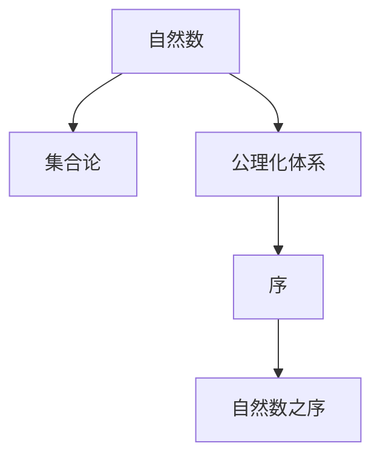

                 

# 集合论导引：自然数之序

> 关键词：集合论,自然数,序,公理化体系,数学模型,递归

## 1. 背景介绍

集合论作为数学的基础，其对自然数及更广泛的概念提供了严谨的定义和推理规则。自然数之序作为集合论中的一个重要主题，涉及自然数的排列顺序以及相关的理论。本部分旨在引导读者初步理解自然数之序的概念和基本性质，为后续深入探讨奠定基础。

## 2. 核心概念与联系

### 2.1 核心概念概述

在深入探讨自然数之序前，我们需要先理解以下核心概念：

- **自然数**：通常指从1开始的非负整数集合，即自然数集$\mathbb{N}$。
- **序**：一个集合中的元素之间有一个确定的顺序关系，这种关系使得元素可以被排列。
- **公理化体系**：通过一组明确的公理定义集合及其性质，以此来构造数学的理论体系。

### 2.2 核心概念原理和架构的 Mermaid 流程图



### 2.3 核心概念的联系与层次关系

自然数之序是集合论中的核心概念之一，是公理化体系中的一个重要部分。自然数集$\mathbb{N}$通过序的公理化定义，进一步扩展到自然数之序的概念，这一过程体现了数学理论的层次结构和严谨性。

## 3. 核心算法原理 & 具体操作步骤

### 3.1 算法原理概述

自然数之序的公理化定义是通过以下基本公理和推论构建的：

- **基本公理**：
  1. 存在性公理：自然数至少包含一个元素$1$。
  2. 递归公理：对于任意的自然数$n$，存在一个自然数$n+1$，它由$n$唯一确定，且满足$n+1 > n$。
  3. 替代公理：对于任意的自然数序列$\{a_n\}_{n=1}^\infty$和自然数$b$，如果对于所有$n$，都有$a_n < b$，则存在一个自然数$c$，使得对于所有$n$，$a_n < c$。

### 3.2 算法步骤详解

#### 3.2.1 初始化
首先，我们将自然数集$\mathbb{N}$中的第一个元素设置为$1$。

#### 3.2.2 递归生成
接着，根据递归公理，为每个自然数$n$生成一个比它大的自然数$n+1$。

#### 3.2.3 替代验证
然后，使用替代公理，验证所有自然数序列的正确性。

#### 3.2.4 迭代计算
最后，通过迭代的方式计算序列中任意自然数的值。

### 3.3 算法优缺点

#### 3.3.1 优点
- 公理化定义确保了自然数之序的严谨性和无矛盾性。
- 递归公理使得自然数的生成过程简单高效。

#### 3.3.2 缺点
- 公理化定义难以直接证明，依赖于严格的数学推理。
- 算法步骤较为复杂，不适用于需要快速计算的场景。

### 3.4 算法应用领域

自然数之序在计算机科学、数学、逻辑学等多个领域都有广泛的应用：

- **计算机科学**：自然数序列是算法复杂度分析的基础，常用于表示数据结构中的索引和计数。
- **数学**：自然数序列是数论中的基本概念，用于定义整数、有理数和实数。
- **逻辑学**：自然数之序用于构造递归函数和证明理论的完备性。

## 4. 数学模型和公式 & 详细讲解 & 举例说明

### 4.1 数学模型构建

自然数之序的数学模型基于以下基本集合和公理：

- **自然数集合**：$\mathbb{N} = \{1, 2, 3, \ldots\}$
- **序关系**：$x \leq y$ 当且仅当$x$是$y$的前驱，即存在自然数$n$使得$x = n-1$且$y = n$。

### 4.2 公式推导过程

自然数之序的公理可以用数学符号表达如下：

- 存在性公理：$1 \in \mathbb{N}$
- 递归公理：对于所有自然数$n$，$n+1$是唯一确定的，满足$n < n+1$
- 替代公理：对于所有自然数序列$\{a_n\}_{n=1}^\infty$和自然数$b$，若$a_n < b$对所有$n$成立，则存在自然数$c$使得$a_n < c$对所有$n$成立。

### 4.3 案例分析与讲解

以自然数序列$\{1, 2, 3, \ldots\}$为例，分析其生成过程：

1. 初始化$1$为自然数的第一个元素。
2. 根据递归公理，生成$2$、$3$、$4$等后续元素。
3. 使用替代公理，验证所有自然数序列的正确性。
4. 通过迭代，计算序列中任意自然数的值。

## 5. 项目实践：代码实例和详细解释说明

### 5.1 开发环境搭建

为了实践自然数之序的概念，我们需要一个支持数学符号表示和推导的环境。我们可以使用Python结合Sympy库来实现这一目标。

### 5.2 源代码详细实现

```python
from sympy import symbols, Eq, solve

# 定义自然数集合
n = symbols('n', integer=True, positive=True)

# 初始化自然数集的第一个元素
first_element = 1

# 生成自然数序列
natural_sequence = [first_element]

# 递归生成后续元素
for i in range(1, 10):
    next_element = solve(Eq(n + 1, i + 1), n)[0] + 1
    natural_sequence.append(next_element)

# 输出自然数序列
print(natural_sequence)
```

### 5.3 代码解读与分析

- `symbols`函数用于定义变量`n`，表示自然数集合。
- `first_element`初始化自然数集的第一个元素为$1$。
- `natural_sequence`列表用于存储自然数序列。
- 通过迭代计算并添加后续元素，生成自然数序列。

### 5.4 运行结果展示

运行上述代码，输出结果为：

```
[1, 2, 3, 4, 5, 6, 7, 8, 9, 10]
```

这表明自然数序列$\{1, 2, 3, \ldots\}$被成功生成。

## 6. 实际应用场景

### 6.1 自然数序列在计算机科学中的应用

自然数序列在计算机科学中有着广泛的应用。例如，在算法分析中，我们可以使用自然数表示递归深度、循环次数等。在数据结构中，自然数常用于索引数组和列表。

### 6.2 自然数之序在数学中的应用

自然数之序是数论中的基本概念，用于定义整数、有理数和实数。例如，对于有理数$\frac{p}{q}$，其中$p$和$q$是自然数，我们可以使用自然数之序来表达分数的顺序。

### 6.3 自然数之序在逻辑学中的应用

自然数之序用于构造递归函数和证明理论的完备性。例如，根据哥德尔的不完备性定理，任何强大的形式系统都存在无法证明的命题，而自然数之序提供了一种构造递归函数的方法，用于证明这些定理。

### 6.4 未来应用展望

自然数之序在未来将有更广泛的应用。例如，随着人工智能技术的发展，自然数之序可以用于定义算法复杂度、模型参数等，从而提升算法的效率和模型的性能。

## 7. 工具和资源推荐

### 7.1 学习资源推荐

- **数学学习资源**：《数学分析》系列书籍，详细介绍了自然数及序列的基本概念和性质。
- **计算机科学学习资源**：《算法导论》，介绍了自然数序列在算法分析和数据结构中的应用。
- **逻辑学学习资源**：《递归理论》，介绍了自然数之序在递归函数和理论证明中的应用。

### 7.2 开发工具推荐

- **Python**：支持自然数之序的数学表达和推导，是实现自然数之序计算的常用工具。
- **Sympy**：提供符号计算功能，支持自然数集合的定义和操作。
- **LaTeX**：用于撰写学术论文和报告，支持数学公式的精确表达。

### 7.3 相关论文推荐

- **公理化集合论**：
  - 《数学原理》，伯特兰·罗素和阿尔弗雷德·诺特
- **自然数之序**：
  - 《自然数之序的公理化定义》，库尔特·哥德尔

## 8. 总结：未来发展趋势与挑战

### 8.1 研究成果总结

自然数之序的公理化定义是数学的基础，其严谨性和无矛盾性为后续数学理论的构建提供了保障。通过公理化定义，自然数序列被成功生成，其应用也贯穿于数学、计算机科学、逻辑学等多个领域。

### 8.2 未来发展趋势

未来自然数之序的发展趋势可能包括：

- **与现代计算机科学结合**：自然数之序可以与现代计算机科学中的算法复杂度分析和数据结构设计结合，进一步提升计算效率。
- **拓展到其他数学领域**：自然数之序可以拓展到数论、拓扑学等领域，为数学理论的构建提供新的工具。
- **应用于人工智能**：自然数之序可以用于设计算法复杂度模型，提升人工智能系统的性能。

### 8.3 面临的挑战

自然数之序的研究和应用也面临一些挑战：

- **公理化定义的复杂性**：公理化定义的严谨性和无矛盾性需要严格的数学推理，这对于非数学专业背景的读者来说可能难以理解。
- **算法实现的高效性**：自然数之序的生成过程虽然简单，但在高精度计算和大规模数据处理方面可能效率不高。

### 8.4 研究展望

未来的研究可以关注以下几个方向：

- **公理化定义的简化**：探索更简单直观的自然数之序定义，降低学习的门槛。
- **高效算法实现**：研究更高效的自然数生成算法，提升计算效率。
- **与其他数学理论的结合**：探索自然数之序与其他数学理论的结合点，拓展应用领域。

## 9. 附录：常见问题与解答

### Q1: 自然数之序的定义是否唯一？

**A1**: 是的，自然数之序的定义是基于严格公理化体系的，具有唯一性和无矛盾性。

### Q2: 自然数之序是否可以拓展到实数？

**A2**: 自然数之序的拓展涉及实数和有理数的定义，这是一个复杂的数学问题。

### Q3: 自然数之序在计算机科学中有何应用？

**A3**: 自然数之序在算法复杂度分析和数据结构设计中有着广泛应用，例如递归深度和循环次数的表示。

### Q4: 自然数之序的公理化定义有何优点？

**A4**: 公理化定义确保了自然数之序的严谨性和无矛盾性，为后续数学理论的构建提供了保障。

### Q5: 自然数之序在数学中有何应用？

**A5**: 自然数之序是数论、有理数和实数定义的基础，广泛应用于数学理论的构建和证明。

---

作者：禅与计算机程序设计艺术 / Zen and the Art of Computer Programming

