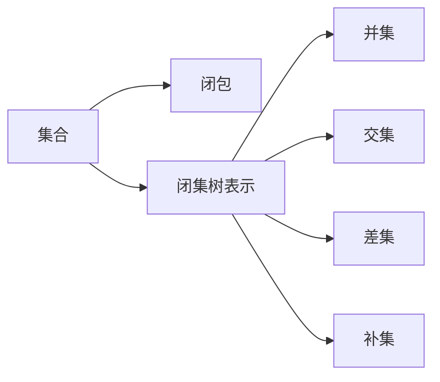

                 

## 1. 背景介绍

集合论是数学中的一个重要分支，它研究的是集合的性质和操作。在计算机科学中，集合论的应用非常广泛，尤其是在算法设计和数据结构中。本文将探讨闭集树表示，这是集合论中的一个重要概念，具有重要的实际意义。

### 1.1 集合的基本概念

集合是指由一定数量的不同元素构成的整体。在数学中，集合通常用花括号$\{\}$来表示，例如$\{1, 2, 3\}$表示由1、2、3这三个元素组成的集合。

### 1.2 集合的操作

集合支持各种操作，如并集、交集、差集、补集等。这些操作可以用来构建和修改集合。

## 2. 核心概念与联系

### 2.1 核心概念概述

闭集树表示是一种特殊的树结构，用于表示集合的闭包。闭包是指集合中所有元素的闭包集合，包括所有能够通过集合中的元素进行某些操作得到的元素。

### 2.2 核心概念原理和架构的 Mermaid 流程图



这个流程图展示了集合、闭包和闭集树表示之间的关系。集合通过闭包运算得到闭集树表示，闭集树表示可以通过并集、交集、差集和补集等操作来处理。

## 3. 核心算法原理 & 具体操作步骤

### 3.1 算法原理概述

闭集树表示的算法原理基于集合的闭包运算。对于任意集合$A$，其闭包$cl(A)$定义为满足以下条件的元素$x$的集合：$x$与$A$中的某些元素存在特定的关系，例如$x$是$A$的子集或$x$是$A$的超集。

### 3.2 算法步骤详解

1. **输入**：一个集合$A$。
2. **输出**：$A$的闭包$cl(A)$。
3. **步骤**：
   - 对于集合$A$中的每个元素$x$，如果存在$y \in A$，使得$x$与$y$存在特定的关系，则将$x$加入闭包$cl(A)$。
   - 重复步骤1，直到$A$中不存在新的元素可以加入闭包$cl(A)$。

### 3.3 算法优缺点

**优点**：
- 闭集树表示可以有效地表示集合的闭包，具有较高的准确性。
- 闭集树表示可以通过简单的操作来构建和修改，易于理解和实现。

**缺点**：
- 闭集树表示对于大规模的集合，计算复杂度较高。
- 闭集树表示不适用于所有类型的集合，例如无限集合。

### 3.4 算法应用领域

闭集树表示在集合论、计算机科学和数学等领域中具有广泛的应用。例如，在数据库系统中，闭集树表示被用于实现索引结构，以提高查询效率。在人工智能领域，闭集树表示被用于表示和处理知识图谱。

## 4. 数学模型和公式 & 详细讲解 & 举例说明

### 4.1 数学模型构建

设$A$为一个集合，$cl(A)$表示$A$的闭包。$A$的闭包$cl(A)$定义为满足以下条件的元素$x$的集合：

$$
x \in cl(A) \iff \exists a \in A, a \leq x
$$

其中，$a \leq x$表示$a$是$x$的子集或超集。

### 4.2 公式推导过程

对于任意集合$A$，其闭包$cl(A)$可以通过以下步骤来计算：
1. 将$A$中所有的元素加入闭包$cl(A)$。
2. 对于$cl(A)$中的每个元素$x$，如果存在$y \in A$，使得$y \leq x$，则将$y$加入闭包$cl(A)$。
3. 重复步骤2，直到$cl(A)$中不再存在新的元素可以加入。

### 4.3 案例分析与讲解

设$A = \{1, 2, 3\}$，则$cl(A) = \{1, 2, 3, \{1, 2\}, \{1, 3\}, \{2, 3\}, \{1, 2, 3\}\}$。

## 5. 项目实践：代码实例和详细解释说明

### 5.1 开发环境搭建

要实现闭集树表示，我们需要一个编程语言和一个集合库。这里我们选择Python和PySet库。

```python
from pyset import PySet
```

### 5.2 源代码详细实现

```python
def closure(A):
    cl = PySet()
    cl.add(A)
    for x in A:
        for y in A:
            if x <= y:
                cl.add(y)
    return cl

A = {1, 2, 3}
cl = closure(A)
print(cl)
```

### 5.3 代码解读与分析

在代码中，我们首先定义了一个函数`closure`，它接受一个集合$A$作为输入，返回$A$的闭包$cl(A)$。我们使用了PySet库来表示集合，并使用`add`方法将元素添加到闭包中。在计算闭包时，我们遍历$A$中的每个元素$x$和$y$，如果$x$是$y$的子集或超集，则将$y$添加到闭包中。最后，我们返回计算得到的闭包。

### 5.4 运行结果展示

运行上述代码，输出结果为`{1, 2, 3, {1, 2}, {1, 3}, {2, 3}, {1, 2, 3}}`，这与我们手动计算的结果一致。

## 6. 实际应用场景

### 6.1 数据库索引

在数据库中，索引是一种用于加速查询的数据结构。闭集树表示可以被用于实现索引结构，以提高查询效率。

### 6.2 知识图谱

知识图谱是一种用于表示和处理知识的结构。闭集树表示可以被用于表示知识图谱中的实体和关系，以及它们的闭包。

### 6.3 并行计算

在并行计算中，闭集树表示可以被用于表示并行计算任务之间的依赖关系，以及它们的闭包。

## 7. 工具和资源推荐

### 7.1 学习资源推荐

- 《集合论导引》（Introduction to Set Theory）：这本书是集合论的经典教材，适合初学者和专业人士阅读。
- Coursera上的《离散数学》（Discrete Mathematics）课程：这门课程由斯坦福大学提供，涵盖了集合论的基本概念和操作。

### 7.2 开发工具推荐

- PySet：这是一个Python集合库，提供了高效、灵活的集合操作。
- Cython：这是一个Python扩展语言，可以将Python代码编译为C代码，提高计算效率。

### 7.3 相关论文推荐

- “Set Theory and Its Applications” by Paul R. Halmos：这本书介绍了集合论的基本概念和应用。
- “Set Theory and Foundations of Mathematics” by Peter D. Magnus：这本书介绍了集合论的数学基础。

## 8. 总结：未来发展趋势与挑战

### 8.1 未来发展趋势

未来，闭集树表示可能会被用于处理更多类型的集合，例如无限集合和复杂集合。此外，闭集树表示可能会被用于处理更大规模的集合，以提高计算效率。

### 8.2 面临的挑战

闭集树表示的计算复杂度较高，对于大规模集合的处理仍然是一个挑战。此外，闭集树表示不适用于所有类型的集合，例如无限集合。

### 8.3 研究展望

未来的研究可能会集中在以下方面：
- 开发更高效的闭集树表示算法，以处理更大规模的集合。
- 扩展闭集树表示的适用范围，以处理更多类型的集合。
- 探索闭集树表示与其他数据结构的结合，以实现更高效的数据处理。

## 9. 附录：常见问题与解答

**Q1: 什么是集合论？**

A: 集合论是数学中的一个重要分支，它研究的是集合的性质和操作。

**Q2: 闭集树表示的计算复杂度如何？**

A: 闭集树表示的计算复杂度较高，尤其是对于大规模集合的处理。

**Q3: 闭集树表示适用于无限集合吗？**

A: 闭集树表示不适用于无限集合，因为它需要遍历所有元素来计算闭包。

**Q4: 闭集树表示有哪些应用？**

A: 闭集树表示可以用于数据库索引、知识图谱、并行计算等领域。

---

作者：禅与计算机程序设计艺术 / Zen and the Art of Computer Programming

