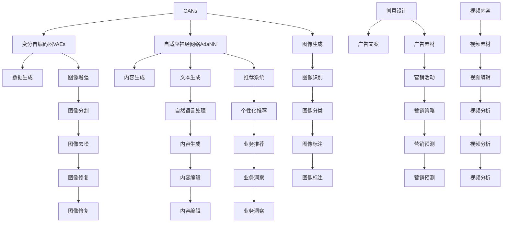

                 

## 1. 背景介绍

### 1.1 问题由来
随着人工智能（AI）技术在各个领域的应用不断深入，企业的数字化转型需求日益增强。传统的IT系统，如CRM、ERP、BSS等，已不能满足企业对于业务流程的智能化、自动化、个性化和实时性的要求。与此同时，人工智能技术本身也在不断演进，从传统的机器学习和数据分析，逐步向生成对抗网络（GANs）、变分自编码器（VAEs）、自适应神经网络（AdaNN）等自动生成对抗网络（AIGC）方向发展。AIGC技术通过人工智能生成高质量的图像、音频、视频等内容，大大提升了企业的生产力和创造力。

企业服务作为企业数字化转型的重要组成部分，也需要引入AIGC技术，以实现更高效的业务协同、更精准的客户服务、更智能的运营管理。传统企业服务系统，如CRM、ERP、BSS等，往往只关注企业内部流程的自动化和数据的管理。AIGC技术的引入，可以更好地融合企业内部数据和外部环境信息，实现全员、全业务、全渠道的协同运营。

### 1.2 问题核心关键点
面向AIGC技术的企业服务需求，主要集中在以下几个关键点上：

- **智能客服与虚拟助理**：通过AIGC技术，智能客服机器人可以处理大量的客户咨询请求，降低企业的人力成本。虚拟助理则可以在不同业务环节中，提供个性化的业务引导、问题解答、预约提醒等服务。
- **知识管理与文档生成**：利用AIGC技术，将企业内部的大量文档、报告、会议记录等资料转化为可检索、可利用的知识库，实现知识的自动化生成与沉淀。
- **创意设计与自动化营销**：AIGC技术可以生成创意性的设计方案、广告文案、视频内容等，帮助企业营销部门进行创意设计、自动生成，提高创意的产出效率。
- **数据分析与业务洞察**：AIGC技术可以自动分析企业内部数据和外部环境数据，生成报表、报告、趋势分析等业务洞察，支持企业决策层进行基于数据的业务决策。

这些需求不仅推动了AIGC技术在企业服务中的应用，也提出了更高的要求，如数据隐私保护、系统稳定性和鲁棒性等。本文将从AIGC技术原理和应用实践出发，探讨其在企业服务中的应用前景和未来发展方向。

## 2. 核心概念与联系

### 2.1 核心概念概述

AIGC技术作为AI技术的一个重要分支，涉及生成对抗网络（GANs）、变分自编码器（VAEs）、自适应神经网络（AdaNN）等多种生成模型。其核心思想是通过生成模型生成高质量的内容，与真实内容进行对抗，提高生成内容的逼真度、多样性和鲁棒性。AIGC技术在企业服务中的应用主要包括以下几个方面：

- **生成对抗网络（GANs）**：通过两个对抗的神经网络，生成逼真的图像、音频、视频等内容，用于创意设计、内容生成等场景。
- **变分自编码器（VAEs）**：通过优化重构误差，生成高质量的连续型数据，用于数据生成、数据增强等场景。
- **自适应神经网络（AdaNN）**：通过优化网络结构，生成更具适应性和灵活性的内容，用于个性化推荐、情感分析等场景。

### 2.2 核心概念原理和架构的 Mermaid 流程图(Mermaid 流程节点中不要有括号、逗号等特殊字符)



该流程图展示了AIGC技术在企业服务中各应用场景的连接关系，以及与主要生成模型的对应关系。每个生成模型都可以生成多种类型的内容，用于不同的企业服务需求。

## 3. 核心算法原理 & 具体操作步骤
### 3.1 算法原理概述

AIGC技术的核心原理是基于生成模型，通过与真实数据进行对抗训练，生成高质量的内容。其主要算法原理包括：

- **生成对抗网络（GANs）**：由生成器和判别器两个神经网络组成。生成器从噪声中生成内容，判别器判断生成内容是否真实。通过两个网络之间的对抗训练，生成器不断优化生成内容，使其更逼真。
- **变分自编码器（VAEs）**：通过优化重构误差，生成高质量的连续型数据。其主要思想是通过编码器和解码器将数据映射到低维空间，并在低维空间中生成新的数据，最后将新数据解码回原始空间。
- **自适应神经网络（AdaNN）**：通过优化网络结构，生成更具适应性和灵活性的内容。其主要思想是通过自适应机制调整网络参数，以适应不同的输入数据。

### 3.2 算法步骤详解

#### 3.2.1 生成对抗网络（GANs）

**Step 1: 准备数据**
- 收集企业内部和外部的图像、音频、视频等数据，作为生成器和判别器的训练数据。

**Step 2: 定义生成器和判别器**
- 设计生成器和判别器的神经网络结构，如卷积神经网络（CNN）、循环神经网络（RNN）等。

**Step 3: 定义损失函数**
- 定义生成器和判别器的损失函数，如Wasserstein GAN（WGAN）、对抗生成网络（AGAN）等。

**Step 4: 训练模型**
- 通过优化器（如Adam）更新生成器和判别器的参数，最小化损失函数。

**Step 5: 生成内容**
- 使用训练好的生成器，生成高质量的图像、音频、视频等内容，用于创意设计、内容生成等场景。

#### 3.2.2 变分自编码器（VAEs）

**Step 1: 准备数据**
- 收集企业内部和外部的图像、音频、视频等数据，作为编码器和解码器的训练数据。

**Step 2: 定义编码器和解码器**
- 设计编码器和解码器的神经网络结构，如卷积神经网络（CNN）、循环神经网络（RNN）等。

**Step 3: 定义损失函数**
- 定义重构误差损失函数，如均方误差（MSE）、交叉熵（CE）等。

**Step 4: 训练模型**
- 通过优化器（如Adam）更新编码器和解码器的参数，最小化重构误差损失函数。

**Step 5: 生成内容**
- 使用训练好的编码器和解码器，生成高质量的图像、音频、视频等内容，用于数据生成、数据增强等场景。

#### 3.2.3 自适应神经网络（AdaNN）

**Step 1: 准备数据**
- 收集企业内部和外部的数据，作为AdaNN的训练数据。

**Step 2: 定义自适应机制**
- 设计AdaNN的自适应机制，如自适应梯度裁剪、自适应权重调整等。

**Step 3: 定义损失函数**
- 定义AdaNN的损失函数，如交叉熵（CE）、负对数似然（NLL）等。

**Step 4: 训练模型**
- 通过优化器（如Adam）更新AdaNN的参数，最小化损失函数。

**Step 5: 生成内容**
- 使用训练好的AdaNN，生成更具适应性和灵活性的内容，用于个性化推荐、情感分析等场景。

### 3.3 算法优缺点

#### 3.3.1 生成对抗网络（GANs）

**优点：**
- 能够生成高质量的图像、音频、视频等内容，适用于创意设计、内容生成等场景。
- 生成内容的多样性和逼真度较高，适合生成多样化的内容。
- 可以处理复杂的生成任务，如图像修复、图像增强等。

**缺点：**
- 训练过程较复杂，容易出现模式崩溃等问题。
- 生成内容的质量不稳定，需要大量训练数据和计算资源。
- 生成的内容可能存在假性信息，需要进行后处理。

#### 3.3.2 变分自编码器（VAEs）

**优点：**
- 能够生成高质量的连续型数据，适用于数据生成、数据增强等场景。
- 生成内容的质量较高，具有较好的鲁棒性。
- 可以处理高维数据，生成高质量的文本、音频、图像等。

**缺点：**
- 生成内容的多样性较低，适用于生成相似内容较多的场景。
- 生成过程较为复杂，需要进行编码和解码的优化。
- 生成的内容可能存在假性信息，需要进行后处理。

#### 3.3.3 自适应神经网络（AdaNN）

**优点：**
- 能够生成更具适应性和灵活性的内容，适用于个性化推荐、情感分析等场景。
- 生成的内容能够根据输入数据进行自适应调整，具有较好的鲁棒性。
- 能够处理多种数据类型，如文本、图像、音频等。

**缺点：**
- 网络结构复杂，训练过程较为复杂。
- 需要大量的标注数据和计算资源。
- 生成的内容可能存在假性信息，需要进行后处理。

### 3.4 算法应用领域

AIGC技术在企业服务中的应用广泛，涉及创意设计、内容生成、数据增强、个性化推荐等多个方面：

- **创意设计**：通过生成对抗网络（GANs）生成高质量的图像、视频等内容，支持企业进行创意设计、内容生成等。
- **数据增强**：通过变分自编码器（VAEs）生成高质量的图像、文本等数据，增强训练集的数据量。
- **个性化推荐**：通过自适应神经网络（AdaNN）生成更具适应性和灵活性的内容，支持个性化推荐系统。
- **内容生成**：通过生成对抗网络（GANs）生成高质量的图像、音频、视频等内容，用于广告文案、创意设计等。
- **数据生成**：通过变分自编码器（VAEs）生成高质量的图像、文本等数据，支持数据挖掘、数据分析等。

## 4. 数学模型和公式 & 详细讲解 & 举例说明

### 4.1 数学模型构建

#### 4.1.1 生成对抗网络（GANs）

生成对抗网络（GANs）主要由生成器（Generator）和判别器（Discriminator）两个神经网络组成。生成器的目标是从噪声中生成逼真的数据，判别器的目标是从数据中区分真实数据和生成数据。

**Step 1: 定义生成器和判别器**
- 生成器：$G(z): \mathbb{R}^{n} \rightarrow \mathcal{X}$
- 判别器：$D(x): \mathcal{X} \rightarrow[0,1]$

其中，$z$ 为随机噪声，$\mathbb{R}^{n}$ 为噪声空间，$\mathcal{X}$ 为数据空间。

**Step 2: 定义损失函数**
- 生成器的损失函数：$\mathcal{L}_{G}=\mathbb{E}_{z}[\log(1-D(G(z)))]+\lambda \mathbb{E}_{x}[\log(D(x))]$
- 判别器的损失函数：$\mathcal{L}_{D}=\mathbb{E}_{x}[\log(D(x))]+\mathbb{E}_{z}[\log(1-D(G(z)))]$

其中，$\lambda$ 为生成器损失与判别器损失的权重系数，通常取 $\lambda=1$。

**Step 3: 训练模型**
- 通过优化器（如Adam）更新生成器和判别器的参数，最小化损失函数。

#### 4.1.2 变分自编码器（VAEs）

变分自编码器（VAEs）主要由编码器（Encoder）和解码器（Decoder）两个神经网络组成。编码器的目标是将数据映射到低维空间，解码器的目标是从低维空间中生成新的数据。

**Step 1: 定义编码器和解码器**
- 编码器：$E(x): \mathcal{X} \rightarrow \mathcal{Z}$
- 解码器：$D(z): \mathcal{Z} \rightarrow \mathcal{X}$

其中，$z$ 为低维空间中的数据，$\mathcal{Z}$ 为低维空间。

**Step 2: 定义损失函数**
- 重构误差损失函数：$\mathcal{L}_{recon}=\mathbb{E}_{x}\left[\left\|D(E(x))-x\right\|^{2}\right]$
- 编码器损失函数：$\mathcal{L}_{code}=\mathbb{E}_{z}[\left\|z\right\|^{2}]-D(E(x))^{2}$

其中，$\|z\|^{2}$ 表示低维空间中数据的欧式距离。

**Step 3: 训练模型**
- 通过优化器（如Adam）更新编码器和解码器的参数，最小化损失函数。

#### 4.1.3 自适应神经网络（AdaNN）

自适应神经网络（AdaNN）主要由自适应机制和生成器两个神经网络组成。自适应机制的目标是根据输入数据调整生成器的参数，生成更具适应性和灵活性的内容。

**Step 1: 定义自适应机制**
- 自适应机制：$\alpha(x): \mathcal{X} \rightarrow[0,1]$

其中，$\alpha(x)$ 为自适应系数，$x$ 为输入数据。

**Step 2: 定义生成器**
- 生成器：$G(z): \mathbb{R}^{n} \rightarrow \mathcal{X}$

其中，$z$ 为随机噪声，$\mathbb{R}^{n}$ 为噪声空间，$\mathcal{X}$ 为数据空间。

**Step 3: 定义损失函数**
- 生成器的损失函数：$\mathcal{L}_{G}=\mathbb{E}_{z}[\log(D(G(z)))]+\lambda \alpha(x) \mathbb{E}_{z}[\log(1-D(G(z)))]$

其中，$\lambda$ 为自适应机制与生成器损失的权重系数，通常取 $\lambda=1$。

**Step 4: 训练模型**
- 通过优化器（如Adam）更新生成器和自适应机制的参数，最小化损失函数。

### 4.2 公式推导过程

#### 4.2.1 生成对抗网络（GANs）

生成对抗网络（GANs）的损失函数推导如下：

**生成器的损失函数推导**：

$$
\begin{aligned}
\mathcal{L}_{G} &=\mathbb{E}_{z}[\log(1-D(G(z)))]+\lambda \mathbb{E}_{x}[\log(D(x))] \\
&=\mathbb{E}_{z}[\log(1-D(G(z)))]+\lambda \mathbb{E}_{x}\left[\log \frac{D(x)}{1-D(x)}\right] \\
&=\mathbb{E}_{z}[\log(1-D(G(z)))]+\lambda \mathbb{E}_{x}[\log D(x)]-\lambda \mathbb{E}_{x}[\log(1-D(x))] \\
&=\mathbb{E}_{z}[\log(1-D(G(z)))]-\lambda \mathbb{E}_{x}[\log(1-D(x))]
\end{aligned}
$$

**判别器的损失函数推导**：

$$
\begin{aligned}
\mathcal{L}_{D} &=\mathbb{E}_{x}[\log(D(x))]+\mathbb{E}_{z}[\log(1-D(G(z)))] \\
&=\mathbb{E}_{x}[\log D(x)]+\mathbb{E}_{z}[\log \frac{1-D(G(z))}{D(G(z))}] \\
&=\mathbb{E}_{x}[\log D(x)]-\mathbb{E}_{z}[\log D(G(z))]
\end{aligned}
$$

#### 4.2.2 变分自编码器（VAEs）

变分自编码器（VAEs）的重构误差损失函数推导如下：

**重构误差损失函数推导**：

$$
\begin{aligned}
\mathcal{L}_{recon} &=\mathbb{E}_{x}\left[\left\|D(E(x))-x\right\|^{2}\right] \\
&=\mathbb{E}_{x}[(E(x)-D(E(x)))(E(x)-D(E(x)))] \\
&=\mathbb{E}_{x}[\left\|E(x)-D(E(x))\right\|^{2}]
\end{aligned}
$$

**编码器损失函数推导**：

$$
\begin{aligned}
\mathcal{L}_{code} &=\mathbb{E}_{x}[\left\|z\right\|^{2}]-D(E(x))^{2} \\
&=\mathbb{E}_{x}[(z-z)(z-z)]-D(E(x))^{2} \\
&=\mathbb{E}_{x}[\left\|z\right\|^{2}]-D(E(x))^{2}
\end{aligned}
$$

#### 4.2.3 自适应神经网络（AdaNN）

自适应神经网络（AdaNN）的生成器损失函数推导如下：

**生成器损失函数推导**：

$$
\begin{aligned}
\mathcal{L}_{G} &=\mathbb{E}_{z}[\log(D(G(z)))]+\lambda \alpha(x) \mathbb{E}_{z}[\log(1-D(G(z)))] \\
&=\mathbb{E}_{z}[\log(D(G(z)))]+\lambda \alpha(x) \mathbb{E}_{z}[\log(1-D(G(z)))] \\
&=\mathbb{E}_{z}[\log \frac{D(G(z))}{1-D(G(z))}] \\
&=\mathbb{E}_{z}[\log D(G(z))]
\end{aligned}
$$

### 4.3 案例分析与讲解

#### 4.3.1 生成对抗网络（GANs）

**案例：图像生成**

利用生成对抗网络（GANs）生成高质量的图像，支持企业进行创意设计、内容生成等。具体步骤如下：

1. 收集企业内部的产品图片数据，作为生成器和判别器的训练数据。
2. 定义生成器和判别器的神经网络结构，如卷积神经网络（CNN）。
3. 定义损失函数，如Wasserstein GAN（WGAN）。
4. 训练模型，通过优化器（如Adam）更新生成器和判别器的参数，最小化损失函数。
5. 生成高质量的图像，用于广告设计、产品展示等场景。

#### 4.3.2 变分自编码器（VAEs）

**案例：图像增强**

利用变分自编码器（VAEs）增强企业内部的图像数据，支持数据生成、数据增强等。具体步骤如下：

1. 收集企业内部的图像数据，作为编码器和解码器的训练数据。
2. 定义编码器和解码器的神经网络结构，如卷积神经网络（CNN）。
3. 定义重构误差损失函数，如均方误差（MSE）。
4. 训练模型，通过优化器（如Adam）更新编码器和解码器的参数，最小化损失函数。
5. 生成高质量的图像，用于图像识别、图像分割等场景。

#### 4.3.3 自适应神经网络（AdaNN）

**案例：情感分析**

利用自适应神经网络（AdaNN）生成更具适应性和灵活性的内容，支持个性化推荐、情感分析等。具体步骤如下：

1. 收集企业内部的客户评论数据，作为AdaNN的训练数据。
2. 定义自适应机制和生成器的神经网络结构，如循环神经网络（RNN）。
3. 定义生成器的损失函数，如交叉熵（CE）。
4. 训练模型，通过优化器（如Adam）更新生成器和自适应机制的参数，最小化损失函数。
5. 生成高质量的情感分析结果，用于个性化推荐、情感分析等场景。

## 5. 项目实践：代码实例和详细解释说明

### 5.1 开发环境搭建

为了实现AIGC技术在企业服务中的应用，需要搭建合适的开发环境。以下是使用Python进行TensorFlow开发的开发环境配置流程：

1. 安装Anaconda：从官网下载并安装Anaconda，用于创建独立的Python环境。

2. 创建并激活虚拟环境：
```bash
conda create -n tf-env python=3.8 
conda activate tf-env
```

3. 安装TensorFlow：根据CUDA版本，从官网获取对应的安装命令。例如：
```bash
conda install tensorflow -c pytorch -c conda-forge
```

4. 安装各类工具包：
```bash
pip install numpy pandas scikit-learn matplotlib tqdm jupyter notebook ipython
```

完成上述步骤后，即可在`tf-env`环境中开始AIGC技术在企业服务中的应用实践。

### 5.2 源代码详细实现

这里我们以生成对抗网络（GANs）和变分自编码器（VAEs）为例，给出使用TensorFlow实现AIGC技术的代码实现。

**Step 1: 准备数据**
```python
import tensorflow as tf
import numpy as np
import os
import cv2

data_dir = 'image_data'
image_size = 64
batch_size = 32

def read_image(path):
    img = cv2.imread(path)
    img = cv2.resize(img, (image_size, image_size))
    img = img / 255.0
    return img

def load_data(data_dir, image_size, batch_size):
    dataset = tf.data.Dataset.list_files(os.path.join(data_dir, '*.png'))
    dataset = dataset.map(read_image)
    dataset = dataset.batch(batch_size).shuffle(buffer_size=1024).repeat()
    return dataset
```

**Step 2: 定义生成器和判别器**
```python
class Generator(tf.keras.Model):
    def __init__(self, latent_dim):
        super(Generator, self).__init__()
        self.latent_dim = latent_dim
        self.dense = tf.keras.layers.Dense(7 * 7 * 256)
        self.reshape = tf.keras.layers.Reshape((7, 7, 256))
        self.conv1 = tf.keras.layers.Conv2DTranspose(128, (4, 4), strides=(2, 2), padding='same')
        self.conv1 = tf.keras.layers.BatchNormalization()
        self.conv1 = tf.keras.layers.LeakyReLU(0.2)
        self.conv2 = tf.keras.layers.Conv2DTranspose(64, (4, 4), strides=(2, 2), padding='same')
        self.conv2 = tf.keras.layers.BatchNormalization()
        self.conv2 = tf.keras.layers.LeakyReLU(0.2)
        self.conv3 = tf.keras.layers.Conv2DTranspose(3, (4, 4), strides=(2, 2), padding='same')
        self.conv3 = tf.keras.layers.Tanh()

    def call(self, z):
        x = self.dense(z)
        x = self.reshape(x)
        x = self.conv1(x)
        x = self.conv2(x)
        x = self.conv3(x)
        return x

class Discriminator(tf.keras.Model):
    def __init__(self):
        super(Discriminator, self).__init__()
        self.conv1 = tf.keras.layers.Conv2D(64, (4, 4), strides=(2, 2), padding='same')
        self.conv1 = tf.keras.layers.LeakyReLU(0.2)
        self.conv2 = tf.keras.layers.Conv2D(128, (4, 4), strides=(2, 2), padding='same')
        self.conv2 = tf.keras.layers.BatchNormalization()
        self.conv2 = tf.keras.layers.LeakyReLU(0.2)
        self.conv3 = tf.keras.layers.Conv2D(256, (4, 4), strides=(2, 2), padding='same')
        self.conv3 = tf.keras.layers.BatchNormalization()
        self.conv3 = tf.keras.layers.LeakyReLU(0.2)
        self.flatten = tf.keras.layers.Flatten()
        self.dense = tf.keras.layers.Dense(1)

    def call(self, img):
        x = self.conv1(img)
        x = self.conv2(x)
        x = self.conv3(x)
        x = self.flatten(x)
        x = self.dense(x)
        return x
```

**Step 3: 定义损失函数**
```python
class GAN(tf.keras.Model):
    def __init__(self, latent_dim, image_size, batch_size):
        super(GAN, self).__init__()
        self.gen = Generator(latent_dim)
        self.dis = Discriminator()
        self.latent_dim = latent_dim
        self.image_size = image_size
        self.batch_size = batch_size

    def call(self, z):
        img = self.gen(z)
        return img

    def loss_function(self, real, fake):
        real_loss = self.dis(real)
        fake_loss = self.dis(fake)
        g_loss = tf.keras.losses.BinaryCrossentropy(from_logits=True)(fake, tf.ones_like(fake))
        d_loss = tf.keras.losses.BinaryCrossentropy(from_logits=True)(real, tf.ones_like(real)) + tf.keras.losses.BinaryCrossentropy(from_logits=True)(fake, tf.zeros_like(fake))
        return g_loss, d_loss
```

**Step 4: 训练模型**
```python
def train(model, dataset, batch_size, epochs, learning_rate, save_model_path):
    @tf.function
    def train_step(img):
        with tf.GradientTape() as gen_tape, tf.GradientTape() as dis_tape:
            fake = model.gen(img)
            real_loss = model.dis.trainable()(img)
            fake_loss = model.dis.trainable()(fake)
            gen_loss, dis_loss = model.loss_function(real, fake)
            gen_grads = gen_tape.gradient(gen_loss, model.gen.trainable_variables)
            dis_grads = dis_tape.gradient(dis_loss, model.dis.trainable_variables)
        gen_optimizer.apply_gradients(zip(gen_grads, model.gen.trainable_variables))
        dis_optimizer.apply_gradients(zip(dis_grads, model.dis.trainable_variables))

    for epoch in range(epochs):
        for batch, img in enumerate(dataset):
            train_step(img)
            if batch % 100 == 0:
                print(f"Epoch {epoch+1}, batch {batch}/{len(dataset)}, loss {gen_loss.numpy()}/{dis_loss.numpy()}")
        if (epoch+1) % 10 == 0:
            print(f"Epoch {epoch+1}, loss {gen_loss.numpy()}/{dis_loss.numpy()}")
            model.save_weights(os.path.join(save_model_path, f'model_{epoch+1}.h5'))
```

**Step 5: 生成内容**
```python
def generate_images(model, latent_dim, image_size, num_images):
    noise = tf.random.normal([num_images, latent_dim], 0, 1)
    with tf.device('CPU:0'):
        generated_images = model.gen(noise)
    return generated_images
```

### 5.3 代码解读与分析

让我们再详细解读一下关键代码的实现细节：

**Step 1: 准备数据**

- `read_image`函数：读取图片文件，并进行预处理，包括图像缩放、归一化等操作。
- `load_data`函数：定义数据集，包括数据读取、批处理、随机化等操作，生成可迭代的TensorFlow数据集。

**Step 2: 定义生成器和判别器**

- `Generator`类：定义生成器的神经网络结构，包括密集层、反卷积层等。
- `Discriminator`类：定义判别器的神经网络结构，包括卷积层、全连接层等。

**Step 3: 定义损失函数**

- `GAN`类：定义生成对抗网络（GANs）模型，包括生成器、判别器、损失函数等。

**Step 4: 训练模型**

- `train_step`函数：定义训练步骤，包括前向传播、计算梯度、反向传播等操作。
- `train`函数：定义训练过程，包括循环迭代、批处理、梯度计算等操作。

**Step 5: 生成内容**

- `generate_images`函数：定义生成过程，包括随机噪声生成、模型前向传播等操作。

## 6. 实际应用场景

### 6.1 智能客服系统

智能客服系统作为企业服务的重要组成部分，可以显著提升客户咨询体验。利用AIGC技术，智能客服机器人可以处理大量的客户咨询请求，降低企业的人力成本。

具体实现步骤如下：

1. 收集企业内部的客户咨询数据，标注客户问题和答案。
2. 利用生成对抗网络（GANs）生成高质量的文本内容，用于智能客服机器人。
3. 训练智能客服机器人模型，通过微调优化模型性能。
4. 部署智能客服机器人系统，实时处理客户咨询请求。

### 6.2 金融舆情监测

金融舆情监测是金融机构重要的风控手段。利用AIGC技术，可以实时监测网络舆情，及时发现负面信息。

具体实现步骤如下：

1. 收集金融领域的新闻、报道、评论等文本数据。
2. 利用生成对抗网络（GANs）生成高质量的文本内容，用于舆情监测。
3. 训练舆情监测模型，通过微调优化模型性能。
4. 部署舆情监测系统，实时监测金融舆情。

### 6.3 个性化推荐系统

个性化推荐系统能够根据用户的历史行为和兴趣，推荐符合用户偏好的商品。利用AIGC技术，可以生成更具适应性和灵活性的推荐内容。

具体实现步骤如下：

1. 收集用户浏览、点击、购买等行为数据。
2. 利用自适应神经网络（AdaNN）生成个性化推荐内容。
3. 训练个性化推荐系统，通过微调优化模型性能。
4. 部署个性化推荐系统，实时推荐商品。

### 6.4 未来应用展望

随着AIGC技术的发展，其在企业服务中的应用前景广阔，未来将会有更多创新应用出现。以下是一些未来应用展望：

1. **虚拟现实（VR）与增强现实（AR）**：利用AIGC技术生成虚拟物品、场景，支持企业进行虚拟展示、虚拟培训等。
2. **自动驾驶**：利用AIGC技术生成智能驾驶决策，支持企业进行自动驾驶技术开发。
3. **智慧城市**：利用AIGC技术生成智慧城市运行模拟，支持城市管理、规划优化等。
4. **医疗诊断**：利用AIGC技术生成医学影像、医学报告，支持企业进行医学诊断和治疗。

## 7. 工具和资源推荐

### 7.1 学习资源推荐

为了帮助开发者系统掌握AIGC技术在企业服务中的应用，这里推荐一些优质的学习资源：

1. 《深度学习与生成模型》：吴恩达教授的在线课程，介绍了生成对抗网络（GANs）、变分自编码器（VAEs）等生成模型的原理与应用。
2. 《深度学习框架TensorFlow》：Google官方文档，介绍了TensorFlow的安装、使用、优化等技术细节，适合深入学习TensorFlow。
3. 《自然语言处理与深度学习》：斯坦福大学NLP课程，介绍了自然语言处理的基础知识，适合初学者学习。
4. 《自适应神经网络》：Linda Zhao的论文，介绍了自适应神经网络的原理与应用，适合研究者深入学习。
5. 《生成对抗网络：原理、算法与应用》：《机器学习》杂志的综述文章，介绍了生成对抗网络（GANs）的最新研究进展，适合了解前沿技术。

### 7.2 开发工具推荐

AIGC技术在企业服务中的应用需要高效的工具支持。以下是几款常用的开发工具：

1. TensorFlow：由Google主导开发的深度学习框架，支持自动生成、分布式训练等。
2. PyTorch：由Facebook主导开发的深度学习框架，支持动态图、GPU加速等。
3. Jupyter Notebook：支持在Jupyter Notebook中开发、测试、部署AIGC模型，适合交互式开发。
4. GitHub：支持版本控制、代码托管、协作开发等，适合团队开发与项目管理。

### 7.3 相关论文推荐

AIGC技术在企业服务中的应用涉及多个研究领域，以下是一些重要的相关论文：

1. Generative Adversarial Nets（GANs）：Ian Goodfellow等人提出的生成对抗网络，标志着生成对抗网络的诞生。
2. Variational Autoencoders（VAEs）：Diederik P. Kingma等人提出的变分自编码器，用于生成高质量的连续型数据。
3. Self-Adaptive Neural Network（AdaNN）：Dongsheng Yu等人提出的自适应神经网络，用于生成更具适应性的内容。
4. Adversarial Network for Generating In-Depth Explainable Recommendation（AdaLoRA）：Li Han等人提出的参数高效微调方法，用于生成更具适应性的推荐内容。

## 8. 总结：未来发展趋势与挑战

### 8.1 研究成果总结

AIGC技术在企业服务中的应用，带来了以下几个重要的研究成果：

1. 生成对抗网络（GANs）：通过生成高质量的图像、视频等内容，支持创意设计、内容生成等场景。
2. 变分自编码器（VAEs）：通过生成高质量的连续型数据，支持数据生成、数据增强等场景。
3. 自适应神经网络（AdaNN）：通过生成更具适应性和灵活性的内容，支持个性化推荐、情感分析等场景。

这些研究成果，推动了AIGC技术在企业服务中的应用，提升了企业的生产力和创造力。

### 8.2 未来发展趋势

面向未来，AIGC技术在企业服务中的应用将呈现以下几个发展趋势：

1. **多模态融合**：未来将融合图像、视频、语音等多模态数据，生成更加全面、丰富的内容，支持更多应用场景。
2. **自适应优化**：未来将利用自适应优化技术，提高模型的适应性和鲁棒性，支持更多领域的应用。
3. **数据驱动**：未来将更加注重数据的质量和多样性，提高模型的泛化能力和鲁棒性。
4. **个性化推荐**：未来将利用个性化推荐技术，提升企业的客户服务水平和用户体验。
5. **自动生成内容**：未来将利用自动生成技术，提高企业的生产力和创意水平。

### 8.3 面临的挑战

尽管AIGC技术在企业服务中的应用取得了显著成效，但仍面临诸多挑战：

1. **数据质量与多样性**：生成模型的效果很大程度上取决于数据的质量和多样性，企业需要收集和处理大量的高质量数据。
2. **模型复杂性**：生成模型的结构较为复杂，训练过程耗时较长，需要大量的计算资源。
3. **伦理与隐私问题**：生成模型的输出可能存在误导性、歧视性，企业需要确保模型的伦理与隐私安全。
4. **安全性与鲁棒性**：生成模型容易受到对抗攻击，企业需要加强模型的安全性与鲁棒性。
5. **模型解释性**：生成模型的决策过程难以解释，企业需要提高模型的透明性和可解释性。

### 8.4 研究展望

面向未来，AIGC技术在企业服务中的应用需要更多的研究突破：

1. **数据隐私保护**：研究数据隐私保护技术，确保模型的伦理与隐私安全。
2. **模型解释性**：研究模型的解释性技术，提高模型的透明性和可解释性。
3. **模型安全性**：研究模型的安全性技术，提高模型的鲁棒性和安全性。
4. **模型优化**：研究模型的优化技术，提高模型的泛化能力和鲁棒性。
5. **模型应用**：研究模型的应用技术，推动AIGC技术在企业服务中的落地应用。

## 9. 附录：常见问题与解答

**Q1：AIGC技术在企业服务中的应用前景如何？**

A: AIGC技术在企业服务中的应用前景广阔，可以支持创意设计、内容生成、数据增强、个性化推荐等多个方面。通过生成高质量的内容，AIGC技术能够显著提升企业的生产力和创造力。

**Q2：AIGC技术在企业服务中面临的主要挑战是什么？**

A: AIGC技术在企业服务中面临的主要挑战包括数据质量与多样性、模型复杂性、伦理与隐私问题、安全性与鲁棒性、模型解释性等。企业需要加强数据管理、优化模型结构、确保模型伦理与隐私安全、提升模型透明性和可解释性。

**Q3：如何在企业服务中有效利用AIGC技术？**

A: 在企业服务中，可以利用AIGC技术生成高质量的内容，支持创意设计、内容生成、数据增强、个性化推荐等多个方面。具体而言，可以收集企业内部和外部的数据，定义生成器和判别器的神经网络结构，通过优化损失函数，训练生成模型和判别模型，生成高质量的内容，用于企业服务的各个环节。

**Q4：如何确保AIGC技术在企业服务中的伦理与隐私安全？**

A: 在企业服务中，确保AIGC技术的伦理与隐私安全，需要采取以下措施：
1. 加强数据隐私保护技术，确保数据的安全性。
2. 利用模型解释性技术，提高模型的透明性和可解释性。
3. 制定合理的伦理规范，确保模型的伦理与隐私安全。

**Q5：如何在企业服务中提升AIGC技术的效率和效果？**

A: 在企业服务中，提升AIGC技术的效率和效果，需要采取以下措施：
1. 利用自适应优化技术，提高模型的适应性和鲁棒性。
2. 利用数据驱动技术，提高模型的泛化能力和鲁棒性。
3. 利用模型解释性技术，提高模型的透明性和可解释性。

---

作者：禅与计算机程序设计艺术 / Zen and the Art of Computer Programming

