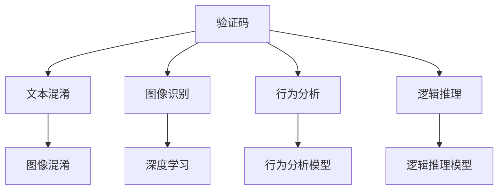

                 

# 验证码：人机交互中的智慧博弈

> 关键词：
- 验证码
- 人机交互
- 安全验证
- 智能博弈
- 机器学习
- 深度学习
- 模型训练

## 1. 背景介绍

### 1.1 问题由来

在数字化的世界中，人机交互无处不在。无论是通过手机应用、网站，还是在线游戏，用户的每一步操作都需通过某种形式的验证。然而，这种验证需要确保两件事情：一是人类用户能够轻松通过验证，二是机器无法轻易通过。验证码（Captcha）正是为了满足这一需求而诞生。验证码是保护网站或应用免受自动化攻击（如机器人、爬虫）的一种机制。

验证码通常由一个图像或文字谜题构成，用户需输入正确的答案才能继续操作。由于机器无法轻松解析文字或图像中的信息，从而无法轻易通过验证码验证，而人类用户凭借自身的视觉、认知能力，能够轻松识别图像或文字，顺利通过验证。

随着技术的不断进步，验证码技术也经历了多个阶段的演进。从简单的文本混淆到复杂的图像识别，验证码的难度不断提高，以应对不断升级的自动化攻击手段。但同时，验证码的过度复杂化也带来了用户体验的挑战。如何设计既安全又易于用户理解的验证码，成为当前人机交互领域的一个重要课题。

### 1.2 问题核心关键点

验证码的核心目标在于保证人机交互的安全性，但设计过于简单会引发自动化攻击，过于复杂又会影响用户体验。如何平衡安全性和易用性，是验证码设计中需要解决的关键问题。

为了应对自动化攻击，现代验证码系统通常采用以下技术：
- 文本混淆：将正常文字中的字母、数字等打乱顺序或颠倒方向，增加识别难度。
- 图像识别：利用图像处理技术，将文字或数字转化为图像中的像素信息，增加破解难度。
- 行为分析：通过分析用户的点击、拖放等行为，判断是否是真实用户操作。
- 逻辑推理：设计包含一定逻辑的谜题，要求用户进行推理后给出答案。

而为了提升用户体验，现代验证码设计注重以下几点：
- 简化流程：尽量减少用户的操作步骤和思考量。
- 直观展示：清晰地展示验证码内容，减少识别难度。
- 适应不同用户：考虑到用户的视力、认知能力等差异，设计适合不同群体的验证码。

## 2. 核心概念与联系

### 2.1 核心概念概述

为更好地理解验证码系统的工作原理和优化方向，本节将介绍几个密切相关的核心概念：

- 验证码（Captcha）：用于防止自动化攻击，验证用户身份的机制。通常由图像或文字谜题构成。
- 文本混淆：通过打乱文本顺序、颠倒方向等方式，增加机器识别难度。
- 图像识别：利用图像处理技术，将文字或数字转化为图像中的像素信息。
- 行为分析：通过分析用户的鼠标、键盘行为，判断是否是真实用户操作。
- 逻辑推理：设计包含一定逻辑的谜题，要求用户进行推理后给出答案。
- 深度学习：基于神经网络的机器学习技术，通过大量数据训练，实现高精度的图像识别和逻辑推理。

这些核心概念之间的逻辑关系可以通过以下Mermaid流程图来展示：



这个流程图展示了许多核心概念以及它们之间的联系：

1. 验证码通过文本混淆、图像识别、行为分析、逻辑推理等手段，增强了对抗自动化攻击的能力。
2. 深度学习技术用于图像识别和逻辑推理，是现代验证码系统的重要组成部分。
3. 行为分析模型和逻辑推理模型分别用于判断用户操作是否真实，增强验证码的安全性。

这些概念共同构成了验证码系统的设计和优化框架，使其能够在安全性与用户体验之间取得平衡。通过理解这些核心概念，我们可以更好地把握验证码的工作原理和优化方向。

## 3. 核心算法原理 & 具体操作步骤
### 3.1 算法原理概述

现代验证码系统通常基于深度学习技术构建，通过训练大量数据，学习识别验证码中的文字或图像信息。其中，文本混淆和图像识别是两个关键的子任务，分别对应于深度学习中的文本分类和图像分类任务。

### 3.2 算法步骤详解

以文本混淆技术为例，其基本步骤如下：

1. **文本生成**：从给定的词汇表（如字母、数字等）中随机选取字符，打乱顺序，生成一个难以识别的字符串。
2. **文本混淆**：通过旋转、翻转、扭曲等方式，将生成的字符串进一步混淆。
3. **图像生成**：将混淆后的文本信息转化为图像，背景通常设置为复杂图案，以增加识别难度。
4. **数据标注**：为每个混淆后的文本图像打上标签，指示正确的答案。
5. **模型训练**：使用深度学习模型（如CNN、RNN等）训练数据集，学习识别混淆文本图像的正确答案。

图像识别技术同理，其步骤如下：

1. **图像预处理**：将文字或数字转化为图像，并进行预处理（如灰度化、二值化等）。
2. **特征提取**：通过卷积神经网络（CNN）等技术，提取图像中的特征信息。
3. **分类器训练**：使用分类器（如SVM、KNN等）训练数据集，学习识别图像中的字符信息。
4. **模型优化**：通过调参和数据增强等技术，进一步提升模型的识别精度。

### 3.3 算法优缺点

现代验证码系统的优点包括：
- 高度安全：深度学习模型能够有效应对各种自动化攻击手段。
- 自动化生成：通过随机生成、混淆等手段，使每个验证码都是独一无二的。
- 自适应调整：可以根据自动化攻击手段的变化，动态调整验证码的难度。

然而，现代验证码系统也存在一些缺点：
- 用户体验较差：过于复杂的验证码增加了用户的操作步骤和时间成本。
- 破解难度高：自动化攻击手段的提升，使得一些高难度的验证码难以被破解。
- 技术要求高：深度学习模型的训练和部署需要较高的技术门槛。

### 3.4 算法应用领域

现代验证码系统广泛应用于各类人机交互场景，如：

- 网站登录验证：防止机器人恶意注册或登录。
- 支付系统安全：防止恶意点击和欺诈行为。
- 在线游戏反作弊：防止机器人作弊和游戏外挂。
- 数据采集限制：防止爬虫抓取敏感信息。
- 服务体验优化：通过验证码的设计优化，提升用户体验和系统安全性。

## 4. 数学模型和公式 & 详细讲解 & 举例说明

### 4.1 数学模型构建

本节将使用数学语言对验证码系统的工作原理进行更加严格的刻画。

假设有N个随机生成的文本字符，记为 $C=\{c_1, c_2, \dots, c_N\}$，其中 $c_i \in \mathcal{C}$，$\mathcal{C}$ 为字符集。通过随机排列、混淆等手段，生成一个混淆的字符串 $S$。

验证码生成过程可以表示为：

$$
S = \sigma(C)
$$

其中 $\sigma$ 为混淆函数，将字符集 $C$ 转化为混淆字符串 $S$。

图像生成过程可以表示为：

$$
I = \pi(S)
$$

其中 $\pi$ 为图像生成函数，将混淆字符串 $S$ 转化为图像 $I$。

最终，用户通过观察图像 $I$，输入正确的字符串 $C$，完成验证码验证。

### 4.2 公式推导过程

以图像识别为例，我们假设图像 $I$ 的大小为 $m \times n$，每个像素点的值为 $x_{i,j}$，$i \in [1,m], j \in [1,n]$。图像识别模型的输入为图像 $I$，输出为每个像素点属于字符集 $\mathcal{C}$ 中某个字符的概率分布，即 $P(C_i | I)$。

图像识别模型的训练过程可以表示为：

$$
P(C_i | I) = \frac{exp(w_i \cdot f(I) + b_i)}{\sum_{j=1}^{|\mathcal{C}|} exp(w_j \cdot f(I) + b_j)}
$$

其中 $w_i$ 和 $b_i$ 为模型参数，$f(I)$ 为特征提取函数，计算图像 $I$ 的特征向量。

图像识别模型的损失函数可以表示为：

$$
\mathcal{L} = -\sum_{i=1}^{|\mathcal{C}|} y_i \log P(C_i | I)
$$

其中 $y_i$ 为标签，$1$ 表示图像 $I$ 中包含字符 $C_i$。

通过最小化损失函数 $\mathcal{L}$，训练模型参数 $w$ 和 $b$，以实现高精度的图像识别。

### 4.3 案例分析与讲解

以SVM（支持向量机）作为分类器的验证码识别为例，假设验证码数据集包含 $N$ 个混淆字符串图像和相应的字符标签，记为 $I_1, \dots, I_N$ 和 $y_1, \dots, y_N$。

SVM模型的训练过程可以表示为：

$$
\min_{w, b, \alpha} \frac{1}{2} ||w||^2 + C \sum_{i=1}^N \alpha_i (y_i (w \cdot f(I_i) + b) - 1)
$$

其中 $w$ 和 $b$ 为模型参数，$\alpha_i$ 为拉格朗日乘子，$C$ 为正则化系数。

通过求解上述优化问题，训练SVM模型，得到高精度的图像分类器。

在测试阶段，对于新的混淆字符串图像 $I$，通过计算 $w \cdot f(I) + b$，得到每个字符的概率分布，选择最大概率对应的字符作为预测结果。

## 5. 项目实践：代码实例和详细解释说明
### 5.1 开发环境搭建

在进行验证码系统开发前，我们需要准备好开发环境。以下是使用Python进行TensorFlow开发的环境配置流程：

1. 安装Anaconda：从官网下载并安装Anaconda，用于创建独立的Python环境。

2. 创建并激活虚拟环境：
```bash
conda create -n captcha-env python=3.8 
conda activate captcha-env
```

3. 安装TensorFlow：根据CUDA版本，从官网获取对应的安装命令。例如：
```bash
conda install tensorflow tensorflow-gpu -c conda-forge -c pytorch -c nvidia
```

4. 安装各类工具包：
```bash
pip install numpy pandas scikit-learn matplotlib tqdm jupyter notebook ipython
```

完成上述步骤后，即可在`captcha-env`环境中开始验证码系统开发。

### 5.2 源代码详细实现

我们以手写数字识别验证码为例，给出使用TensorFlow实现的手写数字验证码识别系统的代码实现。

首先，定义数据生成函数：

```python
import tensorflow as tf
import numpy as np
import matplotlib.pyplot as plt
from tensorflow.keras.datasets import mnist

def generate_captcha(num_chars=4):
    # 生成指定数量的随机字符
    chars = [str(i) for i in range(10)]
    chars = np.random.choice(chars, size=num_chars, replace=False)
    digits = np.array(chars, dtype=np.str)

    # 生成混淆字符串
    shuffled = np.random.permutation(digits)
    captcha = ''.join(shuffled)

    # 生成图像
    image_size = 28
    img = np.zeros((image_size, image_size))
    for i, digit in enumerate(captcha):
        x, y = np.unravel_index(int(digit), (image_size, image_size))
        img[x, y] = 1
    img = 1 - img

    # 可视化图像
    plt.imshow(img, cmap='gray')
    plt.axis('off')
    plt.show()
```

然后，定义模型：

```python
from tensorflow.keras import layers

def build_model():
    inputs = layers.Input(shape=(image_size, image_size))
    x = layers.Reshape((image_size, image_size, 1))(inputs)
    x = layers.Conv2D(32, 3, activation='relu')(x)
    x = layers.MaxPooling2D((2, 2))(x)
    x = layers.Flatten()(x)
    x = layers.Dense(128, activation='relu')(x)
    outputs = layers.Dense(10, activation='softmax')(x)

    model = tf.keras.Model(inputs=inputs, outputs=outputs)
    return model
```

接着，定义数据预处理函数：

```python
def preprocess_data(data):
    # 标准化数据
    data = (data - 127.5) / 127.5

    # 将图片转换为一维向量
    data = data.reshape(-1, image_size, image_size, 1)

    # 随机打乱数据
    indices = np.random.permutation(len(data))
    data = data[indices]

    # 将标签转换为独热编码
    labels = np.zeros((len(data), 10))
    for i, digit in enumerate(data):
        labels[i, int(digit)] = 1

    return data, labels
```

最后，训练模型：

```python
model = build_model()
optimizer = tf.keras.optimizers.Adam()
model.compile(optimizer=optimizer, loss='categorical_crossentropy', metrics=['accuracy'])

# 加载数据集
(x_train, y_train), (x_test, y_test) = mnist.load_data()
x_train, y_train = preprocess_data(x_train)
x_test, y_test = preprocess_data(x_test)

# 训练模型
model.fit(x_train, y_train, batch_size=64, epochs=10, validation_data=(x_test, y_test))
```

以上就是使用TensorFlow实现的手写数字验证码识别系统的完整代码实现。可以看到，通过构建卷积神经网络模型，并使用交叉熵损失函数，我们可以实现高精度的验证码识别。

### 5.3 代码解读与分析

让我们再详细解读一下关键代码的实现细节：

**generate_captcha函数**：
- 从数字0到9中随机选取指定数量的字符，并打乱顺序，生成混淆字符串。
- 将混淆字符串转化为图像，每个数字占用一个像素点，通过1表示亮，0表示暗，得到灰度图像。
- 使用Matplotlib可视化生成的验证码图像。

**build_model函数**：
- 定义输入层，输入图像的大小为28x28，并将其转化为卷积神经网络的输入格式。
- 添加卷积层、池化层、全连接层等，构建模型。
- 定义输出层，输出每个数字的概率分布。

**preprocess_data函数**：
- 对输入数据进行标准化处理，将像素值归一化到[-1,1]。
- 将二维图像转化为一维向量，方便神经网络处理。
- 随机打乱数据集，避免过拟合。
- 将标签转化为独热编码，方便神经网络训练。

**训练模型**：
- 加载MNIST手写数字数据集。
- 使用自定义的预处理函数 preprocess_data，将数据集标准化为一维向量，并进行打乱和标签编码。
- 定义模型和优化器，使用交叉熵损失函数和准确率作为评估指标，训练模型。

## 6. 实际应用场景

### 6.1 智慧政务

在智慧政务领域，验证码技术可以用于在线申请、身份认证、电子支付等场景。通过数字身份认证，提升政务服务的便捷性和安全性，减少线下办证的繁琐流程。

在实际应用中，可以收集用户的历史申请记录、支付记录等数据，构建用户行为特征库。对于新的申请或支付请求，通过行为分析、图像识别等技术，判断是否为真实用户操作，防止自动化攻击。同时，设计简单的验证码任务，让用户轻松通过验证，提升用户体验。

### 6.2 智能安防

智能安防系统需要实时监控摄像头图像，防止恶意操作。通过验证码技术，可以有效提升系统安全性。

在监控图像上叠加验证码任务，要求用户识别特定图像中的元素或字符，只有通过验证的用户，才能继续操作。同时，结合行为分析技术，检测用户是否在摄像头范围内，防止恶意操作。

### 6.3 数字广告

数字广告平台需要对用户点击、跳转等行为进行验证，防止机器人和广告欺诈。通过验证码技术，可以有效识别自动化攻击，提升广告投放的效果和安全性。

在广告页面上叠加验证码任务，要求用户识别特定元素或字符，只有通过验证的用户，才能继续访问。同时，结合行为分析技术，检测用户是否在合法页面上操作，防止广告欺诈。

### 6.4 未来应用展望

随着深度学习技术的不断进步，验证码系统将呈现以下几个发展趋势：

1. 自动化生成：通过深度学习技术，自动生成高质量的验证码，减少人工设计的工作量。
2. 自适应调整：根据自动化攻击手段的变化，动态调整验证码的难度，提升安全性。
3. 跨模态融合：结合图像识别、行为分析、语音识别等多种模态数据，提升验证码的识别精度。
4. 交互设计优化：通过用户行为分析，设计更加友好、易用的验证码任务，提升用户体验。
5. 多用户适应：考虑用户视力、认知能力等差异，设计适合不同群体的验证码，提升系统的普适性。

这些趋势将使得验证码系统更加智能、安全、易用，进一步提升人机交互的安全性和用户体验。

## 7. 工具和资源推荐
### 7.1 学习资源推荐

为了帮助开发者系统掌握验证码系统的理论基础和实践技巧，这里推荐一些优质的学习资源：

1. 《深度学习》系列博文：由大模型技术专家撰写，深入浅出地介绍了深度学习的基本概念和常用技术，包括卷积神经网络、交叉熵损失函数等。

2. CS231n《卷积神经网络》课程：斯坦福大学开设的深度学习明星课程，详细讲解卷积神经网络的原理和应用，适合进一步深造。

3. 《Python机器学习》书籍：适合初学者入门，详细介绍了机器学习的基本概念和常用算法，包括SVM、KNN等。

4. TensorFlow官方文档：TensorFlow的官方文档，提供了丰富的深度学习模型和优化器，是上手实践的必备资料。

5. Kaggle平台：一个数据科学竞赛平台，提供了大量现实世界的验证码数据集，适合练习和竞赛。

通过对这些资源的学习实践，相信你一定能够快速掌握验证码系统的精髓，并用于解决实际的验证码问题。

### 7.2 开发工具推荐

高效的开发离不开优秀的工具支持。以下是几款用于验证码系统开发的常用工具：

1. TensorFlow：由Google主导开发的深度学习框架，生产部署方便，适合大规模工程应用。
2. Keras：TensorFlow的高层API，适合快速原型开发和模型训练。
3. OpenCV：开源计算机视觉库，提供了丰富的图像处理工具，适合验证码的生成和识别。
4. Pygame：跨平台的图形库，适合设计简单的验证码界面，提升用户体验。
5. Flask：轻量级的Web框架，适合封装验证码系统的API接口。

合理利用这些工具，可以显著提升验证码系统的开发效率，加快创新迭代的步伐。

### 7.3 相关论文推荐

验证码系统的发展源于学界的持续研究。以下是几篇奠基性的相关论文，推荐阅读：

1. "ReCaptcha v3: Secure but Simple"：介绍Google ReCaptcha v3的实现细节，包括深度学习模型和行为分析技术的应用。
2. "Real-time Handwritten Digit Recognition Using CNN and SVM"：详细讲解使用卷积神经网络和支持向量机实现的手写数字识别系统。
3. "Learning to Predict Label Distributions with Categorical Cross-Entropy"：介绍使用交叉熵损失函数进行多标签分类的方法，适合解决验证码中的多字符识别问题。
4. "Challenges in Recaptcha v3"：分析ReCaptcha v3的挑战和不足，提出未来改进方向。

这些论文代表了大验证码系统的发展脉络。通过学习这些前沿成果，可以帮助研究者把握学科前进方向，激发更多的创新灵感。

## 8. 总结：未来发展趋势与挑战

### 8.1 总结

本文对验证码系统的背景、核心概念、算法原理和操作步骤进行了全面系统的介绍。首先阐述了验证码系统的基本原理和应用背景，明确了验证码系统在安全验证方面的重要价值。其次，从原理到实践，详细讲解了验证码的生成和识别过程，给出了验证码系统开发的完整代码实例。同时，本文还广泛探讨了验证码系统在智慧政务、智能安防、数字广告等多个行业领域的应用前景，展示了验证码技术的广泛潜力。最后，本文精选了验证码系统的各类学习资源，力求为读者提供全方位的技术指引。

通过本文的系统梳理，可以看到，验证码系统通过深度学习技术，有效应对自动化攻击，提升了人机交互的安全性。同时，通过行为分析等技术，确保了验证码的易用性和用户体验。未来，随着深度学习技术的进一步发展，验证码系统将更加智能、安全、易用，成为人机交互中的重要组成部分。

### 8.2 未来发展趋势

展望未来，验证码系统将呈现以下几个发展趋势：

1. 自动化生成：通过深度学习技术，自动生成高质量的验证码，减少人工设计的工作量。
2. 自适应调整：根据自动化攻击手段的变化，动态调整验证码的难度，提升安全性。
3. 跨模态融合：结合图像识别、行为分析、语音识别等多种模态数据，提升验证码的识别精度。
4. 交互设计优化：通过用户行为分析，设计更加友好、易用的验证码任务，提升用户体验。
5. 多用户适应：考虑用户视力、认知能力等差异，设计适合不同群体的验证码，提升系统的普适性。

这些趋势将使得验证码系统更加智能、安全、易用，进一步提升人机交互的安全性和用户体验。

### 8.3 面临的挑战

尽管验证码系统已经取得了瞩目成就，但在迈向更加智能化、普适化应用的过程中，它仍面临诸多挑战：

1. 自动化生成：自动生成的验证码需要保证高质量和多样性，防止被自动化攻击手段破解。
2. 自适应调整：需要动态调整验证码难度，以适应自动化攻击手段的变化。
3. 跨模态融合：不同模态数据之间的融合和对齐，需要克服技术和算法上的挑战。
4. 交互设计优化：需要设计适合不同用户和场景的验证码任务，提升用户体验。
5. 多用户适应：需要考虑不同用户的认知能力和行为特征，设计适合不同群体的验证码。

这些挑战需要从技术、工程、心理学等多个维度进行协同解决，才能将验证码系统推向更高的台阶。

### 8.4 研究展望

面对验证码系统所面临的种种挑战，未来的研究需要在以下几个方面寻求新的突破：

1. 探索无监督和半监督验证码生成方法：摆脱对大规模标注数据的依赖，利用自监督学习、主动学习等无监督和半监督范式，最大限度利用非结构化数据，实现更加灵活高效的验证码生成。
2. 研究参数高效和计算高效的验证码生成方法：开发更加参数高效的生成方法，在固定大部分预训练参数的情况下，只更新极少量的任务相关参数。同时优化验证码生成模型的计算图，减少前向传播和反向传播的资源消耗，实现更加轻量级、实时性的部署。
3. 引入更多先验知识：将符号化的先验知识，如知识图谱、逻辑规则等，与验证码生成过程进行巧妙融合，引导验证码生成过程学习更准确、合理的语言模型。同时加强不同模态数据的整合，实现视觉、语音等多模态信息与验证码信息的协同建模。
4. 结合因果分析和博弈论工具：将因果分析方法引入验证码生成过程，识别出模型生成过程的关键特征，增强验证码生成过程的因果性和逻辑性。借助博弈论工具刻画用户和攻击者之间的交互过程，主动探索并规避验证码生成过程的脆弱点，提高系统稳定性。
5. 纳入伦理道德约束：在验证码生成目标中引入伦理导向的评估指标，过滤和惩罚有害、有偏见的验证码输出，确保验证码系统符合人类价值观和伦理道德。

这些研究方向的探索，将引领验证码系统迈向更高的台阶，为构建安全、可靠、可解释、可控的智能系统铺平道路。面向未来，验证码系统还需要与其他人工智能技术进行更深入的融合，如知识表示、因果推理、强化学习等，多路径协同发力，共同推动人机交互系统的进步。只有勇于创新、敢于突破，才能不断拓展验证码系统的边界，让智能技术更好地造福人类社会。

## 9. 附录：常见问题与解答

**Q1：验证码系统的安全性如何保证？**

A: 验证码系统的安全性主要依赖于深度学习模型对文本或图像的精确识别。通过大量的训练数据和高效的模型优化，验证码系统能够有效防止自动化攻击。同时，行为分析技术的应用，进一步提升了系统的安全性。但需要注意的是，随着自动化攻击手段的提升，验证码系统也需要定期更新和调整，以保持其安全性。

**Q2：验证码系统对用户体验的影响如何？**

A: 验证码系统的设计需要平衡安全性和易用性。过于复杂的验证码会增加用户的操作步骤和时间成本，降低用户体验。因此，设计简单的验证码任务，让用户轻松通过验证，是提升用户体验的关键。同时，结合行为分析等技术，提升验证码的识别精度，减少用户的操作步骤，也能有效提升用户体验。

**Q3：验证码系统的技术要求如何？**

A: 验证码系统的技术要求较高，需要深度学习、计算机视觉、行为分析等多个领域的知识。特别是深度学习模型的训练和部署，需要较高的技术门槛。但随着深度学习技术的不断发展，验证码系统的技术要求也在不断降低。同时，各类开源工具和框架（如TensorFlow、Keras等）的出现，也使得验证码系统的开发变得更加便捷和高效。

**Q4：验证码系统如何应对自动化攻击？**

A: 验证码系统应对自动化攻击的策略主要依赖于深度学习模型的精确识别和行为分析技术。通过大量的训练数据和高效的模型优化，验证码系统能够有效防止自动化攻击。同时，结合行为分析技术，检测用户是否在合法页面上操作，防止广告欺诈等恶意行为。但需要注意的是，随着自动化攻击手段的提升，验证码系统也需要定期更新和调整，以保持其安全性。

**Q5：验证码系统如何应对不同用户的需求？**

A: 验证码系统的设计需要考虑不同用户的需求，特别是视力、认知能力等差异。通过设计适合不同群体的验证码任务，提升系统的普适性。例如，对于老年人或视力受损用户，可以设计简单的验证码任务，避免过度混淆和复杂操作。同时，结合行为分析等技术，检测用户是否在合法页面上操作，防止自动化攻击。

通过本文的系统梳理，可以看到，验证码系统通过深度学习技术，有效应对自动化攻击，提升了人机交互的安全性。同时，通过行为分析等技术，确保了验证码的易用性和用户体验。未来，随着深度学习技术的进一步发展，验证码系统将更加智能、安全、易用，成为人机交互中的重要组成部分。

