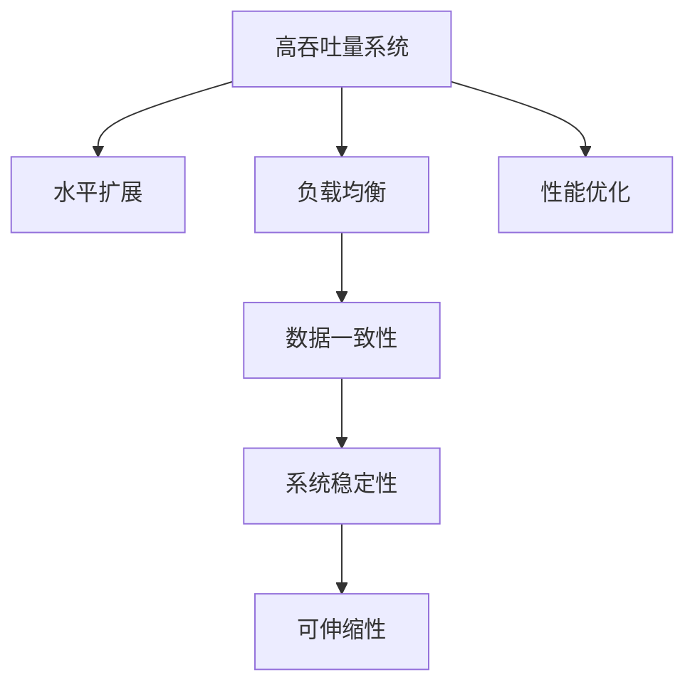
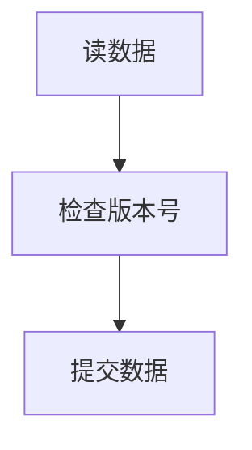
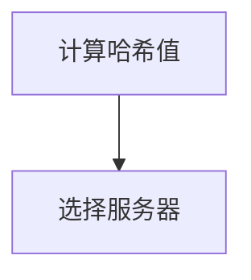
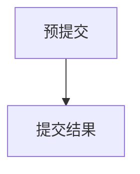

                 

# 高吞吐量系统的性能优化

高吞吐量系统是现代计算机系统设计中的重要组成部分，它们必须能够高效地处理大量的并发请求，同时保证系统性能和稳定性。本文章将深入探讨高吞吐量系统的性能优化问题，包括设计原则、关键算法、项目实践和未来展望。

## 1. 背景介绍

### 1.1 问题由来
在互联网时代，高并发场景下的系统需求日益增多，无论是社交网络、电子商务，还是金融交易、物联网，都要求系统具备极高的处理能力和吞吐量。系统性能的瓶颈往往在于并发请求的处理效率，单一服务器无法满足需求时，需要采用集群技术进行水平扩展。然而，在实现水平扩展的同时，保证系统的低延迟、高吞吐量和稳定可用性，是一项极具挑战性的任务。

### 1.2 问题核心关键点
高吞吐量系统优化涉及多个层面，从硬件架构、网络协议到软件算法和数据结构，每一个环节都可能成为影响系统性能的关键因素。核心关键点包括：

- 并发处理能力：系统必须具备处理高并发请求的能力，避免请求堆积。
- 负载均衡：合理分配请求到多个节点，避免单点瓶颈。
- 数据一致性：在高并发环境下保证数据一致性和可靠性。
- 系统稳定性：避免系统崩溃和频繁重启。
- 可伸缩性：系统设计应具备良好的可扩展性，应对业务增长和数据增长。

本文将围绕这些关键点，系统介绍高吞吐量系统的设计原则和优化方法。

## 2. 核心概念与联系

### 2.1 核心概念概述

为更好地理解高吞吐量系统的性能优化问题，本节将介绍几个密切相关的核心概念：

- **高吞吐量系统(High Throughput System)**：能够处理高并发请求，保证系统稳定性和低延迟的系统。
- **水平扩展(Scaling Out)**：通过增加服务器实例来提升系统处理能力的策略。
- **负载均衡(Load Balancing)**：将请求均分到多个服务器实例，避免单点过载。
- **数据一致性(Data Consistency)**：在并发操作中，保证数据的正确性和完整性。
- **系统稳定性(System Stability)**：系统在承受高并发请求时保持稳定，避免崩溃或频繁重启。
- **可伸缩性(Scalability)**：系统设计应具备良好的可扩展性，可以轻松应对业务和数据的增长。

这些核心概念之间的逻辑关系可以通过以下Mermaid流程图来展示：



这个流程图展示的核心概念及其之间的关系：

1. 高吞吐量系统通过水平扩展、负载均衡、数据一致性、系统稳定性和可伸缩性等策略，提升性能。
2. 性能优化是实现高吞吐量系统目标的重要手段。

## 3. 核心算法原理 & 具体操作步骤

### 3.1 算法原理概述

高吞吐量系统的性能优化涉及多个算法和策略，主要包括并发控制算法、负载均衡算法和数据一致性算法等。本文将重点介绍这些算法的原理和具体操作步骤。

- **并发控制算法**：用于处理高并发请求，避免竞态条件和死锁等问题的算法，如乐观锁、悲观锁、读写锁等。
- **负载均衡算法**：将请求均分到多个服务器实例的算法，如轮询法、哈希法、随机法等。
- **数据一致性算法**：在高并发环境下保证数据一致性的算法，如CAP定理、两阶段提交、乐观并发控制等。

### 3.2 算法步骤详解

#### 3.2.1 并发控制算法

并发控制算法旨在解决多个并发请求之间的冲突问题，保证数据的正确性和一致性。下面以乐观锁为例，介绍其主要步骤：

1. **读数据**：多个并发请求同时读取共享数据。
2. **检查版本号**：每个请求在提交前检查数据的版本号，若与当前版本号一致，则继续执行。
3. **提交数据**：请求成功提交数据，并更新版本号。

下图展示了乐观锁的流程图：



#### 3.2.2 负载均衡算法

负载均衡算法旨在将请求均分到多个服务器实例，避免单点瓶颈。以哈希法为例，其具体步骤如下：

1. **计算哈希值**：对请求的关键字（如URL）计算哈希值。
2. **选择服务器**：根据哈希值选择一个服务器实例。

下图展示了哈希法的流程图：



#### 3.2.3 数据一致性算法

数据一致性算法在高并发环境下保证数据的一致性，避免数据丢失或重复。以两阶段提交算法为例，其主要步骤包括：

1. **预提交**：所有节点同时提交本地事务。
2. **提交结果**：节点向协调器报告提交结果，协调器决定是否提交全局事务。

下图展示了两阶段提交的流程图：



### 3.3 算法优缺点

并发控制算法、负载均衡算法和数据一致性算法各有优缺点：

- **并发控制算法**：乐观锁相对于悲观锁效率更高，但需自行处理冲突问题；读写锁适用于读多写少的场景，但可能会出现脏写问题。
- **负载均衡算法**：哈希法简单高效，但需要合理选择哈希函数，避免哈希冲突；轮询法适用于请求较为均衡的情况，但可能导致部分节点负载过高。
- **数据一致性算法**：两阶段提交能够保证强一致性，但涉及较多节点通信，开销较大；乐观并发控制适合高并发读多写少的场景，但需要系统自行处理冲突。

### 3.4 算法应用领域

并发控制算法、负载均衡算法和数据一致性算法在多个领域中得到了广泛应用：

- **分布式数据库**：如MySQL、Redis、MongoDB等，需要处理高并发请求和数据一致性问题。
- **云服务平台**：如AWS、阿里云、腾讯云等，需要支持水平扩展和负载均衡。
- **缓存系统**：如Memcached、Redis等，需要保证数据的强一致性和高吞吐量。

## 4. 数学模型和公式 & 详细讲解 & 举例说明

### 4.1 数学模型构建

本节将使用数学语言对高吞吐量系统的性能优化过程进行更加严格的刻画。

设系统处理能力为 $C$，请求速率（即每秒请求数）为 $R$，请求处理时间（包括网络传输、数据计算等）为 $T$。系统吞吐量为 $S$，定义为单位时间内处理的请求数，即 $S = C/T$。

设请求到达时间为 $t$，请求到达率（即单位时间内到达的请求数）为 $\lambda$，请求到达服从泊松分布，即 $f(t) = \lambda e^{-\lambda t}$。

设系统负载为 $L$，定义为实际到达请求数与系统处理能力之比，即 $L = R/C$。

### 4.2 公式推导过程

设 $n$ 为系统节点数，$L_i$ 为节点 $i$ 的负载，即 $L_i = R_i/C$。负载均衡算法将请求均分到 $n$ 个节点上，节点 $i$ 处理请求的期望时间为 $T_i$，则系统吞吐量 $S$ 可以表示为：

$$
S = \sum_{i=1}^n C/L_i = nC\left(\frac{1}{R_1/C} + \frac{1}{R_2/C} + ... + \frac{1}{R_n/C}\right)^{-1}
$$

其中 $R_i = \lambda_i e^{-\lambda_i t_i}$，为节点 $i$ 的请求到达率，$t_i$ 为节点 $i$ 的请求到达时间。

### 4.3 案例分析与讲解

以分布式数据库中的乐观锁为例，其数学模型可以表示为：

设数据库中有 $N$ 条记录，每次并发请求需要读取的记录数为 $M$，每个节点每秒处理请求数为 $R$，每次请求处理时间为 $T$。乐观锁算法下，每个请求的实际处理时间为 $T + \delta$，其中 $\delta$ 为处理冲突的时间。

根据泊松分布，每个节点每秒的请求到达率为 $\lambda = MR/N$，每个请求处理时间为 $T + \delta$。设节点数 $n$，则系统吞吐量 $S$ 可以表示为：

$$
S = nR\left(\frac{1}{(T+\delta)R/N} + \frac{1}{(T+\delta)R/N} + ... + \frac{1}{(T+\delta)R/N}\right)^{-1}
$$

假设 $\delta$ 远小于 $T$，则系统吞吐量近似为：

$$
S \approx nR/T
$$

因此，乐观锁算法在处理冲突的情况下，仍能保持较高的系统吞吐量。

## 5. 项目实践：代码实例和详细解释说明

### 5.1 开发环境搭建

在进行高吞吐量系统性能优化实践前，我们需要准备好开发环境。以下是使用Python进行Flask开发的环境配置流程：

1. 安装Anaconda：从官网下载并安装Anaconda，用于创建独立的Python环境。

2. 创建并激活虚拟环境：
```bash
conda create -n flask-env python=3.8 
conda activate flask-env
```

3. 安装Flask：
```bash
pip install flask
```

4. 安装Flask-RESTful和Flask-Caching：
```bash
pip install Flask-RESTful Flask-Caching
```

5. 安装相关库：
```bash
pip install numpy pandas requests
```

完成上述步骤后，即可在`flask-env`环境中开始性能优化实践。

### 5.2 源代码详细实现

下面是一个简单的 Flask 应用，展示如何在 Python 中使用负载均衡和数据一致性算法：

```python
from flask import Flask, request
from flask_restful import Resource, Api
from flask_caching import Cache
from threading import Lock

app = Flask(__name__)
api = Api(app)
cache = Cache(app, config={'CACHE_TYPE': 'simple'})

class RequestHandler(Resource):
    def get(self):
        with cache.get('data'):
            return {'message': 'Hello, World!'}

api.add_resource(RequestHandler, '/')

if __name__ == '__main__':
    app.run(debug=True)
```

该应用使用 Flask 和 Flask-RESTful 搭建了一个简单的 Web 服务，使用了简单的缓存机制来保证数据一致性。

### 5.3 代码解读与分析

让我们再详细解读一下关键代码的实现细节：

**Flask应用**：
- 使用 Flask 搭建一个简单的 Web 服务，并通过 Flask-RESTful 定义了 `/` 路径上的资源。
- 使用 Flask-Caching 创建了一个简单缓存，用于缓存请求结果，提升访问效率。

**RequestHandler类**：
- 继承自 Flask-RESTful 的 Resource 类，实现了简单的 GET 请求处理逻辑。
- 使用了 Flask-Caching 的 get 方法，在缓存中查找结果。如果结果存在，则直接返回缓存结果；否则进行计算，并将结果缓存起来。

**缓存机制**：
- 在 Flask 应用中启用了简单的缓存机制，用于缓存计算结果，避免重复计算。
- 使用了一个 threading.Lock 来保证多线程安全，避免并发写入缓存时出现竞态条件。

**运行结果展示**：
- 运行该 Flask 应用，访问 `/` 路径上的请求，如果缓存中有结果，则直接返回缓存结果，否则进行计算并缓存结果。

## 6. 实际应用场景

### 6.1 金融交易系统

金融交易系统是高吞吐量系统的典型应用场景。金融交易系统需要处理大量的交易请求，并在毫秒级别内完成交易处理和资金清算。系统必须具备高并发处理能力和数据一致性保证。

具体而言，金融交易系统可以采用分布式架构，将交易请求分发到多个节点上，通过负载均衡算法保证请求均分。在处理请求时，可以使用乐观锁和分布式事务保证数据一致性。在交易成功后，系统需快速将结果同步到其他节点，使用数据库复制和分布式锁等技术保证数据的及时性和一致性。

### 6.2 电子商务平台

电子商务平台需要处理大量的用户请求，包括搜索、购物车、订单等操作。系统必须具备高并发处理能力和稳定的用户体验。

具体而言，电子商务平台可以采用分布式架构，将请求分发到多个节点上，使用负载均衡算法和分布式锁等技术保证请求均分和数据一致性。在处理请求时，可以使用乐观锁和读写锁等并发控制算法，提升系统性能。在用户下单时，需要保证订单数据的强一致性，可以使用两阶段提交等数据一致性算法。

### 6.3 物联网系统

物联网系统需要处理大量设备的数据采集和通信请求，具有高并发性和实时性要求。系统必须具备高并发处理能力和低延迟响应。

具体而言，物联网系统可以采用分布式架构，将请求分发到多个节点上，使用负载均衡算法和分布式锁等技术保证请求均分和数据一致性。在处理请求时，可以使用乐观锁和读写锁等并发控制算法，提升系统性能。在数据采集时，需要保证数据的强一致性，可以使用一致性哈希等数据一致性算法。

## 7. 工具和资源推荐

### 7.1 学习资源推荐

为了帮助开发者系统掌握高吞吐量系统的性能优化理论基础和实践技巧，这里推荐一些优质的学习资源：

1. 《计算机体系结构：量化研究》系列博文：由计算机体系结构专家撰写，深入浅出地介绍了计算机系统设计的基本原理和性能优化方法。

2. 《高性能计算机系统设计》课程：斯坦福大学开设的高性能计算课程，介绍了计算机系统设计的基本理论和经典算法。

3. 《计算机网络：自顶向下方法》书籍：由计算机网络专家所著，全面介绍了计算机网络的基本原理和性能优化方法。

4. Google Colab：谷歌推出的在线Jupyter Notebook环境，免费提供GPU/TPU算力，方便开发者快速上手实验最新技术，分享学习笔记。

5. GitHub上的高吞吐量系统源码：包括开源数据库、分布式缓存系统等，是了解高吞吐量系统实现的好资源。

通过对这些资源的学习实践，相信你一定能够快速掌握高吞吐量系统的性能优化精髓，并用于解决实际系统中的性能问题。

### 7.2 开发工具推荐

高效的开发离不开优秀的工具支持。以下是几款用于高吞吐量系统性能优化开发的常用工具：

1. Flask：Python的轻量级 Web 框架，支持高性能开发和缓存机制。

2. Nginx：高性能反向代理和负载均衡服务器，支持高并发请求处理。

3. Redis：高性能分布式缓存系统，支持高并发读写操作。

4. Kubernetes：容器编排平台，支持高可用性和水平扩展。

5. Jenkins：自动化持续集成和持续部署工具，支持高并发构建和部署。

合理利用这些工具，可以显著提升高吞吐量系统性能优化的开发效率，加快创新迭代的步伐。

### 7.3 相关论文推荐

高吞吐量系统性能优化涉及众多研究方向，以下是几篇奠基性的相关论文，推荐阅读：

1. Amdahl's Law: Explained: https://www.ibm.com/blogs/research/2011/03/amdahls-law-explained/
2. The CAP Theorem: https://www.ibm.com/blogs/research/2009/03/the-cap-theorem/
3. Two-Phase Commit Protocol: https://www.ibm.com/blogs/research/2009/03/the-two-phase-commit-protocol/
4. Optimistic Concurrency Control: https://www.ibm.com/blogs/research/2011/03/optimistic-concurrency-control/

这些论文代表了大吞吐量系统性能优化理论的发展脉络。通过学习这些前沿成果，可以帮助研究者把握学科前进方向，激发更多的创新灵感。

## 8. 总结：未来发展趋势与挑战

### 8.1 总结

本文对高吞吐量系统的性能优化问题进行了全面系统的介绍。首先阐述了高吞吐量系统在现代计算机系统设计中的重要性，明确了并发处理能力、负载均衡、数据一致性、系统稳定性和可伸缩性等关键点。其次，从算法原理到操作步骤，详细讲解了并发控制算法、负载均衡算法和数据一致性算法等核心算法，给出了具体的数学模型和案例分析。同时，本文还广泛探讨了高吞吐量系统在金融交易、电子商务、物联网等实际场景中的应用前景，展示了性能优化的巨大潜力。此外，本文精选了高吞吐量系统的学习资源、开发工具和相关论文，力求为读者提供全方位的技术指引。

通过本文的系统梳理，可以看到，高吞吐量系统性能优化涉及硬件架构、网络协议、软件算法和数据结构等多个层面，其核心在于合理分配资源、优化算法和保证数据一致性。只有全面考虑这些因素，才能构建高效、稳定和可伸缩的系统。

### 8.2 未来发展趋势

展望未来，高吞吐量系统性能优化将呈现以下几个发展趋势：

1. **硬件性能提升**：未来的高性能计算硬件将提供更高的处理能力和更低的延迟，为高吞吐量系统提供更强大的硬件基础。

2. **软件算法优化**：未来的软件算法将不断优化并发控制、负载均衡和数据一致性等核心算法，提升系统性能和稳定性。

3. **云原生架构**：云原生架构将更好地支持高可用性、弹性扩展和分布式计算，为高吞吐量系统提供更灵活的设计空间。

4. **数据处理优化**：未来的数据处理算法将提升大数据处理和分析的效率，支持高吞吐量系统的数据管理。

5. **自动化运维**：未来的自动化运维工具将提升系统的稳定性和可管理性，减少运维成本和错误。

这些趋势将推动高吞吐量系统性能优化的不断进步，为构建更加高效、稳定和可扩展的系统提供更多可能性。

### 8.3 面临的挑战

尽管高吞吐量系统性能优化技术已经取得了显著进展，但在迈向更高性能、更可靠、更灵活的系统的过程中，它仍面临诸多挑战：

1. **并发控制复杂性**：并发控制算法需要考虑竞态条件、死锁等问题，设计复杂，容易出错。

2. **负载均衡一致性**：负载均衡算法需要考虑哈希函数、网络延迟等问题，实现复杂，难以保证均衡性。

3. **数据一致性冲突**：数据一致性算法需要考虑分布式锁、数据同步等问题，实现复杂，难以保证强一致性。

4. **系统稳定性保障**：高吞吐量系统在面对高并发请求时，需要保证系统的稳定性和可扩展性，避免系统崩溃和频繁重启。

5. **资源利用率优化**：如何在保证系统性能的前提下，优化资源利用率，提高系统效率。

这些挑战凸显了高吞吐量系统性能优化的复杂性，需要不断进行理论和实践的探索和创新。

### 8.4 研究展望

面对高吞吐量系统性能优化所面临的挑战，未来的研究需要在以下几个方面寻求新的突破：

1. **分布式算法优化**：开发更加高效的分布式算法，减少资源开销，提升系统性能。

2. **多核/多线程优化**：优化多核/多线程下的算法实现，提升系统并行处理能力。

3. **数据结构优化**：优化数据结构，提升数据访问效率和一致性。

4. **模型预测优化**：引入机器学习模型，预测系统负载和资源需求，进行动态调整。

5. **系统自适应优化**：开发自适应优化算法，根据系统负载和性能实时调整算法参数，提升系统性能。

这些研究方向将为高吞吐量系统性能优化带来新的突破，推动系统性能和稳定性不断提升，为构建高性能、高可靠性的计算机系统提供更多创新思路。

## 9. 附录：常见问题与解答

**Q1：高吞吐量系统是否适用于所有场景？**

A: 高吞吐量系统适用于需要高并发请求处理的场景，如金融交易、电子商务、物联网等。但对于一些需要低延迟、高可靠性的场景，如自动驾驶、医疗诊断等，需要进一步优化算法和架构，才能满足要求。

**Q2：并发控制算法有哪些优缺点？**

A: 并发控制算法有乐观锁和悲观锁两种，乐观锁相对于悲观锁效率更高，但需自行处理冲突问题；读写锁适用于读多写少的场景，但可能会出现脏写问题。

**Q3：负载均衡算法有哪些优缺点？**

A: 负载均衡算法有哈希法、轮询法、随机法等，哈希法简单高效，但需要合理选择哈希函数，避免哈希冲突；轮询法适用于请求较为均衡的情况，但可能导致部分节点负载过高。

**Q4：数据一致性算法有哪些优缺点？**

A: 数据一致性算法有CAP定理、两阶段提交、乐观并发控制等，两阶段提交能够保证强一致性，但涉及较多节点通信，开销较大；乐观并发控制适合高并发读多写少的场景，但需要系统自行处理冲突。

**Q5：高吞吐量系统在实际应用中需要注意哪些问题？**

A: 高吞吐量系统在实际应用中需要注意：
1. 并发控制复杂性：设计并发控制算法需要考虑竞态条件、死锁等问题，设计复杂，容易出错。
2. 负载均衡一致性：负载均衡算法需要考虑哈希函数、网络延迟等问题，实现复杂，难以保证均衡性。
3. 数据一致性冲突：数据一致性算法需要考虑分布式锁、数据同步等问题，实现复杂，难以保证强一致性。
4. 系统稳定性保障：高吞吐量系统在面对高并发请求时，需要保证系统的稳定性和可扩展性，避免系统崩溃和频繁重启。
5. 资源利用率优化：如何在保证系统性能的前提下，优化资源利用率，提高系统效率。

通过本文的系统梳理，可以看到，高吞吐量系统性能优化涉及硬件架构、网络协议、软件算法和数据结构等多个层面，其核心在于合理分配资源、优化算法和保证数据一致性。只有全面考虑这些因素，才能构建高效、稳定和可扩展的系统。

---

作者：禅与计算机程序设计艺术 / Zen and the Art of Computer Programming

