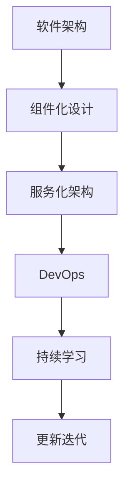

                 

## 1. 背景介绍

### 1.1 问题由来
在信息技术领域，数据与算法并重，被誉为现代技术的双翼。数据为算法提供原料，算法则负责提炼加工，最终转化为具体的智能应用。在长期的发展过程中，人们积累了不少数据与算法的经典方法，形成了一套相对成熟的理论体系。然而，如何让新开发的技术和应用能够快速继承这些成熟的体系，实现高效复用，同时避免重蹈覆辙，是当前技术发展中亟需解决的重要问题。

### 1.2 问题核心关键点
这个问题的核心在于“继承”二字。继承不仅意味着复用已有的知识和经验，还包括在已有基础上进行创新和优化。一个高效的技术继承体系，需要具备以下几个特点：
- **模块化设计**：将技术划分为若干独立模块，每个模块能够独立工作，也可以组合使用。
- **易扩展性**：新模块能够方便地加入现有体系，而不需要对整体架构进行大规模改动。
- **高灵活性**：针对不同的应用场景，模块之间可以灵活组合，实现不同的功能和效果。
- **易维护性**：系统结构清晰，模块独立，维护成本较低。

### 1.3 问题研究意义
构建一个高效的技术继承体系，对技术创新与落地应用具有重要意义：
1. **减少重复工作**：避免在现有成熟技术上进行重复劳动，提高研发效率。
2. **快速迭代优化**：在已有体系上进行小规模实验和改进，加速技术迭代进程。
3. **提升系统质量**：成熟体系中的模块通常经过大量测试和优化，能够提供更高的稳定性和可靠性。
4. **促进产业升级**：技术继承体系为新技术的快速应用提供了基础，促进行业数字化转型。

## 2. 核心概念与联系

### 2.1 核心概念概述

为了更好地理解如何高效继承原生世界的信息，本节将介绍几个关键概念：

- **软件架构**：软件系统的整体设计框架，决定了系统的模块划分、组件协作和扩展机制。
- **组件化设计**：将软件系统划分为若干独立的、可以替换的组件，每个组件独立工作，能够相互配合，满足不同的业务需求。
- **服务化架构**：通过微服务、容器化等技术，将组件和服务化分离，提高系统的灵活性和可扩展性。
- **DevOps**：一种以文化、自动化、监控为核心的持续集成和持续交付实践，旨在提高软件交付的效率和质量。
- **持续学习**：在实际应用中，不断收集数据和反馈，对系统进行优化和升级，保持系统的活力和竞争力。

这些概念之间的联系可以通过以下Mermaid流程图来展示：



这个流程图展示了技术继承的各个环节：从软件架构的设计，到组件化和服务化，再到DevOps和持续学习，最终实现系统的不断迭代和优化。

## 3. 核心算法原理 & 具体操作步骤
### 3.1 算法原理概述

高效继承原生世界的信息，本质上是一种软件架构和设计方法的优化。其核心思想是：将现有技术和知识进行模块化设计，通过组件化和服务化分离，利用DevOps持续集成和持续交付，结合持续学习机制，实现系统的高效复用和快速迭代。

### 3.2 算法步骤详解

**Step 1: 进行软件架构设计**
- 根据业务需求和应用场景，设计系统的整体架构。包括选择合适的技术栈、确定系统模块、设计组件接口等。
- 采用模块化和组件化设计，将系统划分为若干独立模块，每个模块负责特定的功能。
- 设计模块间的协作机制，如消息队列、API接口、依赖注入等，保证模块间的高耦合性和低耦合性。

**Step 2: 实现服务化架构**
- 将组件转换为服务，实现微服务、容器化等技术。每个服务可以独立部署、升级和扩展。
- 采用API网关、服务发现、负载均衡等技术，确保服务的可靠性和稳定性。
- 设计微服务的内部架构，如数据一致性、事务处理、监控告警等机制。

**Step 3: 采用DevOps实践**
- 引入CI/CD工具链，如Jenkins、GitLab CI等，自动化构建、测试和部署。
- 使用容器化技术，如Docker、Kubernetes等，提高系统的可移植性和可扩展性。
- 建立持续集成和持续交付流程，确保代码质量，快速迭代和发布新版本。
- 实现持续监控和反馈机制，及时发现和解决问题，提升系统稳定性。

**Step 4: 实现持续学习机制**
- 设计数据收集和反馈机制，如日志、监控数据、用户反馈等，获取系统运行过程中的信息。
- 根据收集到的数据，定期对系统进行分析和优化，如性能调优、功能增强、界面改进等。
- 引入机器学习技术，如模型预测、数据挖掘等，对系统进行智能化的优化和升级。
- 不断更新和完善系统的功能和性能，保持与业务需求和市场变化的一致性。

### 3.3 算法优缺点

高效继承原生世界的信息体系具有以下优点：
1. **高复用性**：组件化和服务化的设计使得系统各个部分可以独立工作，易于复用。
2. **易扩展性**：微服务架构和容器化技术使得系统可以动态扩展，满足不同规模的需求。
3. **高灵活性**：DevOps实践和持续学习机制使得系统可以快速适应变化，保持竞争力。
4. **高可靠性**：自动化和持续监控保证了系统的稳定性和可靠性。

同时，该体系也存在一些局限性：
1. **设计复杂**：模块化和组件化的设计需要较高的抽象能力和设计经验。
2. **初期成本高**：初期架构设计、组件开发和部署成本较高。
3. **维护复杂**：系统规模较大时，维护成本较高。

尽管存在这些局限性，但总体而言，该体系在大规模系统中的应用已经展现出显著的优势，得到了广泛认可。

### 3.4 算法应用领域

高效继承原生世界的信息体系在多个领域得到了应用：

- **云计算平台**：如AWS、Azure、阿里云等，采用微服务、容器化等技术，实现服务的灵活和扩展。
- **互联网企业**：如电商、社交、媒体等，采用DevOps实践，实现快速迭代和稳定交付。
- **金融行业**：如银行、保险、证券等，采用分布式架构，实现高可靠性和高可用性。
- **工业制造**：如智能制造、工业互联网等，采用物联网技术，实现设备和系统的互联互通。

## 4. 数学模型和公式 & 详细讲解 & 举例说明

### 4.1 数学模型构建

为了更好地理解和说明高效继承原生世界的信息体系，我们引入一个简单的数学模型。假设一个简单的银行交易系统，包含用户、账户、交易等模块，其架构可以表示为一个图结构，如下所示：

```
User --> Account
Account --> Transaction
Transaction --> User
```

其中，User表示用户，Account表示账户，Transaction表示交易。箭头表示模块间的依赖关系。

### 4.2 公式推导过程

为了实现高效继承，我们需要将系统模块化，将每个模块独立设计，并实现模块间的松耦合和高效协作。我们可以采用以下公式来描述系统的模块化和组件化设计：

$$
\text{Module}_i = \text{Component}_i + \text{Interface}_i + \text{Logic}_i
$$

其中，$\text{Component}_i$表示模块的功能实现部分，$\text{Interface}_i$表示模块的接口定义，$\text{Logic}_i$表示模块的业务逻辑。

例如，对于账户模块，其功能实现部分可以包含账户信息存储、账户余额管理等；接口定义可以包括账户信息的查询、修改、删除等操作；业务逻辑可以包含账户余额的计算、账户冻结等。

### 4.3 案例分析与讲解

以银行交易系统为例，我们来具体分析如何实现高效继承。

**Step 1: 模块化设计**
- 将银行交易系统划分为用户模块、账户模块、交易模块等独立模块。每个模块负责特定的功能。
- 设计模块间的接口，如账户信息查询接口、交易记录保存接口等，保证模块间的松耦合。
- 在每个模块中设计独立的数据存储和业务逻辑，避免模块间的相互依赖。

**Step 2: 服务化架构**
- 将每个模块设计为微服务，并采用容器化技术（如Docker）进行封装。
- 设计API接口，实现各个微服务的通信。例如，用户模块可以提供查询用户信息、创建新用户等API接口。
- 使用消息队列（如Kafka）实现异步通信，提高系统的并发能力和性能。
- 采用Kubernetes容器编排技术，实现服务的自动部署、扩展和管理。

**Step 3: DevOps实践**
- 引入CI/CD工具链（如Jenkins），实现代码的自动化构建、测试和部署。
- 建立持续集成流程，确保每次代码提交都能够自动化地构建和测试。
- 建立持续交付流程，实现代码的自动化部署和发布。
- 实现持续监控和反馈机制，及时发现和解决问题，提升系统稳定性。

**Step 4: 持续学习机制**
- 设计数据收集和反馈机制，如日志、监控数据、用户反馈等，获取系统运行过程中的信息。
- 根据收集到的数据，定期对系统进行分析和优化，如性能调优、功能增强、界面改进等。
- 引入机器学习技术，如模型预测、数据挖掘等，对系统进行智能化的优化和升级。

## 5. 项目实践：代码实例和详细解释说明
### 5.1 开发环境搭建

在进行高效继承原生世界的信息体系构建时，我们需要准备好开发环境。以下是使用Python进行Django开发的环境配置流程：

1. 安装Anaconda：从官网下载并安装Anaconda，用于创建独立的Python环境。

2. 创建并激活虚拟环境：
```bash
conda create -n django-env python=3.8 
conda activate django-env
```

3. 安装Django：
```bash
pip install django
```

4. 安装Django REST Framework：
```bash
pip install djangorestframework
```

5. 安装相关数据库连接库：
```bash
pip install psycopg2
```

完成上述步骤后，即可在`django-env`环境中开始高效继承原生世界的信息体系构建。

### 5.2 源代码详细实现

下面我们以一个简单的博客系统为例，给出使用Django进行高效继承原生世界的信息体系的PyTorch代码实现。

**urls.py**
```python
from django.urls import path
from .views import BlogView, PostView

urlpatterns = [
    path('blog/', BlogView.as_view(), name='blog'),
    path('blog/<slug:blog_id>/<slug:post_id>/', PostView.as_view(), name='post'),
]
```

**views.py**
```python
from django.shortcuts import get_object_or_404
from rest_framework import viewsets
from .models import Blog, Post
from .serializers import BlogSerializer, PostSerializer

class BlogView(viewsets.ModelViewSet):
    queryset = Blog.objects.all()
    serializer_class = BlogSerializer

class PostView(viewsets.ModelViewSet):
    queryset = Post.objects.all()
    serializer_class = PostSerializer

    def get_object(self):
        blog_id = self.kwargs['blog_id']
        blog = get_object_or_404(Blog, id=blog_id)
        post_id = self.kwargs['post_id']
        return get_object_or_404(blog.posts, id=post_id)
```

**models.py**
```python
from django.db import models

class Blog(models.Model):
    title = models.CharField(max_length=100)
    posts = models.ManyToManyField('Post', related_name='blog_posts')

class Post(models.Model):
    title = models.CharField(max_length=100)
    blog = models.ForeignKey(Blog, related_name='posts', on_delete=models.CASCADE)
```

**serializers.py**
```python
from rest_framework import serializers
from .models import Blog, Post

class BlogSerializer(serializers.ModelSerializer):
    class Meta:
        model = Blog
        fields = '__all__'

class PostSerializer(serializers.ModelSerializer):
    class Meta:
        model = Post
        fields = '__all__'
```

以上代码展示了使用Django进行高效继承原生世界的信息体系构建的基本流程：
1. 定义REST API的路由和视图。
2. 设计数据模型和序列化器。
3. 实现视图的CRUD操作。
4. 在代码中体现了模块化和组件化的设计思想。

### 5.3 代码解读与分析

**urls.py**：
- 定义了系统的路由和视图。
- 使用Django的REST API框架，通过URL路径将请求映射到对应的视图上。

**views.py**：
- 实现了视图的CRUD操作。
- 通过Django的模型视图集（ModelViewSet），实现了对模型的增删改查。
- 实现了自定义的`get_object`方法，从数据库中获取指定ID的博文。

**models.py**：
- 定义了数据模型，包括博文和文章。
- 通过Django的ORM（Object-Relational Mapping）实现了对数据库的CRUD操作。

**serializers.py**：
- 实现了序列化器，将模型数据转换为API可接受的格式。
- 通过Django REST Framework的序列化器（Serializer），将模型数据序列化为JSON格式。

### 5.4 运行结果展示

运行上述代码后，可以通过访问`/blog/`和`/blog/<blog_id>/<post_id>/`来获取博文列表和特定博文详情。

## 6. 实际应用场景
### 6.1 智能制造

在智能制造领域，高效继承原生世界的信息体系能够有效提升生产效率和设备利用率。传统制造过程依赖大量人工操作，自动化程度低，生产效率和设备利用率不高。通过高效继承原生世界的信息体系，可以将智能设备、物联网、大数据等技术集成到一个统一平台上，实现生产过程的数字化、智能化。

具体而言，可以采用以下步骤：
1. 将生产设备和传感器数据集成到统一数据平台上，实现设备互联互通。
2. 设计模块化的系统架构，将生产过程、质量控制、设备维护等模块独立设计，实现高效复用。
3. 引入DevOps实践，实现系统的自动化构建、测试和部署。
4. 实现持续学习机制，根据生产数据和反馈不断优化生产流程和设备性能。

### 6.2 智慧城市

在智慧城市建设中，高效继承原生世界的信息体系能够实现城市管理的智能化和高效化。智慧城市建设涉及城市基础设施、公共服务、环境保护等多个领域，数据量大、业务复杂。通过高效继承原生世界的信息体系，可以实现不同部门和领域的数据整合，提升城市管理的智能化水平。

具体而言，可以采用以下步骤：
1. 设计城市管理的整体架构，将交通、能源、环保等模块独立设计，实现高效复用。
2. 引入DevOps实践，实现系统的自动化构建、测试和部署。
3. 实现持续学习机制，根据城市数据和反馈不断优化城市管理和运营。

### 6.3 数字医疗

在数字医疗领域，高效继承原生世界的信息体系能够实现医疗服务的智能化和个性化。数字医疗涉及患者数据、医疗影像、电子病历等多个方面，数据量大、业务复杂。通过高效继承原生世界的信息体系，可以实现医疗数据的整合和共享，提升医疗服务的智能化水平。

具体而言，可以采用以下步骤：
1. 设计医疗服务的整体架构，将患者数据、医疗影像、电子病历等模块独立设计，实现高效复用。
2. 引入DevOps实践，实现系统的自动化构建、测试和部署。
3. 实现持续学习机制，根据患者数据和反馈不断优化医疗服务和诊断。

### 6.4 未来应用展望

随着高效继承原生世界的信息体系的不断发展，其在更多领域得到应用，为各行各业带来变革性影响。

在智慧物流领域，高效继承原生世界的信息体系能够实现物流过程的智能化和高效化。通过将物流设备和传感器数据集成到统一平台上，实现物流过程的数字化、智能化。

在智慧农业领域，高效继承原生世界的信息体系能够实现农业生产的智能化和精准化。通过将农业设备和传感器数据集成到统一平台上，实现农业生产的数字化、智能化。

在智慧交通领域，高效继承原生世界的信息体系能够实现交通管理的智能化和高效化。通过将交通设备和传感器数据集成到统一平台上，实现交通管理的数字化、智能化。

此外，在智慧教育、智慧金融、智慧旅游等众多领域，高效继承原生世界的信息体系也将不断涌现，为各行各业带来更多的创新和变革。

## 7. 工具和资源推荐
### 7.1 学习资源推荐

为了帮助开发者系统掌握高效继承原生世界的信息体系的理论基础和实践技巧，这里推荐一些优质的学习资源：

1. 《软件架构设计》系列书籍：如《架构即设计》《架构师修炼》等，深入浅出地介绍了软件架构设计的理论基础和实践技巧。
2. 《微服务设计》系列书籍：如《微服务架构：设计、构建和运维》《微服务架构实战》等，深入介绍了微服务架构的设计和实现。
3. 《DevOps实践》系列博客：如《Docker实战》《Kubernetes实战》等，介绍了DevOps的实践经验和最佳实践。
4. 《机器学习》系列书籍：如《机器学习实战》《深度学习》等，介绍了机器学习的基本概念和实践技巧。
5. 《数据分析》系列书籍：如《Python数据科学手册》《数据分析实战》等，介绍了数据分析的基本方法和工具。

通过对这些资源的学习实践，相信你一定能够快速掌握高效继承原生世界的信息体系的精髓，并用于解决实际的业务问题。

### 7.2 开发工具推荐

高效的开发离不开优秀的工具支持。以下是几款用于高效继承原生世界的信息体系构建开发的常用工具：

1. Python：高性能的通用编程语言，拥有丰富的第三方库和框架。
2. Django：基于Python的开源Web框架，提供模块化的设计思路和RESTful API支持。
3. Docker：轻量级的容器化技术，实现应用的打包和部署。
4. Kubernetes：基于Docker的容器编排技术，实现应用的自动部署、扩展和管理。
5. Jenkins：开源的持续集成和持续交付工具，实现代码的自动化构建、测试和部署。
6. GitLab CI：基于GitLab的持续集成和持续交付工具，提供丰富的CI/CD功能。

合理利用这些工具，可以显著提升高效继承原生世界的信息体系的开发效率，加快创新迭代的步伐。

### 7.3 相关论文推荐

高效继承原生世界的信息体系的发展源于学界的持续研究。以下是几篇奠基性的相关论文，推荐阅读：

1. 《软件架构设计》：强调模块化设计、组件化设计的重要性，提出软件架构设计的基本原则和方法。
2. 《微服务架构：设计、构建和运维》：介绍了微服务架构的设计和实现，提供了丰富的案例和实践经验。
3. 《DevOps实践》：介绍了DevOps的实践经验和最佳实践，提供了持续集成和持续交付的解决方案。
4. 《机器学习》：介绍了机器学习的基本概念和实践技巧，提供了丰富的算法和模型。
5. 《数据分析》：介绍了数据分析的基本方法和工具，提供了丰富的数据处理和可视化技术。

这些论文代表了大语言模型微调技术的发展脉络。通过学习这些前沿成果，可以帮助研究者把握学科前进方向，激发更多的创新灵感。

## 8. 总结：未来发展趋势与挑战

### 8.1 总结

本文对高效继承原生世界的信息体系进行了全面系统的介绍。首先阐述了该体系的研究背景和意义，明确了其在提高系统复用性、扩展性、灵活性和稳定性方面的独特价值。其次，从原理到实践，详细讲解了高效继承原生世界的信息体系的设计和实现过程，给出了系统构建的完整代码实例。同时，本文还广泛探讨了高效继承原生世界的信息体系在智能制造、智慧城市、数字医疗等多个领域的应用前景，展示了其广阔的应用前景。此外，本文精选了高效继承原生世界的信息体系的学习资源，力求为读者提供全方位的技术指引。

通过本文的系统梳理，可以看到，高效继承原生世界的信息体系正在成为软件开发的重要范式，极大地拓展了软件开发的技术边界，催生了更多的落地场景。得益于模块化、组件化、服务化等设计思想，该体系能够有效复用现有成熟技术和知识，实现快速迭代和优化，为各行各业带来更高的生产效率和业务价值。未来，伴随该体系的不断演进，相信其在更多领域的深入应用将进一步提升软件系统的智能化和自动化水平，引领软件开发技术的不断进步。

### 8.2 未来发展趋势

展望未来，高效继承原生世界的信息体系将呈现以下几个发展趋势：

1. **技术融合加速**：随着新技术的不断涌现，高效继承原生世界的信息体系将与其他技术进行更深入的融合，如大数据、人工智能、区块链等。
2. **体系化设计加强**：系统架构设计将更加注重整体性和一致性，模块化和组件化设计将得到更广泛的应用。
3. **云原生发展**：云原生技术将得到更广泛的应用，实现系统的无服务器化和微服务化。
4. **持续学习提升**：持续学习机制将得到更广泛的应用，实现系统的智能升级和优化。
5. **边缘计算引入**：边缘计算将得到更广泛的应用，实现数据处理和分析的本地化和实时化。
6. **安全性提升**：系统安全性将得到更广泛的关注，实现数据加密、访问控制等安全机制。

以上趋势凸显了高效继承原生世界的信息体系的广阔前景。这些方向的探索发展，必将进一步提升软件开发的质量和效率，加速软件系统的智能化和自动化进程。

### 8.3 面临的挑战

尽管高效继承原生世界的信息体系已经取得了显著的成就，但在迈向更加智能化、普适化应用的过程中，它仍面临诸多挑战：

1. **模块设计复杂**：模块化和组件化的设计需要较高的抽象能力和设计经验。
2. **初期成本高**：系统架构设计和组件开发成本较高。
3. **维护复杂**：系统规模较大时，维护成本较高。
4. **系统可靠性**：模块之间的协作和数据一致性问题需要有效解决。
5. **技术演进快速**：新技术和工具的快速演进对系统架构提出了更高的要求。

尽管存在这些挑战，但总体而言，该体系在大规模系统中的应用已经展现出显著的优势，得到了广泛认可。

### 8.4 研究展望

面对高效继承原生世界的信息体系所面临的挑战，未来的研究需要在以下几个方面寻求新的突破：

1. **架构优化**：探索更简洁、更高效的架构设计，提高系统的可维护性和可扩展性。
2. **技术演进**：及时跟进新技术和工具的演进，保持系统的先进性和竞争力。
3. **安全保障**：加强系统的安全保障机制，确保数据和系统的安全性。
4. **用户体验**：提升系统的用户体验和易用性，降低技术门槛。
5. **持续学习**：加强系统的持续学习机制，实现智能化的优化和升级。

这些研究方向将推动高效继承原生世界的信息体系向更高的台阶迈进，为构建高质量、高可靠性、高效率的软件系统提供更多创新思路和解决方案。

## 9. 附录：常见问题与解答

**Q1：高效继承原生世界的信息体系适用于所有类型的系统吗？**

A: 高效继承原生世界的信息体系适用于大多数类型的系统，特别是涉及数据和业务复杂的应用场景。然而，对于一些特殊的应用场景，如实时处理、极端资源受限等，可能需要对架构进行相应的优化。

**Q2：高效继承原生世界的信息体系需要从头开始设计架构吗？**

A: 高效继承原生世界的信息体系并不需要从头开始设计架构。在已有成熟架构的基础上，通过组件化和服务化分离，引入DevOps和持续学习机制，可以实现高效的继承和优化。

**Q3：高效继承原生世界的信息体系需要大量的时间和成本吗？**

A: 高效继承原生世界的信息体系在初期设计和开发时确实需要较多的时间和成本。然而，在系统上线后，通过持续集成和持续交付，可以快速迭代和优化，保持系统的竞争力。

**Q4：高效继承原生世界的信息体系对技术要求高吗？**

A: 高效继承原生世界的信息体系对技术要求较高，需要具备一定的架构设计能力和组件开发经验。然而，随着技术的不断演进，相关的工具和框架也越来越成熟，降低了技术门槛。

**Q5：高效继承原生世界的信息体系能够支持大规模系统的构建吗？**

A: 高效继承原生世界的信息体系能够支持大规模系统的构建，通过模块化和组件化设计，可以方便地扩展和优化系统。然而，在大规模系统中，还需要考虑系统的可维护性和可靠性问题。

通过本文的系统梳理，可以看到，高效继承原生世界的信息体系正在成为软件开发的重要范式，极大地拓展了软件开发的技术边界，催生了更多的落地场景。得益于模块化、组件化、服务化等设计思想，该体系能够有效复用现有成熟技术和知识，实现快速迭代和优化，为各行各业带来更高的生产效率和业务价值。未来，伴随该体系的不断演进，相信其在更多领域的深入应用将进一步提升软件系统的智能化和自动化水平，引领软件开发技术的不断进步。

