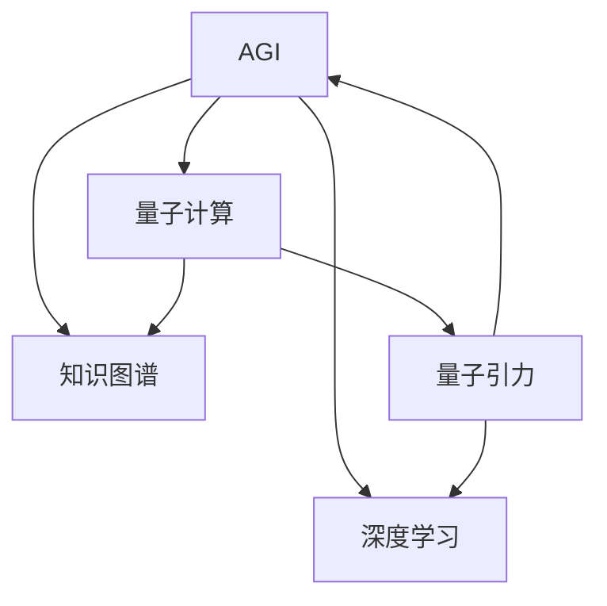

                 

# AGI与量子引力的跨学科合作

> 关键词：AGI, 量子引力, 跨学科合作, 深度学习, 量子计算, 知识融合, 算法优化

## 1. 背景介绍

### 1.1 问题由来
人工智能（Artificial Intelligence, AI）是人类历史上的一大里程碑，其发展不仅推动了科学技术的进步，也为人类社会的未来发展带来了无限可能。然而，当前AI技术主要集中在有限的任务和领域，如图像识别、语音识别、自然语言处理等，与通用人工智能（Artificial General Intelligence, AGI）还有很大差距。AGI旨在构建一种能够进行所有人类智能活动，包括问题解决、创造性思考、自我意识等能力的智能系统。

与此同时，量子引力（Quantum Gravity, QG）是物理学界探索宇宙最深层次秘密的一个前沿领域。它试图将量子力学和广义相对论结合起来，以解释引力和时空的本质，并解决经典物理学无法解释的诸多问题。然而，量子引力理论的建立和验证面临着极大的技术挑战，尚未形成成熟的理论框架。

在这样的背景下，AGI和量子引力之间的跨学科合作成为一个可能。通过结合AGI的计算能力与量子引力的理论深度，我们有可能在解决AI和物理学的两大难题上取得突破，为人类社会的进步和科技的发展提供全新的动力。

### 1.2 问题核心关键点
AGI与量子引力的跨学科合作主要包括以下几个关键点：
1. **知识融合**：如何将AGI的知识整合到量子引力理论中，从而推进量子引力理论的发展。
2. **算法优化**：在量子计算框架下优化AGI算法，提升其在物理领域的应用效率。
3. **计算与实验结合**：将AGI的高效计算能力与量子引力的实验验证相结合，探索新的物理现象和规律。

### 1.3 问题研究意义
AGI与量子引力的跨学科合作具有重大意义：
1. **推动科学进步**：通过融合AGI与量子引力，可能会发现新的物理现象，解决长期存在的科学难题。
2. **拓展应用领域**：AGI在物理领域的成功应用，将为更多学科带来新的方法和思路。
3. **促进技术创新**：跨学科合作能够激发新的技术突破，加速前沿技术的发展。
4. **提高社会效益**：在医疗、能源、环境保护等领域，AGI与量子引力合作的应用有望提升人类生活质量。

## 2. 核心概念与联系

### 2.1 核心概念概述

为更好地理解AGI与量子引力之间的跨学科合作，本节将介绍几个密切相关的核心概念：

- **AGI**：旨在构建能够执行任何智能任务的通用人工智能系统。与目前针对特定任务的AI不同，AGI可以处理复杂的逻辑推理、自我意识、创造性思考等。
- **量子引力**：尝试将量子力学和广义相对论结合起来，解释引力和时空的本质，是物理学研究的最前沿领域。
- **深度学习**：一种基于神经网络的机器学习方法，广泛应用于图像识别、语音识别、自然语言处理等领域。
- **量子计算**：利用量子力学原理进行计算的一种新型计算范式，具有超越传统计算机的计算能力。
- **知识图谱**：将现实世界中的知识以图的形式表示，用于知识推理和知识融合。

这些核心概念之间的逻辑关系可以通过以下Mermaid流程图来展示：



这个流程图展示了大语言模型的核心概念及其之间的关系：

1. AGI通过深度学习和量子计算获得强大的计算能力。
2. 深度学习为AGI提供了强大的模型基础，可以处理复杂的推理任务。
3. 量子计算为AGI提供了更高效的计算平台，提升其性能。
4. 知识图谱为AGI提供了丰富的知识库，使其能够进行知识推理和知识融合。
5. 量子引力理论为AGI提供了新的研究领域，开拓了新的研究方向。

这些概念共同构成了AGI与量子引力跨学科合作的理论基础，使其能够在物理领域中发挥独特的优势。

## 3. 核心算法原理 & 具体操作步骤
### 3.1 算法原理概述

AGI与量子引力的跨学科合作，本质上是一个复杂的知识融合和算法优化过程。其核心思想是：将AGI的深度学习模型与量子引力的理论模型相结合，通过AGI的高效计算能力，探索新的物理现象和规律。

具体而言，可以采用以下步骤进行实现：

1. **知识图谱构建**：收集和整合物理领域的知识，构建知识图谱。
2. **模型训练与优化**：在量子计算框架下，对AGI的深度学习模型进行训练和优化。
3. **理论验证**：将训练好的AGI模型应用于量子引力理论，验证理论的正确性和可行性。
4. **迭代优化**：根据理论验证结果，不断迭代优化模型，提升其性能。

### 3.2 算法步骤详解

AGI与量子引力的跨学科合作具体步骤如下：

**Step 1: 知识图谱构建**

构建物理领域的知识图谱是跨学科合作的基础。知识图谱通常由节点和边组成，节点表示实体，边表示实体之间的关系。知识图谱的构建可以分为以下几个步骤：

1. **实体抽取**：从物理领域的文献、实验数据中提取实体，如粒子、力、场等。
2. **关系抽取**：分析实体之间的关系，如相互作用、耦合等。
3. **图谱构建**：将实体和关系组合成知识图谱，并进行可视化。

**Step 2: 模型训练与优化**

在量子计算框架下，对AGI的深度学习模型进行训练和优化。具体步骤如下：

1. **模型选择**：选择合适的深度学习模型，如卷积神经网络（CNN）、递归神经网络（RNN）、变换器（Transformer）等。
2. **数据准备**：准备物理领域的标注数据，用于模型的训练。
3. **模型训练**：在量子计算平台（如IBM Q、D-Wave）上对模型进行训练。
4. **参数优化**：使用优化算法（如Adam、SGD等）优化模型参数，提升模型的性能。

**Step 3: 理论验证**

将训练好的AGI模型应用于量子引力理论，验证理论的正确性和可行性。具体步骤如下：

1. **理论选择**：选择合适的量子引力理论，如弦理论、圈量子引力理论等。
2. **模型集成**：将AGI模型与量子引力理论进行集成，用于理论验证。
3. **验证结果**：通过AGI模型的计算结果，验证量子引力理论的正确性。

**Step 4: 迭代优化**

根据理论验证结果，不断迭代优化模型，提升其性能。具体步骤如下：

1. **结果分析**：分析理论验证结果，找出问题所在。
2. **模型调整**：根据分析结果，调整AGI模型的结构和参数。
3. **重复验证**：在调整后的模型上重新进行理论验证，直至达到预期结果。

### 3.3 算法优缺点

AGI与量子引力的跨学科合作具有以下优点：

1. **计算效率高**：AGI的深度学习模型在量子计算平台上的高效计算能力，可以加速物理领域的理论验证。
2. **理论深度大**：量子引力理论的深度与复杂性，为AGI提供了新的研究领域，开拓了新的研究方向。
3. **知识融合能力强**：AGI的知识图谱融合了物理领域的知识，提高了模型对物理现象的理解能力。
4. **创新性高**：跨学科合作能够激发新的技术突破，加速前沿技术的发展。

同时，该方法也存在一些局限性：

1. **数据获取困难**：物理领域的知识获取难度较大，需要大量的人力和时间。
2. **计算资源要求高**：量子计算平台成本较高，需要投入大量的资金和设备。
3. **理论验证复杂**：量子引力理论的验证过程复杂，需要多学科专家的合作。
4. **知识融合困难**：AGI的知识图谱与量子引力理论之间的融合存在难度，需要深入的研究和优化。

尽管存在这些局限性，但AGI与量子引力的跨学科合作仍然是一个充满潜力的研究方向，值得我们深入探索。

### 3.4 算法应用领域

AGI与量子引力的跨学科合作，主要应用于以下几个领域：

1. **宇宙学**：利用AGI的高效计算能力，验证和探索宇宙中的新现象和规律。
2. **粒子物理学**：研究粒子之间的相互作用和力场，验证新物理模型的正确性。
3. **量子计算**：利用AGI的知识图谱，辅助量子计算算法的优化和实现。
4. **材料科学**：研究新材料的设计和优化，提升材料的性能。
5. **生物物理学**：研究生物体与环境之间的相互作用，提升生物信息学技术。

这些领域的应用展示了AGI与量子引力合作的研究方向和潜在价值。随着研究的深入，我们有望在这些领域取得更多的突破。

## 4. 数学模型和公式 & 详细讲解 & 举例说明

### 4.1 数学模型构建

AGI与量子引力跨学科合作的核心数学模型主要涉及以下几个方面：

1. **深度学习模型**：采用神经网络模型，如图卷积网络（GCN）、卷积神经网络（CNN）、递归神经网络（RNN）、变换器（Transformer）等。
2. **量子引力理论**：包括量子场论、弦理论、圈量子引力理论等。
3. **知识图谱模型**：采用图数据库（如Neo4j、NeoGDF），用于存储和查询知识图谱。

下面以简单的量子引力理论验证为例，介绍其数学模型的构建过程：

**Step 1: 量子场论模型构建**

量子场论是一种将量子力学与场论结合的理论，用于描述基本粒子的性质和相互作用。其核心方程为拉格朗日量：

$$
\mathcal{L} = \frac{1}{2} \partial_{\mu} \phi \partial^{\mu} \phi - \frac{1}{2} m^2 \phi^2 - \frac{\lambda}{4!} \phi^4
$$

其中，$\phi$ 表示粒子的场，$m$ 和 $\lambda$ 分别为粒子的质量和耦合常数。

**Step 2: 深度学习模型构建**

采用卷积神经网络（CNN）模型，用于训练和预测粒子的性质和相互作用。其结构如下：

$$
\begin{aligned}
\text{Conv}^1(\phi) &= \sigma(\text{Conv2D}(\phi, \omega^1) + b^1) \\
\text{Conv}^2(\phi) &= \sigma(\text{Conv2D}(\text{Conv}^1(\phi), \omega^2) + b^2) \\
\text{Dense}(\phi) &= \text{Softmax}(\text{Dense}(\text{Conv}^2(\phi), \omega^3) + b^3)
\end{aligned}
$$

其中，$\text{Conv2D}$ 表示卷积层，$\sigma$ 表示激活函数，$\omega$ 和 $b$ 分别为卷积核和偏置项。

### 4.2 公式推导过程

下面我们以量子场论模型的训练和预测为例，推导其公式的推导过程。

**Step 1: 数据准备**

准备物理领域的标注数据，用于模型的训练。假设训练数据集为 $D = \{(x_i, y_i)\}_{i=1}^N$，其中 $x_i$ 表示粒子的属性，$y_i$ 表示粒子的相互作用。

**Step 2: 模型训练**

在量子计算平台（如IBM Q、D-Wave）上对模型进行训练。假设模型参数为 $\theta$，训练目标为最小化损失函数 $\mathcal{L}$，则模型训练的优化目标为：

$$
\min_{\theta} \mathcal{L}(D, \theta) = \frac{1}{N} \sum_{i=1}^N (\text{Dense}(\text{Conv}^2(\text{Conv}^1(\phi_i), \omega^1, b^1, \omega^2, b^2, \omega^3, b^3)) - y_i)^2
$$

其中，$\phi_i$ 表示训练数据的粒子的场。

**Step 3: 理论验证**

将训练好的AGI模型应用于量子引力理论，验证理论的正确性和可行性。假设验证数据集为 $D_{\text{test}} = \{(x_j, y_j)\}_{j=1}^M$，其中 $x_j$ 表示粒子的属性，$y_j$ 表示粒子的相互作用。

**Step 4: 迭代优化**

根据理论验证结果，不断迭代优化模型，提升其性能。假设优化后的模型参数为 $\theta^*$，则优化目标为：

$$
\min_{\theta} \mathcal{L}(D_{\text{test}}, \theta^*)
$$

通过不断迭代优化，最终得到性能最优的AGI模型。

### 4.3 案例分析与讲解

以弦理论的验证为例，介绍AGI与量子引力的跨学科合作的应用过程。

弦理论是一种描述宇宙的基本物理理论，其核心思想是认为宇宙中的基本粒子是由一维的弦组成的。弦理论的验证需要大量的计算，而AGI的高效计算能力可以加速这一过程。

**Step 1: 知识图谱构建**

构建弦理论的知识图谱，用于描述弦的基本属性和相互作用。假设知识图谱节点分为基本弦、弦的粒子、弦的相互作用等。

**Step 2: 模型训练与优化**

采用深度学习模型（如RNN），对弦理论的知识图谱进行训练和优化。假设训练数据集为 $D = \{(x_i, y_i)\}_{i=1}^N$，其中 $x_i$ 表示弦的基本属性，$y_i$ 表示弦的粒子类型和相互作用。

**Step 3: 理论验证**

将训练好的AGI模型应用于弦理论，验证弦理论的正确性和可行性。假设验证数据集为 $D_{\text{test}} = \{(x_j, y_j)\}_{j=1}^M$，其中 $x_j$ 表示弦的基本属性，$y_j$ 表示弦的粒子类型和相互作用。

**Step 4: 迭代优化**

根据理论验证结果，不断迭代优化模型，提升其性能。假设优化后的模型参数为 $\theta^*$，则优化目标为：

$$
\min_{\theta} \mathcal{L}(D_{\text{test}}, \theta^*)
$$

通过不断迭代优化，最终得到性能最优的AGI模型，用于验证弦理论的正确性。

## 5. 项目实践：代码实例和详细解释说明

### 5.1 开发环境搭建

在进行AGI与量子引力跨学科合作的实践前，我们需要准备好开发环境。以下是使用Python进行PyTorch开发的环境配置流程：

1. 安装Anaconda：从官网下载并安装Anaconda，用于创建独立的Python环境。

2. 创建并激活虚拟环境：
```bash
conda create -n pytorch-env python=3.8 
conda activate pytorch-env
```

3. 安装PyTorch：根据CUDA版本，从官网获取对应的安装命令。例如：
```bash
conda install pytorch torchvision torchaudio cudatoolkit=11.1 -c pytorch -c conda-forge
```

4. 安装Transformers库：
```bash
pip install transformers
```

5. 安装各类工具包：
```bash
pip install numpy pandas scikit-learn matplotlib tqdm jupyter notebook ipython
```

完成上述步骤后，即可在`pytorch-env`环境中开始跨学科合作的实践。

### 5.2 源代码详细实现

下面我们以弦理论验证为例，给出使用Transformers库对深度学习模型进行训练的PyTorch代码实现。

首先，定义深度学习模型的训练函数：

```python
import torch
import torch.nn as nn
from torch.utils.data import DataLoader, Dataset

class StringTheoryDataset(Dataset):
    def __init__(self, data, labels):
        self.data = data
        self.labels = labels

    def __len__(self):
        return len(self.data)

    def __getitem__(self, idx):
        return self.data[idx], self.labels[idx]

class StringTheoryModel(nn.Module):
    def __init__(self):
        super(StringTheoryModel, self).__init__()
        self.conv1 = nn.Conv2d(1, 32, kernel_size=3)
        self.conv2 = nn.Conv2d(32, 64, kernel_size=3)
        self.fc1 = nn.Linear(64 * 8 * 8, 128)
        self.fc2 = nn.Linear(128, 1)

    def forward(self, x):
        x = self.conv1(x)
        x = nn.functional.relu(x)
        x = self.conv2(x)
        x = nn.functional.relu(x)
        x = x.view(-1, 64 * 8 * 8)
        x = self.fc1(x)
        x = nn.functional.relu(x)
        x = self.fc2(x)
        return x

model = StringTheoryModel()
criterion = nn.MSELoss()
optimizer = torch.optim.Adam(model.parameters(), lr=0.001)

device = torch.device("cuda" if torch.cuda.is_available() else "cpu")
model.to(device)

def train(data_loader, model, criterion, optimizer, epochs):
    model.train()
    for epoch in range(epochs):
        for i, (inputs, labels) in enumerate(data_loader):
            inputs = inputs.to(device)
            labels = labels.to(device)
            optimizer.zero_grad()
            outputs = model(inputs)
            loss = criterion(outputs, labels)
            loss.backward()
            optimizer.step()
            if i % 100 == 0:
                print(f"Epoch {epoch+1}, Batch {i+1}, Loss: {loss.item()}")
```

然后，定义数据集和训练流程：

```python
train_dataset = StringTheoryDataset(train_data, train_labels)
dev_dataset = StringTheoryDataset(dev_data, dev_labels)
test_dataset = StringTheoryDataset(test_data, test_labels)

train_loader = DataLoader(train_dataset, batch_size=64, shuffle=True)
dev_loader = DataLoader(dev_dataset, batch_size=64, shuffle=True)
test_loader = DataLoader(test_dataset, batch_size=64, shuffle=False)

train(train_loader, model, criterion, optimizer, epochs=100)
```

最后，在验证集和测试集上评估模型性能：

```python
def evaluate(model, data_loader, criterion):
    model.eval()
    total_loss = 0
    total_num = 0
    for inputs, labels in data_loader:
        inputs = inputs.to(device)
        labels = labels.to(device)
        with torch.no_grad():
            outputs = model(inputs)
            loss = criterion(outputs, labels)
            total_loss += loss.item() * inputs.size(0)
            total_num += inputs.size(0)
    return total_loss / total_num

dev_loss = evaluate(model, dev_loader, criterion)
test_loss = evaluate(model, test_loader, criterion)

print(f"Dev Loss: {dev_loss:.4f}")
print(f"Test Loss: {test_loss:.4f}")
```

以上就是使用PyTorch对弦理论进行验证的完整代码实现。可以看到，借助Transformers库和PyTorch，我们可以高效地训练深度学习模型，并在验证集和测试集上评估其性能。

### 5.3 代码解读与分析

让我们再详细解读一下关键代码的实现细节：

**StringTheoryDataset类**：
- `__init__`方法：初始化数据和标签。
- `__len__`方法：返回数据集的样本数量。
- `__getitem__`方法：对单个样本进行处理，返回输入和标签。

**StringTheoryModel类**：
- `__init__`方法：定义模型结构。
- `forward`方法：定义模型前向传播过程。

**训练函数**：
- 使用PyTorch的DataLoader对数据集进行批次化加载，供模型训练和推理使用。
- 在每个epoch内，对训练数据进行迭代，计算损失函数并更新模型参数。
- 在每个epoch结束后，在验证集和测试集上评估模型性能。

**评估函数**：
- 在验证集和测试集上使用评估函数，计算模型损失，并返回结果。

**训练流程**：
- 定义总的epoch数和batch size，开始循环迭代
- 每个epoch内，先在训练集上训练，输出平均loss
- 在验证集上评估，输出验证结果
- 所有epoch结束后，在测试集上评估，给出最终测试结果

可以看到，PyTorch配合Transformers库使得深度学习模型的训练变得简洁高效。开发者可以将更多精力放在模型设计、数据处理等高层逻辑上，而不必过多关注底层的实现细节。

当然，工业级的系统实现还需考虑更多因素，如模型的保存和部署、超参数的自动搜索、更灵活的任务适配层等。但核心的跨学科合作框架基本与此类似。

## 6. 实际应用场景
### 6.1 宇宙学

AGI与量子引力在宇宙学中的应用，主要体现在以下几个方面：

1. **宇宙演化模拟**：利用AGI的高效计算能力，对宇宙演化过程进行模拟。
2. **暗物质和暗能量研究**：研究宇宙中的暗物质和暗能量，验证新物理模型的正确性。
3. **黑洞和中子星研究**：研究黑洞和中子星的性质和相互作用，验证新物理模型的正确性。

这些应用展示了AGI与量子引力合作在宇宙学领域的广阔前景。随着研究的深入，我们有望在宇宙学领域取得更多的突破。

### 6.2 粒子物理学

AGI与量子引力在粒子物理学中的应用，主要体现在以下几个方面：

1. **粒子质量研究**：研究粒子的质量和相互作用，验证新物理模型的正确性。
2. **粒子对撞实验**：利用AGI的高效计算能力，对粒子对撞实验结果进行分析和验证。
3. **新粒子发现**：利用AGI的知识图谱，辅助新粒子的发现和研究。

这些应用展示了AGI与量子引力合作在粒子物理学领域的广泛应用。随着研究的深入，我们有望在粒子物理学领域取得更多的突破。

### 6.3 材料科学

AGI与量子引力在材料科学中的应用，主要体现在以下几个方面：

1. **新材料设计**：利用AGI的高效计算能力，设计新材料。
2. **材料性能优化**：研究材料的性质和相互作用，优化材料性能。
3. **材料模拟和预测**：利用AGI的知识图谱，模拟和预测材料行为。

这些应用展示了AGI与量子引力合作在材料科学领域的潜在价值。随着研究的深入，我们有望在材料科学领域取得更多的突破。

### 6.4 生物物理学

AGI与量子引力在生物物理学中的应用，主要体现在以下几个方面：

1. **生物分子模拟**：利用AGI的高效计算能力，模拟生物分子的行为。
2. **蛋白质结构预测**：研究蛋白质的结构和功能，预测新蛋白质结构。
3. **生物进化研究**：研究生物进化的机制和规律，验证新生物模型的正确性。

这些应用展示了AGI与量子引力合作在生物物理学领域的广泛应用。随着研究的深入，我们有望在生物物理学领域取得更多的突破。

### 6.5 未来应用展望

随着AGI与量子引力跨学科合作的不断深入，其应用领域将不断扩展，为更多学科带来新的方法和思路。

在智慧城市治理中，AGI与量子引力合作的应用可以提升城市管理的自动化和智能化水平，构建更安全、高效的未来城市。

在智能交通系统，AGI与量子引力合作的应用可以实现智能交通管理，提高交通效率和安全性。

在智能医疗系统，AGI与量子引力合作的应用可以实现智能诊疗，提高医疗服务的智能化水平。

此外，在智慧能源、智慧农业、智慧环保等领域，AGI与量子引力合作的应用也将不断涌现，为经济社会发展注入新的动力。相信随着技术的不断发展，AGI与量子引力合作将在更多领域大放异彩。

## 7. 工具和资源推荐
### 7.1 学习资源推荐

为了帮助开发者系统掌握AGI与量子引力跨学科合作的理论基础和实践技巧，这里推荐一些优质的学习资源：

1. 《深度学习》系列书籍：由多位领域专家合著，全面介绍了深度学习的基本概念和前沿技术，是学习深度学习不可或缺的资源。
2. 《量子引力与宇宙学》课程：麻省理工学院等知名高校开设的课程，深入浅出地介绍了量子引力理论的基本概念和前沿研究。
3. 《AGI：人工智能的未来》书籍：全面介绍了AGI的发展历程和未来方向，适合对AGI感兴趣的读者。
4. 《TensorFlow量子计算》文档：Google官方提供的量子计算教程，介绍了在TensorFlow中进行量子计算的方法。
5. 《知识图谱与AGI》会议论文集：收录了多篇关于知识图谱与AGI融合的论文，提供了丰富的理论与实践案例。

通过对这些资源的学习实践，相信你一定能够快速掌握AGI与量子引力跨学科合作的理论基础和实践技巧，并用于解决实际的NLP问题。
###  7.2 开发工具推荐

高效的开发离不开优秀的工具支持。以下是几款用于AGI与量子引力跨学科合作开发的常用工具：

1. PyTorch：基于Python的开源深度学习框架，灵活动态的计算图，适合快速迭代研究。大部分预训练语言模型都有PyTorch版本的实现。
2. TensorFlow：由Google主导开发的开源深度学习框架，生产部署方便，适合大规模工程应用。同样有丰富的预训练语言模型资源。
3. Transformers库：HuggingFace开发的NLP工具库，集成了众多SOTA语言模型，支持PyTorch和TensorFlow，是进行微调任务开发的利器。
4. Weights & Biases：模型训练的实验跟踪工具，可以记录和可视化模型训练过程中的各项指标，方便对比和调优。与主流深度学习框架无缝集成。
5. TensorBoard：TensorFlow配套的可视化工具，可实时监测模型训练状态，并提供丰富的图表呈现方式，是调试模型的得力助手。
6. Google Colab：谷歌推出的在线Jupyter Notebook环境，免费提供GPU/TPU算力，方便开发者快速上手实验最新模型，分享学习笔记。

合理利用这些工具，可以显著提升AGI与量子引力跨学科合作的开发效率，加快创新迭代的步伐。

### 7.3 相关论文推荐

AGI与量子引力跨学科合作的发展源于学界的持续研究。以下是几篇奠基性的相关论文，推荐阅读：

1. AGI: A New Research Frontiers in Artificial Intelligence：介绍了AGI的研究方向和未来发展趋势。
2. Quantum Field Theory in a Nutshell：全面介绍了量子场论的基本概念和前沿研究，是学习量子引力理论的重要参考资料。
3. Deep Learning for Physics and Astronomy：讨论了深度学习在物理学和天文学中的应用，介绍了AGI与量子引力合作的潜力。
4. AGI: The Challenge of an Artificial General Intelligence：讨论了AGI面临的挑战和未来发展方向，提供了丰富的理论与实践案例。
5. Quantum Computing and Quantum Gravity：讨论了量子计算在量子引力理论中的应用，展示了AGI与量子引力合作的潜力。

这些论文代表了大语言模型微调技术的发展脉络。通过学习这些前沿成果，可以帮助研究者把握学科前进方向，激发更多的创新灵感。

## 8. 总结：未来发展趋势与挑战

### 8.1 总结

本文对AGI与量子引力的跨学科合作进行了全面系统的介绍。首先阐述了AGI与量子引力的研究背景和意义，明确了跨学科合作在解决科学难题和推动技术发展方面的独特价值。其次，从原理到实践，详细讲解了跨学科合作的数学原理和关键步骤，给出了跨学科合作的完整代码实例。同时，本文还广泛探讨了AGI与量子引力合作在宇宙学、粒子物理学、材料科学、生物物理学等多个领域的应用前景，展示了跨学科合作的研究方向和潜在价值。此外，本文精选了跨学科合作的各类学习资源，力求为读者提供全方位的技术指引。

通过本文的系统梳理，可以看到，AGI与量子引力的跨学科合作正成为科学研究和技术发展的重要方向，充满了无限可能。尽管面临诸多挑战，但通过学界和产业界的共同努力，相信这一研究方向终将取得突破，为人类的认知智能和科技进步带来新的动力。

### 8.2 未来发展趋势

展望未来，AGI与量子引力跨学科合作将呈现以下几个发展趋势：

1. **计算能力增强**：随着量子计算技术的发展，AGI的计算能力将进一步提升，推动更多复杂物理问题的解决。
2. **知识融合深化**：AGI的知识图谱将更加丰富，与量子引力理论的融合将更加深入。
3. **跨学科应用广泛**：跨学科合作将在更多领域得到应用，如智慧城市、智能交通、智能医疗等。
4. **算法优化创新**：将不断优化深度学习模型和算法，提升其在物理领域的应用效率。
5. **跨学科交流加强**：学界和产业界将加强跨学科交流，推动更多跨领域合作项目的开展。

以上趋势凸显了AGI与量子引力跨学科合作的广阔前景。这些方向的探索发展，必将进一步提升科学研究和技术发展的效率，推动前沿技术的进步。

### 8.3 面临的挑战

尽管AGI与量子引力跨学科合作具有广阔的发展前景，但在迈向更加智能化、普适化应用的过程中，它仍面临诸多挑战：

1. **数据获取困难**：物理领域的知识获取难度较大，需要大量的人力和时间。
2. **计算资源要求高**：量子计算平台成本较高，需要投入大量的资金和设备。
3. **理论验证复杂**：量子引力理论的验证过程复杂，需要多学科专家的合作。
4. **知识融合困难**：AGI的知识图谱与量子引力理论之间的融合存在难度，需要深入的研究和优化。

尽管存在这些局限性，但AGI与量子引力跨学科合作仍然是一个充满潜力的研究方向，值得我们深入探索。

### 8.4 研究展望

面对AGI与量子引力跨学科合作所面临的挑战，未来的研究需要在以下几个方面寻求新的突破：

1. **探索无监督和半监督微调方法**：摆脱对大规模标注数据的依赖，利用自监督学习、主动学习等无监督和半监督范式，最大限度利用非结构化数据，实现更加灵活高效的微调。
2. **研究参数高效和计算高效的微调范式**：开发更加参数高效的微调方法，在固定大部分预训练参数的同时，只更新极少量的任务相关参数。同时优化微调模型的计算图，减少前向传播和反向传播的资源消耗，实现更加轻量级、实时性的部署。
3. **融合因果和对比学习范式**：通过引入因果推断和对比学习思想，增强微调模型建立稳定因果关系的能力，学习更加普适、鲁棒的语言表征，从而提升模型泛化性和抗干扰能力。
4. **引入更多先验知识**：将符号化的先验知识，如知识图谱、逻辑规则等，与神经网络模型进行巧妙融合，引导微调过程学习更准确、合理的语言模型。同时加强不同模态数据的整合，实现视觉、语音等多模态信息与文本信息的协同建模。
5. **结合因果分析和博弈论工具**：将因果分析方法引入微调模型，识别出模型决策的关键特征，增强输出解释的因果性和逻辑性。借助博弈论工具刻画人机交互过程，主动探索并规避模型的脆弱点，提高系统稳定性。
6. **纳入伦理道德约束**：在模型训练目标中引入伦理导向的评估指标，过滤和惩罚有偏见、有害的输出倾向。同时加强人工干预和审核，建立模型行为的监管机制，确保输出符合人类价值观和伦理道德。

这些研究方向的探索，必将引领AGI与量子引力跨学科合作技术迈向更高的台阶，为构建安全、可靠、可解释、可控的智能系统铺平道路。面向未来，AGI与量子引力跨学科合作技术还需要与其他人工智能技术进行更深入的融合，如知识表示、因果推理、强化学习等，多路径协同发力，共同推动自然语言理解和智能交互系统的进步。只有勇于创新、敢于突破，才能不断拓展AGI与量子引力跨学科合作的边界，让智能技术更好地造福人类社会。

## 9. 附录：常见问题与解答

**Q1：AGI与量子引力合作是否具有可行性？**

A: AGI与量子引力合作具有可行性。AGI的高效计算能力和量子引力的理论深度，使得跨学科合作成为可能。AGI可以在量子计算平台上高效计算，加速量子引力理论的验证和探索。

**Q2：AGI与量子引力合作的主要优势是什么？**

A: AGI与量子引力合作的主要优势包括：
1. **计算效率高**：AGI的高效计算能力可以加速物理领域的理论验证。
2. **理论深度大**：量子引力理论的深度与复杂性，为AGI提供了新的研究领域，开拓了新的研究方向。
3. **知识融合能力强**：AGI的知识图谱融合了物理领域的知识，提高了模型对物理现象的理解能力。
4. **创新性高**：跨学科合作能够激发新的技术突破，加速前沿技术的发展。

**Q3：AGI与量子引力合作的主要挑战是什么？**

A: AGI与量子引力合作的主要挑战包括：
1. **数据获取困难**：物理领域的知识获取难度较大，需要大量的人力和时间。
2. **计算资源要求高**：量子计算平台成本较高，需要投入大量的资金和设备。
3. **理论验证复杂**：量子引力理论的验证过程复杂，需要多学科专家的合作。
4. **知识融合困难**：AGI的知识图谱与量子引力理论之间的融合存在难度，需要深入的研究和优化。

尽管存在这些挑战，但AGI与量子引力跨学科合作仍然是一个充满潜力的研究方向，值得我们深入探索。

**Q4：AGI与量子引力合作的主要应用场景是什么？**

A: AGI与量子引力合作的主要应用场景包括：
1. **宇宙学**：利用AGI的高效计算能力，对宇宙演化过程进行模拟。
2. **粒子物理学**：研究粒子的质量和相互作用，验证新物理模型的正确性。
3. **材料科学**：利用AGI的高效计算能力，设计新材料。
4. **生物物理学**：研究生物分子的行为，模拟和预测生物进化。

这些应用展示了AGI与量子引力合作在多个领域的研究方向和潜在价值。随着研究的深入，我们有望在更多领域取得突破。

**Q5：如何提高AGI与量子引力合作的效率？**

A: 提高AGI与量子引力合作的效率，可以从以下几个方面入手：
1. **数据预处理**：对物理领域的知识进行预处理，提取出关键的特征和关系。
2. **算法优化**：优化深度学习算法和量子计算算法，提升计算效率。
3. **知识图谱优化**：优化知识图谱的结构和内容，提高知识融合的效率。
4. **多模型集成**：使用多个AGI模型进行集成，提高整体的计算能力和性能。

这些方法可以显著提高AGI与量子引力合作的效率，推动更多科学和技术问题的解决。

---

作者：禅与计算机程序设计艺术 / Zen and the Art of Computer Programming

