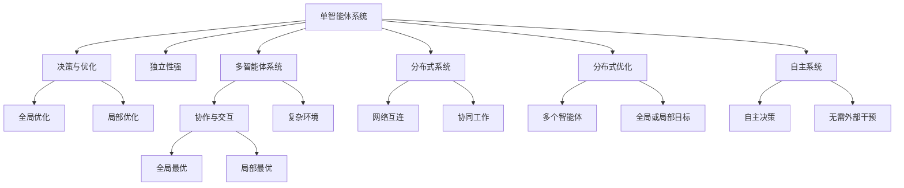

                 

## 1. 背景介绍

在人工智能(AI)的迅猛发展中，智能体(Agent)已成为构建复杂系统的重要基石。单智能体和多智能体系统各自有其独特优势和适用场景。本文将深入探讨单智能体系统与多智能体系统的差异，以及如何更有效地应用这些系统以构建高效、智能的AI解决方案。

### 1.1 问题由来

随着人工智能的广泛应用，智能体（AI Agent）在各个领域发挥着重要作用。在传统的AI应用中，通常采用单智能体（Single-Agent）进行决策与优化。然而，在许多实际应用中，问题变得越来越复杂，单一智能体难以解决。多智能体系统（Multi-Agent System, MAS）应运而生，通过协作和交互，可以更有效地解决这些问题。

### 1.2 问题核心关键点

单智能体系统与多智能体系统的主要区别在于其决策和交互机制。单智能体系统独立做出决策，而不考虑其他智能体的行为。多智能体系统则通过合作或竞争，在交互中优化自己的策略，从而实现全局最优或局部最优。

此外，单智能体和多智能体系统在应用范围、数据需求、算力消耗等方面也有显著差异。理解这些差异对于选择合适的系统模型，并构建高效AI解决方案至关重要。

### 1.3 问题研究意义

本文旨在通过对比单智能体与多智能体系统的异同，帮助AI开发者更有效地设计、实现和部署智能体系统。理解和应用这些系统有助于提升AI系统的性能、可靠性和可扩展性，推动AI技术在各行各业的应用。

## 2. 核心概念与联系

### 2.1 核心概念概述

为更好地理解单智能体系统与多智能体系统的差异，本节将介绍几个密切相关的核心概念：

- **单智能体系统(Single-Agent System)**：由一个独立智能体进行决策与优化，适用于问题简单、独立性强的情况。
- **多智能体系统(Multi-Agent System)**：由多个智能体组成，通过交互和协作解决问题，适用于复杂环境下的优化与决策。
- **合作与竞争**：智能体之间可以合作共同优化目标，也可以竞争以获取更优的资源或结果。
- **分布式系统(Distributed System)**：多个计算节点通过网络互连，协同工作完成共同任务。
- **分布式优化(Distributed Optimization)**：多个智能体通过分布式计算优化全局或局部目标。
- **自主系统(Autonomous System)**：智能体具有自主决策能力，无需外部干预。

这些核心概念之间的逻辑关系可以通过以下Mermaid流程图来展示：



这个流程图展示了许多核心概念及其之间的关联：

1. 单智能体系统独立决策。
2. 多智能体系统通过合作或竞争交互。
3. 分布式系统利用网络互连协同工作。
4. 分布式优化通过多个智能体优化目标。
5. 自主系统具备自主决策能力，无需外部干预。

这些概念共同构成了智能体系统的核心框架，为进一步探讨其差异和应用奠定了基础。

## 3. 核心算法原理 & 具体操作步骤

### 3.1 算法原理概述

单智能体系统与多智能体系统在算法原理上有所不同。单智能体系统主要关注于优化单一目标，而多智能体系统则需要考虑多智能体间的交互与协作。

对于单智能体系统，常见的算法包括强化学习、遗传算法等。强化学习通过试错优化策略，而遗传算法则通过模拟自然进化优化个体。

多智能体系统则引入了协作与竞争机制，如博弈论、协商算法、分布式优化等。博弈论用于建模智能体间的互动与策略选择，协商算法通过谈判达成共识，分布式优化则通过分布式计算优化目标。

### 3.2 算法步骤详解

单智能体系统的算法步骤主要包括：

- **问题建模**：定义问题，设定优化目标。
- **策略定义**：设计决策策略，如随机策略、贪心策略等。
- **参数设置**：确定学习率、迭代次数等。
- **算法迭代**：进行多轮迭代，优化策略。
- **结果评估**：评估优化结果，调整策略。

多智能体系统的算法步骤则包括：

- **环境建模**：构建多智能体交互的环境。
- **智能体设计**：定义智能体的行为与策略。
- **交互模型**：设计智能体间的交互机制。
- **协同优化**：通过协同优化目标。
- **结果评估**：评估系统整体性能。

### 3.3 算法优缺点

单智能体系统与多智能体系统各有优缺点：

**单智能体系统**：
- **优点**：算法简单，易于实现，适用于问题简单、独立性强的情况。
- **缺点**：独立决策可能导致次优解，无法利用其他智能体的信息。

**多智能体系统**：
- **优点**：通过协作与竞争，可以充分利用所有智能体的信息，实现全局最优或局部最优。
- **缺点**：算法复杂，实现难度较大，需要考虑智能体间的交互与协同。

### 3.4 算法应用领域

单智能体系统与多智能体系统在多个领域都有广泛应用：

- **单智能体系统**：适用于机器学习、自然语言处理、图像识别等领域。例如，用单智能体系统进行图像分类、文本生成等任务。
- **多智能体系统**：适用于自动驾驶、网络安全、供应链管理等领域。例如，用多智能体系统进行自动驾驶决策、网络攻击防御等任务。

## 4. 数学模型和公式 & 详细讲解 & 举例说明

### 4.1 数学模型构建

本节将使用数学语言对单智能体系统与多智能体系统的算法进行更加严格的刻画。

假设单智能体系统的优化目标为 $f(x)$，其中 $x$ 为决策变量。其优化问题可表示为：

$$
\min_{x} f(x)
$$

多智能体系统则需考虑多个智能体的优化目标，设智能体 $i$ 的目标函数为 $f_i(x)$，其中 $x$ 为系统状态向量，即所有智能体的决策向量。其优化问题可表示为：

$$
\min_{x} \sum_{i=1}^n f_i(x)
$$

### 4.2 公式推导过程

对于单智能体系统的优化问题，可以使用梯度下降等方法进行求解。设初始决策向量为 $x_0$，则梯度下降更新公式为：

$$
x_{k+1} = x_k - \eta \nabla f(x_k)
$$

其中 $\eta$ 为学习率。

对于多智能体系统的优化问题，则需考虑智能体间的交互与协作。通常采用分布式优化算法，如分布式梯度下降（DGD）、分布式协同梯度下降（DCGD）等。设智能体 $i$ 的决策变量为 $x_i$，系统状态向量为 $x$，则DGD更新公式为：

$$
x_{k+1} = \frac{1}{n} \sum_{i=1}^n \nabla f_i(x_i)
$$

其中 $n$ 为智能体数量。

### 4.3 案例分析与讲解

以自动驾驶系统为例，分析单智能体与多智能体系统的差异：

**单智能体系统**：
- 每个智能体（车辆）独立决策，如速度控制、转向决策等。
- 优化目标为最小化行驶时间或能量消耗。
- 算法可能为强化学习，通过试错优化策略。

**多智能体系统**：
- 多个智能体（车辆）通过交互与协作决策，如车队保持队列、避障等。
- 优化目标为最小化车队总行驶时间或能量消耗。
- 算法可能为分布式优化，通过协同优化系统状态。

## 5. 项目实践：代码实例和详细解释说明

### 5.1 开发环境搭建

在进行单智能体和多智能体系统开发前，我们需要准备好开发环境。以下是使用Python进行PyTorch开发的环境配置流程：

1. 安装Anaconda：从官网下载并安装Anaconda，用于创建独立的Python环境。

2. 创建并激活虚拟环境：
```bash
conda create -n pytorch-env python=3.8 
conda activate pytorch-env
```

3. 安装PyTorch：根据CUDA版本，从官网获取对应的安装命令。例如：
```bash
conda install pytorch torchvision torchaudio cudatoolkit=11.1 -c pytorch -c conda-forge
```

4. 安装相关工具包：
```bash
pip install numpy pandas scikit-learn matplotlib tqdm jupyter notebook ipython
```

完成上述步骤后，即可在`pytorch-env`环境中开始开发。

### 5.2 源代码详细实现

以下分别给出单智能体和多智能体系统的代码实现。

#### 单智能体系统

**环境搭建**：
```python
import torch
import torch.nn as nn
import torch.optim as optim

# 定义优化目标函数
def f(x):
    return x**2

# 定义初始决策变量
x = torch.tensor(0.0, requires_grad=True)

# 定义优化器
optimizer = optim.SGD([x], lr=0.01)

# 定义训练循环
for epoch in range(100):
    optimizer.zero_grad()
    loss = f(x)
    loss.backward()
    optimizer.step()
    print(f"Epoch {epoch+1}, loss: {loss.item()}")
```

#### 多智能体系统

**环境搭建**：
```python
import torch
import torch.nn as nn
import torch.optim as optim
import numpy as np

# 定义智能体数量
n = 3

# 定义智能体决策变量
x = np.zeros((n, 2))

# 定义优化器
optimizer = optim.SGD(x, lr=0.01)

# 定义目标函数
def f(x):
    return np.sum(x**2)

# 定义训练循环
for epoch in range(100):
    optimizer.zero_grad()
    loss = f(x)
    loss.backward()
    optimizer.step()
    print(f"Epoch {epoch+1}, loss: {loss}")
```

**智能体交互**：
```python
# 定义智能体决策变量
x = np.zeros((n, 2))

# 定义优化器
optimizer = optim.SGD(x, lr=0.01)

# 定义目标函数
def f(x):
    return np.sum(x**2)

# 定义训练循环
for epoch in range(100):
    optimizer.zero_grad()
    loss = f(x)
    loss.backward()
    optimizer.step()
    print(f"Epoch {epoch+1}, loss: {loss}")

# 定义智能体间的交互函数
def interaction(x):
    x[0] += x[1]
    x[1] += x[0]

# 在每次训练后进行交互
for epoch in range(100):
    optimizer.zero_grad()
    loss = f(x)
    loss.backward()
    optimizer.step()
    interaction(x)
    print(f"Epoch {epoch+1}, loss: {loss}")
```

### 5.3 代码解读与分析

让我们再详细解读一下关键代码的实现细节：

**单智能体系统**：
- 定义了优化目标函数 $f(x) = x^2$，初始决策变量 $x_0 = 0$。
- 使用SGD优化器进行优化，学习率 $\eta = 0.01$。
- 进行100次迭代训练，每次计算目标函数的梯度并更新决策变量。

**多智能体系统**：
- 定义了3个智能体的决策变量 $x_1, x_2, x_3$。
- 使用SGD优化器进行优化，学习率 $\eta = 0.01$。
- 定义目标函数 $f(x) = \sum_{i=1}^3 x_i^2$。
- 进行100次迭代训练，每次计算目标函数的梯度并更新决策变量。
- 在每次训练后，智能体间的交互函数 `interaction` 被调用，通过交换决策变量来模拟协作。

可以看到，单智能体和多智能体系统的代码实现虽有不同，但核心算法思路基本一致，均通过优化目标函数来更新决策变量。然而，多智能体系统需要考虑智能体间的交互，因此代码实现也更为复杂。

## 6. 实际应用场景

### 6.1 智能交通管理

智能交通管理是多智能体系统的重要应用场景。传统的交通信号控制主要依赖于固定的红绿灯时间，无法应对复杂的交通流量变化。基于多智能体系统的交通信号控制系统，能够实时感知交通流量，动态调整红绿灯时间，提高交通效率。

**系统设计**：
- 多个智能体（交通信号灯）通过通信网络交互，共享交通流量信息。
- 每个智能体根据当前交通流量动态调整红绿灯时间。
- 整个系统的目标是最小化车辆等待时间和交通拥堵。

**技术实现**：
- 使用分布式优化算法，如DCGD，优化系统状态向量。
- 设计智能体间的交互函数，如基于消息传递的协作机制。
- 实时采集交通流量数据，更新系统状态向量，进行优化决策。

### 6.2 供应链管理

供应链管理是另一个多智能体系统的典型应用。传统的供应链管理依赖于人工决策，效率低下，难以应对市场变化。基于多智能体系统的供应链管理系统，能够实时监测市场动态，动态调整生产与库存，提高供应链效率。

**系统设计**：
- 多个智能体（工厂、仓库、运输商）通过通信网络交互，共享市场信息。
- 每个智能体根据当前市场状况动态调整生产与库存。
- 整个系统的目标是最小化成本和提高服务水平。

**技术实现**：
- 使用分布式优化算法，如DGD，优化系统状态向量。
- 设计智能体间的交互函数，如基于合同的协同机制。
- 实时采集市场数据，更新系统状态向量，进行优化决策。

### 6.3 智慧能源系统

智慧能源系统是多智能体系统的另一个重要应用。传统的能源管理依赖于人工监控，效率低下，难以应对能源需求变化。基于多智能体系统的智慧能源管理系统，能够实时感知能源需求，动态调整能源分配，提高能源利用效率。

**系统设计**：
- 多个智能体（发电站、电网、能源用户）通过通信网络交互，共享能源需求信息。
- 每个智能体根据当前能源需求动态调整能源分配。
- 整个系统的目标是最小化能源浪费和提高能源利用效率。

**技术实现**：
- 使用分布式优化算法，如DGD，优化系统状态向量。
- 设计智能体间的交互函数，如基于市场价格的协同机制。
- 实时采集能源需求数据，更新系统状态向量，进行优化决策。

## 7. 工具和资源推荐

### 7.1 学习资源推荐

为了帮助开发者系统掌握单智能体系统与多智能体系统的理论基础和实践技巧，这里推荐一些优质的学习资源：

1. 《强化学习》（Reinforcement Learning）书籍：由Richard S. Sutton和Andrew G. Barto编写，全面介绍了强化学习的基本概念、算法和应用。
2. 《多智能体系统》（Multi-Agent Systems）课程：由MIT OpenCourseWare提供，讲解了多智能体系统的基本原理、算法和应用。
3. 《分布式系统》（Distributed Systems）书籍：由George Coulouris等人编写，全面介绍了分布式系统的设计、实现和应用。
4. 《AIAgent》（AI Agent）博客：由AI专家撰写，介绍了单智能体系统与多智能体系统的差异和应用。
5. 《PyTorch官方文档》：详细介绍了PyTorch的使用方法和优化技巧。

通过对这些资源的学习实践，相信你一定能够快速掌握单智能体系统与多智能体系统的精髓，并用于解决实际的AI问题。

### 7.2 开发工具推荐

高效的开发离不开优秀的工具支持。以下是几款用于单智能体系统与多智能体系统开发的常用工具：

1. PyTorch：基于Python的开源深度学习框架，灵活动态的计算图，适合快速迭代研究。
2. TensorFlow：由Google主导开发的开源深度学习框架，生产部署方便，适合大规模工程应用。
3. Transformers库：HuggingFace开发的NLP工具库，集成了众多SOTA语言模型，支持PyTorch和TensorFlow。
4. Weights & Biases：模型训练的实验跟踪工具，可以记录和可视化模型训练过程中的各项指标。
5. TensorBoard：TensorFlow配套的可视化工具，可实时监测模型训练状态，并提供丰富的图表呈现方式。

合理利用这些工具，可以显著提升单智能体系统与多智能体系统的开发效率，加快创新迭代的步伐。

### 7.3 相关论文推荐

单智能体系统与多智能体技术的发展源于学界的持续研究。以下是几篇奠基性的相关论文，推荐阅读：

1. 《深度强化学习》（Deep Reinforcement Learning）论文：由Ian Goodfellow等人编写，展示了深度学习在强化学习中的应用。
2. 《多智能体系统理论与应用》（Theory and Applications of Multi-Agent Systems）论文：由Multi-Agent Systems Journal出版，涵盖了多智能体系统的基本理论和应用案例。
3. 《分布式优化算法》（Distributed Optimization Algorithms）论文：由IEEE Transactions on Automatic Control出版，介绍了分布式优化算法的基本原理和应用。
4. 《自主系统》（Autonomous Systems）论文：由IEEE Journal on Selected Areas in Communications出版，介绍了自主系统的一般框架和应用场景。

这些论文代表了大规模智能体系统的发展脉络。通过学习这些前沿成果，可以帮助研究者把握学科前进方向，激发更多的创新灵感。

## 8. 总结：未来发展趋势与挑战

### 8.1 总结

本文对单智能体系统与多智能体系统的异同进行了全面系统的介绍。首先阐述了两种系统的核心概念和应用场景，明确了各自的优势和局限性。其次，从原理到实践，详细讲解了单智能体系统与多智能体算法的核心步骤，给出了具体实现代码。同时，本文还广泛探讨了两种系统在智能交通、供应链管理、智慧能源等领域的应用前景，展示了其广阔的发展空间。

通过本文的系统梳理，可以看到，单智能体系统与多智能体系统在构建复杂AI系统中的重要作用。理解这些系统的优劣，选择合适的系统模型，并采用合理的算法和技术手段，是实现高效智能系统设计的基础。

### 8.2 未来发展趋势

展望未来，单智能体系统与多智能体技术将呈现以下几个发展趋势：

1. 系统复杂度增加：随着技术的发展，单智能体和多智能体系统的复杂度将进一步提高，可以处理更复杂、更动态的环境。
2. 协作与竞争机制优化：未来将涌现更多先进的协作与竞争机制，如博弈论、协商算法、自适应学习等，进一步提升系统性能。
3. 多模态融合：未来系统将更多地融合视觉、听觉等多模态信息，实现更全面、更精确的系统感知和决策。
4. 自主与自适应能力增强：未来系统将具备更强的自主决策能力和自适应能力，能够自主学习和优化策略。
5. 模型可解释性提升：未来系统将注重模型的可解释性，使用更简单、更可解释的算法，提升系统的可信度。

以上趋势凸显了单智能体系统与多智能体技术的广阔前景。这些方向的探索发展，必将进一步提升AI系统的性能和应用范围，为人类认知智能的进化带来深远影响。

### 8.3 面临的挑战

尽管单智能体系统与多智能体技术已经取得了瞩目成就，但在迈向更加智能化、普适化应用的过程中，它仍面临诸多挑战：

1. 数据获取与处理：单智能体系统需要大量标注数据，多智能体系统则需处理复杂的交互数据，数据获取与处理成本较高。
2. 模型复杂度控制：单智能体和多智能体系统涉及大量参数和计算，需要有效的模型压缩和优化技术，控制复杂度。
3. 协作与竞争平衡：智能体间的协作与竞争关系需要合理设计，避免因协作不足或竞争过度导致系统失效。
4. 系统可扩展性：系统需要具备良好的可扩展性，能够应对大规模、动态的复杂环境。
5. 模型安全性：系统需要具备良好的安全性，避免模型被恶意攻击和干扰。

正视单智能体系统与多智能体面临的这些挑战，积极应对并寻求突破，将使这些系统走向成熟，更广泛地应用于各个领域。

### 8.4 研究展望

面对单智能体系统与多智能体技术所面临的种种挑战，未来的研究需要在以下几个方面寻求新的突破：

1. 探索更高效的优化算法：开发更高效的分布式优化算法，提高系统训练和推理效率。
2. 引入先验知识与规则：结合符号化知识库和规则库，提升系统推理和决策的准确性。
3. 开发智能体间的通信协议：设计高效、可靠的系统通信协议，确保智能体间的信息交互。
4. 优化多智能体协作机制：设计更合理的协作与竞争机制，提升系统整体性能。
5. 研究跨领域应用：探索单智能体与多智能体系统在更多领域的应用，如医疗、金融等。

这些研究方向的探索，必将引领单智能体系统与多智能体技术的不断进步，为构建高效、智能的AI系统提供有力支持。

## 9. 附录：常见问题与解答

**Q1：单智能体系统与多智能体系统有什么区别？**

A: 单智能体系统独立决策，而多智能体系统通过协作与竞争优化决策。单智能体系统适用于问题简单、独立性强的情况，而多智能体系统适用于复杂环境下的优化与决策。

**Q2：如何选择合适的单智能体或多智能体系统？**

A: 选择单智能体或多智能体系统，需要考虑问题的复杂度、数据可获得性、计算资源等因素。问题简单且独立性强时，选择单智能体系统；问题复杂且需协作时，选择多智能体系统。

**Q3：单智能体系统和多智能体系统的算法有哪些？**

A: 单智能体系统常用的算法包括强化学习、遗传算法等。多智能体系统常用的算法包括分布式优化、博弈论、协商算法等。

**Q4：如何处理多智能体系统中的信息交互？**

A: 多智能体系统中的信息交互需要设计合理的通信协议，如基于消息传递的协作机制、基于合同的协同机制等。此外，还需要考虑智能体间的信誉与信任问题，避免因恶意行为导致系统失效。

**Q5：如何提高单智能体和多智能体系统的训练效率？**

A: 提高训练效率需要从多个方面入手，如使用分布式计算、优化算法、模型压缩等。此外，还可以引入先验知识与规则，提高系统推理和决策的准确性，从而减少训练次数。

通过本文的系统梳理，可以看到，单智能体系统与多智能体系统在构建复杂AI系统中的重要作用。理解这些系统的优劣，选择合适的系统模型，并采用合理的算法和技术手段，是实现高效智能系统设计的基础。未来，随着技术的不断进步，单智能体和多智能体系统将有更广阔的应用前景，推动AI技术在各行各业的发展和应用。

