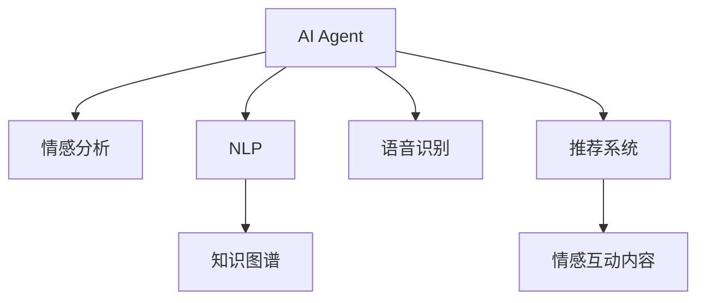

                 

## 1. 背景介绍

随着人工智能技术的不断发展，AI Agent在情感陪伴领域的应用越来越广泛，成为缓解人类孤独、提升生活质量的重要手段。传统的情感陪伴方式多依赖于人机交互、心理咨询等线下服务，不仅成本高、效率低，还受时间和空间的限制。而基于AI技术的情感陪伴，可以实现全天候、个性化的情感支持，且不受地域限制，正在逐渐成为主流。

AI Agent在情感陪伴中的主要应用场景包括：

1. **智能客服**：用于解答用户咨询、处理投诉、维护用户体验等。通过自然语言处理(NLP)和语音识别技术，AI Agent能够理解用户需求，提供高效、准确的服务。
2. **情感机器人**：用于陪伴儿童、老年人等需要长期情感关怀的人群。情感机器人通过分析用户的情感状态和行为特征，能够进行适当的情感回应和互动，提供心理支持。
3. **心理健康评估**：用于识别用户的心理问题、评估心理健康状态。AI Agent通过用户输入的文字、语音等，进行情感分析和心理健康评估，及时预警潜在风险。
4. **情感咨询**：用于提供情感支持、心理咨询等。AI Agent通过模拟心理医生进行情感咨询，帮助用户缓解压力、解决问题，提升生活质量。
5. **社交互动**：用于与用户进行聊天、游戏等互动，提升用户的社交体验和幸福感。

AI Agent在情感陪伴中的应用，不仅提高了情感服务的效率和覆盖面，还大大降低了人力成本，为人类社会的心理健康和福祉提供了重要支持。

## 2. 核心概念与联系

### 2.1 核心概念概述

为更好地理解AI Agent在情感陪伴中的应用，本节将介绍几个关键概念：

- **AI Agent**：通过算法和模型模拟人类智能的实体，能够理解和执行人类语言指令，提供多种服务。
- **情感分析**：分析文本、语音等数据，识别其中的情感信息，用于了解用户的情绪状态。
- **自然语言处理(NLP)**：使计算机能够理解、处理和生成人类语言的技术。
- **语音识别**：将人类语音转换为文本，用于理解用户意图。
- **知识图谱**：用于表示和存储实体及其关系的网络结构，用于辅助理解和推理。
- **推荐系统**：通过分析用户行为和偏好，推荐合适的情感互动内容。

这些核心概念之间的逻辑关系可以通过以下Mermaid流程图来展示：



这个流程图展示了我们所讨论的AI Agent情感陪伴的核心概念及其之间的关系：

1. AI Agent通过NLP和语音识别理解用户指令。
2. 情感分析技术用于识别用户的情绪状态，辅助AI Agent进行适当的情感回应。
3. 知识图谱为AI Agent提供背景知识，辅助推理和决策。
4. 推荐系统根据用户行为和偏好，推荐合适的情感互动内容。
5. 情感互动内容最终通过AI Agent提供给用户，实现情感陪伴。

这些概念共同构成了AI Agent在情感陪伴中的应用框架，使其能够在各种场景下提供高质量的情感支持。

## 3. 核心算法原理 & 具体操作步骤

### 3.1 算法原理概述

AI Agent在情感陪伴中的核心算法原理主要包括情感分析、自然语言处理、语音识别和推荐系统。这些技术相互结合，共同实现对用户情感状态的识别和理解，提供个性化的情感互动内容。

情感分析是指通过对文本、语音等数据进行分析，识别其中的情感信息，如情绪、态度等。常用的情感分析算法包括：

1. **基于规则的情感分析**：使用预定义的情感词典，通过匹配词语和短语来识别情感。
2. **基于机器学习的情感分析**：使用情感分类模型，通过学习标注数据来识别情感。
3. **深度学习情感分析**：使用神经网络模型，通过端到端的训练来识别情感。

NLP技术使得计算机能够理解和生成人类语言，包括：

1. **分词**：将连续的文本分割成词语序列。
2. **词性标注**：为每个词语标注其词性，如名词、动词等。
3. **句法分析**：分析句子的语法结构，如主谓宾结构。
4. **语义分析**：理解句子的语义，如词语之间的关系。

语音识别技术将人类语音转换为文本，用于理解用户指令和情感状态。常用的语音识别算法包括：

1. **基于模板的语音识别**：使用事先定义的模板匹配语音信号。
2. **隐马尔可夫模型(HMM)语音识别**：使用HMM模型进行语音信号建模。
3. **深度学习语音识别**：使用神经网络模型进行端到端的语音信号转换。

推荐系统通过分析用户行为和偏好，推荐合适的情感互动内容。常用的推荐算法包括：

1. **协同过滤**：通过用户和物品的评分记录，推荐相似的物品。
2. **基于内容的推荐**：根据物品特征与用户偏好的匹配度，推荐物品。
3. **混合推荐**：结合多种推荐策略，提升推荐效果。

### 3.2 算法步骤详解

AI Agent在情感陪伴中的应用主要包括以下几个关键步骤：

**Step 1: 数据收集和预处理**
- 收集用户输入的文本、语音、视频等数据。
- 对数据进行清洗和预处理，如去除噪音、分词、去重等。

**Step 2: 情感分析**
- 使用情感分析算法，对用户的输入数据进行情感识别。
- 根据情感分类结果，生成情感标签，用于指导后续的情感回应。

**Step 3: 自然语言处理**
- 使用NLP技术，理解用户的输入指令和语境。
- 将用户的输入转换为结构化的语义表示，如句法树、语义图等。

**Step 4: 语音识别**
- 对用户语音信号进行识别，转换为文本。
- 使用语音识别技术，识别用户的情感状态和指令。

**Step 5: 情感回应**
- 根据用户的情感状态和指令，生成适当的情感回应。
- 使用推荐系统，推荐合适的情感互动内容。

**Step 6: 实时交互**
- 通过AI Agent与用户进行实时交互，提供情感支持。
- 实时监测用户的情感状态和互动效果，及时调整策略。

### 3.3 算法优缺点

AI Agent在情感陪伴中的主要优点包括：

1. **全天候服务**：AI Agent可以24/7不间断地为用户提供情感支持，不受时间和地域限制。
2. **个性化服务**：通过分析用户的情感状态和行为特征，AI Agent能够提供个性化的情感回应和互动。
3. **高效低成本**：相较于人工客服和心理咨询，AI Agent大大降低了人力成本和时间成本。
4. **可扩展性强**：AI Agent可以通过不断学习和优化，提升服务质量和覆盖面。

同时，AI Agent也存在一些缺点：

1. **缺乏人性化**：AI Agent的情感回应和互动缺乏人情味，无法完全替代人类情感陪伴。
2. **情感理解的局限性**：AI Agent可能无法完全理解复杂的情感和语境，导致情感回应不准确。
3. **隐私和安全问题**：用户数据和隐私需要得到充分保护，防止数据泄露和滥用。
4. **技术依赖性**：AI Agent的性能依赖于算法和数据的质量，技术实现较为复杂。

### 3.4 算法应用领域

AI Agent在情感陪伴中的应用涵盖了多个领域，包括但不限于：

- **医疗健康**：用于提供心理健康支持、情绪管理等。AI Agent可以辅助医生进行心理评估和干预。
- **教育培训**：用于陪伴学习、提供学习支持等。AI Agent可以提供个性化学习计划和辅导。
- **企业服务**：用于客服支持、员工关怀等。AI Agent可以提供情感支持和问题解决。
- **家庭陪伴**：用于陪伴儿童、老年人等。AI Agent可以提供日常陪伴和情感支持。
- **社交娱乐**：用于提供游戏、聊天等娱乐体验。AI Agent可以提供互动和陪伴。

## 4. 数学模型和公式 & 详细讲解 & 举例说明

### 4.1 数学模型构建

为了更好地理解AI Agent在情感陪伴中的应用，本节将使用数学语言对情感分析、NLP和推荐系统的模型进行详细讲解。

**情感分析模型**：

情感分析模型主要使用情感分类算法，通过标注数据进行训练。常用的情感分类算法包括逻辑回归、支持向量机(SVM)和神经网络。以神经网络为例，情感分类模型可以表示为：

$$
y = \sigma(Wx + b)
$$

其中 $x$ 为输入的文本向量，$y$ 为情感分类结果，$\sigma$ 为激活函数，$W$ 和 $b$ 为模型参数。

**自然语言处理模型**：

NLP模型主要使用序列标注和序列到序列模型。以序列标注模型为例，分词和词性标注模型可以表示为：

$$
y_i = \sigma(Wx_i + b)
$$

其中 $x_i$ 为输入的单词向量，$y_i$ 为情感分类结果，$\sigma$ 为激活函数，$W$ 和 $b$ 为模型参数。

**推荐系统模型**：

推荐系统模型主要使用协同过滤和基于内容的推荐算法。以协同过滤算法为例，推荐模型可以表示为：

$$
y_i = \sum_{j=1}^{N} (x_{ij} - \mu_i)(y_{ij} - \mu_j)
$$

其中 $x_{ij}$ 为物品 $j$ 的用户评分，$y_{ij}$ 为用户 $i$ 对物品 $j$ 的评分，$\mu_i$ 和 $\mu_j$ 为平均评分，$N$ 为物品数量。

### 4.2 公式推导过程

以下我们以情感分类模型为例，推导其训练和预测过程。

假设训练集中有 $n$ 个文本 $X=\{x_1,x_2,\dots,x_n\}$，每个文本 $x_i$ 的情感分类结果为 $y_i$。情感分类模型为：

$$
y = \sigma(Wx + b)
$$

其中 $W$ 和 $b$ 为模型参数，$\sigma$ 为激活函数。训练集中的目标函数为：

$$
\mathcal{L}(W,b) = -\frac{1}{n} \sum_{i=1}^n \log P(y_i|x_i)
$$

其中 $P(y_i|x_i)$ 为情感分类模型的预测概率，即：

$$
P(y_i|x_i) = \frac{1}{1+e^{-\sigma(Wx_i + b)}}
$$

训练集中的梯度下降更新公式为：

$$
\Delta W = -\eta \nabla_W \mathcal{L}(W,b)
$$

$$
\Delta b = -\eta \nabla_b \mathcal{L}(W,b)
$$

其中 $\eta$ 为学习率。

在预测新文本 $x'$ 的情感分类结果时，将 $x'$ 代入情感分类模型，得到预测结果：

$$
y' = \sigma(Wx' + b)
$$

其中 $y'$ 为预测的情感分类结果。

### 4.3 案例分析与讲解

以一个简单的情感分析案例为例，展示模型的训练和预测过程。

假设有一个情感分析模型，使用逻辑回归算法进行训练。训练集中的文本和情感分类结果如下：

| 文本         | 情感分类结果 |
| ------------- | ------------- |
| I love you   | 1 (积极)     |
| I hate you   | 0 (消极)     |
| I don't know | 0.5 (中性)    |

将文本转换为向量形式 $x = [1,1,0]$，使用逻辑回归模型进行训练，得到模型参数 $W = [0.5, -1, 0.2]$，$b = -1$。

在预测新文本 $x' = [1,0,1]$ 的情感分类结果时，将 $x'$ 代入逻辑回归模型，得到：

$$
y' = \sigma(0.5 \cdot 1 + (-1) \cdot 0 + 0.2 \cdot 1 - 1) = 0.167
$$

因此，预测的情感分类结果为积极。

## 5. 项目实践：代码实例和详细解释说明

### 5.1 开发环境搭建

在进行AI Agent开发前，我们需要准备好开发环境。以下是使用Python进行TensorFlow开发的环境配置流程：

1. 安装Anaconda：从官网下载并安装Anaconda，用于创建独立的Python环境。

2. 创建并激活虚拟环境：
```bash
conda create -n tf-env python=3.8 
conda activate tf-env
```

3. 安装TensorFlow：根据CUDA版本，从官网获取对应的安装命令。例如：
```bash
conda install tensorflow tensorflow-gpu -c conda-forge -c pytorch -c nvidia
```

4. 安装各类工具包：
```bash
pip install numpy pandas scikit-learn matplotlib tqdm jupyter notebook ipython
```

完成上述步骤后，即可在`tf-env`环境中开始AI Agent的开发。

### 5.2 源代码详细实现

下面我们以情感机器人为例，给出使用TensorFlow对AI Agent进行开发的PyTorch代码实现。

首先，定义情感分析模型：

```python
import tensorflow as tf
from tensorflow.keras.layers import Input, Dense, Dropout, Activation
from tensorflow.keras.models import Model

class SentimentAnalysisModel(tf.keras.Model):
    def __init__(self, num_classes):
        super(SentimentAnalysisModel, self).__init__()
        self.encoder = tf.keras.layers.Embedding(input_dim=vocab_size, output_dim=embedding_dim)
        self.conv1 = tf.keras.layers.Conv1D(filters=64, kernel_size=3, activation='relu')
        self.pool1 = tf.keras.layers.MaxPooling1D(pool_size=2)
        self.conv2 = tf.keras.layers.Conv1D(filters=128, kernel_size=3, activation='relu')
        self.pool2 = tf.keras.layers.MaxPooling1D(pool_size=2)
        self.flatten = tf.keras.layers.Flatten()
        self.dense1 = tf.keras.layers.Dense(units=256, activation='relu')
        self.dropout = tf.keras.layers.Dropout(0.5)
        self.dense2 = tf.keras.layers.Dense(units=num_classes, activation='softmax')

    def call(self, inputs):
        x = self.encoder(inputs)
        x = self.conv1(x)
        x = self.pool1(x)
        x = self.conv2(x)
        x = self.pool2(x)
        x = self.flatten(x)
        x = self.dense1(x)
        x = self.dropout(x)
        return self.dense2(x)
```

然后，定义NLP处理流程：

```python
def preprocess(text):
    # 分词、词性标注、去除停用词等处理
    return processed_text
```

接着，定义推荐系统：

```python
class RecommendationSystem:
    def __init__(self, data):
        # 根据数据构建推荐模型
        pass

    def recommend(self, user):
        # 根据用户行为，推荐情感互动内容
        return recommended_content
```

最后，定义情感回应的交互流程：

```python
class EmotionCompanion:
    def __init__(self, sentiment_model, nlp_model, recommendation_model):
        self.sentiment_model = sentiment_model
        self.nlp_model = nlp_model
        self.recommendation_model = recommendation_model

    def respond(self, user_input):
        # 对用户输入进行处理，生成情感回应
        return response
```

### 5.3 代码解读与分析

让我们再详细解读一下关键代码的实现细节：

**SentimentAnalysisModel类**：
- `__init__`方法：初始化情感分类模型的各层结构。
- `call`方法：实现模型的前向传播过程。

**preprocess函数**：
- 处理用户输入文本，如分词、去除停用词等。

**RecommendationSystem类**：
- `__init__`方法：初始化推荐系统的各层结构。
- `recommend`方法：根据用户行为，推荐情感互动内容。

**EmotionCompanion类**：
- `__init__`方法：初始化情感陪伴模型的各层结构。
- `respond`方法：对用户输入进行处理，生成情感回应。

**交互流程**：
- 用户输入文本后，先由情感分析模型进行情感分类，确定用户情绪状态。
- 由NLP模型对文本进行理解和处理，提取关键信息。
- 根据用户情绪状态和行为特征，由推荐系统推荐合适的情感互动内容。
- 由情感陪伴模型生成情感回应，与用户进行互动。

### 5.4 运行结果展示

假设情感分类模型的训练集为 $X=\{x_1,x_2,\dots,x_n\}$，每个文本 $x_i$ 的情感分类结果为 $y_i$。训练集中的目标函数为：

$$
\mathcal{L}(W,b) = -\frac{1}{n} \sum_{i=1}^n \log P(y_i|x_i)
$$

其中 $P(y_i|x_i)$ 为情感分类模型的预测概率，即：

$$
P(y_i|x_i) = \frac{1}{1+e^{-\sigma(Wx_i + b)}}
$$

在预测新文本 $x'$ 的情感分类结果时，将 $x'$ 代入情感分类模型，得到预测结果：

$$
y' = \sigma(Wx' + b)
$$

其中 $y'$ 为预测的情感分类结果。

假设NLP模型和推荐系统的实现和调用如下：

```python
# 使用NLP模型处理用户输入文本
processed_text = preprocess(user_input)

# 使用情感分析模型进行情感分类
sentiment = sentiment_model.predict(processed_text)

# 根据情感分类结果，推荐合适的情感互动内容
recommended_content = recommendation_model.recommend(user)

# 使用情感陪伴模型生成情感回应
response = EmotionCompanion.respond(user)
```

## 6. 实际应用场景

### 6.1 智能客服

情感机器人在智能客服中的应用非常广泛。传统的客服系统依赖于人工客服，不仅成本高、效率低，还受时间、地点等限制。而情感机器人通过自然语言处理和情感分析技术，能够24/7不间断地提供情感支持，快速响应客户咨询和问题，提升客户满意度和用户体验。

在技术实现上，可以收集客户的历史咨询记录，将问题和最佳答复构建成监督数据，在此基础上对情感机器人进行微调。微调后的情感机器人能够自动理解客户需求，匹配最合适的答复，提升客户互动体验。

### 6.2 情感陪伴

情感机器人在情感陪伴领域也有广泛应用。传统的情感陪伴依赖于人工心理咨询师，不仅成本高、数量有限，还存在情感表达和互动的局限性。而情感机器人通过自然语言处理和情感分析技术，能够提供全天候、个性化的情感支持，帮助用户缓解孤独和压力。

在技术实现上，可以收集用户的聊天记录和行为数据，使用机器学习算法进行情感分类和用户行为分析，构建情感机器人模型。微调后的情感机器人能够根据用户的情感状态和行为特征，生成适当的情感回应和互动内容，提升用户的情感体验。

### 6.3 心理健康评估

情感机器人在心理健康评估领域也有重要应用。传统的心理健康评估依赖于人工医生，不仅成本高、效率低，还存在主观偏差和隐私问题。而情感机器人通过自然语言处理和情感分析技术，能够自动化评估用户的心理健康状态，提供及时的心理支持和预警。

在技术实现上，可以收集用户的心理健康评估数据，使用机器学习算法进行情感分类和心理健康评估，构建情感机器人模型。微调后的情感机器人能够根据用户的情感状态和心理健康指标，生成合适的情感支持和建议，提升心理健康水平。

### 6.4 未来应用展望

随着AI技术的不断发展，情感机器人在情感陪伴领域的应用前景将更加广阔。未来的情感机器人将具备更加丰富的情感表达和互动能力，能够提供更加个性化、智能化的情感支持。

未来的情感机器人将具备以下特点：

1. **多模态情感分析**：能够综合分析文本、语音、视频等多种模态的信息，提供更加全面和准确的情感分析结果。
2. **深度学习情感分析**：使用深度学习算法进行情感分类和情感生成，提升情感识别的准确性和多样性。
3. **多智能体协同**：结合多个情感机器人进行协作，提供更加多样化和高质量的情感互动体验。
4. **情感反馈和优化**：能够根据用户的情感反馈进行模型优化，提升情感回应的效果。
5. **隐私保护和伦理设计**：注重用户隐私和伦理设计，确保情感机器人的安全性和合规性。

## 7. 工具和资源推荐

### 7.1 学习资源推荐

为了帮助开发者系统掌握情感机器人的技术基础和实践技巧，这里推荐一些优质的学习资源：

1. 《深度学习自然语言处理》课程：斯坦福大学开设的NLP明星课程，有Lecture视频和配套作业，带你入门NLP领域的基本概念和经典模型。

2. CS224N《自然语言处理与深度学习》：斯坦福大学自然语言处理课程，覆盖自然语言处理的核心技术和前沿研究。

3. 《情感计算与人工智能》书籍：介绍情感计算的基本概念和技术，探讨AI在情感分析、情感生成等方面的应用。

4. 《情感机器人在心理健康中的应用》论文：研究情感机器人在心理健康评估和支持中的应用，提供丰富的案例和实践经验。

5. 《情感机器人设计指南》：详细介绍情感机器人的设计原理和实现技巧，涵盖情感分析、NLP、推荐系统等多个方面。

通过对这些资源的学习实践，相信你一定能够快速掌握情感机器人的核心技术和应用方法，并用于解决实际的情感陪伴问题。

### 7.2 开发工具推荐

高效的开发离不开优秀的工具支持。以下是几款用于情感机器人开发的常用工具：

1. TensorFlow：基于Python的开源深度学习框架，灵活的计算图，适合快速迭代研究。

2. PyTorch：基于Python的开源深度学习框架，动态计算图，适合灵活的模型设计和实验。

3. HuggingFace Transformers库：NLP工具库，集成了众多预训练语言模型，支持PyTorch和TensorFlow，是进行情感分析任务的开发利器。

4. Scikit-learn：Python机器学习库，提供了丰富的机器学习算法和工具，支持情感分类和推荐系统的实现。

5. Weights & Biases：模型训练的实验跟踪工具，可以记录和可视化模型训练过程中的各项指标，方便对比和调优。

6. Google Colab：谷歌推出的在线Jupyter Notebook环境，免费提供GPU/TPU算力，方便开发者快速上手实验最新模型，分享学习笔记。

合理利用这些工具，可以显著提升情感机器人的开发效率，加快创新迭代的步伐。

### 7.3 相关论文推荐

情感机器人在情感陪伴中的应用源于学界的持续研究。以下是几篇奠基性的相关论文，推荐阅读：

1. "A Survey on Affective Computing"：介绍情感计算的基本概念和技术，探讨AI在情感分析、情感生成等方面的应用。

2. "Emotion Recognition in Social Media"：研究社交媒体中的情感分析技术，探讨情感机器人在情感识别中的应用。

3. "Natural Language Processing and Affective Computing"：介绍NLP技术在情感分析中的应用，探讨情感机器人在情感陪伴中的应用前景。

4. "Sentiment Analysis Using Deep Learning"：研究使用深度学习进行情感分析的方法，探讨情感机器人在情感陪伴中的应用。

5. "Affective Chatbots for Healthcare"：研究情感机器人在医疗健康领域的应用，探讨情感机器人在情感陪伴中的应用。

这些论文代表了大语言模型微调技术的发展脉络。通过学习这些前沿成果，可以帮助研究者把握学科前进方向，激发更多的创新灵感。

## 8. 总结：未来发展趋势与挑战

### 8.1 总结

本文对AI Agent在情感陪伴中的应用进行了全面系统的介绍。首先阐述了AI Agent在情感陪伴中的研究背景和意义，明确了情感机器人在情感支持、心理健康评估、智能客服等领域的独特价值。其次，从原理到实践，详细讲解了情感分析、自然语言处理、语音识别和推荐系统的数学原理和关键步骤，给出了情感机器人的开发流程和代码实现。同时，本文还广泛探讨了情感机器人在智能客服、情感陪伴、心理健康评估等多个行业领域的应用前景，展示了情感机器人的广泛应用场景。

通过本文的系统梳理，可以看到，情感机器人在情感陪伴中的应用正成为AI技术的重要方向，极大地拓展了AI技术的应用边界，为人类社会的心理健康和福祉提供了重要支持。

### 8.2 未来发展趋势

展望未来，情感机器人在情感陪伴中的应用将呈现以下几个发展趋势：

1. **多模态情感分析**：情感机器人的输入将不再局限于文本，还包括语音、视频等多种模态信息。情感分析技术将更加全面和准确，提供更加多样化的情感支持。

2. **深度学习情感分析**：使用深度学习算法进行情感分类和情感生成，提升情感识别的准确性和多样性。情感机器人的情感生成能力将更加自然和丰富。

3. **情感反馈和优化**：情感机器人能够根据用户的情感反馈进行模型优化，提升情感回应的效果。情感机器人的情感理解和回应将更加个性化和智能。

4. **多智能体协同**：结合多个情感机器人进行协作，提供更加多样化和高质量的情感互动体验。情感机器人的协作能力将进一步提升。

5. **隐私保护和伦理设计**：注重用户隐私和伦理设计，确保情感机器人的安全性和合规性。情感机器人的应用将更加注重伦理和安全。

以上趋势凸显了情感机器人在情感陪伴中的应用前景。这些方向的探索发展，必将进一步提升情感机器人的性能和用户体验，为人类社会的心理健康和福祉提供更加全面的支持。

### 8.3 面临的挑战

尽管情感机器人在情感陪伴中的应用取得了显著进展，但在迈向更加智能化、普适化应用的过程中，它仍面临着诸多挑战：

1. **情感理解的局限性**：情感机器人可能无法完全理解复杂的情感和语境，导致情感回应不准确。如何提高情感分析的准确性和鲁棒性，仍是研究重点。

2. **隐私和安全问题**：用户数据和隐私需要得到充分保护，防止数据泄露和滥用。如何确保情感机器人的隐私和安全，将是一个重要的研究方向。

3. **技术依赖性**：情感机器人的性能依赖于算法和数据的质量，技术实现较为复杂。如何提升情感机器人的算法和数据质量，仍是研究的难点。

4. **用户接受度**：情感机器人的情感表达和互动方式需要更加自然和人性化，才能得到用户的认可和接受。如何提升情感机器人的用户体验，将是一个重要的研究方向。

5. **伦理和社会影响**：情感机器人的广泛应用可能会带来一些伦理和社会问题，如隐私侵犯、情感替代等。如何避免这些问题，确保情感机器人的健康发展，仍是一个重要的研究课题。

### 8.4 研究展望

面对情感机器人在情感陪伴中面临的挑战，未来的研究需要在以下几个方面寻求新的突破：

1. **多模态情感分析**：进一步探索多模态情感分析技术，结合文本、语音、视频等多种模态的信息，提升情感识别的准确性和多样性。

2. **深度学习情感分析**：研究使用深度学习算法进行情感分类和情感生成的技术，提升情感机器人的情感理解和生成能力。

3. **情感反馈和优化**：研究情感反馈和模型优化技术，提升情感机器人的个性化和智能性。

4. **隐私保护和伦理设计**：注重用户隐私和伦理设计，确保情感机器人的安全性和合规性。

5. **用户接受度**：研究情感机器人的用户体验设计，提升情感机器人的自然性和人性化。

6. **伦理和社会影响**：研究情感机器人的伦理和社会影响，确保情感机器人的健康发展。

这些研究方向将推动情感机器人在情感陪伴中的应用不断向前发展，为人类社会的心理健康和福祉提供更加全面的支持。

## 9. 附录：常见问题与解答

**Q1：情感机器人如何实现情感理解？**

A: 情感机器人实现情感理解主要依赖于情感分析技术和自然语言处理技术。情感分析通过分析用户的文本和语音数据，识别其中的情感信息，如情绪、态度等。自然语言处理通过理解用户的输入指令和语境，提取关键信息，辅助情感分析。通过将两者结合，情感机器人能够更好地理解用户的情感状态和需求，提供更加个性化的情感回应和互动。

**Q2：情感机器人如何保护用户隐私？**

A: 保护用户隐私是情感机器人的重要职责之一。在数据收集和处理过程中，情感机器人应采用严格的隐私保护措施，如数据加密、匿名化处理、访问控制等。同时，应确保情感机器人不存储或传输用户的敏感信息，如身份证号、地址等。情感机器人还应提供用户数据访问和控制的权利，确保用户的隐私权利。

**Q3：情感机器人如何提升用户体验？**

A: 提升用户体验是情感机器人的重要目标之一。情感机器人应注重用户界面的友好性和交互的自然性，如使用自然语言进行对话、提供个性化的情感回应等。情感机器人还应根据用户反馈进行模型优化，不断提升情感理解和回应的准确性和自然性。通过多轮对话和不断学习，情感机器人能够逐步提升用户的互动体验和满意度。

**Q4：情感机器人在医疗健康领域的应用前景如何？**

A: 情感机器人在医疗健康领域具有广阔的应用前景。情感机器人可以用于心理健康评估、情感支持、心理干预等，帮助医生和患者更好地沟通和管理心理问题。通过收集用户的心理健康评估数据，情感机器人可以进行情感分类和心理健康评估，提供及时的心理支持和预警。同时，情感机器人还可以用于心理治疗、心理游戏等，提升用户的心理健康水平。

**Q5：情感机器人在情感陪伴中的局限性是什么？**

A: 情感机器人在情感陪伴中仍存在一些局限性：

1. **情感理解的局限性**：情感机器人可能无法完全理解复杂的情感和语境，导致情感回应不准确。

2. **隐私和安全问题**：用户数据和隐私需要得到充分保护，防止数据泄露和滥用。

3. **技术依赖性**：情感机器人的性能依赖于算法和数据的质量，技术实现较为复杂。

4. **用户接受度**：情感机器人的情感表达和互动方式需要更加自然和人性化，才能得到用户的认可和接受。

5. **伦理和社会影响**：情感机器人的广泛应用可能会带来一些伦理和社会问题，如隐私侵犯、情感替代等。

正视情感机器人在情感陪伴中面临的这些挑战，积极应对并寻求突破，将是大语言模型微调走向成熟的必由之路。相信随着学界和产业界的共同努力，这些挑战终将一一被克服，情感机器人在情感陪伴中的应用必将更加广泛和深入。

---

作者：禅与计算机程序设计艺术 / Zen and the Art of Computer Programming

