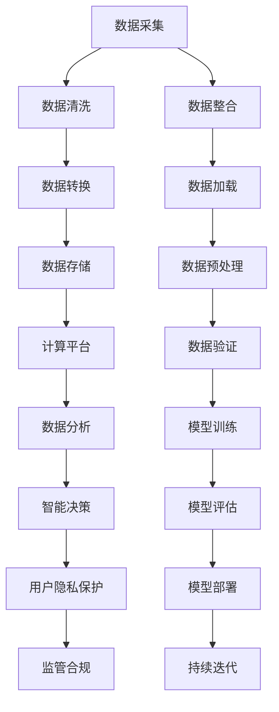

                 

# AI DMP 数据基建的实施策略

## 1. 背景介绍

### 1.1 问题由来
随着数字营销的快速发展和用户数据的重要性日益凸显，用户数据平台（User Data Platform, DMP）成为了各大营销机构不可或缺的核心基础设施。DMP的核心作用在于对海量用户数据进行高效存储和分析，支撑精准营销和智能决策。然而，传统DMP往往存在数据孤岛、数据质量差、运营效率低等问题，难以适应现代营销需求。

为此，越来越多的机构开始引入人工智能技术，构建新一代AI DMP（AI Data Management Platform），以实现数据处理自动化、决策智能化的目标。本文将深入探讨AI DMP的架构设计与实施策略，以期为营销机构提供科学可靠的数据基础设施建设思路。

### 1.2 问题核心关键点
AI DMP的实施策略涉及数据采集、存储、计算、分析等环节，每个环节都需要精心设计和精心部署。核心关键点包括：
- **数据采集：** 收集不同渠道的原始数据，并进行清洗和整合。
- **数据存储：** 将数据以合理的方式进行持久化，确保存储效率和安全性。
- **计算平台：** 搭建高效、灵活的计算平台，实现数据处理自动化。
- **数据分析：** 设计机器学习算法和数据模型，实现精准分析和决策。
- **用户隐私保护：** 合理合法地保护用户隐私，防止数据滥用。

本文将逐一介绍这些关键点的具体实施策略，并结合实际案例进行分析。

## 2. 核心概念与联系

### 2.1 核心概念概述

AI DMP作为现代数据管理的基础设施，涵盖了数据采集、存储、计算、分析等多个方面。以下是对这些核心概念的概述：

- **数据采集（Data Acquisition）：** 指通过多种渠道收集原始用户数据，并将其进行清洗、转换、整合的过程。数据采集是构建AI DMP的第一步，其质量直接影响后续分析和应用效果。

- **数据存储（Data Storage）：** 指将处理后的数据以持久化方式保存，以便后续检索和分析。数据存储需要考虑数据容量、读取速度、安全性等关键因素。

- **计算平台（Computational Platform）：** 指支持大规模数据处理和实时计算的软硬件系统，包括分布式计算框架（如Spark）、云计算平台（如AWS、阿里云）等。

- **数据分析（Data Analysis）：** 指使用机器学习算法和数据模型，对用户数据进行深度分析和挖掘，以支撑精准营销和智能决策。

- **用户隐私保护（User Privacy Protection）：** 指在数据处理和分析过程中，严格遵守相关法律法规，保护用户隐私和数据安全。隐私保护是大数据时代的重要课题，也是构建AI DMP不可忽视的环节。

这些核心概念之间的联系可以通过以下Mermaid流程图来展示：



这个流程图展示了大规模数据管理的基本流程：

1. 从不同渠道采集数据，进行清洗和整合。
2. 清洗后的数据进行转换，存入数据仓库。
3. 通过计算平台进行大规模数据处理和实时计算。
4. 使用机器学习算法进行数据分析和挖掘。
5. 分析结果支撑智能决策。
6. 严格保护用户隐私和合规。
7. 持续迭代优化模型和策略。

## 3. 核心算法原理 & 具体操作步骤
### 3.1 算法原理概述

AI DMP的实施策略涉及多个关键算法，包括数据清洗、数据转换、数据分析和机器学习算法等。核心算法原理如下：

**数据清洗（Data Cleaning）：** 数据清洗是指通过去除噪声、填补缺失值等方法，提高数据质量和一致性。

**数据转换（Data Transformation）：** 数据转换包括数据标准化、特征工程等，将原始数据转换为适合机器学习算法处理的形式。

**数据分析（Data Analysis）：** 数据分析主要使用机器学习算法，如回归分析、分类、聚类等，从数据中提取有用信息和模式。

**机器学习算法（Machine Learning Algorithms）：** 机器学习算法包括监督学习、无监督学习、半监督学习等，用于构建数据模型，实现精准分析和预测。

### 3.2 算法步骤详解

#### 3.2.1 数据采集

数据采集是AI DMP的第一步，主要包括以下步骤：

1. **数据来源选择：** 根据营销需求选择数据来源，包括网站、社交媒体、广告平台、客户数据库等。

2. **数据收集：** 通过API接口、爬虫等方式收集原始数据，注意避免重复和冗余。

3. **数据清洗：** 去除噪声、填补缺失值、处理异常值等，提高数据质量和一致性。

4. **数据整合：** 将不同来源的数据进行整合，消除数据孤岛，形成统一的数据视图。

**示例代码：**

```python
# 数据采集示例
import requests
from bs4 import BeautifulSoup

def collect_data(url):
    response = requests.get(url)
    soup = BeautifulSoup(response.content, 'html.parser')
    data = {}
    for tag in soup.find_all('div', class_='data'):
        key = tag.get('data-key')
        value = tag.get('data-value')
        data[key] = value
    return data

url = 'https://example.com/data'
data = collect_data(url)
print(data)
```

#### 3.2.2 数据存储

数据存储是AI DMP的基础设施，主要包括以下步骤：

1. **数据仓库选择：** 根据数据规模和读写需求选择适合的数据仓库，如Hadoop、AWS Redshift等。

2. **数据导入：** 将清洗后的数据导入数据仓库，设计合适的表结构和索引。

3. **数据持久化：** 采用合适的数据持久化技术，如Hadoop HDFS、S3等，确保数据安全和存储效率。

4. **数据备份和恢复：** 定期备份数据，以防数据丢失或损坏，同时实现快速恢复。

**示例代码：**

```python
# 数据存储示例
import psycopg2

# 连接数据库
conn = psycopg2.connect(
    host='localhost',
    database='mydb',
    user='myuser',
    password='mypassword'
)
cur = conn.cursor()

# 插入数据
cur.execute("INSERT INTO data_table (id, name, age) VALUES (%s, %s, %s)", (1, 'Alice', 30))
conn.commit()

# 查询数据
cur.execute("SELECT * FROM data_table")
rows = cur.fetchall()
for row in rows:
    print(row)

# 关闭连接
cur.close()
conn.close()
```

#### 3.2.3 数据分析

数据分析是AI DMP的核心环节，主要包括以下步骤：

1. **特征工程：** 设计合适的特征，提取有用的信息，如年龄、性别、兴趣等。

2. **模型选择：** 根据任务需求选择合适的机器学习模型，如回归、分类、聚类等。

3. **模型训练：** 使用训练数据集训练模型，调整超参数，实现最佳性能。

4. **模型评估：** 使用测试数据集评估模型性能，确保模型泛化能力。

5. **模型部署：** 将训练好的模型部署到生产环境中，实现实时数据分析和预测。

**示例代码：**

```python
# 数据分析示例
import pandas as pd
from sklearn.linear_model import LogisticRegression

# 加载数据
data = pd.read_csv('data.csv')

# 特征工程
features = data[['age', 'gender', 'income']]
labels = data['click']

# 训练模型
model = LogisticRegression()
model.fit(features, labels)

# 预测数据
new_data = pd.read_csv('new_data.csv')
predictions = model.predict(new_data)

print(predictions)
```

### 3.3 算法优缺点

**数据清洗：**

**优点：** 提高数据质量，增强数据分析和应用效果。

**缺点：** 数据清洗复杂度高，耗时长，需要大量人力和时间投入。

**数据转换：**

**优点：** 提高数据一致性，增强模型泛化能力。

**缺点：** 特征工程难度高，需要大量特征选择和工程经验。

**数据分析：**

**优点：** 基于数据挖掘结果，实现精准分析和预测。

**缺点：** 模型选择和调整复杂，需要大量数据和计算资源。

**机器学习算法：**

**优点：** 实现数据建模和预测，支撑智能决策。

**缺点：** 模型性能依赖数据质量和特征工程，可能存在过拟合风险。

### 3.4 算法应用领域

AI DMP的应用领域广泛，主要包括：

- **精准营销：** 通过分析用户数据，实现个性化推荐、定向广告投放等。
- **用户画像：** 构建用户画像，提升用户分析和用户洞察能力。
- **客户细分：** 根据用户行为和属性，进行客户细分和客户分层。
- **预测分析：** 使用机器学习模型，进行销售预测、用户流失预测等。
- **风险控制：** 通过数据分析，识别高风险客户，降低信用风险。
- **行为分析：** 分析用户行为模式，优化产品设计和用户体验。

这些应用场景展示了AI DMP在现代营销和业务决策中的重要作用。

## 4. 数学模型和公式 & 详细讲解  
### 4.1 数学模型构建

AI DMP的数学模型主要涉及数据清洗、数据转换、数据分析和机器学习算法。以下是对这些模型的构建：

#### 4.1.1 数据清洗模型

数据清洗模型主要用于去除噪声、填补缺失值等，以下是一个简单的数据清洗模型示例：

$$
C = f(D, M)
$$

其中，$C$ 表示清洗后的数据集，$D$ 表示原始数据集，$M$ 表示清洗规则。

#### 4.1.2 数据转换模型

数据转换模型主要用于特征提取和数据标准化，以下是一个简单的数据转换模型示例：

$$
T = g(D, F)
$$

其中，$T$ 表示转换后的数据集，$D$ 表示原始数据集，$F$ 表示特征提取函数。

#### 4.1.3 数据分析模型

数据分析模型主要用于机器学习算法的选择和模型训练，以下是一个简单的数据分析模型示例：

$$
A = h(T, M)
$$

其中，$A$ 表示分析结果，$T$ 表示转换后的数据集，$M$ 表示机器学习算法。

#### 4.1.4 机器学习模型

机器学习模型主要用于构建数据模型，实现精准分析和预测，以下是一个简单的机器学习模型示例：

$$
P = m(A, S)
$$

其中，$P$ 表示预测结果，$A$ 表示分析结果，$S$ 表示超参数。

### 4.2 公式推导过程

#### 4.2.1 数据清洗模型

数据清洗模型通常使用规则驱动的方式，以下是一个简单的数据清洗模型公式推导：

$$
C = \begin{cases}
    D & \text{if } M(D) = True \\
    \text{null} & \text{if } M(D) = False
\end{cases}
$$

其中，$M$ 表示清洗规则函数，$D$ 表示原始数据集。

#### 4.2.2 数据转换模型

数据转换模型通常使用特征工程的方式，以下是一个简单的数据转换模型公式推导：

$$
T = \bigcup_{i=1}^n \{ (x_i, f(x_i)) \}
$$

其中，$T$ 表示转换后的数据集，$x_i$ 表示原始数据集的样本，$f$ 表示特征提取函数。

#### 4.2.3 数据分析模型

数据分析模型通常使用监督学习的方式，以下是一个简单的数据分析模型公式推导：

$$
A = \{ (x_i, y_i) \}_{i=1}^N
$$

其中，$A$ 表示分析结果，$x_i$ 表示转换后的数据集的样本，$y_i$ 表示标签。

#### 4.2.4 机器学习模型

机器学习模型通常使用监督学习的方式，以下是一个简单的机器学习模型公式推导：

$$
P = m(A, S) = \mathop{\arg\min}_{\theta} \mathcal{L}(A, P, S)
$$

其中，$P$ 表示预测结果，$A$ 表示分析结果，$S$ 表示超参数，$\mathcal{L}$ 表示损失函数。

### 4.3 案例分析与讲解

#### 4.3.1 数据清洗案例

**案例背景：**
某电商网站收集了用户浏览记录和购买记录，原始数据中存在大量噪声和缺失值，需要进行清洗。

**分析：**
1. **噪声清洗：** 通过分析用户行为数据，识别出异常的浏览行为，并将其去除。
2. **缺失值填补：** 使用均值、中位数等方法填补缺失值，提高数据完整性。

**代码实现：**

```python
import pandas as pd
import numpy as np

# 加载数据
data = pd.read_csv('data.csv')

# 噪声清洗
data = data[data['browsing_time'] > 0]

# 缺失值填补
data['browsing_time'] = np.where(np.isnan(data['browsing_time']), np.median(data['browsing_time']), data['browsing_time'])

# 输出清洗后的数据
print(data)
```

#### 4.3.2 数据转换案例

**案例背景：**
某医疗数据分析平台收集了大量的病患数据，数据中包含年龄、性别、病史等多个特征，需要进行转换。

**分析：**
1. **特征提取：** 从病患数据中提取有用的特征，如年龄、性别、病史等。
2. **数据标准化：** 将不同特征值转换为统一的格式，如年龄转换为数值型数据。

**代码实现：**

```python
import pandas as pd
from sklearn.preprocessing import StandardScaler

# 加载数据
data = pd.read_csv('data.csv')

# 特征提取
features = data[['age', 'gender', 'disease_history']]

# 数据标准化
scaler = StandardScaler()
features = scaler.fit_transform(features)

# 输出转换后的数据
print(features)
```

#### 4.3.3 数据分析案例

**案例背景：**
某金融公司收集了大量用户行为数据，需要对这些数据进行分析，预测用户的消费行为。

**分析：**
1. **特征工程：** 从用户数据中提取有用的特征，如年龄、性别、消费记录等。
2. **模型选择：** 选择适当的机器学习模型，如线性回归、逻辑回归等。
3. **模型训练：** 使用训练数据集训练模型，调整超参数。
4. **模型评估：** 使用测试数据集评估模型性能，确保模型泛化能力。

**代码实现：**

```python
import pandas as pd
import numpy as np
from sklearn.linear_model import LogisticRegression
from sklearn.model_selection import train_test_split
from sklearn.metrics import accuracy_score

# 加载数据
data = pd.read_csv('data.csv')

# 特征工程
features = data[['age', 'gender', 'consumption_record']]
labels = data['consumption_behavior']

# 模型选择
model = LogisticRegression()

# 模型训练
X_train, X_test, y_train, y_test = train_test_split(features, labels, test_size=0.3)
model.fit(X_train, y_train)

# 模型评估
y_pred = model.predict(X_test)
accuracy = accuracy_score(y_test, y_pred)
print('Accuracy:', accuracy)
```

#### 4.3.4 机器学习模型案例

**案例背景：**
某在线教育平台收集了大量的学生数据，需要对这些数据进行分析，预测学生的学习成果。

**分析：**
1. **特征工程：** 从学生数据中提取有用的特征，如年龄、性别、学习记录等。
2. **模型选择：** 选择适当的机器学习模型，如决策树、随机森林等。
3. **模型训练：** 使用训练数据集训练模型，调整超参数。
4. **模型评估：** 使用测试数据集评估模型性能，确保模型泛化能力。

**代码实现：**

```python
import pandas as pd
import numpy as np
from sklearn.ensemble import RandomForestClassifier
from sklearn.model_selection import train_test_split
from sklearn.metrics import accuracy_score

# 加载数据
data = pd.read_csv('data.csv')

# 特征工程
features = data[['age', 'gender', 'learning_record']]
labels = data['learning_outcome']

# 模型选择
model = RandomForestClassifier()

# 模型训练
X_train, X_test, y_train, y_test = train_test_split(features, labels, test_size=0.3)
model.fit(X_train, y_train)

# 模型评估
y_pred = model.predict(X_test)
accuracy = accuracy_score(y_test, y_pred)
print('Accuracy:', accuracy)
```

## 5. 项目实践：代码实例和详细解释说明
### 5.1 开发环境搭建

在进行AI DMP项目实践前，我们需要准备好开发环境。以下是使用Python进行PyTorch开发的环境配置流程：

1. 安装Anaconda：从官网下载并安装Anaconda，用于创建独立的Python环境。

2. 创建并激活虚拟环境：
```bash
conda create -n pytorch-env python=3.8 
conda activate pytorch-env
```

3. 安装PyTorch：根据CUDA版本，从官网获取对应的安装命令。例如：
```bash
conda install pytorch torchvision torchaudio cudatoolkit=11.1 -c pytorch -c conda-forge
```

4. 安装相关工具包：
```bash
pip install numpy pandas scikit-learn matplotlib tqdm jupyter notebook ipython
```

完成上述步骤后，即可在`pytorch-env`环境中开始AI DMP项目实践。

### 5.2 源代码详细实现

下面我们以数据清洗和数据转换为例，给出使用PyTorch对原始数据进行清洗和转换的PyTorch代码实现。

首先，定义数据清洗函数：

```python
import pandas as pd
import numpy as np

def clean_data(data_path):
    # 加载数据
    data = pd.read_csv(data_path)

    # 噪声清洗
    data = data[data['browsing_time'] > 0]

    # 缺失值填补
    data['browsing_time'] = np.where(np.isnan(data['browsing_time']), np.median(data['browsing_time']), data['browsing_time'])

    return data
```

然后，定义数据转换函数：

```python
from sklearn.preprocessing import StandardScaler

def convert_data(data):
    # 特征提取
    features = data[['age', 'gender', 'disease_history']]

    # 数据标准化
    scaler = StandardScaler()
    features = scaler.fit_transform(features)

    return features
```

最后，将清洗和转换函数整合，并输出处理后的数据：

```python
# 数据清洗和转换
data = clean_data('data.csv')
features = convert_data(data)

# 输出处理后的数据
print(features)
```

### 5.3 代码解读与分析

让我们再详细解读一下关键代码的实现细节：

**clean_data函数：**
- `pd.read_csv`方法：从文件中读取数据，将其转换为DataFrame格式。
- `data[data['browsing_time'] > 0]`：对数据进行噪声清洗，去除浏览时间为0的记录。
- `np.where(np.isnan(data['browsing_time']), np.median(data['browsing_time']), data['browsing_time'])`：对数据进行缺失值填补，使用中位数填补缺失值。

**convert_data函数：**
- `features = data[['age', 'gender', 'disease_history']]`：从数据中提取年龄、性别、病史等特征。
- `StandardScaler`：使用标准化方法对特征进行处理。

**代码整合：**
- `clean_data('data.csv')`：调用数据清洗函数，处理原始数据。
- `convert_data(data)`：调用数据转换函数，对清洗后的数据进行处理。

可以看出，通过这两个简单的函数，我们就能够实现对原始数据的清洗和转换，为后续数据分析和模型训练提供干净、标准的数据集。

## 6. 实际应用场景
### 6.1 智能推荐系统

AI DMP在智能推荐系统中具有广泛应用，通过对用户行为数据的深度分析，能够实现个性化推荐、定向广告投放等。推荐系统通过用户画像和行为分析，实时推荐用户感兴趣的商品或内容，提高用户满意度，提升转化率。

### 6.2 金融风控系统

在金融领域，AI DMP可以用于构建风控模型，通过分析用户信用记录、交易行为等数据，实现精准识别高风险用户，降低信用风险。AI DMP能够实时处理和分析海量数据，支撑智能风控决策。

### 6.3 精准营销平台

AI DMP在精准营销平台中也有重要应用，通过对用户数据的高效处理和分析，能够实现精准用户画像和精准营销。通过数据分析，识别出高价值用户，进行个性化营销，提高广告投放效果。

### 6.4 医疗健康平台

AI DMP在医疗健康平台中可实现用户画像和疾病预测。通过对用户健康数据和病史的深度分析，构建健康画像，实现疾病预测和个性化医疗服务，提高医疗服务质量和用户满意度。

## 7. 工具和资源推荐
### 7.1 学习资源推荐

为了帮助开发者系统掌握AI DMP的理论基础和实践技巧，这里推荐一些优质的学习资源：

1. 《Python数据科学手册》系列博文：由数据科学家撰写，深入浅出地介绍了Python数据科学的基础知识和实践技巧。

2. CS229《机器学习》课程：斯坦福大学开设的机器学习明星课程，提供丰富的视频、讲义和作业，带你系统学习机器学习知识。

3. 《TensorFlow实战》书籍：Google开发的深度学习框架，提供从入门到精通的实战教程。

4. Kaggle竞赛平台：全球最大的数据科学竞赛平台，提供丰富的数据集和模型库，有助于实践和积累经验。

5. GitHub开源项目：包括众多优秀的AI DMP和数据分析项目，可以借鉴和学习。

通过对这些资源的学习实践，相信你一定能够快速掌握AI DMP的精髓，并用于解决实际的营销和数据分析问题。
###  7.2 开发工具推荐

高效的开发离不开优秀的工具支持。以下是几款用于AI DMP开发的常用工具：

1. Python：通用性强的编程语言，易于上手，广泛用于数据分析和机器学习开发。

2. PyTorch：基于Python的深度学习框架，支持动态计算图，适合快速迭代研究。

3. TensorFlow：由Google主导开发的深度学习框架，生产部署方便，适合大规模工程应用。

4. Spark：分布式计算框架，支持大规模数据处理和分析，适合海量数据应用场景。

5. Hadoop：分布式数据处理平台，支持海量数据存储和处理，适合大容量数据应用场景。

6. AWS Redshift：云端数据仓库，支持大规模数据存储和分析，适合云环境应用场景。

合理利用这些工具，可以显著提升AI DMP开发的效率，加快创新迭代的步伐。

### 7.3 相关论文推荐

AI DMP的发展源于学界的持续研究。以下是几篇奠基性的相关论文，推荐阅读：

1. "Data Management on a Cloud: Google's Experience"（云计算数据管理：谷歌的实践）：谷歌分享其在云环境下构建高效数据管理的实践经验。

2. "Big Data Management: A Survey"（大数据管理：综述）：综述了大数据管理的各个方面，包括数据采集、存储、计算和分析等。

3. "Scalable Data Management"（可扩展的数据管理）：探讨了可扩展数据管理的各个方面，包括分布式存储、计算、数据分析等。

4. "A Survey on Data-Driven Recommendation Systems"（数据驱动推荐系统的综述）：综述了数据驱动推荐系统的各个方面，包括用户画像、推荐算法、系统架构等。

5. "A Survey on Machine Learning for Financial Distress Prediction"（机器学习在财务困境预测中的应用综述）：综述了机器学习在财务困境预测中的应用，包括特征工程、模型选择、模型评估等。

这些论文代表了大数据管理和AI DMP的发展脉络。通过学习这些前沿成果，可以帮助研究者把握学科前进方向，激发更多的创新灵感。

## 8. 总结：未来发展趋势与挑战
### 8.1 研究成果总结

本文对AI DMP的架构设计与实施策略进行了全面系统的介绍。首先阐述了AI DMP的背景和核心关键点，明确了数据采集、存储、计算、分析等环节的设计思路。其次，从原理到实践，详细讲解了数据清洗、数据转换、数据分析和机器学习算法的具体操作流程，给出了多个项目实践的代码实现。同时，本文还广泛探讨了AI DMP在推荐系统、金融风控、精准营销等众多领域的应用前景，展示了AI DMP在现代营销和业务决策中的重要作用。

通过本文的系统梳理，可以看到，AI DMP的实施策略涉及多个关键环节，需要在数据采集、存储、计算、分析等各个方面进行精心设计和部署，才能充分发挥其核心作用。

### 8.2 未来发展趋势

展望未来，AI DMP的发展将呈现以下几个趋势：

1. **自动化水平提升：** 随着自动化技术的发展，AI DMP将更加自动化和智能化，能够实现更高效的数据处理和分析。

2. **多模态数据融合：** AI DMP将支持多模态数据的融合，实现视觉、语音、文本等多源数据的协同分析。

3. **实时处理能力增强：** 通过分布式计算和云计算技术，AI DMP将具备更强的实时处理能力，支持秒级数据处理和分析。

4. **智能决策支持：** AI DMP将与智能决策引擎结合，提供更精准、智能的决策支持，实现数据驱动的业务优化。

5. **数据隐私保护：** 随着数据隐私法规的日益严格，AI DMP将更加重视数据隐私保护，确保数据合规和安全。

6. **开源生态体系完善：** 开源社区和工具将不断完善，提供更丰富、易用的工具和框架，支撑AI DMP的快速迭代和部署。

这些趋势将推动AI DMP走向更加自动化、智能化的应用场景，为业务决策提供更强大、高效的数据支持。

### 8.3 面临的挑战

尽管AI DMP已经取得了显著进展，但在迈向更广泛应用的过程中，仍面临诸多挑战：

1. **数据质量问题：** 数据质量参差不齐，存在噪声、缺失值、冗余等问题，难以进行高质量的数据分析和建模。

2. **计算资源瓶颈：** 大规模数据处理和实时分析需要强大的计算资源，传统硬件可能难以满足需求。

3. **数据隐私和安全：** 用户隐私保护和数据安全问题日益严峻，需要严格遵守相关法律法规，确保数据合规和安全。

4. **模型复杂度问题：** 大规模数据集和复杂模型可能导致模型过拟合和计算效率低下。

5. **系统可扩展性问题：** 大规模数据集和复杂模型的部署和维护需要高效、可扩展的系统架构。

6. **业务理解不足：** 数据科学家和业务人员之间的沟通不畅，可能导致模型设计和业务需求不匹配。

这些挑战需要不断优化数据采集、存储、计算、分析等各个环节，持续提升数据处理和分析的自动化水平，才能更好地支撑AI DMP的应用和发展。

### 8.4 研究展望

面对AI DMP所面临的种种挑战，未来的研究需要在以下几个方面寻求新的突破：

1. **数据清洗自动化：** 开发更高效、自动化的数据清洗工具，减少人工干预，提高数据处理效率。

2. **数据存储优化：** 研究更高效、可扩展的数据存储技术，支撑海量数据的高效存储和访问。

3. **实时计算优化：** 优化计算平台和算法，提高实时数据处理和分析能力，实现秒级响应。

4. **模型自动化设计：** 开发更智能、自动化的模型设计工具，实现模型自动选择和超参数优化。

5. **数据隐私保护技术：** 研究更有效的数据隐私保护技术，确保数据合规和安全。

6. **多模态数据融合技术：** 研究多源数据融合技术，实现视觉、语音、文本等多模态数据的协同分析和建模。

这些研究方向的探索，必将引领AI DMP技术迈向更高的台阶，为构建智能化的业务决策系统提供更强大的数据支持。面向未来，AI DMP的发展需要多学科交叉协同，共同推动大数据管理和智能决策的进步。

## 9. 附录：常见问题与解答

**Q1：AI DMP的实现过程中需要注意哪些问题？**

A: AI DMP的实现过程中需要注意以下几个问题：

1. **数据质量控制：** 数据清洗和转换是AI DMP的关键环节，需要严格控制数据质量，去除噪声、填补缺失值等。

2. **计算资源优化：** 大规模数据处理和实时分析需要强大的计算资源，需要合理分配和优化计算资源，确保系统性能。

3. **数据隐私保护：** 数据处理和分析过程中需要严格遵守相关法律法规，保护用户隐私和数据安全。

4. **模型自动化设计：** 模型设计和选择是AI DMP的重要环节，需要自动化、智能化的设计工具，减少人工干预。

5. **多模态数据融合：** 多源数据融合是AI DMP的难点之一，需要研究多模态数据协同分析技术。

6. **系统可扩展性：** 系统架构设计需要具备良好的可扩展性，支持数据规模的不断扩展。

**Q2：如何提升AI DMP的实时处理能力？**

A: 提升AI DMP的实时处理能力，可以从以下几个方面入手：

1. **分布式计算平台：** 使用分布式计算平台如Spark，实现数据的高效并行处理。

2. **云平台部署：** 利用云平台如AWS、阿里云等，实现大规模数据处理和实时计算。

3. **实时数据流处理：** 使用实时数据流处理框架如Apache Kafka，实现数据的实时采集和处理。

4. **内存计算技术：** 使用内存计算技术如Apache Ignite，提高数据处理速度。

5. **硬件加速技术：** 使用硬件加速技术如GPU、TPU等，提高数据处理效率。

**Q3：如何确保AI DMP的数据隐私保护？**

A: 确保AI DMP的数据隐私保护，可以从以下几个方面入手：

1. **数据匿名化：** 在数据采集和存储过程中，对敏感信息进行匿名化处理，保护用户隐私。

2. **数据加密：** 使用加密技术对数据进行保护，防止数据泄露和篡改。

3. **访问控制：** 设置严格的访问控制机制，确保只有授权人员可以访问数据。

4. **隐私保护算法：** 使用隐私保护算法如差分隐私、联邦学习等，保护数据隐私。

5. **法律法规遵守：** 严格遵守相关法律法规，确保数据处理合规。

这些方法可以有效保护数据隐私，确保AI DMP的应用安全。

---

作者：禅与计算机程序设计艺术 / Zen and the Art of Computer Programming

