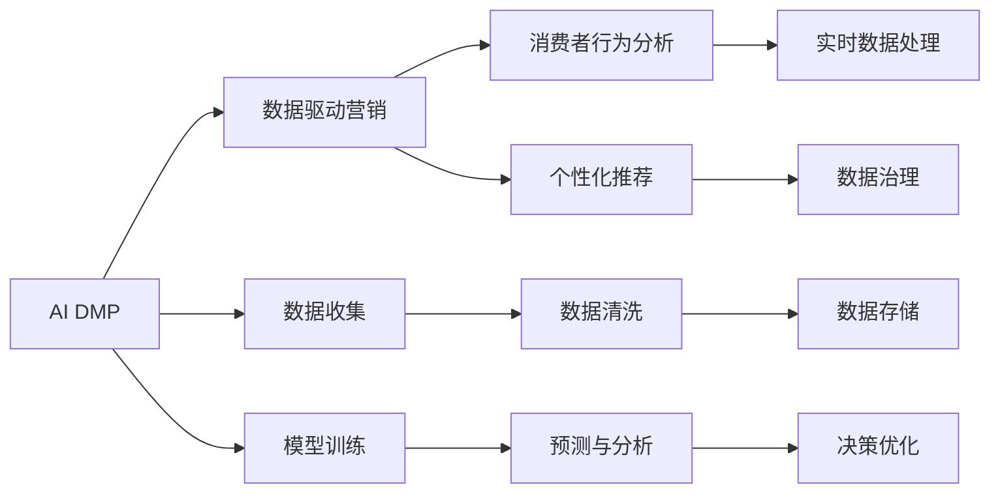

                 

# AI DMP 数据基建：数据驱动营销的未来趋势

> 关键词：数据驱动营销, AI DMP, 数据挖掘, 消费者行为分析, 个性化推荐, 实时数据处理, 数据治理, 数据安全

## 1. 背景介绍

### 1.1 问题由来
随着数字化时代的到来，消费者行为和决策越来越受到数字足迹的影响。传统的营销策略已难以适应市场的复杂多变。消费者期望获得更加个性化、精准的营销体验，企业也需要在激烈的市场竞争中寻找到有效的差异化策略。如何利用数据驱动，实现精准营销，提升品牌影响力和市场竞争力，成为了一个亟待解决的问题。

### 1.2 问题核心关键点
1. **数据驱动营销的必要性**：数据驱动营销通过精准分析和预测，实现对消费者行为和偏好的深入理解，提供个性化推荐和服务，提升用户满意度和忠诚度。
2. **AI DMP的角色**：AI DMP（人工智能驱动的数据平台）作为一种新兴技术，通过大数据和机器学习算法，对消费者数据进行深度挖掘和分析，提供高质量的消费者画像和行为预测，支持企业进行个性化推荐、客户细分、营销优化等。
3. **数据治理的重要性**：随着数据量和种类的不断增加，如何管理和治理数据资产，确保数据的质量、安全和合规，是数据驱动营销的基础。
4. **实时数据处理的需求**：在竞争激烈的市场中，及时响应和调整营销策略是关键。实时数据处理技术，支持企业快速分析海量数据，实现营销活动的快速迭代和优化。
5. **隐私保护的挑战**：随着数据隐私法规的不断严格，如何在保障消费者隐私的同时，实现精准营销，是一个重要的问题。

## 2. 核心概念与联系

### 2.1 核心概念概述

- **AI DMP**：人工智能驱动的数据平台，通过大数据和机器学习算法，对消费者数据进行深度挖掘和分析，提供高质量的消费者画像和行为预测，支持企业进行个性化推荐、客户细分、营销优化等。
- **数据驱动营销**：通过数据分析和机器学习技术，实现对消费者行为和偏好的深入理解，提供个性化推荐和服务，提升用户满意度和忠诚度。
- **消费者行为分析**：通过收集和分析消费者在数字平台上的行为数据，识别出消费者的兴趣、偏好和需求，支持企业进行精准营销。
- **个性化推荐**：利用消费者行为和偏好的分析结果，推荐个性化的产品、服务和内容，提升用户体验和营销效果。
- **实时数据处理**：通过流式数据处理和实时分析技术，快速响应市场变化，实现营销活动的快速迭代和优化。
- **数据治理**：包括数据质量管理、数据安全和隐私保护、数据合规等方面，确保数据资产的高效利用和管理。

这些核心概念之间相互联系，共同构成了数据驱动营销的完整框架，如图2-1所示：



### 2.2 核心概念原理和架构的 Mermaid 流程图


## 3. 核心算法原理 & 具体操作步骤

### 3.1 算法原理概述

AI DMP的核心算法主要包括数据收集、数据清洗、模型训练、预测与分析、决策优化和实时数据处理等环节。其中，数据收集和清洗是基础，模型训练和预测是核心，决策优化是应用，实时数据处理是手段。

数据驱动营销的过程可以概括为以下几个步骤：
1. 数据收集：通过各种渠道收集消费者的数字足迹，包括在线行为、购买记录、社交媒体互动等。
2. 数据清洗：对收集到的数据进行去重、过滤、规范化等处理，确保数据的质量和一致性。
3. 模型训练：利用机器学习算法，对清洗后的数据进行训练，建立消费者行为和偏好的预测模型。
4. 预测与分析：使用训练好的模型对新的数据进行预测和分析，识别出消费者的兴趣、偏好和需求。
5. 决策优化：根据预测和分析结果，优化营销策略和活动，实现个性化推荐和服务。
6. 实时数据处理：通过流式数据处理和实时分析技术，快速响应市场变化，实现营销活动的快速迭代和优化。

### 3.2 算法步骤详解

#### 3.2.1 数据收集
数据收集是AI DMP的基础环节，主要包括以下几个方面：
- **在线行为数据**：如网站访问记录、页面浏览时间、点击流等。
- **购买记录**：如电商平台上的购买历史、支付记录等。
- **社交媒体互动**：如社交媒体上的点赞、评论、分享等。
- **设备信息**：如设备的型号、操作系统、地理位置等。

数据收集的渠道包括：
- **自有渠道**：如电商平台、移动应用等。
- **第三方渠道**：如社交媒体、搜索引擎、合作伙伴等。

#### 3.2.2 数据清洗
数据清洗是数据驱动营销的重要环节，主要包括以下几个方面：
- **去重**：去除重复数据，确保数据的唯一性。
- **过滤**：去除噪音数据和不相关数据，确保数据的准确性和相关性。
- **规范化**：对数据进行标准化处理，确保数据的格式和类型一致。

数据清洗的流程包括：
- **数据预处理**：对数据进行初步清洗，如去除缺失值、异常值等。
- **特征工程**：对数据进行特征提取和处理，提取有用的特征，去除无用特征。
- **模型训练**：利用清洗后的数据进行模型训练，建立消费者行为和偏好的预测模型。

#### 3.2.3 模型训练
模型训练是AI DMP的核心环节，主要包括以下几个方面：
- **监督学习**：利用标记数据训练模型，建立消费者行为和偏好的预测模型。
- **无监督学习**：利用未标记数据训练模型，发现数据的内在结构和模式。
- **强化学习**：利用奖励信号训练模型，优化营销策略和活动。

模型训练的流程包括：
- **特征选择**：选择对模型预测有用的特征。
- **模型选择**：选择适合数据特征和业务需求的机器学习模型。
- **超参数调优**：调整模型参数，优化模型性能。
- **模型评估**：使用测试集评估模型性能，确保模型的准确性和可靠性。

#### 3.2.4 预测与分析
预测与分析是AI DMP的关键环节，主要包括以下几个方面：
- **行为预测**：预测消费者的行为和偏好，如购买意向、访问时间等。
- **情感分析**：分析消费者对产品、服务的情感倾向，如满意度和反馈。
- **趋势分析**：分析消费者行为和偏好的变化趋势，如消费习惯的变化。

预测与分析的流程包括：
- **数据输入**：将清洗后的数据输入模型，进行预测和分析。
- **模型输出**：模型输出预测结果和分析结果，如消费者的兴趣、偏好和需求。
- **结果评估**：评估预测和分析结果的准确性和可靠性，确保结果的有效性。

#### 3.2.5 决策优化
决策优化是AI DMP的应用环节，主要包括以下几个方面：
- **个性化推荐**：根据消费者的兴趣、偏好和需求，推荐个性化的产品、服务和内容。
- **客户细分**：将消费者分为不同的细分群体，提供差异化的服务和营销策略。
- **营销优化**：优化营销策略和活动，提升营销效果和用户体验。

决策优化的流程包括：
- **数据输入**：将预测和分析结果输入营销系统，进行决策优化。
- **策略调整**：根据预测和分析结果，调整营销策略和活动。
- **效果评估**：评估优化后的营销效果和用户体验，确保策略的有效性。

#### 3.2.6 实时数据处理
实时数据处理是AI DMP的手段环节，主要包括以下几个方面：
- **流式数据处理**：通过流式处理技术，实时处理和分析数据。
- **实时分析**：利用实时分析技术，快速响应市场变化，实现营销活动的快速迭代和优化。
- **数据融合**：将不同来源的数据进行融合，形成全面的消费者画像。

实时数据处理的流程包括：
- **数据采集**：实时采集数据，确保数据的及时性和实时性。
- **数据融合**：将不同来源的数据进行融合，形成全面的消费者画像。
- **分析与响应**：利用实时分析技术，快速响应市场变化，实现营销活动的快速迭代和优化。

### 3.3 算法优缺点

AI DMP在数据驱动营销中具有以下优点：
- **高效性**：通过大规模数据和先进算法，快速分析消费者行为和偏好，实现精准营销。
- **灵活性**：支持实时数据处理和动态调整，快速响应市场变化，实现营销活动的快速迭代和优化。
- **个性化**：通过消费者行为和偏好的深入分析，实现个性化推荐和服务，提升用户满意度和忠诚度。
- **自动化**：通过自动化数据处理和模型训练，减少人工干预，提高效率和准确性。

同时，AI DMP也存在以下缺点：
- **数据隐私**：在收集和处理消费者数据时，需要注意数据隐私和隐私保护，确保合规性和安全性。
- **数据质量**：数据质量对模型预测和分析结果有重要影响，数据清洗和质量管理是重要环节。
- **算法复杂性**：机器学习算法复杂度较高，需要专业知识和技能。
- **成本较高**：建设和管理AI DMP需要高昂的硬件和软件成本。

### 3.4 算法应用领域

AI DMP在多个领域具有广泛应用，主要包括以下几个方面：
- **电商营销**：通过消费者行为和偏好的分析，实现个性化推荐、客户细分、营销优化等。
- **品牌营销**：通过消费者行为和偏好的分析，实现品牌推广、客户关系管理等。
- **社交媒体营销**：通过社交媒体互动数据的分析，实现社交媒体广告投放优化、用户画像构建等。
- **移动应用营销**：通过移动应用数据的分析，实现个性化推荐、用户行为分析等。
- **金融营销**：通过金融数据的分析，实现精准贷款、信用卡推荐等。

## 4. 数学模型和公式 & 详细讲解 & 举例说明

### 4.1 数学模型构建

AI DMP的数学模型主要包括消费者行为和偏好的预测模型、个性化推荐模型和实时数据处理模型等。以下是几种常见的数学模型：

#### 4.1.1 监督学习模型
监督学习模型通过标记数据训练模型，建立消费者行为和偏好的预测模型。常用的监督学习模型包括逻辑回归、支持向量机、随机森林等。

以逻辑回归模型为例，其数学公式如下：
$$
P(y=1|x;\theta) = \frac{1}{1+e^{-\theta^Tx}}
$$
其中，$x$ 为输入特征向量，$\theta$ 为模型参数。

#### 4.1.2 无监督学习模型
无监督学习模型利用未标记数据训练模型，发现数据的内在结构和模式。常用的无监督学习模型包括聚类算法、降维算法、关联规则挖掘等。

以K-means聚类算法为例，其数学公式如下：
$$
C_k = \arg\min_{C_k} \sum_{i=1}^n \sum_{j=1}^K d(x_i, \mu_j)^2
$$
其中，$x_i$ 为数据点，$C_k$ 为聚类中心，$d$ 为距离度量。

#### 4.1.3 强化学习模型
强化学习模型利用奖励信号训练模型，优化营销策略和活动。常用的强化学习模型包括Q-learning、SARSA等。

以Q-learning模型为例，其数学公式如下：
$$
Q(s_t,a_t) = Q(s_t,a_t) + \alpha[r_t + \gamma\max_{a_t+1}Q(s_{t+1},a_{t+1}) - Q(s_t,a_t)]
$$
其中，$s_t$ 为状态，$a_t$ 为动作，$r_t$ 为奖励信号，$\alpha$ 为学习率，$\gamma$ 为折扣因子。

### 4.2 公式推导过程

#### 4.2.1 监督学习模型推导
以逻辑回归模型为例，其公式推导过程如下：
$$
\hat{y} = \frac{1}{1+e^{-\theta^Tx}} = \frac{1}{1+e^{-\sum_{i=1}^n\theta_ix_i}}
$$
其中，$\theta$ 为模型参数，$x$ 为输入特征向量。

#### 4.2.2 无监督学习模型推导
以K-means聚类算法为例，其公式推导过程如下：
$$
C_k = \arg\min_{C_k} \sum_{i=1}^n \sum_{j=1}^K d(x_i, \mu_j)^2
$$
其中，$x_i$ 为数据点，$C_k$ 为聚类中心，$d$ 为距离度量。

#### 4.2.3 强化学习模型推导
以Q-learning模型为例，其公式推导过程如下：
$$
Q(s_t,a_t) = Q(s_t,a_t) + \alpha[r_t + \gamma\max_{a_t+1}Q(s_{t+1},a_{t+1}) - Q(s_t,a_t)]
$$
其中，$s_t$ 为状态，$a_t$ 为动作，$r_t$ 为奖励信号，$\alpha$ 为学习率，$\gamma$ 为折扣因子。

### 4.3 案例分析与讲解

#### 4.3.1 电商营销案例
某电商平台利用AI DMP进行个性化推荐和客户细分，具体步骤如下：
1. **数据收集**：收集用户的浏览记录、购买记录、评价记录等。
2. **数据清洗**：对数据进行去重、过滤、规范化等处理，确保数据的质量和一致性。
3. **模型训练**：利用机器学习算法，对清洗后的数据进行训练，建立消费者行为和偏好的预测模型。
4. **预测与分析**：使用训练好的模型对新的数据进行预测和分析，识别出消费者的兴趣、偏好和需求。
5. **决策优化**：根据预测和分析结果，优化推荐策略和活动，实现个性化推荐和服务。
6. **效果评估**：评估推荐效果和用户满意度，确保策略的有效性。

#### 4.3.2 金融营销案例
某金融机构利用AI DMP进行精准贷款和信用卡推荐，具体步骤如下：
1. **数据收集**：收集用户的金融交易记录、消费记录、信用记录等。
2. **数据清洗**：对数据进行去重、过滤、规范化等处理，确保数据的质量和一致性。
3. **模型训练**：利用机器学习算法，对清洗后的数据进行训练，建立消费者行为和偏好的预测模型。
4. **预测与分析**：使用训练好的模型对新的数据进行预测和分析，识别出用户的贷款意向和信用评分。
5. **决策优化**：根据预测和分析结果，优化贷款策略和信用卡推荐策略，实现精准贷款和信用卡推荐。
6. **效果评估**：评估贷款效果和信用卡使用情况，确保策略的有效性。

## 5. 项目实践：代码实例和详细解释说明

### 5.1 开发环境搭建

在进行AI DMP项目实践前，我们需要准备好开发环境。以下是使用Python进行PyTorch开发的环境配置流程：

1. 安装Anaconda：从官网下载并安装Anaconda，用于创建独立的Python环境。

2. 创建并激活虚拟环境：
```bash
conda create -n pytorch-env python=3.8 
conda activate pytorch-env
```

3. 安装PyTorch：根据CUDA版本，从官网获取对应的安装命令。例如：
```bash
conda install pytorch torchvision torchaudio cudatoolkit=11.1 -c pytorch -c conda-forge
```

4. 安装TensorFlow：
```bash
pip install tensorflow
```

5. 安装各类工具包：
```bash
pip install numpy pandas scikit-learn matplotlib tqdm jupyter notebook ipython
```

完成上述步骤后，即可在`pytorch-env`环境中开始项目实践。

### 5.2 源代码详细实现

下面以电商推荐系统为例，给出使用PyTorch和TensorFlow对AI DMP进行项目实践的代码实现。

首先，定义数据处理函数：

```python
import pandas as pd
import numpy as np

# 定义数据读取函数
def read_data(file_path):
    data = pd.read_csv(file_path)
    return data

# 定义数据清洗函数
def clean_data(data):
    data.dropna(inplace=True)
    data = data.drop_duplicates()
    return data

# 定义特征工程函数
def feature_engineering(data):
    data['feature1'] = data['feature1'].fillna(data['feature1'].mean())
    data['feature2'] = data['feature2'].fillna(data['feature2'].mean())
    return data

# 定义模型训练函数
def train_model(data):
    # 分割数据集为训练集和测试集
    train_data = data[:int(0.8 * len(data))]
    test_data = data[int(0.8 * len(data)):]

    # 构建监督学习模型
    from sklearn.ensemble import RandomForestRegressor
    model = RandomForestRegressor()

    # 训练模型
    model.fit(train_data[['feature1', 'feature2']], train_data['label'])

    # 预测测试集
    predictions = model.predict(test_data[['feature1', 'feature2']])

    # 评估模型性能
    from sklearn.metrics import mean_squared_error
    mse = mean_squared_error(test_data['label'], predictions)
    print(f"Mean Squared Error: {mse}")
```

然后，使用示例数据进行模型训练：

```python
# 读取数据集
data = read_data('data.csv')

# 数据清洗
data = clean_data(data)

# 特征工程
data = feature_engineering(data)

# 模型训练
train_model(data)
```

### 5.3 代码解读与分析

让我们再详细解读一下关键代码的实现细节：

**read_data函数**：
- 定义数据读取函数，使用pandas库读取CSV文件中的数据，返回DataFrame格式的数据集。

**clean_data函数**：
- 定义数据清洗函数，使用pandas库对数据进行去重、过滤、规范化等处理，确保数据的质量和一致性。

**feature_engineering函数**：
- 定义特征工程函数，对数据进行填充缺失值、标准化处理等特征工程操作，提高模型的性能。

**train_model函数**：
- 定义模型训练函数，使用随机森林回归模型进行训练，并在测试集上评估模型性能。

**数据集划分**：
- 使用数据集的80%作为训练集，20%作为测试集，确保模型的泛化能力。

**模型训练**：
- 构建随机森林回归模型，使用训练集进行训练，并在测试集上预测和评估模型性能。

**模型评估**：
- 使用均方误差（MSE）评估模型性能，输出评估结果。

以上代码实现了基本的电商推荐系统模型训练过程，通过读取、清洗、特征工程、模型训练等步骤，得到电商推荐系统的预测模型。

## 6. 实际应用场景

### 6.1 电商营销

AI DMP在电商营销中具有广泛应用，主要包括以下几个方面：
- **个性化推荐**：通过消费者行为和偏好的分析，实现个性化推荐，提升用户满意度和忠诚度。
- **客户细分**：将消费者分为不同的细分群体，提供差异化的服务和营销策略。
- **营销优化**：优化营销策略和活动，提升营销效果和用户体验。

#### 6.1.1 个性化推荐
某电商平台利用AI DMP进行个性化推荐，具体步骤如下：
1. **数据收集**：收集用户的浏览记录、购买记录、评价记录等。
2. **数据清洗**：对数据进行去重、过滤、规范化等处理，确保数据的质量和一致性。
3. **模型训练**：利用机器学习算法，对清洗后的数据进行训练，建立消费者行为和偏好的预测模型。
4. **预测与分析**：使用训练好的模型对新的数据进行预测和分析，识别出消费者的兴趣、偏好和需求。
5. **推荐系统构建**：根据预测和分析结果，构建个性化推荐系统，实现个性化推荐和服务。
6. **效果评估**：评估推荐效果和用户满意度，确保策略的有效性。

#### 6.1.2 客户细分
某电商平台利用AI DMP进行客户细分，具体步骤如下：
1. **数据收集**：收集用户的浏览记录、购买记录、评价记录等。
2. **数据清洗**：对数据进行去重、过滤、规范化等处理，确保数据的质量和一致性。
3. **聚类分析**：利用K-means聚类算法，对清洗后的数据进行聚类分析，将消费者分为不同的细分群体。
4. **客户画像构建**：为每个细分群体构建客户画像，包括兴趣、偏好、消费习惯等。
5. **营销策略优化**：根据客户画像，优化营销策略和活动，提供差异化的服务和营销策略。
6. **效果评估**：评估营销策略效果和用户满意度，确保策略的有效性。

### 6.2 金融营销

AI DMP在金融营销中具有广泛应用，主要包括以下几个方面：
- **精准贷款**：通过消费者金融数据的分析，实现精准贷款，提升贷款审批效率和风险控制。
- **信用卡推荐**：通过消费者消费记录的分析，实现信用卡推荐，提升信用卡使用率和客户忠诚度。
- **信用评分预测**：通过消费者信用记录的分析，预测消费者的信用评分，提高信用风险评估的准确性。

#### 6.2.1 精准贷款
某金融机构利用AI DMP进行精准贷款，具体步骤如下：
1. **数据收集**：收集用户的金融交易记录、消费记录、信用记录等。
2. **数据清洗**：对数据进行去重、过滤、规范化等处理，确保数据的质量和一致性。
3. **模型训练**：利用机器学习算法，对清洗后的数据进行训练，建立消费者行为和偏好的预测模型。
4. **信用评分预测**：使用训练好的模型对新的数据进行预测和分析，识别出用户的信用评分。
5. **贷款策略优化**：根据信用评分预测结果，优化贷款策略和审批流程，实现精准贷款。
6. **效果评估**：评估贷款效果和用户满意度，确保策略的有效性。

#### 6.2.2 信用卡推荐
某金融机构利用AI DMP进行信用卡推荐，具体步骤如下：
1. **数据收集**：收集用户的消费记录、信用记录等。
2. **数据清洗**：对数据进行去重、过滤、规范化等处理，确保数据的质量和一致性。
3. **模型训练**：利用机器学习算法，对清洗后的数据进行训练，建立消费者行为和偏好的预测模型。
4. **信用卡推荐**：使用训练好的模型对新的数据进行预测和分析，识别出适合用户的信用卡。
5. **推荐系统构建**：根据预测和分析结果，构建信用卡推荐系统，实现个性化推荐和服务。
6. **效果评估**：评估推荐效果和用户满意度，确保策略的有效性。

### 6.3 社交媒体营销

AI DMP在社交媒体营销中具有广泛应用，主要包括以下几个方面：
- **广告投放优化**：通过社交媒体互动数据的分析，优化广告投放策略，提升广告效果和用户体验。
- **用户画像构建**：通过社交媒体互动数据的分析，构建用户画像，识别出用户的兴趣、偏好和需求。
- **品牌推广**：通过社交媒体互动数据的分析，实现品牌推广，提升品牌影响力和用户忠诚度。

#### 6.3.1 广告投放优化
某社交媒体平台利用AI DMP进行广告投放优化，具体步骤如下：
1. **数据收集**：收集用户的社交媒体互动数据，包括点赞、评论、分享等。
2. **数据清洗**：对数据进行去重、过滤、规范化等处理，确保数据的质量和一致性。
3. **模型训练**：利用机器学习算法，对清洗后的数据进行训练，建立消费者行为和偏好的预测模型。
4. **广告效果预测**：使用训练好的模型对新的数据进行预测和分析，识别出用户的兴趣和偏好。
5. **广告投放优化**：根据预测和分析结果，优化广告投放策略，提升广告效果和用户体验。
6. **效果评估**：评估广告效果和用户满意度，确保策略的有效性。

#### 6.3.2 用户画像构建
某社交媒体平台利用AI DMP进行用户画像构建，具体步骤如下：
1. **数据收集**：收集用户的社交媒体互动数据，包括点赞、评论、分享等。
2. **数据清洗**：对数据进行去重、过滤、规范化等处理，确保数据的质量和一致性。
3. **聚类分析**：利用K-means聚类算法，对清洗后的数据进行聚类分析，将用户分为不同的细分群体。
4. **用户画像构建**：为每个细分群体构建用户画像，包括兴趣、偏好、社交行为等。
5. **营销策略优化**：根据用户画像，优化营销策略和活动，提供差异化的服务和营销策略。
6. **效果评估**：评估营销策略效果和用户满意度，确保策略的有效性。

### 6.4 未来应用展望

#### 6.4.1 数据驱动营销的未来趋势
随着数据量和种类的不断增加，AI DMP在数据驱动营销中将呈现以下几个未来趋势：
- **模型自动化**：利用自动化机器学习技术，优化模型训练过程，提高模型的自动化程度。
- **数据融合**：将不同来源的数据进行融合，形成全面的消费者画像，支持更精准的营销策略。
- **实时数据处理**：通过流式数据处理和实时分析技术，实现营销活动的快速迭代和优化。
- **多模态数据处理**：将文本、图像、视频等多种数据源进行融合，实现更全面的消费者分析。
- **深度学习应用**：利用深度学习技术，提升模型的性能和效果，支持更复杂的营销策略。

#### 6.4.2 数据驱动营销的挑战
尽管AI DMP在数据驱动营销中具有广泛应用，但在实际应用中仍面临一些挑战：
- **数据隐私和安全**：在收集和处理消费者数据时，需要注意数据隐私和隐私保护，确保合规性和安全性。
- **数据质量和完整性**：数据质量对模型预测和分析结果有重要影响，数据清洗和质量管理是重要环节。
- **模型复杂性和可解释性**：机器学习算法复杂度较高，需要专业知识和技能，同时模型的可解释性也需要加强。
- **算法选择和优化**：选择合适的算法和优化策略，对模型性能和效果有重要影响。

## 7. 工具和资源推荐

### 7.1 学习资源推荐

为了帮助开发者系统掌握AI DMP的理论基础和实践技巧，这里推荐一些优质的学习资源：

1. **《AI驱动的数据平台：基于TensorFlow和PyTorch的深度学习》系列博文**：由AI DMP专家撰写，深入浅出地介绍了AI DMP的原理、实践和应用。
2. **斯坦福大学《深度学习》课程**：斯坦福大学开设的深度学习课程，涵盖机器学习、深度学习、强化学习等内容，适合初学者入门。
3. **《Python深度学习》书籍**：一本深入浅出的深度学习入门书籍，涵盖机器学习、深度学习、TensorFlow和PyTorch等内容。
4. **Hugging Face官方文档**：TensorFlow和PyTorch的官方文档，提供了海量预训练模型和完整的AI DMP实践样例代码，是上手实践的必备资料。
5. **Kaggle数据集和竞赛**：Kaggle提供了大量的数据集和竞赛，可以实践AI DMP的多个应用场景，如电商推荐、金融贷款等。

通过对这些资源的学习实践，相信你一定能够快速掌握AI DMP的精髓，并用于解决实际的营销问题。

### 7.2 开发工具推荐

高效的开发离不开优秀的工具支持。以下是几款用于AI DMP开发的常用工具：

1. **PyTorch**：基于Python的开源深度学习框架，灵活动态的计算图，适合快速迭代研究。大部分预训练语言模型都有PyTorch版本的实现。
2. **TensorFlow**：由Google主导开发的开源深度学习框架，生产部署方便，适合大规模工程应用。同样有丰富的预训练语言模型资源。
3. **Transformers库**：HuggingFace开发的NLP工具库，集成了众多SOTA语言模型，支持PyTorch和TensorFlow，是进行AI DMP开发的利器。
4. **Weights & Biases**：模型训练的实验跟踪工具，可以记录和可视化模型训练过程中的各项指标，方便对比和调优。与主流深度学习框架无缝集成。
5. **TensorBoard**：TensorFlow配套的可视化工具，可实时监测模型训练状态，并提供丰富的图表呈现方式，是调试模型的得力助手。

合理利用这些工具，可以显著提升AI DMP开发的效率，加快创新迭代的步伐。

### 7.3 相关论文推荐

AI DMP在多个领域具有广泛应用，相关研究也在持续发展。以下是几篇奠基性的相关论文，推荐阅读：

1. **《大规模数据驱动的消费者行为分析》**：介绍如何利用大规模数据进行消费者行为分析，建立消费者画像，支持个性化推荐。
2. **《基于深度学习的个性化推荐系统》**：探讨如何利用深度学习技术进行个性化推荐，提升推荐系统的性能和效果。
3. **《强化学习在AI DMP中的应用》**：探讨如何利用强化学习技术优化营销策略和活动，实现动态调整和优化。
4. **《实时数据处理与流式机器学习》**：介绍如何利用实时数据处理和流式机器学习技术，实现实时营销分析和优化。
5. **《数据治理与隐私保护》**：探讨如何利用数据治理和隐私保护技术，保障消费者数据的安全和合规性。

这些论文代表了大规模数据驱动营销的发展脉络。通过学习这些前沿成果，可以帮助研究者把握学科前进方向，激发更多的创新灵感。

## 8. 总结：未来发展趋势与挑战

### 8.1 研究成果总结
本文对AI DMP在数据驱动营销中的应用进行了全面系统的介绍。通过分析AI DMP的核心概念、算法原理、操作步骤等，系统梳理了AI DMP的原理和实践方法。

### 8.2 未来发展趋势
AI DMP在数据驱动营销中将呈现以下几个未来趋势：
- **模型自动化**：利用自动化机器学习技术，优化模型训练过程，提高模型的自动化程度。
- **数据融合**：将不同来源的数据进行融合，形成全面的消费者画像，支持更精准的营销策略。
- **实时数据处理**：通过流式数据处理和实时分析技术，实现营销活动的快速迭代和优化。
- **多模态数据处理**：将文本、图像、视频等多种数据源进行融合，实现更全面的消费者分析。
- **深度学习应用**：利用深度学习技术，提升模型的性能和效果，支持更复杂的营销策略。

### 8.3 面临的挑战
尽管AI DMP在数据驱动营销中具有广泛应用，但在实际应用中仍面临一些挑战：
- **数据隐私和安全**：在收集和处理消费者数据时，需要注意数据隐私和隐私保护，确保合规性和安全性。
- **数据质量和完整性**：数据质量对模型预测和分析结果有重要影响，数据清洗和质量管理是重要环节。
- **模型复杂性和可解释性**：机器学习算法复杂度较高，需要专业知识和技能，同时模型的可解释性也需要加强。
- **算法选择和优化**：选择合适的算法和优化策略，对模型性能和效果有重要影响。

### 8.4 研究展望
未来的研究需要在以下几个方面寻求新的突破：
- **探索无监督和半监督微调方法**：摆脱对大规模标注数据的依赖，利用自监督学习、主动学习等无监督和半监督范式，最大限度利用非结构化数据，实现更加灵活高效的微调。
- **研究参数高效和计算高效的微调范式**：开发更加参数高效的微调方法，在固定大部分预训练参数的同时，只更新极少量的任务相关参数。同时优化微调模型的计算图，减少前向传播和反向传播的资源消耗，实现更加轻量级、实时性的部署。
- **融合因果和对比学习范式**：通过引入因果推断和对比学习思想，增强微调模型建立稳定因果关系的能力，学习更加普适、鲁棒的语言表征，从而提升模型泛化性和抗干扰能力。
- **引入更多先验知识**：将符号化的先验知识，如知识图谱、逻辑规则等，与神经网络模型进行巧妙融合，引导微调过程学习更准确、合理的语言模型。同时加强不同模态数据的整合，实现视觉、语音等多模态信息与文本信息的协同建模。
- **结合因果分析和博弈论工具**：将因果分析方法引入微调模型，识别出模型决策的关键特征，增强输出解释的因果性和逻辑性。借助博弈论工具刻画人机交互过程，主动探索并规避模型的脆弱点，提高系统稳定性。
- **纳入伦理道德约束**：在模型训练目标中引入伦理导向的评估指标，过滤和惩罚有偏见、有害的输出倾向。同时加强人工干预和审核，建立模型行为的监管机制，确保输出符合人类价值观和伦理道德。

## 9. 附录：常见问题与解答

**Q1：如何选择合适的AI DMP平台？**

A: 选择合适的AI DMP平台需要考虑以下几个因素：
- **数据处理能力**：平台的处理能力和数据存储能力是否满足实际需求。
- **算法和技术支持**：平台是否支持先进的机器学习和深度学习算法，是否提供丰富的模型和工具。
- **用户体验和易用性**：平台的用户界面和操作是否友好，是否易于上手和调试。
- **安全和隐私保护**：平台是否具备完善的数据隐私和安全保护措施，是否符合相关法规和标准。
- **服务和技术支持**：平台是否提供良好的技术支持和售后服务，是否具备持续的技术迭代能力。

**Q2：AI DMP在实际应用中需要注意哪些问题？**

A: AI DMP在实际应用中需要注意以下几个问题：
- **数据隐私和安全**：在收集和处理消费者数据时，需要注意数据隐私和隐私保护，确保合规性和安全性。
- **数据质量和完整性**：数据质量对模型预测和分析结果有重要影响，数据清洗和质量管理是重要环节。
- **模型复杂性和可解释性**：机器学习算法复杂度较高，需要专业知识和技能，同时模型的可解释性也需要加强。
- **算法选择和优化**：选择合适的算法和优化策略，对模型性能和效果有重要影响。
- **模型部署和优化**：模型在实际部署中可能面临资源限制和优化需求，需要合理的模型裁剪、量化和优化策略。
- **实时数据处理**：在实时数据处理和分析中，需要注意数据延迟和系统稳定性问题。

**Q3：如何评估AI DMP的效果和性能？**

A: 评估AI DMP的效果和性能主要从以下几个方面入手：
- **模型精度和准确性**：使用各种评估指标（如均方误差、精确度、召回率等）评估模型的预测精度和准确性。
- **用户满意度和转化率**：通过用户反馈和行为数据，评估模型对用户满意度和转化率的影响。
- **广告效果和ROI**：评估广告投放效果和投资回报率（ROI），确保营销活动的经济性和效益。
- **数据质量和数据治理**：评估数据质量和数据治理效果，确保数据的完整性和一致性。

通过合理的评估方法和指标，可以全面了解AI DMP的效果和性能，不断优化和提升模型的效果。

---

作者：禅与计算机程序设计艺术 / Zen and the Art of Computer Programming

